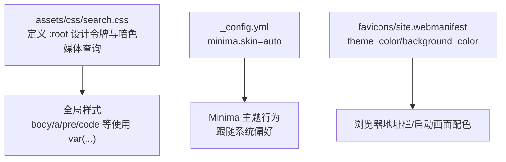
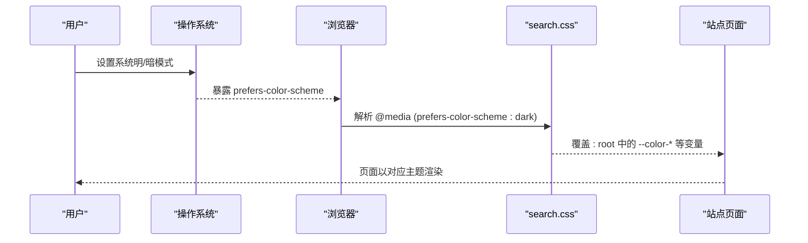
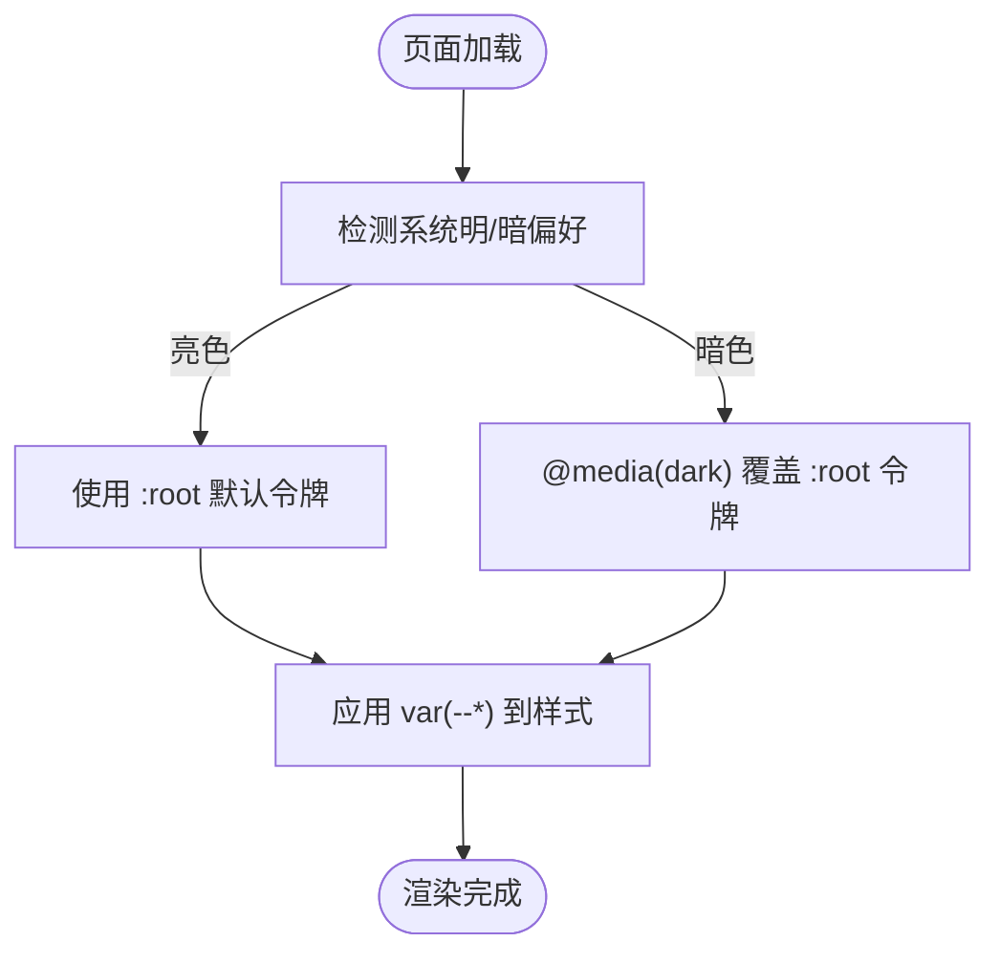
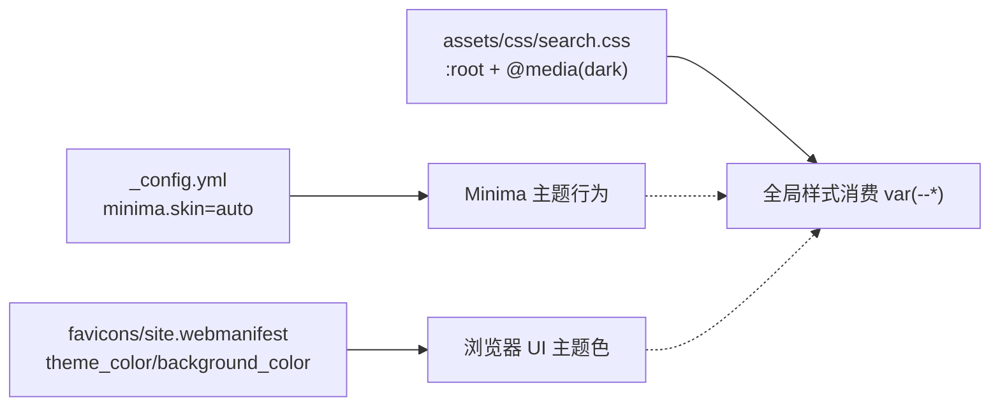

# CSS 变量体系

<cite>
**本文引用的文件**
- [assets/css/search.css](file://assets/css/search.css)
- [README.md](file://README.md)
- [_config.yml](file://_config.yml)
- [favicons/site.webmanifest](file://favicons/site.webmanifest)
</cite>

## 目录
1. [简介](#简介)
2. [项目结构](#项目结构)
3. [核心组件](#核心组件)
4. [架构总览](#架构总览)
5. [详细组件分析](#详细组件分析)
6. [依赖关系分析](#依赖关系分析)
7. [性能与可维护性建议](#性能与可维护性建议)
8. [故障排查指南](#故障排查指南)
9. [结论](#结论)
10. [附录：命名规范与最佳实践](#附录：命名规范与最佳实践)

## 简介
本项目基于 Jekyll + Minima 主题，采用“简约清爽”风格，并通过 CSS Custom Properties（CSS 变量）构建统一的设计令牌体系。该体系覆盖颜色、字体、圆角、阴影、过渡等维度，并支持亮色/暗色模式自动切换。本文聚焦于设计令牌的定义、作用域、继承关系、主题切换机制以及调试方法，帮助读者在现有基础上扩展新的令牌并保持系统一致性。

## 项目结构
与 CSS 变量体系直接相关的资源如下：
- 设计令牌与样式实现：assets/css/search.css
- 站点配置（主题皮肤策略）：_config.yml
- 项目说明（特性概览）：README.md
- PWA 清单（浏览器主题色，独立于页面主题）：favicons/site.webmanifest

图表来源
- [assets/css/search.css:7-58](file://assets/css/search.css#L7-L58)
- [_config.yml:12-15](file://_config.yml#L12-L15)
- [favicons/site.webmanifest:18-20](file://favicons/site.webmanifest#L18-L20)

章节来源
- [README.md:12-17](file://README.md#L12-L17)
- [_config.yml:12-15](file://_config.yml#L12-L15)

## 核心组件
- 设计令牌根节点：通过 :root 声明一组语义化变量，作为全站点共享的“单一事实来源”。
- 暗色模式令牌：通过 @media (prefers-color-scheme: dark) 覆盖 :root 中的同名变量，实现无 JS 的主题切换。
- 样式消费层：全局样式大量使用 var(--token) 引用令牌，确保主题切换时一处定义、处处生效。

章节来源
- [assets/css/search.css:7-35](file://assets/css/search.css#L7-L35)
- [assets/css/search.css:38-58](file://assets/css/search.css#L38-L58)
- [assets/css/search.css:69-76](file://assets/css/search.css#L69-L76)

## 架构总览
本项目的主题切换由两层协同完成：
- 浏览器能力层：通过 prefers-color-scheme 媒体查询自动识别用户系统级明/暗偏好。
- 站点配置层：Jekyll 主题 Minima 的 skin 设置为 auto，遵循系统偏好。
- 自定义令牌层：search.css 在 :root 中提供默认亮色令牌，并在暗色媒体查询中覆盖为暗色令牌。

图表来源
- [assets/css/search.css:38-58](file://assets/css/search.css#L38-L58)
- [_config.yml:12-15](file://_config.yml#L12-L15)

## 详细组件分析

### 设计令牌分类与作用域
- 颜色令牌
  - 背景类：--color-bg、--color-bg-elevated、--color-bg-subtle
  - 文本类：--color-text、--color-text-secondary、--color-text-muted
  - 边框类：--color-border、--color-border-subtle
  - 强调色类：--color-accent、--color-accent-hover、--color-accent-bg、--color-accent-text
  - 高亮类：--color-highlight、--color-highlight-bg
- 几何与视觉令牌
  - 圆角：--radius-sm、--radius-md、--radius-lg
  - 阴影：--shadow-sm、--shadow-md
- 字体令牌
  - 正文：--font-sans
  - 代码：--font-mono
- 动效令牌
  - --transition-fast、--transition-normal

作用域与继承
- 所有令牌均定义在 :root，具备文档级作用域，子元素可直接继承使用。
- 暗色模式下，同一组变量名在媒体查询中被覆盖，形成“同键不同值”的继承替换。

章节来源
- [assets/css/search.css:7-35](file://assets/css/search.css#L7-L35)
- [assets/css/search.css:38-58](file://assets/css/search.css#L38-L58)

### 亮色/暗色模式切换机制
- 自动切换：依赖 prefers-color-scheme: dark 媒体查询，无需 JavaScript。
- 主题策略：_config.yml 中 minima.skin 设为 auto，使 Minima 主题也跟随系统偏好。
- 令牌覆盖：暗色媒体查询内重新赋值 :root 下的同名变量，从而驱动全站样式变化。

图表来源
- [assets/css/search.css:38-58](file://assets/css/search.css#L38-L58)
- [_config.yml:12-15](file://_config.yml#L12-L15)

章节来源
- [assets/css/search.css:38-58](file://assets/css/search.css#L38-L58)
- [_config.yml:12-15](file://_config.yml#L12-L15)

### 变量使用示例（路径引用）
- 全局文本与背景
  - body 使用 --font-sans、--color-text、--color-bg
    - 参考：[assets/css/search.css:69-76](file://assets/css/search.css#L69-L76)
- 链接强调色
  - a 使用 --color-accent 与 --color-accent-hover
    - 参考：[assets/css/search.css:83-92](file://assets/css/search.css#L83-L92)
- 代码块
  - pre/code 使用 --font-mono、--color-bg-subtle、--color-border-subtle
    - 参考：[assets/css/search.css:105-132](file://assets/css/search.css#L105-L132)
- 搜索输入框
  - .search-input 使用 --color-border、--color-bg-subtle、--color-text、--color-accent 等
    - 参考：[assets/css/search.css:229-260](file://assets/css/search.css#L229-L260)
- 归档卡片
  - .archive-year 使用 --color-border、--radius-md、--color-bg-elevated、--shadow-sm
    - 参考：[assets/css/search.css:712-724](file://assets/css/search.css#L712-L724)
- 文章标题
  - .post-title 使用 --color-text
    - 参考：[assets/css/search.css:526-532](file://assets/css/search.css#L526-L532)

章节来源
- [assets/css/search.css:69-76](file://assets/css/search.css#L69-L76)
- [assets/css/search.css:83-92](file://assets/css/search.css#L83-L92)
- [assets/css/search.css:105-132](file://assets/css/search.css#L105-L132)
- [assets/css/search.css:229-260](file://assets/css/search.css#L229-L260)
- [assets/css/search.css:712-724](file://assets/css/search.css#L712-L724)
- [assets/css/search.css:526-532](file://assets/css/search.css#L526-L532)

### 如何添加新的设计令牌（步骤与示例路径）
- 步骤
  1) 在 :root 中新增亮色令牌（例如 --color-success、--radius-xl）。
     - 参考位置：[assets/css/search.css:7-35](file://assets/css/search.css#L7-L35)
  2) 在 @media (prefers-color-scheme: dark) 中为同名令牌提供暗色值。
     - 参考位置：[assets/css/search.css:38-58](file://assets/css/search.css#L38-L58)
  3) 在需要使用的样式中通过 var(--token) 引用新令牌。
     - 参考用法：[assets/css/search.css:69-76](file://assets/css/search.css#L69-L76)、[assets/css/search.css:229-260](file://assets/css/search.css#L229-L260)
- 注意事项
  - 保持命名一致性与层级清晰，避免硬编码颜色或尺寸。
  - 若新增令牌影响交互态（如 hover/focus），请同时考虑明/暗两套值。

章节来源
- [assets/css/search.css:7-35](file://assets/css/search.css#L7-L35)
- [assets/css/search.css:38-58](file://assets/css/search.css#L38-L58)
- [assets/css/search.css:69-76](file://assets/css/search.css#L69-L76)
- [assets/css/search.css:229-260](file://assets/css/search.css#L229-L260)

### 变量继承关系与作用域管理
- 继承关系
  - :root 定义的令牌对整篇文档可见，子选择器可直接读取。
  - 暗色媒体查询仅覆盖同名令牌，其余令牌保持不变。
- 作用域管理
  - 当前方案采用文档级作用域，便于统一主题切换。
  - 如需局部主题隔离，可在特定容器上重新声明同名变量，形成更细粒度的覆盖。

章节来源
- [assets/css/search.css:7-35](file://assets/css/search.css#L7-L35)
- [assets/css/search.css:38-58](file://assets/css/search.css#L38-L58)

### 浏览器开发者工具调试技巧
- 查看计算后的变量值
  - 打开 Elements/Styles 面板，选中任意使用 var(--*) 的元素，查看 Computed 中变量的最终值。
- 定位变量来源
  - 在 Styles 面板点击某个 var(--*)，可查看其定义位置（:root 或媒体查询）。
- 验证暗色模式
  - 在 Emulation/Device Preferences 中切换 prefers-color-scheme，观察变量是否按预期覆盖。
- 快速对比明/暗差异
  - 分别记录关键令牌在两种模式下的取值，确认对比度与可读性。

[本节为通用调试指导，不直接分析具体文件]

## 依赖关系分析
- search.css 是设计令牌与样式消费的核心文件，承担“定义 + 覆盖 + 使用”的职责。
- _config.yml 控制 Minima 主题的明/暗策略，与 CSS 媒体查询共同决定最终主题。
- favicons/site.webmanifest 定义浏览器 UI 层面的主题色，与页面内容主题相互独立。

图表来源
- [_config.yml:12-15](file://_config.yml#L12-L15)
- [assets/css/search.css:7-58](file://assets/css/search.css#L7-L58)
- [favicons/site.webmanifest:18-20](file://favicons/site.webmanifest#L18-L20)

章节来源
- [_config.yml:12-15](file://_config.yml#L12-L15)
- [assets/css/search.css:7-58](file://assets/css/search.css#L7-L58)
- [favicons/site.webmanifest:18-20](file://favicons/site.webmanifest#L18-L20)

## 性能与可维护性建议
- 集中管理：将全部设计令牌集中在 :root，减少重复定义，提升可维护性。
- 语义化命名：使用功能语义（如 --color-accent）而非外观语义（如 --color-blue），增强跨主题复用能力。
- 渐进增强：优先使用 CSS 媒体查询进行主题切换；仅在需要用户手动切换时引入 JavaScript。
- 对比度检查：为新令牌补充明/暗两套值，并确保满足 WCAG 对比度要求。
- 渐进扩展：新增令牌后，逐步替换旧硬编码值，降低回归风险。

[本节为通用建议，不直接分析具体文件]

## 故障排查指南
- 现象：切换系统明/暗后页面未变
  - 检查 _config.yml 中 minima.skin 是否为 auto。
    - 参考：[_config.yml:12-15](file://_config.yml#L12-L15)
  - 检查 search.css 中是否存在对应的 @media (prefers-color-scheme: dark) 覆盖。
    - 参考：[assets/css/search.css:38-58](file://assets/css/search.css#L38-L58)
- 现象：部分组件未按预期变暗
  - 在 Elements 面板中检查该组件是否使用了 var(--*)，并确认对应令牌在暗色媒体查询中已覆盖。
    - 参考：[assets/css/search.css:38-58](file://assets/css/search.css#L38-L58)
- 现象：PWA 图标或地址栏颜色与页面不一致
  - 检查 favicons/site.webmanifest 中的 theme_color/background_color 是否与页面主题匹配。
    - 参考：[favicons/site.webmanifest:18-20](file://favicons/site.webmanifest#L18-L20)

章节来源
- [_config.yml:12-15](file://_config.yml#L12-L15)
- [assets/css/search.css:38-58](file://assets/css/search.css#L38-L58)
- [favicons/site.webmanifest:18-20](file://favicons/site.webmanifest#L18-L20)

## 结论
本项目通过 :root 集中定义设计令牌，并以 prefers-color-scheme 媒体查询实现零侵入的明/暗主题切换。配合 Jekyll 主题配置与统一的样式消费方式，形成了可扩展、易维护的 CSS 变量体系。遵循本文的命名规范与实践建议，可在不破坏既有体验的前提下持续扩展新的设计令牌。

[本节为总结性内容，不直接分析具体文件]

## 附录：命名规范与最佳实践
- 命名约定
  - 前缀：按类别分组，如 color-、radius-、shadow-、font-、transition-。
  - 语义：以用途命名，如 accent、text、bg、border、highlight。
  - 粒度：基础值（sm/md/lg）与状态值（hover/focus/active）分离。
- 最佳实践
  - 始终在 :root 定义亮色默认值，在暗色媒体查询中覆盖同名变量。
  - 避免在组件样式中硬编码颜色或尺寸，一律通过 var(--*) 引用。
  - 新增令牌需同步提供明/暗两套值，并进行对比度校验。
  - 定期清理未被引用的令牌，保持令牌表精简。

[本节为通用规范，不直接分析具体文件]