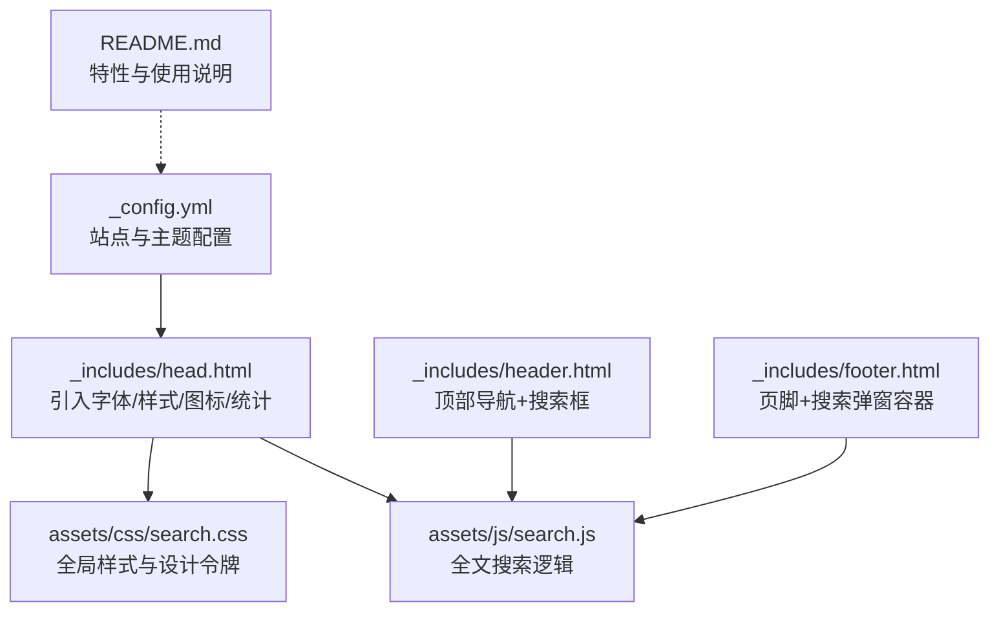
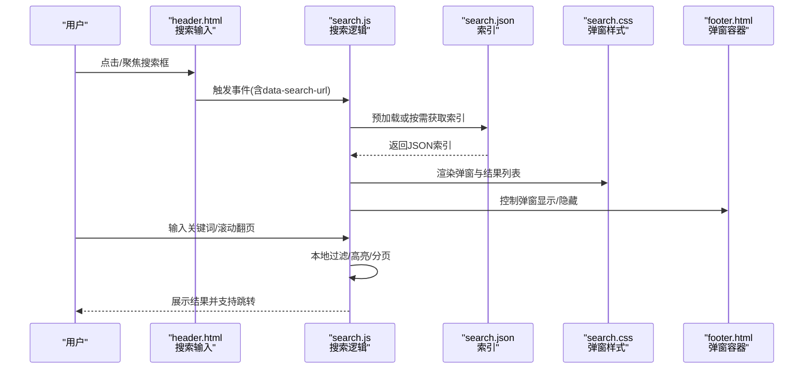
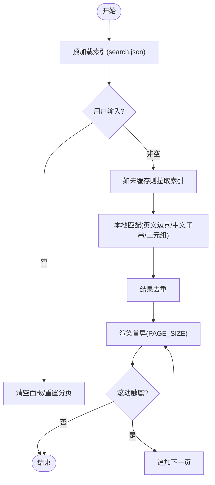
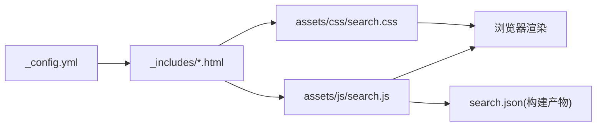

# 主题定制

<cite>
**本文引用的文件**
- [_config.yml](file://_config.yml)
- [README.md](file://README.md)
- [_includes/head.html](file://_includes/head.html)
- [_includes/header.html](file://_includes/header.html)
- [_includes/footer.html](file://_includes/footer.html)
- [assets/css/search.css](file://assets/css/search.css)
- [assets/js/search.js](file://assets/js/search.js)
</cite>

## 目录
1. [简介](#简介)
2. [项目结构](#项目结构)
3. [核心组件](#核心组件)
4. [架构总览](#架构总览)
5. [详细组件分析](#详细组件分析)
6. [依赖关系分析](#依赖关系分析)
7. [性能与体验优化](#性能与体验优化)
8. [故障排查指南](#故障排查指南)
9. [结论](#结论)
10. [附录：常用定制清单与示例路径](#附录常用定制清单与示例路径)

## 简介
本指南面向希望深度定制 Minima 主题外观与功能的用户，围绕站点配置、字体与 CSS 变量体系、搜索弹窗样式、响应式与暗色模式等维度，提供从“改配置”到“写样式/脚本”的完整路径。你将学会如何：
- 通过 _config.yml 管理站点基本信息、社交链接、头像与 Favicon、Minima 皮肤等
- 使用 Inter 正文字体与 JetBrains Mono 代码字体
- 基于 CSS 变量设计令牌快速统一换肤
- 定制搜索弹窗的视觉与交互
- 适配移动端与开启系统级暗色模式
- 参考实际文件路径进行二次开发

## 项目结构
本项目在官方 Minima 基础上进行了深度定制，关键资源分布如下：
- 站点配置：_config.yml
- 页面头部与全局资源引入：_includes/head.html
- 顶部导航与搜索入口：_includes/header.html
- 页脚与搜索弹窗容器：_includes/footer.html
- 搜索样式与交互：assets/css/search.css、assets/js/search.js
- 说明文档与特性概览：README.md

图表来源
- [_config.yml:1-45](file://_config.yml#L1-L45)
- [_includes/head.html:1-27](file://_includes/head.html#L1-L27)
- [_includes/header.html:1-11](file://_includes/header.html#L1-L11)
- [_includes/footer.html:1-34](file://_includes/footer.html#L1-L34)
- [assets/css/search.css:1-1306](file://assets/css/search.css#L1-L1306)
- [assets/js/search.js:1-573](file://assets/js/search.js#L1-L573)
- [README.md:1-331](file://README.md#L1-L331)

章节来源
- [README.md:26-62](file://README.md#L26-L62)

## 核心组件
- 站点与主题配置（_config.yml）
  - 站点信息：标题、邮箱、描述、作者、URL、baseurl
  - 主题与皮肤：theme、minima.skin、minima.date_format
  - 社交链接：github_username、zhihu_username
  - 头像与图标：avatar、favicon
  - 评论与分析：disqus.shortname、google_analytics
  - 构建选项：permalink、markdown、highlighter、plugins
- 全局资源引入（_includes/head.html）
  - Google Fonts 预连接与 Inter 字体加载
  - 主样式与搜索样式引入
  - Favicons 多尺寸与 manifest
  - 生产环境注入 GA 统计
  - 延迟加载搜索脚本
- 顶部导航与搜索入口（_includes/header.html）
  - 站点标题链接
  - 搜索输入框与字符计数提示
  - 数据属性 data-search-url 指向 search.json
- 页脚与搜索弹窗容器（_includes/footer.html）
  - 联系信息与社交链接
  - 搜索弹窗 DOM 容器与关闭按钮
- 搜索样式（assets/css/search.css）
  - CSS 变量设计令牌（颜色、圆角、阴影、字体、过渡）
  - 暗色模式覆盖（prefers-color-scheme: dark）
  - 全局排版、代码块、引用块、表格、头部吸顶、搜索框与弹窗、文章排版、首页归档、页脚、目录侧边栏等
- 搜索脚本（assets/js/search.js）
  - 索引预加载、去重、关键词匹配（英文单词边界/中文子串）、中文二元组模糊匹配
  - 结果分页加载、滚动触底加载更多
  - 弹窗打开/关闭、背景锁定滚动、ESC 关闭、点击遮罩关闭
  - 同步弹窗内输入与头部搜索框、字符计数

章节来源
- [_config.yml:1-45](file://_config.yml#L1-L45)
- [_includes/head.html:1-27](file://_includes/head.html#L1-L27)
- [_includes/header.html:1-11](file://_includes/header.html#L1-L11)
- [_includes/footer.html:1-34](file://_includes/footer.html#L1-L34)
- [assets/css/search.css:1-1306](file://assets/css/search.css#L1-L1306)
- [assets/js/search.js:1-573](file://assets/js/search.js#L1-L573)

## 架构总览
下图展示了“配置 → 模板 → 资源 → 运行时”的整体链路，以及搜索功能的关键交互流程。

图表来源
- [_includes/header.html:1-11](file://_includes/header.html#L1-L11)
- [_includes/footer.html:1-34](file://_includes/footer.html#L1-L34)
- [assets/js/search.js:1-573](file://assets/js/search.js#L1-L573)
- [assets/css/search.css:1-1306](file://assets/css/search.css#L1-L1306)

## 详细组件分析

### 站点配置（_config.yml）
- 站点基本信息
  - title、email、description、author、url、baseurl
- 主题与皮肤
  - theme: minima
  - minima.skin: auto/classic/dark
  - minima.date_format: 日期格式
- 社交链接
  - github_username、zhihu_username
- 头像与图标
  - avatar、favicon
- 评论与分析
  - disqus.shortname
  - google_analytics
- 构建与插件
  - permalink、markdown、highlighter、plugins

定制要点
- 修改站点名、描述、作者后，需重启本地服务以生效
- 切换 skin 可快速改变明暗基调；auto 跟随系统偏好
- 社交链接由模板读取 site.* 变量渲染

章节来源
- [_config.yml:1-45](file://_config.yml#L1-L45)
- [README.md:310-321](file://README.md#L310-L321)

### 字体与全局样式（Inter + JetBrains Mono）
- 字体加载
  - 通过 Google Fonts 引入 Inter 字族（包含多个字重）
  - 代码字体使用 JetBrains Mono（作为首选），并提供回退栈
- 字体应用
  - 正文使用 --font-sans（Inter）
  - 代码块与行内代码使用 --font-mono（JetBrains Mono）
- 自定义技巧
  - 如需更换字体，可在 head.html 中替换 Google Fonts 链接，并在 search.css 的 :root 中调整 --font-sans / --font-mono

章节来源
- [_includes/head.html:6-10](file://_includes/head.html#L6-L10)
- [assets/css/search.css:30-35](file://assets/css/search.css#L30-L35)
- [assets/css/search.css:104-108](file://assets/css/search.css#L104-L108)
- [README.md:322-328](file://README.md#L322-L328)

### CSS 变量设计体系与覆盖策略
- 设计令牌（Design Tokens）
  - 颜色：背景、文本、边框、强调色、高亮等
  - 圆角与阴影：--radius-*、--shadow-*
  - 字体：--font-sans、--font-mono
  - 动效：--transition-fast、--transition-normal
- 暗色模式
  - 使用 @media (prefers-color-scheme: dark) 覆盖 :root 中的变量
- 覆盖建议
  - 优先在 :root 下新增或覆盖变量，避免直接硬编码颜色值
  - 针对特定组件的样式，尽量复用变量，保持主题一致性
  - 若需强制覆盖第三方样式，使用更高优先级选择器或 !important（谨慎使用）

章节来源
- [assets/css/search.css:7-58](file://assets/css/search.css#L7-L58)
- [assets/css/search.css:69-76](file://assets/css/search.css#L69-L76)
- [assets/css/search.css:104-144](file://assets/css/search.css#L104-L144)

### 搜索弹窗样式定制（assets/css/search.css）
- 关键类名与作用
  - .search-results：全屏遮罩容器
  - .search-results-panel：结果面板（滚动区域）
  - .search-overlay-input：弹窗内搜索栏（与头部联动）
  - .search-result-item / .search-result-title / .search-result-snippet：结果条目
  - .search-loading / .search-no-result / .search-error：状态提示
- 定制方向
  - 面板宽度、圆角、阴影、背景色
  - 输入框焦点态、占位符、字符计数位置
  - 结果项悬停效果、标签样式、摘要行数限制
  - 小屏适配（max-width: 600px）下的全屏化布局
- 交互增强
  - 滚动条美化、滚动到底部自动加载更多
  - ESC 关闭、点击遮罩关闭（防误触）

章节来源
- [assets/css/search.css:477-727](file://assets/css/search.css#L477-L727)
- [assets/css/search.css:599-702](file://assets/css/search.css#L599-L702)
- [assets/css/search.css:704-727](file://assets/css/search.css#L704-L727)

### 搜索交互逻辑（assets/js/search.js）
- 索引加载与缓存
  - 页面加载时预取 search.json，失败则静默处理
  - 首次搜索或弹窗内输入变化时按需拉取
- 匹配算法
  - 英文：单词边界匹配（\b...）
  - 中文：子串匹配 + 连续中文二元组模糊评分
- 结果渲染
  - 标题与摘要高亮（<em>）
  - 分类标签、日期元信息
  - 分页加载（PAGE_SIZE=8），滚动触底继续加载
- 弹窗控制
  - 打开时锁定 body 滚动并记录 scrollY
  - 关闭时恢复滚动位置并取消焦点
  - 支持 ESC 键关闭、点击遮罩关闭（防选中文字误触）

图表来源
- [assets/js/search.js:28-37](file://assets/js/search.js#L28-L37)
- [assets/js/search.js:219-223](file://assets/js/search.js#L219-L223)
- [assets/js/search.js:225-252](file://assets/js/search.js#L225-L252)
- [assets/js/search.js:314-323](file://assets/js/search.js#L314-L323)
- [assets/js/search.js:325-401](file://assets/js/search.js#L325-L401)
- [assets/js/search.js:414-484](file://assets/js/search.js#L414-L484)

章节来源
- [assets/js/search.js:1-573](file://assets/js/search.js#L1-L573)

### 响应式设计与暗色模式
- 响应式
  - 头部搜索框在小屏隐藏（≤600px）
  - 搜索结果面板在小屏全屏铺满
  - 内容区最大宽度与留白随视口自适应
- 暗色模式
  - 基于 prefers-color-scheme: dark 覆盖 :root 变量
  - 代码块、引用块、弹窗、表格等均有暗色适配

章节来源
- [assets/css/search.css:461-471](file://assets/css/search.css#L461-L471)
- [assets/css/search.css:704-727](file://assets/css/search.css#L704-L727)
- [assets/css/search.css:37-58](file://assets/css/search.css#L37-L58)
- [assets/css/search.css:258-268](file://assets/css/search.css#L258-L268)
- [assets/css/search.css:321-332](file://assets/css/search.css#L321-L332)

## 依赖关系分析
- 配置层
  - _config.yml 提供站点与主题参数，被模板与插件读取
- 模板层
  - head.html 负责引入字体、样式、图标、统计与搜索脚本
  - header.html 提供搜索输入与 data-search-url
  - footer.html 提供搜索弹窗容器与关闭按钮
- 资源层
  - search.css 定义全局样式与搜索弹窗 UI
  - search.js 实现搜索逻辑并与 DOM/CSS 协同
- 外部依赖
  - Google Fonts（Inter）
  - GitHub Pages 构建产物（search.json 由 Jekyll 生成）

图表来源
- [_config.yml:1-45](file://_config.yml#L1-L45)
- [_includes/head.html:1-27](file://_includes/head.html#L1-L27)
- [_includes/header.html:1-11](file://_includes/header.html#L1-L11)
- [_includes/footer.html:1-34](file://_includes/footer.html#L1-L34)
- [assets/css/search.css:1-1306](file://assets/css/search.css#L1-L1306)
- [assets/js/search.js:1-573](file://assets/js/search.js#L1-L573)

章节来源
- [README.md:26-62](file://README.md#L26-L62)

## 性能与体验优化
- 字体加载
  - 使用 preconnect 减少 DNS/TLS 握手开销
  - 仅加载必要字重，避免冗余请求
- 搜索性能
  - 索引预加载，避免首次搜索卡顿
  - 本地分词与高亮，减少网络往返
  - 分页加载与 requestAnimationFrame 渲染，降低主线程压力
- 样式与动画
  - 使用 CSS 变量与 transition，避免频繁重排
  - 小屏下简化弹窗布局，提升触控体验

[本节为通用指导，不直接分析具体文件]

## 故障排查指南
- 修改 _config.yml 后未生效
  - 重启 jekyll serve，必要时清理 _site 后重新构建
- 搜索无结果或报错
  - 确认 search.json 存在且可访问
  - 检查 data-search-url 是否正确指向 /search.json
  - 查看控制台是否有跨域或网络错误
- 弹窗无法关闭或页面滚动异常
  - 检查是否被其他脚本阻止默认行为
  - 确认 ESC 与点击遮罩事件绑定正常
- 暗色模式不生效
  - 确认浏览器支持 prefers-color-scheme
  - 检查是否存在覆盖 :root 变量的冲突样式

章节来源
- [README.md:281-294](file://README.md#L281-L294)
- [_includes/header.html:5-8](file://_includes/header.html#L5-L8)
- [_includes/footer.html:30-34](file://_includes/footer.html#L30-L34)
- [assets/js/search.js:147-192](file://assets/js/search.js#L147-L192)
- [assets/js/search.js:212-217](file://assets/js/search.js#L212-L217)

## 结论
通过 _config.yml 集中管理站点与主题设置，配合 CSS 变量设计令牌与 Inter/JetBrains Mono 字体体系，可以快速实现一致的主题风格。搜索弹窗采用“预加载索引 + 本地匹配 + 分页渲染”的策略，兼顾性能与体验。借助响应式断点与暗色模式媒体查询，可在多设备与多主题环境下获得良好表现。建议在定制过程中优先复用变量、最小化覆盖范围，并保持样式与脚本的可维护性。

[本节为总结性内容，不直接分析具体文件]

## 附录：常用定制清单与示例路径
- 修改站点名称/描述/作者/邮箱
  - 路径：[_config.yml:1-10](file://_config.yml#L1-L10)
- 切换 Minima 皮肤（auto/classic/dark）
  - 路径：[_config.yml:12-16](file://_config.yml#L12-L16)
- 添加/修改社交链接（GitHub、知乎等）
  - 路径：[_config.yml:20-23](file://_config.yml#L20-L23)
- 更换头像与 Favicon
  - 路径：[_config.yml:24-26](file://_config.yml#L24-L26)
- 启用/禁用 Disqus 评论
  - 路径：[_config.yml:28-31](file://_config.yml#L28-L31)
- 启用/修改 Google Analytics
  - 路径：[_config.yml:32-33](file://_config.yml#L32-L33)
- 更换正文/代码字体
  - 路径：[_includes/head.html:6-10](file://_includes/head.html#L6-L10)、[assets/css/search.css:30-35](file://assets/css/search.css#L30-L35)
- 调整搜索弹窗尺寸/圆角/阴影
  - 路径：[assets/css/search.css:477-509](file://assets/css/search.css#L477-L509)
- 调整搜索输入框焦点态与字符计数
  - 路径：[assets/css/search.css:409-459](file://assets/css/search.css#L409-L459)
- 调整结果项高亮与摘要行数
  - 路径：[assets/css/search.css:625-678](file://assets/css/search.css#L625-L678)
- 调整分页大小与滚动加载阈值
  - 路径：[assets/js/search.js:16-21](file://assets/js/search.js#L16-L21)、[assets/js/search.js:414-484](file://assets/js/search.js#L414-L484)
- 调整暗色模式配色
  - 路径：[assets/css/search.css:37-58](file://assets/css/search.css#L37-L58)