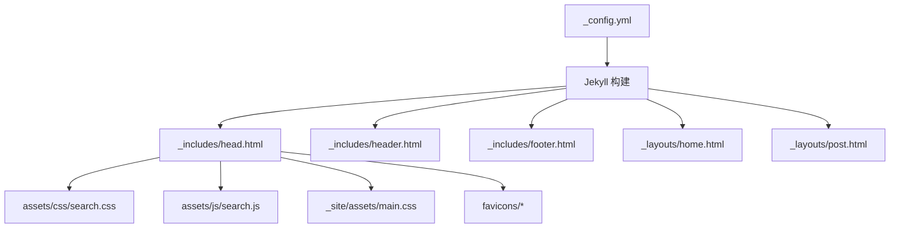
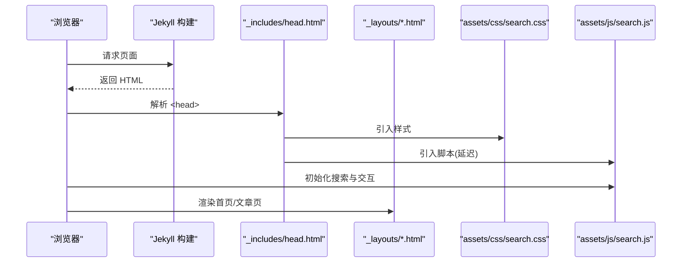
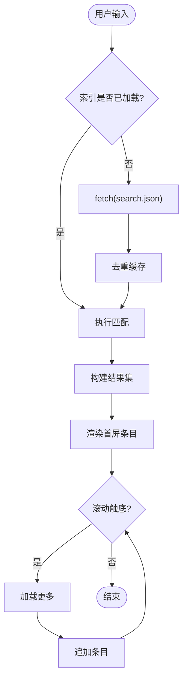
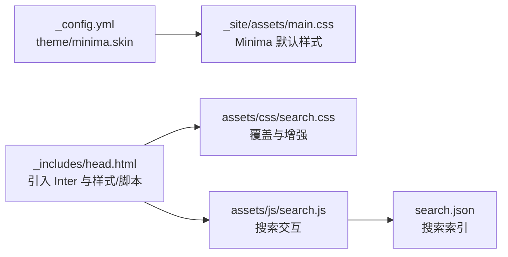

# 主题定制

<cite>
**本文引用的文件**   
- [_config.yml](file://_config.yml)
- [_includes/head.html](file://_includes/head.html)
- [_includes/header.html](file://_includes/header.html)
- [_includes/footer.html](file://_includes/footer.html)
- [_layouts/home.html](file://_layouts/home.html)
- [_layouts/post.html](file://_layouts/post.html)
- [assets/css/search.css](file://assets/css/search.css)
- [assets/js/search.js](file://assets/js/search.js)
- [_site/assets/main.css](file://_site/assets/main.css)
- [favicons/site.webmanifest](file://favicons/site.webmanifest)
</cite>

## 目录
1. [简介](#简介)
2. [项目结构](#项目结构)
3. [核心组件](#核心组件)
4. [架构总览](#架构总览)
5. [详细组件分析](#详细组件分析)
6. [依赖关系分析](#依赖关系分析)
7. [性能与优化](#性能与优化)
8. [故障排查指南](#故障排查指南)
9. [结论](#结论)
10. [附录：样式修改示例](#附录样式修改示例)

## 简介
本仓库基于 Jekyll 官方 Minima 主题进行深度定制，目标是打造“简约清爽”的阅读体验。主要特性包括：
- 使用 CSS Custom Properties（CSS 变量）构建设计令牌体系，统一颜色、圆角、阴影、字体与过渡时长等视觉规范
- 亮色/暗色模式自动切换，遵循系统偏好
- Inter 字体集成，代码区采用等宽字体
- 首页支持分类/日期双视图归档切换
- 文章页内置目录侧边栏，支持滚动高亮与移动端折叠
- 全文搜索弹窗，支持中文子串匹配与英文单词边界匹配，具备分页加载与摘要高亮
- 响应式布局适配移动端与小屏设备

## 项目结构
本项目采用 Jekyll 标准目录组织方式，关键路径如下：
- 配置与主题开关：_config.yml
- 页面模板：_layouts/{home,post}.html
- 可复用片段：_includes/{head,header,footer}.html
- 自定义样式与脚本：assets/css/search.css、assets/js/search.js
- 站点资源：favicons/*、_site/assets/main.css（Minima 默认样式编译产物）

图表来源
- [_config.yml:1-45](file://_config.yml#L1-L45)
- [_includes/head.html:1-26](file://_includes/head.html#L1-L26)
- [_includes/header.html:1-10](file://_includes/header.html#L1-L10)
- [_includes/footer.html:1-34](file://_includes/footer.html#L1-L34)
- [_layouts/home.html:1-135](file://_layouts/home.html#L1-L135)
- [_layouts/post.html:1-105](file://_layouts/post.html#L1-L105)
- [assets/css/search.css:1-1088](file://assets/css/search.css#L1-L1088)
- [assets/js/search.js:1-526](file://assets/js/search.js#L1-L526)
- [_site/assets/main.css:1-506](file://_site/assets/main.css#L1-L506)
- [favicons/site.webmanifest:1-21](file://favicons/site.webmanifest#L1-L21)

章节来源
- [_config.yml:1-45](file://_config.yml#L1-L45)
- [_includes/head.html:1-26](file://_includes/head.html#L1-L26)

## 核心组件
- 设计令牌与明暗模式
  - 通过 :root 定义全局 CSS 变量，并在 prefers-color-scheme: dark 媒体查询中覆盖，实现自动明暗切换
  - 变量涵盖背景、文本、强调色、边框、圆角、阴影、字体族与过渡时长
- 头部与搜索入口
  - 吸顶导航，包含站点标题与搜索输入框；搜索框点击或聚焦后打开全屏弹窗
- 首页归档视图
  - 提供“分类”和“日期”两种视图，支持折叠展开与计数显示
- 文章页排版与目录
  - 标题层级字号与间距优化，正文阅读宽度控制；自动生成目录侧边栏并随滚动高亮
- 搜索功能
  - 预加载 search.json 索引，支持中英文混合检索、结果分页加载、摘要高亮与标签展示
- 图标与 PWA 基础
  - favicons 与 site.webmanifest 配置，便于多端图标与安装提示

章节来源
- [assets/css/search.css:1-1088](file://assets/css/search.css#L1-L1088)
- [_includes/header.html:1-10](file://_includes/header.html#L1-L10)
- [_layouts/home.html:1-135](file://_layouts/home.html#L1-L135)
- [_layouts/post.html:1-105](file://_layouts/post.html#L1-L105)
- [assets/js/search.js:1-526](file://assets/js/search.js#L1-L526)
- [favicons/site.webmanifest:1-21](file://favicons/site.webmanifest#L1-L21)

## 架构总览
整体渲染流程由 Jekyll 驱动，头信息片段注入字体与样式，页面模板组合内容，最终输出静态 HTML。

图表来源
- [_includes/head.html:1-26](file://_includes/head.html#L1-L26)
- [_layouts/home.html:1-135](file://_layouts/home.html#L1-L135)
- [_layouts/post.html:1-105](file://_layouts/post.html#L1-L105)
- [assets/css/search.css:1-1088](file://assets/css/search.css#L1-L1088)
- [assets/js/search.js:1-526](file://assets/js/search.js#L1-L526)

## 详细组件分析

### 设计令牌与明暗模式
- 令牌类别
  - 色彩：背景、文本、强调色、高亮、边框
  - 几何：圆角半径
  - 阴影：小/中等阴影
  - 字体：无衬线主字体与等宽代码字体
  - 动效：过渡时长
- 明暗模式机制
  - 在 prefers-color-scheme: dark 下覆盖 :root 变量，无需额外脚本即可跟随系统主题
- 字体策略
  - 主字体优先 Inter，回退到系统无衬线栈；代码字体优先 JetBrains Mono/Fira Code/Cascadia Code，回退到 Consolas

章节来源
- [assets/css/search.css:1-1088](file://assets/css/search.css#L1-L1088)
- [_includes/head.html:6-8](file://_includes/head.html#L6-L8)

### 头部组件（吸顶导航 + 搜索入口）
- 结构要点
  - 吸顶定位、毛玻璃背景、底部边框分隔
  - Flex 布局对齐站点标题与搜索框
  - 搜索框带内嵌 SVG 图标与焦点态高亮
- 交互要点
  - 点击或聚焦搜索框触发全屏搜索弹窗
  - 弹窗遮罩点击关闭，同时恢复页面滚动位置

章节来源
- [_includes/header.html:1-10](file://_includes/header.html#L1-L10)
- [assets/css/search.css:178-272](file://assets/css/search.css#L178-L272)
- [assets/js/search.js:450-526](file://assets/js/search.js#L450-L526)

### 首页布局（分类/日期双视图）
- 视图切换
  - 顶部按钮切换“分类”和“日期”两个视图容器
- 分类视图
  - 按一级分类分组，二级分类作为月份折叠项，显示文章数量
- 日期视图
  - 按年—月两级折叠，列出每篇文章的日期与标题
- 交互逻辑
  - 纯前端切换显示，不刷新页面

章节来源
- [_layouts/home.html:1-135](file://_layouts/home.html#L1-L135)
- [assets/css/search.css:679-800](file://assets/css/search.css#L679-L800)

### 文章页布局（排版 + 目录侧边栏）
- 排版优化
  - 标题字号使用 clamp 自适应，行高与字重提升可读性
  - 正文最大宽度限制，链接下划线偏移与悬停效果
- 目录侧边栏
  - 自动扫描 h1~h6 生成目录树
  - 点击目录项平滑滚动，移动端点击后自动收起
  - 滚动监听高亮当前章节
- 评论与元数据
  - 可选 Disqus 评论区块
  - 创建/更新时间与作者信息显示

章节来源
- [_layouts/post.html:1-105](file://_layouts/post.html#L1-L105)
- [assets/css/search.css:518-644](file://assets/css/search.css#L518-L644)
- [assets/css/search.css:1044-1087](file://assets/css/search.css#L1044-L1087)

### 搜索功能（弹窗 + 索引 + 匹配算法）
- 索引加载
  - 页面加载时预取 search.json，去重缓存
- 交互流程
  - 点击/聚焦搜索框 → 打开全屏弹窗 → 同步输入值 → 执行搜索
  - 弹窗内输入变化联动主搜索框
- 匹配策略
  - 英文关键词使用单词边界匹配
  - 中文关键词使用子串匹配，长中文词组启用二元组模糊评分
- 结果呈现
  - 分页加载（每次固定条数），滚动到底部自动加载更多
  - 标题与摘要中的关键词高亮，显示日期与标签

图表来源
- [assets/js/search.js:1-526](file://assets/js/search.js#L1-L526)

章节来源
- [assets/js/search.js:1-526](file://assets/js/search.js#L1-L526)
- [_includes/head.html:25](file://_includes/head.html#L25)

### 图标与 PWA 基础
- Favicons 与 Manifest
  - 多种尺寸图标与 Safari 固定标签图标
  - webmanifest 定义应用名称、图标与主题色，便于移动端安装提示

章节来源
- [_includes/head.html:12-21](file://_includes/head.html#L12-L21)
- [favicons/site.webmanifest:1-21](file://favicons/site.webmanifest#L1-L21)

## 依赖关系分析
- 主题与皮肤
  - _config.yml 指定 theme: minima 与 minima.skin: auto，结合 CSS 变量实现明暗模式
- 样式层叠
  - Minima 默认样式位于 _site/assets/main.css，自定义样式 assets/css/search.css 在其之后加载以覆盖默认风格
- 脚本依赖
  - search.js 依赖 search.json 索引与 DOM 节点（搜索框、弹窗容器）
- 字体资源
  - head.html 通过 Google Fonts 引入 Inter 字体，CSS 变量引用该字体族

图表来源
- [_config.yml:10-15](file://_config.yml#L10-L15)
- [_includes/head.html:6-10](file://_includes/head.html#L6-L10)
- [_site/assets/main.css:1-506](file://_site/assets/main.css#L1-L506)
- [assets/css/search.css:1-1088](file://assets/css/search.css#L1-L1088)
- [assets/js/search.js:1-526](file://assets/js/search.js#L1-L526)

章节来源
- [_config.yml:10-15](file://_config.yml#L10-L15)
- [_includes/head.html:6-10](file://_includes/head.html#L6-L10)
- [_site/assets/main.css:1-506](file://_site/assets/main.css#L1-L506)

## 性能与优化
- 字体加载
  - 使用 preconnect 与 display=swap 减少阻塞与闪烁
- 脚本加载
  - 搜索脚本使用 defer 延迟执行，避免阻塞首屏渲染
- 滚动与事件
  - 滚动监听使用 passive: true，降低滚动抖动
- 列表渲染
  - 使用 DocumentFragment 批量插入，减少重排
- 图片与资源
  - 图片设置 max-width 自适应，避免溢出与重绘
- 样式层叠
  - 自定义样式在默认样式之后加载，精准覆盖，避免全局重写

章节来源
- [_includes/head.html:6-8](file://_includes/head.html#L6-L8)
- [_includes/head.html:25](file://_includes/head.html#L25)
- [assets/js/search.js:101](file://assets/js/search.js#L101)
- [assets/js/search.js:409](file://assets/js/search.js#L409)
- [assets/css/search.css:64-76](file://assets/css/search.css#L64-L76)

## 故障排查指南
- 搜索无法加载索引
  - 检查 search.json 是否存在且可访问
  - 确认 search.js 中 data-search-url 指向正确
- 弹窗遮挡或无法关闭
  - 检查遮罩点击事件与选中文字判断逻辑
  - 确认 body 滚动锁定与恢复逻辑未被其他脚本干扰
- 明暗模式未生效
  - 确认浏览器支持 prefers-color-scheme
  - 检查 CSS 变量是否在 :root 与 dark 媒体查询中均定义
- 目录不显示或高亮异常
  - 检查文章内容区域类名是否正确
  - 确认 h1~h6 存在 id 属性（脚本会动态补充）

章节来源
- [assets/js/search.js:112-126](file://assets/js/search.js#L112-L126)
- [assets/js/search.js:166-181](file://assets/js/search.js#L166-L181)
- [assets/js/search.js:132-163](file://assets/js/search.js#L132-L163)
- [assets/css/search.css:37-58](file://assets/css/search.css#L37-L58)
- [_layouts/post.html:54-104](file://_layouts/post.html#L54-L104)

## 结论
本项目在 Minima 基础上通过 CSS 变量设计令牌、自动明暗模式、Inter 字体、响应式排版与全文搜索等功能，构建了简洁、现代、易读的博客主题。模块化结构与清晰的职责划分使得后续扩展与维护成本较低。

## 附录：样式修改示例
以下为常见定制场景与对应参考位置（请根据实际需要在 assets/css/search.css 中调整）：
- 调整强调色与背景色
  - 参考：设计令牌定义与暗色覆盖
  - 路径：[assets/css/search.css:7-58](file://assets/css/search.css#L7-L58)
- 替换主字体为自定义字体
  - 步骤：在 head.html 引入新字体；在 CSS 变量 --font-sans 中更新字体族
  - 路径：[_includes/head.html:6-8](file://_includes/head.html#L6-L8)、[assets/css/search.css:30](file://assets/css/search.css#L30)
- 调整代码块与行内代码样式
  - 参考：pre/code 样式与圆角、边框、背景
  - 路径：[assets/css/search.css:104-132](file://assets/css/search.css#L104-L132)
- 修改文章标题字号与行高
  - 参考：post-title 与 post-content 标题层级样式
  - 路径：[assets/css/search.css:522-618](file://assets/css/search.css#L522-L618)
- 调整首页归档卡片圆角与阴影
  - 参考：archive-year 相关样式
  - 路径：[assets/css/search.css:712-744](file://assets/css/search.css#L712-L744)
- 调整搜索弹窗样式
  - 参考：弹窗面板、输入框、滚动条与结果项样式
  - 路径：[assets/css/search.css:278-516](file://assets/css/search.css#L278-L516)