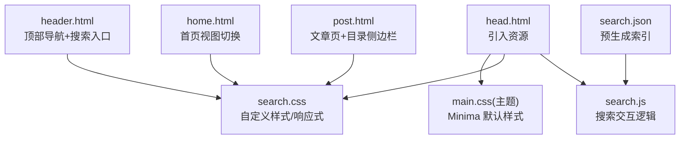
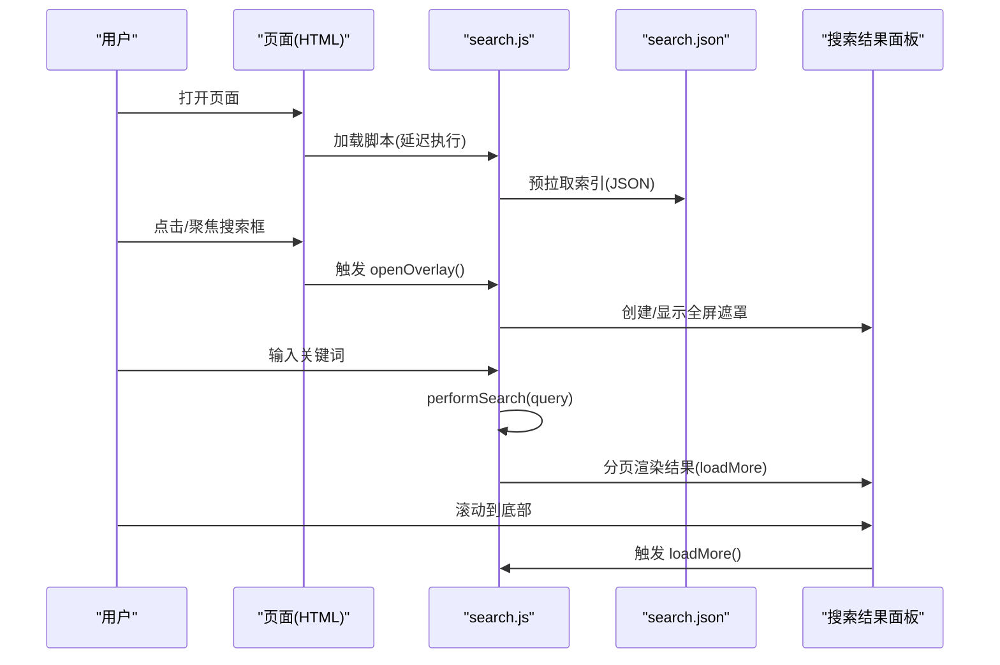
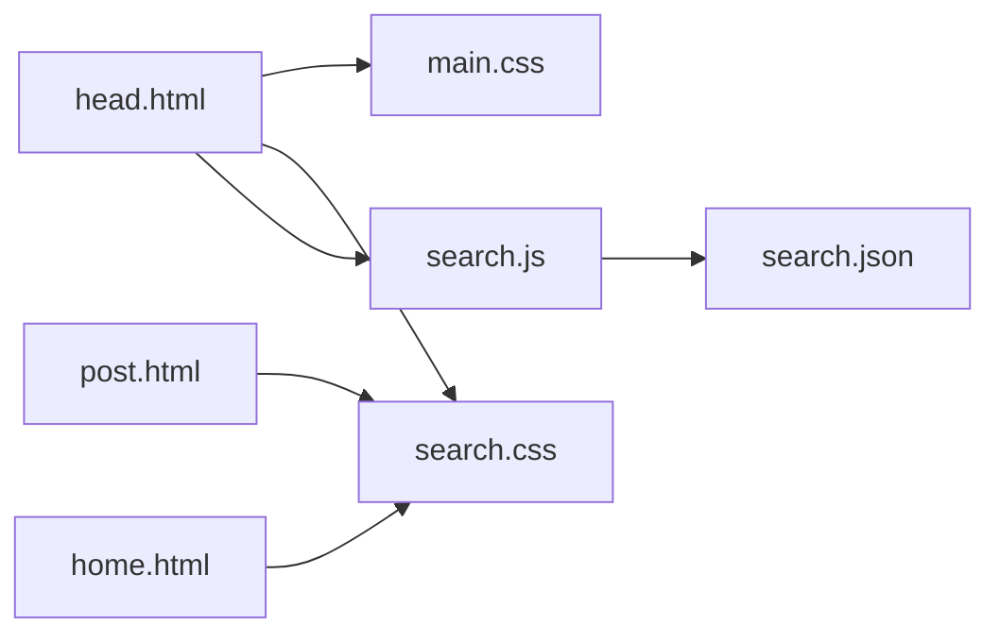

# 响应式设计

<cite>
**本文引用的文件**
- [_includes/head.html](file://_includes/head.html)
- [_includes/header.html](file://_includes/header.html)
- [_includes/footer.html](file://_includes/footer.html)
- [_layouts/home.html](file://_layouts/home.html)
- [_layouts/post.html](file://_layouts/post.html)
- [assets/css/search.css](file://assets/css/search.css)
- [assets/js/search.js](file://assets/js/search.js)
- [search.json](file://search.json)
- [_config.yml](file://_config.yml)
- [ie.html](file://ie.html)
</cite>

## 目录
1. [简介](#简介)
2. [项目结构](#项目结构)
3. [核心组件](#核心组件)
4. [架构总览](#架构总览)
5. [详细组件分析](#详细组件分析)
6. [依赖关系分析](#依赖关系分析)
7. [性能考虑](#性能考虑)
8. [故障排查指南](#故障排查指南)
9. [结论](#结论)
10. [附录](#附录)

## 简介
本文件围绕项目的移动端适配与响应式策略进行系统化说明，涵盖媒体查询断点、布局适配（导航、文章排版、图片）、触摸交互优化（按钮尺寸、滑动、键盘输入）、性能优化（懒加载、压缩、缓存）以及跨浏览器兼容方案。文档以仓库实际实现为依据，提供可视化图示与“代码片段路径”以便快速定位源码。

## 项目结构
本项目基于 Jekyll + Minima 主题构建，响应式样式集中在自定义 CSS 中，并通过模板在页面头部引入；搜索功能由前端 JS 驱动，配合站点生成的 JSON 索引实现本地全文检索。

图表来源
- [_includes/head.html:1-26](file://_includes/head.html#L1-L26)
- [_includes/header.html:1-10](file://_includes/header.html#L1-L10)
- [_layouts/home.html:1-135](file://_layouts/home.html#L1-L135)
- [_layouts/post.html:1-105](file://_layouts/post.html#L1-L105)
- [assets/css/search.css:1-120](file://assets/css/search.css#L1-L120)
- [assets/js/search.js:1-60](file://assets/js/search.js#L1-L60)
- [search.json:1-12](file://search.json#L1-L12)

章节来源
- [_includes/head.html:1-26](file://_includes/head.html#L1-L26)
- [_config.yml:1-45](file://_config.yml#L1-L45)

## 核心组件
- 视口与基础设置：通过 viewport meta 启用移动端缩放控制，并引入 Inter 字体与主样式、搜索样式与脚本。
- 全局设计令牌：使用 CSS 变量定义颜色、圆角、阴影、字体族与过渡时长，支持浅色/深色模式自动切换。
- 导航与搜索入口：头部采用粘性定位与 Flex 布局，包含站点标题与搜索框；小屏下隐藏搜索框，保留全屏弹窗入口。
- 文章排版：标题字号采用 clamp() 随视口平滑缩放；正文行高、链接样式、图片自适应等均有统一规范。
- 目录侧边栏：文章页内置目录浮动按钮与侧边栏，滚动高亮当前章节，小屏点击后自动收起。
- 首页视图切换：分类/日期两种归档视图，纯前端切换显示。
- 搜索系统：点击或聚焦搜索框打开全屏遮罩，预加载 search.json 索引，支持中文二元组模糊匹配、分页加载与结果高亮。

章节来源
- [_includes/head.html:1-26](file://_includes/head.html#L1-L26)
- [assets/css/search.css:1-120](file://assets/css/search.css#L1-L120)
- [_includes/header.html:1-10](file://_includes/header.html#L1-L10)
- [_layouts/post.html:1-105](file://_layouts/post.html#L1-L105)
- [_layouts/home.html:1-135](file://_layouts/home.html#L1-L135)
- [assets/js/search.js:1-120](file://assets/js/search.js#L1-L120)
- [search.json:1-12](file://search.json#L1-L12)

## 架构总览
下图展示从页面渲染到用户交互的完整链路，包括样式与脚本的加载顺序、搜索弹窗的打开流程与数据获取路径。

图表来源
- [_includes/head.html:25](file://_includes/head.html#L25)
- [assets/js/search.js:132-163](file://assets/js/search.js#L132-L163)
- [assets/js/search.js:289-365](file://assets/js/search.js#L289-L365)
- [assets/js/search.js:378-448](file://assets/js/search.js#L378-L448)
- [search.json:1-12](file://search.json#L1-L12)

## 详细组件分析

### 媒体查询与断点策略
- 主要断点
  - 768px：用于缩小搜索容器宽度、调整目录侧边栏在小屏下的位置与尺寸。
  - 600px：隐藏头部搜索框，使搜索体验迁移至全屏弹窗；同时调整弹窗关闭按钮尺寸与间距。
- 使用模式
  - 以 max-width 为主，遵循“移动优先”的渐进增强思路。
  - 结合 clamp() 与 vw/vh 单位，实现字号与间距的连续缩放，减少硬编码断点带来的跳跃感。
- 典型规则位置
  - 搜索容器与小屏适配：[assets/css/search.css:262-272](file://assets/css/search.css#L262-L272)、[assets/css/search.css:494-516](file://assets/css/search.css#L494-L516)
  - 目录侧边栏小屏适配：[assets/css/search.css:1075-1087](file://assets/css/search.css#L1075-L1087)

章节来源
- [assets/css/search.css:262-272](file://assets/css/search.css#L262-L272)
- [assets/css/search.css:494-516](file://assets/css/search.css#L494-L516)
- [assets/css/search.css:1075-1087](file://assets/css/search.css#L1075-L1087)

### 导航与搜索入口的响应式处理
- 头部采用 sticky 定位与 backdrop-filter 毛玻璃效果，提升滚动时的可读性与层次感。
- 头部内容区使用 Flex 布局，保证标题与搜索框对齐与留白。
- 小屏下隐藏搜索框，引导用户使用全屏弹窗进行搜索，避免挤压导航空间。
- 参考位置
  - 头部结构与搜索入口：[_includes/header.html:1-10](file://_includes/header.html#L1-L10)
  - 粘性头部与搜索容器样式：[assets/css/search.css:181-272](file://assets/css/search.css#L181-L272)

章节来源
- [_includes/header.html:1-10](file://_includes/header.html#L1-L10)
- [assets/css/search.css:181-272](file://assets/css/search.css#L181-L272)

### 文章排版与图片适配
- 标题字号使用 clamp()，在不同屏幕下平滑缩放，避免生硬跳变。
- 正文行高与最大阅读宽度优化可读性；链接下划线偏移与悬停色增强可识别度。
- 图片强制相对父容器宽度，防止溢出；圆角与边框统一视觉风格。
- 参考位置
  - 标题与正文排版：[assets/css/search.css:522-644](file://assets/css/search.css#L522-L644)

章节来源
- [assets/css/search.css:522-644](file://assets/css/search.css#L522-L644)

### 目录侧边栏与滚动高亮
- 文章页右下角固定悬浮按钮，点击展开侧边栏；点击目录项后，小屏自动收起。
- 监听滚动事件，计算当前可见章节并高亮对应目录项。
- 参考位置
  - 目录 DOM 与交互脚本：[_layouts/post.html:39-105](file://_layouts/post.html#L39-L105)
  - 目录样式与小屏适配：[assets/css/search.css:909-1087](file://assets/css/search.css#L909-L1087)

章节来源
- [_layouts/post.html:39-105](file://_layouts/post.html#L39-L105)
- [assets/css/search.css:909-1087](file://assets/css/search.css#L909-L1087)

### 首页视图切换（分类/日期）
- 提供“分类”和“日期”两种归档视图，点击切换按钮仅改变 display 属性，无后端请求。
- 参考位置
  - 视图切换 HTML 与脚本：[_layouts/home.html:14-135](file://_layouts/home.html#L14-L135)
  - 视图切换按钮样式：[assets/css/search.css:679-710](file://assets/css/search.css#L679-L710)

章节来源
- [_layouts/home.html:14-135](file://_layouts/home.html#L14-L135)
- [assets/css/search.css:679-710](file://assets/css/search.css#L679-L710)

### 搜索弹窗与交互流程
- 打开方式：点击或聚焦搜索框时打开全屏遮罩，锁定背景滚动，同步输入值并聚焦弹窗内输入框。
- 数据源：页面初始化时预拉取 search.json，后续按关键词进行本地匹配与分页渲染。
- 中文模糊匹配：对连续中文词使用二元组评分，提高容错率。
- 参考位置
  - 弹窗打开/关闭与滚动锁定：[assets/js/search.js:132-163](file://assets/js/search.js#L132-L163)
  - 预拉取索引与输入联动：[assets/js/search.js:184-187](file://assets/js/search.js#L184-L187)、[assets/js/search.js:98-129](file://assets/js/search.js#L98-L129)
  - 搜索算法与结果生成：[assets/js/search.js:289-365](file://assets/js/search.js#L289-L365)
  - 分页加载与滚动触底：[assets/js/search.js:378-448](file://assets/js/search.js#L378-L448)
  - 搜索弹窗样式与小屏适配：[assets/css/search.css:278-516](file://assets/css/search.css#L278-L516)
  - 索引生成模板：[search.json:1-12](file://search.json#L1-L12)

章节来源
- [assets/js/search.js:132-163](file://assets/js/search.js#L132-L163)
- [assets/js/search.js:184-187](file://assets/js/search.js#L184-L187)
- [assets/js/search.js:98-129](file://assets/js/search.js#L98-L129)
- [assets/js/search.js:289-365](file://assets/js/search.js#L289-L365)
- [assets/js/search.js:378-448](file://assets/js/search.js#L378-L448)
- [assets/css/search.css:278-516](file://assets/css/search.css#L278-L516)
- [search.json:1-12](file://search.json#L1-L12)

### 触摸交互优化
- 按钮与触控区域
  - 目录切换按钮与弹窗关闭按钮均提供足够触控面积（约 36–40px），便于手指操作。
  - 参考位置：[assets/css/search.css:913-928](file://assets/css/search.css#L913-L928)、[assets/css/search.css:349-380](file://assets/css/search.css#L349-L380)
- 滚动与焦点
  - 打开弹窗时锁定背景滚动，避免误触导致页面位移；关闭时恢复滚动位置。
  - 参考位置：[assets/js/search.js:132-163](file://assets/js/search.js#L132-L163)
- 键盘输入
  - 支持 Tab 聚焦搜索框即打开弹窗，并在弹窗内保持输入同步与即时搜索。
  - 参考位置：[assets/js/search.js:481-485](file://assets/js/search.js#L481-L485)、[assets/js/search.js:487-514](file://assets/js/search.js#L487-L514)

章节来源
- [assets/css/search.css:913-928](file://assets/css/search.css#L913-L928)
- [assets/css/search.css:349-380](file://assets/css/search.css#L349-L380)
- [assets/js/search.js:132-163](file://assets/js/search.js#L132-L163)
- [assets/js/search.js:481-485](file://assets/js/search.js#L481-L485)
- [assets/js/search.js:487-514](file://assets/js/search.js#L487-L514)

### 常见响应式效果的代码片段路径
- 粘性头部与搜索容器
  - [assets/css/search.css:181-272](file://assets/css/search.css#L181-L272)
- 标题与正文字号的 clamp() 用法
  - [assets/css/search.css:526-599](file://assets/css/search.css#L526-L599)
- 图片自适应
  - [assets/css/search.css:640-644](file://assets/css/search.css#L640-L644)
- 目录侧边栏小屏适配
  - [assets/css/search.css:1075-1087](file://assets/css/search.css#L1075-L1087)
- 搜索弹窗小屏适配
  - [assets/css/search.css:494-516](file://assets/css/search.css#L494-L516)

## 依赖关系分析
- 资源加载顺序
  - head.html 引入 main.css、search.css 与 search.js；search.js 依赖 search.json 作为索引数据源。
- 模块耦合
  - search.js 与 search.css 强耦合（类名与交互状态）。
  - post.html 与 search.css 中的目录样式存在一定耦合（DOM 结构与类名约定）。
- 外部依赖
  - Google Fonts（Inter）通过 preconnect 与 link 引入，提升首屏字体加载性能。
  - Minima 主题提供基础样式与布局骨架。

图表来源
- [_includes/head.html:9-10](file://_includes/head.html#L9-L10)
- [_includes/head.html:25](file://_includes/head.html#L25)
- [assets/js/search.js:184-187](file://assets/js/search.js#L184-L187)
- [_layouts/post.html:39-105](file://_layouts/post.html#L39-L105)
- [_layouts/home.html:14-135](file://_layouts/home.html#L14-L135)

章节来源
- [_includes/head.html:9-10](file://_includes/head.html#L9-L10)
- [_includes/head.html:25](file://_includes/head.html#L25)
- [assets/js/search.js:184-187](file://assets/js/search.js#L184-L187)
- [_layouts/post.html:39-105](file://_layouts/post.html#L39-L105)
- [_layouts/home.html:14-135](file://_layouts/home.html#L14-L135)

## 性能考虑
- 字体与资源预连接
  - 使用 rel="preconnect" 提前建立与字体服务器的连接，降低首屏阻塞。
  - 参考位置：[_includes/head.html:6-8](file://_includes/head.html#L6-L8)
- 脚本延迟加载
  - 搜索脚本使用 defer 异步加载，避免阻塞 HTML 解析。
  - 参考位置：[_includes/head.html:25](file://_includes/head.html#L25)
- 图片懒加载
  - 当前未实现原生 loading="lazy" 或 IntersectionObserver 懒加载；建议在文章图片标签中添加 lazy 属性或使用观察器按需加载大图。
- 资源压缩与缓存
  - 建议开启服务端 Gzip/Brotli 压缩，并为静态资源设置长期缓存头（Cache-Control）。
- 搜索索引体积
  - search.json 为全量索引，若文章数量增长较多，可考虑分片或增量更新策略，以降低首次加载开销。

章节来源
- [_includes/head.html:6-8](file://_includes/head.html#L6-L8)
- [_includes/head.html:25](file://_includes/head.html#L25)
- [search.json:1-12](file://search.json#L1-L12)

## 故障排查指南
- 搜索弹窗无法打开
  - 检查 search-input 是否存在且 data-search-url 指向正确的 search.json。
  - 确认 search.js 已正确加载且未报错。
  - 参考位置：[assets/js/search.js:6-11](file://assets/js/search.js#L6-L11)、[assets/js/search.js:132-163](file://assets/js/search.js#L132-L163)
- 搜索结果不更新或为空
  - 确认 search.json 生成成功且格式为数组对象。
  - 检查 performSearch 是否被调用与 query 是否为空。
  - 参考位置：[assets/js/search.js:289-365](file://assets/js/search.js#L289-L365)、[search.json:1-12](file://search.json#L1-L12)
- 小屏下搜索框消失但无法进入搜索
  - 确认全屏遮罩元素与关闭按钮存在，且点击事件绑定正常。
  - 参考位置：[_includes/footer.html:30-34](file://_includes/footer.html#L30-L34)、[assets/css/search.css:349-380](file://assets/css/search.css#L349-L380)
- 目录侧边栏不显示或不高亮
  - 检查文章是否包含 h1-h6 标题；确认 toc-toggle-btn 与 toc-sidebar 节点存在。
  - 参考位置：[_layouts/post.html:54-105](file://_layouts/post.html#L54-L105)

章节来源
- [assets/js/search.js:6-11](file://assets/js/search.js#L6-L11)
- [assets/js/search.js:132-163](file://assets/js/search.js#L132-L163)
- [assets/js/search.js:289-365](file://assets/js/search.js#L289-L365)
- [search.json:1-12](file://search.json#L1-L12)
- [_includes/footer.html:30-34](file://_includes/footer.html#L30-L34)
- [assets/css/search.css:349-380](file://assets/css/search.css#L349-L380)
- [_layouts/post.html:54-105](file://_layouts/post.html#L54-L105)

## 结论
本项目在移动端适配方面采用了现代而稳健的策略：以移动优先的媒体查询、clamp() 连续缩放、Flex 布局与粘性头部提升可读性与可用性；搜索系统通过预拉取索引与分页渲染兼顾性能与体验；目录侧边栏与触摸优化进一步增强了移动端交互质量。未来可在图片懒加载、资源压缩与缓存策略上继续完善，以获得更优的首屏与持续访问性能。

## 附录

### 跨浏览器兼容性处理
- IE 不支持提示页
  - 提供 ie.html 提示用户升级浏览器或扫码在移动端访问。
  - 参考位置：[ie.html:1-30](file://ie.html#L1-L30)
- 现代特性降级
  - backdrop-filter 与 scroll-behavior 在非支持环境下会优雅降级，不影响核心功能。
  - 参考位置：[assets/css/search.css:181-189](file://assets/css/search.css#L181-L189)、[assets/css/search.css:64-67](file://assets/css/search.css#L64-L67)

章节来源
- [ie.html:1-30](file://ie.html#L1-L30)
- [assets/css/search.css:181-189](file://assets/css/search.css#L181-L189)
- [assets/css/search.css:64-67](file://assets/css/search.css#L64-L67)