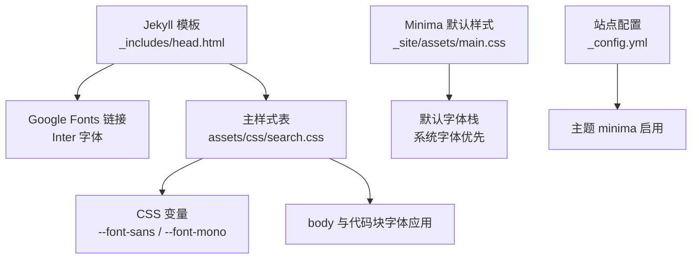
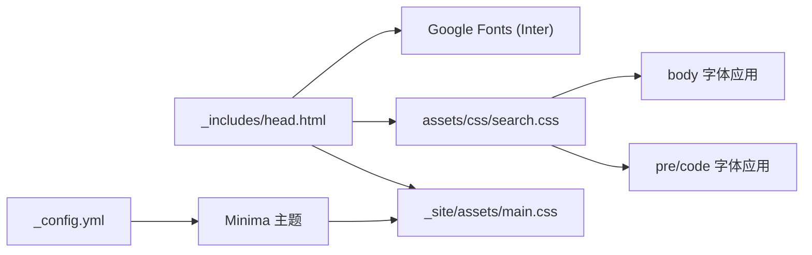

# 字体系统

<cite>
**本文引用的文件**   
- [_includes/head.html](file://_includes/head.html)
- [assets/css/search.css](file://assets/css/search.css)
- [_site/assets/main.css](file://_site/assets/main.css)
- [_config.yml](file://_config.yml)
</cite>

## 目录
1. [简介](#简介)
2. [项目结构](#项目结构)
3. [核心组件](#核心组件)
4. [架构总览](#架构总览)
5. [详细组件分析](#详细组件分析)
6. [依赖关系分析](#依赖关系分析)
7. [性能考虑](#性能考虑)
8. [故障排查指南](#故障排查指南)
9. [结论](#结论)
10. [附录：配置示例与最佳实践](#附录配置示例与最佳实践)

## 简介
本文件系统化梳理该 Jekyll 博客的字体体系，重点覆盖以下方面：
- Inter 字体的集成方式与 Google Fonts 引入配置
- 字体加载优化策略（预连接、显示控制等）
- 自定义字体添加方法（本地部署、@font-face、格式支持）
- 字体回退机制与跨设备一致性
- 字体性能优化建议（预加载、子集化、缓存策略）
- 具体配置示例（替换默认字体、多语言支持、动态加载）

## 项目结构
本项目采用 Jekyll + Minima 主题。字体相关的关键位置如下：
- 页面头部引入 Google Fonts 与 CSS 资源：_includes/head.html
- 全局字体变量与样式覆盖：assets/css/search.css
- Minima 主题默认样式（含基础字体栈）：_site/assets/main.css
- 站点主题与构建配置：_config.yml

图表来源
- [_includes/head.html:6-10](file://_includes/head.html#L6-L10)
- [assets/css/search.css:7-35](file://assets/css/search.css#L7-L35)
- [_site/assets/main.css:13-25](file://_site/assets/main.css#L13-L25)
- [_config.yml:10-14](file://_config.yml#L10-L14)

章节来源
- [_includes/head.html:1-26](file://_includes/head.html#L1-L26)
- [assets/css/search.css:1-120](file://assets/css/search.css#L1-L120)
- [_site/assets/main.css:1-30](file://_site/assets/main.css#L1-L30)
- [_config.yml:1-20](file://_config.yml#L1-L20)

## 核心组件
- Google Fonts 引入与预连接：在页面头部通过 link 标签引入 Inter 字体，并设置 preconnect 到 fonts.googleapis.com 与 fonts.gstatic.com，减少 DNS/TLS 握手开销。
- 字体变量定义与应用：在 assets/css/search.css 中通过 :root 定义 --font-sans 与 --font-mono，并在 body、pre/code 等处引用，形成统一的设计令牌。
- Minima 默认字体栈：_site/assets/main.css 提供 Minima 主题的默认字体栈，作为回退保障。

章节来源
- [_includes/head.html:6-9](file://_includes/head.html#L6-L9)
- [assets/css/search.css:7-35](file://assets/css/search.css#L7-L35)
- [_site/assets/main.css:13-25](file://_site/assets/main.css#L13-L25)

## 架构总览
从渲染路径看，浏览器请求页面后，先解析 head 中的资源，随后加载 Inter 字体与样式；search.css 将 Inter 设为首选无衬线字体，同时保留系统字体作为回退链。

```mermaid
sequenceDiagram
participant U as "用户浏览器"
participant H as "head.html"
participant GF as "fonts.googleapis.com"
participant S as "search.css"
participant M as "main.css(主题)"
U->>H : 解析 HTML 头部
H->>GF : 发起 Inter 字体请求带 preconnect
H->>S : 加载 search.css
H->>M : 加载 main.css
GF-->>U : 返回 Inter 字体资源
S-->>U : 应用 --font-sans 变量Inter 优先
M-->>U : 应用默认字体栈系统字体回退
```

图表来源
- [_includes/head.html:6-10](file://_includes/head.html#L6-L10)
- [assets/css/search.css:7-35](file://assets/css/search.css#L7-L35)
- [_site/assets/main.css:13-25](file://_site/assets/main.css#L13-L25)

## 详细组件分析

### Inter 字体集成与 Google Fonts 配置
- 引入方式：在 _includes/head.html 中使用 link 标签引入 Inter 字体，包含多个字重，并开启 display=swap 以改善首屏体验。
- 预连接：对 fonts.googleapis.com 与 fonts.gstatic.com 使用 rel="preconnect"，降低后续字体资源的连接建立时间。
- 影响范围：Inter 作为 --font-sans 的首选项，被 body 及多处 UI 元素继承。

章节来源
- [_includes/head.html:6-9](file://_includes/head.html#L6-L9)
- [assets/css/search.css:30](file://assets/css/search.css#L30)

### 字体变量与设计令牌
- 变量定义：在 assets/css/search.css 的 :root 中定义 --font-sans 与 --font-mono，前者以 Inter 为首选，后者为等宽字体族。
- 应用位置：body 使用 --font-sans；pre/code 使用 --font-mono；搜索输入框、按钮等也复用这些变量，确保全站一致。

章节来源
- [assets/css/search.css:7-35](file://assets/css/search.css#L7-L35)
- [assets/css/search.css:69-76](file://assets/css/search.css#L69-L76)
- [assets/css/search.css:104-108](file://assets/css/search.css#L104-L108)

### 回退机制与跨设备一致性
- 回退链：--font-sans 以 Inter 为首选，其后依次是 -apple-system、BlinkMacSystemFont、'Segoe UI'、Roboto、sans-serif，保证在不同操作系统与浏览器下均有良好可读性。
- 主题默认回退：_site/assets/main.css 定义了 Minima 的默认字体栈，作为更深层的回退保障。
- 平滑渲染：body 设置了抗锯齿属性，有助于提升小字号文本清晰度。

章节来源
- [assets/css/search.css:30](file://assets/css/search.css#L30)
- [_site/assets/main.css:13-25](file://_site/assets/main.css#L13-L25)
- [assets/css/search.css:69-76](file://assets/css/search.css#L69-L76)

### 代码字体与等宽字体
- 等宽字体族：--font-mono 以 'JetBrains Mono' 为首选，其次为 'Fira Code'、'Cascadia Code'、'Consolas'、monospace。
- 应用范围：pre 与 code 均使用 --font-mono，确保代码块与行内代码的一致性。

章节来源
- [assets/css/search.css:31](file://assets/css/search.css#L31)
- [assets/css/search.css:104-108](file://assets/css/search.css#L104-L108)

## 依赖关系分析
- 模板层：_includes/head.html 负责引入外部字体与样式。
- 样式层：assets/css/search.css 定义设计令牌并覆盖 Minima 默认样式。
- 主题层：_site/assets/main.css 提供 Minima 的基础样式与默认字体栈。
- 配置层：_config.yml 指定使用 minima 主题，间接影响默认样式行为。

图表来源
- [_includes/head.html:6-10](file://_includes/head.html#L6-L10)
- [assets/css/search.css:7-35](file://assets/css/search.css#L7-L35)
- [_site/assets/main.css:13-25](file://_site/assets/main.css#L13-L25)
- [_config.yml:10-14](file://_config.yml#L10-L14)

章节来源
- [_includes/head.html:1-26](file://_includes/head.html#L1-L26)
- [assets/css/search.css:1-120](file://assets/css/search.css#L1-L120)
- [_site/assets/main.css:1-30](file://_site/assets/main.css#L1-L30)
- [_config.yml:1-20](file://_config.yml#L1-L20)

## 性能考虑
- 预连接：已在 head 中对 Google Fonts 域名进行 preconnect，缩短首次连接时延。
- 显示控制：Inter 引入参数中包含 display=swap，避免字体未就绪导致的 FOIT（闪烁），提升首屏感知速度。
- 字体子集化：当前引入的是完整字重集合，若内容以中文为主且英文字符较少，可考虑仅加载必要字重或子集化以减少体积。
- 缓存策略：Google Fonts 具备 CDN 缓存能力；本地部署字体时可结合服务器缓存头与版本化文件名提高命中。
- 按需加载：对于非首屏关键字体（如部分装饰性字体），可采用懒加载或媒体查询条件加载。

[本节为通用指导，不直接分析具体文件]

## 故障排查指南
- 字体未生效
  - 检查 head 中是否已引入 Inter 字体链接与 preconnect。
  - 确认 search.css 中 --font-sans 变量是否正确定义并被 body 引用。
- 首屏闪烁或布局抖动
  - 确认 Inter 引入参数包含 display=swap。
  - 适当调整标题/正文的行高与字号，降低 CLS 风险。
- 中文显示异常
  - 确认 Inter 是否包含所需的中文字形；如需更好的中文支持，可在回退链中加入 Noto Sans SC 或思源黑体。
- 代码字体不一致
  - 检查 --font-mono 变量与 pre/code 的 font-family 应用。
  - 若需等宽字体特性（连字），请确保所选字体支持相应特性。

章节来源
- [_includes/head.html:6-9](file://_includes/head.html#L6-L9)
- [assets/css/search.css:30-35](file://assets/css/search.css#L30-L35)
- [assets/css/search.css:69-76](file://assets/css/search.css#L69-L76)

## 结论
该项目通过 head 引入 Inter 字体并结合 CSS 变量统一管理字体族，既保证了现代无衬线字体的视觉一致性，又通过完善的回退链确保了跨平台兼容性。配合预连接与 display=swap，整体字体加载体验较为友好。后续可按需进行子集化与本地化部署，进一步优化性能与可控性。

[本节为总结性内容，不直接分析具体文件]

## 附录：配置示例与最佳实践

### 替换默认字体
- 步骤要点
  - 在 _includes/head.html 中替换或新增 Google Fonts 链接。
  - 在 assets/css/search.css 的 :root 中更新 --font-sans 变量，保持回退链合理。
  - 验证 body 与 UI 组件是否按预期应用新字体。
- 参考位置
  - [_includes/head.html:6-9](file://_includes/head.html#L6-L9)
  - [assets/css/search.css:30](file://assets/css/search.css#L30)

### 添加多语言字体支持
- 思路
  - 在回退链中追加对应语言的常用字体（例如 Noto Sans SC、Source Han Sans）。
  - 若需要特定字形特性，可通过 CSS 字体特性开关（如 font-feature-settings）精细控制。
- 参考位置
  - [assets/css/search.css:30](file://assets/css/search.css#L30)

### 实现动态字体加载
- 思路
  - 使用 JavaScript 在页面可见区域滚动到关键内容后再注入字体 link 标签，或根据用户交互触发加载。
  - 注意避免阻塞首屏渲染，必要时结合 display=swap 与占位样式。
- 参考位置
  - [_includes/head.html:6-9](file://_includes/head.html#L6-L9)

### 本地字体部署与 @font-face
- 步骤要点
  - 将字体文件放置于静态资源目录（如 assets/fonts）。
  - 在样式文件中通过 @font-face 声明字体族、源文件路径与格式（WOFF/WOFF2/TTF/OTF）。
  - 在 --font-sans 或 --font-mono 中将自定义字体置于回退链前端。
- 建议
  - 优先提供 WOFF2 以获得更小体积与更好兼容性。
  - 使用 font-display: swap 或 block 控制加载行为。
- 参考位置
  - [assets/css/search.css:7-35](file://assets/css/search.css#L7-L35)

### 字体性能优化清单
- 预连接与预取：对第三方字体域名使用 preconnect；必要时使用 prefetch 预取关键资源。
- 子集化与按需字重：仅引入必要字重与字符集，减少下载体积。
- 缓存与版本化：为本地字体文件设置长期缓存与版本化文件名。
- 监控与度量：使用 Lighthouse 或 WebPageTest 评估字体对 TTFB、FCP、CLS 的影响。

[本节为通用指导，不直接分析具体文件]