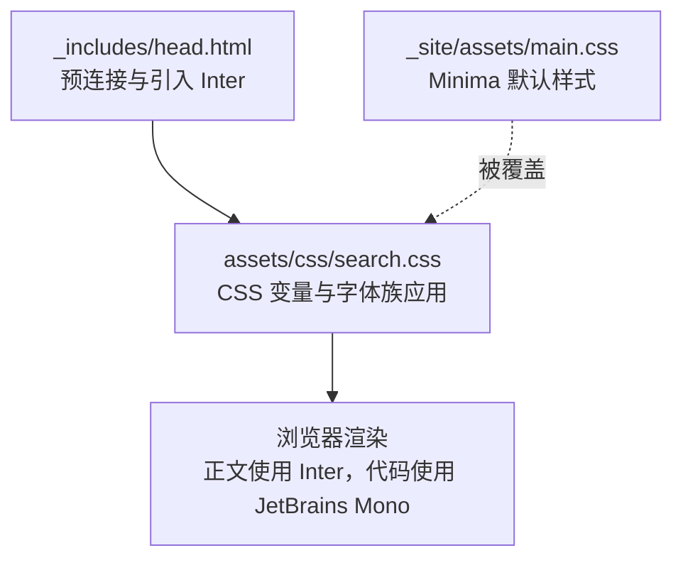
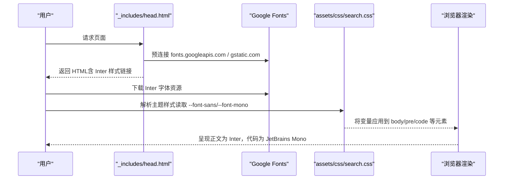
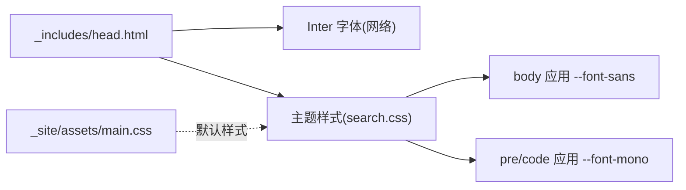

# 字体配置

<cite>
**本文引用的文件**   
- [_includes/head.html](file://_includes/head.html)
- [assets/css/search.css](file://assets/css/search.css)
- [_site/assets/main.css](file://_site/assets/main.css)
- [README.md](file://README.md)
</cite>

## 目录
1. [简介](#简介)
2. [项目结构](#项目结构)
3. [核心组件](#核心组件)
4. [架构总览](#架构总览)
5. [详细组件分析](#详细组件分析)
6. [依赖关系分析](#依赖关系分析)
7. [性能与加载优化](#性能与加载优化)
8. [故障排查指南](#故障排查指南)
9. [结论](#结论)

## 简介
本指南聚焦博客的字体配置与管理，涵盖以下要点：
- Inter 正文字体与 JetBrains Mono 代码字体的引入与配置
- 在不同页面和组件中应用不同字体族的方法
- 字体加载优化策略与性能考量
- 自定义字体的添加方式与字体回退机制配置
- 字体显示效果的调试技巧与常见问题解决方案

## 项目结构
与字体相关的核心位置如下：
- 全局头部模板：负责预连接 Google Fonts 并引入 Inter 字体样式表
- 主题样式：定义 CSS 变量（设计令牌）用于统一设置无衬线/等宽字体族
- 构建产物中的 Minima 默认样式：提供基础排版与代码块样式（会被主题样式覆盖）

图示来源
- [_includes/head.html:1-26](file://_includes/head.html#L1-L26)
- [assets/css/search.css:7-35](file://assets/css/search.css#L7-L35)
- [_site/assets/main.css:13-25](file://_site/assets/main.css#L13-L25)

章节来源
- [_includes/head.html:1-26](file://_includes/head.html#L1-L26)
- [assets/css/search.css:7-35](file://assets/css/search.css#L7-L35)
- [_site/assets/main.css:13-25](file://_site/assets/main.css#L13-L25)

## 核心组件
- 字体引入入口：在页面头部通过预连接与样式链接引入 Inter 字体，确保首屏快速加载。
- 字体族定义：在主题样式中通过 CSS 变量集中管理无衬线与等宽字体族，便于全局复用与暗色模式适配。
- 字体应用范围：
  - 正文、标题、按钮、输入框等使用无衬线字体族
  - 代码块、行内代码、按键提示等使用等宽字体族

章节来源
- [_includes/head.html:6-9](file://_includes/head.html#L6-L9)
- [assets/css/search.css:29-35](file://assets/css/search.css#L29-L35)
- [assets/css/search.css:69-76](file://assets/css/search.css#L69-L76)
- [assets/css/search.css:105-108](file://assets/css/search.css#L105-L108)

## 架构总览
从“引入—定义—应用”的角度看，字体系统由三部分构成：
- 引入层：在 head 中预连接 Google Fonts 并加载 Inter 字体
- 定义层：在主题样式中声明 CSS 变量，包含主字体族与等宽字体族及其回退链
- 应用层：在 body、pre/code、工具栏、搜索输入等元素上引用对应变量

图示来源
- [_includes/head.html:6-9](file://_includes/head.html#L6-L9)
- [assets/css/search.css:29-35](file://assets/css/search.css#L29-L35)
- [assets/css/search.css:69-76](file://assets/css/search.css#L69-L76)
- [assets/css/search.css:105-108](file://assets/css/search.css#L105-L108)

## 详细组件分析

### 字体引入与预连接（Inter）
- 在页面头部对 Google Fonts 域名进行预连接，减少 DNS/TLS 握手开销
- 引入 Inter 字体样式表，指定所需字重，启用 display=swap 避免 FOIT/FOUT 导致的布局抖动

章节来源
- [_includes/head.html:6-9](file://_includes/head.html#L6-L9)

### 字体族设计与回退链（CSS 变量）
- 无衬线字体族：以 Inter 为首选，随后是各平台系统字体，最后回退到通用 sans-serif
- 等宽字体族：以 JetBrains Mono 为首选，其次为 Fira Code、Cascadia Code、Consolas，最后回退到 monospace
- 这些变量在多处 UI 组件中被复用，保证视觉一致性

章节来源
- [assets/css/search.css:29-35](file://assets/css/search.css#L29-L35)

### 正文与代码字体应用
- 正文与大部分 UI 文本使用无衬线字体族变量
- 代码块与行内代码使用等宽字体族变量，确保代码对齐与可读性
- 工具栏标签、按键提示等也采用等宽字体族，保持技术内容的一致性

章节来源
- [assets/css/search.css:69-76](file://assets/css/search.css#L69-L76)
- [assets/css/search.css:105-108](file://assets/css/search.css#L105-L108)
- [assets/css/search.css:160-172](file://assets/css/search.css#L160-L172)
- [assets/css/search.css:243-256](file://assets/css/search.css#L243-L256)

### 与 Minima 默认样式的关系
- 构建产物中包含 Minima 主题的默认样式，其中定义了基础的 body 字体栈
- 当前主题样式会覆盖默认样式，使全站统一使用 Inter 与 JetBrains Mono

章节来源
- [_site/assets/main.css:13-25](file://_site/assets/main.css#L13-L25)
- [assets/css/search.css:69-76](file://assets/css/search.css#L69-L76)

### 在不同页面与组件中使用不同字体族
- 全局正文与标题：通过 body 选择器应用无衬线字体族变量
- 代码区域：通过 pre/code 选择器应用等宽字体族变量
- 特定交互元素（如搜索输入、工具栏按钮）：显式引用对应的字体族变量，确保一致体验

章节来源
- [assets/css/search.css:69-76](file://assets/css/search.css#L69-L76)
- [assets/css/search.css:105-108](file://assets/css/search.css#L105-L108)
- [assets/css/search.css:409-425](file://assets/css/search.css#L409-L425)
- [assets/css/search.css:174-189](file://assets/css/search.css#L174-L189)

### 自定义字体添加方法
- 若需引入本地或第三方字体，可在页面头部增加相应的样式链接或 @import/@font-face 规则
- 在主题样式中新增 CSS 变量，并在需要的位置引用该变量
- 建议遵循现有命名约定（例如 --font-brand），保持可维护性

章节来源
- [_includes/head.html:6-9](file://_includes/head.html#L6-L9)
- [assets/css/search.css:29-35](file://assets/css/search.css#L29-L35)

### 字体回退机制配置
- 回退链按“首选字体 → 平台系统字体 → 通用族”的顺序排列，确保跨设备稳定显示
- 等宽字体优先选择现代编程字体，再回退到常见系统等宽字体，保障代码可读性

章节来源
- [assets/css/search.css:29-35](file://assets/css/search.css#L29-L35)

## 依赖关系分析
- 引入顺序：head 中先预连接 Google Fonts，再引入 Inter 样式；主题样式随后加载，覆盖默认样式
- 样式优先级：主题样式位于后加载，能正确覆盖 Minima 默认样式中的字体设置
- 运行时依赖：Inter 字体来自 Google Fonts，JetBrains Mono 作为本地/系统可用字体参与回退链

图示来源
- [_includes/head.html:6-9](file://_includes/head.html#L6-L9)
- [assets/css/search.css:29-35](file://assets/css/search.css#L29-L35)
- [_site/assets/main.css:13-25](file://_site/assets/main.css#L13-L25)

章节来源
- [_includes/head.html:6-9](file://_includes/head.html#L6-L9)
- [assets/css/search.css:29-35](file://assets/css/search.css#L29-L35)
- [_site/assets/main.css:13-25](file://_site/assets/main.css#L13-L25)

## 性能与加载优化
- 预连接：对 Google Fonts 域名执行预连接，缩短后续请求延迟
- 按需字重：仅引入所需的 Inter 字重，减小体积
- display=swap：避免字体未加载时的闪烁与布局抖动
- 回退链合理：优先使用系统字体，降低首次渲染等待时间
- 代码字体回退：当 JetBrains Mono 不可用时，自动回退到其他等宽字体，保证可用性

章节来源
- [_includes/head.html:6-9](file://_includes/head.html#L6-L9)
- [assets/css/search.css:29-35](file://assets/css/search.css#L29-L35)

## 故障排查指南
- 现象：正文未显示 Inter
  - 检查是否在页面头部引入了 Inter 样式链接，以及是否启用了预连接
  - 确认网络连接可达 Google Fonts 域名
  - 参考路径：[_includes/head.html:6-9](file://_includes/head.html#L6-L9)
- 现象：代码未显示 JetBrains Mono
  - 确认主题样式中 --font-mono 变量是否正确定义且被 pre/code 引用
  - 检查是否存在其他样式覆盖了字体族
  - 参考路径：[assets/css/search.css:29-35](file://assets/css/search.css#L29-L35)、[assets/css/search.css:105-108](file://assets/css/search.css#L105-L108)
- 现象：Minima 默认字体仍生效
  - 确认主题样式已正确加载并覆盖默认样式
  - 参考路径：[_site/assets/main.css:13-25](file://_site/assets/main.css#L13-L25)、[assets/css/search.css:69-76](file://assets/css/search.css#L69-L76)
- 现象：字体闪烁或布局抖动
  - 检查是否使用了 display=swap 或类似策略
  - 适当调整字体加载优先级与缓存策略
  - 参考路径：[_includes/head.html:6-9](file://_includes/head.html#L6-L9)

章节来源
- [_includes/head.html:6-9](file://_includes/head.html#L6-L9)
- [assets/css/search.css:29-35](file://assets/css/search.css#L29-L35)
- [assets/css/search.css:69-76](file://assets/css/search.css#L69-L76)
- [assets/css/search.css:105-108](file://assets/css/search.css#L105-L108)
- [_site/assets/main.css:13-25](file://_site/assets/main.css#L13-L25)

## 结论
本项目通过“预连接 + 按需字重 + display=swap”的组合策略高效引入 Inter 字体，并以 CSS 变量统一管理字体族与回退链，实现全站一致的阅读体验与代码展示效果。主题样式有效覆盖 Minima 默认样式，确保字体策略在全局范围内生效。如需扩展更多字体，建议在头部引入新字体并在主题样式中新增变量，保持命名规范与复用性。