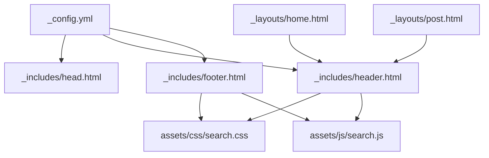
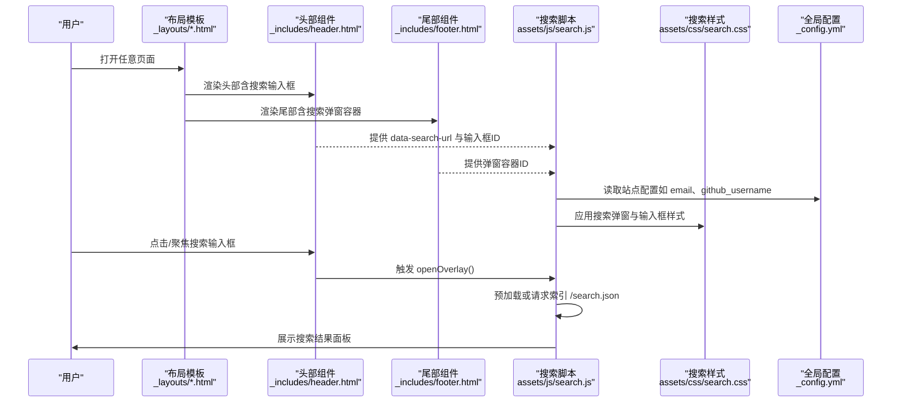
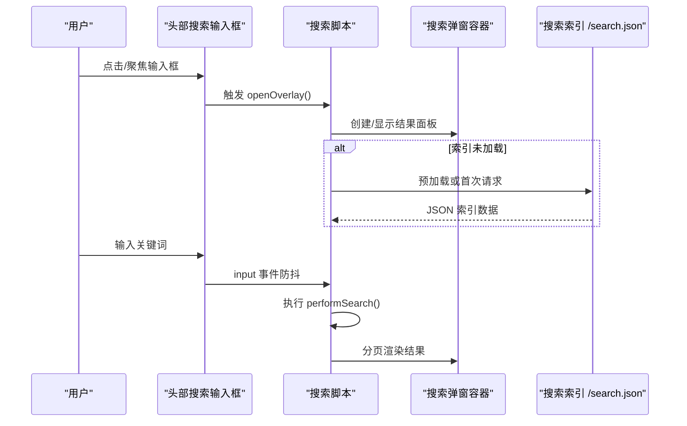
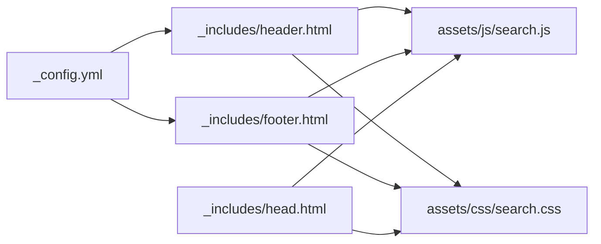

# 头部尾部组件定制

<cite>
**本文引用的文件**
- [_includes/header.html](file://_includes/header.html)
- [_includes/footer.html](file://_includes/footer.html)
- [_includes/head.html](file://_includes/head.html)
- [_config.yml](file://_config.yml)
- [_layouts/home.html](file://_layouts/home.html)
- [_layouts/post.html](file://_layouts/post.html)
- [assets/css/search.css](file://assets/css/search.css)
- [assets/js/search.js](file://assets/js/search.js)
</cite>

## 目录
1. [简介](#简介)
2. [项目结构](#项目结构)
3. [核心组件](#核心组件)
4. [架构总览](#架构总览)
5. [详细组件分析](#详细组件分析)
6. [依赖关系分析](#依赖关系分析)
7. [性能与可访问性建议](#性能与可访问性建议)
8. [故障排查指南](#故障排查指南)
9. [结论](#结论)
10. [附录：常用配置项与示例路径](#附录常用配置项与示例路径)

## 简介
本指南面向希望自定义网站通用“头部”和“尾部”组件的读者，重点说明 _includes 目录中可复用组件的组织方式与引用机制，并围绕以下目标提供实操指导：
- 头部组件：导航菜单、搜索框、主题切换等功能的实现与扩展
- 尾部组件：版权信息、社交媒体链接、站点统计等内容的定制方法
- 组件间数据传递与全局配置使用技巧
- 实际修改示例与响应式设计实现方案

## 项目结构
本项目采用 Jekyll 标准布局与包含结构。关键目录与职责如下：
- _includes：存放可复用的页面片段（如 head、header、footer）
- _layouts：页面模板（home、post），通过 layout: default 组合基础骨架
- assets：前端资源（CSS/JS），其中 search.css 与 search.js 负责搜索功能
- _config.yml：站点全局配置，供各组件读取

图表来源
- [_config.yml:1-45](file://_config.yml#L1-L45)
- [_includes/head.html:1-27](file://_includes/head.html#L1-L27)
- [_includes/header.html:1-11](file://_includes/header.html#L1-L11)
- [_includes/footer.html:1-34](file://_includes/footer.html#L1-L34)
- [_layouts/home.html:1-153](file://_layouts/home.html#L1-L153)
- [_layouts/post.html:1-194](file://_layouts/post.html#L1-L194)
- [assets/css/search.css:1-800](file://assets/css/search.css#L1-L800)
- [assets/js/search.js:1-573](file://assets/js/search.js#L1-L573)

章节来源
- [_config.yml:1-45](file://_config.yml#L1-L45)
- [_includes/head.html:1-27](file://_includes/head.html#L1-L27)
- [_includes/header.html:1-11](file://_includes/header.html#L1-L11)
- [_includes/footer.html:1-34](file://_includes/footer.html#L1-L34)
- [_layouts/home.html:1-153](file://_layouts/home.html#L1-L153)
- [_layouts/post.html:1-194](file://_layouts/post.html#L1-L194)
- [assets/css/search.css:1-800](file://assets/css/search.css#L1-L800)
- [assets/js/search.js:1-573](file://assets/js/search.js#L1-L573)

## 核心组件
- 头部组件（_includes/header.html）
  - 站点标题链接
  - 搜索输入框（带字符计数提示）
  - 与搜索弹窗联动（由 JS/CSS 驱动）
- 尾部组件（_includes/footer.html）
  - 邮箱联系方式
  - GitHub 社交链接（基于 site.github_username）
  - 搜索弹窗容器（置于 body 顶层，避免被 header 的 backdrop-filter 截断）
- 页面头信息（_includes/head.html）
  - SEO、字体预连接、主样式与搜索样式引入
  - Favicons 与主题色
  - 生产环境埋点（Google Analytics）
  - 搜索脚本引入
- 全局配置（_config.yml）
  - 站点名称、邮箱、作者、主题皮肤、社交账号、Favicon 等

章节来源
- [_includes/header.html:1-11](file://_includes/header.html#L1-L11)
- [_includes/footer.html:1-34](file://_includes/footer.html#L1-L34)
- [_includes/head.html:1-27](file://_includes/head.html#L1-L27)
- [_config.yml:1-45](file://_config.yml#L1-L45)

## 架构总览
下图展示了头部与尾部组件在页面渲染中的位置、数据流向与交互关系。

图表来源
- [_includes/header.html:1-11](file://_includes/header.html#L1-L11)
- [_includes/footer.html:1-34](file://_includes/footer.html#L1-L34)
- [_includes/head.html:1-27](file://_includes/head.html#L1-L27)
- [assets/js/search.js:1-573](file://assets/js/search.js#L1-L573)
- [assets/css/search.css:1-800](file://assets/css/search.css#L1-L800)
- [_config.yml:1-45](file://_config.yml#L1-L45)

## 详细组件分析

### 头部组件（_includes/header.html）
- 结构与职责
  - 站点标题：链接到首页，文本来自全局配置
  - 搜索容器：包含输入框与字符计数提示，输入框通过 data-search-url 指向搜索索引
- 可扩展点
  - 导航菜单：可在 header-wrapper 内新增导航列表（参考现有 wrapper 与 flex 布局）
  - 主题切换：可通过添加按钮并在 JS 中切换根节点 class 或使用系统偏好媒体查询（当前主题皮肤由配置控制）
- 与搜索联动
  - 输入框 ID 与 data-search-url 是搜索脚本的关键入口
  - 字符计数元素 ID 用于同步显示输入长度

章节来源
- [_includes/header.html:1-11](file://_includes/header.html#L1-L11)
- [assets/js/search.js:1-573](file://assets/js/search.js#L1-L573)

#### 头部搜索交互时序图

图表来源
- [_includes/header.html:1-11](file://_includes/header.html#L1-L11)
- [assets/js/search.js:1-573](file://assets/js/search.js#L1-L573)

### 尾部组件（_includes/footer.html）
- 结构与职责
  - 联系方式：邮箱来自全局配置
  - 社交链接：GitHub 用户名来自全局配置，图标使用 SVG sprite
  - 搜索弹窗容器：放置于 body 顶层，避免被头部模糊背景遮挡
- 可扩展点
  - 版权信息：在 footer-inner 中添加年份与版权声明
  - 更多社交平台：参照 GitHub 条目复制并替换链接与图标
  - 站点统计：可插入第三方统计脚本或自研计数器（注意隐私与合规）

章节来源
- [_includes/footer.html:1-34](file://_includes/footer.html#L1-L34)
- [_config.yml:1-45](file://_config.yml#L1-L45)

### 页面头信息（_includes/head.html）
- 作用
  - 注入 SEO、字体预连接、主样式与搜索样式
  - 引入 Favicons 与主题色
  - 在生产环境注入 Google Analytics
  - 引入搜索脚本
- 定制建议
  - 如需禁用 GA，移除对应 include 条件判断
  - 如需更换字体或样式，调整 link 标签顺序与路径

章节来源
- [_includes/head.html:1-27](file://_includes/head.html#L1-L27)
- [_config.yml:1-45](file://_config.yml#L1-L45)

### 全局配置（_config.yml）
- 关键字段
  - title、email、author、url、baseurl
  - theme、minima.skin、minima.date_format
  - github_username、zhihu_username
  - avatar、favicon
  - disqus.shortname、google_analytics
  - permalink、markdown、highlighter、plugins
- 使用方式
  - 头部与尾部通过 Liquid 语法直接读取 site.* 变量
  - 插件与构建行为由该文件统一管控

章节来源
- [_config.yml:1-45](file://_config.yml#L1-L45)

### 搜索功能（assets/js/search.js + assets/css/search.css）
- 核心流程
  - 预加载 /search.json 索引
  - 监听输入框 input/click/focus 事件，防抖后执行搜索
  - 支持中英文混合匹配与中文二元组模糊匹配
  - 全屏弹窗、滚动锁定、ESC 关闭、点击遮罩关闭
  - 分页加载与滚动触底加载更多
- 样式要点
  - 设计令牌（颜色、圆角、阴影、字体）
  - 吸顶头部与毛玻璃效果
  - 搜索输入框与弹窗面板样式
  - 小屏适配与滚动条美化
- 与组件集成
  - 头部提供输入框与 data-search-url
  - 尾部提供弹窗容器
  - head.html 引入样式与脚本

章节来源
- [assets/js/search.js:1-573](file://assets/js/search.js#L1-L573)
- [assets/css/search.css:1-800](file://assets/css/search.css#L1-L800)
- [_includes/header.html:1-11](file://_includes/header.html#L1-L11)
- [_includes/footer.html:1-34](file://_includes/footer.html#L1-L34)
- [_includes/head.html:1-27](file://_includes/head.html#L1-L27)

### 文章页增强（_layouts/post.html）
- 目录侧边栏与代码块工具栏
  - 自动生成目录树，支持 ESC 关闭与移动端自动收起
  - 代码块工具栏：复制、换行切换、语言标签
- 与头部/尾部无关，但体现组件化思想：将复杂逻辑封装为独立脚本与样式

章节来源
- [_layouts/post.html:1-194](file://_layouts/post.html#L1-L194)

## 依赖关系分析
- 组件耦合
  - 头部与尾部均依赖全局配置（site.*）
  - 搜索功能强依赖 head.html 引入的样式与脚本
- 外部依赖
  - Google Fonts（Inter）
  - Minima 主题（theme: minima）
  - 可选插件：jekyll-sitemap、jekyll-seo-tag、jekyll-feed
- 潜在循环依赖
  - 无直接循环；head/header/footer 均为单向包含

图表来源
- [_config.yml:1-45](file://_config.yml#L1-L45)
- [_includes/header.html:1-11](file://_includes/header.html#L1-L11)
- [_includes/footer.html:1-34](file://_includes/footer.html#L1-L34)
- [_includes/head.html:1-27](file://_includes/head.html#L1-L27)
- [assets/js/search.js:1-573](file://assets/js/search.js#L1-L573)
- [assets/css/search.css:1-800](file://assets/css/search.css#L1-L800)

## 性能与可访问性建议
- 性能
  - 搜索索引预加载已在脚本中实现，确保 /search.json 体积适中
  - 使用 requestAnimationFrame 与防抖减少重排重绘
  - 分页加载避免一次性渲染大量 DOM
- 可访问性
  - 搜索弹窗提供关闭按钮与 ESC 支持
  - 按钮具备 aria-label，利于屏幕阅读器
  - 焦点管理在打开/关闭弹窗时进行清理，避免意外滚动

[本节为通用建议，不直接分析具体文件]

## 故障排查指南
- 搜索无法打开或结果为空
  - 确认 head.html 已引入 search.js 与 search.css
  - 检查 header.html 中搜索输入框的 data-search-url 是否指向 /search.json
  - 确认 /search.json 存在且返回有效 JSON
- 弹窗被头部模糊背景遮挡
  - 确保搜索弹窗容器位于 footer.html 末尾（body 顶层）
- 移动端搜索框不可见
  - 检查 search.css 在小屏下的 display:none 规则是否符合预期
- 社交链接不显示
  - 检查 _config.yml 中 github_username 是否配置

章节来源
- [_includes/head.html:1-27](file://_includes/head.html#L1-L27)
- [_includes/header.html:1-11](file://_includes/header.html#L1-L11)
- [_includes/footer.html:1-34](file://_includes/footer.html#L1-L34)
- [assets/css/search.css:1-800](file://assets/css/search.css#L1-L800)
- [_config.yml:1-45](file://_config.yml#L1-L45)

## 结论
通过对 _includes 下头部与尾部组件的结构分析与搜索功能的深入解读，可以按以下步骤完成定制：
- 在 header.html 中扩展导航与主题切换
- 在 footer.html 中增加版权、社交与统计内容
- 利用 _config.yml 集中管理站点级数据
- 借助 search.js 与 search.css 快速实现高性能搜索体验
- 遵循响应式与可访问性最佳实践，提升多端体验

[本节为总结性内容，不直接分析具体文件]

## 附录：常用配置项与示例路径
- 站点基本信息
  - 站点标题、邮箱、作者、URL、Base URL
  - 参考：[_config.yml:1-45](file://_config.yml#L1-L45)
- 主题与日期格式
  - theme、minima.skin、minima.date_format
  - 参考：[_config.yml:10-16](file://_config.yml#L10-L16)
- 社交与头像
  - github_username、avatar、favicon
  - 参考：[_config.yml:21-26](file://_config.yml#L21-L26)
- 评论与分析
  - disqus.shortname、google_analytics
  - 参考：[_config.yml:29-33](file://_config.yml#L29-L33)
- 构建与插件
  - permalink、markdown、highlighter、plugins
  - 参考：[_config.yml:35-45](file://_config.yml#L35-L45)
- 搜索相关
  - 输入框 data-search-url 指向 /search.json
  - 参考：[_includes/header.html:1-11](file://_includes/header.html#L1-L11)、[assets/js/search.js:1-573](file://assets/js/search.js#L1-L573)
- 样式与脚本引入
  - 参考：[_includes/head.html:1-27](file://_includes/head.html#L1-L27)