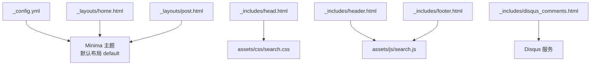
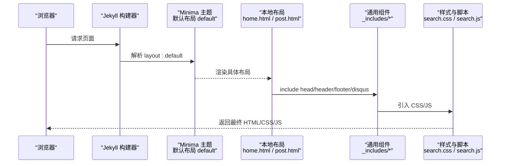
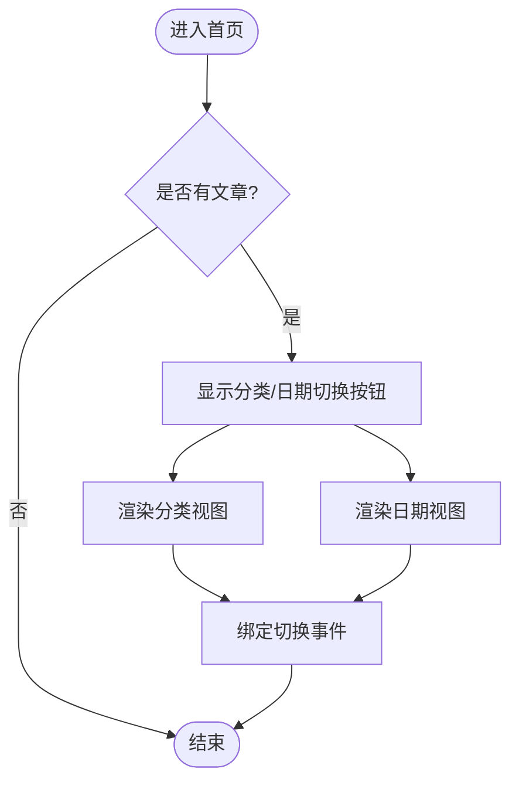
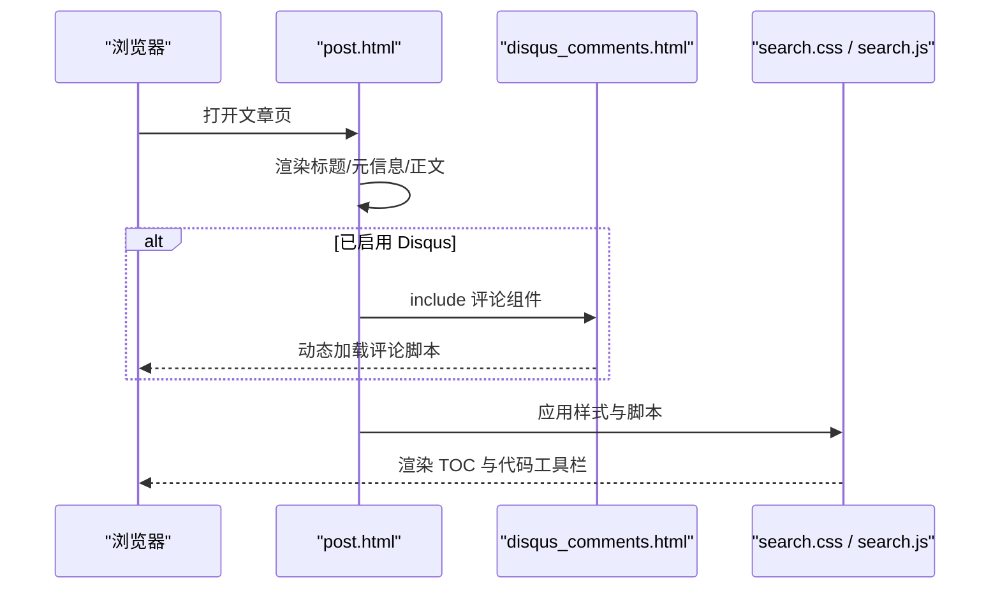
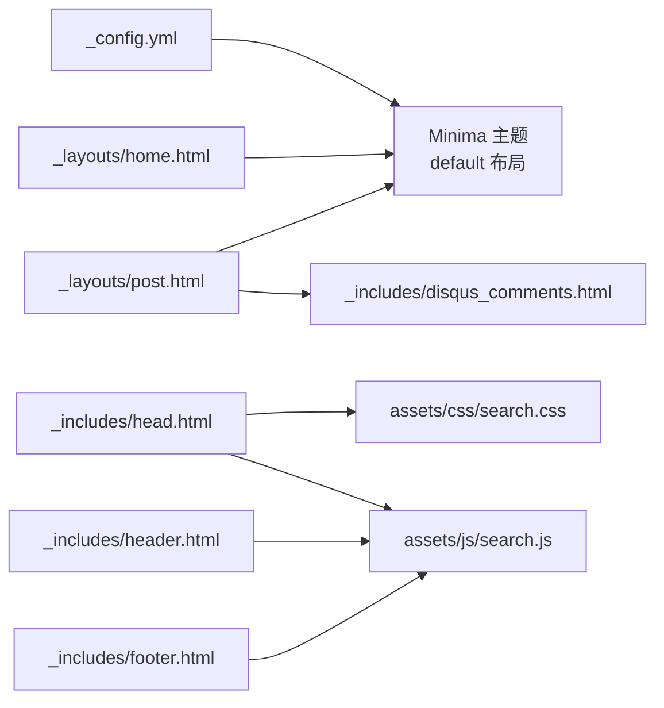

# 布局定制

<cite>
**本文引用的文件**   
- [_config.yml](file://_config.yml)
- [README.md](file://README.md)
- [_layouts/home.html](file://_layouts/home.html)
- [_layouts/post.html](file://_layouts/post.html)
- [_includes/head.html](file://_includes/head.html)
- [_includes/header.html](file://_includes/header.html)
- [_includes/footer.html](file://_includes/footer.html)
- [_includes/disqus_comments.html](file://_includes/disqus_comments.html)
- [assets/css/search.css](file://assets/css/search.css)
</cite>

## 目录
1. [简介](#简介)
2. [项目结构](#项目结构)
3. [核心组件](#核心组件)
4. [架构总览](#架构总览)
5. [详细组件分析](#详细组件分析)
6. [依赖分析](#依赖分析)
7. [性能考虑](#性能考虑)
8. [故障排查指南](#故障排查指南)
9. [结论](#结论)
10. [附录](#附录)

## 简介
本指南面向希望自定义博客页面布局的读者，围绕以下目标展开：
- 解释 Liquid 模板引擎的基本语法与模板继承机制在本项目中的使用方式
- 说明如何修改首页布局、文章页布局以及通用组件（头部、底部、head）布局
- 详细介绍 _includes 目录中可复用组件的定制方法
- 提供页面结构调整技巧与响应式实现方案
- 给出实际模板代码示例路径与最佳实践建议

本项目基于 Jekyll + Minima 主题，并在 assets/css/search.css 中对排版、交互与响应式进行了深度定制。

## 项目结构
与本指南相关的目录与文件如下：
- 配置与说明
  - _config.yml：站点全局配置（主题、链接、插件等）
  - README.md：特性说明与在线预览入口
- 布局模板
  - _layouts/home.html：首页布局（分类/日期双视图归档）
  - _layouts/post.html：文章页布局（标题、元信息、正文、评论、目录侧边栏、代码工具栏）
- 通用组件
  - _includes/head.html：文档头资源注入（SEO、字体、样式、Favicons、统计脚本）
  - _includes/header.html：站点头部（站点名、搜索框）
  - _includes/footer.html：站点底部（联系方式、社交链接、搜索弹窗容器）
  - _includes/disqus_comments.html：Disqus 评论组件
- 样式与交互
  - assets/css/search.css：全局样式覆盖、文章页排版、目录侧边栏、搜索弹窗、响应式适配

图表来源
- [_config.yml:1-45](file://_config.yml#L1-L45)
- [_layouts/home.html:1-153](file://_layouts/home.html#L1-L153)
- [_layouts/post.html:1-194](file://_layouts/post.html#L1-L194)
- [_includes/head.html:1-27](file://_includes/head.html#L1-L27)
- [_includes/header.html:1-11](file://_includes/header.html#L1-L11)
- [_includes/footer.html:1-34](file://_includes/footer.html#L1-L34)
- [_includes/disqus_comments.html:1-21](file://_includes/disqus_comments.html#L1-L21)
- [assets/css/search.css:60-1305](file://assets/css/search.css#L60-L1305)

章节来源
- [_config.yml:1-45](file://_config.yml#L1-L45)
- [README.md:1-24](file://README.md#L1-L24)

## 核心组件
- 首页布局（_layouts/home.html）
  - 支持“分类”和“日期”两种视图切换
  - 分类视图按首字母排序，自动统计直接文章数与子分类文章总数
  - 日期视图按年/月分组，默认展开首个年份与月份
  - 内嵌轻量 JS 控制视图切换
- 文章页布局（_layouts/post.html）
  - 展示标题、创建/更新时间、发布日期、作者等元信息
  - 正文区域 {{ content }} 由 Markdown 渲染生成
  - 可选 Disqus 评论组件
  - 自动生成文章目录侧边栏（TOC），支持滚动高亮与移动端关闭
  - 为代码块添加工具栏（复制、换行切换）
- 通用组件（_includes/*）
  - head.html：注入 SEO、字体、主样式、搜索样式、Favicons、Google Analytics（生产环境）、搜索脚本
  - header.html：站点标题与搜索输入框（含字符计数提示）
  - footer.html：邮箱、GitHub 社交链接、搜索弹窗遮罩容器
  - disqus_comments.html：根据配置动态加载 Disqus 评论

章节来源
- [_layouts/home.html:1-153](file://_layouts/home.html#L1-L153)
- [_layouts/post.html:1-194](file://_layouts/post.html#L1-L194)
- [_includes/head.html:1-27](file://_includes/head.html#L1-L27)
- [_includes/header.html:1-11](file://_includes/header.html#L1-L11)
- [_includes/footer.html:1-34](file://_includes/footer.html#L1-L34)
- [_includes/disqus_comments.html:1-21](file://_includes/disqus_comments.html#L1-L21)

## 架构总览
下图展示了从配置到页面渲染的关键流程与组件关系。

图表来源
- [_config.yml:10-15](file://_config.yml#L10-L15)
- [_layouts/home.html:1-10](file://_layouts/home.html#L1-L10)
- [_layouts/post.html:1-10](file://_layouts/post.html#L1-L10)
- [_includes/head.html:1-27](file://_includes/head.html#L1-L27)
- [_includes/header.html:1-11](file://_includes/header.html#L1-L11)
- [_includes/footer.html:1-34](file://_includes/footer.html#L1-L34)
- [_includes/disqus_comments.html:1-21](file://_includes/disqus_comments.html#L1-L21)
- [assets/css/search.css:60-1305](file://assets/css/search.css#L60-L1305)

## 详细组件分析

### 首页布局（_layouts/home.html）
- 功能要点
  - 顶部标题与内容占位
  - 分类视图：遍历 site.categories，统计直接文章与子分类文章数量，折叠展示
  - 日期视图：按年/月分组，显示发布日期与标题
  - 内联脚本：点击按钮切换 view-cat 与 view-date 显示状态
- 定制建议
  - 调整分类/日期视图的默认展开行为（如仅展开当前年份）
  - 增加更多筛选维度（标签、作者等）
  - 优化大站点的渲染性能（分页或懒加载）

图表来源
- [_layouts/home.html:12-132](file://_layouts/home.html#L12-L132)
- [_layouts/home.html:134-153](file://_layouts/home.html#L134-L153)

章节来源
- [_layouts/home.html:1-153](file://_layouts/home.html#L1-L153)

### 文章页布局（_layouts/post.html）
- 功能要点
  - 标题与元信息：支持 create_time、update_time、date、author 等字段
  - 正文：{{ content }} 输出渲染后的 Markdown
  - 评论：若启用 Disqus，则包含 disqus_comments.html
  - 目录侧边栏：扫描 h1~h6 生成 TOC，支持 ESC 关闭、点击平滑滚动、滚动高亮
  - 代码工具栏：为每个 <pre> 添加语言标签、复制按钮、换行切换按钮
- 定制建议
  - 扩展元信息字段（如阅读时长、字数统计）
  - 调整 TOC 层级缩进与高亮阈值
  - 增强代码工具栏（下载代码、主题切换）

图表来源
- [_layouts/post.html:1-37](file://_layouts/post.html#L1-L37)
- [_includes/disqus_comments.html:1-21](file://_includes/disqus_comments.html#L1-L21)
- [assets/css/search.css:733-782](file://assets/css/search.css#L733-L782)

章节来源
- [_layouts/post.html:1-194](file://_layouts/post.html#L1-L194)
- [_includes/disqus_comments.html:1-21](file://_includes/disqus_comments.html#L1-L21)

### 通用组件（_includes/*）
- head.html
  - 注入 SEO、Inter 字体、主样式、搜索样式、Favicons、Google Analytics（生产环境）、搜索脚本
  - 定制建议：替换字体、调整 Favicons、按需开启统计
- header.html
  - 站点标题与搜索输入框（含字符计数提示）
  - 定制建议：增加导航菜单、搜索高级选项
- footer.html
  - 邮箱、GitHub 社交链接、搜索弹窗遮罩容器
  - 定制建议：增加版权信息、多语言切换
- disqus_comments.html
  - 根据 page.comments 与 site.disqus.shortname 条件加载
  - 定制建议：切换评论系统（如 Waline、Giscus）

章节来源
- [_includes/head.html:1-27](file://_includes/head.html#L1-L27)
- [_includes/header.html:1-11](file://_includes/header.html#L1-L11)
- [_includes/footer.html:1-34](file://_includes/footer.html#L1-L34)
- [_includes/disqus_comments.html:1-21](file://_includes/disqus_comments.html#L1-L21)

### 样式与响应式（assets/css/search.css）
- 关键能力
  - 全局 Minima 覆盖：字体、颜色、链接、滚动行为
  - 文章页排版：标题、元信息网格、正文宽度与行高
  - 目录侧边栏：层级缩进、活跃态高亮、小屏适配
  - 搜索弹窗：遮罩、关闭按钮、结果列表样式
- 定制建议
  - 通过 CSS 变量统一设计令牌，便于亮/暗色模式切换
  - 使用 clamp() 实现响应式字号
  - 针对小屏设备优化 TOC 与搜索弹窗尺寸

章节来源
- [assets/css/search.css:60-1305](file://assets/css/search.css#L60-L1305)

## 依赖分析
- 主题与布局
  - _config.yml 指定 theme: minima，因此 home.html 与 post.html 均继承自 Minima 的默认布局 default
- 组件引用
  - post.html 在启用 Disqus 时 include disqus_comments.html
  - head.html 引入 search.css 与 search.js
  - header.html 与 footer.html 共同支撑搜索交互
- 外部依赖
  - Google Fonts（Inter 字体）
  - Disqus 评论服务
  - Google Analytics（生产环境）

图表来源
- [_config.yml:10-15](file://_config.yml#L10-L15)
- [_layouts/home.html:1-10](file://_layouts/home.html#L1-L10)
- [_layouts/post.html:1-10](file://_layouts/post.html#L1-L10)
- [_includes/head.html:1-27](file://_includes/head.html#L1-L27)
- [_includes/header.html:1-11](file://_includes/header.html#L1-L11)
- [_includes/footer.html:1-34](file://_includes/footer.html#L1-L34)
- [_includes/disqus_comments.html:1-21](file://_includes/disqus_comments.html#L1-L21)

章节来源
- [_config.yml:1-45](file://_config.yml#L1-L45)

## 性能考虑
- 减少不必要的 DOM 操作：首页视图切换脚本已采用最小化逻辑，避免重复查询节点
- 滚动监听优化：文章页目录高亮使用 passive 事件监听，降低滚动抖动
- 资源预连接：head.html 对 Google Fonts 进行 preconnect，提升字体加载速度
- 按需加载：Google Analytics 仅在 production 环境注入；Disqus 按需 include
- 样式合并与压缩：建议在生产构建阶段合并与压缩 CSS/JS（可通过 Jekyll 插件或 CI 流水线完成）

[本节为通用指导，无需特定文件来源]

## 故障排查指南
- 评论不显示
  - 检查 _config.yml 中 disqus.shortname 是否配置正确
  - 确认文章未设置 comments: false
  - 参考路径：[_includes/disqus_comments.html:1-21](file://_includes/disqus_comments.html#L1-L21)
- 搜索无结果
  - 确认 search.json 存在且可访问
  - 检查 search.js 是否正确加载（head.html 引入）
  - 参考路径：[_includes/head.html:25-26](file://_includes/head.html#L25-L26)
- 目录侧边栏不出现
  - 文章需包含至少一个 h1~h6 标题
  - 检查 .post-content 选择器是否被覆盖
  - 参考路径：[_layouts/post.html:54-113](file://_layouts/post.html#L54-L113)
- 代码工具栏不显示
  - 确保文章中有 <pre><code> 代码块
  - 检查 .post-content pre 样式未被覆盖
  - 参考路径：[_layouts/post.html:116-193](file://_layouts/post.html#L116-L193)

章节来源
- [_includes/disqus_comments.html:1-21](file://_includes/disqus_comments.html#L1-L21)
- [_includes/head.html:22-26](file://_includes/head.html#L22-L26)
- [_layouts/post.html:54-113](file://_layouts/post.html#L54-L113)
- [_layouts/post.html:116-193](file://_layouts/post.html#L116-L193)

## 结论
通过合理组织 _layouts 与 _includes，结合 Minima 主题的默认布局与本项目在 assets/css/search.css 中的深度定制，可以实现高度可定制的页面结构与交互体验。建议在保持组件解耦的同时，遵循以下原则：
- 明确职责边界：布局负责结构，组件负责复用，样式负责表现
- 优先使用配置驱动：将可变项放入 _config.yml 或 Front Matter
- 渐进增强：基础功能稳定后，再叠加交互与特效
- 关注性能与可维护性：减少重排重绘，合理使用 CSS 变量与媒体查询

[本节为总结性内容，无需特定文件来源]

## 附录
- Liquid 模板基本语法速查（结合本项目用法）
  - 变量与过滤器：{{ page.title | escape }}、{{ page.date | date: "%Y-%m-%d" }}
  - 条件判断： ... 
  - 循环与集合：、
  - 模板继承：layout: default（继承 Minima 默认布局）
  - 组件复用：include disqus_comments.html、include head.html
- 最佳实践清单
  - 将公共 UI 片段抽取到 _includes，避免重复代码
  - 使用语义化类名与结构化标签，提升可访问性与 SEO
  - 通过 CSS 变量统一管理色彩与间距，便于主题切换
  - 在小屏设备上测试 TOC、搜索弹窗与代码工具栏的可用性
  - 在生产环境启用缓存与资源压缩，提升首屏加载速度

[本节为概念性内容，无需特定文件来源]