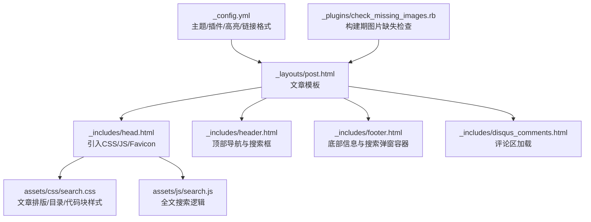
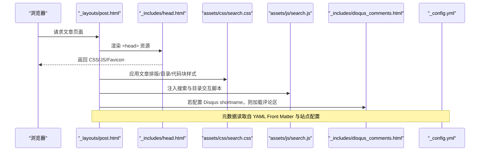
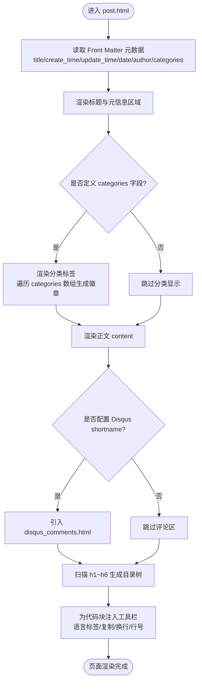
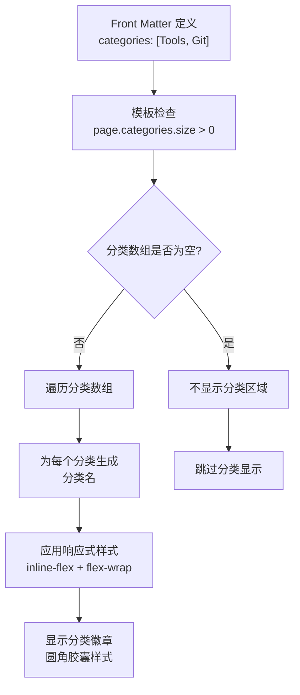
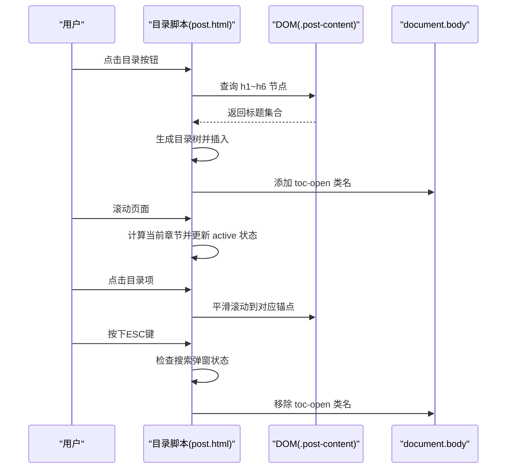
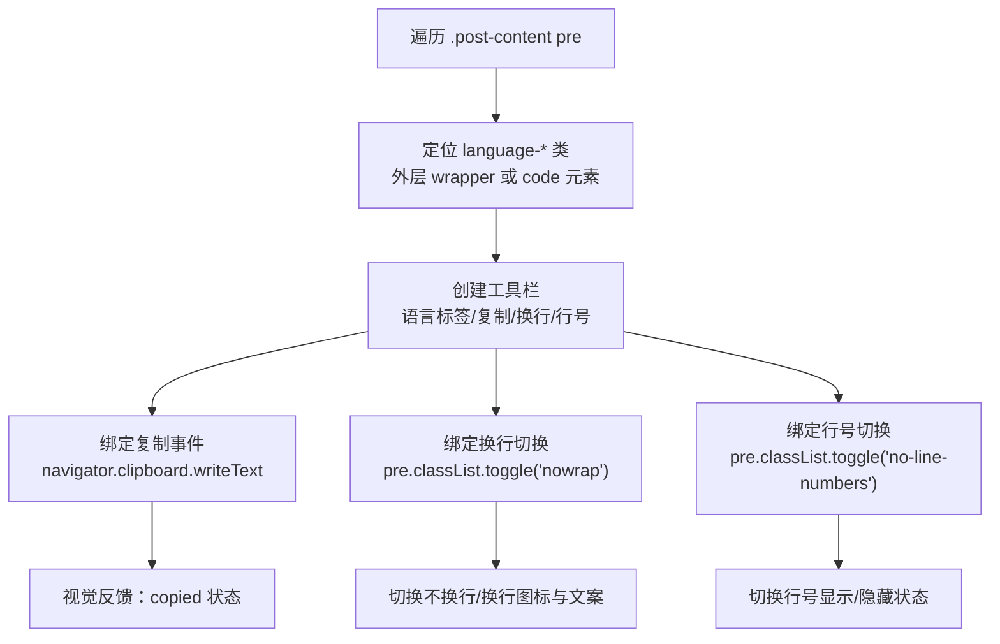
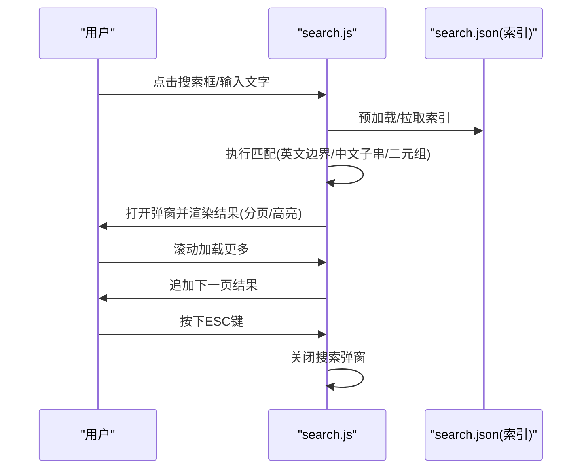
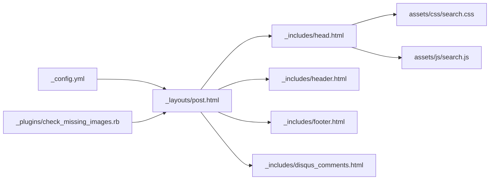

# 文章页布局定制

<cite>
**本文引用的文件**   
- [post.html](file://_layouts/post.html)
- [head.html](file://_includes/head.html)
- [header.html](file://_includes/header.html)
- [footer.html](file://_includes/footer.html)
- [disqus_comments.html](file://_includes/disqus_comments.html)
- [search.css](file://assets/css/search.css)
- [search.js](file://assets/js/search.js)
- [_config.yml](file://_config.yml)
- [check_missing_images.rb](file://_plugins/check_missing_images.rb)
</cite>

## 更新摘要
**变更内容**   
- 增强了目录侧边栏功能，支持动态调整文章内容宽度
- 改进了ESC键关闭逻辑，避免与搜索弹窗冲突
- 优化了移动端适配体验
- 完善了CSS类管理机制
- 新增了行号显示/隐藏功能和更好的代码块工具栏
- **新增了文章分类显示功能，支持自动渲染categories字段并生成响应式分类徽章**

## 目录
1. [简介](#简介)
2. [项目结构](#项目结构)
3. [核心组件](#核心组件)
4. [架构总览](#架构总览)
5. [详细组件分析](#详细组件分析)
6. [依赖关系分析](#依赖关系分析)
7. [性能与可访问性](#性能与可访问性)
8. [故障排查指南](#故障排查指南)
9. [结论](#结论)
10. [附录：常用定制清单](#附录常用定制清单)

## 简介
本指南面向希望深度定制"单篇文章展示页面"的读者，围绕以下目标展开：
- 解释文章页面的基本结构与元数据渲染机制
- 说明目录导航、代码高亮、图片处理与评论系统的集成方式
- 提供标题、作者、发布时间等元数据的显示格式修改方法
- 给出样式定制与移动端适配技巧
- 演示如何扩展文章模板与集成自定义组件

**更新** 本次更新重点介绍了增强的目录侧边栏功能，包括动态内容宽度调整、改进的ESC键交互逻辑和优化的移动端体验，以及新增的文章分类显示功能。

## 项目结构
与本主题直接相关的核心文件分布如下：
- 文章模板：_layouts/post.html
- 全局头部/尾部：_includes/head.html、_includes/header.html、_includes/footer.html
- 评论系统：_includes/disqus_comments.html
- 样式与交互：assets/css/search.css（含文章排版与目录样式）、assets/js/search.js（全文搜索）
- 站点配置：_config.yml（主题、插件、高亮器、永久链接等）
- 构建期检查：_plugins/check_missing_images.rb（构建时校验本地图片路径）

**图表来源**
- [post.html:1-274](file://_layouts/post.html#L1-L274)
- [head.html:1-27](file://_includes/head.html#L1-L27)
- [header.html:1-11](file://_includes/header.html#L1-L11)
- [footer.html:1-34](file://_includes/footer.html#L1-L34)
- [disqus_comments.html:1-21](file://_includes/disqus_comments.html#L1-L21)
- [search.css:1-1609](file://assets/css/search.css#L1-L1609)
- [search.js:1-573](file://assets/js/search.js#L1-L573)
- [_config.yml:1-45](file://_config.yml#L1-L45)
- [check_missing_images.rb:1-37](file://_plugins/check_missing_images.rb#L1-L37)

章节来源
- [post.html:1-274](file://_layouts/post.html#L1-L274)
- [head.html:1-27](file://_includes/head.html#L1-L27)
- [header.html:1-11](file://_includes/header.html#L1-L11)
- [footer.html:1-34](file://_includes/footer.html#L1-L34)
- [disqus_comments.html:1-21](file://_includes/disqus_comments.html#L1-L21)
- [search.css:1-1609](file://assets/css/search.css#L1-L1609)
- [search.js:1-573](file://assets/js/search.js#L1-L573)
- [_config.yml:1-45](file://_config.yml#L1-L45)
- [check_missing_images.rb:1-37](file://_plugins/check_missing_images.rb#L1-L37)

## 核心组件
- 文章模板（post.html）
  - 负责文章标题、元数据（创建时间、更新时间、发布日期、作者、**分类**）、正文内容、评论区、目录侧边栏与代码块工具栏。
- 全局头尾（head.html、header.html、footer.html）
  - head.html 引入字体、主样式、搜索样式、Favicon、统计脚本与搜索 JS；header.html 提供吸顶导航与搜索输入；footer.html 提供社交信息与搜索弹窗容器。
- 样式与交互（search.css、search.js）
  - search.css 包含文章排版、目录侧边栏、代码块与工具栏样式；search.js 实现全文搜索、弹窗、分页与关键词高亮。
- 站点配置（_config.yml）
  - 控制主题、皮肤、日期格式、评论 shortname、Google Analytics、Markdown 解析器与代码高亮器、永久链接格式等。
- 构建期检查（check_missing_images.rb）
  - 扫描文章中 Markdown 与 HTML 图片引用，对以 / 开头的本地路径进行存在性检查并输出警告。

**更新** 目录侧边栏现已支持动态内容宽度调整和更智能的ESC键处理逻辑，同时新增了文章分类显示功能。

章节来源
- [post.html:1-274](file://_layouts/post.html#L1-L274)
- [head.html:1-27](file://_includes/head.html#L1-L27)
- [header.html:1-11](file://_includes/header.html#L1-L11)
- [footer.html:1-34](file://_includes/footer.html#L1-L34)
- [search.css:1-1609](file://assets/css/search.css#L1-L1609)
- [search.js:1-573](file://assets/js/search.js#L1-L573)
- [_config.yml:1-45](file://_config.yml#L1-L45)
- [check_missing_images.rb:1-37](file://_plugins/check_missing_images.rb#L1-L37)

## 架构总览
下图展示了文章页从模板到资源加载、再到运行时交互的整体流程。

**图表来源**
- [post.html:1-274](file://_layouts/post.html#L1-L274)
- [head.html:1-27](file://_includes/head.html#L1-L27)
- [search.css:1-1609](file://assets/css/search.css#L1-L1609)
- [search.js:1-573](file://assets/js/search.js#L1-L573)
- [disqus_comments.html:1-21](file://_includes/disqus_comments.html#L1-L21)
- [_config.yml:1-45](file://_config.yml#L1-L45)

## 详细组件分析

### 文章模板与元数据渲染（post.html）
- 标题与结构化标记
  - 使用语义化标签与 Schema.org 属性，便于 SEO 与机器可读。
- 元数据字段
  - 支持 create_time、update_time、date、author、**categories** 等字段，按条件渲染。
  - 日期格式化通过 Liquid 过滤器与站点配置的 date_format 组合完成。
  - **分类信息显示**：当 front matter 中定义了 categories 字段且数组大小大于0时，会显示'分类：'标签和动态生成的分类徽章。
- 正文渲染
  - 由 {{ content }} 注入，遵循 kramdown 解析规则。
- 评论系统
  - 当 _config.yml 中 disqus.shortname 存在时，动态引入 disqus_comments.html。
- 目录侧边栏
  - 在 DOM 中查找 .post-content 下的 h1~h6，生成层级目录，支持滚动高亮与 ESC 关闭。
- 代码块工具栏
  - 为每个 pre 节点注入语言标签、复制按钮、换行切换按钮和行号切换按钮，兼容外层 language-* 类名。

**更新** 新增了分类信息显示功能，支持自动渲染多个分类标签并生成响应式的分类徽章。

**图表来源**
- [post.html:1-274](file://_layouts/post.html#L1-L274)
- [post.html:17-19](file://_layouts/post.html#L17-L19)
- [post.html:42-126](file://_layouts/post.html#L42-L126)
- [post.html:128-274](file://_layouts/post.html#L128-L274)
- [disqus_comments.html:1-21](file://_includes/disqus_comments.html#L1-L21)
- [_config.yml:28-31](file://_config.yml#L28-L31)

章节来源
- [post.html:1-274](file://_layouts/post.html#L1-L274)
- [post.html:17-19](file://_layouts/post.html#L17-L19)
- [post.html:42-126](file://_layouts/post.html#L42-L126)
- [post.html:128-274](file://_layouts/post.html#L128-L274)
- [disqus_comments.html:1-21](file://_includes/disqus_comments.html#L1-L21)
- [_config.yml:28-31](file://_config.yml#L28-L31)

### 文章分类显示功能
- **分类字段定义**
  - 在文章 front matter 中使用 `categories: [分类1, 分类2]` 语法定义分类数组。
  - 支持单个或多个分类，分类名称可以是中文或英文。
- **自动渲染逻辑**
  - 模板在第17-19行检查 page.categories 是否存在且数组大小大于0。
  - 使用 Liquid 循环遍历分类数组，为每个分类生成带有 `.post-category` 类的 span 元素。
  - 显示固定标签"分类："后跟动态生成的分类徽章。
- **响应式设计**
  - 分类容器使用 `display: inline-flex` 和 `flex-wrap: wrap` 实现弹性布局。
  - 分类徽章采用圆角胶囊样式，支持多行显示以适应长分类列表。
  - 使用 CSS 变量确保与整体设计系统的一致性。
- **样式特性**
  - 分类徽章具有半透明背景边框，悬停效果不明显以保持简洁。
  - 字体大小适中（0.85rem），行高合理（1.6），确保良好的可读性。
  - 颜色使用文本次要色和背景子色，保持视觉层次清晰。

**更新** 新增了完整的分类显示功能，提供了美观且响应式的分类标签展示效果。

**图表来源**
- [post.html:17-19](file://_layouts/post.html#L17-L19)
- [search.css:854-869](file://assets/css/search.css#L854-L869)

章节来源
- [post.html:17-19](file://_layouts/post.html#L17-L19)
- [search.css:854-869](file://assets/css/search.css#L854-L869)

### 增强的目录导航（TOC）
- 触发与结构
  - 右下角浮动按钮打开右侧抽屉式目录面板，ESC 可关闭。
- 生成逻辑
  - 遍历 .post-content 下所有 h1~h6，自动分配 id，生成嵌套列表。
- 交互行为
  - 点击目录项平滑滚动至对应锚点；移动端点击后自动收起面板。
  - 监听滚动事件，计算当前可见章节并高亮对应目录项。
- **动态内容宽度调整**
  - 当目录打开时，通过 `body.toc-open` 类名动态调整 `.post` 元素的 margin-right，使文章内容向左收缩280px。
  - 在小屏幕设备（max-width: 1200px）上自动禁用宽度调整，确保移动端体验。
- **改进的ESC键关闭逻辑**
  - 检测搜索弹窗状态，仅在搜索弹窗未打开时响应ESC键关闭目录。
  - 避免与搜索弹窗的ESC键操作产生冲突。
- 样式要点
  - 使用 CSS 变量统一配色与圆角阴影；不同层级缩进与字号递减。

**更新** 新增了动态内容宽度调整和智能ESC键处理，提升了用户体验。

**图表来源**
- [post.html:42-126](file://_layouts/post.html#L42-L126)
- [search.css:804-818](file://assets/css/search.css#L804-L818)
- [search.css:1269-1447](file://assets/css/search.css#L1269-L1447)

章节来源
- [post.html:42-126](file://_layouts/post.html#L42-L126)
- [search.css:804-818](file://assets/css/search.css#L804-L818)
- [search.css:1269-1447](file://assets/css/search.css#L1269-L1447)

### 增强的代码高亮与工具栏
- 高亮引擎
  - 通过 _config.yml 指定 highlighter: rouge，结合 kramdown 将代码块转换为带 language-* 类的 HTML。
- **增强的工具栏功能**
  - 语言标签：优先从外层 wrapper 的 language-* 类提取，回退到 code 元素自身。
  - 复制：调用 Clipboard API，成功反馈"已复制"。
  - 换行：切换 pre.nowrap 控制默认换行或水平滚动。
  - **行号显示/隐藏**：新增行号切换按钮，支持显示/隐藏代码行号。
- **智能行号系统**
  - 自动将代码内容按真实换行拆分为 .code-line 元素。
  - 使用CSS计数器实现行号显示，软换行不显示行号。
  - 支持无行号模式，提升代码阅读体验。
- 样式体系
  - 代码块默认自动换行，支持 nowrap 模式；工具栏悬浮于代码块右上角。

**更新** 新增了行号显示/隐藏功能，提供了更灵活的代码阅读选项。

**图表来源**
- [post.html:128-274](file://_layouts/post.html#L128-L274)
- [search.css:172-214](file://assets/css/search.css#L172-L214)
- [search.css:215-284](file://assets/css/search.css#L215-L284)
- [_config.yml:36-38](file://_config.yml#L36-L38)

章节来源
- [post.html:128-274](file://_layouts/post.html#L128-L274)
- [search.css:172-214](file://assets/css/search.css#L172-L214)
- [search.css:215-284](file://assets/css/search.css#L215-L284)
- [_config.yml:36-38](file://_config.yml#L36-L38)

### 图片处理与构建期检查
- 引用规范
  - 建议将图片放置于 imgs/ 目录，并在文章中通过相对路径引用。
- 构建期检查
  - 插件会扫描 Markdown 与 HTML 中的图片路径，对以 / 开头的本地路径进行存在性检查，缺失时输出警告，帮助定位问题。
- 注意事项
  - 确保路径正确且文件存在，避免构建后出现空白占位图。

章节来源
- [check_missing_images.rb:1-37](file://_plugins/check_missing_images.rb#L1-L37)

### 评论系统集成（Disqus）
- 启用方式
  - 在 _config.yml 中设置 disqus.shortname，文章模板会自动引入 disqus_comments.html。
- 运行环境
  - 本地预览与生产环境均可加载，需保证网络可达 Disqus 服务。
- 关闭方式
  - 删除或留空 shortname，评论区不再出现。

章节来源
- [disqus_comments.html:1-21](file://_includes/disqus_comments.html#L1-L21)
- [_config.yml:28-31](file://_config.yml#L28-L31)
- [post.html:35-37](file://_layouts/post.html#L35-L37)

### 全文搜索（前端）
- 入口与索引
  - 头部搜索框与全屏弹窗联动，预加载 search.json 索引，支持去重。
- 匹配策略
  - 英文单词边界匹配 + 中文子串匹配；连续中文采用二元组模糊评分。
- 结果展示
  - 分页加载、命中片段高亮、分类标签与日期展示。
- **改进的交互细节**
  - 锁定背景滚动、ESC 关闭、点击遮罩关闭（排除选中文本场景）。
  - 与目录侧边栏的ESC键操作互不干扰。

**更新** 改进了ESC键处理逻辑，确保与目录侧边栏的良好协作。

**图表来源**
- [search.js:1-573](file://assets/js/search.js#L1-L573)
- [head.html:25](file://_includes/head.html#L25)

章节来源
- [search.js:1-573](file://assets/js/search.js#L1-L573)
- [head.html:25](file://_includes/head.html#L25)

### 样式定制与移动端适配
- 设计令牌
  - 通过 CSS 变量统一管理颜色、圆角、阴影、字体与过渡时长，支持暗色模式。
- 文章排版
  - 标题层级、行距、最大宽度与 clamp() 响应式字号，提升可读性与一致性。
- **增强的目录与代码块**
  - 目录侧边栏固定定位与抽屉动画，支持动态内容宽度调整。
  - 代码块工具栏与换行切换，新增行号显示/隐藏功能。
- **优化的移动端适配**
  - 目录按钮尺寸调整、搜索框在小屏隐藏、弹窗全屏铺满。
  - 小屏幕下自动禁用目录的内容宽度调整，确保最佳阅读体验。
- **新增的分类样式**
  - 分类标签采用响应式弹性布局，支持多行显示。
  - 圆角胶囊样式与半透明背景，保持视觉一致性。

**更新** 大幅改进了移动端适配，特别是在目录侧边栏与小屏幕设备的兼容性方面，同时新增了分类标签的响应式设计。

章节来源
- [search.css:1-64](file://assets/css/search.css#L1-L64)
- [search.css:854-869](file://assets/css/search.css#L854-L869)
- [search.css:804-818](file://assets/css/search.css#L804-L818)
- [search.css:1269-1447](file://assets/css/search.css#L1269-L1447)
- [search.css:1491-1593](file://assets/css/search.css#L1491-L1593)

### 元数据显示格式定制
- 标题
  - 修改 post.html 中标题区域的 HTML 结构与文本输出位置即可。
- 作者
  - 在 post.html 的 author 渲染处调整标签、样式或附加信息。
- 时间
  - create_time/update_time 使用 Liquid 的 date 过滤器与 replace 清理多余时间部分；date 使用 site.minima.date_format 或默认格式。
- **分类**
  - 在 front matter 中定义 `categories: [分类1, 分类2]` 数组。
  - 可通过修改 post.html 第17-19行的 Liquid 模板逻辑来自定义分类显示格式。
  - 通过 CSS 调整 `.post-meta-categories` 和 `.post-category` 样式来自定义分类徽章外观。
- 布局
  - 通过 CSS 调整 .post-meta 的网格布局、间距与对齐方式。

**更新** 新增了分类字段的定制指导，支持灵活的定义和样式调整。

章节来源
- [post.html:6-29](file://_layouts/post.html#L6-L29)
- [post.html:17-19](file://_layouts/post.html#L17-L19)
- [_config.yml:13-15](file://_config.yml#L13-L15)
- [search.css:854-869](file://assets/css/search.css#L854-L869)
- [search.css:834-870](file://assets/css/search.css#L834-L870)

### 模板扩展与自定义组件集成
- 新增区块
  - 在 post.html 合适位置插入新的 HTML 区块，并通过 CSS 定义样式。
- 引入外部资源
  - 在 head.html 中添加 link/script 标签引入第三方库或自定义样式/脚本。
- 条件渲染
  - 基于 page.* 或 site.* 的条件判断，按需加载组件（如评论、统计、额外模块）。

章节来源
- [post.html:1-274](file://_layouts/post.html#L1-L274)
- [head.html:1-27](file://_includes/head.html#L1-L27)

## 依赖关系分析
- 模板依赖
  - post.html 依赖 head/header/footer 与 disqus_comments.html 片段。
- 样式与脚本
  - search.css 覆盖 Minima 默认样式并提供文章页专属样式；search.js 提供搜索能力。
- 站点配置
  - _config.yml 决定主题、皮肤、日期格式、评论 shortname、高亮器与插件。
- 构建期插件
  - check_missing_images.rb 在构建阶段扫描文章图片路径，辅助定位缺失资源。

**图表来源**
- [post.html:1-274](file://_layouts/post.html#L1-L274)
- [head.html:1-27](file://_includes/head.html#L1-L27)
- [header.html:1-11](file://_includes/header.html#L1-L11)
- [footer.html:1-34](file://_includes/footer.html#L1-L34)
- [disqus_comments.html:1-21](file://_includes/disqus_comments.html#L1-L21)
- [search.css:1-1609](file://assets/css/search.css#L1-L1609)
- [search.js:1-573](file://assets/js/search.js#L1-L573)
- [_config.yml:1-45](file://_config.yml#L1-L45)
- [check_missing_images.rb:1-37](file://_plugins/check_missing_images.rb#L1-L37)

章节来源
- [post.html:1-274](file://_layouts/post.html#L1-L274)
- [head.html:1-27](file://_includes/head.html#L1-L27)
- [header.html:1-11](file://_includes/header.html#L1-L11)
- [footer.html:1-34](file://_includes/footer.html#L1-L34)
- [disqus_comments.html:1-21](file://_includes/disqus_comments.html#L1-L21)
- [search.css:1-1609](file://assets/css/search.css#L1-L1609)
- [search.js:1-573](file://assets/js/search.js#L1-L573)
- [_config.yml:1-45](file://_config.yml#L1-L45)
- [check_missing_images.rb:1-37](file://_plugins/check_missing_images.rb#L1-L37)

## 性能与可访问性
- 性能
  - 目录与代码块工具栏使用事件委托与 passive scroll 监听，减少重排重绘。
  - 搜索脚本预加载索引，首开即搜；分页加载避免一次性渲染大量结果。
  - **优化的DOM操作**：目录侧边栏使用CSS transform而非margin进行动画，提升性能。
  - **高效的分类渲染**：分类显示使用条件判断避免不必要的DOM操作。
- 可访问性
  - 目录按钮与关闭按钮具备 aria-label；代码块工具按钮提供 title 与 aria-label。
  - 搜索结果弹窗支持 ESC 关闭与焦点管理，避免误操作。
  - **改进的键盘导航**：ESC键逻辑更加智能，避免与其他功能的冲突。
  - **语义化分类标签**：分类徽章使用适当的HTML结构和CSS类名，便于辅助技术识别。

**更新** 性能优化主要体现在CSS transform的使用、更智能的事件处理和高效的分类渲染逻辑上。

章节来源
- [post.html:42-126](file://_layouts/post.html#L42-L126)
- [post.html:128-274](file://_layouts/post.html#L128-L274)
- [post.html:17-19](file://_layouts/post.html#L17-L19)
- [search.js:1-573](file://assets/js/search.js#L1-L573)
- [search.css:1299-1319](file://assets/css/search.css#L1299-L1319)

## 故障排查指南
- 评论不显示
  - 确认 _config.yml 中 disqus.shortname 已填写且网络可达；检查 post.html 条件引入逻辑。
- 代码块无语言标签
  - 检查代码块外层 wrapper 或 code 元素是否带有 language-* 类；必要时调整 post.html 中的语言提取逻辑。
- **行号显示异常**
  - 确认代码块包含真实的换行符；检查 .code-line 元素的生成逻辑。
- **分类不显示**
  - 确认 front matter 中是否正确定义了 categories 字段且数组不为空。
  - 检查 Liquid 模板语法是否正确，特别是 `` 条件判断。
  - 验证 CSS 样式是否被正确加载，检查 `.post-meta-categories` 和 `.post-category` 类是否存在。
- 图片无法加载
  - 使用构建期插件输出的缺失图片清单，修正路径并确保文件存在。
- 目录未生成
  - 确认文章内容包含 h1~h6 标题；检查 .post-content 选择器是否正确。
- **目录宽度调整失效**
  - 检查 body 元素是否包含 toc-open 类名；确认CSS媒体查询是否正确。
- **ESC键冲突**
  - 检查搜索弹窗状态检测逻辑；确认目录和搜索弹窗的ESC键处理互不干扰。
- 搜索无结果
  - 确认 search.json 已生成且可访问；检查 search.js 的索引加载与匹配逻辑。

**更新** 新增了分类显示相关的故障排查指导，帮助用户解决分类不显示的问题。

章节来源
- [disqus_comments.html:1-21](file://_includes/disqus_comments.html#L1-L21)
- [post.html:128-274](file://_layouts/post.html#L128-L274)
- [post.html:42-126](file://_layouts/post.html#L42-L126)
- [post.html:17-19](file://_layouts/post.html#L17-L19)
- [search.css:854-869](file://assets/css/search.css#L854-L869)
- [search.css:804-818](file://assets/css/search.css#L804-L818)
- [check_missing_images.rb:1-37](file://_plugins/check_missing_images.rb#L1-L37)
- [search.js:1-573](file://assets/js/search.js#L1-L573)

## 结论
通过对文章模板、样式与脚本的系统化分析与定制，你可以灵活地调整文章页的元数据展示、目录导航、代码高亮与评论集成，同时借助 CSS 变量与设计令牌快速实现主题风格与移动端适配。配合构建期图片检查与全文搜索，整体阅读体验与可维护性得到显著提升。

**更新** 最新的重构显著增强了目录侧边栏的功能，包括动态内容宽度调整、改进的ESC键处理和优化的移动端体验，同时新增了文章分类显示功能，为用户提供了更加流畅和丰富的阅读体验。

## 附录：常用定制清单
- 修改标题/作者/时间显示
  - 编辑 post.html 的标题与元数据渲染区域；调整 CSS 中 .post-title 与 .post-meta 样式。
- **添加文章分类**
  - 在文章 front matter 中添加 `categories: [分类1, 分类2]` 字段。
  - 支持单个或多个分类，分类名称可以是中文或英文。
- **自定义分类样式**
  - 修改 `.post-meta-categories` 的弹性布局属性；调整 `.post-category` 的圆角、背景和边框样式。
- 启用/禁用评论
  - 在 _config.yml 中设置或移除 disqus.shortname。
- 更换高亮器或主题
  - 在 _config.yml 中调整 highlighter 与 minima.skin。
- 增加自定义组件
  - 在 post.html 插入新区块，在 head.html 引入资源，在 search.css 补充样式。
- 优化移动端体验
  - 调整目录按钮尺寸、搜索框显隐与弹窗全屏布局。
- **定制目录侧边栏**
  - 修改 .toc-sidebar 的宽度和样式；调整 .post 的 margin-right 值来控制内容收缩程度。
- **自定义代码块工具栏**
  - 修改工具栏按钮的样式和行为；调整行号显示的CSS逻辑。

**更新** 新增了文章分类的添加和自定义指导，以及分类样式的定制方法。

章节来源
- [post.html:1-274](file://_layouts/post.html#L1-L274)
- [post.html:17-19](file://_layouts/post.html#L17-L19)
- [search.css:854-869](file://assets/css/search.css#L854-L869)
- [search.css:804-818](file://assets/css/search.css#L804-L818)
- [search.css:1269-1447](file://assets/css/search.css#L1269-L1447)
- [_config.yml:10-15](file://_config.yml#L10-L15)
- [head.html:1-27](file://_includes/head.html#L1-L27)