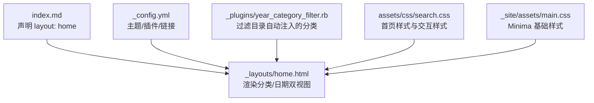
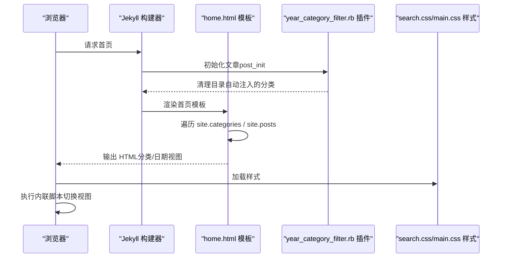
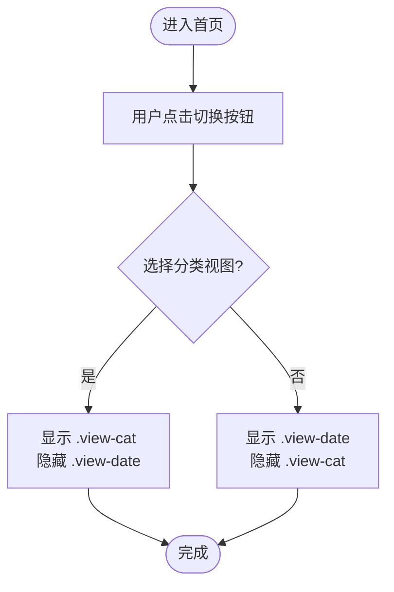
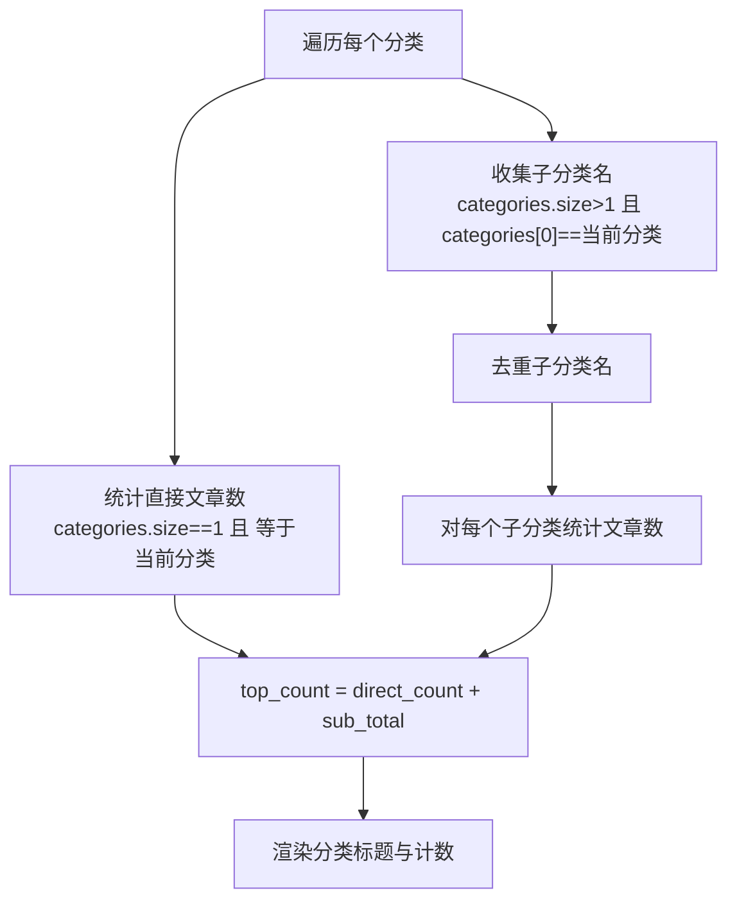
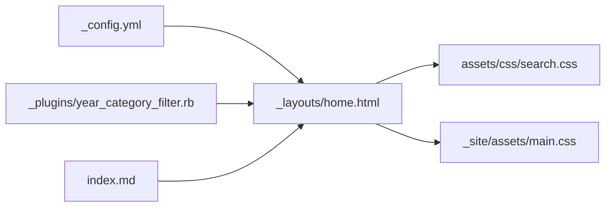

# 首页布局定制

<cite>
**本文引用的文件**
- [home.html](file://_layouts/home.html)
- [index.md](file://index.md)
- [_config.yml](file://_config.yml)
- [year_category_filter.rb](file://_plugins/year_category_filter.rb)
- [search.css](file://assets/css/search.css)
- [main.css](file://_site/assets/main.css)
</cite>

## 目录
1. [简介](#简介)
2. [项目结构](#项目结构)
3. [核心组件](#核心组件)
4. [架构总览](#架构总览)
5. [详细组件分析](#详细组件分析)
6. [依赖关系分析](#依赖关系分析)
7. [性能与可维护性建议](#性能与可维护性建议)
8. [故障排查指南](#故障排查指南)
9. [结论](#结论)
10. [附录：常用修改清单与最佳实践](#附录常用修改清单与最佳实践)

## 简介
本指南面向希望深度定制博客首页展示结构的作者，围绕以下目标展开：
- 自定义首页的展示结构与交互（分类视图/日期视图切换）
- 理解文章列表分组逻辑、统计信息计算与交互效果
- 通过修改 Liquid 模板调整排序、显示格式与页面布局
- 提供样式定制方法与响应式适配技巧
- 给出可直接落地的修改示例与最佳实践

## 项目结构
与首页布局直接相关的核心文件如下：
- 首页模板：_layouts/home.html
- 首页内容入口：index.md（使用 layout: home）
- 站点配置：_config.yml（主题、插件、链接等）
- 分类过滤插件：_plugins/year_category_filter.rb（控制分类来源）
- 首页样式：assets/css/search.css（包含首页相关样式）、_site/assets/main.css（Minima 基础样式）

图表来源
- [home.html:1-153](file://_layouts/home.html#L1-L153)
- [index.md:1-17](file://index.md#L1-L17)
- [_config.yml:1-45](file://_config.yml#L1-L45)
- [year_category_filter.rb:1-13](file://_plugins/year_category_filter.rb#L1-L13)
- [search.css:865-895](file://assets/css/search.css#L865-L895)
- [main.css:1-120](file://_site/assets/main.css#L1-L120)

章节来源
- [index.md:1-17](file://index.md#L1-L17)
- [home.html:1-153](file://_layouts/home.html#L1-L153)
- [_config.yml:1-45](file://_config.yml#L1-L45)

## 核心组件
- 首页模板（_layouts/home.html）
  - 负责渲染“分类视图”和“日期视图”，并提供前端切换逻辑
  - 在分类视图中实现“一级分类 + 二级子分类”的折叠分组与计数
  - 在日期视图中按“年 -> 月”分组并显示发布日期
- 首页内容（index.md）
  - 通过 front matter 指定 layout: home，承载首页正文内容
- 分类过滤插件（_plugins/year_category_filter.rb）
  - 移除由 _posts 子目录自动注入的分类，仅保留 front matter 中显式定义的分类
- 样式资源
  - assets/css/search.css：包含首页区域样式、视图切换按钮、归档列表样式等
  - _site/assets/main.css：Minima 主题基础样式（字体、间距、链接等）

章节来源
- [home.html:1-153](file://_layouts/home.html#L1-L153)
- [index.md:1-17](file://index.md#L1-L17)
- [year_category_filter.rb:1-13](file://_plugins/year_category_filter.rb#L1-L13)
- [search.css:865-895](file://assets/css/search.css#L865-L895)
- [main.css:1-120](file://_site/assets/main.css#L1-L120)

## 架构总览
首页渲染流程概览：
- Jekyll 构建时读取 index.md，应用 _layouts/home.html 模板
- 模板根据 site.posts 与 site.categories 生成两种视图
- 前端脚本监听点击事件，切换视图显示
- 样式文件为视图、列表、折叠控件提供视觉表现

图表来源
- [home.html:1-153](file://_layouts/home.html#L1-L153)
- [year_category_filter.rb:1-13](file://_plugins/year_category_filter.rb#L1-L13)
- [search.css:865-895](file://assets/css/search.css#L865-L895)
- [main.css:1-120](file://_site/assets/main.css#L1-L120)

## 详细组件分析

### 分类视图与日期视图切换
- 视图切换按钮
  - 两个按钮分别对应 data-view="cat" 与 data-view="date"
  - 点击后通过 JS 切换 .view-cat 与 .view-date 的 display 属性
- 分类视图
  - 对 site.categories 进行排序，逐类渲染
  - 支持两类文章：
    - 直接归类到该分类的文章（categories.size == 1）
    - 以“主分类+子分类”形式归类的文章（categories.size > 1，且 categories[0] 为主分类）
  - 对子分类名称去重，并按子分类分组列出文章
- 日期视图
  - 使用 group_by_exp 将 posts 按年分组，再按月分组
  - 默认展开第一个年份与月份，其余折叠

图表来源
- [home.html:14-17](file://_layouts/home.html#L14-L17)
- [home.html:134-152](file://_layouts/home.html#L134-L152)

章节来源
- [home.html:14-17](file://_layouts/home.html#L14-L17)
- [home.html:19-103](file://_layouts/home.html#L19-L103)
- [home.html:105-128](file://_layouts/home.html#L105-L128)
- [home.html:134-152](file://_layouts/home.html#L134-L152)

### 文章列表分组逻辑与统计
- 分类视图分组
  - 一级分类：按首字母排序（site.categories | sort）
  - 二级子分类：从主分类下筛选出 categories.size > 1 的文章，提取 categories[1] 作为子分类名，并进行去重
- 统计信息
  - 直接文章数：categories.size == 1 且 categories[0] 等于当前分类
  - 子分类文章总数：对每个子分类名统计匹配文章数量
  - 顶部计数 = 直接文章数 + 子分类文章总数
- 日期视图分组
  - 先按年分组，再按月分组；每层均显示文章数量

图表来源
- [home.html:25-58](file://_layouts/home.html#L25-L58)
- [home.html:60-102](file://_layouts/home.html#L60-L102)

章节来源
- [home.html:20-58](file://_layouts/home.html#L20-L58)
- [home.html:60-102](file://_layouts/home.html#L60-L102)

### 文章排序与显示格式
- 分类排序
  - 分类按字母顺序排序（site.categories | sort）
- 文章排序
  - 未显式排序时，遵循 Jekyll 默认顺序（通常按文件名中的日期降序）
  - 如需自定义排序，可在模板中对 cat_posts 或 year_group.items 使用 Liquid 过滤器（如 sort、reverse）
- 显示格式
  - 分类视图：仅显示标题链接
  - 日期视图：显示“月-日”日期与标题链接
  - 可通过修改模板中的 date 过滤器与文本拼接来调整格式

章节来源
- [home.html:20-21](file://_layouts/home.html#L20-L21)
- [home.html:105-128](file://_layouts/home.html#L105-L128)

### 页面布局与交互效果
- 折叠面板
  - 使用 details/summary 实现“年/月/分类”折叠，提升长列表可读性
- 视图切换
  - 通过内联脚本切换 display 属性，避免页面刷新
- RSS 订阅
  - 底部提供 feed.xml 订阅链接

章节来源
- [home.html:61-101](file://_layouts/home.html#L61-L101)
- [home.html:108-127](file://_layouts/home.html#L108-L127)
- [home.html:130-131](file://_layouts/home.html#L130-L131)
- [home.html:134-152](file://_layouts/home.html#L134-L152)

### 分类来源控制（插件）
- 作用
  - 移除由 _posts 子目录自动注入的分类，只保留 front matter 中显式定义的 categories
- 影响
  - 确保首页分类视图仅反映你期望的分类结构，避免目录名污染分类体系

章节来源
- [year_category_filter.rb:1-13](file://_plugins/year_category_filter.rb#L1-L13)

### 样式定制与响应式适配
- 关键样式位置
  - 首页区域样式与视图切换按钮位于 assets/css/search.css
  - Minima 基础样式位于 _site/assets/main.css
- 主要可定制项
  - 首页标题、段落、分隔线、RSS 链接样式
  - 归档列表、折叠控件、计数标签样式
  - 响应式断点与移动端适配
- 推荐做法
  - 优先覆盖 search.css 中的首页相关规则，保持与主题变量一致
  - 使用 CSS 变量统一颜色、圆角、过渡等设计令牌
  - 在小屏设备上调整字号、行高、间距与折叠控件尺寸

章节来源
- [search.css:865-895](file://assets/css/search.css#L865-L895)
- [main.css:1-120](file://_site/assets/main.css#L1-L120)

## 依赖关系分析
- 模板依赖
  - home.html 依赖 site.posts、site.categories、page.title、feed.xml 等全局对象
- 插件依赖
  - year_category_filter.rb 在 post_init 钩子中修改 post.data.categories
- 样式依赖
  - 首页样式集中在 search.css，基础样式来自 main.css
- 配置依赖
  - _config.yml 决定主题、插件、permalinks、feed 等

图表来源
- [_config.yml:1-45](file://_config.yml#L1-L45)
- [home.html:1-153](file://_layouts/home.html#L1-L153)
- [year_category_filter.rb:1-13](file://_plugins/year_category_filter.rb#L1-L13)
- [search.css:865-895](file://assets/css/search.css#L865-L895)
- [main.css:1-120](file://_site/assets/main.css#L1-L120)

章节来源
- [_config.yml:1-45](file://_config.yml#L1-L45)
- [home.html:1-153](file://_layouts/home.html#L1-L153)
- [year_category_filter.rb:1-13](file://_plugins/year_category_filter.rb#L1-L13)

## 性能与可维护性建议
- 减少重复遍历
  - 当前分类视图存在多次循环统计，若文章量较大，可考虑在插件中预计算分类统计并在模板中直接使用
- 缓存中间结果
  - 将去重的子分类名与计数结果缓存到临时变量，避免重复计算
- 简化日期视图分组
  - 若不需要按月分组，可改为仅按年分组以减少 DOM 层级
- 样式模块化
  - 将首页专属样式独立成模块，便于复用与维护

[本节为通用建议，不直接分析具体文件]

## 故障排查指南
- 分类视图为空或不完整
  - 检查是否误删了 front matter 中的 categories
  - 确认 year_category_filter.rb 未被禁用，且没有意外过滤掉期望的分类
- 日期视图无数据
  - 检查 _posts 下的文章命名是否符合 Jekyll 规范（YYYY-MM-DD-xxx.md）
  - 确认 permalink 配置不影响文章可见性
- 视图切换无效
  - 检查浏览器控制台是否有 JS 错误
  - 确认 .view-toggle-btn 与 .view-cat/.view-date 元素存在且未被其他脚本覆盖
- 样式错乱
  - 确认 assets/css/search.css 与 _site/assets/main.css 已正确加载
  - 检查是否存在 !important 冲突或媒体查询覆盖

章节来源
- [year_category_filter.rb:1-13](file://_plugins/year_category_filter.rb#L1-L13)
- [home.html:134-152](file://_layouts/home.html#L134-L152)
- [search.css:865-895](file://assets/css/search.css#L865-L895)
- [main.css:1-120](file://_site/assets/main.css#L1-L120)

## 结论
通过合理组织 Liquid 模板、利用插件控制分类来源，并结合清晰的样式分层，你可以灵活定制首页的展示结构。分类视图适合知识型归档，日期视图适合时间线浏览；两者结合可满足多样化阅读习惯。建议在保持语义化与可访问性的前提下，逐步迭代样式与交互细节，以获得更佳的阅读体验。

[本节为总结性内容，不直接分析具体文件]

## 附录：常用修改清单与最佳实践

- 调整分类排序
  - 在分类视图处对 site.categories 使用 sort 或 reverse 过滤器
  - 参考路径：[home.html:20-21](file://_layouts/home.html#L20-L21)
- 自定义文章排序
  - 在日期视图中对 year_group.items 使用 sort/reverse 等过滤器
  - 参考路径：[home.html:105-128](file://_layouts/home.html#L105-L128)
- 修改日期显示格式
  - 调整 date 过滤器参数（如 %Y-%m-%d、%m月）
  - 参考路径：[home.html:114-119](file://_layouts/home.html#L114-L119)
- 增加/减少折叠层级
  - 删除或新增 details/summary 节点，注意保持 class 与统计逻辑一致
  - 参考路径：[home.html:61-101](file://_layouts/home.html#L61-L101)、[home.html:108-127](file://_layouts/home.html#L108-L127)
- 调整视图切换行为
  - 修改内联脚本的 active 状态与 display 切换逻辑
  - 参考路径：[home.html:134-152](file://_layouts/home.html#L134-L152)
- 样式定制要点
  - 优先覆盖 search.css 中的首页相关规则，保持与设计系统一致
  - 参考路径：[search.css:865-895](file://assets/css/search.css#L865-L895)
- 分类来源管理
  - 如需恢复目录自动注入的分类，请注释或删除 year_category_filter.rb 中的过滤逻辑
  - 参考路径：[year_category_filter.rb:1-13](file://_plugins/year_category_filter.rb#L1-L13)

章节来源
- [home.html:20-21](file://_layouts/home.html#L20-L21)
- [home.html:105-128](file://_layouts/home.html#L105-L128)
- [home.html:114-119](file://_layouts/home.html#L114-L119)
- [home.html:61-101](file://_layouts/home.html#L61-L101)
- [home.html:108-127](file://_layouts/home.html#L108-L127)
- [home.html:134-152](file://_layouts/home.html#L134-L152)
- [search.css:865-895](file://assets/css/search.css#L865-L895)
- [year_category_filter.rb:1-13](file://_plugins/year_category_filter.rb#L1-L13)