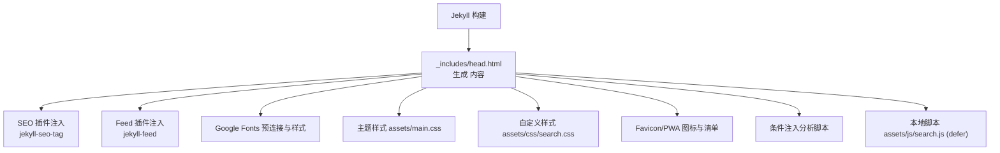
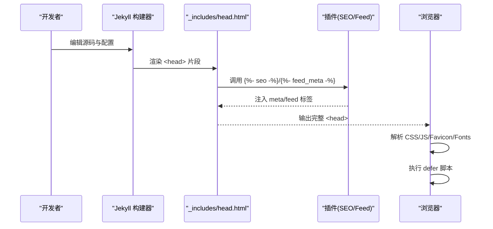
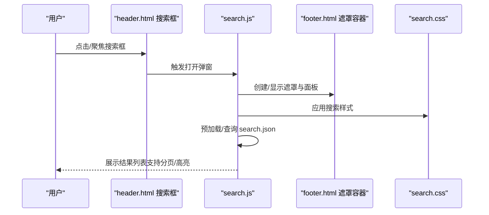
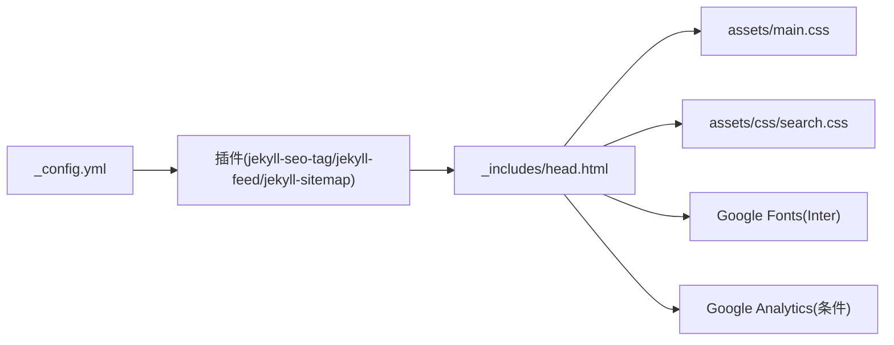

# 头部组件

<cite>
**本文引用的文件**   
- [head.html](file://_includes/head.html)
- [_config.yml](file://_config.yml)
- [Gemfile](file://Gemfile)
- [search.css](file://assets/css/search.css)
- [search.js](file://assets/js/search.js)
- [header.html](file://_includes/header.html)
- [footer.html](file://_includes/footer.html)
- [home.html](file://_layouts/home.html)
- [post.html](file://_layouts/post.html)
</cite>

## 目录
1. [简介](#简介)
2. [项目结构](#项目结构)
3. [核心组件](#核心组件)
4. [架构总览](#架构总览)
5. [详细组件分析](#详细组件分析)
6. [依赖分析](#依赖分析)
7. [性能考虑](#性能考虑)
8. [故障排查指南](#故障排查指南)
9. [结论](#结论)
10. [附录：定制示例](#附录定制示例)

## 简介
本文件聚焦于站点“头部组件”的实现与使用，围绕 _includes/head.html 展开，系统说明站点元数据、SEO 优化、外部资源引用、CSS/JS 加载策略，以及搜索引擎优化相关的 meta 标签配置。同时提供可操作的定制示例，帮助读者快速扩展样式、调整 SEO 参数、集成分析工具等。

## 项目结构
头部组件由 Jekyll 的 include 模板 head.html 提供，被主题布局（如 Minima）在页面 <head> 中引入。其职责包括：
- 基础字符集与视口设置
- SEO 插件注入的站点元信息
- 字体预连接与 Google Fonts 引入
- 主题与自定义 CSS 的加载顺序
- RSS feed 元信息
- Favicon 与 PWA 相关图标/清单
- 条件性分析脚本注入
- 本地 JS 资源的延迟加载

图表来源
- [head.html:1-26](file://_includes/head.html#L1-L26)
- [_config.yml:40-44](file://_config.yml#L40-L44)

章节来源
- [head.html:1-26](file://_includes/head.html#L1-L26)
- [_config.yml:1-44](file://_config.yml#L1-L44)

## 核心组件
- 站点元数据与 SEO
  - 通过  注入站点标题、描述、关键词、Open Graph/Twitter Card 等元信息，来源于 _config.yml 与文章 front matter。
  - 通过  注入 RSS/Atom 订阅链接。
- 外部资源
  - 预连接 Google Fonts 域名并加载 Inter 字体。
  - 加载主题主样式 assets/main.css 与搜索样式 assets/css/search.css。
- 图标与 PWA
  - 多尺寸 favicon、manifest、safari pinned tab、Windows tile 配置。
- 分析与脚本
  - 生产环境且配置了 google_analytics 时，动态包含分析脚本片段。
  - 本地 search.js 以 defer 方式加载，避免阻塞渲染。

章节来源
- [head.html:1-26](file://_includes/head.html#L1-L26)
- [_config.yml:1-44](file://_config.yml#L1-L44)

## 架构总览
下图展示从 Jekyll 构建到浏览器渲染的关键路径，突出 head.html 在各环节中的作用。

图表来源
- [head.html:1-26](file://_includes/head.html#L1-L26)
- [_config.yml:40-44](file://_config.yml#L40-L44)

## 详细组件分析

### 站点元数据与 SEO 配置
- 基础 meta
  - charset、IE 兼容模式、viewport 响应式设置。
- SEO 插件
  - jekyll-seo-tag 根据站点与页面上下文自动生成 title、description、keywords、canonical、Open Graph、Twitter Card 等标签。
  - 站点级信息来自 _config.yml（title、description、author、url 等），页面级信息来自文章 front matter（如 page.title、page.description）。
- Feed 元信息
  - jekyll-feed 注入 feed.xml 或 atom.xml 的 rel="alternate" 链接。

章节来源
- [head.html:1-11](file://_includes/head.html#L1-L11)
- [_config.yml:1-10](file://_config.yml#L1-L10)
- [Gemfile:12-16](file://Gemfile#L12-L16)

### 外部资源引用策略
- 字体
  - 预连接 fonts.googleapis.com 与 fonts.gstatic.com，减少 DNS 与 TLS 握手开销。
  - 通过 Google Fonts 加载 Inter 字体，提升排版一致性。
- 样式表加载顺序
  - 先加载主题主样式 assets/main.css，再加载自定义样式 assets/css/search.css，确保后者覆盖前者。
- 图标与 PWA
  - 提供 apple-touch-icon、favicon 多尺寸、site.webmanifest、safari-pinned-tab、Windows tile 颜色与配置文件，适配多平台体验。

章节来源
- [head.html:6-21](file://_includes/head.html#L6-L21)

### JavaScript 资源加载策略
- 本地脚本
  - search.js 使用 defer 属性加载，保证 DOM 就绪后再执行，不阻塞首屏渲染。
- 第三方库
  - 当前未直接引入第三方 JS 库；字体通过 Google Fonts 加载，属于 CSS 资源范畴。
- 分析脚本
  - 仅在 production 环境且配置了 google_analytics 时，才包含分析脚本片段，避免开发环境泄露数据。

章节来源
- [head.html:22-26](file://_includes/head.html#L22-L26)
- [_config.yml:32-33](file://_config.yml#L32-L33)

### 搜索引擎优化（SEO）相关 meta 标签
- 自动生成的元信息
  - 由 jekyll-seo-tag 基于站点与页面上下文生成，包括站点标题、描述、作者、URL、OG/Twitter 卡片等。
- 手动补充建议
  - 在文章 front matter 中设置 description、image、tags、categories 等字段，有助于生成更丰富的摘要与社交分享预览。
- Open Graph 支持
  - OG:title、OG:description、OG:image、OG:url 等由插件自动填充，便于社交平台抓取。

章节来源
- [head.html:5](file://_includes/head.html#L5)
- [_config.yml:1-10](file://_config.yml#L1-L10)
- [Gemfile:12-16](file://Gemfile#L12-L16)

### 搜索功能与头部联动
- 头部搜索框
  - header.html 提供搜索输入框，绑定 data-search-url 指向 search.json。
- 弹窗与结果面板
  - footer.html 放置搜索结果遮罩容器，search.js 负责交互、分页与高亮。
- 样式与行为
  - search.css 定义搜索 UI 与暗色模式变量；search.js 实现去重、模糊匹配、滚动加载等逻辑。

图表来源
- [header.html:1-10](file://_includes/header.html#L1-L10)
- [footer.html:30-34](file://_includes/footer.html#L30-L34)
- [search.js:1-526](file://assets/js/search.js#L1-L526)
- [search.css:1-800](file://assets/css/search.css#L1-L800)

章节来源
- [header.html:1-10](file://_includes/header.html#L1-L10)
- [footer.html:30-34](file://_includes/footer.html#L30-L34)
- [search.js:1-526](file://assets/js/search.js#L1-L526)
- [search.css:1-800](file://assets/css/search.css#L1-L800)

## 依赖分析
- 插件依赖
  - jekyll-seo-tag：注入 SEO 元信息。
  - jekyll-feed：注入 RSS/Atom 订阅链接。
  - jekyll-sitemap：生成站点地图（虽不在 head.html 直接体现，但与 SEO 生态相关）。
- 主题与样式
  - Minima 主题主样式 assets/main.css 优先加载，自定义样式 assets/css/search.css 后加载以覆盖默认样式。
- 外部服务
  - Google Fonts：Inter 字体加载。
  - 可选分析服务：Google Analytics（仅生产环境启用）。

图表来源
- [_config.yml:40-44](file://_config.yml#L40-L44)
- [Gemfile:12-16](file://Gemfile#L12-L16)
- [head.html:1-26](file://_includes/head.html#L1-L26)

章节来源
- [Gemfile:12-16](file://Gemfile#L12-L16)
- [_config.yml:40-44](file://_config.yml#L40-L44)
- [head.html:1-26](file://_includes/head.html#L1-L26)

## 性能考虑
- 字体预连接：对 Google Fonts 域名进行 preconnect，降低首次请求延迟。
- 样式加载顺序：主题样式在前，自定义样式在后，避免覆盖冲突导致的二次计算。
- 脚本延迟执行：search.js 使用 defer，避免阻塞首屏渲染。
- 条件注入：分析脚本仅在 production 环境加载，减少开发/测试环境的额外开销。
- 资源体积：当前未引入大型第三方 JS 库，保持轻量。

[本节为通用指导，无需代码来源]

## 故障排查指南
- 样式未生效
  - 检查自定义样式是否在主题样式之后加载；确认相对路径正确。
- 搜索无结果
  - 确认 search.json 存在并可访问；检查 search.js 是否成功预加载索引。
- 分析数据缺失
  - 确认生产环境已配置 google_analytics；检查条件注入逻辑是否命中。
- 字体加载缓慢
  - 检查网络连通性与缓存；必要时添加更多预连接或替换为国内镜像。

章节来源
- [head.html:6-26](file://_includes/head.html#L6-L26)
- [_config.yml:32-33](file://_config.yml#L32-L33)

## 结论
head.html 作为站点的统一入口，集中管理元数据、SEO、外部资源与脚本加载策略。通过插件与配置的协同，实现了开箱即用的 SEO 能力与可扩展的样式/脚本体系。遵循本文的定制示例，可快速扩展站点能力并保持良好性能。

[本节为总结，无需代码来源]

## 附录：定制示例

- 添加新的样式文件
  - 在 assets/css 下新增样式文件，并在 head.html 中按优先级插入 link 标签，确保在主题样式之后、其他自定义样式之前或之后按需排序。
  - 参考路径：[head.html:9-10](file://_includes/head.html#L9-L10)

- 配置 SEO 参数
  - 站点级：在 _config.yml 中设置 title、description、author、url 等。
  - 页面级：在文章 front matter 中设置 description、image、tags、categories 等。
  - 参考路径：[_config.yml:1-10](file://_config.yml#L1-L10)

- 集成分析工具
  - 在 _config.yml 中配置 google_analytics，并确保生产环境启用；如需更换为其他分析服务，可在 head.html 的条件块内替换 include 片段。
  - 参考路径：[_config.yml:32-33](file://_config.yml#L32-L33)、[head.html:22-24](file://_includes/head.html#L22-L24)

- 修改 Favicon 与 PWA 图标
  - 更新 favicons 目录下的图标与 site.webmanifest，确保各尺寸与清单路径一致。
  - 参考路径：[head.html:12-21](file://_includes/head.html#L12-L21)

- 切换字体或增加字体权重
  - 修改 Google Fonts 链接中的字体族与字重，或新增预连接与样式引用。
  - 参考路径：[head.html:6-8](file://_includes/head.html#L6-L8)

- 调整搜索功能
  - 若需扩展搜索字段或交互，可在 search.js 中调整匹配与渲染逻辑，并在 search.css 中完善样式。
  - 参考路径：[search.js:1-526](file://assets/js/search.js#L1-L526)、[search.css:1-800](file://assets/css/search.css#L1-L800)

章节来源
- [head.html:6-26](file://_includes/head.html#L6-L26)
- [_config.yml:1-10](file://_config.yml#L1-L10)
- [_config.yml:32-33](file://_config.yml#L32-L33)
- [search.js:1-526](file://assets/js/search.js#L1-L526)
- [search.css:1-800](file://assets/css/search.css#L1-L800)