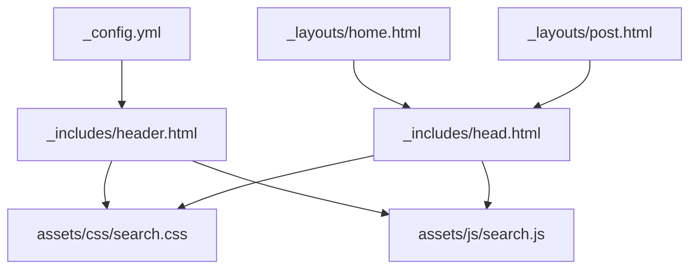
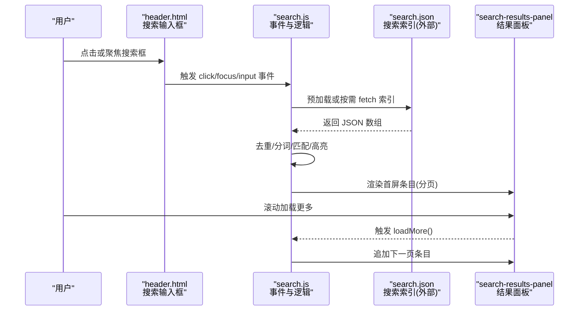
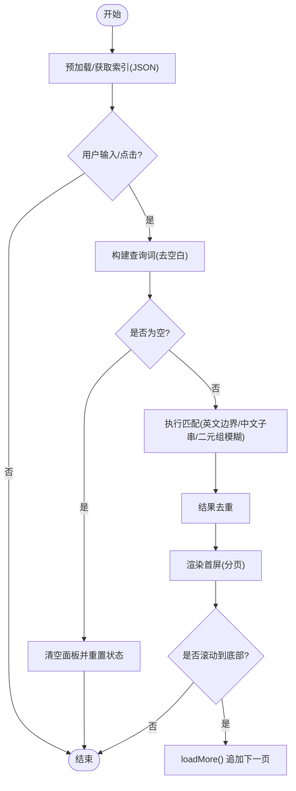
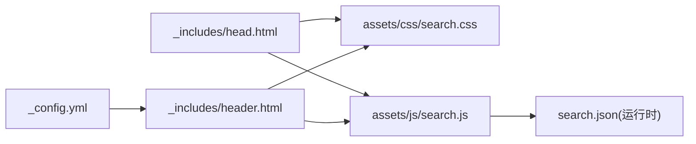

# 导航头部组件

<cite>
**本文引用的文件**   
- [header.html](file://_includes/header.html)
- [head.html](file://_includes/head.html)
- [search.css](file://assets/css/search.css)
- [search.js](file://assets/js/search.js)
- [_config.yml](file://_config.yml)
- [home.html](file://_layouts/home.html)
- [post.html](file://_layouts/post.html)
</cite>

## 目录
1. [简介](#简介)
2. [项目结构](#项目结构)
3. [核心组件](#核心组件)
4. [架构总览](#架构总览)
5. [详细组件分析](#详细组件分析)
6. [依赖关系分析](#依赖关系分析)
7. [性能与可访问性](#性能与可访问性)
8. [故障排查指南](#故障排查指南)
9. [结论](#结论)
10. [附录：定制示例](#附录定制示例)

## 简介
本文件围绕“导航头部组件”进行系统化文档化，重点解析 header.html 的结构与实现，涵盖站点标题、搜索框等核心元素的布局；说明响应式设计与移动端适配策略；解释搜索功能的集成方式（交互逻辑与结果处理）；并给出如何扩展与定制导航的实操建议。

## 项目结构
导航头部由以下关键文件协同完成：
- 模板片段：_includes/header.html（头部骨架）
- 页面头信息：_includes/head.html（引入样式与脚本）
- 样式资源：assets/css/search.css（头部与搜索弹窗样式）
- 交互脚本：assets/js/search.js（搜索索引加载、匹配、分页渲染）
- 站点配置：_config.yml（站点标题等全局变量）
- 布局模板：_layouts/home.html、_layouts/post.html（默认布局引用 head 与 header）

图表来源
- [header.html:1-10](file://_includes/header.html#L1-L10)
- [head.html:1-26](file://_includes/head.html#L1-L26)
- [search.css:180-272](file://assets/css/search.css#L180-L272)
- [search.js:1-20](file://assets/js/search.js#L1-L20)
- [_config.yml:1-10](file://_config.yml#L1-L10)
- [home.html:1-10](file://_layouts/home.html#L1-L10)
- [post.html:1-10](file://_layouts/post.html#L1-L10)

章节来源
- [header.html:1-10](file://_includes/header.html#L1-L10)
- [head.html:1-26](file://_includes/head.html#L1-L26)
- [search.css:180-272](file://assets/css/search.css#L180-L272)
- [search.js:1-20](file://assets/js/search.js#L1-L20)
- [_config.yml:1-10](file://_config.yml#L1-L10)
- [home.html:1-10](file://_layouts/home.html#L1-L10)
- [post.html:1-10](file://_layouts/post.html#L1-L10)

## 核心组件
- 站点标题：通过模板变量输出，链接到站点根路径。
- 搜索容器与输入框：提供占位文本与数据属性以指向搜索索引 JSON。
- 吸顶头部与弹性布局：使用 sticky 定位与 flex 布局对齐元素。
- 搜索弹窗：全屏遮罩 + 面板 + 内嵌输入框 + 滚动分页加载。
- 样式主题：CSS 变量定义明暗主题、圆角、阴影、过渡动效等。

章节来源
- [header.html:1-10](file://_includes/header.html#L1-L10)
- [search.css:180-272](file://assets/css/search.css#L180-L272)
- [search.js:1-20](file://assets/js/search.js#L1-L20)

## 架构总览
导航头部在页面渲染时由 Jekyll 模板注入，随后 CSS 与 JS 分别负责外观与交互。搜索功能采用前端静态索引（JSON）+ 客户端模糊/精确匹配的方式，无需后端服务。

图表来源
- [header.html:5-7](file://_includes/header.html#L5-L7)
- [search.js:184-187](file://assets/js/search.js#L184-L187)
- [search.js:451-514](file://assets/js/search.js#L451-L514)
- [search.js:378-448](file://assets/js/search.js#L378-L448)

## 详细组件分析

### 头部结构与布局
- 外层容器：使用 wrapper 与 header-wrapper 类名，结合 Flexbox 水平排列站点标题与搜索区域。
- 站点标题：a.site-title 链接至相对根路径，文本来自站点配置。
- 搜索容器：div.search-container 包裹 input.search-input，并通过 data-search-url 指定索引地址。
- 吸顶效果：.site-header 使用 sticky 定位，保证滚动时始终可见。

章节来源
- [header.html:1-10](file://_includes/header.html#L1-L10)
- [search.css:180-216](file://assets/css/search.css#L180-L216)
- [_config.yml:1-5](file://_config.yml#L1-L5)

### 响应式设计与移动端适配
- 头部布局：Flex 布局在窄屏下自动换行或压缩，标题固定宽度，搜索区自适应。
- 搜索框隐藏策略：在较小屏幕（如小于 600px）隐藏头部搜索框，保留全屏弹窗入口（点击仍会打开）。
- 弹窗适配：小屏下弹窗铺满视口，输入栏与面板无圆角，关闭按钮位置调整。

章节来源
- [search.css:222-272](file://assets/css/search.css#L222-L272)
- [search.css:494-516](file://assets/css/search.css#L494-L516)

### 搜索功能集成与交互逻辑
- 索引加载：页面初始化时预加载 search.json，首次点击或输入时直接使用缓存；若未缓存则异步获取。
- 匹配算法：
  - 英文关键词：单词边界匹配（正则 \b）。
  - 中文关键词：子串匹配；当出现连续中文字段时启用二元组模糊评分，阈值过滤。
- 高亮与摘要：对标题与内容片段进行高亮，按命中位置生成上下文摘要。
- 分页加载：每页固定条数，滚动到底部自动加载下一页，直至全部加载完毕。
- 弹窗行为：打开时锁定背景滚动，支持点击遮罩关闭、ESC 关闭（可通过扩展）、同步主输入框值。

图表来源
- [search.js:184-187](file://assets/js/search.js#L184-L187)
- [search.js:198-216](file://assets/js/search.js#L198-L216)
- [search.js:277-331](file://assets/js/search.js#L277-L331)
- [search.js:378-448](file://assets/js/search.js#L378-L448)

章节来源
- [search.js:1-20](file://assets/js/search.js#L1-L20)
- [search.js:184-187](file://assets/js/search.js#L184-L187)
- [search.js:198-216](file://assets/js/search.js#L198-L216)
- [search.js:277-331](file://assets/js/search.js#L277-L331)
- [search.js:378-448](file://assets/js/search.js#L378-L448)

### 导航链接的动态生成机制
- 当前实现：头部仅包含站点标题与搜索框，未内置通用导航菜单。
- 动态链接来源：
  - 站点标题链接：由 _config.yml 的 title 与相对根路径决定。
  - 文章归档视图：首页布局根据分类与日期动态生成列表与链接。
- 如需在头部添加导航项，可在 header.html 中插入 site-nav 结构，并在 CSS 中补充对应样式。

章节来源
- [header.html:1-10](file://_includes/header.html#L1-L10)
- [_config.yml:1-5](file://_config.yml#L1-L5)
- [home.html:19-84](file://_layouts/home.html#L19-L84)

## 依赖关系分析
- 模板依赖：
  - header.html 依赖 _config.yml 中的站点标题。
  - head.html 引入 search.css 与 search.js。
- 运行时依赖：
  - search.js 依赖 DOM 元素 id/class 与 search.json 数据结构。
  - search.css 依赖 CSS 变量与媒体查询断点。

图表来源
- [_config.yml:1-5](file://_config.yml#L1-L5)
- [head.html:9-11](file://_includes/head.html#L9-L11)
- [head.html:25-26](file://_includes/head.html#L25-L26)
- [header.html:1-10](file://_includes/header.html#L1-L10)

章节来源
- [head.html:9-11](file://_includes/head.html#L9-L11)
- [head.html:25-26](file://_includes/head.html#L25-L26)
- [header.html:1-10](file://_includes/header.html#L1-L10)
- [_config.yml:1-5](file://_config.yml#L1-L5)

## 性能与可访问性
- 性能优化
  - 预加载索引：页面初始化即 fetch 索引，减少首次交互延迟。
  - 去重与节流：索引去重、输入防抖（200ms），避免重复计算。
  - 分页渲染：每次只渲染少量条目，滚动懒加载提升长列表体验。
  - requestAnimationFrame：批量更新 DOM，降低重排开销。
- 可访问性
  - 语义标签：header、nav、input 等具备基本语义。
  - 焦点管理：弹窗打开后聚焦内部输入框，关闭恢复滚动位置。
  - 键盘友好：Tab 聚焦触发弹窗，便于键盘操作。

章节来源
- [search.js:184-187](file://assets/js/search.js#L184-L187)
- [search.js:487-514](file://assets/js/search.js#L487-L514)
- [search.js:378-448](file://assets/js/search.js#L378-L448)
- [search.js:132-163](file://assets/js/search.js#L132-L163)

## 故障排查指南
- 搜索框不显示
  - 检查 head.html 是否正确引入 search.css 与 search.js。
  - 确认 header.html 中存在 .search-container 与 #search-input。
- 无法加载搜索索引
  - 确认 search.json 存在且路径与 data-search-url 一致。
  - 查看控制台网络请求与跨域限制。
- 搜索结果无高亮或匹配异常
  - 检查索引字段是否包含 title/content/date/categories。
  - 验证中文/英文关键词匹配逻辑是否符合预期。
- 弹窗无法关闭或滚动异常
  - 检查遮罩点击事件与 body 滚动锁定逻辑。
  - 确认小屏适配样式未被覆盖。

章节来源
- [head.html:9-11](file://_includes/head.html#L9-L11)
- [head.html:25-26](file://_includes/head.html#L25-L26)
- [header.html:5-7](file://_includes/header.html#L5-L7)
- [search.js:112-126](file://assets/js/search.js#L112-L126)
- [search.js:166-181](file://assets/js/search.js#L166-L181)

## 结论
该导航头部组件以最小化的 HTML 结构配合强大的 CSS 与 JS 实现，提供了吸顶展示、响应式适配与完整的客户端搜索能力。其设计清晰、可扩展性强，适合在 Jekyll 博客项目中快速复用与二次定制。

## 附录：定制示例

- 修改导航样式
  - 目标：调整头部背景色、字体大小、间距。
  - 参考位置：
    - 头部容器与标题样式：[search.css:180-216](file://assets/css/search.css#L180-L216)
    - 搜索框样式与焦点态：[search.css:222-272](file://assets/css/search.css#L222-L272)
  - 步骤：
    - 在 search.css 中覆盖 .site-header、.header-wrapper、.site-title 相关属性。
    - 调整 --color-* 等 CSS 变量以统一主题。

- 添加新的导航项
  - 目标：在头部增加“关于”、“归档”等链接。
  - 参考位置：
    - 头部模板：[header.html:1-10](file://_includes/header.html#L1-L10)
    - 首页归档视图（作为参考）：[home.html:19-84](file://_layouts/home.html#L19-L84)
  - 步骤：
    - 在 header.html 的 header-wrapper 内新增 a.site-nav-item 链接。
    - 在 search.css 中为 .site-nav-item 添加样式（颜色、悬停态、间距）。
    - 如需响应式折叠，可参考现有媒体查询断点扩展。

- 调整搜索框位置
  - 目标：将搜索框移至标题右侧或左侧。
  - 参考位置：
    - 头部布局：[header.html:1-10](file://_includes/header.html#L1-L10)
    - Flex 布局与顺序控制：[search.css:191-216](file://assets/css/search.css#L191-L216)
  - 步骤：
    - 调整 header-wrapper 的子元素顺序或使用 order 属性。
    - 在小屏下保持良好可读性与触控体验。

- 自定义搜索弹窗样式
  - 目标：修改弹窗背景、面板圆角、滚动条样式。
  - 参考位置：
    - 弹窗与面板样式：[search.css:278-386](file://assets/css/search.css#L278-L386)
    - 小屏适配：[search.css:494-516](file://assets/css/search.css#L494-L516)
  - 步骤：
    - 覆盖 .search-results、.search-results-panel、.search-overlay-input 等类。
    - 调整 --radius-*、--shadow-* 等变量以获得一致的视觉风格。

- 扩展搜索算法
  - 目标：增强中文分词或相似度评分。
  - 参考位置：
    - 匹配与高亮：[search.js:198-216](file://assets/js/search.js#L198-L216)
    - 中文二元组模糊匹配：[search.js:277-331](file://assets/js/search.js#L277-L331)
  - 步骤：
    - 在 keywordMatches 与 performSearch 中扩展规则。
    - 调整阈值与权重，平衡召回率与准确率。