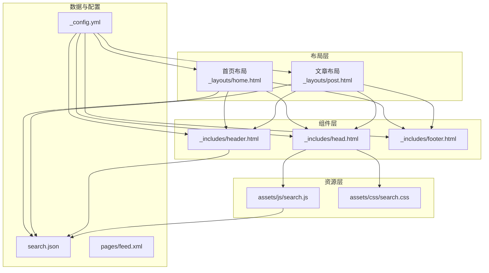
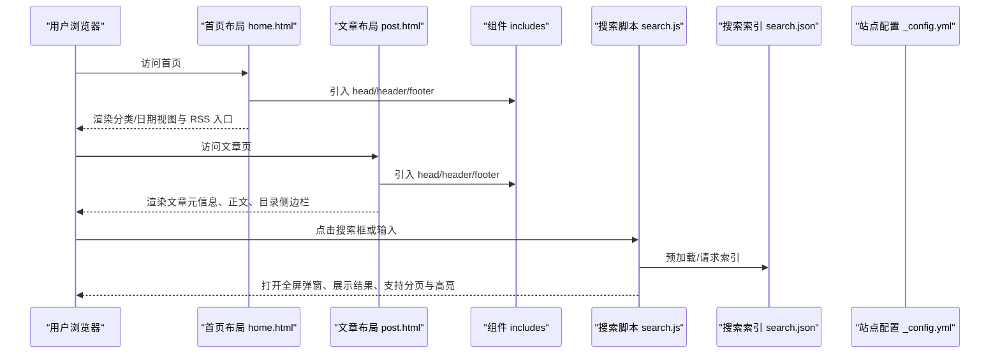
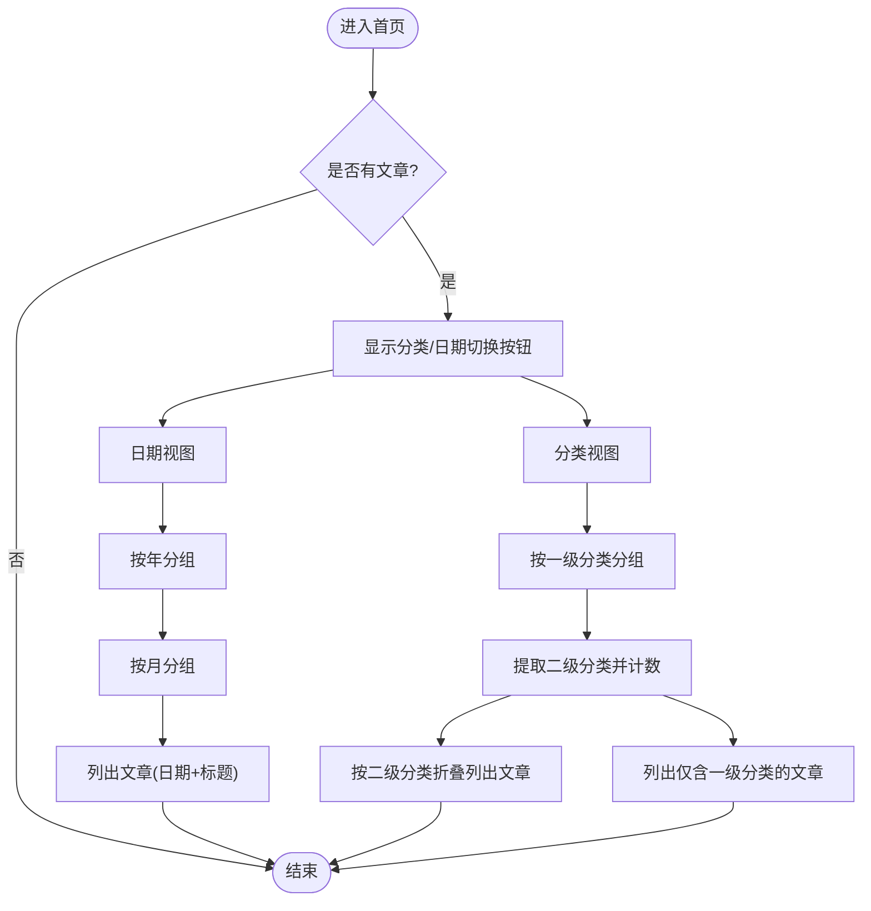
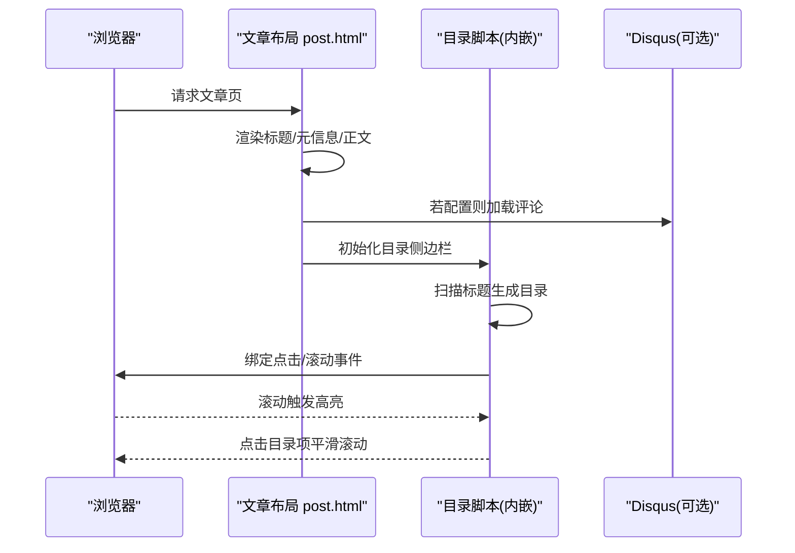
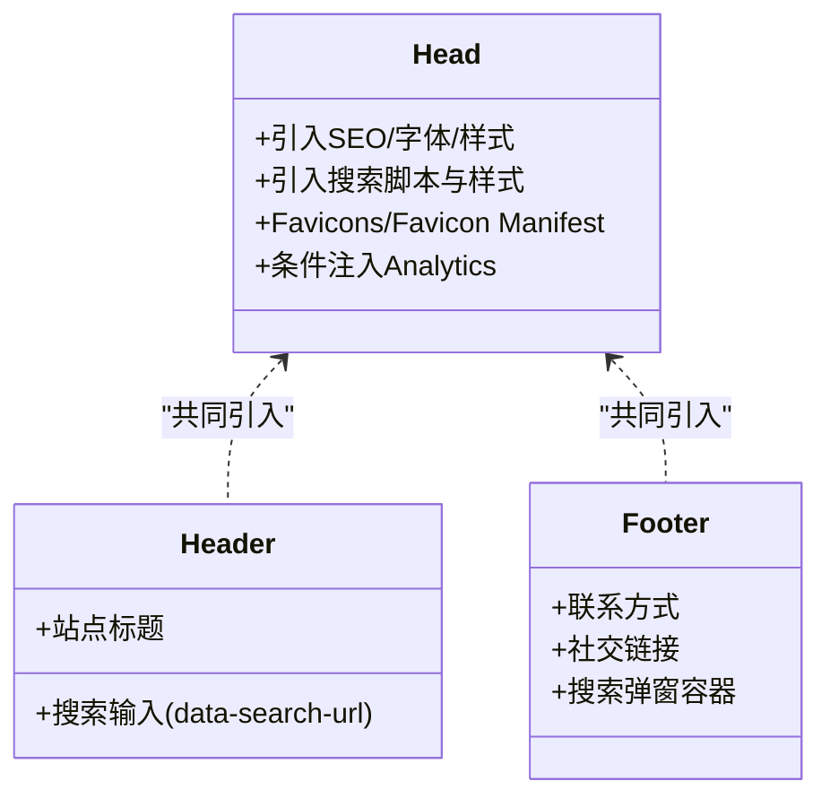
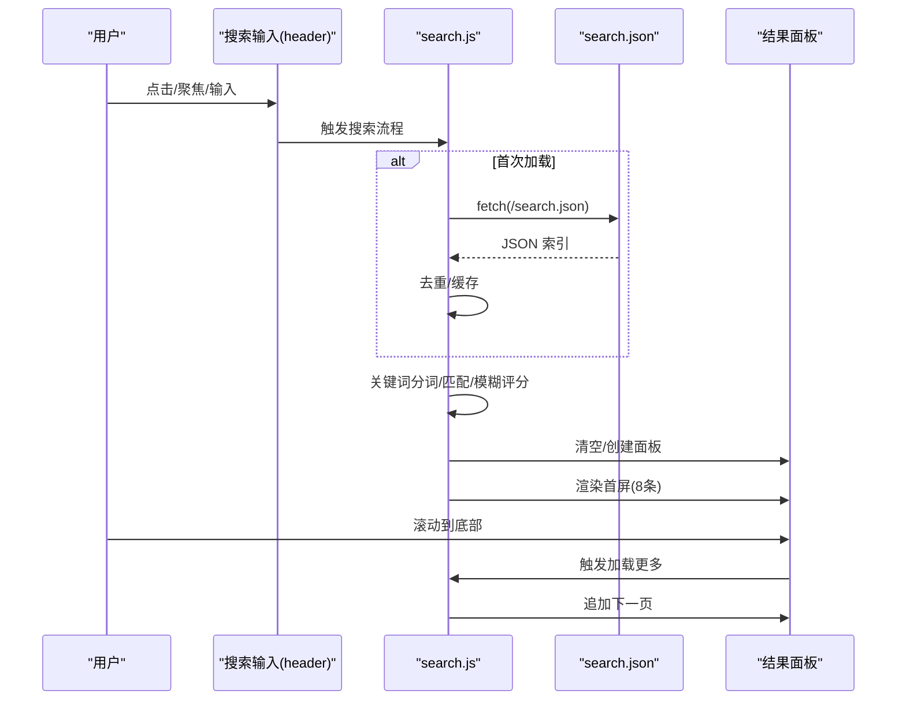
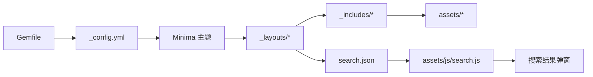

# 布局模板系统

<cite>
**本文引用的文件**   
- [首页布局 home.html](file://_layouts/home.html)
- [文章布局 post.html](file://_layouts/post.html)
- [头部组件 head.html](file://_includes/head.html)
- [页头组件 header.html](file://_includes/header.html)
- [页脚组件 footer.html](file://_includes/footer.html)
- [站点配置 _config.yml](file://_config.yml)
- [搜索索引 search.json](file://search.json)
- [搜索脚本 assets/js/search.js](file://assets/js/search.js)
- [搜索样式 assets/css/search.css](file://assets/css/search.css)
- [RSS 订阅 pages/feed.xml](file://pages/feed.xml)
- [插件 ruby34_compat.rb](file://_plugins/ruby34_compat.rb)
- [Gemfile](file://Gemfile)
</cite>

## 目录
1. [简介](#简介)
2. [项目结构](#项目结构)
3. [核心组件](#核心组件)
4. [架构总览](#架构总览)
5. [详细组件分析](#详细组件分析)
6. [依赖关系分析](#依赖关系分析)
7. [性能与体验优化](#性能与体验优化)
8. [故障排查指南](#故障排查指南)
9. [结论](#结论)
10. [附录：定制示例](#附录定制示例)

## 简介
本文件系统性梳理该 Jekyll 博客的布局模板体系，重点覆盖以下方面：
- 基础布局与继承关系（基于 Minima 主题）
- 首页布局（home.html）：分类/日期双视图、归档列表、RSS 订阅入口
- 文章布局（post.html）：元数据渲染、内容渲染、评论集成、目录侧边栏
- 可复用组件（includes）：head、header、footer 的模块化设计
- 全文搜索：前端交互、索引生成、去重与高亮、分页加载
- 模板定制实践：如何修改布局、新增组件、调整页面元素

## 项目结构
围绕布局与模板的关键目录与文件如下：
- _layouts：页面级布局模板（home.html、post.html）
- _includes：可复用片段（head.html、header.html、footer.html）
- assets：静态资源（CSS/JS），包含搜索功能
- search.json：构建期生成的全文检索索引
- pages/feed.xml：RSS 订阅源
- _config.yml：站点全局配置（主题、插件、链接等）
- _plugins：自定义 Liquid 过滤器与兼容性补丁

图示来源
- [首页布局 home.html:1-135](file://_layouts/home.html#L1-L135)
- [文章布局 post.html:1-105](file://_layouts/post.html#L1-L105)
- [头部组件 head.html:1-27](file://_includes/head.html#L1-L27)
- [页头组件 header.html:1-10](file://_includes/header.html#L1-L10)
- [页脚组件 footer.html:1-34](file://_includes/footer.html#L1-L34)
- [搜索脚本 assets/js/search.js:1-526](file://assets/js/search.js#L1-L526)
- [搜索样式 assets/css/search.css:1-800](file://assets/css/search.css#L1-L800)
- [搜索索引 search.json:1-12](file://search.json#L1-L12)
- [站点配置 _config.yml:1-45](file://_config.yml#L1-L45)
- [RSS 订阅 pages/feed.xml:1-30](file://pages/feed.xml#L1-L30)

章节来源
- [首页布局 home.html:1-135](file://_layouts/home.html#L1-L135)
- [文章布局 post.html:1-105](file://_layouts/post.html#L1-L105)
- [头部组件 head.html:1-27](file://_includes/head.html#L1-L27)
- [页头组件 header.html:1-10](file://_includes/header.html#L1-L10)
- [页脚组件 footer.html:1-34](file://_includes/footer.html#L1-L34)
- [搜索脚本 assets/js/search.js:1-526](file://assets/js/search.js#L1-L526)
- [搜索样式 assets/css/search.css:1-800](file://assets/css/search.css#L1-L800)
- [搜索索引 search.json:1-12](file://search.json#L1-L12)
- [站点配置 _config.yml:1-45](file://_config.yml#L1-L45)
- [RSS 订阅 pages/feed.xml:1-30](file://pages/feed.xml#L1-L30)

## 核心组件
- 布局模板
  - 首页布局：提供分类/日期双视图切换、归档列表、RSS 订阅入口。
  - 文章布局：渲染文章标题、创建/更新时间、作者、正文；可选 Disqus 评论；内置目录侧边栏与滚动高亮。
- 可复用组件
  - head：引入 SEO、字体、主样式、搜索样式、Favicons、Analytics、搜索脚本。
  - header：站点标题与搜索框（带 data-search-url）。
  - footer：联系方式、社交链接、搜索弹窗容器。
- 搜索能力
  - 构建期：search.json 聚合所有文章标题、URL、清理后的内容、分类、日期。
  - 运行期：search.js 预加载索引、输入防抖、中英文匹配、模糊匹配、结果高亮、分页加载、遮罩关闭逻辑。
- 配置与插件
  - _config.yml：主题、Minima 皮肤、Disqus、Google Analytics、permalink、Markdown 解析器、插件列表。
  - _plugins/ruby34_compat.rb：兼容 Ruby 3.4+ 的 Liquid/Jekyll 问题，并注册 strip_urls 过滤器用于搜索索引。

章节来源
- [首页布局 home.html:1-135](file://_layouts/home.html#L1-L135)
- [文章布局 post.html:1-105](file://_layouts/post.html#L1-L105)
- [头部组件 head.html:1-27](file://_includes/head.html#L1-L27)
- [页头组件 header.html:1-10](file://_includes/header.html#L1-L10)
- [页脚组件 footer.html:1-34](file://_includes/footer.html#L1-L34)
- [搜索索引 search.json:1-12](file://search.json#L1-L12)
- [搜索脚本 assets/js/search.js:1-526](file://assets/js/search.js#L1-L526)
- [站点配置 _config.yml:1-45](file://_config.yml#L1-L45)
- [插件 ruby34_compat.rb:1-18](file://_plugins/ruby34_compat.rb#L1-L18)

## 架构总览
Jekyll 在构建时根据 _config.yml 选择主题与插件，渲染各页面布局，最终输出静态 HTML/CSS/JS 到 _site。运行时浏览器加载页面，执行搜索脚本与样式，完成全文检索与交互。

图示来源
- [首页布局 home.html:1-135](file://_layouts/home.html#L1-L135)
- [文章布局 post.html:1-105](file://_layouts/post.html#L1-L105)
- [头部组件 head.html:1-27](file://_includes/head.html#L1-L27)
- [页头组件 header.html:1-10](file://_includes/header.html#L1-L10)
- [页脚组件 footer.html:1-34](file://_includes/footer.html#L1-L34)
- [搜索脚本 assets/js/search.js:1-526](file://assets/js/search.js#L1-L526)
- [搜索索引 search.json:1-12](file://search.json#L1-L12)
- [站点配置 _config.yml:1-45](file://_config.yml#L1-L45)

## 详细组件分析

### 首页布局（home.html）
- 布局继承：声明使用默认布局（由主题 Minima 提供）。
- 视图切换：提供“分类”和“日期”两种视图，通过内联脚本切换显示。
- 分类视图：
  - 遍历 site.categories，按一级分类分组；
  - 对二级分类进行统计与折叠展示；
  - 单分类文章直接列出。
- 日期视图：
  - 按年分组，再按月分组，显示月份与文章数量；
  - 每篇文章显示发布日期与标题。
- RSS 订阅：提供 feed.xml 链接。
- 交互脚本：点击切换按钮更新 active 状态与对应视图 display。

图示来源
- [首页布局 home.html:1-135](file://_layouts/home.html#L1-L135)

章节来源
- [首页布局 home.html:1-135](file://_layouts/home.html#L1-L135)

### 文章布局（post.html）
- 布局继承：同样使用默认布局。
- 元数据渲染：
  - 优先显示 create_time/update_time（若存在），否则回退到 date；
  - 显示 author（若存在）；
  - 隐藏时间戳以符合 Schema.org 规范。
- 内容渲染：{{ content }} 输出 Markdown 编译后的正文。
- 评论系统：当配置了 disqus.shortname 时，引入 disqus_comments 组件。
- 目录侧边栏：
  - 自动扫描 .post-content 下的 h1~h6 生成目录树；
  - 支持展开/收起、点击平滑滚动、移动端点击后自动收起；
  - 监听滚动事件高亮当前章节。

图示来源
- [文章布局 post.html:1-105](file://_layouts/post.html#L1-L105)
- [站点配置 _config.yml:28-31](file://_config.yml#L28-L31)

章节来源
- [文章布局 post.html:1-105](file://_layouts/post.html#L1-L105)
- [站点配置 _config.yml:28-31](file://_config.yml#L28-L31)

### 可复用组件（includes）
- head.html
  - 引入 SEO、字体、主样式、搜索样式、Favicons、Feed、Analytics（生产环境）、搜索脚本。
- header.html
  - 站点标题与搜索输入框，data-search-url 指向 /search.json。
- footer.html
  - 邮箱、GitHub 社交链接；搜索弹窗容器（置于 body 顶层避免被 backdrop-filter 截断）。

图示来源
- [头部组件 head.html:1-27](file://_includes/head.html#L1-L27)
- [页头组件 header.html:1-10](file://_includes/header.html#L1-L10)
- [页脚组件 footer.html:1-34](file://_includes/footer.html#L1-L34)

章节来源
- [头部组件 head.html:1-27](file://_includes/head.html#L1-L27)
- [页头组件 header.html:1-10](file://_includes/header.html#L1-L10)
- [页脚组件 footer.html:1-34](file://_includes/footer.html#L1-L34)

### 全文搜索实现
- 索引生成（构建期）
  - search.json 遍历 site.posts，清理代码块与 HTML，调用 strip_urls 过滤器去除 URL，输出 title/url/content/categories/date。
- 索引加载（运行期）
  - search.js 预加载 search.json，按 URL 去重，缓存至内存。
- 匹配策略
  - 英文单词边界匹配，中文子串匹配；
  - 连续中文长词启用二元组模糊评分，阈值过滤。
- 结果展示
  - 标题与摘要高亮；
  - 标签（前两个分类）展示；
  - 分页加载（每次 8 条），滚动到底部自动加载更多。
- 交互细节
  - 输入防抖 200ms；
  - 弹窗遮罩点击关闭（区分鼠标按下位置与文本选中）；
  - 锁定背景滚动，恢复滚动位置。

图示来源
- [搜索索引 search.json:1-12](file://search.json#L1-L12)
- [搜索脚本 assets/js/search.js:1-526](file://assets/js/search.js#L1-L526)
- [页头组件 header.html:1-10](file://_includes/header.html#L1-L10)
- [插件 ruby34_compat.rb:9-18](file://_plugins/ruby34_compat.rb#L9-L18)

章节来源
- [搜索索引 search.json:1-12](file://search.json#L1-L12)
- [搜索脚本 assets/js/search.js:1-526](file://assets/js/search.js#L1-L526)
- [页头组件 header.html:1-10](file://_includes/header.html#L1-L10)
- [插件 ruby34_compat.rb:9-18](file://_plugins/ruby34_compat.rb#L9-L18)

## 依赖关系分析
- 主题与插件
  - Gemfile 指定 jekyll、minima、liquid、webrick、kramdown-parser-gfm 及 jekyll-sitemap、jekyll-seo-tag、jekyll-feed。
  - _config.yml 中 theme: minima，启用相关插件。
- 布局与组件
  - home.html 与 post.html 均继承 default 布局（由 Minima 提供），并通过 includes 组合 head/header/footer。
- 搜索链路
  - header.html 中的搜索输入框 data-search-url 指向 /search.json；
  - search.js 负责加载与处理索引；
  - search.json 由 Jekyll 构建生成，依赖 _plugins 注册的 strip_urls 过滤器。

图示来源
- [Gemfile:1-16](file://Gemfile#L1-L16)
- [站点配置 _config.yml:1-45](file://_config.yml#L1-L45)
- [搜索索引 search.json:1-12](file://search.json#L1-L12)
- [搜索脚本 assets/js/search.js:1-526](file://assets/js/search.js#L1-L526)

章节来源
- [Gemfile:1-16](file://Gemfile#L1-L16)
- [站点配置 _config.yml:1-45](file://_config.yml#L1-L45)
- [搜索索引 search.json:1-12](file://search.json#L1-L12)
- [搜索脚本 assets/js/search.js:1-526](file://assets/js/search.js#L1-L526)

## 性能与体验优化
- 搜索性能
  - 预加载索引，减少首次交互延迟；
  - 输入防抖 200ms，降低频繁计算；
  - 结果分页加载，避免一次性渲染大量 DOM；
  - 去重索引，避免重复条目影响性能与结果质量。
- 渲染性能
  - 首页分类/日期视图采用原生 details/summary 折叠，减少复杂脚本开销；
  - 目录侧边栏仅在存在标题时显示，避免无意义渲染。
- 样式与可访问性
  - CSS 变量统一主题令牌，支持暗色模式；
  - 搜索弹窗遮罩与焦点管理提升可访问性与可用性。

[本节为通用指导，不直接分析具体文件]

## 故障排查指南
- 搜索无结果或报错
  - 确认 search.json 已生成且非空；
  - 检查 header.html 中 data-search-url 是否正确指向 /search.json；
  - 查看控制台是否出现跨域或网络错误。
- 评论未显示
  - 确认 _config.yml 中 disqus.shortname 已正确配置；
  - 确认 post.html 中条件判断生效。
- 样式错乱或重复
  - 清理 _site 后重新构建；
  - 检查是否重复引入相同样式或脚本。
- 本地预览中文路径问题
  - 参考 README 中 Windows 下预览说明，必要时清理缓存重建。

章节来源
- [搜索索引 search.json:1-12](file://search.json#L1-L12)
- [页头组件 header.html:1-10](file://_includes/header.html#L1-L10)
- [文章布局 post.html:32-34](file://_layouts/post.html#L32-L34)
- [站点配置 _config.yml:28-31](file://_config.yml#L28-L31)
- [README.md:128-141](file://README.md#L128-L141)

## 结论
本项目基于 Minima 主题，通过 _layouts 与 _includes 构建了清晰的布局与组件体系。首页提供分类/日期双视图与 RSS 入口，文章页完善元信息与目录导航，搜索功能在前端实现了高性能的全文检索与良好交互体验。配合 _config.yml 与插件，整体架构简洁、可扩展性强，便于后续二次定制与功能扩展。

[本节为总结性内容，不直接分析具体文件]

## 附录：定制示例
- 修改布局结构
  - 在 _layouts/home.html 中调整分类/日期视图的 HTML 结构与顺序；
  - 在 _layouts/post.html 中增删元信息字段或评论模块。
- 添加新组件
  - 在 _includes 下新建组件（如 banner.html），在需要的布局中使用  引入；
  - 在 head.html 中按需引入新的 CSS/JS。
- 调整页面元素
  - 在 assets/css/search.css 中调整搜索弹窗、归档列表、文章排版的样式；
  - 在 _config.yml 中修改站点信息、社交链接、主题皮肤等。
- 扩展搜索能力
  - 在 search.json 中增加额外字段（如 tags、excerpt），并在 search.js 中适配展示逻辑；
  - 在 _plugins 中注册更多 Liquid 过滤器，增强索引预处理。

章节来源
- [首页布局 home.html:1-135](file://_layouts/home.html#L1-L135)
- [文章布局 post.html:1-105](file://_layouts/post.html#L1-L105)
- [头部组件 head.html:1-27](file://_includes/head.html#L1-L27)
- [搜索样式 assets/css/search.css:1-800](file://assets/css/search.css#L1-L800)
- [站点配置 _config.yml:1-45](file://_config.yml#L1-L45)
- [搜索索引 search.json:1-12](file://search.json#L1-L12)
- [搜索脚本 assets/js/search.js:1-526](file://assets/js/search.js#L1-L526)