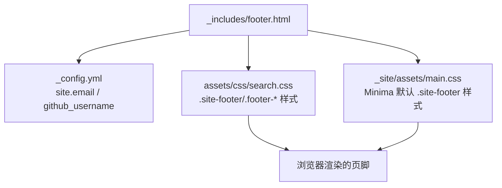
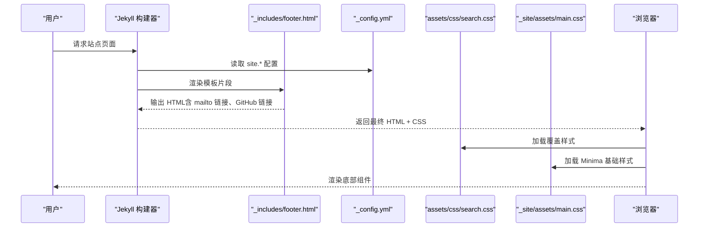
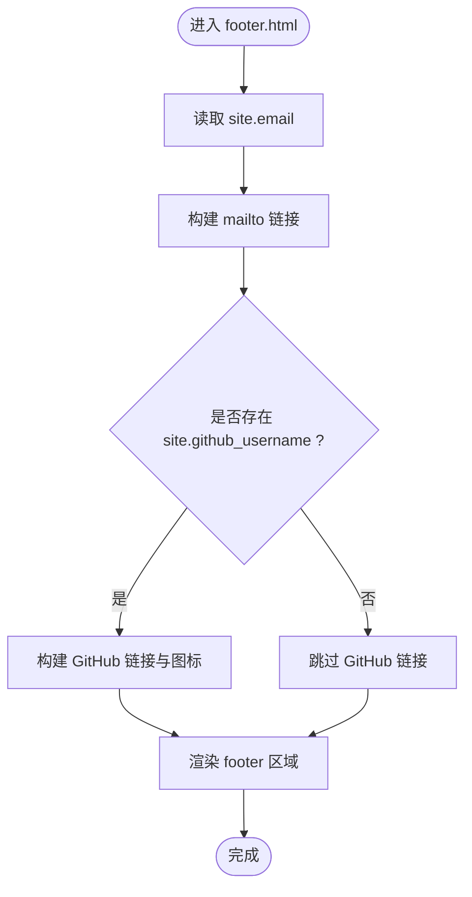
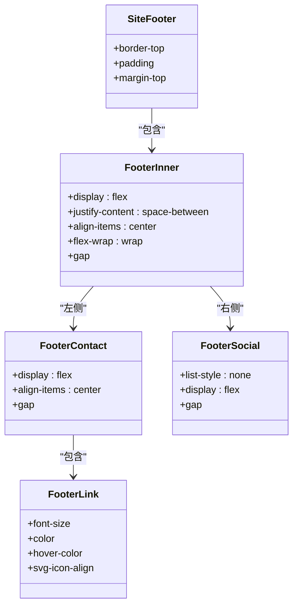
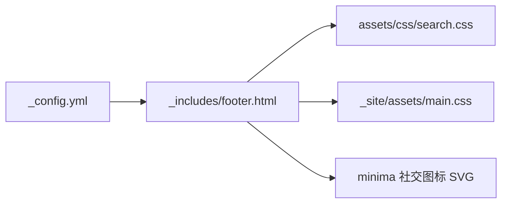

# 底部组件

<cite>
**本文引用的文件**
- [footer.html](file://_includes/footer.html)
- [_config.yml](file://_config.yml)
- [search.css](file://assets/css/search.css)
- [main.css](file://_site/assets/main.css)
</cite>

## 目录
1. [简介](#简介)
2. [项目结构](#项目结构)
3. [核心组件](#核心组件)
4. [架构总览](#架构总览)
5. [详细组件分析](#详细组件分析)
6. [依赖关系分析](#依赖关系分析)
7. [性能与可访问性](#性能与可访问性)
8. [故障排查指南](#故障排查指南)
9. [结论](#结论)
10. [附录：定制示例](#附录定制示例)

## 简介
本章节聚焦站点“底部组件”的实现与定制。该组件由模板片段与样式共同构成，负责在页面底部展示联系信息、社交链接等元素，并通过配置项驱动动态内容渲染。本文将深入解析其结构与逻辑，说明如何扩展新的社交链接、修改版权信息（如需）、调整布局与视觉属性，并给出可操作的定制步骤。

## 项目结构
底部组件涉及以下关键位置：
- 模板片段：位于 _includes/footer.html，负责渲染页脚 HTML 结构及动态数据注入。
- 全局配置：位于 _config.yml，提供邮箱、GitHub 用户名等 site 变量，供模板读取。
- 样式资源：
  - assets/css/search.css：覆盖 Minima 主题默认样式，包含当前站点的页脚样式。
  - _site/assets/main.css：Minima 主题的编译产物，包含基础页脚样式（会被 search.css 覆盖）。

图示来源
- [footer.html:1-28](file://_includes/footer.html#L1-L28)
- [_config.yml:1-26](file://_config.yml#L1-L26)
- [search.css:816-877](file://assets/css/search.css#L816-L877)
- [main.css:256-306](file://_site/assets/main.css#L256-L306)

章节来源
- [footer.html:1-28](file://_includes/footer.html#L1-L28)
- [_config.yml:1-26](file://_config.yml#L1-L26)
- [search.css:816-877](file://assets/css/search.css#L816-L877)
- [main.css:256-306](file://_site/assets/main.css#L256-L306)

## 核心组件
- 模板片段 footer.html
  - 使用 Liquid 语法从 site 对象读取 email、github_username 等配置项，生成邮件链接与 GitHub 社交链接。
  - 使用 SVG 图标增强可读性与一致性。
- 配置项 _config.yml
  - 提供 email、github_username 等键值，作为动态内容的唯一来源。
- 样式层
  - search.css 对 .site-footer、.footer-inner、.footer-contact、.footer-link、.footer-social 等进行定义，实现 Flex 布局、间距、颜色与交互效果。
  - main.css 为 Minima 主题的基础样式，包含默认的 .site-footer 样式，但会被 search.css 覆盖。

章节来源
- [footer.html:1-28](file://_includes/footer.html#L1-L28)
- [_config.yml:1-26](file://_config.yml#L1-L26)
- [search.css:816-877](file://assets/css/search.css#L816-L877)
- [main.css:256-306](file://_site/assets/main.css#L256-L306)

## 架构总览
底部组件的数据流与渲染流程如下：

图示来源
- [footer.html:1-28](file://_includes/footer.html#L1-L28)
- [_config.yml:1-26](file://_config.yml#L1-L26)
- [search.css:816-877](file://assets/css/search.css#L816-L877)
- [main.css:256-306](file://_site/assets/main.css#L256-L306)

## 详细组件分析

### 模板结构与动态内容
- 联系信息
  - 通过 site.email 生成 mailto 链接，并在链接文本中显示邮箱地址。
- 社交链接
  - 当存在 site.github_username 时，渲染一个指向 https://github.com/{username} 的链接，并附带 GitHub 图标与用户名文本。
- 条件渲染
  - 使用 Liquid 条件判断是否显示 GitHub 链接，避免空配置导致无效链接。

图示来源
- [footer.html:1-28](file://_includes/footer.html#L1-L28)
- [_config.yml:1-26](file://_config.yml#L1-L26)

章节来源
- [footer.html:1-28](file://_includes/footer.html#L1-L28)
- [_config.yml:1-26](file://_config.yml#L1-L26)

### 样式与布局
- 容器与布局
  - .site-footer 设置顶部边框、上下内边距与上外边距，形成明显的底部分隔。
  - .footer-inner 使用 Flex 布局，两端对齐并允许换行，适配不同屏幕宽度。
- 联系区与社交区
  - .footer-contact 与 .footer-social 分别组织邮箱与社交链接，统一字体大小、颜色与悬停效果。
  - 图标采用统一的 svg-icon 类，保持尺寸一致与垂直对齐。
- 主题覆盖
  - search.css 中的页脚样式会覆盖 Minima 默认 main.css 中的 .site-footer 样式，确保一致的视觉风格。

图示来源
- [search.css:816-877](file://assets/css/search.css#L816-L877)
- [main.css:256-306](file://_site/assets/main.css#L256-L306)

章节来源
- [search.css:816-877](file://assets/css/search.css#L816-L877)
- [main.css:256-306](file://_site/assets/main.css#L256-L306)

### 动态内容生成逻辑
- 年份自动更新
  - 当前 footer.html 未包含年份或版权字符串；如需展示“© 年份”，可在模板中添加基于 Jekyll 时间变量的表达式，或在搜索弹窗附近添加脚本在运行时插入当年年份。
- 访问统计数据
  - 当前 footer.html 未包含访问统计展示；若需集成第三方统计（如 Google Analytics），请在站点头文件或专用统计片段中引入对应脚本，并在需要时在底部显示汇总指标。
- 社交链接配置
  - 通过 _config.yml 的 site.github_username 控制是否显示 GitHub 链接；如需新增其他平台（如知乎、邮箱二次确认等），可参考现有 GitHub 链接的条件渲染模式进行扩展。

章节来源
- [footer.html:1-28](file://_includes/footer.html#L1-L28)
- [_config.yml:1-26](file://_config.yml#L1-L26)

## 依赖关系分析
- 模板依赖配置
  - footer.html 依赖 _config.yml 提供的 site.email 与 site.github_username。
- 样式依赖
  - footer.html 的结构类名（如 .site-footer、.footer-inner、.footer-contact、.footer-link、.footer-social）被 search.css 定义；同时受 Minima 主题 main.css 的基础样式影响。
- 外部资源
  - 社交图标引用 minima 主题提供的 SVG 图标集（通过相对路径与 ID 引用）。

图示来源
- [footer.html:1-28](file://_includes/footer.html#L1-L28)
- [_config.yml:1-26](file://_config.yml#L1-L26)
- [search.css:816-877](file://assets/css/search.css#L816-L877)
- [main.css:256-306](file://_site/assets/main.css#L256-L306)

章节来源
- [footer.html:1-28](file://_includes/footer.html#L1-L28)
- [_config.yml:1-26](file://_config.yml#L1-L26)
- [search.css:816-877](file://assets/css/search.css#L816-L877)
- [main.css:256-306](file://_site/assets/main.css#L256-L306)

## 性能与可访问性
- 性能
  - 使用 SVG 图标减少图片请求，提升加载速度。
  - 条件渲染避免不必要的 DOM 节点，降低渲染开销。
- 可访问性
  - 链接具备明确的 href 与文本内容，便于屏幕阅读器识别。
  - 图标通过 aria-label 或文本替代（用户名/邮箱）保证语义完整。

[本节为通用建议，不直接分析具体文件]

## 故障排查指南
- 邮箱链接无效
  - 检查 _config.yml 中 email 是否正确填写。
  - 确认 footer.html 中 mailto 链接使用了正确的 site.email 变量。
- GitHub 链接未显示
  - 检查 _config.yml 中 github_username 是否已配置且非空。
  - 确认 footer.html 中的条件渲染逻辑未被误改。
- 样式异常或被覆盖
  - 确认 assets/css/search.css 已被正确加载，且优先级高于 _site/assets/main.css。
  - 检查自定义样式是否意外覆盖了 .site-footer 或相关子类的关键属性。

章节来源
- [footer.html:1-28](file://_includes/footer.html#L1-L28)
- [_config.yml:1-26](file://_config.yml#L1-L26)
- [search.css:816-877](file://assets/css/search.css#L816-L877)
- [main.css:256-306](file://_site/assets/main.css#L256-L306)

## 结论
底部组件以简洁的模板片段与清晰的配置项为核心，结合现代 CSS 布局与主题覆盖策略，实现了可扩展、易维护的页脚展示。通过合理扩展配置与模板逻辑，即可快速增加新的社交链接、版权信息与统计展示，并保持整体风格一致。

[本节为总结性内容，不直接分析具体文件]

## 附录：定制示例

- 添加新的社交链接（例如知乎）
  - 在 _config.yml 中新增 zhihu_username 字段（已有示例）。
  - 在 footer.html 中复制 GitHub 链接块，替换为知乎链接与图标，并使用 site.zhihu_username 作为条件与文本。
  - 如需新图标，准备 SVG 并添加到 minima 社交图标集或通过内联 SVG 方式引入。

- 修改版权信息（含年份自动更新）
  - 在 footer.html 合适位置加入版权段落。
  - 使用 Jekyll 时间变量或前端脚本获取当前年份，拼接至版权文本中。
  - 注意保持与现有布局的间距与对齐一致。

- 调整底部布局与视觉属性
  - 在 assets/css/search.css 中调整 .site-footer、.footer-inner、.footer-contact、.footer-social 的 padding、gap、font-size、color 等属性。
  - 如需响应式优化，可使用媒体查询在不同断点下调整 flex-wrap 与 gap。

- 接入访问统计数据
  - 在站点头部或专用统计片段中引入第三方统计脚本（如 Google Analytics）。
  - 在 footer.html 中按需展示统计摘要（例如总访问量），可通过后端聚合或前端脚本拉取接口后渲染。

章节来源
- [footer.html:1-28](file://_includes/footer.html#L1-L28)
- [_config.yml:1-26](file://_config.yml#L1-L26)
- [search.css:816-877](file://assets/css/search.css#L816-L877)