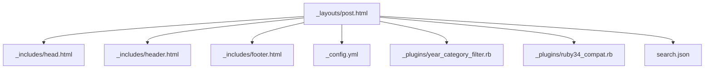
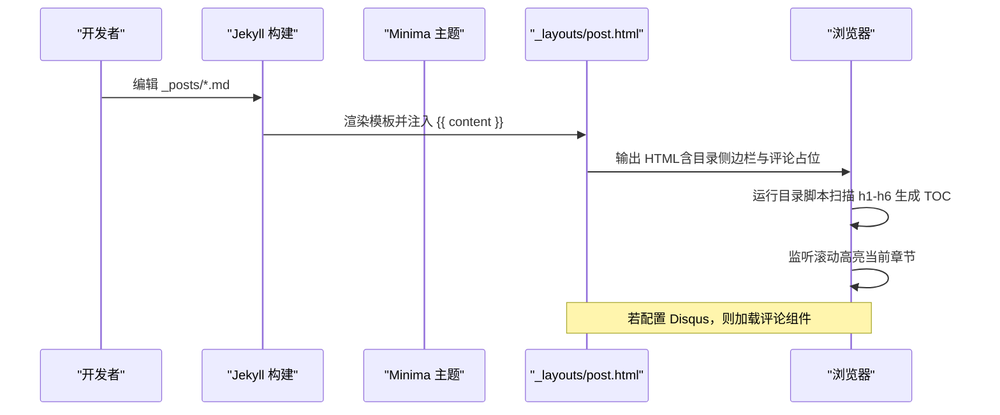
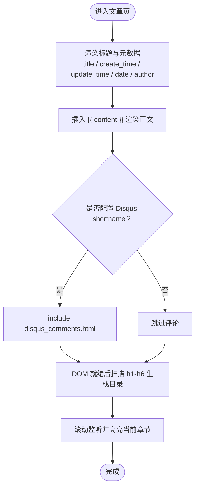
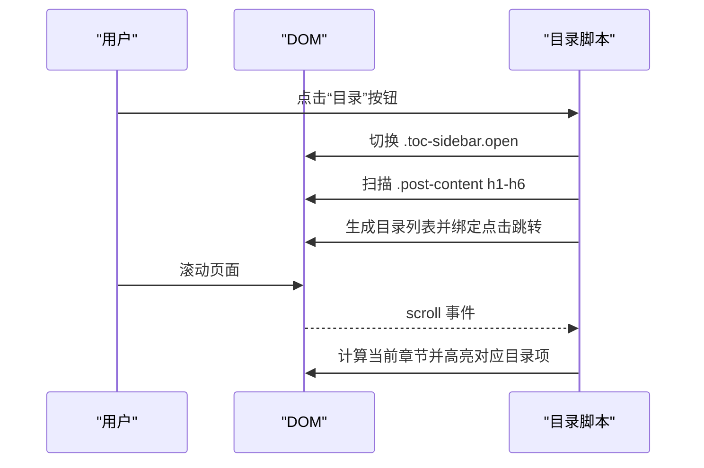
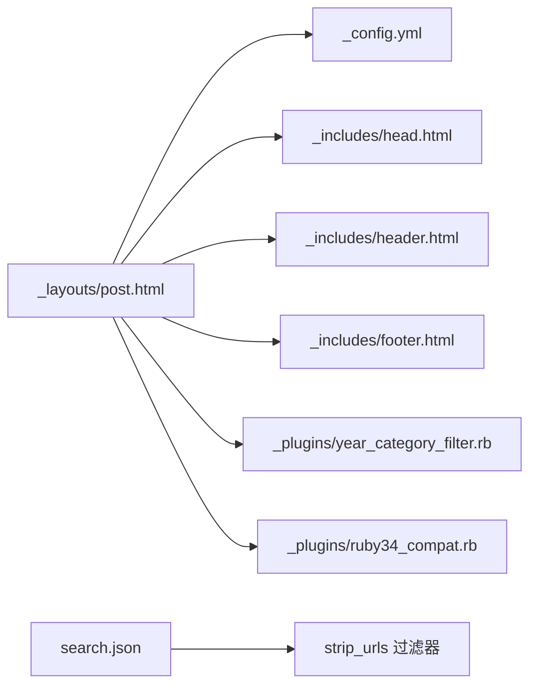

# 文章页面布局

<cite>
**本文引用的文件**
- [post.html](file://_layouts/post.html)
- [config.yml](file://_config.yml)
- [head.html](file://_includes/head.html)
- [header.html](file://_includes/header.html)
- [footer.html](file://_includes/footer.html)
- [ruby34_compat.rb](file://_plugins/ruby34_compat.rb)
- [year_category_filter.rb](file://_plugins/year_category_filter.rb)
- [search.json](file://search.json)
- [home.html](file://_layouts/home.html)
- [Gemfile](file://Gemfile)
- [README.md](file://README.md)
</cite>

## 目录
1. [简介](#简介)
2. [项目结构](#项目结构)
3. [核心组件](#核心组件)
4. [架构总览](#架构总览)
5. [详细组件分析](#详细组件分析)
6. [依赖分析](#依赖分析)
7. [性能考虑](#性能考虑)
8. [故障排查指南](#故障排查指南)
9. [结论](#结论)
10. [附录：定制示例](#附录定制示例)

## 简介
本文围绕文章页面布局展开，深入解析 post.html 的结构与渲染逻辑，涵盖标题、创建/更新时间、作者等元数据的展示；说明 Markdown 内容如何被 Jekyll 转换为 HTML，包括代码高亮、图片嵌入、链接处理等；解释评论系统（Disqus）的集成方式与加载条件；并说明“相关文章推荐”在当前仓库中的实现现状。最后提供可操作的定制示例，帮助读者修改样式、添加分享按钮、调整评论配置等。

## 项目结构
文章页面的模板位于 _layouts/post.html，它继承自主题默认模板（Minima），并通过 _includes 注入头部、尾部资源，通过 _config.yml 控制构建与插件行为，通过 _plugins 扩展分类过滤与搜索索引清理逻辑。

图表来源
- [post.html:1-105](file://_layouts/post.html#L1-L105)
- [head.html:1-27](file://_includes/head.html#L1-L27)
- [header.html:1-10](file://_includes/header.html#L1-L10)
- [footer.html:1-34](file://_includes/footer.html#L1-L34)
- [config.yml:1-45](file://_config.yml#L1-L45)
- [year_category_filter.rb:1-12](file://_plugins/year_category_filter.rb#L1-L12)
- [ruby34_compat.rb:1-18](file://_plugins/ruby34_compat.rb#L1-L18)
- [search.json:1-12](file://search.json#L1-L12)

章节来源
- [post.html:1-105](file://_layouts/post.html#L1-L105)
- [config.yml:1-45](file://_config.yml#L1-L45)

## 核心组件
- 文章模板：_layouts/post.html，负责文章标题、元数据、正文渲染、目录侧边栏、评论区挂载点。
- 站点配置：_config.yml，定义 Markdown 引擎、代码高亮器、SEO、Disqus shortname、Google Analytics、永久链接格式等。
- 资源注入：_includes/head.html、header.html、footer.html，统一引入字体、CSS、Favicon、统计脚本与搜索 UI。
- 插件扩展：_plugins 下的分类过滤与 URL 清理过滤器，影响首页归档与搜索索引。
- 搜索索引：search.json，生成供前端全文检索的数据源。

章节来源
- [post.html:1-105](file://_layouts/post.html#L1-L105)
- [config.yml:1-45](file://_config.yml#L1-L45)
- [head.html:1-27](file://_includes/head.html#L1-L27)
- [header.html:1-10](file://_includes/header.html#L1-L10)
- [footer.html:1-34](file://_includes/footer.html#L1-L34)
- [year_category_filter.rb:1-12](file://_plugins/year_category_filter.rb#L1-L12)
- [ruby34_compat.rb:1-18](file://_plugins/ruby34_compat.rb#L1-L18)
- [search.json:1-12](file://search.json#L1-L12)

## 架构总览
文章页面在构建期由 Jekyll 将 Markdown 渲染为 HTML，并在运行时由浏览器执行目录侧边栏脚本。

图表来源
- [post.html:1-105](file://_layouts/post.html#L1-L105)
- [config.yml:1-45](file://_config.yml#L1-L45)

## 详细组件分析

### 文章模板（post.html）结构与渲染逻辑
- 标题与元数据
  - 标题：使用 page.title 渲染，并进行转义。
  - 创建时间/更新时间：优先显示 create_time，其次 fallback 到 update_time；两者均支持格式化与去除多余时间部分。
  - 发布日期：使用 page.date 并以 site.minima.date_format 或默认格式输出，同时包含隐藏的 datetime 属性用于 SEO。
  - 作者：若存在 page.author，则以 Schema.org Person 语义化输出。
- 正文渲染
  - 通过 {{ content }} 插入 Jekyll 渲染后的 HTML。
- 评论系统
  - 当 site.disqus.shortname 存在时，动态 include disqus_comments.html 以加载 Disqus 评论。
- 目录侧边栏
  - 页面底部内嵌脚本：扫描 .post-content 内的 h1-h6，自动生成目录列表；点击目录项平滑滚动至对应锚点；移动端点击后自动收起；滚动时高亮当前章节。

图表来源
- [post.html:1-105](file://_layouts/post.html#L1-L105)

章节来源
- [post.html:1-105](file://_layouts/post.html#L1-L105)

### Markdown 处理与 HTML 转换
- Markdown 引擎：kramdown（在配置中指定）。
- 代码高亮：rouge（在配置中指定）。
- 图片与链接：由 kramdown 标准规则处理，图片路径按相对路径引用，链接保持原样或根据 baseurl 进行相对化处理。
- 相关配置位置：_config.yml 中 markdown 与 highlighter 字段。

章节来源
- [config.yml:35-38](file://_config.yml#L35-L38)

### 评论系统集成（Disqus）
- 启用条件：_config.yml 中 disqus.shortname 存在。
- 加载逻辑：post.html 判断 site.disqus.shortname 后 include disqus_comments.html。
- 注意：disqus_comments.html 属于主题或外部 include，本仓库未直接提供该文件，但通过 include 指令已预留加载入口。

章节来源
- [post.html:32-34](file://_layouts/post.html#L32-L34)
- [config.yml:28-31](file://_config.yml#L28-L31)

### 相关文章推荐功能
- 现状：当前 post.html 未内置“相关文章”区块或算法。
- 建议方案（概念性）：
  - 基于 front matter 的 categories/tags 匹配同分类文章。
  - 基于最近发布时间或随机选取若干篇作为推荐。
  - 可在 post.html 末尾增加一个 section，遍历 site.posts 并按策略筛选渲染。
- 参考：首页 home.html 展示了按分类与日期聚合文章的思路，可作为推荐逻辑的灵感来源。

章节来源
- [post.html:1-105](file://_layouts/post.html#L1-L105)
- [home.html:1-134](file://_layouts/home.html#L1-L134)

### 目录侧边栏交互流程
- 触发：点击目录按钮打开侧边栏，点击关闭按钮或移动端点击目录项后收起。
- 生成：扫描 .post-content 下所有 h1-h6，若无标题则隐藏目录按钮。
- 高亮：监听滚动事件，计算当前可见章节并高亮对应目录项。

图表来源
- [post.html:53-104](file://_layouts/post.html#L53-L104)

章节来源
- [post.html:53-104](file://_layouts/post.html#L53-L104)

## 依赖分析
- 主题与构建
  - 主题：minima（~> 2.5）
  - Jekyll：~> 3.9
  - Markdown：kramdown + kramdown-parser-gfm
  - 代码高亮：rouge
- 插件
  - jekyll-sitemap、jekyll-seo-tag、jekyll-feed
- 自定义插件
  - year_category_filter.rb：移除 _posts 子目录自动注入的分类，仅保留 front matter 显式定义的分类。
  - ruby34_compat.rb：兼容 Ruby 3.4+ 的 Liquid/Jekyll 环境，并提供 strip_urls 过滤器用于搜索索引清理。

图表来源
- [post.html:1-105](file://_layouts/post.html#L1-L105)
- [config.yml:1-45](file://_config.yml#L1-L45)
- [year_category_filter.rb:1-12](file://_plugins/year_category_filter.rb#L1-L12)
- [ruby34_compat.rb:1-18](file://_plugins/ruby34_compat.rb#L1-L18)
- [search.json:1-12](file://search.json#L1-L12)

章节来源
- [Gemfile:1-16](file://Gemfile#L1-L16)
- [config.yml:1-45](file://_config.yml#L1-L45)
- [year_category_filter.rb:1-12](file://_plugins/year_category_filter.rb#L1-L12)
- [ruby34_compat.rb:1-18](file://_plugins/ruby34_compat.rb#L1-L18)

## 性能考虑
- 目录脚本使用 passive 滚动监听，避免阻塞主线程。
- 仅在存在标题时渲染目录按钮，减少不必要的 DOM 操作。
- 搜索索引在 search.json 中剥离 <pre> 块与 URL，降低索引体积。
- 建议使用生产环境缓存与 CDN 加速静态资源（如字体、CSS）。

[本节为通用指导，不直接分析具体文件]

## 故障排查指南
- 目录未显示
  - 检查文章内容是否包含 h1-h6 标题。
  - 确认 .post-content 容器存在且未被 CSS 隐藏。
- 评论未加载
  - 确认 _config.yml 中 disqus.shortname 已正确配置。
  - 确认网络可访问 Disqus 服务。
- 代码高亮异常
  - 确认 _config.yml 中 highlighter 设置为 rouge，且 Gemfile 包含必要依赖。
- 搜索无结果或结果不准确
  - 检查 search.json 是否正确生成。
  - 确认 strip_urls 过滤器可用（由 ruby34_compat.rb 注册）。
- 分类显示不符合预期
  - 确认 _posts 子目录不会自动注入分类（year_category_filter.rb 会移除目录级分类）。
  - 确保 front matter 的 categories 字段正确填写。

章节来源
- [post.html:53-104](file://_layouts/post.html#L53-L104)
- [config.yml:28-31](file://_config.yml#L28-L31)
- [config.yml:35-38](file://_config.yml#L35-L38)
- [search.json:1-12](file://search.json#L1-L12)
- [ruby34_compat.rb:1-18](file://_plugins/ruby34_compat.rb#L1-L18)
- [year_category_filter.rb:1-12](file://_plugins/year_category_filter.rb#L1-L12)

## 结论
post.html 提供了清晰的文章渲染骨架：标题与元数据、正文、可选评论、以及轻量级的目录侧边栏。Markdown 到 HTML 的转换由 Jekyll 的 kramdown 与 rouge 驱动，配合 _config.yml 的全局设置与 _plugins 的扩展能力，形成稳定可扩展的文章页面体系。当前仓库未内置“相关文章推荐”，可通过扩展模板与数据筛选实现。

[本节为总结性内容，不直接分析具体文件]

## 附录：定制示例

- 修改文章样式
  - 目标：调整标题字号、行距、段落间距等。
  - 方法：在站点 CSS 中覆盖 .post-content 下的 h1-h6、p、a 等选择器；或在 assets/css 下新增样式文件并在 head.html 中引入。
  - 参考：现有样式集中在 assets/css/search.css 中对 .post-content 的细化。

  章节来源
  - [head.html:1-27](file://_includes/head.html#L1-L27)
  - [assets/css/search.css:578-635](file://assets/css/search.css#L578-L635)

- 添加分享按钮
  - 目标：在文章底部添加微信/QQ/微博等分享入口。
  - 方法：在 post.html 的评论区域之后、文章结束标签之前，插入分享按钮 HTML 与 JS 逻辑；如需弹窗预览，可复用 wechat_share.html 的思路。
  - 提示：分享链接可使用 page.url 与 page.title 拼接。

  章节来源
  - [post.html:32-37](file://_layouts/post.html#L32-L37)

- 调整评论配置（Disqus）
  - 目标：启用/更换 Disqus 账号。
  - 方法：在 _config.yml 的 disqus.shortname 中填入你的 Disqus shortname；保存后重新构建。
  - 验证：文章页应出现评论框。

  章节来源
  - [config.yml:28-31](file://_config.yml#L28-L31)
  - [post.html:32-34](file://_layouts/post.html#L32-L34)

- 启用/禁用代码高亮主题
  - 目标：切换不同的高亮风格。
  - 方法：在 _config.yml 中修改 highlighter 与主题相关 CSS；确保 Rouge 可用。
  - 参考：Gemfile 中已声明 rouge 依赖。

  章节来源
  - [config.yml:35-38](file://_config.yml#L35-L38)
  - [Gemfile:1-16](file://Gemfile#L1-L16)

- 完善“相关文章推荐”
  - 目标：在文章末尾展示同分类或最近发布的文章。
  - 方法：在 post.html 末尾增加一个 section，遍历 site.posts 并按 categories 或 date 排序，限制数量后渲染标题与链接。
  - 参考：首页 home.html 展示了按分类与日期分组与折叠的实现思路。

  章节来源
  - [post.html:1-105](file://_layouts/post.html#L1-L105)
  - [home.html:1-134](file://_layouts/home.html#L1-L134)

- 优化搜索体验
  - 目标：提升搜索速度与相关性。
  - 方法：利用 search.json 与 strip_urls 过滤器减少噪声；在前端对关键词做分词与权重排序。
  - 参考：search.json 与 ruby34_compat.rb 提供的工具。

  章节来源
  - [search.json:1-12](file://search.json#L1-L12)
  - [ruby34_compat.rb:1-18](file://_plugins/ruby34_compat.rb#L1-L18)