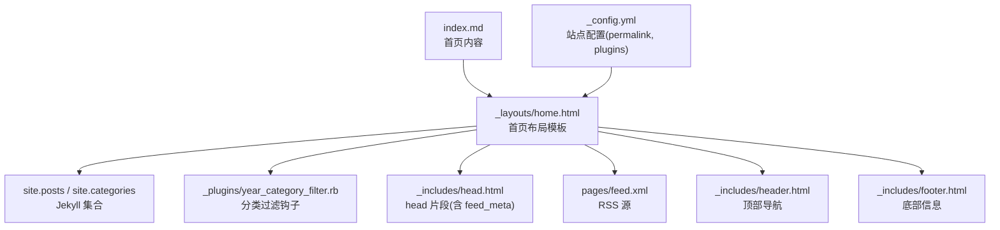
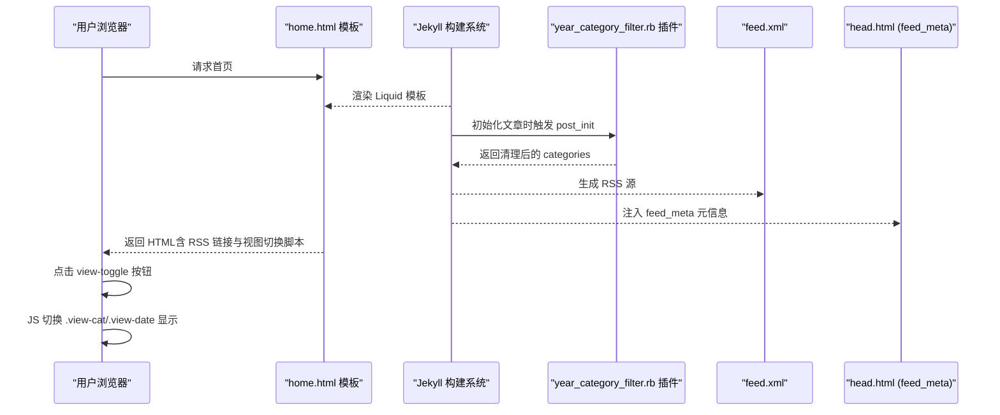
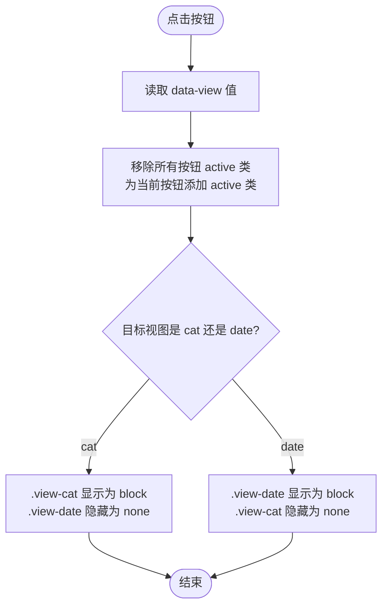
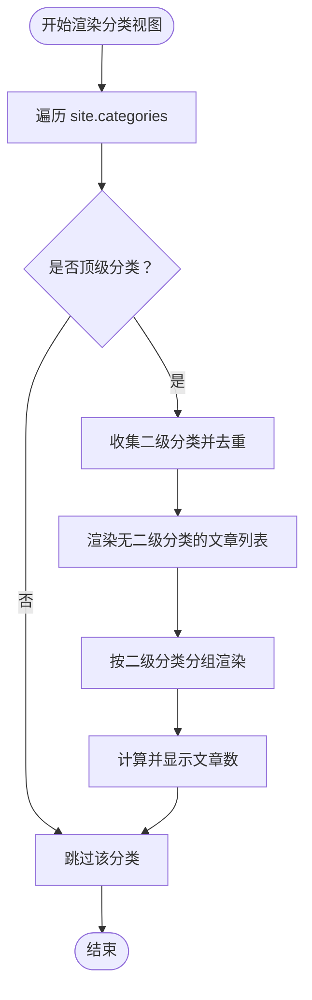
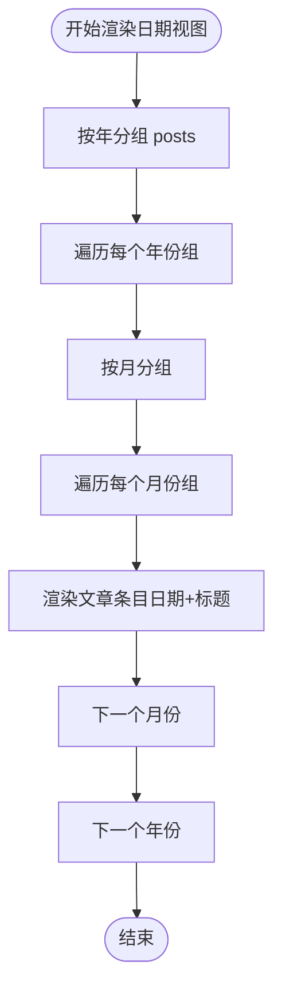
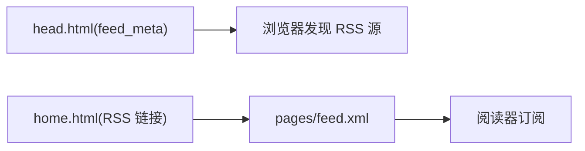
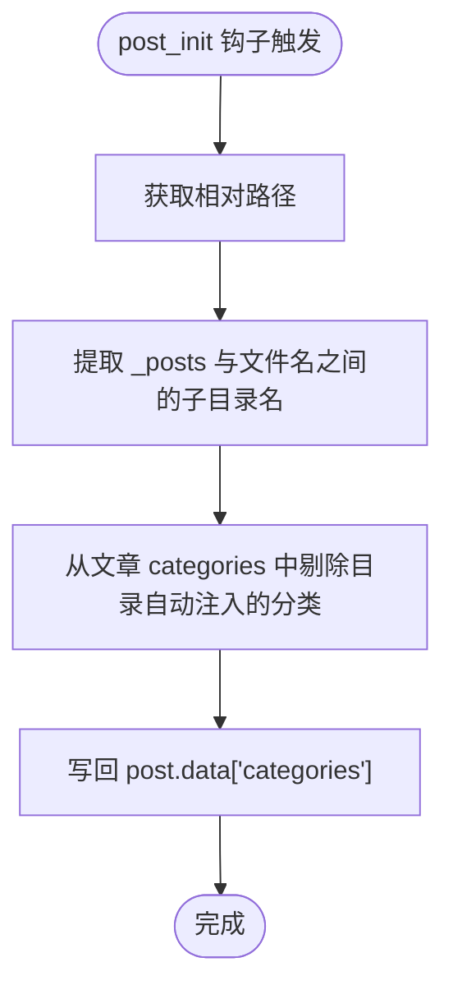
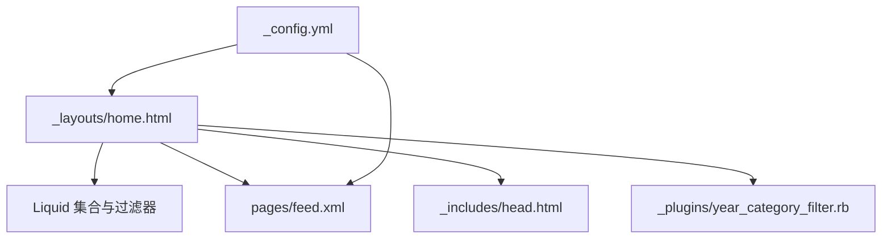

# 首页布局模板

<cite>
**本文引用的文件**   
- [home.html](file://_layouts/home.html)
- [index.md](file://index.md)
- [_config.yml](file://_config.yml)
- [year_category_filter.rb](file://_plugins/year_category_filter.rb)
- [feed.xml](file://pages/feed.xml)
- [head.html](file://_includes/head.html)
- [header.html](file://_includes/header.html)
- [footer.html](file://_includes/footer.html)
</cite>

## 目录
1. [简介](#简介)
2. [项目结构](#项目结构)
3. [核心组件](#核心组件)
4. [架构总览](#架构总览)
5. [详细组件分析](#详细组件分析)
6. [依赖关系分析](#依赖关系分析)
7. [性能与可维护性建议](#性能与可维护性建议)
8. [故障排查指南](#故障排查指南)
9. [结论](#结论)
10. [附录：定制示例](#附录定制示例)

## 简介
本文件围绕 Jekyll 主题中的“首页布局模板”进行深入文档化，重点解析 _layouts/home.html 的结构与实现逻辑，包括：
- 分类视图与日期视图的双模式切换
- 文章列表的渲染机制（按分类分组、按年份/月份归档）
- view-toggle 交互功能的 JavaScript 实现原理（状态管理与 DOM 操作）
- RSS 订阅链接的生成方式与页面元数据处理
- 常见定制场景与步骤（修改显示格式、新增视图模式、调整分类层级等）

## 项目结构
与首页布局相关的关键文件与职责如下：
- _layouts/home.html：首页布局模板，负责分类/日期双视图、文章列表渲染、RSS 入口与视图切换脚本
- index.md：首页内容页，指定 layout: home，并承载正文内容
- _config.yml：站点配置，包含 permalink、插件、主题等
- _plugins/year_category_filter.rb：自定义插件，过滤由目录自动注入的分类，仅保留 front matter 显式声明的分类
- pages/feed.xml：RSS 源文件，提供订阅数据
- _includes/head.html、header.html、footer.html：全局头部、导航与底部片段，其中 head.html 引入 feed_meta 以输出 RSS 元信息

图表来源
- [home.html:1-135](file://_layouts/home.html#L1-L135)
- [index.md:1-17](file://index.md#L1-L17)
- [_config.yml:1-45](file://_config.yml#L1-L45)
- [year_category_filter.rb:1-13](file://_plugins/year_category_filter.rb#L1-L13)
- [feed.xml:1-31](file://pages/feed.xml#L1-L31)
- [head.html:1-27](file://_includes/head.html#L1-L27)
- [header.html:1-10](file://_includes/header.html#L1-L10)
- [footer.html:1-34](file://_includes/footer.html#L1-L34)

章节来源
- [home.html:1-135](file://_layouts/home.html#L1-L135)
- [index.md:1-17](file://index.md#L1-L17)
- [_config.yml:1-45](file://_config.yml#L1-L45)

## 核心组件
- 视图切换器（view-toggle）
  - 提供“分类”和“日期”两个按钮，点击后通过 data-view 属性切换当前激活视图
  - 使用内联脚本在客户端完成显示/隐藏与 active 类切换
- 分类视图（view-cat）
  - 基于 site.categories 遍历所有分类
  - 对每个分类，筛选出“顶级分类”（即该分类出现在文章 categories 数组首位），并以 details/summary 折叠展示
  - 若文章存在二级分类，则进一步按二级分类分组为“月份”节点（此处命名沿用模板，实际为二级分类组）
  - 一级分类下直接列出无二级分类的文章
- 日期视图（view-date）
  - 使用 group_by_exp 将 posts 先按年分组，再按月分组
  - 每篇文章显示发布日期与标题链接
- RSS 订阅入口
  - 模板底部提供“via RSS”链接，指向 /feed.xml
  - head.html 中通过 feed_meta 注入 <link rel="alternate" type="application/rss+xml"> 元信息
- 分类过滤插件
  - 在 post_init 钩子中移除由目录结构自动注入的分类，确保只保留 front matter 显式定义的分类

章节来源
- [home.html:14-113](file://_layouts/home.html#L14-L113)
- [head.html:11-11](file://_includes/head.html#L11-L11)
- [year_category_filter.rb:1-13](file://_plugins/year_category_filter.rb#L1-L13)

## 架构总览
首页渲染流程概览：
- 构建期：Jekyll 读取 index.md，应用 home.html 布局；根据 _config.yml 的 permalink 规则生成文章 URL；执行 year_category_filter.rb 清理自动分类；生成 feed.xml
- 运行期：浏览器加载首页，head.html 注入 RSS 元信息；用户点击 view-toggle 按钮，JavaScript 切换视图显示

图表来源
- [home.html:116-134](file://_layouts/home.html#L116-L134)
- [year_category_filter.rb:5-12](file://_plugins/year_category_filter.rb#L5-L12)
- [feed.xml:1-31](file://pages/feed.xml#L1-L31)
- [head.html:11-11](file://_includes/head.html#L11-L11)

## 详细组件分析

### 视图切换（view-toggle）交互原理
- 按钮结构
  - 两个按钮分别带有 data-view="cat" 与 data-view="date"
  - 默认第一个按钮具有 active 类
- 视图容器
  - 分类视图容器 class 为 .view-cat
  - 日期视图容器 class 为 .view-date，初始通过 style="display:none" 隐藏
- 脚本逻辑
  - 获取所有 .view-toggle-btn 元素
  - 绑定 click 事件：读取 data-view，移除所有按钮的 active 类，给当前按钮添加 active
  - 遍历 views 对象，设置对应容器的 display 为 block/none

图表来源
- [home.html:14-17](file://_layouts/home.html#L14-L17)
- [home.html:19-110](file://_layouts/home.html#L19-L110)
- [home.html:116-134](file://_layouts/home.html#L116-L134)

章节来源
- [home.html:14-17](file://_layouts/home.html#L14-L17)
- [home.html:116-134](file://_layouts/home.html#L116-L134)

### 分类视图渲染机制（按分类分组）
- 遍历 site.categories，得到排序后的分类集合
- 判断是否为“顶级分类”：当某分类出现在其文章 categories 数组的首位时，视为顶级分类
- 顶级分类下：
  - 若无二级分类，直接列出文章
  - 若有二级分类，提取二级分类名去重后，作为“月份”节点（实际为二级分类组）进行分组展示
- 计数与折叠
  - 使用 details/summary 实现折叠，并在 summary 中显示文章数量

图表来源
- [home.html:20-84](file://_layouts/home.html#L20-L84)

章节来源
- [home.html:20-84](file://_layouts/home.html#L20-L84)

### 日期视图渲染机制（按年/月归档）
- 使用 group_by_exp 先将 posts 按年分组，再按月分组
- 每篇文章显示日期（月-日）与标题链接
- 首次年份与月份默认展开（open 属性）

图表来源
- [home.html:87-110](file://_layouts/home.html#L87-L110)

章节来源
- [home.html:87-110](file://_layouts/home.html#L87-L110)

### RSS 订阅与页面元数据
- RSS 源
  - pages/feed.xml 定义 RSS 2.0 频道，包含站点标题、描述、链接、发布时间、最近构建时间、生成器版本
  - 循环输出最近 10 篇文章的 item，包含标题、内容、发布日期、链接、GUID、标签与分类
- 页面元信息
  - _includes/head.html 通过 feed_meta 注入 RSS 元信息，便于浏览器识别订阅源
- 首页入口
  - home.html 底部提供“via RSS”链接，指向 /feed.xml

图表来源
- [head.html:11-11](file://_includes/head.html#L11-L11)
- [home.html:112-112](file://_layouts/home.html#L112-L112)
- [feed.xml:1-31](file://pages/feed.xml#L1-L31)

章节来源
- [head.html:11-11](file://_includes/head.html#L11-L11)
- [home.html:112-112](file://_layouts/home.html#L112-L112)
- [feed.xml:1-31](file://pages/feed.xml#L1-L31)

### 分类过滤插件（目录自动分类处理）
- 作用
  - Jekyll 会将 _posts 下的子目录名自动注入为文章的分类
  - 此插件在 post_init 钩子中移除这些来自目录结构的分类，仅保留 front matter 显式定义的分类
- 影响
  - 确保分类视图只显示作者明确声明的分类，避免目录结构污染分类体系

图表来源
- [year_category_filter.rb:5-12](file://_plugins/year_category_filter.rb#L5-L12)

章节来源
- [year_category_filter.rb:1-13](file://_plugins/year_category_filter.rb#L1-L13)

## 依赖关系分析
- 模板依赖
  - home.html 依赖 Jekyll 集合（site.posts、site.categories）、Liquid 过滤器（group_by_exp、sort、relative_url、escape、date_to_rfc822）
  - 依赖 head.html 的 feed_meta 注入 RSS 元信息
- 插件依赖
  - year_category_filter.rb 在构建期修改文章数据，影响分类视图的渲染结果
- 配置依赖
  - _config.yml 的 permalink 决定文章 URL 结构，影响 RSS 与模板中的链接生成
  - plugins 启用 jekyll-feed、jekyll-seo-tag、jekyll-sitemap，配合 head.html 的 feed_meta 与 SEO 元信息

图表来源
- [home.html:1-135](file://_layouts/home.html#L1-L135)
- [feed.xml:1-31](file://pages/feed.xml#L1-L31)
- [head.html:1-27](file://_includes/head.html#L1-L27)
- [year_category_filter.rb:1-13](file://_plugins/year_category_filter.rb#L1-L13)
- [_config.yml:1-45](file://_config.yml#L1-L45)

章节来源
- [home.html:1-135](file://_layouts/home.html#L1-L135)
- [feed.xml:1-31](file://pages/feed.xml#L1-L31)
- [head.html:1-27](file://_includes/head.html#L1-L27)
- [year_category_filter.rb:1-13](file://_plugins/year_category_filter.rb#L1-L13)
- [_config.yml:1-45](file://_config.yml#L1-L45)

## 性能与可维护性建议
- 大数据量优化
  - 日期视图使用 group_by_exp 在构建期分组，避免运行时开销；如文章量极大，可考虑限制输出数量或分页
  - 分类视图中多次遍历与字符串拼接可能带来额外开销，可在必要时缓存中间变量
- 可访问性与语义
  - 使用 details/summary 提升语义与键盘可达性；保持 aria 属性一致
- 样式与交互
  - 当前视图切换使用内联脚本，建议分离到独立 JS 文件以便复用与维护
  - 可通过 CSS 控制折叠动画与过渡效果，提升用户体验

[本节为通用建议，不直接分析具体文件]

## 故障排查指南
- 分类视图未显示或为空
  - 检查文章 front matter 是否正确声明 categories
  - 确认 year_category_filter.rb 是否移除了预期外的分类
- 日期视图无数据
  - 检查 _posts 目录结构与文章日期是否符合 Jekyll 约定
  - 确认 permalink 配置与文章 URL 生成一致
- RSS 无法订阅
  - 确认 pages/feed.xml 存在且可访问
  - 检查 head.html 是否成功注入 feed_meta
  - 验证 _config.yml 中 url/baseurl 配置正确
- 视图切换无效
  - 检查浏览器控制台是否有 JS 错误
  - 确认按钮 data-view 与视图容器 class 匹配

章节来源
- [year_category_filter.rb:5-12](file://_plugins/year_category_filter.rb#L5-L12)
- [home.html:116-134](file://_layouts/home.html#L116-L134)
- [head.html:11-11](file://_includes/head.html#L11-L11)
- [_config.yml:1-45](file://_config.yml#L1-L45)

## 结论
home.html 提供了清晰的双模式首页布局：分类视图强调知识组织，日期视图强调时间线。结合 year_category_filter.rb 的分类过滤策略与 feed.xml 的 RSS 支持，整体结构简洁、可扩展性强。通过合理的定制与优化，可以灵活适配不同内容与展示需求。

[本节为总结，不直接分析具体文件]

## 附录：定制示例

- 修改文章显示格式
  - 分类视图：调整 .archive-post-list 与 .archive-post-link 的样式，或在模板中改变列表项结构
  - 日期视图：修改日期格式化表达式与链接文本
  - 参考位置
    - [home.html:47-77](file://_layouts/home.html#L47-L77)
    - [home.html:97-104](file://_layouts/home.html#L97-L104)

- 添加新的视图模式
  - 在 view-toggle 区域增加新按钮，并为新视图创建容器（例如 .view-tags）
  - 在脚本中扩展 views 映射，处理新视图的显示/隐藏
  - 参考位置
    - [home.html:14-17](file://_layouts/home.html#L14-L17)
    - [home.html:116-134](file://_layouts/home.html#L116-L134)

- 调整分类层级结构
  - 若希望支持三级分类，可在分类视图中增加嵌套分组逻辑，并更新计数与折叠展示
  - 注意保持 is_top 判定与二级分类提取逻辑的一致性
  - 参考位置
    - [home.html:25-84](file://_layouts/home.html#L25-L84)

- 变更 RSS 行为
  - 修改 pages/feed.xml 的输出字段、限制条数或添加摘要
  - 如需启用 jekyll-feed 自动生成，可在 _config.yml 中配置 feed 插件参数
  - 参考位置
    - [feed.xml:14-28](file://pages/feed.xml#L14-L28)
    - [_config.yml:40-45](file://_config.yml#L40-L45)

- 调整页面元数据
  - 在 head.html 中增删 meta 标签或第三方集成
  - 参考位置
    - [head.html:1-27](file://_includes/head.html#L1-27)

章节来源
- [home.html:14-17](file://_layouts/home.html#L14-L17)
- [home.html:25-84](file://_layouts/home.html#L25-L84)
- [home.html:97-104](file://_layouts/home.html#L97-L104)
- [home.html:116-134](file://_layouts/home.html#L116-L134)
- [feed.xml:14-28](file://pages/feed.xml#L14-L28)
- [_config.yml:40-45](file://_config.yml#L40-L45)
- [head.html:1-27](file://_includes/head.html#L1-27)