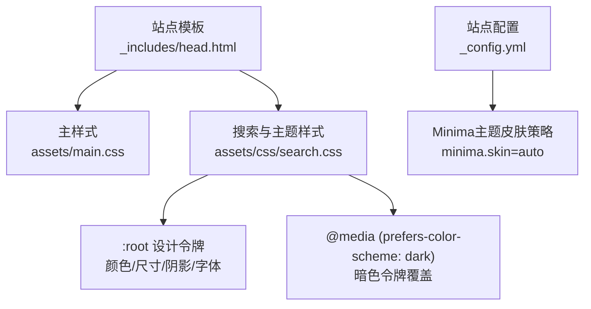
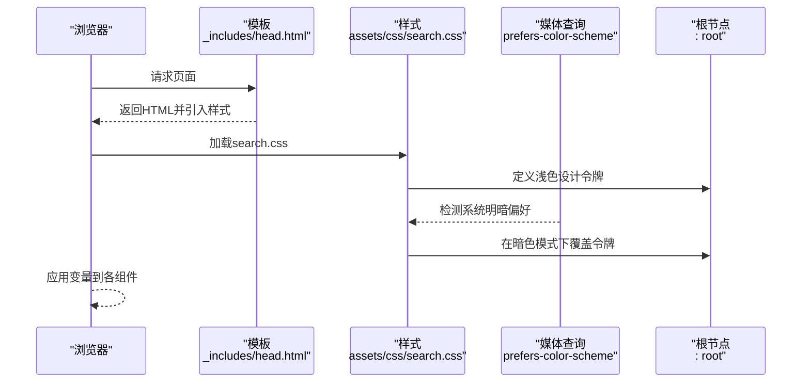
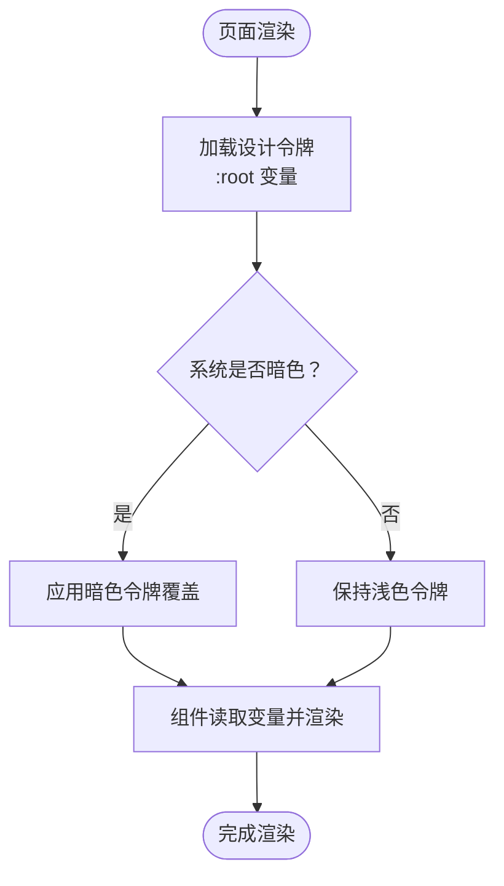
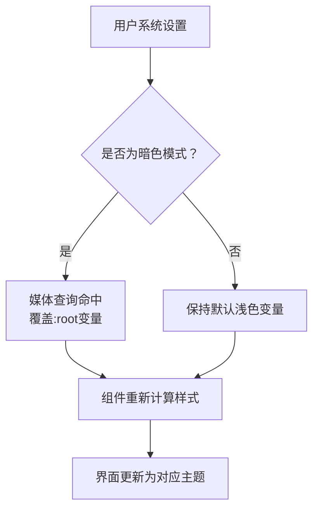
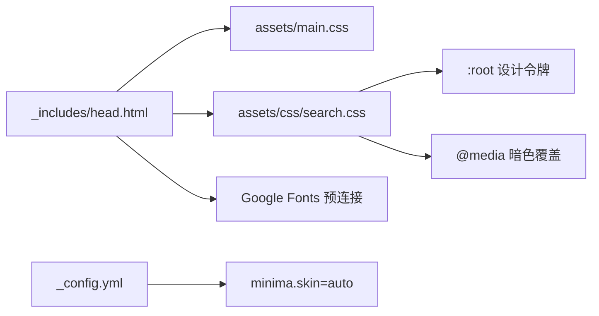

# CSS变量设计体系

<cite>
**本文引用的文件**   
- [assets/css/search.css](file://assets/css/search.css)
- [_includes/head.html](file://_includes/head.html)
- [_config.yml](file://_config.yml)
</cite>

## 更新摘要
**变更内容**   
- 确认现有CSS变量设计体系的完整性
- 验证明暗模式切换机制的实现
- 更新设计令牌分类和使用示例
- 完善主题定制指南和故障排查建议

## 目录
1. [简介](#简介)
2. [项目结构](#项目结构)
3. [核心组件](#核心组件)
4. [架构总览](#架构总览)
5. [详细组件分析](#详细组件分析)
6. [依赖关系分析](#依赖关系分析)
7. [性能与可维护性建议](#性能与可维护性建议)
8. [故障排查指南](#故障排查指南)
9. [结论](#结论)
10. [附录：主题定制清单](#附录主题定制清单)

## 简介
本文件系统化梳理本项目中的CSS自定义属性（CSS变量）设计体系，覆盖颜色、尺寸、阴影、字体等设计令牌（Design Tokens）的组织方式、使用位置以及明暗模式切换机制。文档同时提供"如何修改这些变量以定制主题外观"的实操指引，包括颜色方案替换、字体替换、圆角调整等常见需求，帮助读者在不深入源码的情况下快速完成个性化主题配置。

## 项目结构
本项目基于Jekyll Minima主题，样式主要集中于以下位置：
- 站点全局样式入口由模板引入，包含主样式与搜索相关样式
- 设计令牌（CSS变量）集中定义在搜索样式文件中，并通过媒体查询实现系统级明暗模式适配
- 站点配置中声明了Minima主题的皮肤策略（auto/classic/dark），与CSS变量共同决定最终呈现

**图表来源**
- [_includes/head.html:1-26](file://_includes/head.html#L1-L26)
- [_config.yml:10-15](file://_config.yml#L10-L15)
- [assets/css/search.css:7-58](file://assets/css/search.css#L7-L58)

**章节来源**
- [_includes/head.html:1-26](file://_includes/head.html#L1-L26)
- [_config.yml:10-15](file://_config.yml#L10-L15)

## 核心组件
本节聚焦CSS变量的分类与职责，说明其在页面渲染中的作用范围与优先级。

### 颜色变量
- **背景色族**
  - `--color-bg`: 页面主背景色
  - `--color-bg-elevated`: 浮层/卡片背景色
  - `--color-bg-subtle`: 次级背景色（如代码块、表格头）
- **文本色族**
  - `--color-text`: 主要文本颜色
  - `--color-text-secondary`: 次要文本颜色
  - `--color-text-muted`: 弱化文本颜色
- **边框色族**
  - `--color-border`: 常规边框颜色
  - `--color-border-subtle`: 弱边框颜色
- **强调色族**
  - `--color-accent`: 主强调色（链接、按钮、选中态）
  - `--color-accent-hover`: 悬停强调色
  - `--color-accent-bg`: 强调色浅背景
  - `--color-accent-text`: 强调色文本
- **高亮色族**
  - `--color-highlight`: 搜索结果高亮色
  - `--color-highlight-bg`: 高亮背景色

### 尺寸变量
- **圆角**
  - `--radius-sm`: 小圆角（标签、按钮、列表项）
  - `--radius-md`: 中等圆角（代码块、卡片）
  - `--radius-lg`: 大圆角（弹窗、面板）

### 阴影变量
- `--shadow-sm`: 轻量阴影（展开态卡片、浮动元素）
- `--shadow-md`: 中度阴影（目录按钮、悬浮面板）

### 字体变量
- `--font-sans`: 无衬线字体栈（正文、标题、按钮）
- `--font-mono`: 等宽字体栈（代码、命令、时间戳）

### 过渡变量
- `--transition-fast`: 快速过渡动画
- `--transition-normal`: 正常过渡动画

这些变量统一在根节点上定义，并在多处UI组件中被引用，形成一致的设计语言。

**章节来源**
- [assets/css/search.css:7-35](file://assets/css/search.css#L7-L35)
- [assets/css/search.css:38-58](file://assets/css/search.css#L38-L58)

## 架构总览
下图展示了从模板到样式再到设计令牌的加载与生效路径，以及明暗模式的自动切换流程。

**图表来源**
- [_includes/head.html:1-26](file://_includes/head.html#L1-L26)
- [assets/css/search.css:7-58](file://assets/css/search.css#L7-L58)

## 详细组件分析

### 设计令牌定义与使用
- **定义位置**
  - 浅色令牌：在根节点下集中声明
  - 暗色令牌：通过系统偏好媒体查询进行覆盖
- **使用位置**
  - 全局排版：正文、链接、代码块、表格、引用块等
  - 头部导航：背景、边框、文字、悬停态
  - 搜索框与弹窗：输入框、结果列表、滚动条
  - 文章页：标题、段落、图片、折叠面板
  - 归档与首页：卡片、列表项、按钮状态
  - 侧边目录：面板、列表项、激活态

**图表来源**
- [assets/css/search.css:7-58](file://assets/css/search.css#L7-L58)

**章节来源**
- [assets/css/search.css:7-58](file://assets/css/search.css#L7-L58)

### 颜色变量详解
- **背景色族**
  - `--color-bg`: 页面主背景（浅色：#fafbfc，暗色：#0f1117）
  - `--color-bg-elevated`: 浮层/卡片背景（浅色：#ffffff，暗色：#1a1d27）
  - `--color-bg-subtle`: 次级背景（浅色：#f3f5f8，暗色：#161922）
- **文本色族**
  - `--color-text`: 主要文本（浅色：#1a1a2e，暗色：#e2e4e9）
  - `--color-text-secondary`: 次要文本（浅色：#555，暗色：#a0a4ad）
  - `--color-text-muted`: 弱化文本（浅色：#888，暗色：#6b7080）
- **边框色族**
  - `--color-border`: 常规边框（浅色：#e8ecf0，暗色：#2a2d38）
  - `--color-border-subtle`: 弱边框（浅色：#eef1f5，暗色：#22252e）
- **强调色族**
  - `--color-accent`: 主强调色（浅色：#3b82f6，暗色：#60a5fa）
  - `--color-accent-hover`: 悬停强调色（浅色：#2563eb，暗色：#93c5fd）
  - `--color-accent-bg`: 强调色浅背景（浅色：#eff6ff，暗色：rgba(96, 165, 250, 0.1)）
  - `--color-accent-text`: 强调色文本（浅色：#2563eb，暗色：#60a5fa）
- **高亮色族**
  - `--color-highlight`: 搜索结果高亮（浅色：#e879a0，暗色：#f472b6）
  - `--color-highlight-bg`: 高亮背景（浅色：rgba(232, 121, 60, 0.08)，暗色：rgba(244, 114, 182, 0.1)）

**使用示例（路径）**
- 正文与链接：[assets/css/search.css:69-92](file://assets/css/search.css#L69-L92)
- 代码块与行内代码：[assets/css/search.css:104-144](file://assets/css/search.css#L104-L144)
- 引用块与提示框：[assets/css/search.css:270-332](file://assets/css/search.css#L270-L332)
- 表格：[assets/css/search.css:334-355](file://assets/css/search.css#L334-L355)
- 头部导航：[assets/css/search.css:361-396](file://assets/css/search.css#L361-L396)
- 搜索框与弹窗：[assets/css/search.css:402-727](file://assets/css/search.css#L402-L727)
- 文章页内容：[assets/css/search.css:733-862](file://assets/css/search.css#L733-L862)
- 归档与首页：[assets/css/search.css:897-1032](file://assets/css/search.css#L897-L1032)
- 页脚：[assets/css/search.css:1038-1096](file://assets/css/search.css#L1038-L1096)
- 目录侧边栏：[assets/css/search.css:1130-1305](file://assets/css/search.css#L1130-L1305)

**章节来源**
- [assets/css/search.css:69-92](file://assets/css/search.css#L69-L92)
- [assets/css/search.css:104-144](file://assets/css/search.css#L104-L144)
- [assets/css/search.css:270-332](file://assets/css/search.css#L270-L332)
- [assets/css/search.css:334-355](file://assets/css/search.css#L334-L355)
- [assets/css/search.css:361-396](file://assets/css/search.css#L361-L396)
- [assets/css/search.css:402-727](file://assets/css/search.css#L402-L727)
- [assets/css/search.css:733-862](file://assets/css/search.css#L733-L862)
- [assets/css/search.css:897-1032](file://assets/css/search.css#L897-L1032)
- [assets/css/search.css:1038-1096](file://assets/css/search.css#L1038-L1096)
- [assets/css/search.css:1130-1305](file://assets/css/search.css#L1130-L1305)

### 尺寸变量详解
- **圆角**
  - `--radius-sm`: 小圆角（6px）- 用于标签、按钮、列表项
  - `--radius-md`: 中等圆角（10px）- 用于代码块、卡片
  - `--radius-lg`: 大圆角（14px）- 用于弹窗、面板
  
**使用示例（路径）**
- 代码块圆角：[assets/css/search.css:119-126](file://assets/css/search.css#L119-L126)
- 搜索弹窗面板：[assets/css/search.css:503-522](file://assets/css/search.css#L503-L522)
- 归档卡片：[assets/css/search.css:930-937](file://assets/css/search.css#L930-937)
- 视图切换按钮：[assets/css/search.css:897-906](file://assets/css/search.css#L897-906)

**章节来源**
- [assets/css/search.css:119-126](file://assets/css/search.css#L119-L126)
- [assets/css/search.css:503-522](file://assets/css/search.css#L503-L522)
- [assets/css/search.css:897-906](file://assets/css/search.css#L897-906)
- [assets/css/search.css:930-937](file://assets/css/search.css#L930-937)

### 阴影变量详解
- `--shadow-sm`: 轻量阴影（0 1px 3px rgba(0, 0, 0, 0.04)）- 用于展开态卡片、浮动元素
- `--shadow-md`: 中度阴影（0 4px 12px rgba(0, 0, 0, 0.06)）- 用于目录按钮、悬浮面板

**使用示例（路径）**
- 归档卡片展开阴影：[assets/css/search.css:939-942](file://assets/css/search.css#L939-942)
- 目录按钮阴影：[assets/css/search.css:1146-1148](file://assets/css/search.css#L1146-L1148)

**章节来源**
- [assets/css/search.css:939-942](file://assets/css/search.css#L939-942)
- [assets/css/search.css:1146-1148](file://assets/css/search.css#L1146-L1148)

### 字体变量详解
- `--font-sans`: 无衬线字体栈（Inter为主字体，配合系统字体回退）- 用于正文、标题、按钮
- `--font-mono`: 等宽字体栈（JetBrains Mono为主字体，配合多种等宽字体回退）- 用于代码、命令、时间戳

**使用示例（路径）**
- 正文与链接：[assets/css/search.css:69-92](file://assets/css/search.css#L69-L92)
- 代码块与行内代码：[assets/css/search.css:104-144](file://assets/css/search.css#L104-L144)
- 搜索输入框：[assets/css/search.css:409-440](file://assets/css/search.css#L409-L440)
- 归档日期与元信息：[assets/css/search.css:1012-1017](file://assets/css/search.css#L1012-L1017)

**章节来源**
- [assets/css/search.css:69-92](file://assets/css/search.css#L69-L92)
- [assets/css/search.css:104-144](file://assets/css/search.css#L104-L144)
- [assets/css/search.css:409-440](file://assets/css/search.css#L409-L440)
- [assets/css/search.css:1012-1017](file://assets/css/search.css#L1012-L1017)

### 明暗模式切换机制
- **触发条件**：系统级色彩偏好（prefers-color-scheme）
- **实现方式**：在媒体查询中覆盖:root下的同名变量
- **影响范围**：所有使用该变量的组件即时响应

**图表来源**
- [assets/css/search.css:38-58](file://assets/css/search.css#L38-L58)

**章节来源**
- [assets/css/search.css:38-58](file://assets/css/search.css#L38-L58)

## 依赖关系分析
- **模板引入顺序**
  - head.html引入主样式与搜索样式，确保设计令牌优先加载
- **主题配置**
  - _config.yml中minima.skin=auto，允许Minima根据系统偏好选择皮肤；但本项目的视觉风格主要由search.css中的变量控制
- **外部资源**
  - 字体通过Google Fonts预连接与加载，配合--font-sans使用

**图表来源**
- [_includes/head.html:1-26](file://_includes/head.html#L1-L26)
- [_config.yml:10-15](file://_config.yml#L10-L15)
- [assets/css/search.css:7-58](file://assets/css/search.css#L7-L58)

**章节来源**
- [_includes/head.html:1-26](file://_includes/head.html#L1-L26)
- [_config.yml:10-15](file://_config.yml#L10-L15)

## 性能与可维护性建议
- **设计令牌管理**
  - 将设计令牌集中管理，避免分散定义导致不一致
  - 使用语义化命名，便于后续扩展与替换
- **样式优化**
  - 谨慎使用!important，尽量通过变量提升可维护性
  - 对高频使用的变量（颜色、圆角、阴影）建立规范文档，降低沟通成本
- **用户体验**
  - 在暗色模式下注意对比度与可读性，必要时增加辅助变量（如--color-text-on-accent）
  - 考虑添加用户手动切换主题的JavaScript功能

## 故障排查指南
- **变量未生效**
  - 检查是否在:root或正确的上下文中定义
  - 确认引入顺序，确保变量定义早于使用处
- **暗色模式不切换**
  - 检查系统偏好设置是否正确
  - 确认媒体查询语法与变量覆盖是否完整
- **字体显示异常**
  - 检查Google Fonts预连接与加载是否成功
  - 确认--font-sans/--font-mono的字体栈是否可用
- **主题冲突**
  - 若Minima主题自带样式覆盖了变量，可在search.css后追加覆盖规则或使用更高优先级选择器

**章节来源**
- [assets/css/search.css:7-58](file://assets/css/search.css#L7-L58)
- [_includes/head.html:1-26](file://_includes/head.html#L1-L26)

## 结论
本项目通过集中化的CSS变量组织设计令牌，结合系统级明暗模式媒体查询，实现了统一的视觉语言与良好的可定制性。开发者只需调整:root下的变量即可快速实现主题替换，无需深入组件细节。建议在团队中建立变量规范与变更流程，以保证长期可维护性与一致性。

## 附录：主题定制清单
以下为常见定制需求的步骤与参考路径（仅列出操作要点与定位，不包含具体代码）：

### 更换整体配色
- **操作步骤**
  - 修改浅色与暗色背景、文本、边框、强调色变量
  - 确保明暗模式下的对比度符合无障碍标准
- **参考路径**：[assets/css/search.css:7-35](file://assets/css/search.css#L7-L35)、[assets/css/search.css:38-58](file://assets/css/search.css#L38-L58)

### 替换字体
- **操作步骤**
  - 调整--font-sans与--font-mono的字体栈
  - 确保外部字体加载正常，添加适当的回退字体
  - 如需新字体，在head.html中添加Google Fonts链接
- **参考路径**：[assets/css/search.css:7-35](file://assets/css/search.css#L7-L35)、[_includes/head.html:6-8](file://_includes/head.html#L6-L8)

### 调整圆角风格
- **操作步骤**
  - 修改--radius-sm/md/lg以统一卡片、按钮、弹窗的圆角
  - 考虑不同屏幕尺寸的适配
- **参考路径**：[assets/css/search.css:22-25](file://assets/css/search.css#L22-L25)

### 增强阴影层次
- **操作步骤**
  - 调整--shadow-sm/md以改变浮层与交互反馈的深度
  - 确保在不同背景下都有良好的视觉效果
- **参考路径**：[assets/css/search.css:26-28](file://assets/css/search.css#L26-L28)

### 自定义高亮与强调
- **操作步骤**
  - 调整--color-highlight与--color-accent系列变量，匹配品牌色
  - 确保在明暗模式下都有良好的可读性
- **参考路径**：[assets/css/search.css:16-21](file://assets/css/search.css#L16-L21)、[assets/css/search.css:48-53](file://assets/css/search.css#L48-L53)

### 微调过渡动效
- **操作步骤**
  - 调整--transition-fast/normal以统一交互节奏
  - 考虑性能影响，避免过度动画
- **参考路径**：[assets/css/search.css:33-35](file://assets/css/search.css#L33-L35)

### 添加新的设计令牌
- **操作步骤**
  - 在:root中定义新的CSS变量
  - 在明暗模式媒体查询中添加对应的覆盖值
  - 在相关组件中使用新定义的变量
- **参考路径**：[assets/css/search.css:7-58](file://assets/css/search.css#L7-L58)

**章节来源**
- [assets/css/search.css:7-35](file://assets/css/search.css#L7-L35)
- [assets/css/search.css:38-58](file://assets/css/search.css#L38-L58)
- [assets/css/search.css:22-28](file://assets/css/search.css#L22-L28)
- [assets/css/search.css:33-35](file://assets/css/search.css#L33-L35)
- [_includes/head.html:6-8](file://_includes/head.html#L6-L8)