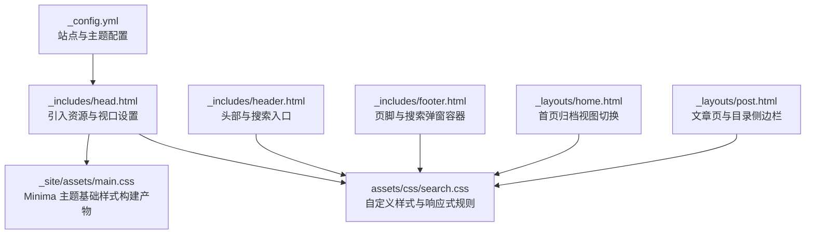
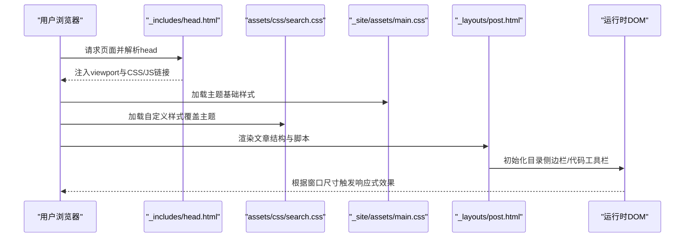
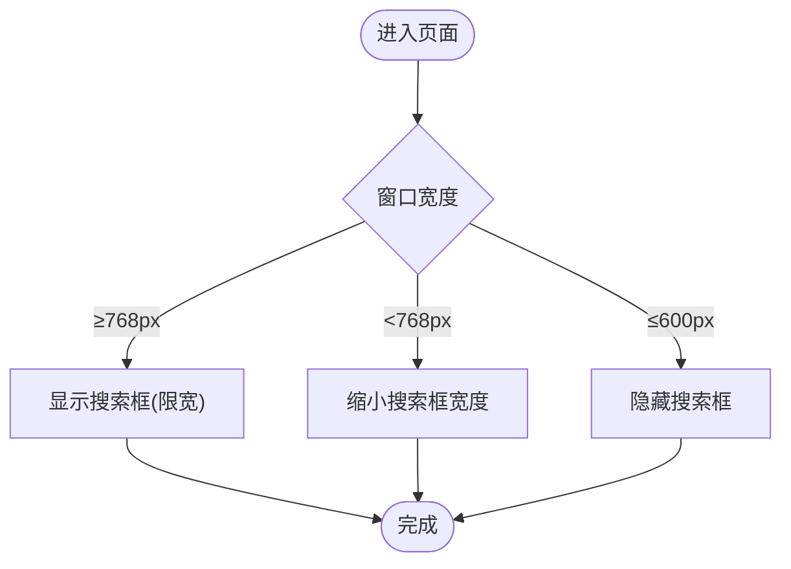
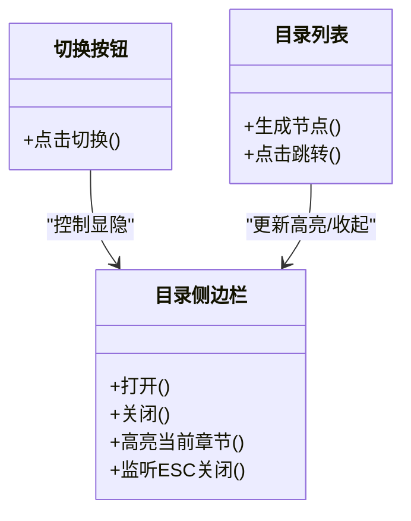
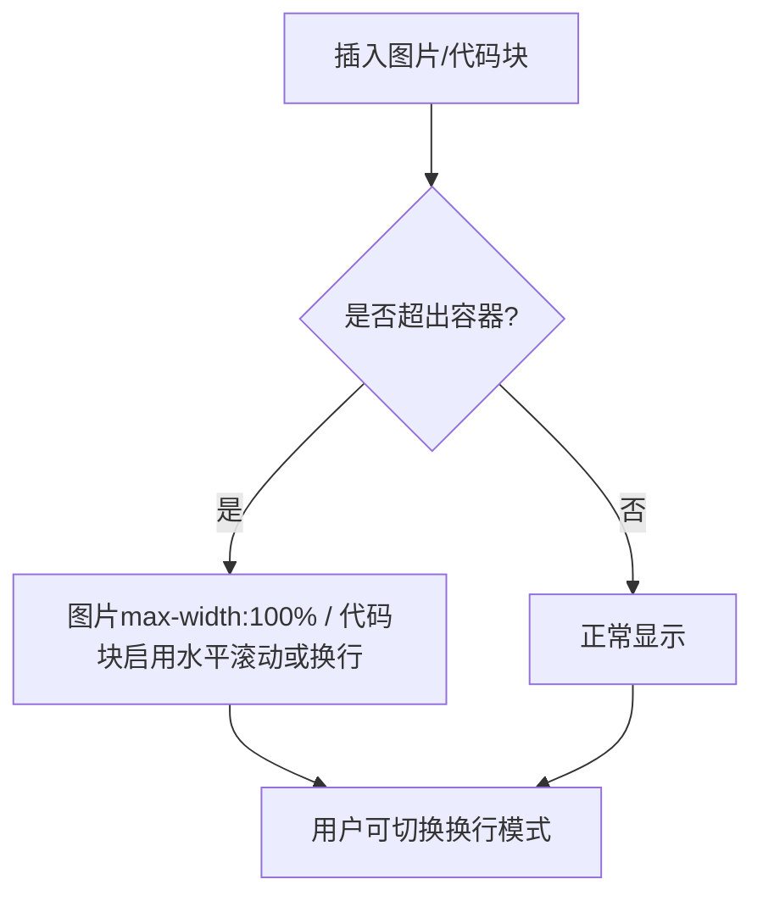
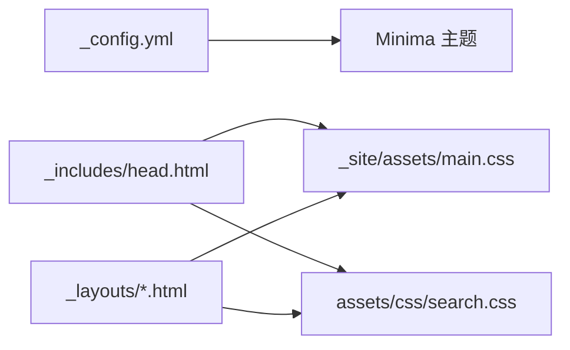

# 响应式设计适配

<cite>
**本文引用的文件**
- [_config.yml](file://_config.yml)
- [_includes/head.html](file://_includes/head.html)
- [_includes/header.html](file://_includes/header.html)
- [_includes/footer.html](file://_includes/footer.html)
- [_layouts/home.html](file://_layouts/home.html)
- [_layouts/post.html](file://_layouts/post.html)
- [assets/css/search.css](file://assets/css/search.css)
- [_site/assets/main.css](file://_site/assets/main.css)
</cite>

## 目录
1. [简介](#简介)
2. [项目结构](#项目结构)
3. [核心组件](#核心组件)
4. [架构总览](#架构总览)
5. [详细组件分析](#详细组件分析)
6. [依赖关系分析](#依赖关系分析)
7. [性能考虑](#性能考虑)
8. [故障排查指南](#故障排查指南)
9. [结论](#结论)
10. [附录](#附录)

## 简介
本文件聚焦于该 Jekyll 博客站点的响应式设计与跨设备适配策略，系统梳理媒体查询断点、布局与排版在不同屏幕尺寸下的表现，并给出可操作的实现建议与最佳实践。内容覆盖：
- 桌面端、平板端、移动端的适配方案
- 导航栏、搜索框、文章目录侧边栏等关键交互的自适应行为
- 字体大小、间距、网格/弹性布局的缩放策略
- 图片与代码块的自适应处理
- 性能优化与常见问题排查

## 项目结构
站点基于 Jekyll Minima 主题，自定义样式集中在 assets/css/search.css，基础样式由主题生成在 _site/assets/main.css。页面模板位于 _includes 与 _layouts，配置在 _config.yml。

图表来源
- [_config.yml:1-45](file://_config.yml#L1-L45)
- [_includes/head.html:1-26](file://_includes/head.html#L1-L26)
- [assets/css/search.css:1-1306](file://assets/css/search.css#L1-L1306)
- [_site/assets/main.css:1-506](file://_site/assets/main.css#L1-L506)

章节来源
- [_config.yml:1-45](file://_config.yml#L1-L45)
- [_includes/head.html:1-26](file://_includes/head.html#L1-L26)

## 核心组件
- 视口与资源加载：通过 head 片段统一设置 viewport 与 CSS/JS 资源引用，确保移动端正确渲染与按需加载。
- 自定义样式层：search.css 提供设计令牌、全局排版、头部吸顶、搜索框、文章排版、归档列表、页脚、目录侧边栏等样式与响应式规则。
- 主题基础样式层：_site/assets/main.css 为 Minima 主题生成的基础样式，包含基础重置、wrapper 宽度、导航、表格、代码高亮等。
- 交互脚本：post.html 内嵌目录侧边栏与代码块工具栏逻辑；home.html 内嵌分类/日期视图切换逻辑。

章节来源
- [_includes/head.html:1-26](file://_includes/head.html#L1-L26)
- [assets/css/search.css:1-1306](file://assets/css/search.css#L1-L1306)
- [_site/assets/main.css:1-506](file://_site/assets/main.css#L1-L506)
- [_layouts/post.html:1-194](file://_layouts/post.html#L1-L194)
- [_layouts/home.html:1-153](file://_layouts/home.html#L1-L153)

## 架构总览
响应式体系由“视口 + 基础样式 + 自定义样式 + 交互脚本”四层构成。自定义样式优先覆盖主题基础样式，并通过媒体查询与 clamp() 函数实现平滑缩放与断点切换。

图表来源
- [_includes/head.html:1-26](file://_includes/head.html#L1-L26)
- [assets/css/search.css:1-1306](file://assets/css/search.css#L1-L1306)
- [_site/assets/main.css:1-506](file://_site/assets/main.css#L1-L506)
- [_layouts/post.html:1-194](file://_layouts/post.html#L1-L194)

## 详细组件分析

### 视口与基础设置
- 视口设置：在 head 中声明 width=device-width, initial-scale=1，确保移动端按设备宽度渲染。
- 字体与颜色：通过 search.css 的设计令牌集中管理字体族、明暗色板、圆角、阴影与过渡时间，便于统一维护与扩展。
- 滚动与锚点：html 设置 smooth 滚动与 scroll-padding-top，避免固定头部遮挡锚点定位。

章节来源
- [_includes/head.html:1-26](file://_includes/head.html#L1-L26)
- [assets/css/search.css:1-120](file://assets/css/search.css#L1-L120)

### 导航栏与搜索框（头部）
- 吸顶导航：使用 sticky 定位与 backdrop-filter 模糊背景，提升可读性与现代感。
- 布局：header-wrapper 采用 flex 布局，标题与搜索框并列，搜索框在中等屏下限制最大宽度，小屏隐藏。
- 断点策略：
  - 768px 以下：搜索框最大宽度缩小
  - 600px 以下：搜索框完全隐藏，避免挤压标题区域
- 交互：点击搜索输入后显示字符计数，增强输入反馈。

图表来源
- [assets/css/search.css:361-471](file://assets/css/search.css#L361-L471)

章节来源
- [_includes/header.html:1-11](file://_includes/header.html#L1-L11)
- [assets/css/search.css:361-471](file://assets/css/search.css#L361-L471)

### 文章目录侧边栏（文章页）
- 展示方式：右侧固定面板，默认隐藏，点击按钮滑出；移动端宽度受限，点击目录项自动收起。
- 断点策略：
  - ≤1200px：点击目录项后关闭侧边栏，提升移动端阅读体验
  - ≤768px：缩小按钮尺寸与侧边栏宽度
- 交互：ESC 键关闭（当搜索弹窗未打开时），滚动高亮当前章节。

图表来源
- [_layouts/post.html:40-113](file://_layouts/post.html#L40-L113)
- [assets/css/search.css:1130-1306](file://assets/css/search.css#L1130-L1306)

章节来源
- [_layouts/post.html:40-113](file://_layouts/post.html#L40-L113)
- [assets/css/search.css:1130-1306](file://assets/css/search.css#L1130-L1306)

### 首页归档与视图切换
- 功能：支持“分类”和“日期”两种归档视图，通过 JS 切换显示。
- 布局：归档卡片使用 details/summary 折叠结构，配合圆角边框与悬停高亮，层次清晰。
- 响应式：在小屏下保持良好触控面积与可读性。

章节来源
- [_layouts/home.html:1-153](file://_layouts/home.html#L1-L153)
- [assets/css/search.css:897-1033](file://assets/css/search.css#L897-L1033)

### 图片与代码块自适应
- 图片：文章内图片居中显示，最大宽度 100%，带圆角与边框，保证在任何屏幕下不溢出。
- 代码块：
  - 默认自动换行，长代码可切换“不换行”以水平滚动查看
  - 语言标签、复制按钮、换行切换按钮组成工具栏，提升可用性
  - 暗色模式适配代码块背景与边框

图表来源
- [assets/css/search.css:856-862](file://assets/css/search.css#L856-L862)
- [assets/css/search.css:104-145](file://assets/css/search.css#L104-L145)
- [_layouts/post.html:116-193](file://_layouts/post.html#L116-L193)

章节来源
- [assets/css/search.css:856-862](file://assets/css/search.css#L856-L862)
- [assets/css/search.css:104-145](file://assets/css/search.css#L104-L145)
- [_layouts/post.html:116-193](file://_layouts/post.html#L116-L193)

### 字体与排版缩放策略
- 标题与正文使用 clamp() 进行相对缩放，兼顾不同屏幕下的可读性与紧凑度。
- 段落行高、字重、字母间距等通过设计令牌统一管理，保证视觉一致性。
- 主题基础样式中的标题字号也提供断点降级，确保兼容旧版样式。

章节来源
- [assets/css/search.css:733-815](file://assets/css/search.css#L733-L815)
- [_site/assets/main.css:340-364](file://_site/assets/main.css#L340-L364)

### 页脚布局
- 使用 flex 布局，左右信息对齐，支持换行与间距控制，适配多设备。

章节来源
- [_includes/footer.html:1-34](file://_includes/footer.html#L1-L34)
- [assets/css/search.css:1038-1096](file://assets/css/search.css#L1038-L1096)

## 依赖关系分析
- 样式优先级：search.css 在 head 中后加载，覆盖 _site/assets/main.css 的基础样式。
- 主题配置：_config.yml 指定 theme: minima，影响基础样式与插件行为。
- 脚本依赖：post.html 与 home.html 的内联脚本依赖 DOM 结构类名与 ID，修改模板时需同步调整。

图表来源
- [_config.yml:1-45](file://_config.yml#L1-L45)
- [_includes/head.html:1-26](file://_includes/head.html#L1-L26)
- [_site/assets/main.css:1-506](file://_site/assets/main.css#L1-L506)
- [assets/css/search.css:1-1306](file://assets/css/search.css#L1-L1306)

章节来源
- [_config.yml:1-45](file://_config.yml#L1-L45)
- [_includes/head.html:1-26](file://_includes/head.html#L1-L26)

## 性能考虑
- 资源加载
  - 使用 defer 延迟执行非关键脚本，减少首屏阻塞
  - 预连接外部字体域名，降低字体加载延迟
- 样式与布局
  - 合理使用 clamp() 减少大量媒体查询分支，提高渲染效率
  - 避免过度使用复杂滤镜与阴影，尤其在低端设备上
- 交互优化
  - 滚动事件使用 passive:true，避免主线程阻塞
  - 目录高亮与切换动画使用 transform 与 opacity，利于 GPU 加速
- 图片与代码
  - 图片 max-width:100% 防止溢出与重排
  - 代码块默认换行，必要时再启用水平滚动，减少不必要的重绘

[本节为通用指导，无需特定文件来源]

## 故障排查指南
- 搜索框在小屏不可见
  - 检查 600px 断点下是否被 display:none 隐藏，确认是否需要保留或替换为图标入口
  - 参考：[assets/css/search.css:467-471](file://assets/css/search.css#L467-L471)
- 目录侧边栏无法关闭
  - 确认 ESC 键监听是否与搜索弹窗冲突（搜索弹窗打开时禁用 ESC 关闭目录）
  - 参考：[_layouts/post.html:82-88](file://_layouts/post.html#L82-L88)
- 代码块复制失败
  - 检查 clipboard API 权限与 HTTPS 环境
  - 参考：[_layouts/post.html:163-174](file://_layouts/post.html#L163-L174)
- 标题锚点定位被头部遮挡
  - 检查 html 的 scroll-padding-top 值是否足够大
  - 参考：[assets/css/search.css:64-67](file://assets/css/search.css#L64-L67)

章节来源
- [assets/css/search.css:467-471](file://assets/css/search.css#L467-L471)
- [_layouts/post.html:82-88](file://_layouts/post.html#L82-L88)
- [_layouts/post.html:163-174](file://_layouts/post.html#L163-L174)
- [assets/css/search.css:64-67](file://assets/css/search.css#L64-L67)

## 结论
本项目通过“视口 + 基础样式 + 自定义样式 + 交互脚本”的分层架构，结合 clamp() 与少量关键断点，实现了桌面端、平板端与移动端的流畅适配。头部吸顶、搜索框、目录侧边栏、归档视图、图片与代码块均具备良好的自适应能力。建议在后续迭代中继续遵循设计令牌化、最小必要断点与 GPU 友好动画的原则，进一步提升跨设备体验与性能。

[本节为总结性内容，无需特定文件来源]

## 附录

### 常用断点与行为速查
- ≥1400px：主体最大宽度放宽至 1100px，提升大屏阅读空间
  - 参考：[assets/css/search.css:98-102](file://assets/css/search.css#L98-L102)
- ≤768px：搜索框宽度缩小，目录侧边栏按钮与面板尺寸微调
  - 参考：[assets/css/search.css:461-465](file://assets/css/search.css#L461-L465)、[assets/css/search.css:1294-1305](file://assets/css/search.css#L1294-L1305)
- ≤600px：搜索框隐藏，主题导航在小屏下切换为下拉菜单
  - 参考：[assets/css/search.css:467-471](file://assets/css/search.css#L467-L471)、[_site/assets/main.css:216-253](file://_site/assets/main.css#L216-L253)

章节来源
- [assets/css/search.css:98-102](file://assets/css/search.css#L98-L102)
- [assets/css/search.css:461-471](file://assets/css/search.css#L461-L471)
- [assets/css/search.css:1294-1305](file://assets/css/search.css#L1294-L1305)
- [_site/assets/main.css:216-253](file://_site/assets/main.css#L216-L253)