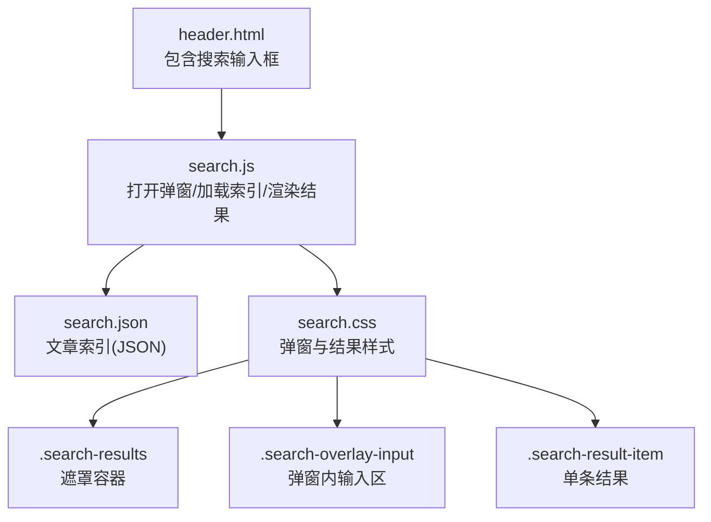
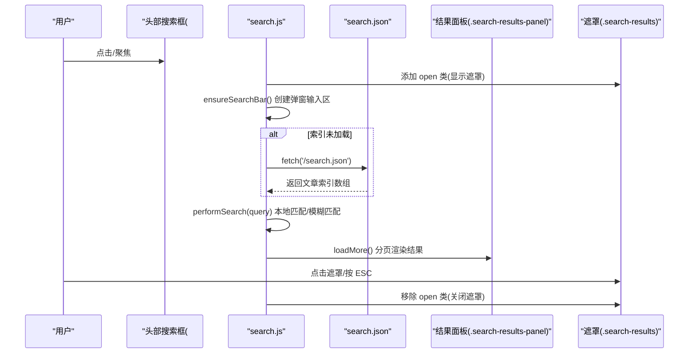
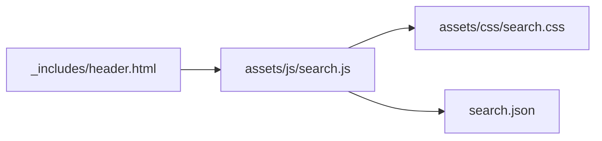

# 搜索弹窗样式定制

<cite>
**本文引用的文件**   
- [assets/css/search.css](file://assets/css/search.css)
- [assets/js/search.js](file://assets/js/search.js)
- [_includes/header.html](file://_includes/header.html)
- [search.json](file://search.json)
</cite>

## 目录
1. [简介](#简介)
2. [项目结构](#项目结构)
3. [核心组件](#核心组件)
4. [架构总览](#架构总览)
5. [详细组件分析](#详细组件分析)
6. [依赖关系分析](#依赖关系分析)
7. [性能与体验优化](#性能与体验优化)
8. [故障排查指南](#故障排查指南)
9. [结论](#结论)
10. [附录：常用定制清单](#附录常用定制清单)

## 简介
本指南面向希望定制“搜索弹窗”视觉与交互的开发者，聚焦以下目标：
- 理解搜索弹窗的 CSS 结构与关键类名（如 .search-results、.search-overlay-input、.search-result-item 等）
- 掌握如何修改弹窗背景色、边框、阴影、字体大小等视觉元素
- 提供搜索结果条目样式的定制示例（标题高亮、元数据、摘要文本）
- 给出响应式适配与移动端优化的建议

## 项目结构
本项目采用 Jekyll 静态站点结构，搜索功能由前端 JS 拉取 JSON 索引并渲染到全屏弹窗中。CSS 集中在 assets/css/search.css，JS 逻辑在 assets/js/search.js，头部入口在 _includes/header.html，搜索索引生成于 search.json。

图表来源
- [_includes/header.html:1-11](file://_includes/header.html#L1-L11)
- [assets/js/search.js:1-120](file://assets/js/search.js#L1-L120)
- [assets/css/search.css:477-727](file://assets/css/search.css#L477-L727)
- [search.json:1-13](file://search.json#L1-L13)

章节来源
- [_includes/header.html:1-11](file://_includes/header.html#L1-L11)
- [assets/js/search.js:1-120](file://assets/js/search.js#L1-L120)
- [assets/css/search.css:477-727](file://assets/css/search.css#L477-L727)
- [search.json:1-13](file://search.json#L1-L13)

## 核心组件
- 遮罩容器 .search-results：全屏固定定位，负责显示/隐藏动画与点击遮罩关闭行为
- 弹窗面板 .search-results-panel：承载滚动区域与结果列表
- 弹窗输入区 .search-overlay-input：固定在面板顶部，支持字符计数与结果数量提示
- 结果条目 .search-result-item：每条结果链接，包含标题、元数据、摘要
- 标题高亮 em：通过 JS 将匹配关键词包裹为 <em>，配合 CSS 高亮显示
- 元数据 .search-result-meta/.search-result-date/.search-result-tag：日期与标签
- 摘要 .search-result-snippet：截取并高亮关键词的片段文本
- 状态提示 .search-no-result/.search-error/.search-loading/.search-loading-end：空结果、错误、加载中、全部加载提示

章节来源
- [assets/css/search.css:477-727](file://assets/css/search.css#L477-L727)
- [assets/js/search.js:403-484](file://assets/js/search.js#L403-L484)

## 架构总览
搜索弹窗的工作流如下：用户点击或聚焦头部搜索框，JS 打开全屏遮罩，动态创建弹窗输入区；首次或无缓存时拉取 search.json，进行本地检索与分页渲染；滚动到底部自动加载更多；ESC 或点击遮罩可关闭。

图表来源
- [assets/js/search.js:147-223](file://assets/js/search.js#L147-L223)
- [assets/js/search.js:325-401](file://assets/js/search.js#L325-L401)
- [assets/js/search.js:414-484](file://assets/js/search.js#L414-L484)
- [assets/css/search.css:477-598](file://assets/css/search.css#L477-L598)

## 详细组件分析

### 遮罩与面板：.search-results 与 .search-results-panel
- 遮罩 .search-results：使用 fixed 定位覆盖全屏，默认透明不可见，open 类控制淡入可见；内部 flex 布局居中内容
- 面板 .search-results-panel：白色背景、圆角、最大高度限制、纵向滚动；阴影效果突出层级
- 小屏适配：移动端下面板铺满视口，去除圆角与最大宽度限制

定制要点
- 背景色：调整 .search-results 的背景透明度或颜色
- 面板背景与圆角：修改 .search-results-panel 的 background、border-radius
- 阴影：调整 box-shadow 实现更柔和或更强的浮层感
- 滚动条：自定义 ::-webkit-scrollbar 相关样式以统一风格

章节来源
- [assets/css/search.css:477-509](file://assets/css/search.css#L477-L509)
- [assets/css/search.css:594-598](file://assets/css/search.css#L594-L598)
- [assets/css/search.css:705-727](file://assets/css/search.css#L705-L727)

### 弹窗输入区：.search-overlay-input
- 固定在面板顶部，sticky 定位，包含输入框、字符计数、结果数量提示
- 输入框 focus 时边框与背景变化，提升可访问性

定制要点
- 输入框尺寸与圆角：调整 padding、font-size、border-radius
- 边框与焦点态：修改 border-color、box-shadow 等
- 字符计数位置与样式：调整 .search-overlay-char-count 的位置与字号
- 结果数量提示：修改 .search-overlay-count 的颜色与间距

章节来源
- [assets/css/search.css:511-558](file://assets/css/search.css#L511-L558)
- [assets/js/search.js:77-145](file://assets/js/search.js#L77-L145)

### 结果条目：.search-result-item
- 块级链接，hover 时左侧高亮边框与背景变化
- 子结构：
  - .search-result-title：标题，匹配词用 <em> 高亮
  - .search-result-meta：元数据行，包含日期与标签
  - .search-result-date：日期
  - .search-result-tag：标签胶囊样式
  - .search-result-snippet：摘要，最多三行，匹配词高亮

定制要点
- 标题高亮：通过 .search-result-title em 设置颜色、背景、内边距
- 元数据：调整 .search-result-meta 的 gap、字号、颜色
- 标签：修改 .search-result-tag 的背景、边框、圆角
- 摘要：调整 .search-result-snippet 的行数、字号、行高、颜色；em 高亮样式同上

章节来源
- [assets/css/search.css:608-678](file://assets/css/search.css#L608-L678)
- [assets/js/search.js:447-466](file://assets/js/search.js#L447-L466)

### 状态与提示：.search-no-result/.search-error/.search-loading/.search-loading-end
- 用于空结果、错误、加载中、已加载全部等场景
- 居中对齐，浅色文字，便于区分主内容

定制要点
- 字号与颜色：统一使用设计令牌中的文本与边框变量
- 间距：根据面板高度与整体风格调整 padding

章节来源
- [assets/css/search.css:680-702](file://assets/css/search.css#L680-L702)
- [assets/js/search.js:414-484](file://assets/js/search.js#L414-L484)

### 关闭按钮：.search-overlay-close
- 右上角圆形半透明按钮，hover 加深背景
- 仅在弹窗打开时显示

定制要点
- 位置与尺寸：调整 top/right、width/height、font-size
- 背景与透明度：修改 rgba 值与 hover 态

章节来源
- [assets/css/search.css:560-591](file://assets/css/search.css#L560-L591)

### 设计令牌与主题切换
- 使用 :root 变量定义颜色、圆角、阴影、字体、过渡时间
- 支持 prefers-color-scheme: dark 暗色模式变量覆盖

定制要点
- 全局配色：修改 --color-* 系列变量即可统一主题
- 暗色模式：在 @media (prefers-color-scheme: dark) 中覆盖对应变量
- 动效时长：调整 --transition-* 变量统一过渡节奏

章节来源
- [assets/css/search.css:7-58](file://assets/css/search.css#L7-L58)

## 依赖关系分析
- HTML 入口：_includes/header.html 提供 #search-input 与 data-search-url
- JS 逻辑：assets/js/search.js 负责 DOM 操作、事件绑定、索引加载与渲染
- 样式：assets/css/search.css 定义所有弹窗与结果样式
- 数据源：search.json 由 Jekyll 生成，包含 title、url、content、categories、date

图表来源
- [_includes/header.html:1-11](file://_includes/header.html#L1-L11)
- [assets/js/search.js:1-120](file://assets/js/search.js#L1-L120)
- [assets/css/search.css:477-727](file://assets/css/search.css#L477-L727)
- [search.json:1-13](file://search.json#L1-L13)

章节来源
- [_includes/header.html:1-11](file://_includes/header.html#L1-L11)
- [assets/js/search.js:1-120](file://assets/js/search.js#L1-L120)
- [assets/css/search.css:477-727](file://assets/css/search.css#L477-L727)
- [search.json:1-13](file://search.json#L1-L13)

## 性能与体验优化
- 预加载索引：页面初始化即 fetch search.json，减少首开延迟
- 去重策略：对索引按 URL 去重，避免重复项影响排序与展示
- 分页加载：PAGE_SIZE=8，滚动到底部自动加载更多，降低初始渲染压力
- 防抖输入：input 事件 200ms 防抖，避免频繁触发搜索
- 平滑清空：clearPanelSmooth 使用 opacity 过渡，提升切换流畅度
- 键盘与鼠标交互：ESC 关闭、点击遮罩关闭、选中文字不关闭，提升可用性

章节来源
- [assets/js/search.js:219-223](file://assets/js/search.js#L219-L223)
- [assets/js/search.js:29-37](file://assets/js/search.js#L29-L37)
- [assets/js/search.js:114-142](file://assets/js/search.js#L114-L142)
- [assets/js/search.js:61-75](file://assets/js/search.js#L61-L75)
- [assets/js/search.js:212-217](file://assets/js/search.js#L212-L217)
- [assets/js/search.js:194-205](file://assets/js/search.js#L194-L205)

## 故障排查指南
- 无法加载搜索索引
  - 现象：面板显示“无法加载搜索索引”
  - 可能原因：search.json 路径错误或网络不可达
  - 处理：确认 data-search-url 指向正确，检查浏览器控制台网络请求
- 结果未更新或闪烁
  - 现象：输入后结果不刷新或短暂空白
  - 可能原因：clearPanelSmooth 动画与立即渲染冲突
  - 处理：确保 clearPanelSmooth 的定时器清理逻辑未被覆盖
- 移动端遮罩点击误关
  - 现象：选择文字后点击遮罩导致弹窗关闭
  - 处理：已有逻辑检测选中文本长度，若仍出现，检查是否被其他脚本干扰
- 滚动锁定异常
  - 现象：关闭弹窗后页面滚动位置错乱
  - 处理：确认 closeOverlay 恢复 body 样式与 window.scrollTo 调用顺序

章节来源
- [assets/js/search.js:134-137](file://assets/js/search.js#L134-L137)
- [assets/js/search.js:61-75](file://assets/js/search.js#L61-L75)
- [assets/js/search.js:194-205](file://assets/js/search.js#L194-L205)
- [assets/js/search.js:177-192](file://assets/js/search.js#L177-L192)

## 结论
通过合理组织 CSS 结构与设计令牌，结合 JS 的预加载、去重、分页与防抖策略，搜索弹窗具备良好的可扩展性与用户体验。按需调整遮罩、面板、输入区与结果条目的样式，即可快速实现品牌化与个性化定制。

## 附录：常用定制清单
- 弹窗背景与阴影
  - 遮罩背景：.search-results 的 background
  - 面板背景与圆角：.search-results-panel 的 background、border-radius
  - 阴影强度：.search-results-panel 的 box-shadow
- 输入区样式
  - 输入框尺寸与圆角：.search-overlay-input input 的 padding、font-size、border-radius
  - 焦点态：focus 时的 border-color、background、box-shadow
  - 字符计数：.search-overlay-char-count 的 font-size、color、position
  - 结果数量提示：.search-overlay-count 的 color、white-space
- 结果条目样式
  - 悬停态：.search-result-item 的 background、border-left-color
  - 标题高亮：.search-result-title em 的 color、background、padding、border-radius
  - 元数据：.search-result-meta 的 gap、font-size、color
  - 日期：.search-result-date 的 color
  - 标签：.search-result-tag 的 background、color、border-radius
  - 摘要：.search-result-snippet 的 line-clamp、font-size、line-height、color；em 高亮同标题
- 状态提示样式
  - 空结果/错误/加载中：.search-no-result/.search-error/.search-loading/.search-loading-end 的 padding、font-size、color
- 关闭按钮
  - 位置与尺寸：.search-overlay-close 的 top/right、width/height、font-size
  - 背景与透明度：background、opacity、hover 态
- 响应式与移动端
  - 面板铺满：.search-results-panel 在小屏下的 width、height、max-width、max-height、border-radius
  - 输入区圆角：.search-overlay-input 在小屏下的 border-radius
  - 关闭按钮尺寸：.search-overlay-close 在小屏下的 width/height/font-size
- 主题与暗色模式
  - 设计令牌：:root 中的 --color-*、--radius-*、--shadow-*、--font-*、--transition-*
  - 暗色模式：@media (prefers-color-scheme: dark) 覆盖对应变量

章节来源
- [assets/css/search.css:477-727](file://assets/css/search.css#L477-L727)
- [assets/css/search.css:7-58](file://assets/css/search.css#L7-L58)
- [assets/js/search.js:414-484](file://assets/js/search.js#L414-L484)