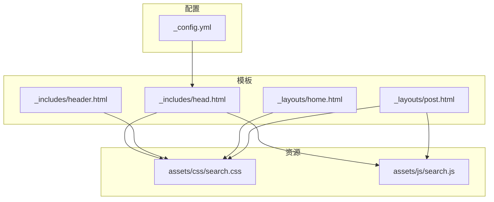
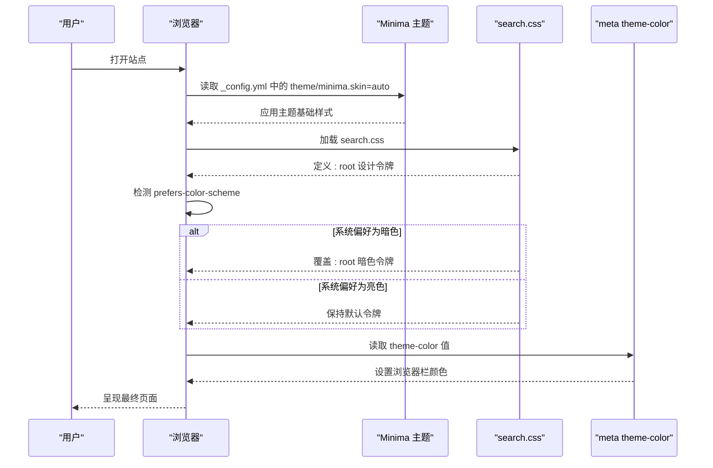
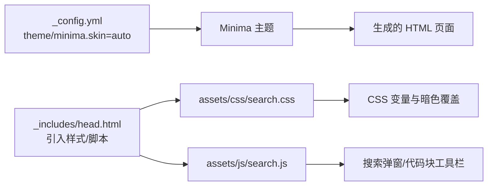

# 暗色模式支持

<cite>
**本文引用的文件**
- [_config.yml](file://_config.yml)
- [_includes/head.html](file://_includes/head.html)
- [_includes/header.html](file://_includes/header.html)
- [assets/css/search.css](file://assets/css/search.css)
- [assets/js/search.js](file://assets/js/search.js)
- [_layouts/home.html](file://_layouts/home.html)
- [_layouts/post.html](file://_layouts/post.html)
- [README.md](file://README.md)
</cite>

## 目录
1. [简介](#简介)
2. [项目结构](#项目结构)
3. [核心组件](#核心组件)
4. [架构总览](#架构总览)
5. [详细组件分析](#详细组件分析)
6. [依赖关系分析](#依赖关系分析)
7. [性能考虑](#性能考虑)
8. [故障排查指南](#故障排查指南)
9. [结论](#结论)
10. [附录](#附录)

## 简介
本指南面向希望为现有 Jekyll 站点添加或完善“暗色模式”支持的开发者与内容作者。文档基于仓库实际实现，系统梳理了以下要点：
- 使用 prefers-color-scheme 媒体查询自动跟随系统主题
- 通过 CSS 变量集中管理颜色、阴影、圆角等设计令牌，并针对暗色模式覆盖
- 在 Minima 主题基础上启用 auto 皮肤，配合站点 meta theme-color 适配移动端浏览器栏
- 提供用户手动切换暗色模式的思路与可访问性建议（含 localStorage 存储与偏好检测）
- 给出测试方法与常见问题排查清单

## 项目结构
本项目采用 Jekyll + Minima 主题，样式集中在 assets/css/search.css，页面模板位于 _includes 与 _layouts，搜索交互逻辑位于 assets/js/search.js。

图表来源
- [_config.yml:10-15](file://_config.yml#L10-L15)
- [_includes/head.html:9-11](file://_includes/head.html#L9-L11)
- [_includes/header.html:1-11](file://_includes/header.html#L1-L11)
- [assets/css/search.css:7-58](file://assets/css/search.css#L7-L58)
- [assets/js/search.js:1-20](file://assets/js/search.js#L1-L20)
- [_layouts/home.html:1-20](file://_layouts/home.html#L1-L20)
- [_layouts/post.html:1-20](file://_layouts/post.html#L1-L20)

章节来源
- [_config.yml:10-15](file://_config.yml#L10-L15)
- [_includes/head.html:9-11](file://_includes/head.html#L9-L11)
- [_includes/header.html:1-11](file://_includes/header.html#L1-L11)
- [assets/css/search.css:7-58](file://assets/css/search.css#L7-L58)
- [assets/js/search.js:1-20](file://assets/js/search.js#L1-L20)
- [_layouts/home.html:1-20](file://_layouts/home.html#L1-L20)
- [_layouts/post.html:1-20](file://_layouts/post.html#L1-L20)

## 核心组件
- 主题与皮肤
  - 站点配置中启用 Minima 主题并将 skin 设置为 auto，使主题根据系统偏好自动选择亮/暗外观。
- 设计令牌与暗色覆盖
  - 在 :root 下定义一组 CSS 变量作为设计令牌；在 @media (prefers-color-scheme: dark) 中覆盖这些变量，实现全局暗色模式。
- 浏览器栏颜色
  - 在 head 中设置 meta name="theme-color"，用于控制移动端浏览器地址栏颜色。
- 页面模板与脚本
  - 模板引入主样式与搜索脚本；搜索弹窗与代码块工具栏等交互由脚本驱动，其视觉表现受 CSS 变量影响。

章节来源
- [_config.yml:10-15](file://_config.yml#L10-L15)
- [_includes/head.html:21](file://_includes/head.html#L21)
- [assets/css/search.css:7-58](file://assets/css/search.css#L7-L58)
- [_layouts/home.html:134-152](file://_layouts/home.html#L134-L152)
- [_layouts/post.html:115-193](file://_layouts/post.html#L115-L193)

## 架构总览
下图展示了从配置到渲染的链路，以及暗色模式生效的关键节点。

图表来源
- [_config.yml:10-15](file://_config.yml#L10-L15)
- [_includes/head.html:21](file://_includes/head.html#L21)
- [assets/css/search.css:7-58](file://assets/css/search.css#L7-L58)

## 详细组件分析

### 1) 自动跟随系统主题（prefers-color-scheme）
- 机制说明
  - 站点配置将 Minima 主题皮肤设为 auto，使主题层面对系统偏好做出响应。
  - 自定义样式在 :root 中声明设计令牌，并在 @media (prefers-color-scheme: dark) 中覆盖令牌，从而全局切换暗色。
- 关键位置
  - 主题与皮肤配置：[_config.yml:10-15](file://_config.yml#L10-L15)
  - 设计令牌与暗色覆盖：[assets/css/search.css:7-58](file://assets/css/search.css#L7-L58)
- 效果范围
  - 背景、文本、边框、强调色、阴影、圆角、字体族等全部通过变量统一控制，暗色模式下整体对比度与层次保持一致。

章节来源
- [_config.yml:10-15](file://_config.yml#L10-L15)
- [assets/css/search.css:7-58](file://assets/css/search.css#L7-L58)

### 2) CSS 变量与暗色覆盖策略
- 设计令牌分类
  - 背景类：--color-bg、--color-bg-elevated、--color-bg-subtle
  - 文本类：--color-text、--color-text-secondary、--color-text-muted
  - 边框类：--color-border、--color-border-subtle
  - 强调类：--color-accent、--color-accent-hover、--color-accent-bg、--color-accent-text
  - 高亮类：--color-highlight、--color-highlight-bg
  - 阴影与圆角：--shadow-sm、--shadow-md、--radius-*
  - 字体与过渡：--font-sans、--font-mono、--transition-fast、--transition-normal
- 暗色覆盖要点
  - 在暗色媒体查询内仅覆盖需要变化的变量，避免硬编码颜色散落各处
  - 对阴影进行适度加深，保证层级感
  - 对高亮与强调色提升明度，确保可读性与对比度

章节来源
- [assets/css/search.css:7-58](file://assets/css/search.css#L7-L58)

### 3) 浏览器栏颜色（theme-color）
- 作用
  - 控制移动端浏览器顶部栏颜色，与页面主题保持一致。
- 当前实现
  - 在 head 中设置 meta name="theme-color" 值为白色系，适合亮色模式。
- 改进建议
  - 结合 JavaScript 动态更新该 meta 的值，使其随用户选择的主题变化而变化。

章节来源
- [_includes/head.html:21](file://_includes/head.html#L21)

### 4) 用户手动切换暗色模式（推荐方案）
虽然当前仓库未内置手动切换功能，但可在不破坏现有自动模式的前提下，增加“用户强制覆盖”的能力。以下为实施步骤与注意事项（不含具体代码片段，仅提供路径指引）：

- 总体流程
  - 初始化时检测用户偏好：优先读取 localStorage 中的记录；若不存在，则回退到 prefers-color-scheme 的结果
  - 根据结果向 <html> 或 <body> 添加 data-theme 属性（如 "dark" 或 "light"）
  - 在 CSS 中新增以 [data-theme="dark"] 为前缀的选择器，覆盖 :root 下的设计令牌
  - 监听系统主题变更事件，当用户未显式设置主题时，自动跟随系统
  - 提供 UI 开关（例如在头部导航处），点击后写入 localStorage 并刷新主题
  - 同步更新 meta theme-color 的值，使浏览器栏颜色与主题一致

- 关键实现位置建议
  - 在 _includes/head.html 中注入一段轻量脚本，负责初始化与监听
  - 在 assets/css/search.css 中新增 [data-theme="dark"] 覆盖段，复用已有变量名，降低维护成本
  - 在 _includes/header.html 中添加一个“主题切换”按钮，绑定点击事件

- 可访问性要点
  - 切换按钮需具备 aria-label 与 role 语义
  - 切换过程应平滑过渡，避免闪烁
  - 遵循系统级减少动画偏好，尊重用户的无障碍需求

- 参考路径
  - 初始化与监听入口：[_includes/head.html:1-27](file://_includes/head.html#L1-L27)
  - 设计令牌覆盖目标：[assets/css/search.css:7-58](file://assets/css/search.css#L7-L58)
  - 头部 UI 插入点：[_includes/header.html:1-11](file://_includes/header.html#L1-L11)

（本节为概念性指导，不包含具体代码片段）

### 5) 现有样式的暗色适配清单
- 颜色反转与对比度
  - 所有文字、链接、图标、边框、分割线均使用 CSS 变量，无需额外处理
  - 对固定色值（如某些行内代码语义类）已在暗色媒体查询中单独覆盖，确保可读性
- 阴影与层级
  - 在暗色模式下适当提高阴影不透明度，维持卡片、弹窗、悬浮层的层次感
- 图片与 SVG
  - 对于纯黑白或浅色为主的图片，建议在暗色模式下叠加滤镜或替换为暗色版本
  - 使用 CSS 变量控制 SVG stroke/fill 的颜色，便于统一切换
- 表单控件
  - 输入框、下拉框、复选框等在暗色模式下需检查焦点态与禁用态的可读性
- 打印样式
  - 打印时应忽略暗色模式，确保输出清晰

章节来源
- [assets/css/search.css:258-268](file://assets/css/search.css#L258-L268)

### 6) 搜索弹窗与代码块工具栏的暗色体验
- 搜索弹窗
  - 面板背景、边框、滚动条、计数器等均使用设计令牌，暗色模式下自动适配
- 代码块工具栏
  - 复制、换行按钮的背景、边框、悬停态均基于变量，暗色模式下保持一致风格
- 相关样式与脚本
  - 搜索弹窗样式与交互：[assets/css/search.css:477-727](file://assets/css/search.css#L477-L727)、[assets/js/search.js:147-217](file://assets/js/search.js#L147-L217)
  - 代码块工具栏样式与交互：[assets/css/search.css:146-214](file://assets/css/search.css#L146-L214)、[assets/js/search.js:115-193](file://assets/js/search.js#L115-L193)

章节来源
- [assets/css/search.css:146-214](file://assets/css/search.css#L146-L214)
- [assets/css/search.css:477-727](file://assets/css/search.css#L477-L727)
- [assets/js/search.js:115-193](file://assets/js/search.js#L115-L193)
- [assets/js/search.js:147-217](file://assets/js/search.js#L147-L217)

## 依赖关系分析
- 主题依赖
  - 站点通过 _config.yml 指定 theme 与 minima.skin=auto，决定主题是否自动跟随系统
- 样式依赖
  - 所有页面模板通过 head 引入 assets/css/search.css，暗色令牌在该文件中集中定义与覆盖
- 脚本依赖
  - 搜索与代码块工具栏脚本在模板中引入，其视觉表现完全受 CSS 变量控制

图表来源
- [_config.yml:10-15](file://_config.yml#L10-L15)
- [_includes/head.html:9-11](file://_includes/head.html#L9-L11)
- [assets/css/search.css:7-58](file://assets/css/search.css#L7-L58)
- [assets/js/search.js:1-20](file://assets/js/search.js#L1-L20)

章节来源
- [_config.yml:10-15](file://_config.yml#L10-L15)
- [_includes/head.html:9-11](file://_includes/head.html#L9-L11)
- [assets/css/search.css:7-58](file://assets/css/search.css#L7-L58)
- [assets/js/search.js:1-20](file://assets/js/search.js#L1-L20)

## 性能考虑
- 使用 CSS 变量可减少重复颜色声明，利于维护与缓存命中
- 暗色覆盖仅在媒体查询内生效，不会带来额外运行时开销
- 如需手动切换，应避免频繁重排重绘，尽量通过 class/data 属性切换，并使用 transition 平滑过渡
- 图片与 SVG 的暗色适配建议使用 CSS 滤镜或变量，避免多套资源请求

## 故障排查指南
- 暗色未生效
  - 检查浏览器是否支持 prefers-color-scheme
  - 确认 search.css 已正确加载且未被其他样式覆盖
- 部分元素颜色异常
  - 定位是否存在硬编码颜色，将其改为 CSS 变量或在暗色媒体查询中补充覆盖
- 移动端浏览器栏颜色不一致
  - 检查 meta theme-color 的值，必要时通过脚本动态更新
- 切换主题后闪烁
  - 在 head 中尽早执行初始化脚本，避免 FOUC（无样式内容闪烁）
- 可访问性问题
  - 检查对比度是否符合 WCAG 要求
  - 为交互控件添加合适的 aria-label 与键盘可达性

章节来源
- [_includes/head.html:21](file://_includes/head.html#L21)
- [assets/css/search.css:7-58](file://assets/css/search.css#L7-L58)

## 结论
本项目已通过 Minima 主题的 auto 皮肤与 CSS 变量的暗色覆盖实现了良好的自动暗色模式支持。在此基础上，可通过少量扩展实现用户手动切换、持久化偏好与浏览器栏颜色同步，进一步提升可用性与一致性。建议遵循设计令牌化、最小覆盖原则与可访问性规范，确保在不同设备与系统中获得一致的阅读体验。

## 附录
- 快速上手清单
  - 在 :root 中定义设计令牌
  - 在 @media (prefers-color-scheme: dark) 中覆盖令牌
  - 在 head 中设置 meta theme-color
  - 如需手动切换，增加 data-theme 与 localStorage 持久化
  - 为交互控件补充可访问性标注
- 相关文件索引
  - 主题与皮肤：[_config.yml:10-15](file://_config.yml#L10-L15)
  - 设计令牌与暗色覆盖：[assets/css/search.css:7-58](file://assets/css/search.css#L7-L58)
  - 浏览器栏颜色：[_includes/head.html](file://_includes/head.html#L21)
  - 搜索与代码块工具栏：[assets/js/search.js:115-217](file://assets/js/search.js#L115-L217)