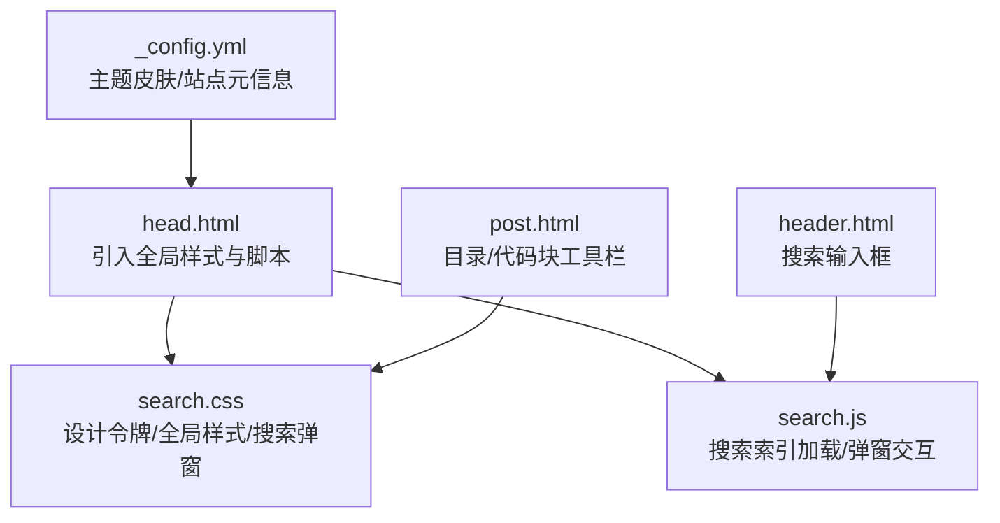
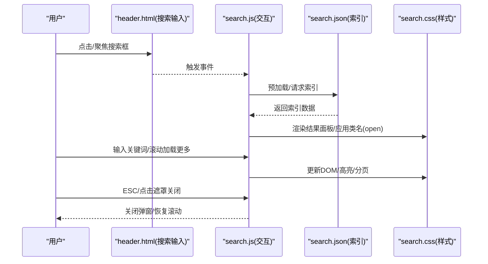
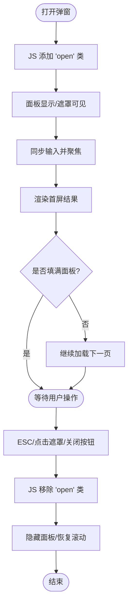
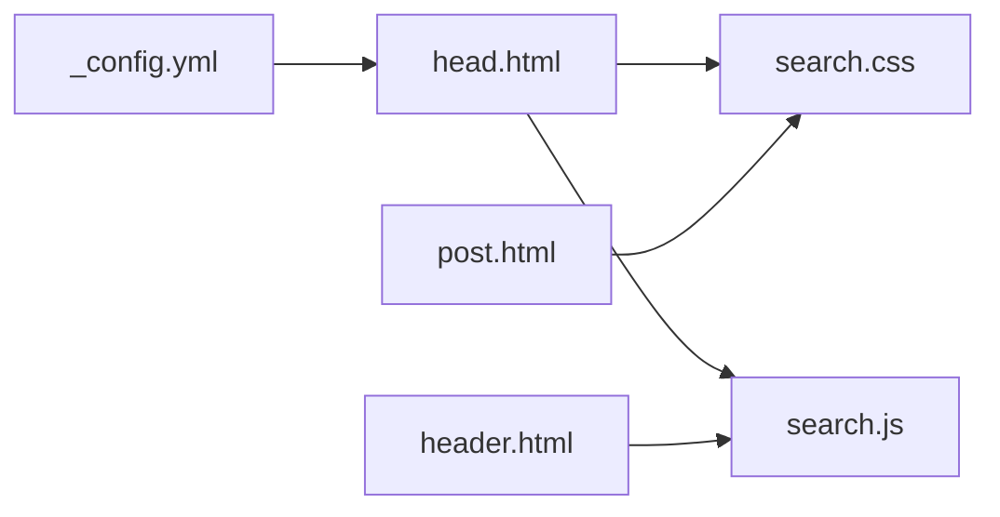

# 样式定制

<cite>
**本文引用的文件**
- [assets/css/search.css](file://assets/css/search.css)
- [assets/js/search.js](file://assets/js/search.js)
- [_includes/head.html](file://_includes/head.html)
- [_includes/header.html](file://_includes/header.html)
- [_layouts/post.html](file://_layouts/post.html)
- [_config.yml](file://_config.yml)
</cite>

## 目录
1. [简介](#简介)
2. [项目结构](#项目结构)
3. [核心组件](#核心组件)
4. [架构总览](#架构总览)
5. [详细组件分析](#详细组件分析)
6. [依赖关系分析](#依赖关系分析)
7. [性能与可访问性](#性能与可访问性)
8. [故障排查指南](#故障排查指南)
9. [结论](#结论)
10. [附录：常见定制清单](#附录常见定制清单)

## 简介
本指南面向希望深度定制博客外观的开发者，围绕 CSS 变量设计体系、主题覆盖策略、搜索弹窗样式、响应式适配与暗色模式配置展开。你将学会如何统一修改颜色主题、字体大小、间距布局等视觉元素，并掌握搜索弹窗背景、边框、阴影等效果的定制方法。文档提供“代码片段路径”以便快速定位实现位置，避免直接粘贴大段代码，便于你按需裁剪与组合。

## 项目结构
本项目基于 Jekyll + Minima 主题，样式主要集中于 assets/css/search.css，交互逻辑集中在 assets/js/search.js；头部资源引入在 _includes/head.html，搜索输入框在 _includes/header.html，文章页增强（目录、代码块工具栏）在 _layouts/post.html。

图表来源
- [_includes/head.html:1-27](file://_includes/head.html#L1-L27)
- [assets/css/search.css:1-120](file://assets/css/search.css#L1-L120)
- [assets/js/search.js:1-60](file://assets/js/search.js#L1-L60)
- [_includes/header.html:1-11](file://_includes/header.html#L1-L11)
- [_layouts/post.html:115-194](file://_layouts/post.html#L115-L194)
- [_config.yml:10-16](file://_config.yml#L10-L16)

章节来源
- [_includes/head.html:1-27](file://_includes/head.html#L1-L27)
- [_includes/header.html:1-11](file://_includes/header.html#L1-L11)
- [assets/css/search.css:1-120](file://assets/css/search.css#L1-L120)
- [assets/js/search.js:1-60](file://assets/js/search.js#L1-L60)
- [_layouts/post.html:115-194](file://_layouts/post.html#L115-L194)
- [_config.yml:10-16](file://_config.yml#L10-L16)

## 核心组件
- 设计令牌（CSS Variables）：集中定义颜色、圆角、阴影、字体、过渡等基础值，贯穿全站样式。
- 全局排版与组件：正文、标题、链接、引用、表格、代码块、分割线等。
- 搜索系统：头部搜索框 + 全屏弹窗，含结果分页、高亮、摘要生成、键盘与点击交互。
- 文章页增强：目录侧边栏、代码块工具栏（复制/换行切换）。

章节来源
- [assets/css/search.css:1-120](file://assets/css/search.css#L1-L120)
- [assets/css/search.css:357-472](file://assets/css/search.css#L357-L472)
- [assets/css/search.css:473-727](file://assets/css/search.css#L473-L727)
- [assets/js/search.js:1-60](file://assets/js/search.js#L1-L60)
- [_layouts/post.html:115-194](file://_layouts/post.html#L115-L194)

## 架构总览
下图展示了样式与交互的关键链路：head 引入样式与脚本，header 提供搜索入口，search.js 负责弹窗与检索，search.css 控制所有视觉呈现。

图表来源
- [_includes/header.html:1-11](file://_includes/header.html#L1-L11)
- [assets/js/search.js:1-60](file://assets/js/search.js#L1-L60)
- [assets/js/search.js:147-217](file://assets/js/search.js#L147-L217)
- [assets/js/search.js:219-224](file://assets/js/search.js#L219-L224)
- [assets/js/search.js:325-401](file://assets/js/search.js#L325-L401)
- [assets/js/search.js:414-484](file://assets/js/search.js#L414-L484)
- [assets/css/search.css:473-727](file://assets/css/search.css#L473-L727)

## 详细组件分析

### 设计令牌与主题体系
- 令牌分类
  - 颜色：背景、文本、强调色、高亮、边框等
  - 尺寸：圆角、阴影
  - 字体：无衬线/等宽字体族
  - 动效：过渡时长与缓动
- 暗色模式
  - 使用 prefers-color-scheme: dark 媒体查询覆盖 :root 中的令牌，自动适配系统偏好
- 覆盖策略
  - 推荐在本地新增一个自定义 CSS 文件并在 head 中引入，通过重新声明 :root 下的同名变量即可全局生效
  - 若需仅对特定区域生效，可在对应容器上设置局部变量或使用更具体的选择器覆盖

章节来源
- [assets/css/search.css:1-58](file://assets/css/search.css#L1-L58)

### 全局排版与组件
- 字体与字号
  - 正文使用无衬线字体族，标题加粗，正文行高宽松以提升可读性
  - 代码块默认启用自动换行，可通过 .nowrap 切换为水平滚动
- 链接与交互
  - 链接颜色采用强调色，悬停时加深并提供下划线颜色
- 引用与提示
  - 支持 info/tip/warning/danger 四类提示块，带左侧彩色条与图标前缀
- 表格
  - 表头与偶数行使用浅色背景区分层级
- 代码块工具栏
  - 动态注入语言标签、复制按钮、换行切换按钮，提升阅读体验

章节来源
- [assets/css/search.css:64-144](file://assets/css/search.css#L64-L144)
- [assets/css/search.css:270-356](file://assets/css/search.css#L270-L356)
- [_layouts/post.html:115-194](file://_layouts/post.html#L115-L194)

### 搜索弹窗样式定制
- 结构与类名
  - 遮罩层：.search-results
  - 面板：.search-results-panel
  - 顶部输入区：.search-overlay-input
  - 条目：.search-result-item / .search-result-title / .search-result-snippet / .search-result-meta
  - 状态：.search-no-result / .search-error / .search-loading / .search-loading-end
- 关键可定制点
  - 背景与透明度：遮罩背景、面板背景
  - 边框与圆角：面板圆角、输入框边框
  - 阴影与层次：面板阴影、z-index 层级
  - 滚动条：面板滚动条样式
  - 小屏适配：移动端全屏铺满、关闭按钮位置调整
- 交互联动
  - 打开/关闭由 JS 添加/移除 open 类驱动，样式通过该类控制显隐与过渡

图表来源
- [assets/js/search.js:147-217](file://assets/js/search.js#L147-L217)
- [assets/js/search.js:325-401](file://assets/js/search.js#L325-L401)
- [assets/js/search.js:414-484](file://assets/js/search.js#L414-L484)
- [assets/css/search.css:473-727](file://assets/css/search.css#L473-L727)

章节来源
- [assets/css/search.css:473-727](file://assets/css/search.css#L473-L727)
- [assets/js/search.js:147-217](file://assets/js/search.js#L147-L217)
- [assets/js/search.js:325-401](file://assets/js/search.js#L325-L401)
- [assets/js/search.js:414-484](file://assets/js/search.js#L414-L484)

### 响应式设计适配技巧
- 头部与搜索框
  - 在大屏限制最大宽度，在小屏缩小或隐藏搜索框，保证导航紧凑
- 搜索结果面板
  - 小屏下面板占满视口高度，关闭按钮位置靠近边缘，提升触控友好度
- 正文排版
  - 标题与正文字号使用 clamp() 随视口缩放，保持可读性与节奏感

章节来源
- [assets/css/search.css:98-102](file://assets/css/search.css#L98-L102)
- [assets/css/search.css:461-471](file://assets/css/search.css#L461-L471)
- [assets/css/search.css:704-727](file://assets/css/search.css#L704-L727)
- [assets/css/search.css:733-770](file://assets/css/search.css#L733-L770)

### 暗色模式配置选项
- 系统级自动切换
  - 通过 prefers-color-scheme: dark 媒体查询覆盖 :root 令牌，无需额外开关
- 主题皮肤
  - 站点配置中可设置 Minima 皮肤为 auto/classic/dark，影响整体基调
- 建议
  - 优先通过覆盖 :root 令牌完成暗色主题微调，确保一致性

章节来源
- [assets/css/search.css:37-58](file://assets/css/search.css#L37-L58)
- [_config.yml:12-15](file://_config.yml#L12-L15)

## 依赖关系分析
- 资源引入
  - head.html 引入 Inter 字体、主样式 main.css、搜索样式 search.css 与搜索脚本 search.js
- 运行时依赖
  - search.js 依赖 search.json 作为索引源，依赖 DOM 节点 id 与 class 名称
- 模板依赖
  - header.html 提供搜索输入框及 data-search-url 属性
  - post.html 注入目录与代码块工具栏，与 search.css 的通用组件样式协同

图表来源
- [_includes/head.html:1-27](file://_includes/head.html#L1-L27)
- [_includes/header.html:1-11](file://_includes/header.html#L1-L11)
- [_layouts/post.html:115-194](file://_layouts/post.html#L115-L194)
- [_config.yml:10-16](file://_config.yml#L10-L16)

章节来源
- [_includes/head.html:1-27](file://_includes/head.html#L1-L27)
- [_includes/header.html:1-11](file://_includes/header.html#L1-L11)
- [_layouts/post.html:115-194](file://_layouts/post.html#L115-L194)
- [_config.yml:10-16](file://_config.yml#L10-L16)

## 性能与可访问性
- 性能
  - 搜索索引预加载，首次点击立即可用
  - 结果分页加载，减少一次性渲染开销
  - 使用 requestAnimationFrame 优化批量插入
- 可访问性
  - 搜索输入框具备 placeholder 与 aria-label
  - 关闭按钮提供 aria-label，ESC 键可关闭弹窗
  - 代码块工具栏按钮提供 title 与 aria-label

章节来源
- [assets/js/search.js:219-224](file://assets/js/search.js#L219-L224)
- [assets/js/search.js:414-484](file://assets/js/search.js#L414-L484)
- [_layouts/post.html:157-191](file://_layouts/post.html#L157-L191)

## 故障排查指南
- 搜索无结果
  - 检查 search.json 是否存在且可访问
  - 确认 data-search-url 指向正确路径
- 弹窗无法关闭
  - 检查是否有选中文字导致关闭被阻止
  - 确认 ESC 监听未被其他脚本拦截
- 样式未生效
  - 确认自定义 CSS 在 search.css 之后加载
  - 检查选择器优先级，必要时提高特异性或使用 !important（谨慎）

章节来源
- [assets/js/search.js:147-217](file://assets/js/search.js#L147-L217)
- [assets/js/search.js:561-571](file://assets/js/search.js#L561-L571)
- [_includes/head.html:9-11](file://_includes/head.html#L9-L11)

## 结论
通过统一的 CSS 变量设计令牌与媒体查询，本项目实现了清晰的主题体系与良好的暗色模式支持。搜索弹窗提供了完整的交互与样式扩展点，配合响应式规则可在多端保持一致体验。建议以“覆盖令牌”的方式做主题定制，既简洁又易于维护。

## 附录：常见定制清单
- 更换主题色
  - 覆盖 :root 中的强调色相关变量（如 accent/accent-hover/accent-bg/accent-text），使链接、按钮、高亮等统一变化
  - 参考路径：[assets/css/search.css:1-35](file://assets/css/search.css#L1-L35)
- 调整字体与字号
  - 修改 sans-serif/monospace 字体族变量，或覆盖 h1-h6、正文的 font-size 与 line-height
  - 参考路径：[assets/css/search.css:30-35](file://assets/css/search.css#L30-L35)、[assets/css/search.css:69-81](file://assets/css/search.css#L69-L81)、[assets/css/search.css:733-770](file://assets/css/search.css#L733-L770)
- 调整间距与圆角
  - 修改 radius-sm/md/lg 变量，或针对具体组件（如 pre、blockquote）调整 padding/margin/border-radius
  - 参考路径：[assets/css/search.css:23-25](file://assets/css/search.css#L23-L25)、[assets/css/search.css:119-144](file://assets/css/search.css#L119-L144)、[assets/css/search.css:278-289](file://assets/css/search.css#L278-L289)
- 修改阴影与层级
  - 调整 shadow-sm/md 变量，或为搜索面板单独设置 box-shadow 与 z-index
  - 参考路径：[assets/css/search.css:27-28](file://assets/css/search.css#L27-L28)、[assets/css/search.css:503-509](file://assets/css/search.css#L503-L509)
- 定制搜索弹窗背景/边框/阴影
  - 覆盖 .search-results 背景透明度、.search-results-panel 背景与圆角、.search-overlay-input 边框与焦点态
  - 参考路径：[assets/css/search.css:477-540](file://assets/css/search.css#L477-L540)
- 调整搜索结果条目样式
  - 修改 .search-result-item 悬停背景、左边框高亮、标题与摘要字体大小与颜色
  - 参考路径：[assets/css/search.css:608-678](file://assets/css/search.css#L608-L678)
- 小屏适配
  - 调整 .search-results 在小屏的布局与关闭按钮位置，必要时隐藏头部搜索框
  - 参考路径：[assets/css/search.css:461-471](file://assets/css/search.css#L461-L471)、[assets/css/search.css:704-727](file://assets/css/search.css#L704-L727)
- 暗色模式
  - 在 prefers-color-scheme: dark 中覆盖 :root 令牌，或根据需要在组件内追加暗色规则
  - 参考路径：[assets/css/search.css:37-58](file://assets/css/search.css#L37-L58)
- 引入自定义样式
  - 在 head.html 中添加自定义 CSS 链接，确保位于 search.css 之后以覆盖默认样式
  - 参考路径：[_includes/head.html:9-11](file://_includes/head.html#L9-L11)