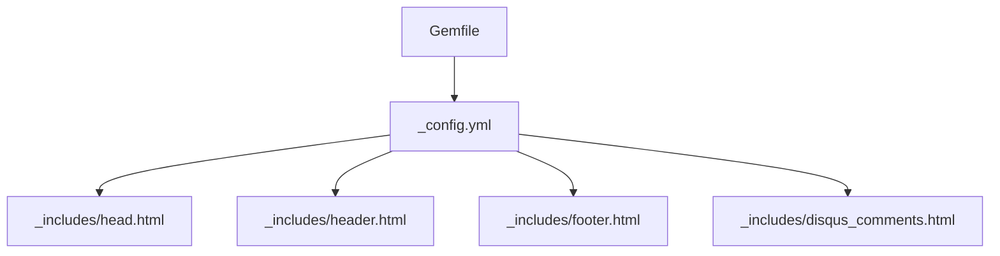
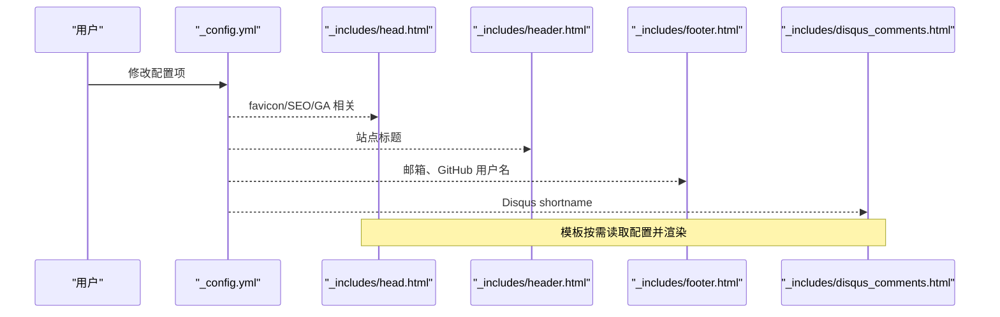
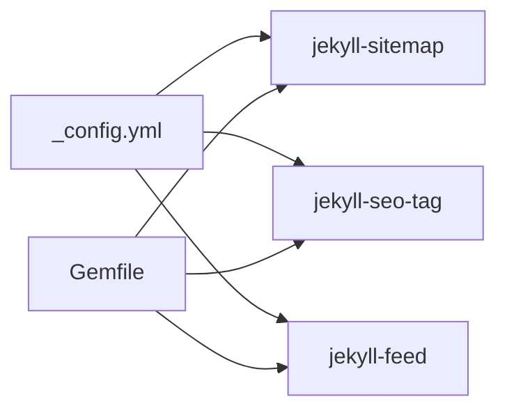

# 配置文件设置

<cite>
**本文引用的文件**   
- [_config.yml](file://_config.yml)
- [README.md](file://README.md)
- [_includes/head.html](file://_includes/head.html)
- [_includes/header.html](file://_includes/header.html)
- [_includes/footer.html](file://_includes/footer.html)
- [_includes/disqus_comments.html](file://_includes/disqus_comments.html)
- [Gemfile](file://Gemfile)
</cite>

## 更新摘要
**变更内容**   
- 保持现有文档结构完整性和准确性
- 验证所有配置项与当前 _config.yml 文件的一致性
- 确认模板引用关系与实际代码实现相符
- 更新相关说明以反映最新的配置状态

## 目录
1. [简介](#简介)
2. [项目结构](#项目结构)
3. [核心组件](#核心组件)
4. [架构总览](#架构总览)
5. [详细配置项说明](#详细配置项说明)
6. [依赖分析](#依赖分析)
7. [性能与构建建议](#性能与构建建议)
8. [故障排查指南](#故障排查指南)
9. [结论](#结论)

## 简介
本指南聚焦于站点根目录下的 _config.yml 配置文件，系统梳理所有配置项的作用、可选值与使用方式。内容覆盖：
- 站点基本信息（标题、邮箱、描述、作者等）
- 主题与皮肤（minima.skin、date_format）
- 社交链接（github_username、zhihu_username）
- 头像与图标（avatar、favicon）
- 第三方服务集成（disqus、google_analytics）
- 构建设置（permalink、markdown、highlighter）
- 插件配置（plugins）

通过阅读本指南，你可以快速定位并正确修改配置，实现个性化博客定制。

## 项目结构
与本指南相关的核心文件包括站点配置、模板片段以及依赖声明：
- _config.yml：Jekyll 站点全局配置入口
- _includes/head.html：页面头部资源注入（SEO、Favicon、Google Analytics 条件加载）
- _includes/header.html：顶部导航与搜索框（引用 site.title）
- _includes/footer.html：页脚信息（引用 site.email、site.github_username）
- _includes/disqus_comments.html：评论模块（引用 site.disqus.shortname）
- Gemfile：Ruby 依赖与 Jekyll 插件声明

**图表来源**
- [_config.yml:1-45](file://_config.yml#L1-L45)
- [_includes/head.html:1-27](file://_includes/head.html#L1-L27)
- [_includes/header.html:1-11](file://_includes/header.html#L1-L11)
- [_includes/footer.html:1-34](file://_includes/footer.html#L1-L34)
- [_includes/disqus_comments.html:1-21](file://_includes/disqus_comments.html#L1-L21)
- [Gemfile:1-25](file://Gemfile#L1-L25)

**章节来源**
- [_config.yml:1-45](file://_config.yml#L1-L45)
- [README.md:26-62](file://README.md#L26-L62)

## 核心组件
- 站点元数据：title、email、description、author、baseurl、url
- 主题与皮肤：theme、minima.skin、minima.date_format
- 社交与展示：github_username、zhihu_username、avatar、favicon
- 第三方服务：disqus.shortname、google_analytics
- 构建选项：permalink、markdown、highlighter
- 插件列表：plugins

这些配置项在模板中被直接读取渲染，例如：
- 站点标题在头部导航中显示
- 邮箱在页脚展示
- GitHub 用户名在页脚生成链接
- Disqus shortname 控制评论区是否加载
- Google Analytics ID 在生产环境注入统计脚本
- Favicon 路径由 head 模板统一引入

**章节来源**
- [_config.yml:1-45](file://_config.yml#L1-L45)
- [_includes/header.html:1-11](file://_includes/header.html#L1-L11)
- [_includes/footer.html:1-34](file://_includes/footer.html#L1-L34)
- [_includes/disqus_comments.html:1-21](file://_includes/disqus_comments.html#L1-L21)
- [_includes/head.html:1-27](file://_includes/head.html#L1-L27)

## 架构总览
下图展示了配置项到模板的映射关系，帮助你理解"改一处，生效多处"的联动效果。

**图表来源**
- [_config.yml:1-45](file://_config.yml#L1-L45)
- [_includes/head.html:1-27](file://_includes/head.html#L1-L27)
- [_includes/header.html:1-11](file://_includes/header.html#L1-L11)
- [_includes/footer.html:1-34](file://_includes/footer.html#L1-L34)
- [_includes/disqus_comments.html:1-21](file://_includes/disqus_comments.html#L1-L21)

## 详细配置项说明

### 站点基本信息
- title
  - 作用：站点标题，用于浏览器标签、首页导航等位置显示
  - 类型：字符串
  - 示例：中文或英文均可
  - 参考：头部导航中引用该值进行展示
- email
  - 作用：联系邮箱，页脚会生成 mailto 链接
  - 类型：字符串（邮箱格式）
  - 示例：任意有效邮箱地址
  - 参考：页脚邮件图标旁显示并作为链接
- description
  - 作用：站点描述，常用于 SEO 元信息
  - 类型：字符串
  - 示例：简短介绍站点内容
- author
  - 作用：作者名，可用于 SEO 与版权信息
  - 类型：字符串
- baseurl
  - 作用：站点基础路径，部署在非根路径时需要设置
  - 类型：字符串（通常为空或带前缀的路径）
  - 注意：GitHub Pages 默认站点一般留空；子仓库需设置为仓库名
- url
  - 作用：站点域名（含协议），用于生成绝对链接
  - 类型：字符串（完整 URL）
  - 注意：生产环境应与实际访问域名一致

**章节来源**
- [_config.yml:1-8](file://_config.yml#L1-L8)
- [_includes/header.html:1-11](file://_includes/header.html#L1-L11)
- [_includes/footer.html:1-34](file://_includes/footer.html#L1-L34)

### 主题与皮肤
- theme
  - 作用：指定使用的 Jekyll 主题
  - 当前值：minima
  - 说明：Minima 是官方轻量主题，本项目在此基础上深度定制
- minima.skin
  - 作用：Minima 主题外观模式
  - 可选值：auto / classic / dark
  - 行为：auto 会根据系统偏好自动切换亮/暗色
- minima.date_format
  - 作用：日期格式化样式，影响文章时间显示
  - 示例："%Y-%m-%d" 表示年-月-日

**章节来源**
- [_config.yml:9-15](file://_config.yml#L9-L15)
- [README.md:310-320](file://README.md#L310-L320)

### 社交链接
- github_username
  - 作用：GitHub 用户名，页脚将生成指向个人主页的链接
  - 类型：字符串（GitHub 用户名）
  - 示例：你的 GitHub 用户名
- zhihu_username
  - 作用：知乎用户名（当前配置存在，但模板未直接使用）
  - 类型：字符串（知乎用户名）
  - 提示：如需在页脚展示，可在 footer 模板中添加对应逻辑

**章节来源**
- [_config.yml:20-22](file://_config.yml#L20-L22)
- [_includes/footer.html:15-24](file://_includes/footer.html#L15-L24)

### 头像与图标
- avatar
  - 作用：头像图片路径
  - 类型：相对或绝对路径
  - 示例：/imgs/gravatar.jpg
  - 提示：确保路径可被访问，且图片尺寸合适
- favicon
  - 作用：网站图标路径
  - 类型：相对或绝对路径
  - 示例：/favicons/favicon.ico
  - 说明：head 模板已内置多套 favicon 资源，可按需替换 favicons 目录中的文件

**章节来源**
- [_config.yml:24-26](file://_config.yml#L24-L26)
- [_includes/head.html:12-21](file://_includes/head.html#L12-L21)

### 第三方服务集成
- disqus
  - 作用：启用 Disqus 评论系统
  - 子项：
    - shortname：Disqus 站点标识符
  - 行为：当 shortname 存在时，文章页底部自动加载评论
  - 本地预览：需要网络能访问 Disqus 服务
- google_analytics
  - 作用：Google Analytics 追踪 ID
  - 行为：在生产环境（jekyll.environment == 'production'）下注入统计脚本
  - 注意：本地开发不会注入，避免污染本地流量

**章节来源**
- [_config.yml:28-33](file://_config.yml#L28-L33)
- [_includes/disqus_comments.html:1-21](file://_includes/disqus_comments.html#L1-L21)
- [_includes/head.html:22-24](file://_includes/head.html#L22-L24)
- [README.md:296-308](file://README.md#L296-L308)

### 构建设置
- permalink
  - 作用：文章永久链接格式
  - 示例：/:year/:month/:day/:title.html
  - 说明：决定文章 URL 结构，影响站内链接与搜索引擎收录
- markdown
  - 作用：Markdown 解析器
  - 当前值：kramdown
  - 说明：支持 GFM 扩展语法（配合 kramdown-parser-gfm）
- highlighter
  - 作用：代码高亮引擎
  - 当前值：rouge
  - 说明：无需外部依赖，适合静态站点

**章节来源**
- [_config.yml:35-38](file://_config.yml#L35-L38)
- [README.md:322-331](file://README.md#L322-L331)

### 插件配置
- plugins
  - 作用：启用的 Jekyll 插件列表
  - 当前值：
    - jekyll-sitemap：生成站点地图
    - jekyll-seo-tag：增强 SEO 元信息
    - jekyll-feed：生成 RSS 订阅源
  - 说明：插件需在 Gemfile 中声明，并在 _config.yml 中启用

**章节来源**
- [_config.yml:40-45](file://_config.yml#L40-L45)
- [Gemfile:15-19](file://Gemfile#L15-L19)

## 依赖分析
- 主题与插件版本由 Gemfile 管理，确保本地与线上环境一致
- 关键依赖：
  - jekyll、minima、liquid、kramdown-parser-gfm
  - 插件：jekyll-sitemap、jekyll-seo-tag、jekyll-feed
- 平台差异：
  - Ruby 4.0+ 环境下直接安装各依赖，避免 github-pages 包兼容问题
  - Windows 额外安装 wdm 优化文件监控

**图表来源**
- [_config.yml:40-45](file://_config.yml#L40-L45)
- [Gemfile:15-19](file://Gemfile#L15-L19)

**章节来源**
- [Gemfile:1-25](file://Gemfile#L1-L25)

## 性能与构建建议
- 清理缓存：修改配置或大量增删文件后，删除 _site 目录再重新构建，避免增量构建缓存冲突
- 本地预览：修改 _config.yml 后需重启 jekyll serve 使配置生效
- 生产环境：确认 url、google_analytics、disqus 等与线上一致，避免本地与线上行为不一致

**章节来源**
- [README.md:281-294](file://README.md#L281-L294)

## 故障排查指南
- Disqus 不显示
  - 检查 disqus.shortname 是否正确填写
  - 本地预览需能访问 Disqus 服务
  - 模板通过条件判断加载，若 shortname 为空则不显示
- Google Analytics 未生效
  - 仅在 production 环境注入，本地不会加载
  - 确认 google_analytics 配置存在且 ID 正确
- 头像或 Favicon 不显示
  - 检查 avatar 与 favicon 路径是否正确
  - 确认 favicons 目录资源齐全且可访问
- 链接异常
  - 检查 baseurl 与 url 是否与部署环境匹配
  - 非根路径部署时需设置 baseurl

**章节来源**
- [_includes/disqus_comments.html:1-21](file://_includes/disqus_comments.html#L1-L21)
- [_includes/head.html:22-24](file://_includes/head.html#L22-L24)
- [_includes/footer.html:1-34](file://_includes/footer.html#L1-L34)
- [README.md:296-308](file://README.md#L296-L308)

## 结论
_config.yml 是站点行为的集中控制点。通过合理设置站点信息、主题皮肤、社交链接、头像图标、第三方服务、构建选项与插件，即可快速完成博客的个性化定制。建议在修改配置后清理构建缓存并重启服务，以确保变更立即生效。