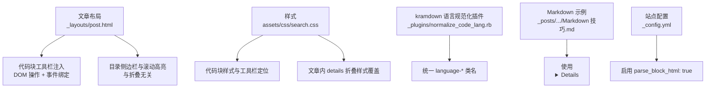
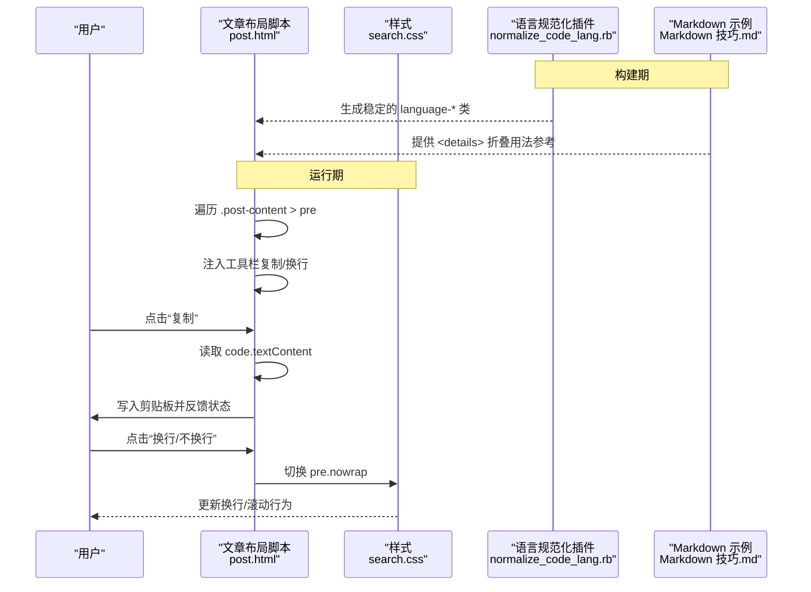
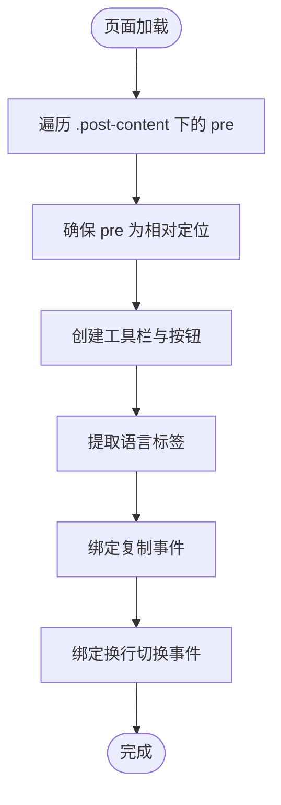
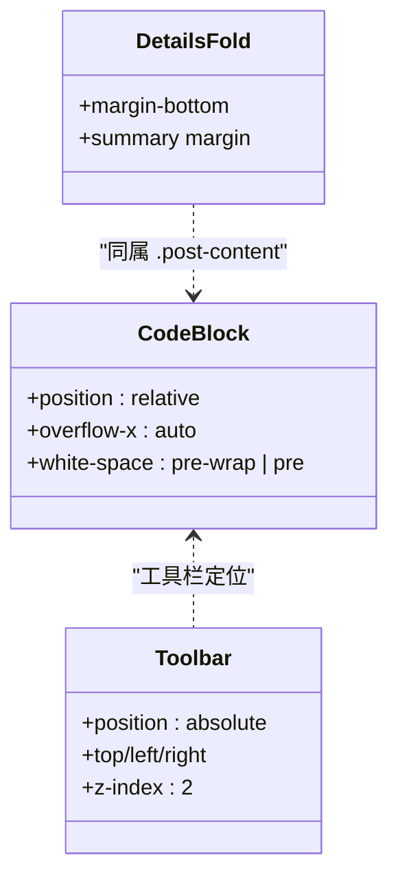
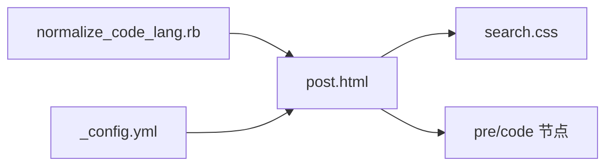

# 代码块折叠功能

<cite>
**本文引用的文件**   
- [post.html](file://_layouts/post.html)
- [search.css](file://assets/css/search.css)
- [normalize_code_lang.rb](file://_plugins/normalize_code_lang.rb)
- [Markdown 技巧.md](file://_posts/2019/2019-12-19-Markdown-技巧.md)
- [_config.yml](file://_config.yml)
</cite>

## 目录
1. [简介](#简介)
2. [项目结构](#项目结构)
3. [核心组件](#核心组件)
4. [架构总览](#架构总览)
5. [详细组件分析](#详细组件分析)
6. [依赖关系分析](#依赖关系分析)
7. [性能考虑](#性能考虑)
8. [故障排查指南](#故障排查指南)
9. [结论](#结论)
10. [附录](#附录)

## 简介
本文件围绕“代码块折叠”能力进行系统化说明。需要明确的是：当前仓库并未实现“超过20行自动折叠”的通用逻辑；现有实现提供两类与“折叠/收起”相关的体验：
- 文章内使用原生 
/
 的可折叠区域（由 Markdown 作者显式控制，常用于包裹长代码块）。
- 代码块工具栏中的“换行/不换行”切换按钮，用于改善长行阅读体验（非内容折叠）。

此外，仓库包含对 kramdown 语言标识符的规范化插件，有助于确保代码块渲染一致，从而为后续可能的折叠增强打下基础。

## 项目结构
与代码块折叠相关的关键位置如下：
- 文章布局脚本：在文章页加载后，为每个 <pre> 注入工具栏（复制、换行切换），并处理 DOM 操作与事件绑定。
- 样式文件：定义代码块外观、工具栏定位、以及文章内 details 折叠区域的样式覆盖。
- 插件：在构建阶段规范化围栏代码块的语言标识符，避免渲染异常。
- 文档示例：展示如何在 Markdown 中使用 
 折叠区域包裹代码块。
- 站点配置：启用 kramdown 解析 HTML 块，使 
 生效。

图表来源
- [post.html:115-193](file://_layouts/post.html#L115-L193)
- [search.css:104-162](file://assets/css/search.css#L104-L162)
- [search.css:847-854](file://assets/css/search.css#L847-L854)
- [normalize_code_lang.rb:1-41](file://_plugins/normalize_code_lang.rb#L1-L41)
- [Markdown 技巧.md:21-52](file://_posts/2019/2019-12-19-Markdown-技巧.md#L21-L52)
- [_config.yml:37-38](file://_config.yml#L37-L38)

章节来源
- [post.html:115-193](file://_layouts/post.html#L115-L193)
- [search.css:104-162](file://assets/css/search.css#L104-L162)
- [search.css:847-854](file://assets/css/search.css#L847-L854)
- [normalize_code_lang.rb:1-41](file://_plugins/normalize_code_lang.rb#L1-L41)
- [Markdown 技巧.md:21-52](file://_posts/2019/2019-12-19-Markdown-技巧.md#L21-L52)
- [_config.yml:37-38](file://_config.yml#L37-L38)

## 核心组件
- 文章布局脚本（post.html）
  - 遍历 .post-content 下的所有 <pre>，为其注入工具栏（复制、换行切换）。
  - 通过 classList.toggle 切换 nowrap 模式，配合 CSS 控制水平滚动或自动换行。
  - 使用 Clipboard API 完成复制反馈。
- 样式（search.css）
  - 代码块容器 pre 相对定位，工具栏绝对定位到顶部区域。
  - 默认代码块自动换行，添加 nowrap 时改为水平滚动。
  - 文章内 details 折叠区域样式覆盖，优化标题间距等。
- 语言规范化插件（normalize_code_lang.rb）
  - 在构建期修正 kramdown 语言标识符大小写与空格问题，保证 language-* 类名稳定，便于前端识别与扩展。
- Markdown 示例（Markdown 技巧.md）
  - 演示如何使用 
/
 包裹代码块，达到“手动折叠”的效果。
- 站点配置（_config.yml）
  - 启用 kramdown 的 parse_block_html，使 
 等 HTML 块在 Markdown 中生效。

章节来源
- [post.html:115-193](file://_layouts/post.html#L115-L193)
- [search.css:104-162](file://assets/css/search.css#L104-L162)
- [search.css:847-854](file://assets/css/search.css#L847-L854)
- [normalize_code_lang.rb:1-41](file://_plugins/normalize_code_lang.rb#L1-L41)
- [Markdown 技巧.md:21-52](file://_posts/2019/2019-12-19-Markdown-技巧.md#L21-L52)
- [_config.yml:37-38](file://_config.yml#L37-L38)

## 架构总览
从页面渲染到交互的整体流程如下：
- 构建期：kramdown 将 Markdown 转为 HTML，插件修正语言标识符，确保 code 外层存在稳定的 language-* 类。
- 运行期：文章布局脚本扫描 .post-content 下所有 <pre>，注入工具栏与事件监听。
- 交互期：用户点击“复制”调用剪贴板 API；点击“换行/不换行”切换 nowrap 类，CSS 控制显示行为。
- 可选：作者可在 Markdown 中使用 
 包裹代码块，实现“手动折叠”。

图表来源
- [post.html:115-193](file://_layouts/post.html#L115-L193)
- [search.css:104-162](file://assets/css/search.css#L104-L162)
- [normalize_code_lang.rb:1-41](file://_plugins/normalize_code_lang.rb#L1-L41)
- [Markdown 技巧.md:21-52](file://_posts/2019/2019-12-19-Markdown-技巧.md#L21-L52)

## 详细组件分析

### 组件A：文章布局脚本（代码块工具栏与换行切换）
- 职责
  - 为每个代码块注入工具栏（复制、换行切换）。
  - 提取语言类型并显示标签。
  - 处理复制与换行切换的用户交互。
- 关键实现要点
  - 选择器：.post-content pre。
  - 语言提取：优先在外层 wrapper 上查找 language-*，回退到 code 元素。
  - 复制：navigator.clipboard.writeText，成功后短暂切换图标与文案。
  - 换行：切换 pre 的 nowrap 类，同时切换按钮文案与激活态。
- 复杂度
  - 时间复杂度：O(N)，N 为页面中代码块数量。
  - 空间复杂度：O(1)，仅维护少量局部变量与 DOM 引用。
- 错误处理
  - 若 pre 未设置 position:relative，则临时设置为 relative，确保工具栏定位正确。
  - 复制失败场景：Clipboard API 可能受限，建议在实际使用中增加降级提示（当前实现未包含）。
- 可访问性
  - 按钮具备 aria-label 与 title，提升无障碍体验。

图表来源
- [post.html:115-193](file://_layouts/post.html#L115-L193)

章节来源
- [post.html:115-193](file://_layouts/post.html#L115-L193)

### 组件B：样式系统（代码块与折叠区域）
- 代码块样式
  - pre 相对定位，code 默认自动换行；添加 nowrap 后改为水平滚动。
  - 工具栏绝对定位在代码块顶部区域，z-index 保证不被遮挡。
- 折叠区域样式
  - 针对 .post-content details 的 summary 与整体间距进行覆盖，提升可读性。
- 移动端适配
  - 通过媒体查询调整目录侧边栏在小屏的宽度与按钮尺寸（与代码折叠无直接关联，但体现响应式策略）。

图表来源
- [search.css:104-162](file://assets/css/search.css#L104-L162)
- [search.css:847-854](file://assets/css/search.css#L847-L854)

章节来源
- [search.css:104-162](file://assets/css/search.css#L104-L162)
- [search.css:847-854](file://assets/css/search.css#L847-L854)

### 组件C：语言标识符规范化插件
- 作用
  - 在构建期修正 kramdown 语言标识符的大小写与空格，确保 language-* 类名稳定。
- 影响
  - 有利于前端脚本准确识别语言，并为未来基于语言的折叠策略提供可靠依据。
- 边界情况
  - 有序列表内的代码块会被自动转为 ~~~ 标记，避免语法冲突。

章节来源
- [normalize_code_lang.rb:1-41](file://_plugins/normalize_code_lang.rb#L1-L41)

### 组件D：Markdown 折叠示例与配置
- 示例
  - 使用 
/
 包裹代码块，实现“手动折叠”。
- 配置
  - 在 _config.yml 中启用 kramdown 的 parse_block_html: true，使 
 生效。

章节来源
- [Markdown 技巧.md:21-52](file://_posts/2019/2019-12-19-Markdown-技巧.md#L21-L52)
- [_config.yml:37-38](file://_config.yml#L37-L38)

## 依赖关系分析
- 运行时依赖
  - post.html 脚本依赖 .post-content 结构与 pre/code 节点。
  - search.css 提供必要的样式支持（nowrap、工具栏定位、details 样式）。
- 构建期依赖
  - normalize_code_lang.rb 影响最终生成的 language-* 类名，间接影响前端语言标签显示与可扩展性。
- 潜在耦合点
  - 若主题或第三方脚本修改了 .post-content 的结构或 pre 的类名，可能导致脚本失效。
  - 若浏览器不支持 Clipboard API，复制功能会失败（需降级处理）。

图表来源
- [post.html:115-193](file://_layouts/post.html#L115-L193)
- [search.css:104-162](file://assets/css/search.css#L104-L162)
- [normalize_code_lang.rb:1-41](file://_plugins/normalize_code_lang.rb#L1-L41)
- [_config.yml:37-38](file://_config.yml#L37-L38)

章节来源
- [post.html:115-193](file://_layouts/post.html#L115-L193)
- [search.css:104-162](file://assets/css/search.css#L104-L162)
- [normalize_code_lang.rb:1-41](file://_plugins/normalize_code_lang.rb#L1-L41)
- [_config.yml:37-38](file://_config.yml#L37-L38)

## 性能考虑
- 当前实现不涉及“按行数自动折叠”，因此不存在“超过20行自动折叠”的性能开销。
- 现有脚本的时间复杂度为 O(N)，N 为代码块数量，通常较小，对页面性能影响有限。
- 复制操作使用异步剪贴板 API，不会阻塞主线程。
- 换行切换仅切换类名，触发重排范围小，性能良好。

[本节为通用指导，不直接分析具体文件]

## 故障排查指南
- 工具栏未出现
  - 检查 .post-content 是否存在，且包含 pre 节点。
  - 确认 search.css 是否被正确引入，nowrap 与工具栏定位样式是否生效。
- 复制失败
  - 某些环境（如 HTTP 或非安全上下文）可能限制 Clipboard API，需改用旧版 document.execCommand('copy') 降级方案。
- 语言标签不正确
  - 确认 kramdown 已启用，且 normalize_code_lang.rb 插件正常工作。
- 
 折叠无效
  - 确认 _config.yml 中已启用 parse_block_html: true。
  - 检查 Markdown 中是否正确书写 
/
。

章节来源
- [post.html:115-193](file://_layouts/post.html#L115-L193)
- [search.css:104-162](file://assets/css/search.css#L104-L162)
- [normalize_code_lang.rb:1-41](file://_plugins/normalize_code_lang.rb#L1-L41)
- [_config.yml:37-38](file://_config.yml#L37-L38)

## 结论
- 当前仓库未实现“超过20行自动折叠”的功能；提供的折叠能力主要依赖 Markdown 的 
 手动折叠。
- 代码块工具栏提供了复制与换行切换，显著改善长代码阅读体验。
- 语言规范化插件为后续基于语言的增强（包括自动折叠）奠定了稳定基础。
- 如需实现“超过20行自动折叠”，建议在 post.html 脚本中新增行数统计与折叠逻辑，并结合 CSS 过渡动画与 IntersectionObserver 优化性能。

[本节为总结性内容，不直接分析具体文件]

## 附录

### 自定义折叠阈值与扩展开发指南（概念性方案）
- 目标
  - 当代码块行数超过阈值（例如20行）时，默认折叠，并提供“展开/收起”按钮。
- 实现思路
  - 在 post.html 脚本中，遍历 .post-content > pre，计算 code 的行数（按换行符分割）。
  - 若行数大于阈值，则：
    - 将代码内容拆分为“可见部分”和“隐藏部分”。
    - 插入一个“展开/收起”按钮，点击时切换隐藏部分的 display 或 max-height。
    - 使用 CSS transition 实现平滑展开/收起效果。
  - 使用 IntersectionObserver 仅在可视区域内执行复杂操作，减少首屏开销。
- 配置化
  - 可通过全局变量或 data 属性暴露阈值，便于在不同页面或不同语言下差异化配置。
- 兼容性
  - 对于不支持现代 API 的环境，提供降级方案（如直接显示全部代码）。
- 可访问性
  - 为“展开/收起”按钮添加 aria-expanded 与 aria-controls，确保屏幕阅读器可用。

[本节为概念性指导，不直接分析具体文件]