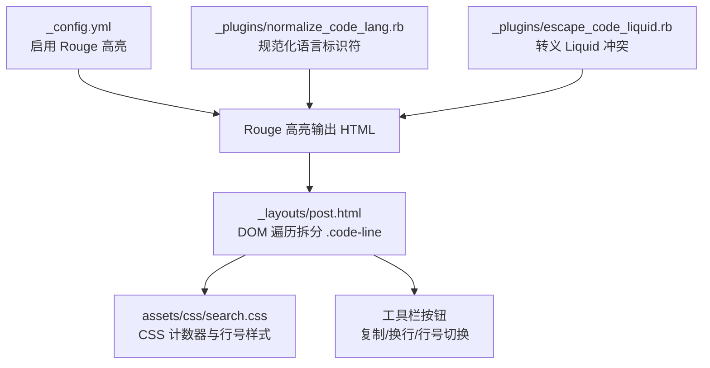
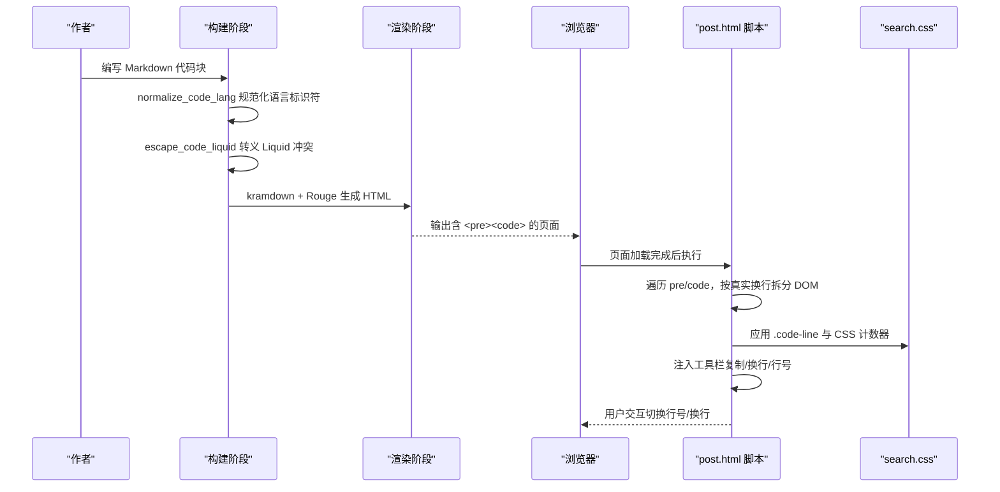
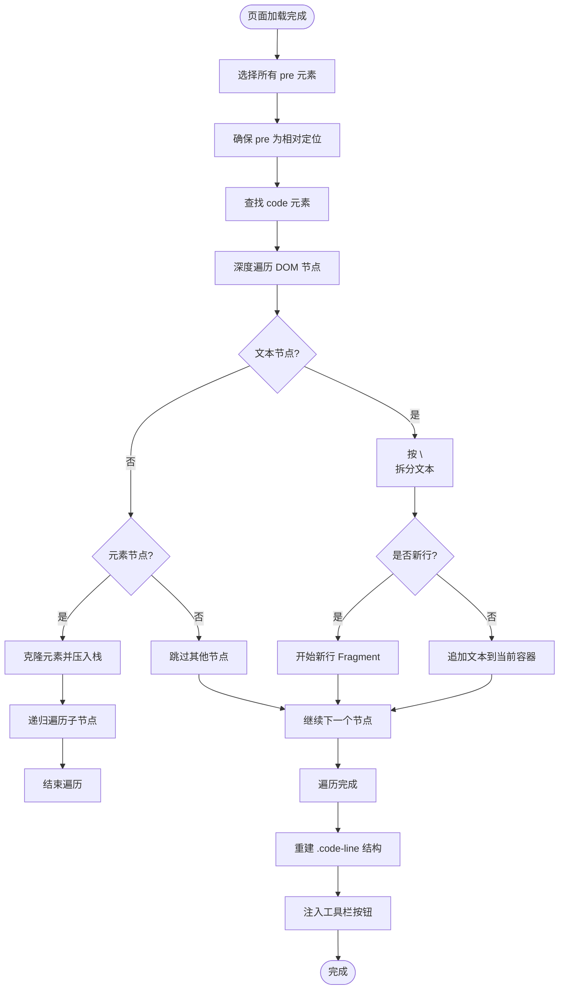
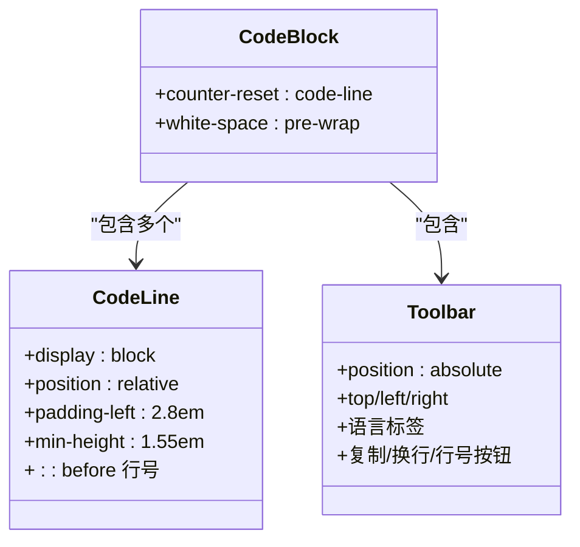
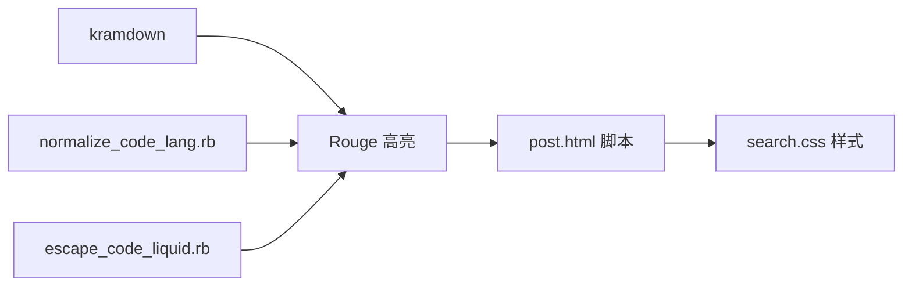

# 代码块行号功能

<cite>
**本文引用的文件**   
- [_config.yml](file://_config.yml)
- [Gemfile](file://Gemfile)
- [_layouts/post.html](file://_layouts/post.html)
- [assets/css/search.css](file://assets/css/search.css)
- [_plugins/escape_code_liquid.rb](file://_plugins/escape_code_liquid.rb)
- [_plugins/normalize_code_lang.rb](file://_plugins/normalize_code_lang.rb)
</cite>

## 目录
1. [简介](#简介)
2. [项目结构](#项目结构)
3. [核心组件](#核心组件)
4. [架构总览](#架构总览)
5. [详细组件分析](#详细组件分析)
6. [依赖关系分析](#依赖关系分析)
7. [性能考量](#性能考量)
8. [故障排查指南](#故障排查指南)
9. [结论](#结论)

## 简介
本仓库为基于 Jekyll + Minima 主题的博客站点，重点实现了“代码块行号”能力：在文章渲染后，通过前端脚本将语法高亮后的代码按真实换行拆分为独立行元素，配合 CSS 计数器生成行号；并提供工具栏按钮用于切换行号显示、切换自动换行与复制代码。该实现不依赖服务端插件生成行号，而是以轻量级客户端方案完成，兼容 Rouge 高亮输出，且不影响复制行为。

## 项目结构
与代码块行号相关的核心位置如下：
- 构建配置：启用 Rouge 作为代码高亮器
- 文章布局：页面加载后对每个代码块进行 DOM 处理，注入行号结构与工具栏
- 样式定义：CSS 计数器与行号样式、工具栏样式、隐藏行号模式等
- 预处理插件：规范化语言标识符、转义 Liquid 冲突，保障代码块正确渲染

图表来源
- [_config.yml:36-38](file://_config.yml#L36-L38)
- [_layouts/post.html:128-273](file://_layouts/post.html#L128-L273)
- [assets/css/search.css:172-213](file://assets/css/search.css#L172-L213)
- [_plugins/normalize_code_lang.rb:1-41](file://_plugins/normalize_code_lang.rb#L1-L41)
- [_plugins/escape_code_liquid.rb:1-61](file://_plugins/escape_code_liquid.rb#L1-L61)

章节来源
- [_config.yml:36-38](file://_config.yml#L36-L38)
- [_layouts/post.html:128-273](file://_layouts/post.html#L128-L273)
- [assets/css/search.css:172-213](file://assets/css/search.css#L172-L213)
- [_plugins/normalize_code_lang.rb:1-41](file://_plugins/normalize_code_lang.rb#L1-L41)
- [_plugins/escape_code_liquid.rb:1-61](file://_plugins/escape_code_liquid.rb#L1-L61)

## 核心组件
- 高亮器与 Markdown 引擎
  - 使用 kramdown 解析 Markdown，Rouge 进行语法高亮，输出带 language-* 类的代码块结构。
- 预处理插件
  - 规范化语言标识符（如大小写、空格），确保高亮器识别到正确的语言。
  - 转义代码中的 Liquid 语法冲突，避免 {{ }} 被提前解析。
- 前端行号与工具栏
  - 页面加载后遍历所有 pre.code 块，按真实换行拆分 DOM，包裹为 .code-line 节点，供 CSS 计数器计数。
  - 注入工具栏按钮：复制代码、切换自动换行、切换行号显示。
- 样式系统
  - 使用 CSS 计数器生成行号，伪元素定位在左侧 padding 区域，支持隐藏行号模式。

章节来源
- [_config.yml:36-38](file://_config.yml#L36-L38)
- [_plugins/normalize_code_lang.rb:1-41](file://_plugins/normalize_code_lang.rb#L1-L41)
- [_plugins/escape_code_liquid.rb:1-61](file://_plugins/escape_code_liquid.rb#L1-L61)
- [_layouts/post.html:128-273](file://_layouts/post.html#L128-L273)
- [assets/css/search.css:172-213](file://assets/css/search.css#L172-L213)

## 架构总览
整体流程从构建期到运行期分为三个阶段：
- 构建期：Markdown 经 kramdown 解析，Rouge 高亮生成 HTML；预处理插件修正语言标识符与 Liquid 冲突。
- 渲染期：Jekyll 输出包含高亮代码的页面。
- 运行期：浏览器加载页面后，post.html 中的脚本对代码块进行 DOM 改造，添加行号与工具栏。

图表来源
- [_plugins/normalize_code_lang.rb:1-41](file://_plugins/normalize_code_lang.rb#L1-L41)
- [_plugins/escape_code_liquid.rb:1-61](file://_plugins/escape_code_liquid.rb#L1-L61)
- [_layouts/post.html:128-273](file://_layouts/post.html#L128-L273)
- [assets/css/search.css:172-213](file://assets/css/search.css#L172-L213)

## 详细组件分析

### 构建期：高亮与预处理
- 高亮器配置
  - 在站点配置中启用 Rouge 作为高亮器，kramdown 负责 Markdown 解析。
- 语言标识符规范化
  - 插件在渲染前对围栏代码块的语言标识符进行归一化，包括大小写与空格处理，提升 Rouge 识别成功率。
- Liquid 冲突转义
  - 插件在渲染前对代码块中的 {{ }} 进行保护，避免 Liquid 提前解析导致内容丢失或错误。

章节来源
- [_config.yml:36-38](file://_config.yml#L36-L38)
- [_plugins/normalize_code_lang.rb:1-41](file://_plugins/normalize_code_lang.rb#L1-L41)
- [_plugins/escape_code_liquid.rb:1-61](file://_plugins/escape_code_liquid.rb#L1-L61)

### 运行期：DOM 拆分与行号注入
- 目标元素
  - 选择文章正文内的所有 pre 元素，确保其具有相对定位以便工具栏绝对定位。
- 行拆分策略
  - 深度遍历 code 子树，遇到文本节点时按 \n 拆分，每段文本放入新的 DocumentFragment；遇到元素节点时克隆并维护栈结构，保证语法高亮的 span 层级完整保留。
- 重建结构
  - 清空原 code 内容，逐行创建 .code-line 包裹对应片段，并在非最后一行末尾追加 \n，以保证复制时保留真实换行。
- 工具栏注入
  - 在每个 pre 内插入工具栏，包含语言标签、复制按钮、换行切换按钮、行号切换按钮。
  - 复制逻辑读取 code 的 textContent，写入剪贴板并给出成功反馈。
  - 换行切换通过给 pre 添加 nowrap 类控制 white-space 行为。
  - 行号切换通过给 pre 添加 no-line-numbers 类控制 CSS 显示。

图表来源
- [_layouts/post.html:128-273](file://_layouts/post.html#L128-L273)

章节来源
- [_layouts/post.html:128-273](file://_layouts/post.html#L128-L273)

### 样式层：CSS 计数器与行号
- 计数器初始化
  - 在 pre > code 上重置计数器，使每个代码块独立计数。
- 行号生成
  - 为 .code-line 设置相对定位与左内边距，::before 伪元素使用 counter(code-line) 生成行号，绝对定位在左侧，右边界分隔线区分行号区与代码区。
- 隐藏行号模式
  - 当 pre 拥有 no-line-numbers 类时，移除 .code-line 的左内边距并隐藏 ::before 行号。
- 工具栏样式
  - 工具栏绝对定位在代码块顶部，包含语言标签与操作按钮，提供悬停与激活态样式。

图表来源
- [assets/css/search.css:172-213](file://assets/css/search.css#L172-L213)
- [assets/css/search.css:215-283](file://assets/css/search.css#L215-L283)

章节来源
- [assets/css/search.css:172-213](file://assets/css/search.css#L172-L213)
- [assets/css/search.css:215-283](file://assets/css/search.css#L215-L283)

## 依赖关系分析
- 构建期依赖
  - kramdown 解析 Markdown，Rouge 生成高亮 HTML。
  - 预处理插件在渲染前修改内容，影响最终高亮结果。
- 运行期依赖
  - post.html 脚本依赖浏览器 DOM API 与剪贴板 API。
  - search.css 提供行号与工具栏样式，no-line-numbers 类控制行号显示。

图表来源
- [_config.yml:36-38](file://_config.yml#L36-L38)
- [_plugins/normalize_code_lang.rb:1-41](file://_plugins/normalize_code_lang.rb#L1-L41)
- [_plugins/escape_code_liquid.rb:1-61](file://_plugins/escape_code_liquid.rb#L1-L61)
- [_layouts/post.html:128-273](file://_layouts/post.html#L128-L273)
- [assets/css/search.css:172-213](file://assets/css/search.css#L172-L213)

章节来源
- [_config.yml:36-38](file://_config.yml#L36-L38)
- [_plugins/normalize_code_lang.rb:1-41](file://_plugins/normalize_code_lang.rb#L1-L41)
- [_plugins/escape_code_liquid.rb:1-61](file://_plugins/escape_code_liquid.rb#L1-L61)
- [_layouts/post.html:128-273](file://_layouts/post.html#L128-L273)
- [assets/css/search.css:172-213](file://assets/css/search.css#L172-L213)

## 性能考量
- DOM 遍历复杂度
  - 脚本对每个代码块进行深度遍历，时间复杂度近似 O(N)，N 为代码块节点总数。对于超长代码块，建议合理分段或限制单篇文章代码块数量。
- 复制性能
  - 使用 textContent 获取纯文本，避免复杂 DOM 序列化，复制性能较好。
- 样式重排
  - 行号切换仅通过类名切换，利用 CSS 计数器与伪元素，重排开销较小。
- 换行切换
  - 通过 white-space 属性切换，浏览器优化良好，无明显性能问题。

[本节为通用指导，无需具体文件引用]

## 故障排查指南
- 行号未显示
  - 检查 pre 是否具备 no-line-numbers 类；若有则移除。
  - 确认 search.css 已加载且未被覆盖。
- 行号错位或重叠
  - 检查 .code-line 的 padding-left 与 ::before 宽度是否被自定义样式覆盖。
  - 确认代码块未嵌套异常结构，保持 Rouge 输出的标准层级。
- 复制内容缺少换行
  - 确认脚本已将 \n 附加到 .code-line 内部；若手动修改过脚本需恢复。
- 语言标签不正确
  - 检查 normalize_code_lang 插件是否正确归一化语言标识符；必要时扩展映射表。
- Liquid 冲突导致代码缺失
  - 确认 escape_code_liquid 插件已启用，代码块中的 {{ }} 已被  保护。

章节来源
- [_plugins/normalize_code_lang.rb:1-41](file://_plugins/normalize_code_lang.rb#L1-L41)
- [_plugins/escape_code_liquid.rb:1-61](file://_plugins/escape_code_liquid.rb#L1-L61)
- [_layouts/post.html:128-273](file://_layouts/post.html#L128-L273)
- [assets/css/search.css:172-213](file://assets/css/search.css#L172-L213)

## 结论
本项目通过“构建期预处理 + 运行期 DOM 改造 + CSS 计数器”的组合方式，实现了稳定、可交互的代码块行号功能。该方案不侵入服务端渲染逻辑，易于维护与扩展，同时兼顾了用户体验（复制、换行、行号切换）与性能表现。后续可根据需要扩展更多工具栏功能或优化超大代码块的渲染体验。