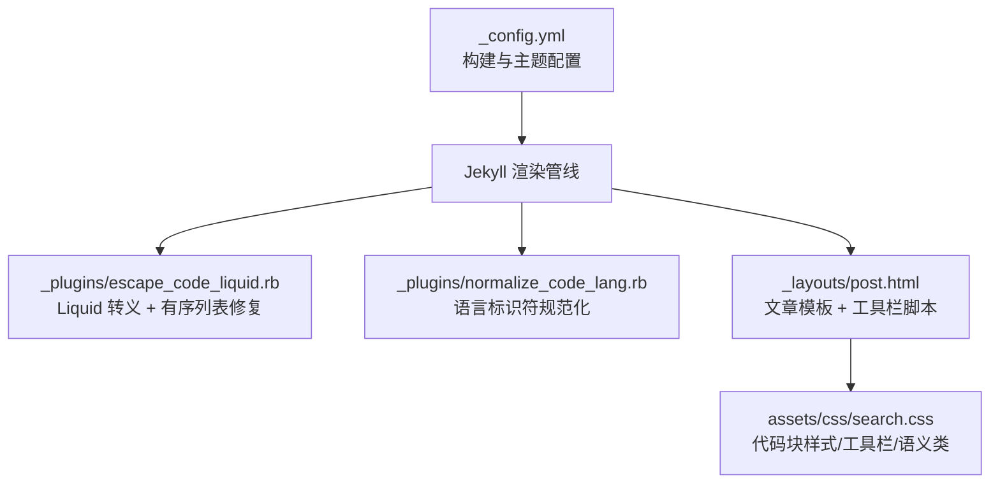
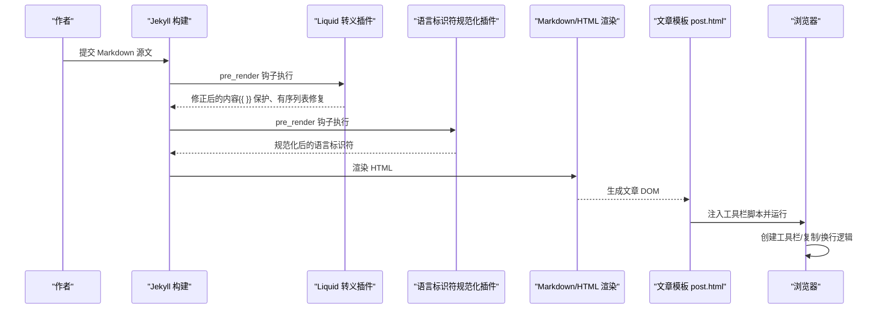
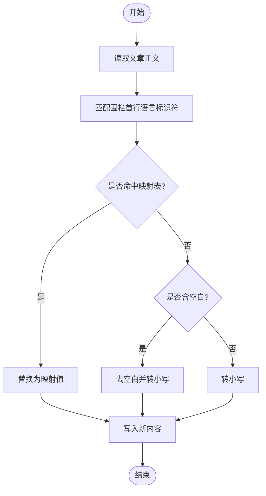
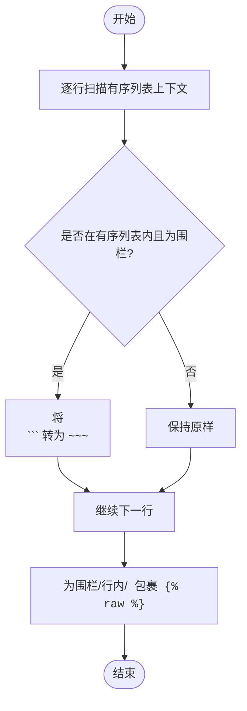
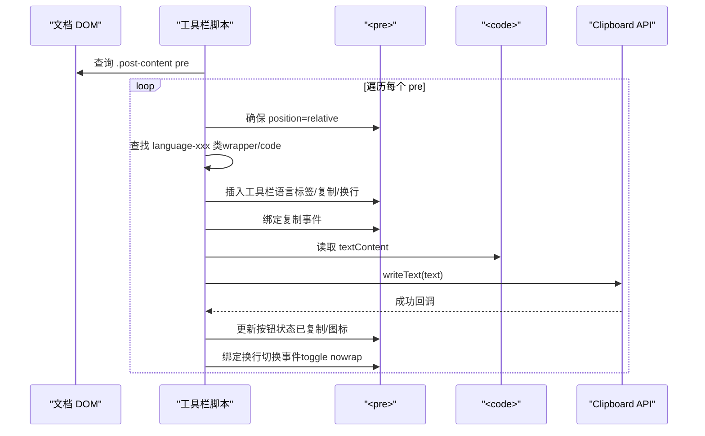
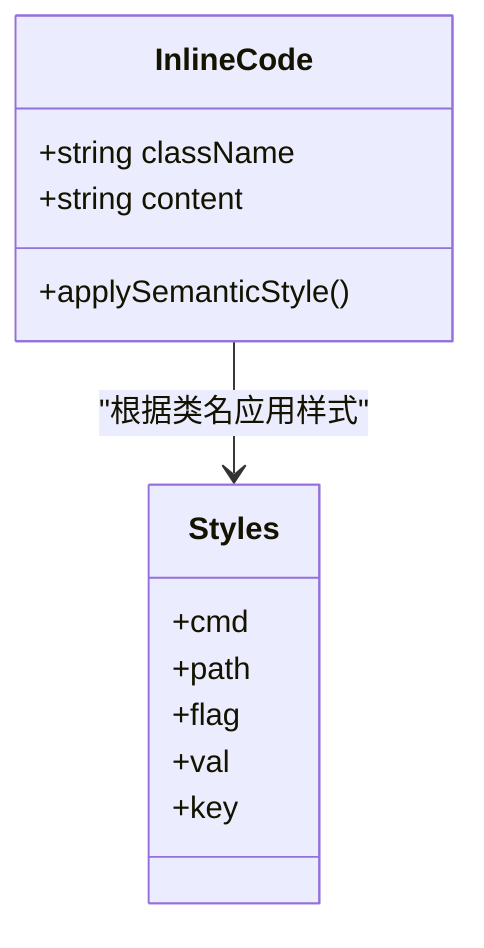
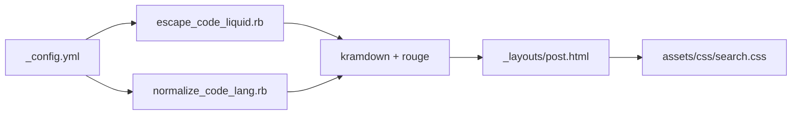

# 代码展示增强

<cite>
**本文引用的文件**   
- [_config.yml](file://_config.yml)
- [escape_code_liquid.rb](file://_plugins/escape_code_liquid.rb)
- [normalize_code_lang.rb](file://_plugins/normalize_code_lang.rb)
- [post.html](file://_layouts/post.html)
- [search.css](file://assets/css/search.css)
- [README.md](file://README.md)
</cite>

## 目录
1. [简介](#简介)
2. [项目结构](#项目结构)
3. [核心组件](#核心组件)
4. [架构总览](#架构总览)
5. [详细组件分析](#详细组件分析)
6. [依赖关系分析](#依赖关系分析)
7. [性能考量](#性能考量)
8. [故障排查指南](#故障排查指南)
9. [结论](#结论)
10. [附录](#附录)

## 简介
本文件聚焦于博客的“代码展示增强”能力，系统性说明以下方面：
- 代码块折叠（超过 20 行自动折叠）的实现思路与现状
- 语法高亮的配置与优化路径
- 代码复制工具栏的实现细节与交互流程
- 行内代码语义化样式系统（.cmd、.path、.flag、.val、.key）的视觉效果与使用场景
- 代码语言标签的自动识别与标准化处理
- 代码块的工具栏功能、换行控制选项与跨浏览器兼容性处理
- 自定义方法与性能优化技巧

## 项目结构
围绕代码展示增强的关键位置如下：
- 站点构建与渲染配置：_config.yml
- Jekyll 插件层（预处理阶段）：_plugins/escape_code_liquid.rb、_plugins/normalize_code_lang.rb
- 文章页模板与运行时脚本：_layouts/post.html
- 前端样式与交互：assets/css/search.css
- 特性说明与用法参考：README.md



**图表来源** 
- [_config.yml:1-45](file://_config.yml#L1-L45)
- [escape_code_liquid.rb:1-62](file://_plugins/escape_code_liquid.rb#L1-L62)
- [normalize_code_lang.rb:1-42](file://_plugins/normalize_code_lang.rb#L1-L42)
- [post.html:115-193](file://_layouts/post.html#L115-L193)
- [search.css:104-268](file://assets/css/search.css#L104-L268)

**章节来源**
- [_config.yml:1-45](file://_config.yml#L1-L45)
- [README.md:1-331](file://README.md#L1-L331)

## 核心组件
- 语言标识符规范化插件：在渲染前将不规范的代码语言标记统一为 kramdown/Rouge 可识别的小写形式，并支持常见别名映射。
- Liquid 转义插件：在 Liquid 渲染前对围栏代码块和行内代码中的 {{ }} 进行保护，避免被误解析；同时修复有序列表内的围栏代码块缩进问题。
- 文章页工具栏脚本：为每个 <pre> 动态注入工具栏，包含语言标签、复制按钮、换行切换按钮，并提供状态反馈。
- 样式体系：定义代码块默认换行、nowrap 模式、工具栏布局、语言标签、语义化行内代码样式等。

**章节来源**
- [normalize_code_lang.rb:1-42](file://_plugins/normalize_code_lang.rb#L1-L42)
- [escape_code_liquid.rb:1-62](file://_plugins/escape_code_liquid.rb#L1-L62)
- [post.html:115-193](file://_layouts/post.html#L115-L193)
- [search.css:104-268](file://assets/css/search.css#L104-L268)

## 架构总览
从内容到页面的数据流如下：



**图表来源** 
- [escape_code_liquid.rb:1-62](file://_plugins/escape_code_liquid.rb#L1-L62)
- [normalize_code_lang.rb:1-42](file://_plugins/normalize_code_lang.rb#L1-L42)
- [post.html:115-193](file://_layouts/post.html#L115-L193)

## 详细组件分析

### 语言标识符自动识别与标准化
- 目标：解决 kramdown 不支持含空格或大小写不规范的语言标识符导致的高亮失效问题。
- 策略：
  - 预置映射表：如 "Plain Text" → "text"、"C++" → "cpp" 等。
  - 含空白的标识符：去除空白并转小写。
  - 其余一律转小写，确保 Rouge 正确匹配。
- 结果：无论作者使用何种写法，最终都会输出规范化的 language-xxx 类名，供后续工具栏提取显示。



**图表来源** 
- [normalize_code_lang.rb:1-42](file://_plugins/normalize_code_lang.rb#L1-L42)

**章节来源**
- [normalize_code_lang.rb:1-42](file://_plugins/normalize_code_lang.rb#L1-L42)

### Liquid 转义与有序列表修复
- 目标：
  - 防止代码中的 {{ }} 被 Liquid 提前解析。
  - 修复有序列表项内缩进的 ``` 围栏被当作普通代码块的问题。
- 策略：
  - 有序列表上下文检测：将缩进的 ``` 围栏转换为 ~~~，避免 kramdown 解析差异。
  - 围栏代码块整体包裹 ...。
  - 行内反引号与 HTML <code> 中的 {{ }} 分别包裹 。
- 效果：写作时无需手动处理冲突，构建后代码原样保留。



**图表来源** 
- [escape_code_liquid.rb:1-62](file://_plugins/escape_code_liquid.rb#L1-L62)

**章节来源**
- [escape_code_liquid.rb:1-62](file://_plugins/escape_code_liquid.rb#L1-L62)

### 代码块工具栏（复制 + 换行 + 语言标签）
- 触发时机：页面加载完成后，遍历 .post-content 下的所有 <pre>。
- 行为：
  - 语言标签：优先从外层 wrapper 的 language-xxx 类中解析，回退到 <code> 元素自身；未识别时显示 text。
  - 复制按钮：通过 Clipboard API 复制文本，成功时给出视觉反馈并在 1.5s 后恢复。
  - 换行切换：在 <pre> 上切换 nowrap 类，配合 CSS 实现“默认换行 / 点击后水平滚动”。
- 兼容性与健壮性：
  - 若 <pre> 定位非相对，则临时设为 relative，保证工具栏绝对定位正常。
  - 使用 aria-label 提升无障碍体验。



**图表来源** 
- [post.html:115-193](file://_layouts/post.html#L115-L193)

**章节来源**
- [post.html:115-193](file://_layouts/post.html#L115-L193)

### 行内代码语义化样式系统
- 设计目标：在不影响标准 Markdown 预览的前提下，为特定语义的行内代码提供差异化视觉提示。
- 语义类与用途：
  - .cmd：命令（如 docker、git、npm），强调色加粗。
  - .path：文件路径，暖色调。
  - .flag：参数/选项，橙色系。
  - .val：值（IP、端口、字符串），绿色系。
  - .key：按键（Ctrl+C、Enter、Tab），仿键盘键帽样式。
- 暗色模式适配：针对 path、flag、val 等类提供暗色配色。



**图表来源** 
- [search.css:216-268](file://assets/css/search.css#L216-L268)

**章节来源**
- [search.css:216-268](file://assets/css/search.css#L216-L268)

### 代码块折叠（超过 20 行自动折叠）
- 现状说明：
  - README 明确列出“代码块折叠 — 超过 20 行的代码块自动折叠”作为特性之一。
  - 当前仓库未发现直接实现该功能的 JS/CSS 片段。
- 建议实现方案（概念性）：
  - 在工具栏脚本初始化阶段统计每段 <pre><code> 的行数。
  - 当行数 > 20 时，将 <pre> 包裹进 <details><summary>...</summary></details> 结构，默认关闭。
  - 在 summary 中显示“展开/收起”提示，并保持现有工具栏可见。
  - 注意：此方案为概念性建议，尚未在源码中落地。

[本节为概念性说明，不涉及具体源码文件]

## 依赖关系分析
- 构建期依赖：
  - _config.yml 指定 markdown 引擎为 kramdown，highlighter 为 rouge。
  - 两个 Jekyll 插件在 posts 的 pre_render 钩子中执行，顺序为：先 Liquid 转义，再语言标识符规范化。
- 运行期依赖：
  - 文章模板 post.html 在页面加载后注入工具栏脚本，依赖浏览器 DOM API 与 Clipboard API。
  - 样式由 search.css 提供，覆盖 Minima 默认样式。



**图表来源** 
- [_config.yml:36-38](file://_config.yml#L36-L38)
- [escape_code_liquid.rb:1-62](file://_plugins/escape_code_liquid.rb#L1-L62)
- [normalize_code_lang.rb:1-42](file://_plugins/normalize_code_lang.rb#L1-L42)
- [post.html:115-193](file://_layouts/post.html#L115-L193)
- [search.css:104-268](file://assets/css/search.css#L104-L268)

**章节来源**
- [_config.yml:36-38](file://_config.yml#L36-L38)
- [escape_code_liquid.rb:1-62](file://_plugins/escape_code_liquid.rb#L1-L62)
- [normalize_code_lang.rb:1-42](file://_plugins/normalize_code_lang.rb#L1-L42)
- [post.html:115-193](file://_layouts/post.html#L115-L193)
- [search.css:104-268](file://assets/css/search.css#L104-L268)

## 性能考量
- 构建期：
  - 正则替换与字符串拼接在文章量较大时可能带来额外开销，建议仅在必要字段上使用钩子，并尽量减少多次 gsub。
- 运行期：
  - 工具栏脚本仅遍历 .post-content 下的 <pre>，复杂度 O(n)，n 为代码块数量。
  - Clipboard API 调用为异步操作，应避免频繁重复触发。
  - 默认换行（white-space: pre-wrap）可减少横向滚动，但在超长单行场景下仍建议使用 nowrap 模式。

[本节为通用指导，不涉及具体源码文件]

## 故障排查指南
- 代码块高亮异常：
  - 检查语言标识符是否被规范化为小写，确认 Rouge 支持该语言。
  - 参考：语言标识符规范化插件。
- 代码中出现 {{ }} 被解析报错：
  - 确认 Liquid 转义插件已生效，围栏与行内代码均被  包裹。
  - 参考：Liquid 转义插件。
- 工具栏不可见或错位：
  - 检查 <pre> 是否为相对定位；脚本会在必要时设置为 relative。
  - 检查 CSS 是否被覆盖。
- 复制失败：
  - 某些环境需要 HTTPS 或用户手势触发；确保在点击事件中调用 Clipboard API。
- 换行切换无效：
  - 确认 .nowrap 类存在并被 CSS 规则正确覆盖 white-space。

**章节来源**
- [escape_code_liquid.rb:1-62](file://_plugins/escape_code_liquid.rb#L1-L62)
- [normalize_code_lang.rb:1-42](file://_plugins/normalize_code_lang.rb#L1-L42)
- [post.html:115-193](file://_layouts/post.html#L115-L193)
- [search.css:135-144](file://assets/css/search.css#L135-L144)

## 结论
本项目通过“插件预处理 + 模板脚本 + 样式覆盖”的组合，实现了：
- 语言标识符的自动规范化，保障高亮稳定；
- 代码中 Liquid 语法的自动转义，提升写作体验；
- 代码块工具栏（语言标签、复制、换行切换）与语义化行内代码样式；
- 默认换行与 nowrap 模式的灵活切换，兼顾可读性与完整性。

对于“超过 20 行自动折叠”的特性，建议在现有工具栏脚本基础上扩展折叠逻辑，以保持统一的交互风格与可维护性。

[本节为总结性内容，不涉及具体源码文件]

## 附录
- 配置入口：_config.yml 中设置 markdown 与 highlighter。
- 插件入口：_plugins 下的两个 Ruby 文件分别在 pre_render 阶段工作。
- 模板入口：_layouts/post.html 负责注入工具栏脚本。
- 样式入口：assets/css/search.css 提供代码相关样式。

**章节来源**
- [_config.yml:36-38](file://_config.yml#L36-L38)
- [escape_code_liquid.rb:1-62](file://_plugins/escape_code_liquid.rb#L1-L62)
- [normalize_code_lang.rb:1-42](file://_plugins/normalize_code_lang.rb#L1-L42)
- [post.html:115-193](file://_layouts/post.html#L115-L193)
- [search.css:104-268](file://assets/css/search.css#L104-L268)