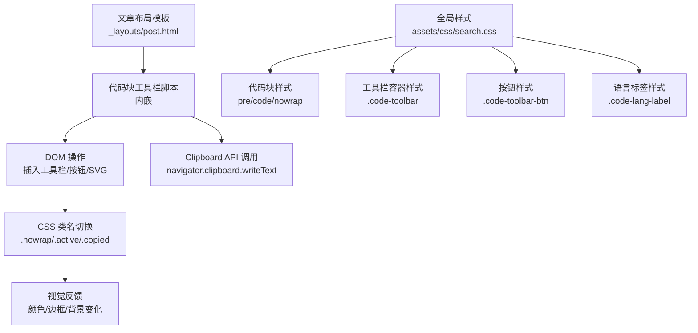
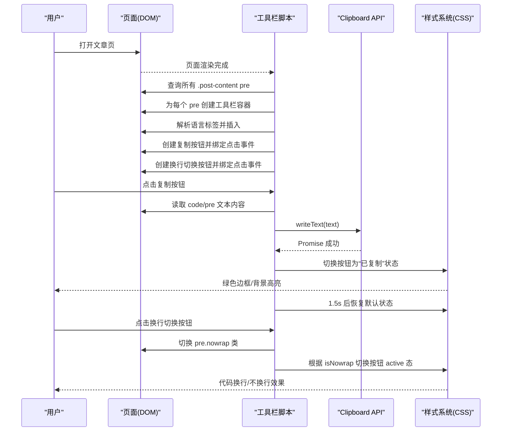
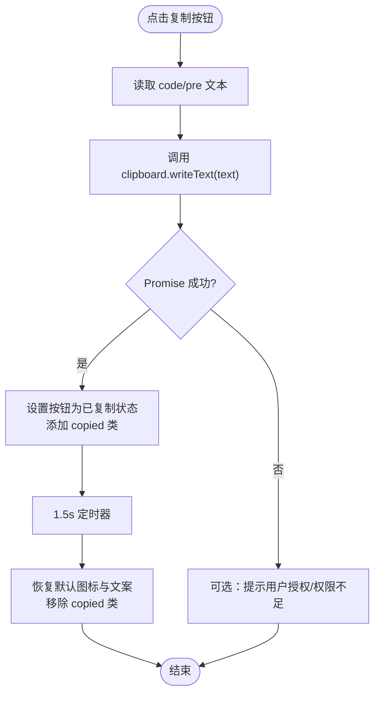
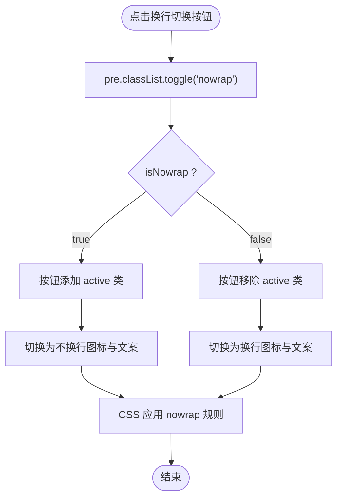
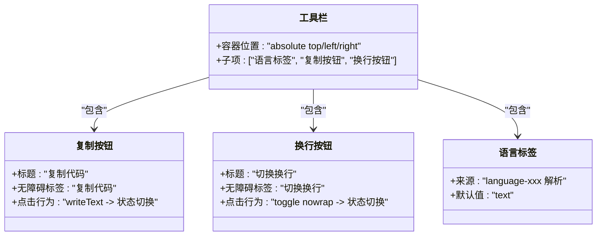
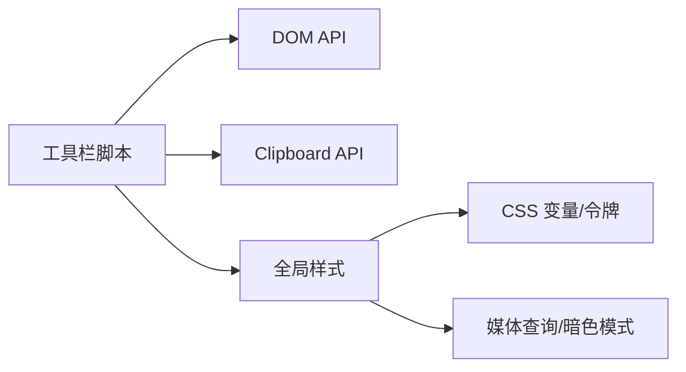

# 代码工具栏功能

<cite>
**本文引用的文件**
- [post.html](file://_layouts/post.html)
- [search.css](file://assets/css/search.css)
</cite>

## 目录
1. [简介](#简介)
2. [项目结构](#项目结构)
3. [核心组件](#核心组件)
4. [架构总览](#架构总览)
5. [详细组件分析](#详细组件分析)
6. [依赖关系分析](#依赖关系分析)
7. [性能与体验优化](#性能与体验优化)
8. [故障排查指南](#故障排查指南)
9. [结论](#结论)
10. [附录：扩展与集成](#附录扩展与集成)

## 简介
本章节聚焦于“代码块工具栏”功能的实现与使用，包括复制按钮、换行切换、SVG 图标、按钮状态反馈、样式控制机制、跨浏览器兼容性与移动端适配策略，并提供自定义扩展与第三方库集成的方法。该功能通过页面脚本在文章页渲染后动态注入到每个代码块中，提供语言标签、复制与换行切换两个操作按钮，配合 CSS 变量体系与响应式规则，确保在不同主题与设备上的良好表现。

## 项目结构
代码工具栏由两部分组成：
- 逻辑层：在文章布局模板中内嵌的脚本，负责扫描代码块、创建工具栏 DOM、绑定交互事件。
- 表现层：全局样式文件中对代码块、工具栏、按钮、语言标签以及暗色模式的样式定义。

图表来源
- [post.html:115-193](file://_layouts/post.html#L115-L193)
- [search.css:146-214](file://assets/css/search.css#L146-L214)

章节来源
- [post.html:115-193](file://_layouts/post.html#L115-L193)
- [search.css:146-214](file://assets/css/search.css#L146-L214)

## 核心组件
- 工具栏容器：绝对定位在代码块顶部区域，包含语言标签和两个按钮（复制、换行）。
- 复制按钮：基于 Clipboard API 写入剪贴板，成功后切换图标与文案并添加临时状态类。
- 换行切换按钮：通过切换父级 pre 的 nowrap 类控制 white-space 行为，同时更新按钮激活态与文案。
- SVG 图标：以字符串形式内联，避免额外资源请求，支持 stroke-width 与currentColor 继承。
- 语言标签：从外层包装或 code 元素解析 language-xxx 类，若无则显示 text。

章节来源
- [post.html:115-193](file://_layouts/post.html#L115-L193)
- [search.css:146-214](file://assets/css/search.css#L146-L214)

## 架构总览
下图展示了工具栏从页面加载到用户交互的完整流程，包括 DOM 注入、事件绑定、API 调用与样式反馈。

图表来源
- [post.html:115-193](file://_layouts/post.html#L115-L193)
- [search.css:135-144](file://assets/css/search.css#L135-L144)
- [search.css:146-214](file://assets/css/search.css#L146-L214)

## 详细组件分析

### 复制按钮实现原理
- 数据源选择：优先取 code 元素的文本，否则回退到 pre 的文本，保证复制内容为纯文本。
- API 调用：使用 navigator.clipboard.writeText 进行异步写入，返回 Promise。
- 成功反馈：将按钮内容替换为“已复制”图标与文案，并添加 copied 类；1.5 秒后自动恢复。
- 错误处理：当前未显式捕获失败分支，建议补充 catch 分支以提示用户授权或权限问题。

图表来源
- [post.html:163-174](file://_layouts/post.html#L163-L174)
- [search.css:209-214](file://assets/css/search.css#L209-L214)

章节来源
- [post.html:163-174](file://_layouts/post.html#L163-L174)
- [search.css:209-214](file://assets/css/search.css#L209-L214)

### 换行切换功能的 DOM 操作与样式控制
- DOM 操作：点击时切换 pre 的 nowrap 类，从而改变内部 code 的 white-space 与 word-break 行为。
- 样式控制：
  - 默认：white-space: pre-wrap; word-break: break-all;（自动换行）
  - 加 .nowrap：white-space: pre; word-break: normal;（水平滚动）
- 按钮状态：根据 isNowrap 切换 active 类，并更新图标与文案（换行/不换行）。

图表来源
- [post.html:182-186](file://_layouts/post.html#L182-L186)
- [search.css:135-144](file://assets/css/search.css#L135-L144)
- [search.css:197-201](file://assets/css/search.css#L197-L201)

章节来源
- [post.html:182-186](file://_layouts/post.html#L182-L186)
- [search.css:135-144](file://assets/css/search.css#L135-L144)
- [search.css:197-201](file://assets/css/search.css#L197-L201)

### SVG 图标集成方案与按钮状态视觉反馈
- 集成方式：以字符串常量内联 SVG，减少网络请求，便于统一风格与尺寸控制。
- 视觉反馈：
  - hover：边框与文字变为强调色，背景浅化。
  - active：保持强调色边框与背景，表示当前处于“不换行”模式。
  - copied：复制成功后短暂呈现绿色边框与背景，增强确认感。
- 可访问性：按钮具备 title 与 aria-label，提升屏幕阅读器可用性。

图表来源
- [post.html:157-186](file://_layouts/post.html#L157-L186)
- [search.css:174-214](file://assets/css/search.css#L174-L214)

章节来源
- [post.html:157-186](file://_layouts/post.html#L157-L186)
- [search.css:174-214](file://assets/css/search.css#L174-L214)

## 依赖关系分析
- 脚本依赖：
  - DOM API：querySelectorAll、createElement、addEventListener、classList、innerHTML、textContent。
  - Clipboard API：navigator.clipboard.writeText。
- 样式依赖：
  - CSS 变量：颜色、圆角、阴影、过渡时间等设计令牌。
  - 媒体查询：暗色模式与响应式布局。
- 外部影响：
  - kramdown 生成结构：外层 wrapper 可能携带 language-xxx 类，需向上查找。
  - Minima 主题基础样式：覆盖部分默认行为以确保一致外观。

图表来源
- [post.html:115-193](file://_layouts/post.html#L115-L193)
- [search.css:7-58](file://assets/css/search.css#L7-L58)

章节来源
- [post.html:115-193](file://_layouts/post.html#L115-L193)
- [search.css:7-58](file://assets/css/search.css#L7-L58)

## 性能与体验优化
- 一次性注入：脚本在页面加载完成后遍历所有 pre 并注入工具栏，避免重复计算。
- 最小重排：仅切换类名与 innerHTML 中的少量节点，减少布局抖动。
- 平滑过渡：按钮 hover/active/copied 状态使用 transition-fast，提升交互流畅度。
- 无障碍：title 与 aria-label 提升可访问性；按钮尺寸与对比度符合可读性要求。
- 移动端友好：工具栏采用 flex 布局与紧凑高度，在小屏上仍可点击。

[本节为通用指导，不直接分析具体文件]

## 故障排查指南
- 复制失败：
  - 现象：点击复制无反馈或报错。
  - 原因：浏览器不支持 Clipboard API 或未授予剪贴板权限（HTTPS 环境更稳定）。
  - 处理：建议在 writeText 的 Promise 链中添加 catch 分支，提示用户检查权限或使用备用方案（如 document.execCommand('copy')）。
- 语言标签为空：
  - 现象：语言标签显示 text。
  - 原因：外层 wrapper 或 code 未携带 language-xxx 类。
  - 处理：确保 Markdown 代码块指定语言，或在上层容器添加对应类名。
- 换行无效：
  - 现象：点击换行按钮无变化。
  - 原因：CSS 被覆盖或 pre 的 position 非 relative。
  - 处理：检查是否覆盖了 pre > code 的 white-space 规则；脚本会尝试将 pre 设置为相对定位，若仍异常请检查主题样式优先级。

章节来源
- [post.html:163-174](file://_layouts/post.html#L163-L174)
- [post.html:127-130](file://_layouts/post.html#L127-L130)
- [search.css:135-144](file://assets/css/search.css#L135-L144)

## 结论
代码工具栏通过轻量脚本与清晰的样式约定，实现了复制与换行切换两大常用能力。其优势在于：
- 低耦合：脚本与样式分离，易于维护与定制。
- 可扩展：新增按钮只需遵循现有结构与类名约定。
- 可访问：具备基本无障碍属性与视觉反馈。
建议后续完善错误处理与兼容性降级，以提升稳定性与用户体验。

[本节为总结性内容，不直接分析具体文件]

## 附录：扩展与集成

### 自定义扩展方法
- 新增按钮：
  - 在工具栏创建新 button，赋予 code-toolbar-btn 类，设置 title 与 aria-label。
  - 绑定点击事件，执行自定义逻辑（如下载代码、打开在线编辑器）。
  - 如需状态反馈，复用 active/copied 类或新增自定义类并在样式中定义。
- 调整语言标签：
  - 修改语言解析逻辑，支持更多语言别名或自定义映射。
  - 可在语言标签旁增加开关或快捷操作。

章节来源
- [post.html:157-186](file://_layouts/post.html#L157-L186)
- [search.css:174-214](file://assets/css/search.css#L174-L214)

### 第三方库集成指南
- 语法高亮：
  - 若引入 Prism.js 或 Highlight.js，注意保留 language-xxx 类以便识别语言。
  - 工具栏脚本会在外层 wrapper 或 code 元素上查找语言类，无需改动。
- 代码折叠：
  - 可与现有折叠逻辑共存，但需避免与 nowrap 切换冲突。
  - 建议在折叠展开后再重新计算工具栏位置与可见性。
- 主题适配：
  - 利用 CSS 变量统一配色，确保暗色模式下按钮与标签对比度充足。
  - 参考 search.css 中的暗色模式区块，按需覆盖工具栏相关样式。

[本节为概念性指导，不直接分析具体文件]

### 跨浏览器兼容性与移动端适配
- 兼容性：
  - Clipboard API 在现代浏览器普遍可用，旧版浏览器可回退至 document.execCommand('copy')。
  - 建议在 HTTPS 环境下运行以获得最佳权限支持。
- 移动端：
  - 工具栏按钮高度与间距经过压缩，适合触摸操作。
  - 长按复制在某些平台可直接触发系统菜单，可作为辅助体验。
  - 小屏下建议隐藏多余信息（如语言标签），仅保留必要按钮。

[本节为通用指导，不直接分析具体文件]