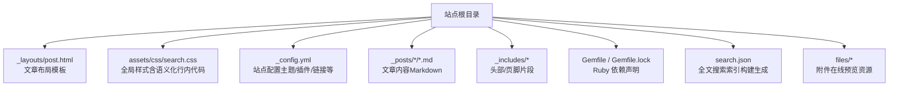
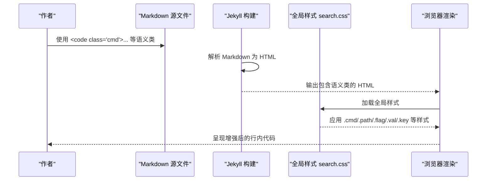
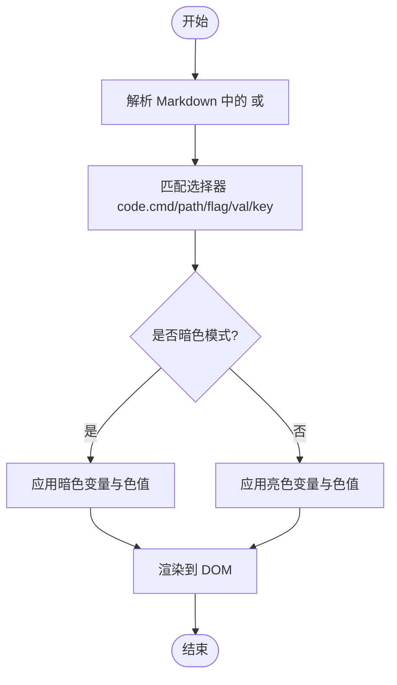
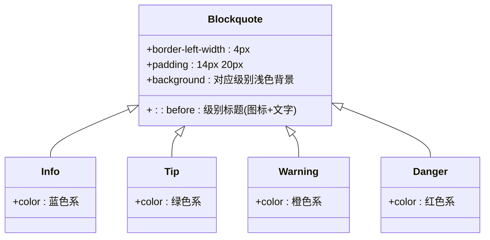
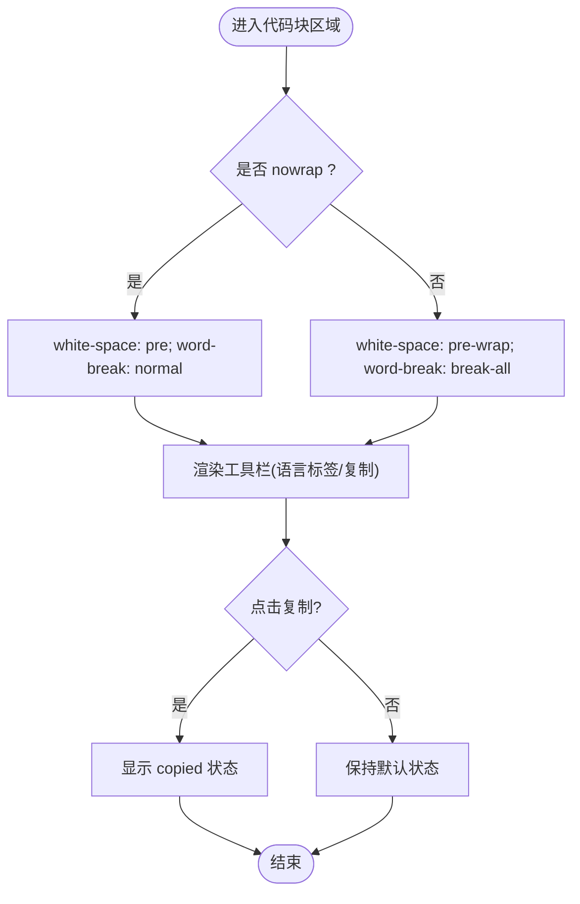
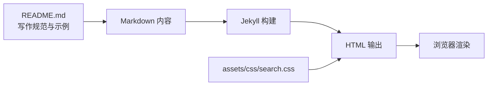

# 语义化样式系统

<cite>
**本文引用的文件**
- [README.md](file://README.md)
- [assets/css/search.css](file://assets/css/search.css)
</cite>

## 目录
1. [简介](#简介)
2. [项目结构](#项目结构)
3. [核心组件](#核心组件)
4. [架构总览](#架构总览)
5. [详细组件分析](#详细组件分析)
6. [依赖关系分析](#依赖关系分析)
7. [性能与可访问性](#性能与可访问性)
8. [故障排查指南](#故障排查指南)
9. [结论](#结论)
10. [附录：扩展与自定义指南](#附录扩展与自定义指南)

## 简介
本文件系统性地梳理并文档化博客的“语义化样式系统”，重点聚焦行内代码的视觉增强设计，包括 .cmd、.path、.flag、.val、.key 等类名的样式定义与使用场景；解释不同代码元素的语义化标记方法与 CSS 选择器策略；并提供自定义样式类与视觉效果扩展的开发指南。同时涵盖响应式设计与可访问性优化的最佳实践，帮助作者与维护者一致地表达技术内容。

## 项目结构
本项目为基于 Jekyll + Minima 的个人博客，主题深度定制为简约清爽风格，采用 CSS 变量设计体系与 Inter/JetBrains Mono 字体，支持暗色模式与全文搜索。行内代码语义样式通过全局样式文件统一注入，确保在 Markdown 预览中仍显示为普通行内代码，而在最终渲染页面中获得增强的可读性与层次。

图表来源
- [README.md:26-62](file://README.md#L26-L62)

章节来源
- [README.md:1-331](file://README.md#L1-L331)

## 核心组件
- 语义化行内代码类名
  - .cmd：命令（如 docker、git、npm），强调命令主体
  - .path：文件路径，突出路径信息
  - .flag：参数选项，区分命令行开关
  - .val：值（IP、端口、字符串等），标识具体取值
  - .key：按键（Ctrl+C、Enter、Tab 等），模拟键盘按键外观
- 提示框分级提醒
  - .info、.tip、.warning、.danger 四类 blockquote 变体，提供一致的视觉层级与图标前缀
- 设计令牌（CSS 变量）
  - 颜色、圆角、阴影、字体族、过渡时长等集中管理，支撑亮/暗双主题
- 代码块与工具栏
  - 默认自动换行，支持 nowrap 水平滚动；右上角语言标签与复制按钮

章节来源
- [assets/css/search.css:216-268](file://assets/css/search.css#L216-L268)
- [assets/css/search.css:290-332](file://assets/css/search.css#L290-L332)
- [assets/css/search.css:104-144](file://assets/css/search.css#L104-L144)
- [assets/css/search.css:146-215](file://assets/css/search.css#L146-L215)
- [assets/css/search.css:6-58](file://assets/css/search.css#L6-L58)

## 架构总览
语义化样式系统的实现遵循“最小侵入”的策略：在 Markdown 中使用 HTML <code class="xxx"> 或 <kbd> 进行语义标注，最终由全局样式文件统一赋予视觉表现。该方案兼容标准 Markdown 预览（不破坏预览体验），并在构建产物中呈现增强效果。

图表来源
- [README.md:159-176](file://README.md#L159-L176)
- [assets/css/search.css:216-268](file://assets/css/search.css#L216-L268)

## 详细组件分析

### 行内代码语义样式
- 目标
  - 在不影响 Markdown 预览的前提下，为特定语义元素提供差异化视觉反馈，提升阅读效率与准确性。
- 选择器策略
  - 以元素+类名组合选择器精准定位，避免污染通用 code 样式
    - code.cmd、code.path、code.flag、code.val、code.key
  - 对 key 与原生 kbd 做统一处理，保持键盘按键一致性
- 视觉规范
  - 命令：强调色文本 + 中等字重
  - 路径：暖色调，便于快速识别
  - 参数：对比色，与命令和值形成层次
  - 值：绿色系，表示数据/常量
  - 按键：边框 + 微阴影，模拟物理按键
- 暗色模式适配
  - 针对 path/flag/val 等关键语义在暗色下调整色值，保证对比度与可读性

图表来源
- [assets/css/search.css:216-268](file://assets/css/search.css#L216-L268)
- [assets/css/search.css:258-268](file://assets/css/search.css#L258-L268)

章节来源
- [assets/css/search.css:216-268](file://assets/css/search.css#L216-L268)
- [README.md:159-176](file://README.md#L159-L176)

### 提示框（分级提醒）
- 目标
  - 通过 blockquote 的语义类名提供四级提醒，兼顾可读性与警示强度。
- 选择器策略
  - blockquote.info/tip/warning/danger 分别设置左边框宽度、背景色与伪元素标题
- 视觉规范
  - 左侧加粗边框 + 浅色背景 + 图标前缀（信息/提示/警告/危险）
  - 暗色模式下背景透明度与前景色微调，维持对比度

图表来源
- [assets/css/search.css:290-332](file://assets/css/search.css#L290-L332)

章节来源
- [assets/css/search.css:290-332](file://assets/css/search.css#L290-L332)
- [README.md:178-216](file://README.md#L178-L216)

### 代码块与工具栏
- 目标
  - 提供易读的代码块展示，支持自动换行与 nowrap 切换，附带语言标签与复制按钮。
- 交互与样式
  - pre > code 默认 white-space: pre-wrap，长行自动换行；添加 .nowrap 时恢复预格式化
  - 工具栏绝对定位覆盖于代码块上方，语言标签与操作按钮右对齐
  - 复制成功状态通过 active/copied 类切换颜色与背景

图表来源
- [assets/css/search.css:104-144](file://assets/css/search.css#L104-L144)
- [assets/css/search.css:146-215](file://assets/css/search.css#L146-L215)

章节来源
- [assets/css/search.css:104-144](file://assets/css/search.css#L104-L144)
- [assets/css/search.css:146-215](file://assets/css/search.css#L146-L215)

### 设计令牌与主题
- 设计令牌
  - 颜色：背景、文本、强调色、高亮、边框等
  - 圆角与阴影：统一卡片与弹窗的视觉深度
  - 字体：Inter 正文 + JetBrains Mono 代码
  - 过渡：统一的动画时长
- 暗色模式
  - 通过 prefers-color-scheme 媒体查询切换 :root 变量，实现一键深色主题

章节来源
- [assets/css/search.css:6-58](file://assets/css/search.css#L6-L58)

## 依赖关系分析
- 样式层
  - 全局样式 assets/css/search.css 覆盖 Minima 默认样式，提供语义化行内代码、提示框、代码块工具栏等
- 内容层
  - README 作为写作规范，指导作者在 Markdown 中使用语义类名与提示框语法
- 运行时
  - Jekyll 将 Markdown 转换为 HTML，浏览器加载全局样式后完成渲染

图表来源
- [README.md:159-176](file://README.md#L159-L176)
- [assets/css/search.css:216-268](file://assets/css/search.css#L216-L268)

章节来源
- [README.md:1-331](file://README.md#L1-L331)
- [assets/css/search.css:1-1306](file://assets/css/search.css#L1-L1306)

## 性能与可访问性
- 性能
  - 选择器尽量简洁且具象（元素+类名），减少回溯开销
  - 使用 CSS 变量集中管理主题，避免重复计算与冗余规则
  - 代码块默认自动换行，降低横向滚动带来的重排成本
- 可访问性
  - 语义类名与真实语义元素结合（code/kbd/blockquote），利于屏幕阅读器理解
  - 暗色模式下的色值调整确保对比度达标
  - 提示框伪元素仅用于装饰，不影响主要内容语义

[本节为通用建议，无需引用具体文件]

## 故障排查指南
- 行内代码未生效
  - 检查是否在 <code> 上正确添加了语义类名（cmd/path/flag/val/key）
  - 确认全局样式已加载且未被更高优先级规则覆盖
- 暗色模式下对比度异常
  - 检查 prefers-color-scheme 媒体查询是否被覆盖
  - 必要时在自定义样式中补充暗色变量
- 代码块不换行或滚动异常
  - 确认是否误加了 nowrap 类
  - 检查父容器 overflow 与 white-space 属性

章节来源
- [assets/css/search.css:104-144](file://assets/css/search.css#L104-L144)
- [assets/css/search.css:258-268](file://assets/css/search.css#L258-L268)

## 结论
本语义化样式系统以“最小侵入、最大收益”为原则，通过少量语义类名与统一的设计令牌，显著提升了技术内容的可读性与层次感。配合提示框分级提醒与代码块工具栏，既保证了写作体验的一致性，也确保了跨设备与主题的稳定性。

[本节为总结性内容，无需引用具体文件]

## 附录：扩展与自定义指南

### 新增语义类名的步骤
- 在文章中按规范使用新类名（例如 <code class="var">... 或 <code class="type">...）
- 在全局样式文件中新增选择器与视觉规则，优先复用现有设计令牌
- 若涉及暗色模式，请在 prefers-color-scheme: dark 块中补充对应色值
- 更新写作规范（README）以便团队统一使用

章节来源
- [assets/css/search.css:216-268](file://assets/css/search.css#L216-L268)
- [assets/css/search.css:258-268](file://assets/css/search.css#L258-L268)
- [README.md:159-176](file://README.md#L159-L176)

### 自定义视觉效果的建议
- 使用 CSS 变量控制颜色、圆角、阴影与过渡，确保主题一致性
- 谨慎使用 !important，仅在覆盖第三方样式时使用
- 为复杂交互（如复制、折叠）提供清晰的焦点态与键盘可达性

章节来源
- [assets/css/search.css:6-58](file://assets/css/search.css#L6-L58)
- [assets/css/search.css:146-215](file://assets/css/search.css#L146-L215)

### 响应式设计要点
- 使用 clamp() 与相对单位控制字号与间距，适配多屏
- 在小屏设备上隐藏非关键控件（如搜索框），保留核心功能
- 弹窗与面板在移动端全屏展开，优化触控体验

章节来源
- [assets/css/search.css:461-471](file://assets/css/search.css#L461-L471)
- [assets/css/search.css:704-727](file://assets/css/search.css#L704-L727)

### 可访问性优化清单
- 语义化标签优先（code/kbd/blockquote）
- 伪元素仅用于装饰，不承载必要信息
- 暗色模式色值满足 WCAG 对比度要求
- 键盘导航与焦点可见性良好

[本节为通用建议，无需引用具体文件]