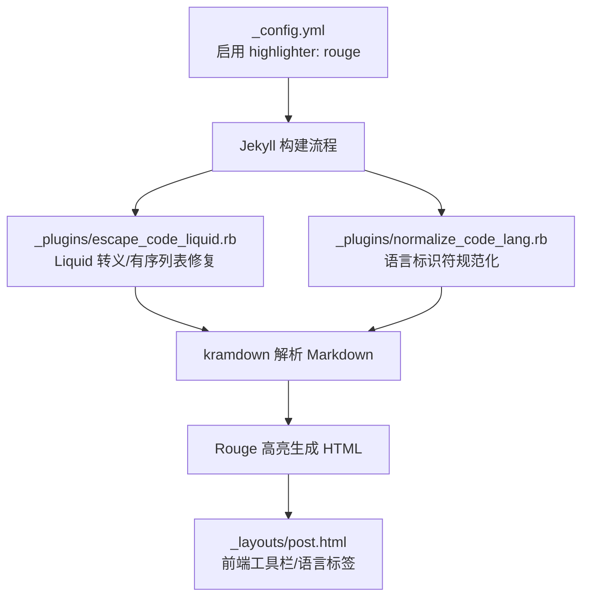
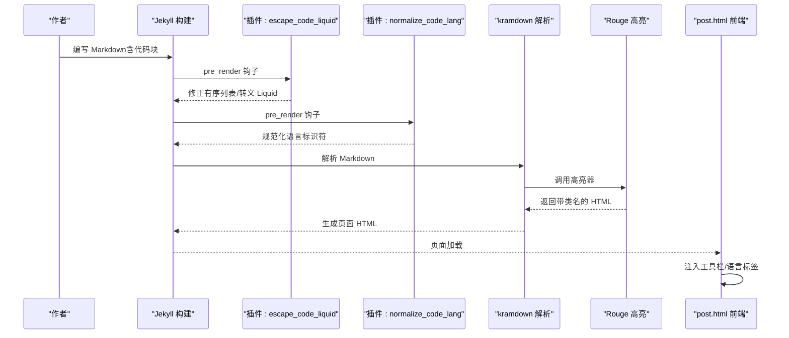
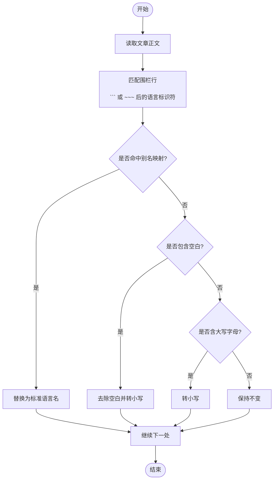
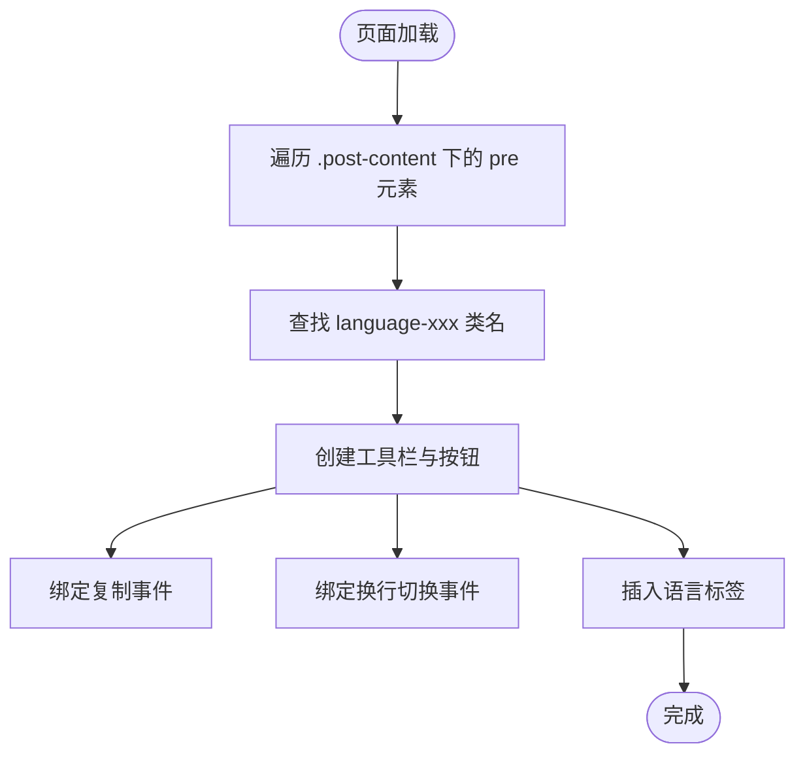
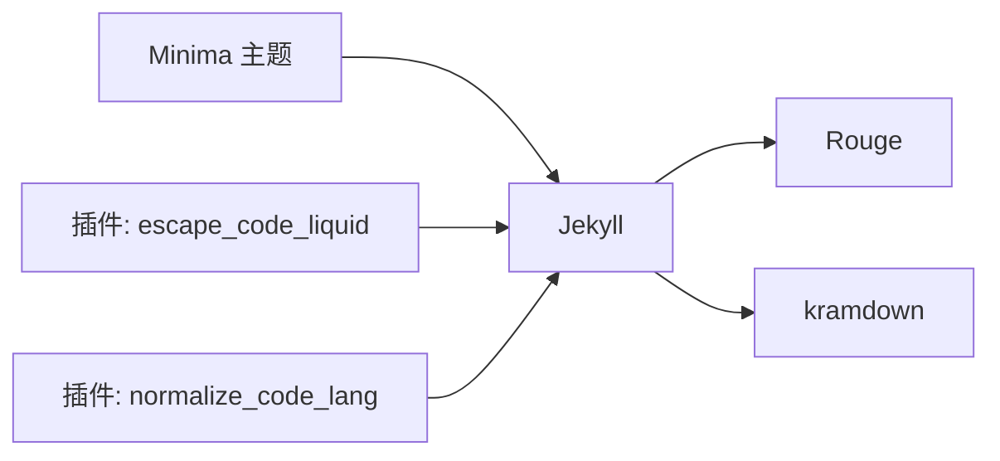

# 语法高亮系统

<cite>
**本文引用的文件**   
- [_config.yml](file://_config.yml)
- [Gemfile](file://Gemfile)
- [Gemfile.lock](file://Gemfile.lock)
- [_plugins/escape_code_liquid.rb](file://_plugins/escape_code_liquid.rb)
- [_plugins/normalize_code_lang.rb](file://_plugins/normalize_code_lang.rb)
- [_layouts/post.html](file://_layouts/post.html)
- [README.md](file://README.md)
</cite>

## 目录
1. [简介](#简介)
2. [项目结构](#项目结构)
3. [核心组件](#核心组件)
4. [架构总览](#架构总览)
5. [详细组件分析](#详细组件分析)
6. [依赖关系分析](#依赖关系分析)
7. [性能考虑](#性能考虑)
8. [故障排查指南](#故障排查指南)
9. [结论](#结论)
10. [附录](#附录)

## 简介
本仓库基于 Jekyll + Minima 主题，使用 Rouge 作为代码高亮引擎。为提升写作体验与渲染稳定性，项目通过自定义插件实现了：
- 语言标签自动识别与标准化处理（大小写、空格、别名映射）
- Liquid 模板与代码块冲突的自动转义与修复（有序列表内围栏标记兼容、{{ }} 保护）
- 前端工具栏增强（复制、换行切换、语言标签显示）

本文围绕上述能力展开，给出配置方法、扩展建议、主题定制思路以及性能调优技巧。

## 项目结构
与本主题相关的核心位置如下：
- 站点配置与高亮开关：_config.yml
- 依赖版本锁定：Gemfile、Gemfile.lock
- 高亮前处理插件：_plugins/escape_code_liquid.rb、_plugins/normalize_code_lang.rb
- 文章布局与前端交互：_layouts/post.html
- 文档说明：README.md



图表来源
- [_config.yml:37-38](file://_config.yml#L37-L38)
- [_plugins/escape_code_liquid.rb:12-61](file://_plugins/escape_code_liquid.rb#L12-L61)
- [_plugins/normalize_code_lang.rb:9-41](file://_plugins/normalize_code_lang.rb#L9-L41)
- [_layouts/post.html:115-193](file://_layouts/post.html#L115-L193)

章节来源
- [_config.yml:37-38](file://_config.yml#L37-L38)
- [Gemfile:1-18](file://Gemfile#L1-L18)
- [Gemfile.lock:20-34](file://Gemfile.lock#L20-L34)
- [_plugins/escape_code_liquid.rb:1-61](file://_plugins/escape_code_liquid.rb#L1-L61)
- [_plugins/normalize_code_lang.rb:1-41](file://_plugins/normalize_code_lang.rb#L1-L41)
- [_layouts/post.html:115-193](file://_layouts/post.html#L115-L193)

## 核心组件
- 高亮引擎选择与启用
  - 在站点配置中指定使用 Rouge 作为高亮器，并配合 kramdown 解析 Markdown。
- 语言标签规范化插件
  - 将不规范的标识符统一为标准形式，支持常见别名映射与空白/大小写归一化。
- Liquid 冲突转义插件
  - 在有序列表内将 ``` 转换为 ~~~；对围栏代码块、行内代码与 <code> 中的 {{ }} 添加  保护。
- 前端工具栏
  - 自动注入复制按钮、换行切换按钮，并显示语言标签。

章节来源
- [_config.yml:37-38](file://_config.yml#L37-L38)
- [_plugins/normalize_code_lang.rb:12-40](file://_plugins/normalize_code_lang.rb#L12-L40)
- [_plugins/escape_code_liquid.rb:15-60](file://_plugins/escape_code_liquid.rb#L15-L60)
- [_layouts/post.html:127-191](file://_layouts/post.html#L127-L191)

## 架构总览
下图展示了从内容到最终页面的关键路径：Jekyll 读取配置后，先执行插件预处理，再交由 kramdown 解析，最后由 Rouge 进行高亮输出，页面加载时由 post.html 脚本增强交互。



图表来源
- [_plugins/escape_code_liquid.rb:12-61](file://_plugins/escape_code_liquid.rb#L12-L61)
- [_plugins/normalize_code_lang.rb:9-41](file://_plugins/normalize_code_lang.rb#L9-L41)
- [_layouts/post.html:115-193](file://_layouts/post.html#L115-L193)

## 详细组件分析

### Rouge 高亮引擎配置与优化
- 启用方式
  - 在站点配置中设置高亮器为 rouge，并使用 kramdown 作为 Markdown 解析器。
- 语言支持与扩展
  - Rouge 内置大量语言支持；如需新增或覆盖，可在主题或样式层面对 language-xxx 类名进行 CSS 定制，或通过第三方扩展引入新语言。
- 主题定制
  - 当前主题使用 Minima，可通过覆盖其样式或使用 CSS 变量体系调整高亮配色与字体。
- 性能优化建议
  - 避免在文章中频繁切换语言导致重复解析；保持语言标签一致性与标准化，减少正则匹配开销。
  - 控制代码块长度，必要时折叠长代码块以减少 DOM 节点数量。

章节来源
- [_config.yml:37-38](file://_config.yml#L37-L38)
- [README.md:322-330](file://README.md#L322-L330)

### 语言标签自动识别与标准化处理
- 目标
  - 解决 kramdown 对含空格或大小写不规范的语言标识符支持不佳的问题，确保代码块正确渲染。
- 规则
  - 已知别名映射：如 “Plain Text” → “text”，“C++” → “cpp” 等。
  - 含空白的标识符：去除空白并转小写。
  - 其余一律转小写。
- 适用范围
  - 同时支持 ``` 和 ~~~ 两种围栏标记；有序列表内的代码块会被自动转为 ~~~。
- 实现要点
  - 在 posts 的 pre_render 钩子中对全文进行正则替换，按优先级应用映射与归一化规则。



图表来源
- [_plugins/normalize_code_lang.rb:22-40](file://_plugins/normalize_code_lang.rb#L22-L40)

章节来源
- [_plugins/normalize_code_lang.rb:1-41](file://_plugins/normalize_code_lang.rb#L1-L41)

### Liquid 模板与代码块的冲突解决方案
- 问题背景
  - 在有序列表项中使用缩进的 ``` 会被 kramdown 当作普通代码块而非围栏代码块；此外，代码中的 {{ }} 会与 Liquid 语法冲突。
- 解决方案
  - 有序列表内将缩进的 ``` 围栏标记替换为 ~~~，以规避 kramdown 的解析差异。
  - 对围栏代码块整体包裹 ...，使其跳过 Liquid 解析。
  - 对行内代码与 <code> 标签中的 {{ }} 分别包裹 ...，保证不被误解析。
- 效果
  - 作者在文章中可直接书写 {{ }}，无需手动转义；有序列表中的代码块也能稳定渲染。

```mermaid
sequenceDiagram
participant Hook as "pre_render 钩子"
participant OL as "有序列表扫描"
participant Raw as "Raw 包裹"
participant Inline as "行内代码处理"
participant CodeTag as "<code> 标签处理"
Hook->>OL : 逐行扫描，识别有序列表上下文
OL-->>Hook : 将缩进
``` 替换为 ~~~
    Hook->>Raw: 全局匹配围栏代码块
    Raw-->>Hook: 包裹 ...
    Hook->>Inline: 匹配反引号行内代码
    Inline-->>Hook: 对 {{ }} 包裹 ...
    Hook->>CodeTag: 匹配 <code>...</code>
    CodeTag-->>Hook: 对 {{ }} 包裹 ...
```

图表来源
- [_plugins/escape_code_liquid.rb:15-60](file://_plugins/escape_code_liquid.rb#L15-L60)

章节来源
- [_plugins/escape_code_liquid.rb:1-61](file://_plugins/escape_code_liquid.rb#L1-L61)

### 前端工具栏与语言标签展示
- 功能
  - 自动为每个代码块注入工具栏，包括复制按钮与换行切换按钮。
  - 自动提取语言类型并显示标签；若无语言则默认显示 text。
- 实现要点
  - 向上查找外层容器或 code 元素上的 language-xxx 类名，兼容 kramdown 的输出结构。
  - 使用 Clipboard API 完成复制操作，并提供视觉反馈。
  - 通过切换 class 控制代码块换行行为。



图表来源
- [_layouts/post.html:127-191](file://_layouts/post.html#L127-L191)

章节来源
- [_layouts/post.html:115-193](file://_layouts/post.html#L115-L193)

## 依赖关系分析
- 高亮相关依赖
  - Jekyll 依赖 Rouge 提供高亮能力；Minima 主题与 kramdown 共同协作完成 Markdown 解析与高亮输出。
- 版本约束
  - Gemfile 与 Gemfile.lock 锁定了 jekyll、minima、liquid、kramdown-parser-gfm、rouge 等关键依赖的版本范围，确保本地与 GitHub Pages 环境一致性。



图表来源
- [Gemfile:1-18](file://Gemfile#L1-L18)
- [Gemfile.lock:20-34](file://Gemfile.lock#L20-L34)

章节来源
- [Gemfile:1-18](file://Gemfile#L1-L18)
- [Gemfile.lock:20-34](file://Gemfile.lock#L20-L34)

## 性能考虑
- 构建期
  - 插件在 pre_render 阶段对全文进行多次正则替换，建议在大型站点中关注构建时间；可考虑按需处理或缓存策略。
- 运行期
  - 前端工具栏通过 DOM 遍历与事件绑定，对大量代码块页面可能带来额外开销；可结合懒加载或节流优化。
- 高亮输出
  - Rouge 的高亮过程受语言种类与代码量影响；保持语言标签标准化可减少不必要的回退与重试。

[本节为通用指导，不涉及具体文件分析]

## 故障排查指南
- 代码块未高亮或语言标签无效
  - 检查是否在 _config.yml 中启用了 highlighter: rouge。
  - 确认语言标识符是否被 normalize 插件正确标准化（大小写、空格、别名）。
- 有序列表内代码块渲染异常
  - 确认 escape_code_liquid 插件已将缩进的 ``` 替换为 ~~~。
- 代码中出现 {{ }} 被 Liquid 解析
  - 确认插件已对围栏代码块、行内代码与 <code> 标签中的 {{ }} 包裹了 ...。
- 前端工具栏不显示
  - 检查 post.html 脚本是否正确注入；确认页面中存在 pre 元素且未被其他脚本移除。

章节来源
- [_config.yml:37-38](file://_config.yml#L37-L38)
- [_plugins/escape_code_liquid.rb:15-60](file://_plugins/escape_code_liquid.rb#L15-L60)
- [_plugins/normalize_code_lang.rb:22-40](file://_plugins/normalize_code_lang.rb#L22-L40)
- [_layouts/post.html:127-191](file://_layouts/post.html#L127-L191)

## 结论
本项目通过配置与两个自定义插件，构建了稳定高效的语法高亮系统：
- 使用 Rouge 作为高亮引擎，结合 kramdown 解析 Markdown。
- 通过语言标签规范化插件，提升代码块识别准确率与兼容性。
- 通过 Liquid 转义插件，彻底解决代码与模板语法的冲突问题。
- 在前端层面增强用户体验，提供复制、换行与语言标签展示。

在此基础上，可按需扩展语言支持、定制主题样式，并结合性能优化建议进一步提升站点质量。

[本节为总结性内容，不涉及具体文件分析]

## 附录
- 快速参考
  - 启用高亮：在 _config.yml 中设置 highlighter: rouge。
  - 语言别名：在 normalize 插件中添加新的映射键值对。
  - 转义规则：在 escape 插件中扩展对更多 HTML 标签或语法的保护。
  - 前端增强：在 post.html 中扩展工具栏功能或样式。

章节来源
- [_config.yml:37-38](file://_config.yml#L37-L38)
- [_plugins/normalize_code_lang.rb:12-20](file://_plugins/normalize_code_lang.rb#L12-L20)
- [_plugins/escape_code_liquid.rb:45-60](file://_plugins/escape_code_liquid.rb#L45-L60)
- [_layouts/post.html:127-191](file://_layouts/post.html#L127-L191)