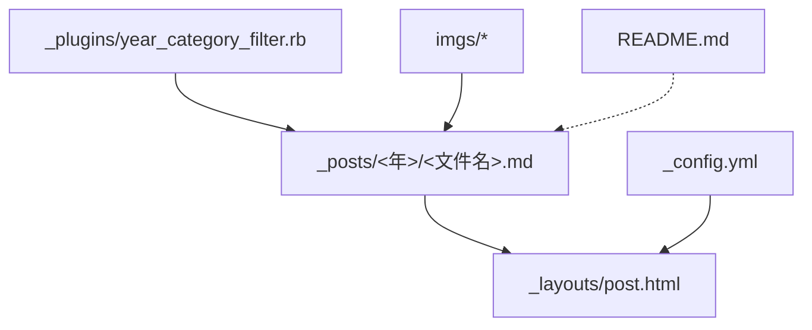
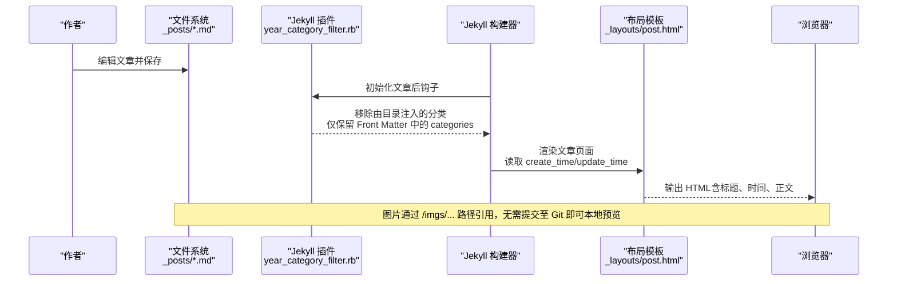
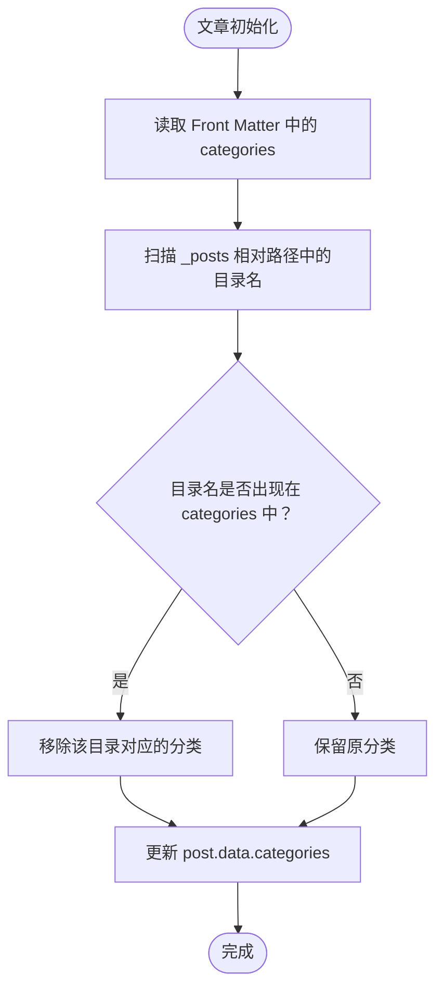
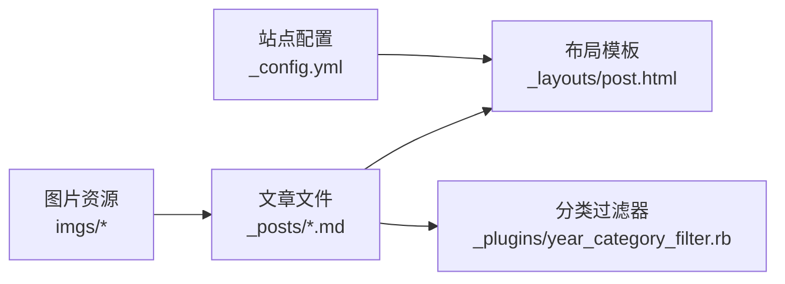

# 内容创作

<cite>
**本文引用的文件**   
- [_config.yml](file://_config.yml)
- [README.md](file://README.md)
- [index.md](file://index.md)
- [_layouts/post.html](file://_layouts/post.html)
- [_plugins/year_category_filter.rb](file://_plugins/year_category_filter.rb)
- [_posts/2019/2019-12-19-Markdown-技巧.md](file://_posts/2019/2019-12-19-Markdown-技巧.md)
- [_posts/2019/2019-12-19-爬虫爬取(读取)本地网页.md](file://_posts/2019/2019-12-19-爬虫爬取(读取)本地网页.md)
- [_posts/2019/2019-12-27-通过-GitHub-Pages-+-JeKyll-搭建自己的博客.md](file://_posts/2019/2019-12-27-通过-GitHub-Pages-+-JeKyll-搭建自己的博客.md)
- [_posts/2022/2022-11-17-备份定时任务.md](file://_posts/2022/2022-11-17-备份定时任务.md)
- [_posts/2024/2024-11-16-milvus-启用身份验证并修改账号密码.md](file://_posts/2024/2024-11-16-milvus-启用身份验证并修改账号密码.md)
- [_posts/2025/2025-03-31-milvus-部署.md](file://_posts/2025/2025-03-31-milvus-部署.md)
</cite>

## 目录
1. [简介](#简介)
2. [项目结构](#项目结构)
3. [核心组件](#核心组件)
4. [架构总览](#架构总览)
5. [详细组件分析](#详细组件分析)
6. [依赖关系分析](#依赖关系分析)
7. [性能与效率建议](#性能与效率建议)
8. [故障排查指南](#故障排查指南)
9. [结论](#结论)
10. [附录](#附录)

## 简介
本指南面向博客作者，聚焦于“如何高效、规范地创作内容”。你将学到：
- Markdown 文件的命名规范与 Front Matter 字段用法（layout、title、create_time、update_time、categories 等）
- 分类系统的层级结构与组织方式（如 [Python,爬虫]）
- 图片资源的组织结构与引用方法（imgs 目录管理策略）
- 文章模板与最佳实践（时间格式、分类选择、标题规范等）
- 实际 Markdown 示例路径，帮助快速上手
- 本地预览的实时更新机制，提升写作效率

## 项目结构
本项目基于 Jekyll + Minima 主题。与内容创作直接相关的目录与文件包括：
- _posts：存放所有文章，按年分目录组织
- imgs：集中存放文章配图，支持按主题/年份子目录归档
- _layouts/post.html：文章页面布局，负责渲染 create_time、update_time 等元信息
- _plugins/year_category_filter.rb：插件，过滤掉由目录结构自动注入的分类，仅保留 Front Matter 中显式声明的分类
- _config.yml：站点配置，包含 permalink、markdown 引擎、日期格式等
- README.md：写文章、本地预览、清理缓存等操作说明

图表来源
- [_config.yml:35-38](file://_config.yml#L35-L38)
- [_layouts/post.html:9-16](file://_layouts/post.html#L9-L16)
- [_plugins/year_category_filter.rb:1-13](file://_plugins/year_category_filter.rb#L1-L13)
- [README.md:88-126](file://README.md#L88-L126)

章节来源
- [_config.yml:1-45](file://_config.yml#L1-L45)
- [README.md:88-126](file://README.md#L88-L126)

## 核心组件
- 文章命名与 Front Matter
  - 文件名：年-月-日-文章标题.md（例如 2025-03-31-milvus-部署.md）
  - Front Matter 关键字段：
    - layout：固定为 post
    - title：文章标题
    - create_time：创建时间（精确到分钟可选）
    - update_time：更新时间（可选；若未提供则显示为创建时间）
    - categories：文章分类，支持层级（如 [Database,Milvus]）
- 文章布局与元信息渲染
  - 文章页布局在 _layouts/post.html 中定义，会读取 page.create_time 与 page.update_time 并按指定格式展示
- 分类系统
  - 使用 Front Matter 中的 categories 字段声明分类
  - 通过自定义插件 year_category_filter.rb 过滤掉由 _posts 子目录自动注入的分类，确保分类仅来自 Front Matter
- 图片资源
  - 统一存放在 imgs 目录下，可按主题或年份建立子目录
  - 文章中通过绝对路径 /imgs/... 引用图片
- 站点配置
  - _config.yml 中定义了 permalink、markdown 引擎、日期格式等

章节来源
- [_posts/2025/2025-03-31-milvus-部署.md:1-7](file://_posts/2025/2025-03-31-milvus-部署.md#L1-L7)
- [_layouts/post.html:9-16](file://_layouts/post.html#L9-L16)
- [_plugins/year_category_filter.rb:1-13](file://_plugins/year_category_filter.rb#L1-L13)
- [README.md:88-126](file://README.md#L88-L126)
- [_config.yml:35-38](file://_config.yml#L35-L38)

## 架构总览
下图展示了从“作者编写 Markdown”到“浏览器渲染文章”的关键流程，以及分类过滤与图片引用的参与点。

图表来源
- [_plugins/year_category_filter.rb:5-12](file://_plugins/year_category_filter.rb#L5-L12)
- [_layouts/post.html:9-16](file://_layouts/post.html#L9-L16)
- [README.md:113-126](file://README.md#L113-L126)

## 详细组件分析

### 文章命名与 Front Matter 规范
- 命名规则
  - 采用“年-月-日-标题”的形式，便于按时间归档与排序
- Front Matter 字段
  - layout：固定为 post
  - title：文章标题
  - create_time：创建时间，推荐格式 YYYY-MM-DD HH:mm（可省略秒）
  - update_time：更新时间，留空表示沿用创建时间
  - categories：数组形式，支持多级分类，如 [Database,Milvus]
- 参考示例路径
  - [2025-03-31-milvus-部署.md:1-7](file://_posts/2025/2025-03-31-milvus-部署.md#L1-L7)
  - [2024-11-16-milvus-启用身份验证并修改账号密码.md:1-7](file://_posts/2024/2024-11-16-milvus-启用身份验证并修改账号密码.md#L1-L7)
  - [2022-11-17-备份定时任务.md:1-7](file://_posts/2022/2022-11-17-备份定时任务.md#L1-L7)
  - [2019-12-19-Markdown-技巧.md:1-7](file://_posts/2019/2019-12-19-Markdown-技巧.md#L1-L7)
  - [2019-12-19-爬虫爬取(读取)本地网页.md](file://_posts/2019/2019-12-19-爬虫爬取(读取)本地网页.md#L1-L7)

章节来源
- [_posts/2025/2025-03-31-milvus-部署.md:1-7](file://_posts/2025/2025-03-31-milvus-部署.md#L1-L7)
- [_posts/2024/2024-11-16-milvus-启用身份验证并修改账号密码.md:1-7](file://_posts/2024/2024-11-16-milvus-启用身份验证并修改账号密码.md#L1-L7)
- [_posts/2022/2022-11-17-备份定时任务.md:1-7](file://_posts/2022/2022-11-17-备份定时任务.md#L1-L7)
- [_posts/2019/2019-12-19-Markdown-技巧.md:1-7](file://_posts/2019/2019-12-19-Markdown-技巧.md#L1-L7)
- [_posts/2019/2019-12-19-爬虫爬取(读取)本地网页.md:1-7](file://_posts/2019/2019-12-19-爬虫爬取(读取)本地网页.md#L1-L7)

### 分类系统与层级结构
- 分类声明
  - 在 Front Matter 中使用 categories 字段，以数组形式列出分类
  - 支持层级表达，如 [Database,Milvus] 或 [Python,爬虫]
- 分类过滤机制
  - 自定义插件会在文章初始化后，移除由 _posts 子目录自动注入的分类，保证分类仅来源于 Front Matter
- 参考示例路径
  - [2025-03-31-milvus-部署.md](file://_posts/2025/2025-03-31-milvus-部署.md#L6)
  - [2024-11-16-milvus-启用身份验证并修改账号密码.md](file://_posts/2024/2024-11-16-milvus-启用身份验证并修改账号密码.md#L6)
  - [2022-11-17-备份定时任务.md](file://_posts/2022/2022-11-17-备份定时任务.md#L6)
  - [2019-12-19-Markdown-技巧.md](file://_posts/2019/2019-12-19-Markdown-技巧.md#L6)
  - [2019-12-19-爬虫爬取(读取)本地网页.md](file://_posts/2019/2019-12-19-爬虫爬取(读取)本地网页.md#L6)

图表来源
- [_plugins/year_category_filter.rb:5-12](file://_plugins/year_category_filter.rb#L5-L12)

章节来源
- [_plugins/year_category_filter.rb:1-13](file://_plugins/year_category_filter.rb#L1-L13)
- [_posts/2025/2025-03-31-milvus-部署.md:6](file://_posts/2025/2025-03-31-milvus-部署.md#L6)
- [_posts/2024/2024-11-16-milvus-启用身份验证并修改账号密码.md:6](file://_posts/2024/2024-11-16-milvus-启用身份验证并修改账号密码.md#L6)
- [_posts/2022/2022-11-17-备份定时任务.md:6](file://_posts/2022/2022-11-17-备份定时任务.md#L6)
- [_posts/2019/2019-12-19-Markdown-技巧.md:6](file://_posts/2019/2019-12-19-Markdown-技巧.md#L6)
- [_posts/2019/2019-12-19-爬虫爬取(读取)本地网页.md:6](file://_posts/2019/2019-12-19-爬虫爬取(读取)本地网页.md#L6)

### 图片资源组织与引用
- 目录策略
  - 根级 imgs 目录用于集中管理图片
  - 可按主题或年份建立子目录，例如 imgs/JeKyll/2019、imgs/post_share 等
- 引用方式
  - 在 Markdown 中使用绝对路径引用：
- 本地预览
  - 新增图片无需提交到 Git，本地即可立即显示
- 参考示例路径
  - [README.md:110-126](file://README.md#L110-L126)
  - [2019-12-27-通过-GitHub-Pages-+-JeKyll-搭建自己的博客.md:23-70](file://_posts/2019/2019-12-27-通过-GitHub-Pages-+-JeKyll-搭建自己的博客.md#L23-L70)

章节来源
- [README.md:110-126](file://README.md#L110-L126)
- [_posts/2019/2019-12-27-通过-GitHub-Pages-+-JeKyll-搭建自己的博客.md:23-70](file://_posts/2019/2019-12-27-通过-GitHub-Pages-+-JeKyll-搭建自己的博客.md#L23-L70)

### 文章模板与最佳实践
- 模板要点
  - layout: post
  - title: 简洁明确，避免过长
  - create_time: 推荐 YYYY-MM-DD HH:mm
  - update_time: 有更新时填写，否则留空
  - categories: 使用层级表达，如 [Database,Milvus] 或 [Python,爬虫]
- 标题规范
  - 建议使用中文为主，必要时可加英文关键词，保持可读性与检索友好
- 时间格式
  - 遵循 YYYY-MM-DD HH:mm，秒可省略
- 分类选择
  - 优先使用语义明确的分类词，层级不超过两级，避免过度细分
- 参考示例路径
  - [2025-03-31-milvus-部署.md:1-7](file://_posts/2025/2025-03-31-milvus-部署.md#L1-L7)
  - [2024-11-16-milvus-启用身份验证并修改账号密码.md:1-7](file://_posts/2024/2024-11-16-milvus-启用身份验证并修改账号密码.md#L1-L7)
  - [2022-11-17-备份定时任务.md:1-7](file://_posts/2022/2022-11-17-备份定时任务.md#L1-L7)
  - [2019-12-19-Markdown-技巧.md:1-7](file://_posts/2019/2019-12-19-Markdown-技巧.md#L1-L7)
  - [2019-12-19-爬虫爬取(读取)本地网页.md](file://_posts/2019/2019-12-19-爬虫爬取(读取)本地网页.md#L1-L7)

章节来源
- [_posts/2025/2025-03-31-milvus-部署.md:1-7](file://_posts/2025/2025-03-31-milvus-部署.md#L1-L7)
- [_posts/2024/2024-11-16-milvus-启用身份验证并修改账号密码.md:1-7](file://_posts/2024/2024-11-16-milvus-启用身份验证并修改账号密码.md#L1-L7)
- [_posts/2022/2022-11-17-备份定时任务.md:1-7](file://_posts/2022/2022-11-17-备份定时任务.md#L1-L7)
- [_posts/2019/2019-12-19-Markdown-技巧.md:1-7](file://_posts/2019/2019-12-19-Markdown-技巧.md#L1-L7)
- [_posts/2019/2019-12-19-爬虫爬取(读取)本地网页.md:1-7](file://_posts/2019/2019-12-19-爬虫爬取(读取)本地网页.md#L1-L7)

### 行内代码语义样式
站点在 assets/css/search.css 中定义了 5 组行内代码语义样式类，通过 HTML `<code class="xxx">` 标签在文章中单独标注特定代码片段，Markdown 预览中显示为普通行内代码，不影响兼容性。

- 可用样式类
  - `.cmd`：命令（docker, git, npm），强调蓝 + 稍粗字体
  - `.path`：文件路径（/etc/nginx/nginx.conf），琥珀色
  - `.flag`：参数选项（--format, -v），橙色
  - `.val`：值（IP、端口、字符串），绿色
  - `.key`：按键（Ctrl+C, Enter），键盘按键外观（立体底边）
- 用法示例
  - `运行 <code class="cmd">docker inspect</code> 并传入 <code class="flag">--format</code> 参数`
- 暗色模式
  - 通过 @media (prefers-color-scheme: dark) 自动调整 .path、.flag、.val 的颜色
- 代码块中的 {{ }} 语法（Docker/Go 模板等）由 _plugins/escape_code_liquid.rb 自动转义，无需手动处理

章节来源
- [assets/css/search.css:135-179](file://assets/css/search.css#L135-L179)
- [_plugins/escape_code_liquid.rb:1-24](file://_plugins/escape_code_liquid.rb#L1-L24)

### 提示框（分级提醒）
站点在 assets/css/search.css 中定义了 4 个级别的提示框样式，通过 `<blockquote class="xxx">` 标签在文章中插入带级别的提醒，Markdown 预览中显示为普通引用块。

- 提示框级别
  - `.info`：信息（蓝色），背景知识、补充说明
  - `.tip`：提示（绿色），最佳实践、小窃门
  - `.warning`：警告（琥珀色），需注意、易踩坑
  - `.danger`：危险（红色），危险操作、数据丢失风险
- 用法示例
  - `<blockquote class="warning">修改配置前建议先备份原始文件。</blockquote>`
- 视觉特点
  - 左侧彩色边条 + 浅色背景 + 顶部图标标题（ℹ️ 信息 / 💡 提示 / ⚠️ 警告 / 🚨 危险）
  - 暗色模式自动调整背景透明度

章节来源
- [assets/css/search.css:200-238](file://assets/css/search.css#L200-L238)

### 本地预览与实时更新
- 启动服务
  - 在项目根目录执行 bundle exec jekyll serve（Windows）或 jekyll serve（Ubuntu），打开 http://127.0.0.1:4000/
- 实时刷新
  - 修改 _posts 下的 .md 文件并保存，浏览器刷新即可看到变化
  - 新增文章或添加图片（放入 imgs 目录）无需提交 Git，本地即时生效
- 配置变更
  - 修改 _config.yml 需重启服务才会生效
- 清理缓存
  - 遇到样式错乱或页面未更新，删除 _site 目录后重新构建并启动
- 参考路径
  - [README.md:113-141](file://README.md#L113-L141)

章节来源
- [README.md:113-141](file://README.md#L113-L141)

## 依赖关系分析
- 文章文件依赖布局模板进行渲染
- 插件在文章初始化阶段对分类进行清洗
- 站点配置影响链接结构与 Markdown 解析行为

图表来源
- [_layouts/post.html:9-16](file://_layouts/post.html#L9-L16)
- [_plugins/year_category_filter.rb:5-12](file://_plugins/year_category_filter.rb#L5-L12)
- [_config.yml:35-38](file://_config.yml#L35-L38)

章节来源
- [_layouts/post.html:9-16](file://_layouts/post.html#L9-L16)
- [_plugins/year_category_filter.rb:1-13](file://_plugins/year_category_filter.rb#L1-L13)
- [_config.yml:35-38](file://_config.yml#L35-L38)

## 性能与效率建议
- 合理使用分类层级，避免过深导致导航复杂
- 图片按主题/年份归档，减少单目录文件数量，提高浏览与管理效率
- 本地预览时尽量只改动必要文件，减少增量构建冲突
- 大改配置或大量增删文件后，清理 _site 再重建，避免缓存问题

[本节为通用建议，不直接分析具体文件]

## 故障排查指南
- 页面未更新或样式异常
  - 停止当前服务，删除 _site 目录，重新构建并启动
- 图片无法显示
  - 确认图片路径是否为 /imgs/... 的绝对路径
  - 确认图片已放置在 imgs 对应子目录中
- 分类不符合预期
  - 检查 Front Matter 中的 categories 是否正确
  - 确认插件未被禁用，且能正常执行分类过滤逻辑
- 参考路径
  - [README.md:128-141](file://README.md#L128-L141)
  - [_plugins/year_category_filter.rb:1-13](file://_plugins/year_category_filter.rb#L1-L13)

章节来源
- [README.md:128-141](file://README.md#L128-L141)
- [_plugins/year_category_filter.rb:1-13](file://_plugins/year_category_filter.rb#L1-L13)

## 结论
通过统一的命名规范、清晰的 Front Matter 字段约定、严格的分类管理与集中的图片资源组织，配合本地实时预览与缓存清理策略，可以显著提升写作效率与内容质量。建议在团队或个人写作中严格执行上述规范，并保持分类体系的稳定与可扩展性。

[本节为总结性内容，不直接分析具体文件]

## 附录
- 首页与站点基础信息
  - 首页入口 index.md 使用 layout: home
  - 站点基础信息在 _config.yml 中配置
- 参考路径
  - [index.md:1-4](file://index.md#L1-L4)
  - [_config.yml:1-15](file://_config.yml#L1-L15)

章节来源
- [index.md:1-4](file://index.md#L1-L4)
- [_config.yml:1-15](file://_config.yml#L1-L15)