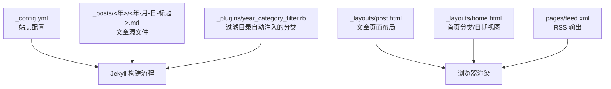
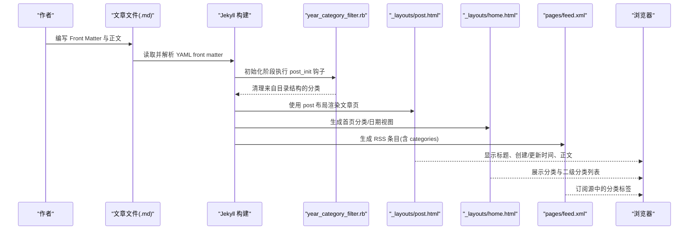
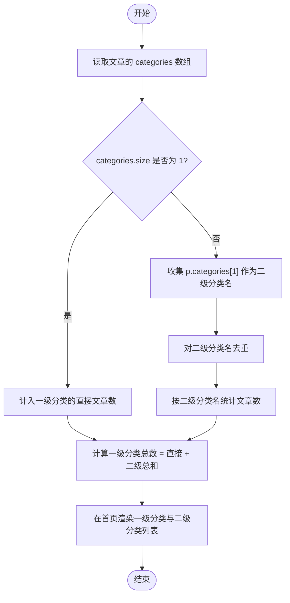
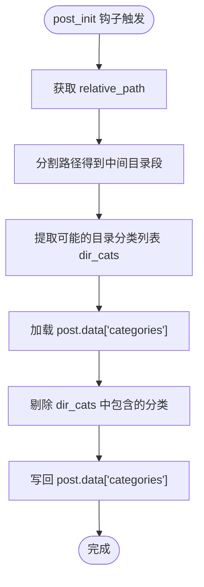
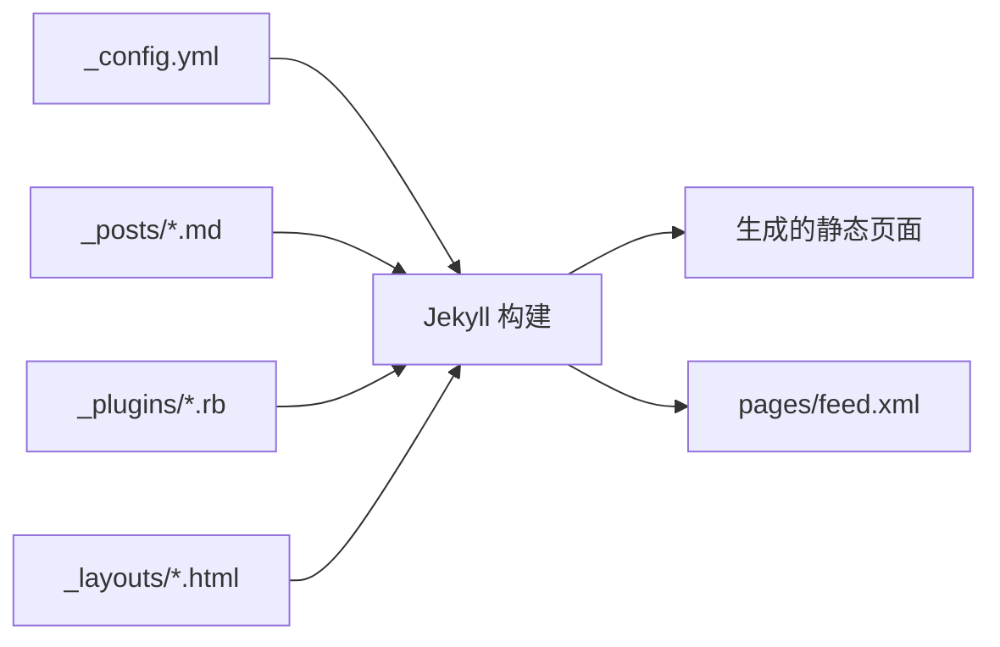

# Markdown 格式规范

<cite>
**本文引用的文件**   
- [_config.yml](file://_config.yml)
- [post.html](file://_layouts/post.html)
- [home.html](file://_layouts/home.html)
- [year_category_filter.rb](file://_plugins/year_category_filter.rb)
- [feed.xml](file://pages/feed.xml)
- [2019-12-12-JeKyll-在-Windows-下本地预览中文路径.md](file://_posts/2019/2019-12-12-JeKyll-在-Windows-下本地预览中文路径.md)
- [2020-02-01-Redis-and-MongoDB-设置密码验证-scrapy-win-ubuntu.md](file://_posts/2020/2020-02-01-Redis-and-MongoDB-设置密码验证-scrapy-win-ubuntu.md)
- [2025-12-06-docker-安装-&-配置流程.md](file://_posts/2025/2025-12-06-docker-安装-&-配置流程.md)
</cite>

## 目录
1. [简介](#简介)
2. [项目结构](#项目结构)
3. [核心组件](#核心组件)
4. [架构总览](#架构总览)
5. [详细组件分析](#详细组件分析)
6. [依赖关系分析](#依赖关系分析)
7. [性能与可维护性建议](#性能与可维护性建议)
8. [故障排查指南](#故障排查指南)
9. [结论](#结论)
10. [附录：Front Matter 字段清单与示例](#附录front-matter-字段清单与示例)

## 简介
本规范面向博客作者，明确文章文件的命名规则、YAML front matter 元数据字段的定义与最佳实践，并说明分类系统的层级支持方式。目标是确保文章内容能够正确渲染、归档与检索，避免常见错误。

## 项目结构
- 站点根目录包含 Jekyll 配置文件、布局模板、插件、文章集合等。
- 文章统一存放于 _posts 目录，按年分文件夹组织，文件名遵循“年-月-日-标题.md”的固定格式。
- 首页通过分类视图和日期视图展示文章；RSS 订阅输出包含分类信息。

图表来源
- [_config.yml:1-45](file://_config.yml#L1-L45)
- [post.html:1-194](file://_layouts/post.html#L1-L194)
- [home.html:1-153](file://_layouts/home.html#L1-L153)
- [year_category_filter.rb:1-13](file://_plugins/year_category_filter.rb#L1-L13)
- [feed.xml:1-30](file://pages/feed.xml#L1-L30)

章节来源
- [_config.yml:1-45](file://_config.yml#L1-L45)
- [home.html:1-153](file://_layouts/home.html#L1-L153)
- [post.html:1-194](file://_layouts/post.html#L1-L194)
- [year_category_filter.rb:1-13](file://_plugins/year_category_filter.rb#L1-L13)
- [feed.xml:1-30](file://pages/feed.xml#L1-L30)

## 核心组件
- 站点配置（_config.yml）：定义主题、Markdown 解析器、代码高亮、永久链接格式等。
- 文章布局（_layouts/post.html）：渲染文章标题、创建/更新时间、正文内容等。
- 首页布局（_layouts/home.html）：提供“分类”和“日期”两种视图，支持一级与二级分类的聚合与计数。
- 分类过滤插件（_plugins/year_category_filter.rb）：移除由 _posts 子目录自动注入的分类，仅保留 front matter 中显式定义的 categories。
- RSS 输出（pages/feed.xml）：将每篇文章的 tags 与 categories 写入 feed。

章节来源
- [_config.yml:1-45](file://_config.yml#L1-L45)
- [post.html:1-194](file://_layouts/post.html#L1-L194)
- [home.html:1-153](file://_layouts/home.html#L1-L153)
- [year_category_filter.rb:1-13](file://_plugins/year_category_filter.rb#L1-L13)
- [feed.xml:1-30](file://pages/feed.xml#L1-L30)

## 架构总览
下图展示了从文章到最终页面的关键处理链路，包括 front matter 解析、分类过滤、页面渲染与 RSS 输出。

图表来源
- [year_category_filter.rb:1-13](file://_plugins/year_category_filter.rb#L1-L13)
- [post.html:1-194](file://_layouts/post.html#L1-L194)
- [home.html:1-153](file://_layouts/home.html#L1-L153)
- [feed.xml:1-30](file://pages/feed.xml#L1-L30)

## 详细组件分析

### 文章文件命名规则
- 位置：_posts 目录下按年份建立子目录。
- 文件名格式：YYYY-MM-DD-标题.md
- 说明：
  - 年份用于归档与时间排序。
  - 日期精确到日，保证同一天的多篇文章可通过标题区分。
  - 标题建议使用可读性强的中文或英文，避免特殊字符导致 URL 异常。
- 参考示例：
  - [2019-12-12-JeKyll-在-Windows-下本地预览中文路径.md](file://_posts/2019/2019-12-12-JeKyll-在-Windows-下本地预览中文路径.md)
  - [2020-02-01-Redis-and-MongoDB-设置密码验证-scrapy-win-ubuntu.md](file://_posts/2020/2020-02-01-Redis-and-MongoDB-设置密码验证-scrapy-win-ubuntu.md)
  - [2025-12-06-docker-安装-&-配置流程.md](file://_posts/2025/2025-12-06-docker-安装-&-配置流程.md)

章节来源
- [2019-12-12-JeKyll-在-Windows-下本地预览中文路径.md:1-44](file://_posts/2019/2019-12-12-JeKyll-在-Windows-下本地预览中文路径.md#L1-L44)
- [2020-02-01-Redis-and-MongoDB-设置密码验证-scrapy-win-ubuntu.md:1-74](file://_posts/2020/2020-02-01-Redis-and-MongoDB-设置密码验证-scrapy-win-ubuntu.md#L1-L74)
- [2025-12-06-docker-安装-&-配置流程.md:1-256](file://_posts/2025/2025-12-06-docker-安装-&-配置流程.md#L1-L256)

### YAML Front Matter 元数据字段定义与用法
- layout
  - 用途：指定页面使用的布局模板。
  - 值：字符串，如 post。
  - 影响：决定页面结构与样式。
- title
  - 用途：文章标题。
  - 值：字符串。
  - 影响：页面标题、归档列表显示。
- create_time
  - 用途：文章创建时间。
  - 值：时间字符串（例如 YYYY-MM-DD HH:mm）。
  - 影响：在文章页以“创建：”形式展示。
- update_time
  - 用途：文章更新时间。
  - 值：时间字符串（可选）。
  - 影响：若未设置则回退为 create_time；否则以“更新：”形式展示。
- categories
  - 用途：文章分类，支持数组。
  - 值：字符串数组，如 ["Python", "爬虫"]。
  - 影响：首页分类视图与 RSS 输出；支持一级与二级分类的聚合与计数。

章节来源
- [post.html:1-194](file://_layouts/post.html#L1-L194)
- [home.html:1-153](file://_layouts/home.html#L1-L153)
- [feed.xml:1-30](file://pages/feed.xml#L1-L30)

### 分类系统层级结构支持
- 一级分类：categories 数组长度为 1，如 ["Docker"]。
- 二级分类：categories 数组长度大于 1，如 ["Database", "MongoDB"]。
- 首页分类视图逻辑：
  - 统计直接归属的文章数（categories.size == 1）。
  - 收集并去重二级分类名（p.categories[1]），并按二级分类分组统计文章数。
  - 一级分类总数 = 直接文章数 + 所有二级分类文章数之和。
- 注意：
  - 当前实现仅支持两级分类（一级与二级）。
  - 三级及以上分类不会被识别为独立分组。

图表来源
- [home.html:25-102](file://_layouts/home.html#L25-L102)

章节来源
- [home.html:1-153](file://_layouts/home.html#L1-L153)

### 分类过滤插件行为
- 目的：防止 Jekyll 将 _posts 下的子目录名自动注入为分类，确保分类仅来源于 front matter。
- 机制：
  - 在 posts 的 post_init 钩子中，提取相对路径中 _posts 与文件名之间的所有子目录名。
  - 从 post.data["categories"] 中剔除这些目录名对应的分类。
- 结果：即使文章位于多级目录结构中，也不会被自动打上目录名作为分类。

图表来源
- [year_category_filter.rb:1-13](file://_plugins/year_category_filter.rb#L1-L13)

章节来源
- [year_category_filter.rb:1-13](file://_plugins/year_category_filter.rb#L1-L13)

### 文章页渲染与时间展示
- 标题：使用 page.title 渲染。
- 创建时间：若存在 page.create_time，则以“创建：YYYY.MM.DD HH:MM”展示。
- 更新时间：若存在 page.update_time，则以“更新：YYYY.MM.DD HH:MM”展示；否则回退为 create_time。
- 其他元信息：author、date 等可按需扩展。

章节来源
- [post.html:1-194](file://_layouts/post.html#L1-L194)

### RSS 输出与分类
- RSS 条目包含每篇文章的 tags 与 categories。
- 分类会逐条写入 <category> 节点，便于订阅客户端进行筛选。

章节来源
- [feed.xml:1-30](file://pages/feed.xml#L1-L30)

## 依赖关系分析
- 站点配置（_config.yml）驱动 Jekyll 构建行为，包括 permalink 格式、Markdown 解析器与插件启用。
- 文章文件（_posts/*.md）通过 front matter 提供元数据，供布局与插件消费。
- 布局模板（_layouts/*）负责页面渲染与交互增强。
- 插件（_plugins/*）在构建期修改文章数据，确保分类一致性。
- RSS 输出（pages/feed.xml）依赖 site.posts 与 post.categories。

图表来源
- [_config.yml:1-45](file://_config.yml#L1-L45)
- [year_category_filter.rb:1-13](file://_plugins/year_category_filter.rb#L1-L13)
- [post.html:1-194](file://_layouts/post.html#L1-L194)
- [home.html:1-153](file://_layouts/home.html#L1-L153)
- [feed.xml:1-30](file://pages/feed.xml#L1-L30)

章节来源
- [_config.yml:1-45](file://_config.yml#L1-L45)
- [year_category_filter.rb:1-13](file://_plugins/year_category_filter.rb#L1-L13)
- [post.html:1-194](file://_layouts/post.html#L1-L194)
- [home.html:1-153](file://_layouts/home.html#L1-L153)
- [feed.xml:1-30](file://pages/feed.xml#L1-L30)

## 性能与可维护性建议
- 保持 categories 数组简洁，优先使用一级与二级分类，避免过深嵌套导致首页渲染复杂。
- 控制单篇文章的 categories 数量，避免过多标签造成首页统计与渲染开销。
- 合理设置 create_time 与 update_time，减少不必要的重复渲染与缓存失效。
- 定期清理冗余图片与资源，提升页面加载速度。

## 故障排查指南
- 问题：文章未在首页分类视图中出现
  - 可能原因：categories 为空或未定义；或使用了超过两级的分类。
  - 解决方案：在 front matter 中显式添加 categories，并确保数组长度不超过 2。
- 问题：分类名称与目录名不一致
  - 可能原因：Jekyll 默认会将 _posts 子目录名注入为分类。
  - 解决方案：确认 year_category_filter.rb 已启用，确保只保留 front matter 中的分类。
- 问题：创建/更新时间未显示或显示不正确
  - 可能原因：create_time 或 update_time 格式不符合预期。
  - 解决方案：使用“YYYY-MM-DD HH:mm”格式，并确保字段存在于 front matter。
- 问题：RSS 订阅缺少分类
  - 可能原因：categories 未定义或被过滤。
  - 解决方案：检查 front matter 的 categories 与插件行为。

章节来源
- [year_category_filter.rb:1-13](file://_plugins/year_category_filter.rb#L1-L13)
- [post.html:1-194](file://_layouts/post.html#L1-L194)
- [home.html:1-153](file://_layouts/home.html#L1-L153)
- [feed.xml:1-30](file://pages/feed.xml#L1-L30)

## 结论
遵循本文的命名与 front matter 规范，配合分类过滤插件与首页布局逻辑，可以确保文章正确渲染、归档与检索。建议在写作时保持分类体系清晰、元数据完整，以获得最佳的浏览与订阅体验。

## 附录：Front Matter 字段清单与示例

- 字段清单
  - layout: 字符串，如 post
  - title: 字符串，文章标题
  - create_time: 时间字符串，如 YYYY-MM-DD HH:mm
  - update_time: 时间字符串，可选
  - categories: 字符串数组，支持一级与二级分类

- 示例路径（请根据实际文件查看具体写法）
  - [2019-12-12-JeKyll-在-Windows-下本地预览中文路径.md](file://_posts/2019/2019-12-12-JeKyll-在-Windows-下本地预览中文路径.md)
  - [2020-02-01-Redis-and-MongoDB-设置密码验证-scrapy-win-ubuntu.md](file://_posts/2020/2020-02-01-Redis-and-MongoDB-设置密码验证-scrapy-win-ubuntu.md)
  - [2025-12-06-docker-安装-&-配置流程.md](file://_posts/2025/2025-12-06-docker-安装-&-配置流程.md)

章节来源
- [2019-12-12-JeKyll-在-Windows-下本地预览中文路径.md:1-44](file://_posts/2019/2019-12-12-JeKyll-在-Windows-下本地预览中文路径.md#L1-L44)
- [2020-02-01-Redis-and-MongoDB-设置密码验证-scrapy-win-ubuntu.md:1-74](file://_posts/2020/2020-02-01-Redis-and-MongoDB-设置密码验证-scrapy-win-ubuntu.md#L1-L74)
- [2025-12-06-docker-安装-&-配置流程.md:1-256](file://_posts/2025/2025-12-06-docker-安装-&-配置流程.md#L1-L256)