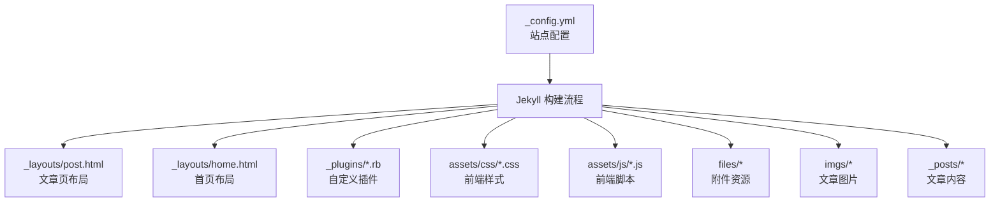
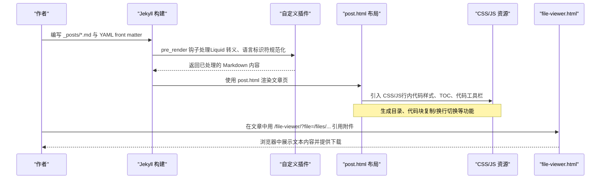
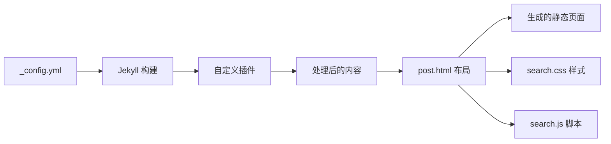

# 内容创作指南

<cite>
**本文引用的文件**
- [站点配置 _config.yml](file://_config.yml)
- [文章布局 post.html](file://_layouts/post.html)
- [首页布局 home.html](file://_layouts/home.html)
- [README 文档](file://README.md)
- [Markdown 技巧示例文章](file://_posts/2019/2019-12-19-Markdown-技巧.md)
- [搜索样式 search.css（含行内代码语义样式）](file://assets/css/search.css)
- [附件在线查看器 file-viewer.html](file://file-viewer.html)
- [插件：自动转义 Liquid 与修复有序列表代码块 escape_code_liquid.rb](file://_plugins/escape_code_liquid.rb)
- [插件：规范化代码语言标识符 normalize_code_lang.rb](file://_plugins/normalize_code_lang.rb)
</cite>

## 目录
1. [简介](#简介)
2. [项目结构](#项目结构)
3. [核心组件](#核心组件)
4. [架构总览](#架构总览)
5. [详细组件分析](#详细组件分析)
6. [依赖关系分析](#依赖关系分析)
7. [性能与体验优化建议](#性能与体验优化建议)
8. [故障排查指南](#故障排查指南)
9. [结论](#结论)
10. [附录：写作规范速查](#附录写作规范速查)

## 简介
本指南面向博客作者，提供一套完整的内容创作规范与实践建议。涵盖 Markdown 文章格式、YAML front matter 元数据定义、图片引用方式、代码块最佳实践、行内代码语义样式、分级提示框、文字颜色标注、附件在线预览、以及文章间引用等。目标是帮助作者高效产出高质量技术博客。

## 项目结构
本项目基于 Jekyll + Minima 主题深度定制，采用“按年份组织文章”的结构，并配套自定义插件与前端增强能力。



图表来源
- [站点配置 _config.yml:1-45](file://_config.yml#L1-L45)
- [文章布局 post.html:1-194](file://_layouts/post.html#L1-L194)
- [首页布局 home.html:66-93](file://_layouts/home.html#L66-L93)
- [搜索样式 search.css:211-276](file://assets/css/search.css#L211-L276)
- [附件在线查看器 file-viewer.html:1-80](file://file-viewer.html#L1-L80)
- [插件：自动转义 Liquid 与修复有序列表代码块 escape_code_liquid.rb:1-62](file://_plugins/escape_code_liquid.rb#L1-L62)
- [插件：规范化代码语言标识符 normalize_code_lang.rb:1-42](file://_plugins/normalize_code_lang.rb#L1-L42)

章节来源
- [站点配置 _config.yml:1-45](file://_config.yml#L1-L45)
- [README 文档:26-62](file://README.md#L26-L62)

## 核心组件
- 站点配置与构建设置：包括主题、Markdown 解析器、高亮器、永久链接格式、插件列表等。
- 文章布局：渲染文章标题、创建/更新时间、作者、正文、评论、目录侧边栏、代码块工具栏等。
- 自定义插件：在渲染前对代码块进行 Liquid 转义与语言标识符规范化，提升可写性与兼容性。
- 前端增强：行内代码语义样式、提示框样式、代码块复制与换行切换、目录导航等。
- 附件在线预览：通过独立页面加载 files 目录下的文本文件，提供下载按钮。

章节来源
- [站点配置 _config.yml:35-45](file://_config.yml#L35-L45)
- [文章布局 post.html:1-194](file://_layouts/post.html#L1-L194)
- [插件：自动转义 Liquid 与修复有序列表代码块 escape_code_liquid.rb:1-62](file://_plugins/escape_code_liquid.rb#L1-L62)
- [插件：规范化代码语言标识符 normalize_code_lang.rb:1-42](file://_plugins/normalize_code_lang.rb#L1-L42)
- [搜索样式 search.css:211-276](file://assets/css/search.css#L211-L276)
- [附件在线查看器 file-viewer.html:1-80](file://file-viewer.html#L1-L80)

## 架构总览
从作者视角到最终页面的关键路径如下：



图表来源
- [站点配置 _config.yml:35-45](file://_config.yml#L35-L45)
- [插件：自动转义 Liquid 与修复有序列表代码块 escape_code_liquid.rb:1-62](file://_plugins/escape_code_liquid.rb#L1-L62)
- [插件：规范化代码语言标识符 normalize_code_lang.rb:1-42](file://_plugins/normalize_code_lang.rb#L1-L42)
- [文章布局 post.html:1-194](file://_layouts/post.html#L1-L194)
- [附件在线查看器 file-viewer.html:1-80](file://file-viewer.html#L1-L80)

## 详细组件分析

### 文章结构与 Front Matter 规范
- 文件名规范：年-月-日-标题.md，位于对应年份子目录（如 _posts/2026/）。
- Front Matter 必需字段：
  - layout: 固定为 post
  - title: 文章标题
  - create_time: 创建时间（精确到分可选）
  - update_time: 更新时间（可选；未设置时默认显示创建时间）
  - categories: 分类数组，支持层级（如 [Python,爬虫]），用于首页分类导航
- 其他说明：
  - 日期格式由站点配置控制，Minima 的 date_format 影响文章发布时间显示。
  - 作者字段 author 可在布局中渲染。

章节来源
- [README 文档:134-156](file://README.md#L134-L156)
- [文章布局 post.html:8-25](file://_layouts/post.html#L8-L25)
- [站点配置 _config.yml:12-16](file://_config.yml#L12-L16)

### 图片引用方式
- 将图片放入 imgs/ 目录，按主题或年份组织（例如 imgs/python/2026/截图.png）。
- 在文章中引用：。
- 本地预览无需提交到 git 即可立即显示。

章节来源
- [README 文档:157-158](file://README.md#L157-L158)
- [README 文档:275-278](file://README.md#L275-L278)

### 代码块最佳实践
- 语言标识符规范化：
  - 插件会自动修正常见不规范标识符（如 “Plain Text”、“C++”、“Dockerfile” 等），并统一小写。
  - 支持 ``` 和 ~~~ 两种围栏标记；有序列表内的缩进代码块会被自动转换以避免渲染问题。
- Liquid 语法冲突处理：
  - 自动为围栏代码块、行内代码、HTML <code> 标签中的 {{ }} 添加  保护，避免被 Liquid 提前解析。
- 代码块工具栏：
  - 自动生成语言标签、复制按钮、换行切换按钮，提升阅读与操作体验。

章节来源
- [插件：规范化代码语言标识符 normalize_code_lang.rb](file://_plugins/normalize_code_lang.rb#L1-L42)
- [插件：自动转义 Liquid 与修复有序列表代码块 escape_code_liquid.rb](file://_plugins/escape_code_liquid.rb#L1-L62)
- [文章布局 post.html](file://_layouts/post.html#L115-L193)

### 行内代码语义样式
- 使用方法：在 Markdown 中使用 HTML <code class="xxx"> 标签为特定行内代码添加语义化样式。
- 支持的类名与用途：
  - .cmd：命令（docker、git、npm 等）
  - .path：文件路径
  - .flag：参数选项（--format、-v 等）
  - .val：值（IP、端口、字符串等）
  - .key：按键（Ctrl+C、Enter、Tab 等）
- 效果：
  - 不同类名对应不同颜色与权重，暗色模式自动适配。
  - 兼容标准 Markdown 预览（显示为普通行内代码）。

章节来源
- [README 文档](file://README.md#L159-L176)
- [搜索样式 search.css](file://assets/css/search.css#L216-L268)

### 分级提示框（info、tip、warning、danger）
- 插入语法：使用 <blockquote class="xxx"> 包裹内容，class 值决定级别与样式。
- 支持类型：
  - info：信息（背景知识、补充说明）
  - tip：提示（最佳实践、小技巧）
  - warning：警告（需注意、易踩坑）
  - danger：危险（危险操作、数据丢失风险）
- GitHub 原生告警语法兼容：
  - > [!NOTE] / [!TIP] / [!WARNING] / [!CAUTION] 可获得相同效果。

章节来源
- [README 文档](file://README.md#L178-L216)

### 文字颜色标注技巧
- 使用方法：使用 <span style="color:xxx"> 为文字添加颜色。
- 常用颜色与场景：
  - red：警告、禁止操作、危险提示
  - orange：注意事项、需关注
  - green：成功、推荐操作
  - #3b82f6：信息补充、链接说明
  - purple：备注、特殊说明
  - gray：次要信息、已废弃

章节来源
- [README 文档](file://README.md#L218-L236)

### 附件在线预览功能
- 实现方式：
  - 独立页面 file-viewer.html 接收 URL 参数 ?file=，读取 files/ 目录下的文本文件并以预格式化方式展示。
  - 页面顶部提供「下载文件」按钮，方便直接保存。
- 引用格式：
  - 在文章中使用 [文件名](/file-viewer/?file=/files/路径/文件名) 进行引用。
- 历史行为：
  - 直接访问 /files/xxx 仍保持原行为（下载或原生显示）。

章节来源
- [README 文档](file://README.md#L238-L248)
- [附件在线查看器 file-viewer.html](file://file-viewer.html#L1-L80)

### 文章间引用（post_url 标签）
- 用法：使用 Jekyll 的 post_url 标签引用文章，构建时自动解析为正确链接。
- 路径规则：
  - 路径为 _posts/ 下的子目录 + 文件名（不含 .md）。
  - 示例：_posts/2025/2025-02-22-docker-查看已有网络的内网-ip.md → 2025/2025-02-22-docker-查看已有网络的内网-ip
- 优势：
  - 无需记忆 permalink 格式。
  - 引用不存在时构建会报错，便于维护。

章节来源
- [README 文档](file://README.md#L250-L263)

### 首页分类与归档
- 分类支持层级（如 [Python,爬虫]），首页根据分类与二级分类进行分组展示。
- 单级分类直接列出文章；多级分类以二级分类为节折叠展示。

章节来源
- [首页布局 home.html](file://_layouts/home.html#L66-L93)

## 依赖关系分析
- 站点配置驱动构建：
  - markdown: kramdown（GitHub Flavored Markdown）
  - highlighter: rouge（代码高亮）
  - permalink: /:year/:month/:day/:title.html（文章永久链接格式）
  - plugins: jekyll-sitemap、jekyll-seo-tag、jekyll-feed
- 插件与布局协作：
  - 插件在 pre_render 阶段修改内容，确保代码块与 Liquid 兼容。
  - 布局负责渲染元信息、正文、评论、目录与代码工具栏。
- 前端资源：
  - CSS 提供行内代码语义样式与提示框样式。
  - JS 提供目录导航、代码块复制与换行切换。



图表来源
- [站点配置 _config.yml](file://_config.yml#L35-L45)
- [插件：自动转义 Liquid 与修复有序列表代码块 escape_code_liquid.rb](file://_plugins/escape_code_liquid.rb#L1-L62)
- [插件：规范化代码语言标识符 normalize_code_lang.rb](file://_plugins/normalize_code_lang.rb#L1-L42)
- [文章布局 post.html](file://_layouts/post.html#L1-L194)
- [搜索样式 search.css](file://assets/css/search.css#L211-L276)

章节来源
- [站点配置 _config.yml](file://_config.yml#L35-L45)
- [README 文档](file://README.md#L322-L331)

## 性能与体验优化建议
- 代码块过长时自动折叠，保持页面整洁（布局内置逻辑）。
- 使用语义化行内代码样式提升可读性，减少大段代码块的视觉负担。
- 合理使用提示框与颜色标注，突出重点信息，避免过度装饰。
- 附件尽量使用在线查看器，避免浏览器直接下载导致的体验中断。

[本节为通用建议，不直接分析具体文件]

## 故障排查指南
- 构建缓存导致页面未更新或样式错乱：
  - 清理 _site 目录后重新构建并启动服务。
- 改了 _config.yml 后未生效：
  - 重启 jekyll serve。
- 有序列表内代码块无法渲染：
  - 插件会自动将缩进的 ``` 转换为 ~~~，无需手动处理。
- 代码中包含 {{ }} 被 Liquid 提前解析：
  - 插件会自动添加  保护，无需手动处理。
- 附件在线预览失败：
  - 检查 URL 参数 ?file= 是否正确，确认文件存在于 files/ 目录且路径可达。

章节来源
- [README 文档:281-294](file://README.md#L281-L294)
- [插件：自动转义 Liquid 与修复有序列表代码块 escape_code_liquid.rb:1-62](file://_plugins/escape_code_liquid.rb#L1-L62)
- [附件在线查看器 file-viewer.html:45-77](file://file-viewer.html#L45-L77)

## 结论
通过统一的写作规范与丰富的前端增强能力，作者可以专注于内容本身，同时获得一致的排版与交互体验。遵循本指南的规范与建议，有助于产出高质量、易读、易维护的技术博客。

[本节为总结性内容，不直接分析具体文件]

## 附录：写作规范速查
- Front Matter 必填字段：layout、title、create_time、categories；update_time 可选。
- 图片引用：/imgs/路径/图片.png。
- 代码块：
  - 语言标识符自动规范化，无需担心大小写或空格。
  - 代码中的 {{ }} 自动转义，无需手动处理。
  - 使用代码块工具栏进行复制与换行切换。
- 行内代码语义样式：<code class="cmd|path|flag|val|key">...</code>。
- 提示框：<blockquote class="info|tip|warning|danger">...</blockquote>。
- 文字颜色：<span style="color:xxx">...</span>。
- 附件在线预览：[文件名](/file-viewer/?file=/files/路径/文件名)。
- 文章引用：[显示文字]()。

章节来源
- [README 文档:134-263](file://README.md#L134-L263)
- [搜索样式 search.css:216-268](file://assets/css/search.css#L216-L268)
- [附件在线查看器 file-viewer.html:1-80](file://file-viewer.html#L1-L80)
- [文章布局 post.html:115-193](file://_layouts/post.html#L115-L193)