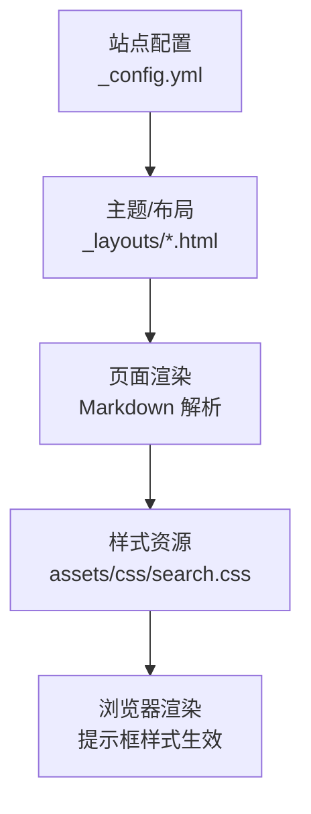
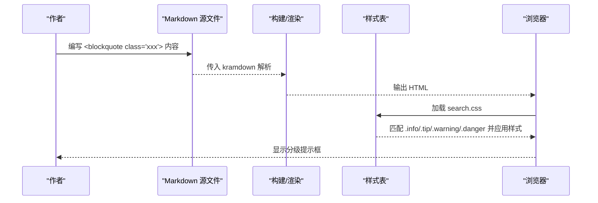

# 分级提示框

<cite>
**本文引用的文件**   
- [README.md](file://README.md)
- [search.css](file://assets/css/search.css)
</cite>

## 目录
1. [简介](#简介)
2. [项目结构](#项目结构)
3. [核心组件](#核心组件)
4. [架构总览](#架构总览)
5. [详细组件分析](#详细组件分析)
6. [依赖关系分析](#依赖关系分析)
7. [性能与可访问性建议](#性能与可访问性建议)
8. [故障排查指南](#故障排查指南)
9. [结论](#结论)
10. [附录：使用示例与效果预览](#附录使用示例与效果预览)

## 简介
本章节面向作者，系统介绍“分级提示框”的使用方法。通过为引用块添加特定 class，可在文章中以四种语义化类型呈现信息、提示、警告与危险提醒；同时说明与 GitHub 原生告警语法的兼容方式，并提供自定义扩展样式的思路。

## 项目结构
与分级提示框相关的实现集中在样式文件中，文档说明位于仓库根 README。

图表来源
- [README.md:178-216](file://README.md#L178-L216)
- [search.css:277-332](file://assets/css/search.css#L277-L332)

章节来源
- [README.md:178-216](file://README.md#L178-L216)
- [search.css:277-332](file://assets/css/search.css#L277-L332)

## 核心组件
- 语法入口：在 Markdown 中使用 HTML 引用块并指定 class，即可启用对应级别的提示框。
- 支持类型：info（信息）、tip（提示）、warning（警告）、danger（危险）。
- 渲染机制：CSS 根据 class 选择器设置左侧边框颜色、背景色以及伪元素标题，从而形成视觉层级。
- 兼容性：GitHub 原生告警语法在 GitHub 上可直接渲染为相同效果的提示框。

章节来源
- [README.md:178-216](file://README.md#L178-L216)
- [search.css:290-332](file://assets/css/search.css#L290-L332)

## 架构总览
从内容到渲染的链路如下：作者在文章中写入带 class 的引用块 → Jekyll/kramdown 生成 HTML → 浏览器加载样式表 → CSS 规则匹配 class 并应用样式。

图表来源
- [README.md:178-216](file://README.md#L178-L216)
- [search.css:290-332](file://assets/css/search.css#L290-L332)

## 详细组件分析

### 语法与适用场景
- 基础语法：在文章中使用带 class 的引用块标签，class 值可为 info、tip、warning、danger。
- 适用场景：
  - info：用于背景知识、补充说明等中性信息。
  - tip：用于最佳实践、小技巧等正向建议。
  - warning：用于注意事项、易踩坑等需要留意的内容。
  - danger：用于危险操作、数据丢失风险等强警示内容。

章节来源
- [README.md:182-196](file://README.md#L182-L196)

### 渲染原理与样式要点
- 选择器：针对 blockquote.info、blockquote.tip、blockquote.warning、blockquote.danger 分别定义左侧边框颜色与背景色。
- 标题文本：通过 ::before 伪元素插入对应类型的中文标题与图标，增强可读性。
- 暗色模式：在 prefers-color-scheme: dark 下提供适配的背景与标题颜色，保证对比度。

章节来源
- [search.css:290-332](file://assets/css/search.css#L290-L332)

### 与 GitHub 原生告警语法的兼容
- 在 GitHub 上写文章时，可使用原生告警语法获得相同效果，包括：
  - > [!NOTE]
  - > [!TIP]
  - > [!WARNING]
  - > [!CAUTION]
- 该语法由 GitHub 平台侧渲染，与本博客的 CSS 提示框在语义与视觉效果上保持一致。

章节来源
- [README.md:216](file://README.md#L216)

### 自定义扩展方法
- 新增类型：在样式表中为新的 class 增加对应的边框色、背景色与 ::before 标题文本，即可快速扩展新级别。
- 调整风格：修改现有类的边框宽度、圆角、内边距或字体大小，以统一全站风格。
- 暗色适配：确保在 prefers-color-scheme: dark 中为新类提供合适的颜色组合，避免对比度不足。

章节来源
- [search.css:290-332](file://assets/css/search.css#L290-L332)

## 依赖关系分析
- 样式依赖：提示框样式依赖于全局 CSS 变量与基础排版规则，确保在不同主题模式下表现一致。
- 内容依赖：文章中的 HTML 引用块需正确闭合且 class 拼写准确，否则无法命中样式规则。
- 平台差异：GitHub 原生告警语法仅在 GitHub 环境生效；本地或自建站点需使用 HTML + CSS 方案。

章节来源
- [README.md:178-216](file://README.md#L178-L216)
- [search.css:277-332](file://assets/css/search.css#L277-L332)

## 性能与可访问性建议
- 性能：仅使用 CSS 伪元素与选择器，无额外脚本开销，渲染成本低。
- 可访问性：
  - 保持足够的色彩对比度，尤其在暗色模式下。
  - 标题文本由伪元素注入，若需提升屏幕阅读器体验，可在内容中显式包含标题或使用 aria-label。
  - 避免过度使用高饱和色，减少视觉疲劳。

[本节为通用建议，不直接分析具体文件]

## 故障排查指南
- 未生效
  - 检查是否引入样式表，确认路径与文件名正确。
  - 确认 class 拼写无误，且未被其他样式覆盖。
- 暗色模式异常
  - 检查 prefers-color-scheme: dark 分支是否为新类提供了适配颜色。
- 标题缺失
  - 确认 ::before 伪元素的 content 已正确定义。
- GitHub 原生语法无效
  - 确认在 GitHub 编辑器中使用正确的语法格式，并确保网络可达。

章节来源
- [README.md:178-216](file://README.md#L178-L216)
- [search.css:290-332](file://assets/css/search.css#L290-L332)

## 结论
通过为引用块添加语义化 class，配合简洁的 CSS 规则，即可实现四级分级提示框；同时兼容 GitHub 原生告警语法，便于跨平台写作。按需扩展样式与暗色适配，即可满足多样化表达需求。

[本节为总结性内容，不直接分析具体文件]

## 附录：使用示例与效果预览
- 基础用法
  - 在文章中使用带 class 的引用块，例如将 class 设置为 warning，即可得到警告风格的提示框。
- 效果预览
  - 参考 README 中提供的四类提示框实际渲染效果，分别对应信息、提示、警告与危险。
- GitHub 原生语法
  - 在 GitHub 上使用 > [!NOTE] / > [!TIP] / > [!WARNING] / > [!CAUTION] 可获得相同效果。

章节来源
- [README.md:191-216](file://README.md#L191-L216)