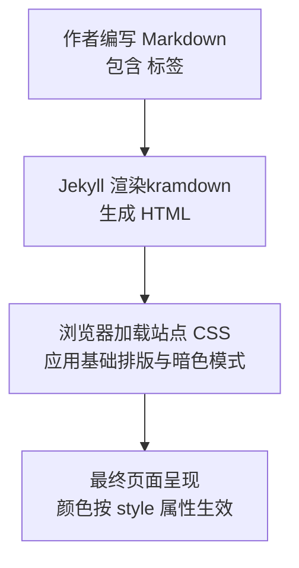
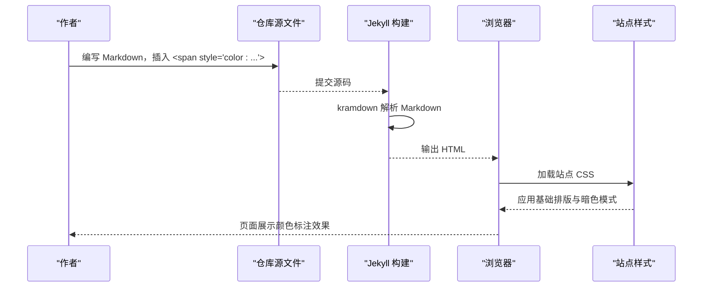
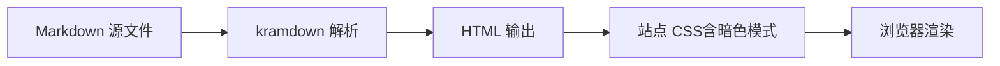

# 文字颜色标注

<cite>
**本文引用的文件**   
- [README.md](file://README.md)
- [2019-12-19-SSH-配置密钥登录.md](file://_posts/2019/2019-12-19-SSH-配置密钥登录.md)
- [2026-01-10-SSH-限制-IP-段登录.md](file://_posts/2026/2026-01-10-SSH-限制-IP-段登录.md)
- [2026-02-07-配置-https-ip-port-访问.md](file://_posts/2026/2026-02-07-配置-https-ip-port-访问.md)
- [search.css](file://assets/css/search.css)
- [_config.yml](file://_config.yml)
</cite>

## 目录
1. [简介](#简介)
2. [项目结构](#项目结构)
3. [核心组件](#核心组件)
4. [架构总览](#架构总览)
5. [详细组件分析](#详细组件分析)
6. [依赖关系分析](#依赖关系分析)
7. [性能与可访问性考虑](#性能与可访问性考虑)
8. [故障排查指南](#故障排查指南)
9. [结论](#结论)
10. [附录：常用颜色与示例速查](#附录常用颜色与示例速查)

## 简介
本章节面向在博客中使用 Markdown 写作的作者，系统介绍“文字颜色标注”的实现方式、使用场景与最佳实践。通过行内 HTML 的 `` 语法，可在文章中对关键信息进行高亮提示，提升可读性与重点突出效果。文档同时说明在 GitHub 等平台的 Markdown 预览中的显示特性，并给出颜色选择建议与常见问题的处理方法。

## 项目结构
本项目基于 Jekyll + Minima 主题构建，Markdown 解析器为 kramdown。颜色标注功能不依赖额外插件，直接通过行内 HTML 实现；样式由站点 CSS 提供基础排版支持。

图表来源
- [README.md:219-236](file://README.md#L219-L236)
- [_config.yml:37-38](file://_config.yml#L37-L38)
- [search.css:64-76](file://assets/css/search.css#L64-L76)

章节来源
- [_config.yml:37-38](file://_config.yml#L37-L38)

## 核心组件
- 行内颜色标注语法：使用 `内容` 对任意文本进行着色。
- 常用颜色值与语义化场景：
  - 红色 red：警告、禁止操作、危险提示
  - 橙色 orange：注意事项、需关注
  - 绿色 green：成功、推荐操作
  - 蓝色 #3b82f6：信息补充、链接说明
  - 紫色 purple：备注、特殊说明
  - 灰色 gray：次要信息、已废弃
- 预览行为：在 GitHub 等平台原生 Markdown 预览中，HTML 标签会作为原始 HTML 显示；但在本站点构建后的页面中，颜色将正常渲染。

章节来源
- [README.md:219-236](file://README.md#L219-L236)

## 架构总览
从写作到呈现的关键链路如下：

图表来源
- [README.md:219-236](file://README.md#L219-L236)
- [_config.yml:37-38](file://_config.yml#L37-L38)
- [search.css:64-76](file://assets/css/search.css#L64-L76)

## 详细组件分析

### 行内颜色标注语法与用法
- 基本语法：在需要着色的文本外层包裹 `...`。
- 适用位置：段落正文、列表项、表格单元格、代码块注释等。
- 组合强调：可与加粗、斜体等 Markdown 语法组合使用，以增强表达力。

章节来源
- [README.md:219-236](file://README.md#L219-L236)

### 常用颜色值与典型应用场景
- 红色 red：用于高风险或强提醒，如重启前保留连接、禁用某操作的警示。
- 橙色 orange：用于需要注意但不紧急的事项，如客户端需手动安装证书。
- 绿色 green：用于成功状态或推荐做法，如配置已生效。
- 蓝色 #3b82f6：用于信息补充或参考说明，如参见官方文档。
- 紫色 purple：用于备注或限定条件，如仅限开发环境。
- 灰色 gray：用于次要信息或已废弃方法，降低视觉权重。

章节来源
- [README.md:225-231](file://README.md#L225-L231)

### 实际使用示例（来自仓库）
- 红色示例（SSH 安全相关）：
  - 在 SSH 密钥登录文章中，使用红色强调“不要断开全部连接，先测试配置是否成功”。
  - 在 SSH IP 段限制文章中，使用红色提醒“重启前保留当前连接，避免配置错误导致无法登录”。
- 橙色示例（HTTPS 方案说明）：
  - 在 HTTPS 配置文章中，使用橙色提示“需要客户端手动安装证书来信任”。

章节来源
- [2019-12-19-SSH-配置密钥登录.md:37](file://_posts/2019/2019-12-19-SSH-配置密钥登录.md#L37)
- [2026-01-10-SSH-限制-IP-段登录.md:32-34](file://_posts/2026/2026-01-10-SSH-限制-IP-段登录.md#L32-L34)
- [2026-02-07-配置-https-ip-port-访问.md:28](file://_posts/2026/2026-02-07-配置-https-ip-port-访问.md#L28)

### 在 Markdown 预览中的显示特性
- GitHub 等平台原生 Markdown 预览：行内 HTML 可能以原始 HTML 形式显示，不会渲染颜色。
- 站点构建后页面：Jekyll 使用 kramdown 将 Markdown 转为 HTML，颜色标注正常显示。
- 本地预览差异：若使用不支持 HTML 的编辑器预览，可能出现与最终页面不一致的情况。

章节来源
- [README.md:219-221](file://README.md#L219-L221)
- [_config.yml:37-38](file://_config.yml#L37-L38)

### 颜色选择最佳实践
- 语义优先：用颜色传达信息等级（红=危险/禁止，橙=注意，绿=成功/推荐，蓝=信息，紫=备注，灰=次要/废弃）。
- 适度使用：全文中颜色标注不宜过多，避免分散注意力。
- 对比度与可读性：确保颜色与背景有足够对比度，尤其在暗色模式下。
- 一致性：统一团队的颜色语义与色值，便于读者形成阅读习惯。
- 辅助手段：配合加粗、图标或引用块，强化重要信息的层级。

[本节为通用指导，不直接分析具体文件]

## 依赖关系分析
- 渲染引擎：kramdown（负责 Markdown → HTML 转换）。
- 主题与样式：Minima 主题 + 自定义 CSS（提供基础排版与暗色模式适配）。
- 颜色标注：纯前端实现，仅依赖浏览器对行内 style 属性的支持。

图表来源
- [_config.yml:37-38](file://_config.yml#L37-L38)
- [search.css:64-76](file://assets/css/search.css#L64-L76)

章节来源
- [_config.yml:37-38](file://_config.yml#L37-L38)
- [search.css:64-76](file://assets/css/search.css#L64-L76)

## 性能与可访问性考虑
- 性能：行内 style 属性开销极低，几乎不影响构建与渲染性能。
- 可访问性：
  - 避免仅靠颜色传递信息，应辅以文字说明或图标。
  - 保证颜色对比度符合 WCAG 标准，特别是在暗色模式下。
  - 谨慎使用高饱和色，避免造成视觉疲劳。

[本节为通用指导，不直接分析具体文件]

## 故障排查指南
- 问题：在 GitHub 预览中看到原始 HTML 而非颜色效果。
  - 原因：平台原生 Markdown 预览不支持行内 HTML。
  - 处理：查看站点构建后的页面，或使用本地 Jekyll 服务预览。
- 问题：颜色在暗色模式下对比度不足。
  - 原因：浅色字在深色背景上可读性差。
  - 处理：调整色值，提高对比度；或在 CSS 中针对暗色模式优化。
- 问题：颜色标注过多导致阅读困难。
  - 处理：精简颜色使用，聚焦关键信息；结合其他强调手段（加粗、引用块）。

章节来源
- [README.md:219-221](file://README.md#L219-L221)
- [search.css:38-58](file://assets/css/search.css#L38-L58)

## 结论
通过简单的行内 HTML 颜色标注，可以在保持 Markdown 简洁性的同时，有效增强文章的层次与可读性。遵循语义化配色、适度使用与对比度原则，能在不同环境与设备上获得一致的阅读体验。建议在团队内统一颜色规范，并结合引用块、图标等手段，进一步提升信息传达效率。

[本节为总结性内容，不直接分析具体文件]

## 附录：常用颜色与示例速查
- 红色 red：警告、禁止操作、危险提示
  - 示例路径：[2019-12-19-SSH-配置密钥登录.md:37](file://_posts/2019/2019-12-19-SSH-配置密钥登录.md#L37)、[2026-01-10-SSH-限制-IP-段登录.md:32-34](file://_posts/2026/2026-01-10-SSH-限制-IP-段登录.md#L32-L34)
- 橙色 orange：注意事项、需关注
  - 示例路径：[2026-02-07-配置-https-ip-port-访问.md:28](file://_posts/2026/2026-02-07-配置-https-ip-port-访问.md#L28)
- 绿色 green：成功、推荐操作
  - 参考定义：[README.md:227](file://README.md#L227)
- 蓝色 #3b82f6：信息补充、链接说明
  - 参考定义：[README.md:228](file://README.md#L228)
- 紫色 purple：备注、特殊说明
  - 参考定义：[README.md:229](file://README.md#L229)
- 灰色 gray：次要信息、已废弃
  - 参考定义：[README.md:230](file://README.md#L230)

章节来源
- [README.md:225-231](file://README.md#L225-L231)
- [2019-12-19-SSH-配置密钥登录.md:37](file://_posts/2019/2019-12-19-SSH-配置密钥登录.md#L37)
- [2026-01-10-SSH-限制-IP-段登录.md:32-34](file://_posts/2026/2026-01-10-SSH-限制-IP-段登录.md#L32-L34)
- [2026-02-07-配置-https-ip-port-访问.md:28](file://_posts/2026/2026-02-07-配置-https-ip-port-访问.md#L28)