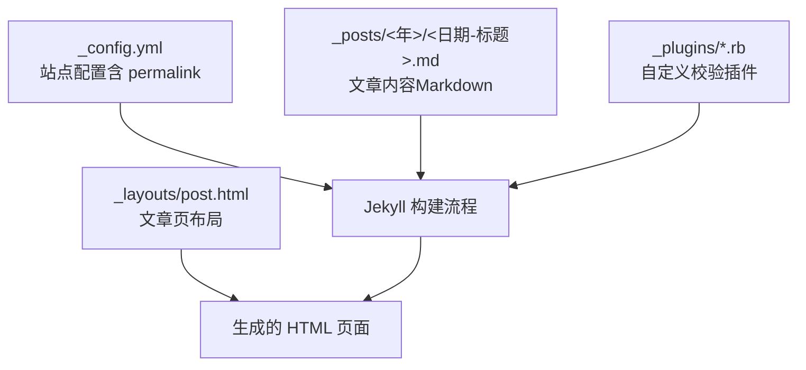
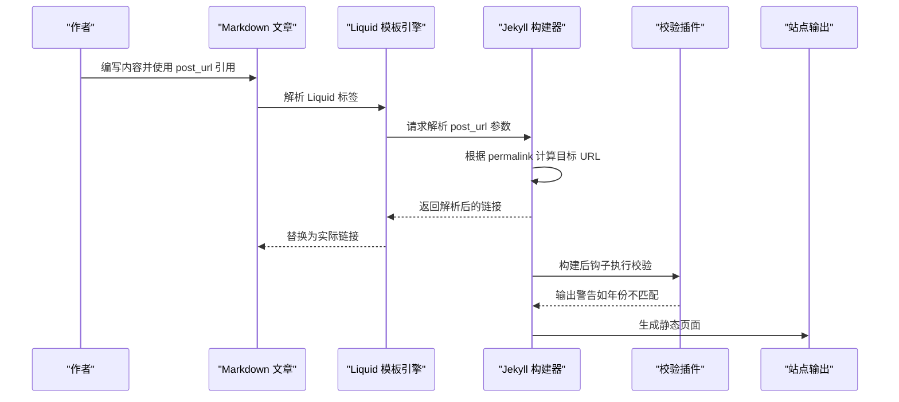
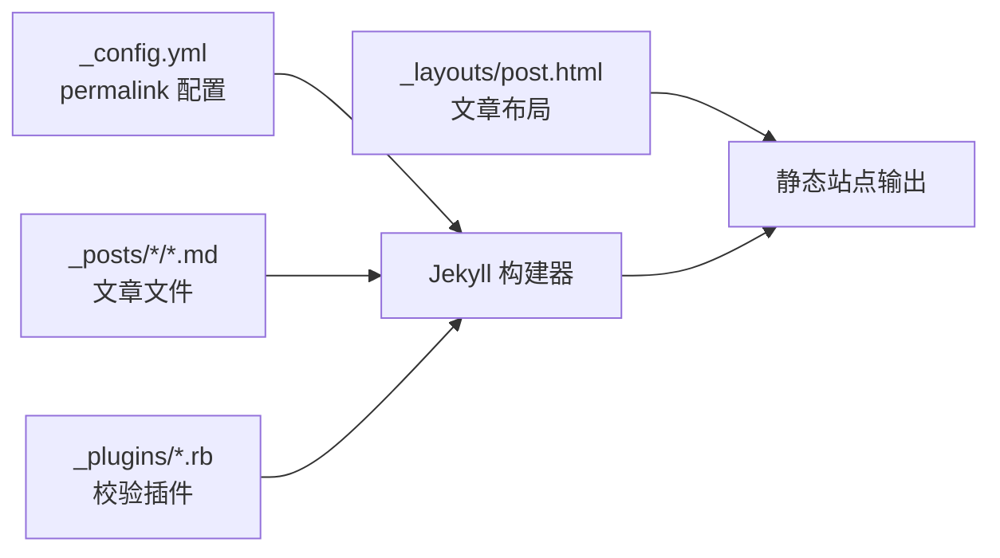

# 文章间引用

<cite>
**本文引用的文件**   
- [_config.yml](file://_config.yml)
- [README.md](file://README.md)
- [_layouts/post.html](file://_layouts/post.html)
- [_plugins/check_post_year_folder.rb](file://_plugins/check_post_year_folder.rb)
- [_plugins/check_missing_images.rb](file://_plugins/check_missing_images.rb)
- [_plugins/year_category_filter.rb](file://_plugins/year_category_filter.rb)
- [_posts/2021/2021-07-27-Babel-AST入门.md](file://_posts/2021/2021-07-27-Babel-AST入门.md)
- [_posts/2020/2020-11-22-jsdom-解决-nodejs-执行含有-document-或-window-等浏览器对象的-js-代码.md](file://_posts/2020/2020-11-22-jsdom-解决-nodejs-执行含有-document-或-window-等浏览器对象的-js-代码.md)
</cite>

## 目录
1. [简介](#简介)
2. [项目结构](#项目结构)
3. [核心组件](#核心组件)
4. [架构总览](#架构总览)
5. [详细组件分析](#详细组件分析)
6. [依赖关系分析](#依赖关系分析)
7. [性能与构建特性](#性能与构建特性)
8. [故障排查指南](#故障排查指南)
9. [结论](#结论)
10. [附录：常用场景与最佳实践](#附录常用场景与最佳实践)

## 简介
本文面向使用 Jekyll 的站点作者，系统讲解“文章间引用”的实现方法与最佳实践。重点围绕 Jekyll 内置的 post_url 标签，说明其完整语法、路径解析规则、构建期自动链接生成机制，并结合本仓库的实际用法给出多种引用场景示例与错误处理建议，帮助作者建立完善的文章关联体系。

## 项目结构
本项目采用 Jekyll 标准目录组织方式，文章统一存放于 _posts 下并按年份子目录归档；站点配置位于 _config.yml；页面布局在 _layouts；自定义校验逻辑通过 _plugins 中的 Ruby 插件实现。post_url 是 Jekyll 内置功能，无需额外插件即可使用。

图表来源
- [_config.yml:35-37](file://_config.yml#L35-L37)
- [_layouts/post.html:1-30](file://_layouts/post.html#L1-L30)

章节来源
- [_config.yml:1-45](file://_config.yml#L1-L45)
- [README.md:26-62](file://README.md#L26-L62)

## 核心组件
- 站点配置与永久链接格式：_config.yml 中定义了文章的 permalink 模式，决定最终 URL 结构。
- 文章组织规范：_posts 下的文章按“年/月/日-标题.md”命名，并放入对应年份子目录。
- 文章引用语法：在 Markdown/Liquid 中使用  引用站内文章。
- 构建期校验插件：检查文章所在文件夹年份与文件名年份是否一致，辅助避免路径错误。

章节来源
- [_config.yml:35-37](file://_config.yml#L35-L37)
- [README.md:250-263](file://README.md#L250-L263)
- [_plugins/check_post_year_folder.rb:1-33](file://_plugins/check_post_year_folder.rb#L1-L33)

## 架构总览
下图展示了从“文章引用语法”到“最终链接生成”的端到端过程，以及构建期校验的作用点。

图表来源
- [_config.yml:35-37](file://_config.yml#L35-L37)
- [_plugins/check_post_year_folder.rb:1-33](file://_plugins/check_post_year_folder.rb#L1-L33)
- [README.md:250-263](file://README.md#L250-L263)

## 详细组件分析

### post_url 标签语法与路径解析
- 基本语法
  - 在 Markdown 或 Liquid 中使用：[显示文字]()
  - 其中“年份目录/文件名不含扩展名”对应 _posts 下的相对路径，不包含 .md 后缀。
- 路径解析规则
  - 以 _posts 为根，先定位年份子目录，再匹配具体文件名（不含扩展名）。
  - 构建时由 Jekyll 将 post_url 参数转换为最终的 URL，遵循 _config.yml 中的 permalink 设置。
- 构建期自动链接生成
  - 构建阶段完成解析与替换，生成稳定的站内链接。
  - 若引用的文章不存在，构建会报错，便于早期发现断链问题。

章节来源
- [README.md:250-263](file://README.md#L250-L263)
- [_config.yml:35-37](file://_config.yml#L35-L37)

### 实际使用示例（来自仓库）
- 正文内列表引用
  - 示例位置：_posts/2021/2021-07-27-Babel-AST入门.md 中的推荐阅读与相关系列链接。
- 文末推荐链接
  - 示例位置：_posts/2020/2020-11-22-jsdom-解决-nodejs-执行含有-document-或-window-等浏览器对象的-js-代码.md 的“推荐链接”段落。

章节来源
- [_posts/2021/2021-07-27-Babel-AST入门.md:117-138](file://_posts/2021/2021-07-27-Babel-AST入门.md#L117-L138)
- [_posts/2020/2020-11-22-jsdom-解决-nodejs-执行含有-document-或-window-等浏览器对象的-js-代码.md:30-33](file://_posts/2020/2020-11-22-jsdom-解决-nodejs-执行含有-document-或-window-等浏览器对象的-js-代码.md#L30-L33)

### 侧边栏导航中的引用
- 侧边栏目录（TOC）由 _layouts/post.html 动态生成，基于文章内的 h1~h6 标题节点，点击可平滑滚动至对应章节。
- 该 TOC 用于文章内部跳转，并非跨文章引用；跨文章引用仍应使用 post_url。

章节来源
- [_layouts/post.html:39-113](file://_layouts/post.html#L39-L113)

### 构建期校验与错误处理
- 年份目录一致性检查
  - 插件会在构建完成后扫描所有文章，比较“文章所在文件夹年份”和“文件名日期年份”，不一致则输出警告，提示应将文章移动到正确的年份目录。
- 引用不存在时的处理
  - 当 post_url 指向的文章不存在时，Jekyll 构建会直接报错，从而在发布前暴露断链问题。
- 图片缺失检查（参考）
  - 另有插件用于检查文章中引用的本地图片是否存在，可作为同类“构建期校验”的实践参考。

章节来源
- [_plugins/check_post_year_folder.rb:1-33](file://_plugins/check_post_year_folder.rb#L1-L33)
- [README.md:250-263](file://README.md#L250-L263)
- [_plugins/check_missing_images.rb:1-37](file://_plugins/check_missing_images.rb#L1-L37)

### 与其他链接方式的对比优势
- 相比手动拼接 URL
  - 无需记忆 permalink 格式，降低出错概率；修改 permalink 时无需逐篇调整。
- 相比硬编码相对路径
  - 更稳定且可读性更好；构建期能提前发现无效引用。
- 相比外部链接
  - 对站内文章形成闭环，利于 SEO 与读者导航；配合分类/时间线视图提升检索效率。

章节来源
- [README.md:250-263](file://README.md#L250-L263)

## 依赖关系分析
- 站点配置与 permalink
  - permalink 决定了文章最终 URL 结构，影响 post_url 解析结果。
- 文章结构与命名规范
  - 文章必须遵循“年/月/日-标题.md”命名，并放置在对应年份子目录下，否则会被校验插件提示。
- 布局与渲染
  - 文章页布局负责渲染内容与 TOC，不影响 post_url 的解析与生成。

图表来源
- [_config.yml:35-37](file://_config.yml#L35-L37)
- [_plugins/check_post_year_folder.rb:1-33](file://_plugins/check_post_year_folder.rb#L1-L33)
- [_layouts/post.html:1-30](file://_layouts/post.html#L1-L30)

章节来源
- [_config.yml:35-37](file://_config.yml#L35-L37)
- [_plugins/check_post_year_folder.rb:1-33](file://_plugins/check_post_year_folder.rb#L1-L33)
- [_layouts/post.html:1-30](file://_layouts/post.html#L1-L30)

## 性能与构建特性
- 构建期一次性解析 post_url，不会增加运行时开销。
- 校验插件在构建完成后运行，仅做轻量扫描与日志输出，对整体构建耗时影响极小。
- 合理组织文章目录与统一 permalink，有助于减少构建期路径解析复杂度。

[本节为通用指导，不直接分析具体文件]

## 故障排查指南
- 常见路径错误
  - 忘记写年份目录：确保 post_url 参数包含“年份目录/文件名”。
  - 多写了扩展名：不要包含 .md 后缀。
  - 年份目录与文件名不一致：移动文章到正确年份目录，或使用插件提示进行修正。
- 构建报错
  - 若出现“引用文章不存在”的错误，请核对 post_url 参数与实际文件名是否完全一致。
- 清理缓存
  - 遇到页面未更新或样式异常，删除 _site 后重新构建。

章节来源
- [README.md:250-292](file://README.md#L250-L292)
- [_plugins/check_post_year_folder.rb:1-33](file://_plugins/check_post_year_folder.rb#L1-L33)

## 结论
post_url 是 Jekyll 提供的强大而稳定的站内文章引用机制。结合规范的目录组织、统一的 permalink 策略与构建期校验插件，可以显著降低路径错误率，提升站点的可维护性与用户体验。建议在写作过程中始终使用 post_url，并在 CI 或本地构建时开启校验，尽早发现并修复断链问题。

[本节为总结性内容，不直接分析具体文件]

## 附录：常用场景与最佳实践

- 正文内引用
  - 在段落或列表中插入相关文章链接，增强知识关联。
  - 示例参考：_posts/2021/2021-07-27-Babel-AST入门.md 的推荐阅读部分。
- 文末推荐链接
  - 在文章末尾集中列出相关主题文章，提高读者留存与阅读深度。
  - 示例参考：_posts/2020/2020-11-22-jsdom-解决-nodejs-执行含有-document-或-window-等浏览器对象的-js-代码.md 的“推荐链接”。
- 侧边栏导航
  - 使用文章内 TOC 进行章节跳转；跨文章引用仍使用 post_url。
- 构建期校验
  - 启用年份目录一致性检查，避免误放文章导致的路径错误。
- 最佳实践清单
  - 统一 permalink 策略，避免频繁变更。
  - 严格遵循“年/月/日-标题.md”命名与年份目录放置。
  - 优先使用 post_url，避免手写 URL。
  - 定期本地构建并关注校验警告，及时修正。

章节来源
- [_posts/2021/2021-07-27-Babel-AST入门.md:117-138](file://_posts/2021/2021-07-27-Babel-AST入门.md#L117-L138)
- [_posts/2020/2020-11-22-jsdom-解决-nodejs-执行含有-document-或-window-等浏览器对象的-js-代码.md:30-33](file://_posts/2020/2020-11-22-jsdom-解决-nodejs-执行含有-document-或-window-等浏览器对象的-js-代码.md#L30-L33)
- [_layouts/post.html:39-113](file://_layouts/post.html#L39-L113)
- [_plugins/check_post_year_folder.rb:1-33](file://_plugins/check_post_year_folder.rb#L1-L33)
- [README.md:250-292](file://README.md#L250-L292)