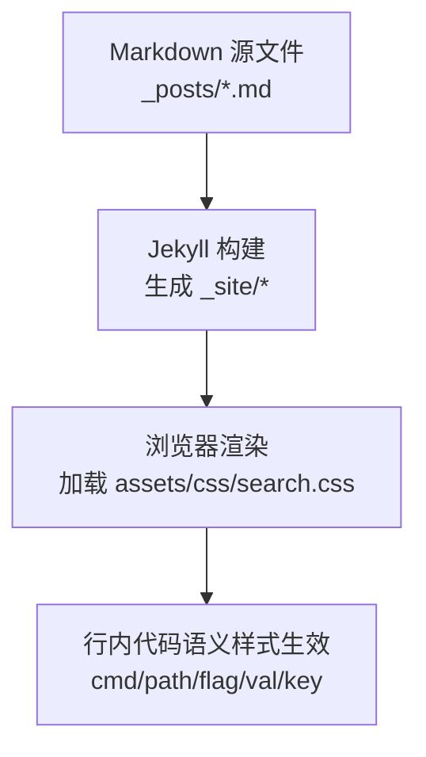
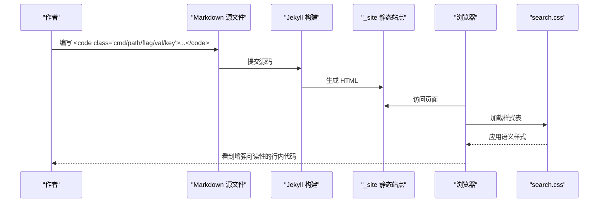
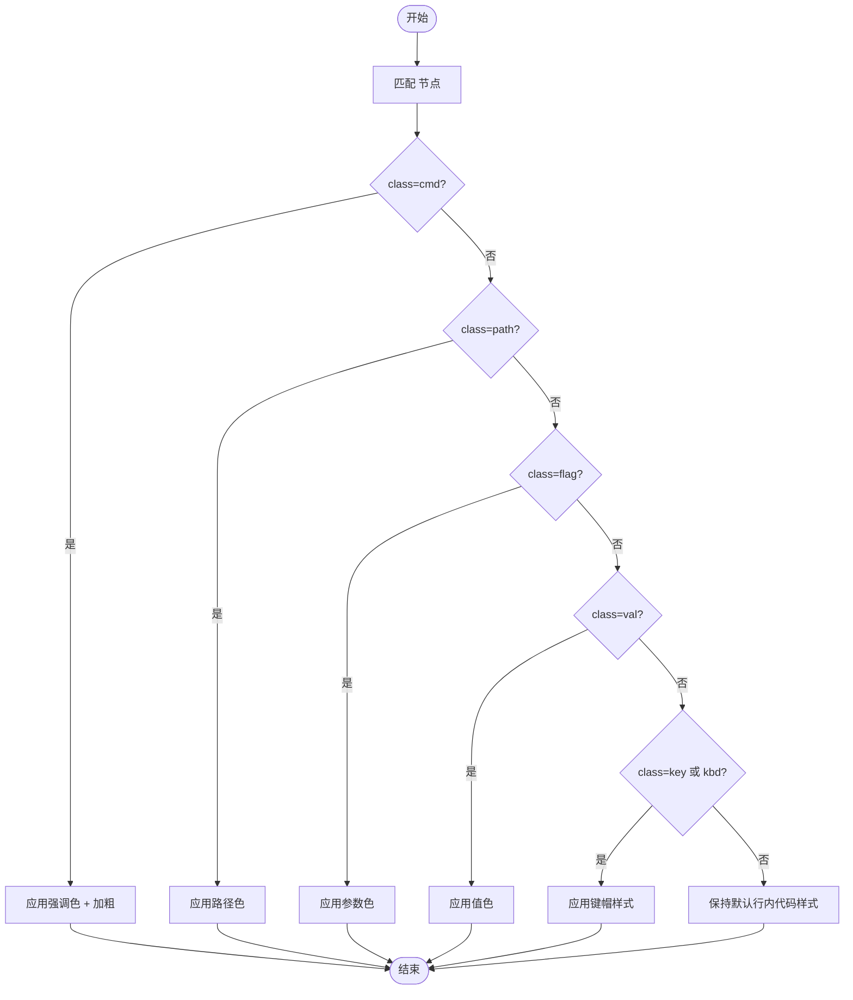
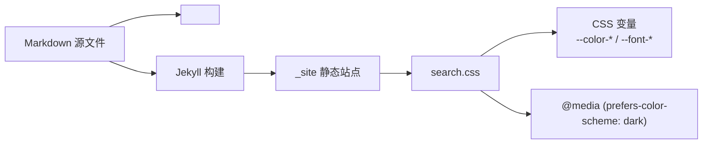

# 行内代码语义样式

<cite>
**本文引用的文件**   
- [README.md](file://README.md)
- [search.css](file://assets/css/search.css)
- [2025-02-22-docker-查看已有网络的内网-ip.md](file://_posts/2025/2025-02-22-docker-查看已有网络的内网-ip.md)
</cite>

## 目录
1. [简介](#简介)
2. [项目结构](#项目结构)
3. [核心组件](#核心组件)
4. [架构总览](#架构总览)
5. [详细组件分析](#详细组件分析)
6. [依赖关系分析](#依赖关系分析)
7. [性能与兼容性](#性能与兼容性)
8. [故障排查指南](#故障排查指南)
9. [结论](#结论)
10. [附录：使用示例与最佳实践](#附录使用示例与最佳实践)

## 简介
本文件聚焦于“行内代码语义样式”的实现与使用方法，说明如何在 Markdown 文章中使用 HTML `<code class="xxx">` 标签为命令、路径、参数、值、按键等元素添加语义化样式，从而提升可读性与一致性。同时给出在本地预览与 GitHub 原生渲染中的差异说明，并提供常见场景与最佳实践建议。

## 项目结构
本项目基于 Jekyll + Minima 主题构建，行内代码语义样式通过站点级 CSS 实现，并在 README 中提供使用说明与示例。

图表来源
- [README.md:159-176](file://README.md#L159-L176)
- [search.css:216-268](file://assets/css/search.css#L216-L268)

章节来源
- [README.md:159-176](file://README.md#L159-L176)

## 核心组件
- 语义类名与用途
  - .cmd：命令（如 docker、git、npm）
  - .path：文件路径
  - .flag：参数选项（--format、-v 等）
  - .val：值（IP、端口、字符串等）
  - .key：按键（Ctrl+C、Enter、Tab 等）
- 视觉效果
  - 亮色模式：命令采用强调色并加粗；路径、参数、值分别以不同颜色区分；按键呈现带边框的“键帽”风格
  - 暗色模式：路径、参数、值自动切换为更亮的配色，保持对比度
- 兼容性与预览差异
  - 标准 Markdown 预览（未应用自定义 CSS）会显示为普通行内代码
  - 站点构建后（含 search.css）将展示上述语义样式
  - GitHub 原生语法对 <code class="..."> 支持有限，通常仅按普通行内代码渲染

章节来源
- [README.md:159-176](file://README.md#L159-L176)
- [search.css:216-268](file://assets/css/search.css#L216-L268)

## 架构总览
行内代码语义样式的渲染流程如下：

图表来源
- [README.md:159-176](file://README.md#L159-L176)
- [search.css:216-268](file://assets/css/search.css#L216-L268)

## 详细组件分析

### 样式定义与视觉规范
- 选择器与规则
  - code.cmd：命令，强调色 + 中等字重
  - code.path：路径，暖色调
  - code.flag：参数，橙黄色调
  - code.val：值，绿色调
  - code.key, kbd：按键，带边框、圆角、阴影的“键帽”风格
- 暗色模式适配
  - 针对 path、flag、val 提供暗色模式下的更高对比度配色
- 设计令牌
  - 使用 CSS 变量统一字体、背景、边框、强调色等，保证整体一致性与可维护性

图表来源
- [search.css:216-268](file://assets/css/search.css#L216-L268)

章节来源
- [search.css:216-268](file://assets/css/search.css#L216-L268)

### 使用语法与示例
- 基本语法
  - 在 Markdown 中使用 HTML 标签：<code class="cmd">...</code>、<code class="path">...</code>、<code class="flag">...</code>、<code class="val">...</code>、<code class="key">...</code>
- 实际用法参考
  - README 提供了示例与效果预览
  - 博客文章中也有多处使用，例如命令行的拆分讲解

章节来源
- [README.md:159-176](file://README.md#L159-L176)
- [2025-02-22-docker-查看已有网络的内网-ip.md:26-53](file://_posts/2025/2025-02-22-docker-查看已有网络的内网-ip.md#L26-L53)

### 预览差异与 GitHub 兼容性
- 本地预览（jekyll serve）
  - 若已包含 search.css，则语义样式可见
  - 若未包含该样式，则回退为普通行内代码
- GitHub 原生渲染
  - 对 <code class="..."> 的自定义类名通常不生效，显示为普通行内代码
  - 建议在 GitHub 上写作时仍保持一致的类名，以保证本地预览与最终站点的统一

章节来源
- [README.md:159-176](file://README.md#L159-L176)
- [search.css:216-268](file://assets/css/search.css#L216-L268)

## 依赖关系分析
- 样式依赖
  - 语义样式依赖于全局 CSS 变量（字体、背景、边框、强调色），以及暗色模式媒体查询
- 内容依赖
  - 文章内容需正确书写 <code class="xxx"> 才能触发对应样式
- 构建依赖
  - Jekyll 构建产物需包含 assets/css/search.css 的引用，否则语义样式不会生效

图表来源
- [search.css:1-58](file://assets/css/search.css#L1-L58)
- [search.css:216-268](file://assets/css/search.css#L216-L268)

章节来源
- [search.css:1-58](file://assets/css/search.css#L1-L58)
- [search.css:216-268](file://assets/css/search.css#L216-L268)

## 性能与兼容性
- 性能
  - 行内代码语义样式仅涉及少量选择器与属性，开销极低
  - 暗色模式通过媒体查询切换，不影响常规渲染路径
- 兼容性
  - 现代浏览器均支持 CSS 变量与媒体查询
  - 旧版浏览器可能不支持 CSS 变量，但会回退到默认行内代码样式，不影响可用性

[本节为通用指导，无需特定文件引用]

## 故障排查指南
- 样式未生效
  - 确认页面已加载 assets/css/search.css
  - 检查浏览器控制台是否存在 CSS 加载错误
  - 清理构建缓存并重新构建（删除 _site 后重新 jekyll serve）
- 预览不一致
  - 本地预览与 GitHub 渲染存在差异属预期行为，GitHub 原生不支持自定义类名样式
- 暗色模式下颜色过浅
  - 检查系统是否启用暗色模式，确认媒体查询生效
  - 必要时在本地调整相关配色变量

章节来源
- [README.md:281-294](file://README.md#L281-L294)
- [search.css:258-268](file://assets/css/search.css#L258-L268)

## 结论
通过统一的语义类名与精心设计的视觉规范，行内代码的可读性与一致性得到显著提升。配合暗色模式适配与清晰的文档说明，作者可在日常写作中高效地使用这些样式，读者也能获得更好的阅读体验。

[本节为总结性内容，无需特定文件引用]

## 附录：使用示例与最佳实践

### 常用类名与适用场景
- .cmd：用于命令（docker、git、npm 等）
- .path：用于文件路径（绝对/相对路径）
- .flag：用于命令行参数与选项（--format、-v 等）
- .val：用于值（IP、端口、字符串等）
- .key：用于按键（Ctrl+C、Enter、Tab 等）

章节来源
- [README.md:159-176](file://README.md#L159-L176)

### 典型组合示例（描述性）
- 命令 + 参数 + 值
  - 示例思路：在句子中依次使用 .cmd、.flag、.val 标注命令、参数与具体值，便于读者快速识别各部分角色
- 路径 + 值
  - 示例思路：在配置说明中用 .path 标注配置文件路径，用 .val 标注关键配置项的值
- 按键提示
  - 示例思路：在操作步骤中使用 .key 标注快捷键，提高操作指引的清晰度

章节来源
- [README.md:159-176](file://README.md#L159-L176)
- [2025-02-22-docker-查看已有网络的内网-ip.md:26-53](file://_posts/2025/2025-02-22-docker-查看已有网络的内网-ip.md#L26-L53)

### 最佳实践建议
- 保持语义一致：同一概念在不同文章中尽量复用相同类名
- 控制粒度：仅在需要强调的关键片段使用语义类名，避免过度装饰
- 兼顾可读性：在长句中合理断句，使每个 <code class="xxx"> 包裹的内容简洁明确
- 注意跨平台差异：在 GitHub 上写作时接受“普通行内代码”的降级效果，确保本地预览与最终站点一致

[本节为通用指导，无需特定文件引用]