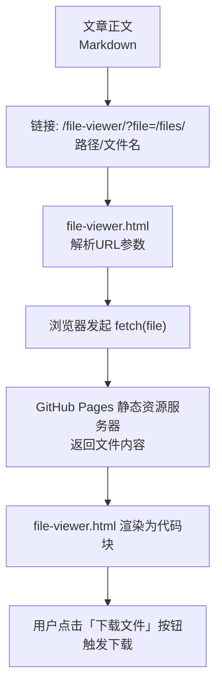
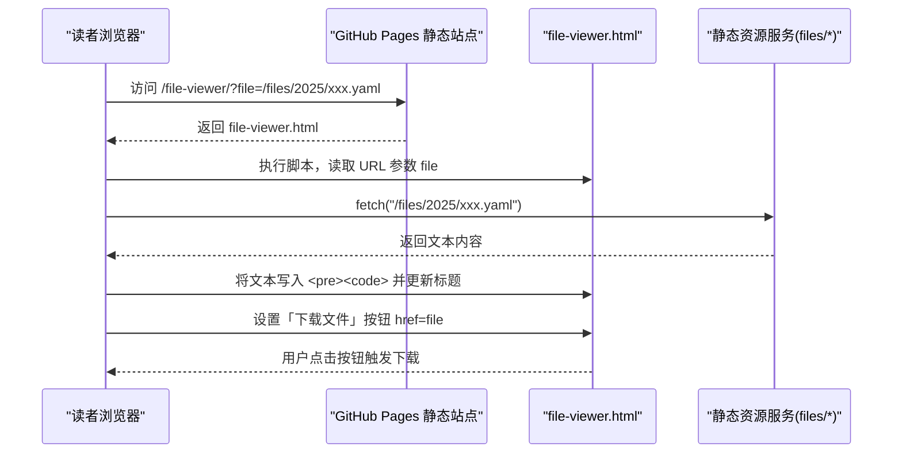
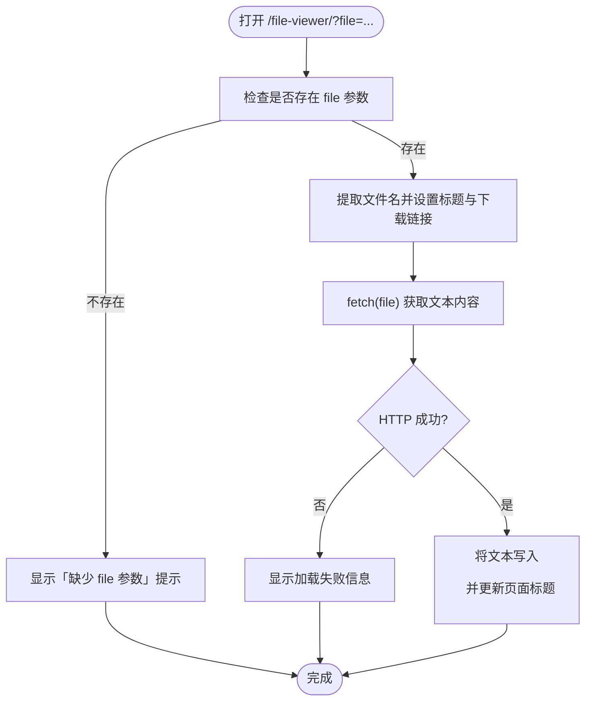

# 附件在线预览

<cite>
**本文引用的文件**   
- [file-viewer.html](file://file-viewer.html)
- [README.md](file://README.md)
- [2025-03-31-milvus-部署.md](file://_posts/2025/2025-03-31-milvus-部署.md)
- [2025-11-01-pgsql-手册.md](file://_posts/2025/2025-11-01-pgsql-手册.md)
- [2026-03-07-docker-iptables-出站白名单管理系统.md](file://_posts/2026/2026-03-07-docker-iptables-出站白名单管理系统.md)
- [2025-03-31-001-milvus-docker-compose-gpu.yaml](file://files/2025/2025-03-31-001-milvus-docker-compose-gpu.yaml)
- [2025-03-31-002-milvus-config.yaml](file://files/2025/2025-03-31-002-milvus-config.yaml)
- [2025-11-01-001-postgresql.conf](file://files/2025/2025-11-01-001-postgresql.conf)
- [2026-03-07-docker-ip-白名单-iptables-whitelist.yaml](file://files/2026/2026-03-07-docker-ip-白名单-iptables-whitelist.yaml)
</cite>

## 目录
1. [简介](#简介)
2. [项目结构](#项目结构)
3. [核心组件](#核心组件)
4. [架构总览](#架构总览)
5. [详细组件分析](#详细组件分析)
6. [依赖关系分析](#依赖关系分析)
7. [性能与体验](#性能与体验)
8. [故障排查](#故障排查)
9. [结论](#结论)
10. [附录：使用示例与最佳实践](#附录使用示例与最佳实践)

## 简介
本章节介绍站点中“附件在线预览”能力的整体目标与价值：将脚本、配置等文本附件以友好的方式在浏览器中直接查看，并提供一键下载能力；同时保持历史直链行为不变，确保兼容性与平滑过渡。

## 项目结构
与附件在线预览相关的目录与文件如下：
- files/：存放所有可在线预览的文本附件，按年份组织（如 2025、2026），便于归档与管理。
- file-viewer.html：纯前端静态页面，作为统一入口，解析 URL 参数并拉取对应文件内容展示。
- README.md：文档中明确说明了引用语法与支持的文本类型。
- 若干文章：通过 Markdown 链接引用 /file-viewer/?file=/files/... 实现在线预览。

图示来源
- [file-viewer.html:1-81](file://file-viewer.html#L1-L81)
- [README.md:238-248](file://README.md#L238-L248)

章节来源
- [README.md:26-62](file://README.md#L26-L62)

## 核心组件
- 附件存储目录 files/
  - 按年份子目录组织，例如 files/2025、files/2026。
  - 支持 .sh、.yaml、.yml、.conf、.json、.py、.sql 等文本类型。
- 在线查看器 file-viewer.html
  - 固定路由 /file-viewer/，通过查询参数 ?file= 指定要查看的文件绝对路径。
  - 页面顶部显示文件名与「下载文件」按钮，主体区域以等宽字体呈现文件内容。
  - 自动适配系统暗色模式，提升阅读体验。
- 文章引用方式
  - 在文章中用标准 Markdown 链接格式指向查看器，并在参数中传入 /files/ 下的相对路径。

章节来源
- [README.md:238-248](file://README.md#L238-L248)
- [file-viewer.html:1-81](file://file-viewer.html#L1-L81)

## 架构总览
从请求到展示的端到端流程如下：

图示来源
- [file-viewer.html:45-77](file://file-viewer.html#L45-L77)
- [README.md:238-248](file://README.md#L238-L248)

## 详细组件分析

### 查看器页面 file-viewer.html
- 功能要点
  - 解析 URL 中的 file 参数，若缺失则提示缺少参数。
  - 根据完整路径计算文件名用于标题与下载按钮。
  - 使用 fetch 获取文件文本内容，错误时显示失败信息。
  - 提供「下载文件」按钮，点击后直接下载原文件。
  - 支持系统暗色主题，提升可读性。
- 交互流程
  - 进入页面 → 校验参数 → 设置标题与下载链接 → 拉取内容 → 渲染或报错。

图示来源
- [file-viewer.html:45-77](file://file-viewer.html#L45-L77)

章节来源
- [file-viewer.html:1-81](file://file-viewer.html#L1-L81)

### 引用语法与历史兼容性
- 引用语法
  - 在文章中使用 Markdown 链接：[文件名](/file-viewer/?file=/files/路径/文件名)
  - 该链接会跳转到查看器页面，由前端动态拉取并展示文件内容。
- 历史直链兼容
  - 直接访问 /files/路径/文件名 仍保持原有行为（浏览器原生显示或下载），不影响既有书签与外链。

章节来源
- [README.md:238-248](file://README.md#L238-L248)

### 已使用的附件样例
以下文章均通过上述语法引用了 files/ 下的文本附件，可作为参考：
- [2025-03-31-milvus-部署.md](file://_posts/2025/2025-03-31-milvus-部署.md)
  - 引用了 docker-compose 与 Milvus 配置文件。
- [2025-11-01-pgsql-手册.md](file://_posts/2025/2025-11-01-pgsql-手册.md)
  - 引用了 PostgreSQL 配置文件。
- [2026-03-07-docker-iptables-出站白名单管理系统.md](file://_posts/2026/2026-03-07-docker-iptables-出站白名单管理系统.md)
  - 引用了 iptables 白名单相关脚本与 YAML 配置。

章节来源
- [2025-03-31-milvus-部署.md](file://_posts/2025/2025-03-31-milvus-部署.md)
- [2025-11-01-pgsql-手册.md](file://_posts/2025/2025-11-01-pgsql-手册.md)
- [2026-03-07-docker-iptables-出站白名单管理系统.md](file://_posts/2026/2026-03-07-docker-iptables-出站白名单管理系统.md)

## 依赖关系分析
- 页面与资源
  - file-viewer.html 不依赖任何外部 JS/CSS 库，仅依赖浏览器原生 fetch API。
  - 附件位于 files/ 目录，由 GitHub Pages 静态托管，无需后端处理。
- 耦合度
  - 查看器与附件目录解耦，仅通过 URL 参数约定进行关联，扩展性强。
- 潜在风险
  - 大文件一次性拉取可能影响首屏加载时间，建议控制文件大小或按需分页（后续优化方向）。

图示来源
- [file-viewer.html:1-81](file://file-viewer.html#L1-L81)
- [README.md:238-248](file://README.md#L238-L248)

章节来源
- [file-viewer.html:1-81](file://file-viewer.html#L1-L81)

## 性能与体验
- 加载策略
  - 采用 fetch 全量拉取文本，适合中小体积配置文件与脚本。
- 渲染优化
  - 使用等宽字体与合适的行高，提升长文本可读性。
  - 支持系统暗色模式，减少夜间阅读疲劳。
- 下载体验
  - 「下载文件」按钮直接指向原文件，避免二次转换，保证一致性。

## 故障排查
- 常见问题
  - 页面提示“缺少 file 参数”：请确认链接中是否包含 ?file= 且值有效。
  - 页面提示“加载失败”：检查文件路径是否正确、文件是否存在于 files/ 下、网络是否可达。
  - 中文路径或特殊字符：确保 URL 编码正确，必要时对路径进行 encodeURIComponent。
- 定位步骤
  - 复制查看器地址，直接在浏览器新标签页打开，观察控制台是否有网络错误。
  - 验证 /files/ 路径是否能被浏览器正常访问（应返回文件或下载）。
  - 清理构建缓存并重新生成站点，排除本地缓存干扰。

章节来源
- [file-viewer.html:45-77](file://file-viewer.html#L45-L77)

## 结论
通过统一的查看器页面与规范的引用语法，站点实现了轻量、稳定、易维护的附件在线预览能力。配合按年份组织的 files/ 目录，作者可以高效管理附件，读者也能获得一致的浏览与下载体验。

## 附录：使用示例与最佳实践

### 支持的文本类型
- 脚本与配置：.sh、.yaml、.yml、.conf、.json、.py、.sql 等
- 说明：查看器以文本形式渲染，不进行语法高亮或格式化，但等宽字体有助于阅读。

章节来源
- [README.md:238-248](file://README.md#L238-L248)

### 文件上传与组织流程
- 步骤
  1) 将附件放入 files/ 目录下，建议按年份建立子目录，如 files/2026/xxx.yaml。
  2) 在文章中插入链接：[文件名](/file-viewer/?file=/files/2026/xxx.yaml)。
  3) 本地运行 jekyll serve 预览效果，确认链接可正常跳转与下载。
- 命名建议
  - 文件名尽量简洁、语义清晰，避免过长或含过多特殊字符。
  - 同一篇文章的多份附件可按序号前缀区分，如 001-xxx.yaml、002-yyy.conf。

章节来源
- [README.md:275-279](file://README.md#L275-L279)

### 典型引用示例
- Docker Compose 配置
  - 文章引用：[docker-compose-gpu.yml](/file-viewer/?file=/files/2025/2025-03-31-001-milvus-docker-compose-gpu.yaml)
  - 对应文件：[2025-03-31-001-milvus-docker-compose-gpu.yaml](file://files/2025/2025-03-31-001-milvus-docker-compose-gpu.yaml)
- Milvus 配置
  - 文章引用：[milvus.yaml](/file-viewer/?file=/files/2025/2025-03-31-002-milvus-config.yaml)
  - 对应文件：[2025-03-31-002-milvus-config.yaml](file://files/2025/2025-03-31-002-milvus-config.yaml)
- PostgreSQL 配置
  - 文章引用：[postgresql.conf](/file-viewer/?file=/files/2025/2025-11-01-001-postgresql.conf)
  - 对应文件：[2025-11-01-001-postgresql.conf](file://files/2025/2025-11-01-001-postgresql.conf)
- iptables 白名单
  - 文章引用：[iptables-whitelist.sh](/file-viewer/?file=/files/2026/2026-03-07-docker-ip-白名单-iptables-whitelist.sh)
  - 文章引用：[iptables-whitelist.yaml](/file-viewer/?file=/files/2026/2026-03-07-docker-ip-白名单-iptables-whitelist.yaml)
  - 对应文件：[2026-03-07-docker-ip-白名单-iptables-whitelist.yaml](file://files/2026/2026-03-07-docker-ip-白名单-iptables-whitelist.yaml)

章节来源
- [2025-03-31-milvus-部署.md](file://_posts/2025/2025-03-31-milvus-部署.md)
- [2025-11-01-pgsql-手册.md](file://_posts/2025/2025-11-01-pgsql-手册.md)
- [2026-03-07-docker-iptables-出站白名单管理系统.md](file://_posts/2026/2026-03-07-docker-iptables-出站白名单管理系统.md)

### 查看器页面功能特性清单
- 顶部工具栏
  - 显示当前文件名
  - 「下载文件」按钮，点击即下载原文件
- 内容区
  - 等宽字体、自适应宽度、横向滚动条
  - 自动跟随系统暗色模式
- 错误处理
  - 缺少参数时给出明确提示
  - 网络或权限错误时显示失败信息与原始错误消息

章节来源
- [file-viewer.html:1-81](file://file-viewer.html#L1-L81)