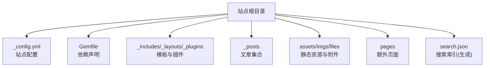
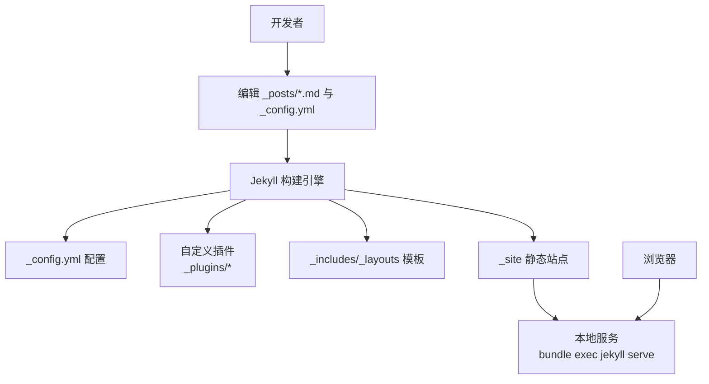
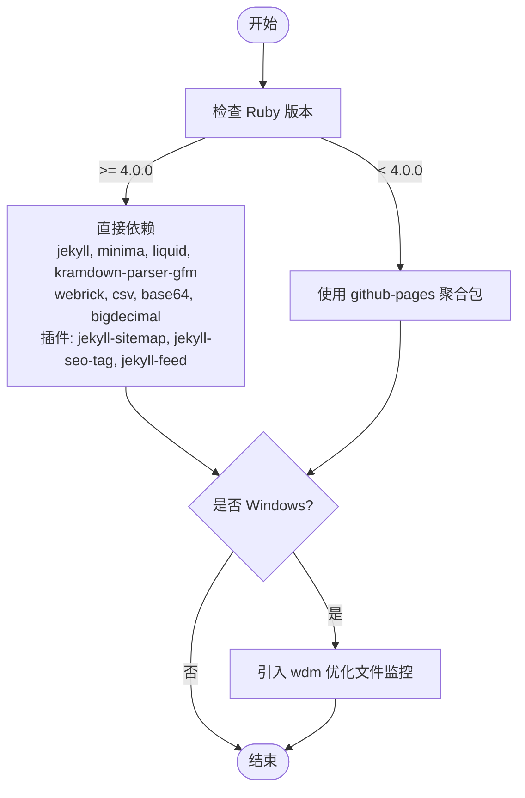

# 快速开始

<cite>
**本文引用的文件**
- [README.md](file://README.md)
- [_config.yml](file://_config.yml)
- [Gemfile](file://Gemfile)
</cite>

## 目录
1. [简介](#简介)
2. [项目结构](#项目结构)
3. [核心组件](#核心组件)
4. [架构总览](#架构总览)
5. [详细组件分析](#详细组件分析)
6. [依赖分析](#依赖分析)
7. [性能与构建特性](#性能与构建特性)
8. [故障排查指南](#故障排查指南)
9. [结论](#结论)
10. [附录：本地开发工作流](#附录本地开发工作流)

## 简介
本指南面向首次接触该 Jekyll 博客项目的读者，提供从零开始的完整环境搭建与本地运行流程，覆盖 Windows 与 Ubuntu 两大平台。你将学会如何安装 Ruby 与开发工具链、配置 gem 源、安装 Jekyll 与项目依赖、启动本地服务、修改文章后的刷新机制，以及常见问题的解决方案。按照步骤操作后，即可在本地预览站点并顺利开始写作。

## 项目结构
本项目基于 GitHub Pages + Jekyll，主题基于官方 Minima 深度定制。关键目录与文件包括：
- _config.yml：站点全局配置（标题、社交链接、评论、统计、插件等）
- Gemfile：Ruby 依赖声明（按 Ruby 版本分支选择 github-pages 或直接依赖）
- _includes/_layouts/_plugins：模板片段、页面布局与自定义插件
- _posts：按年份子目录组织的博客文章
- assets/imgs/files：前端资源、文章图片与附件
- pages：额外页面（如 RSS 订阅）
- search.json：全文搜索索引（由 Jekyll 生成）

图表来源
- [README.md:26-62](file://README.md#L26-L62)
- [_config.yml:1-45](file://_config.yml#L1-L45)
- [Gemfile:1-25](file://Gemfile#L1-L25)

章节来源
- [README.md:26-62](file://README.md#L26-L62)

## 核心组件
- 站点配置：通过 _config.yml 管理站点元信息、主题皮肤、社交链接、头像与 favicon、Disqus 评论、Google Analytics、永久链接格式、Markdown 解析器与高亮器、Jekyll 插件列表等。
- 依赖管理：Gemfile 根据当前 Ruby 版本动态选择依赖策略。当 Ruby 版本大于等于 4.0.0 时，直接声明 jekyll、minima、liquid、kramdown-parser-gfm 及若干内置库；否则使用 github-pages 聚合包以兼容线上环境。Windows 下额外引入 wdm 优化文件监控。
- 本地开发与构建：通过 bundle install 安装依赖，使用 bundle exec jekyll serve 启动本地服务，默认监听 127.0.0.1:4000。

章节来源
- [_config.yml:1-45](file://_config.yml#L1-L45)
- [Gemfile:1-25](file://Gemfile#L1-L25)
- [README.md:64-132](file://README.md#L64-L132)

## 架构总览
下图展示了本地开发时的主要交互关系：开发者编辑 Markdown 文章与配置文件，Jekyll 读取配置与模板，结合自定义插件进行渲染，输出静态站点并在本地 Web 服务器中提供服务。浏览器访问本地地址查看效果。

图表来源
- [README.md:64-132](file://README.md#L64-L132)
- [_config.yml:1-45](file://_config.yml#L1-L45)

## 详细组件分析

### 环境搭建（Windows）
- 安装 Ruby+Devkit：从官网下载安装程序，安装时勾选将 Ruby 可执行文件加入 PATH。
- 安装开发工具链：运行 ridk install，弹出菜单输入 3 回车，等待完成。
- 可选换源：将 gem 源切换为国内镜像以提升下载速度。
- 安装 Jekyll 与 Bundler：使用 gem 安装 jekyll 和 bundler。
- 安装项目依赖并启动：进入项目目录，执行 bundle install 安装依赖，然后使用 bundle exec jekyll serve 启动本地服务，浏览器打开 http://127.0.0.1:4000/。
- 注意事项：始终使用 bundle exec jekyll 命令，确保与 Gemfile 中的版本一致。

章节来源
- [README.md:66-96](file://README.md#L66-L96)

### 环境搭建（Ubuntu）
- 安装系统依赖：更新 apt 并安装 ruby-full、build-essential、zlib1g-dev。
- 配置 gem 安装路径：避免 root 权限，将 gems 安装到用户目录并加入 PATH。
- 可选换源：将 gem 源切换为国内镜像。
- 安装 Jekyll 与 Bundler：使用 gem 安装 jekyll 和 bundler。
- 安装项目依赖并启动：进入项目目录，执行 bundle install 安装依赖，然后使用 bundle exec jekyll serve 启动本地服务，浏览器打开 http://127.0.0.1:4000/。
- 注意事项：始终使用 bundle exec jekyll 命令，确保与 Gemfile 中的版本一致。

章节来源
- [README.md:98-132](file://README.md#L98-L132)

### 本地开发与刷新机制
- 保持服务运行：在后台运行 bundle exec jekyll serve。
- 修改文章：编辑 _posts 下的 .md 文件，保存后刷新浏览器即可看到变化。
- 新增文章：在 _posts 下新建 .md 文件，Jekyll 会自动检测并重新生成。
- 添加图片：直接将图片放入 imgs 目录，文章中引用路径，无需 commit 到 git，本地立即显示。
- 添加附件：将文件放入 files 目录，文章中用在线查看器链接引用，可在浏览器中预览文本内容。
- 修改配置：更改 _config.yml 需要重启 jekyll serve 才会生效。

章节来源
- [README.md:265-279](file://README.md#L265-L279)

### 清理构建缓存
- 遇到页面未更新、样式错乱或 header 重复显示等问题时，停止服务并删除历史构建目录，再重新构建并启动。
- 建议在修改 _config.yml 或大量增删文件后执行清理，以避免增量构建产生缓存冲突。

章节来源
- [README.md:281-294](file://README.md#L281-L294)

### Disqus 评论
- 每篇文章底部自动加载 Disqus 评论区，由 _config.yml 中的 disqus.shortname 控制。
- 启用：填写你的 Disqus shortname。
- 关闭：将 shortname 留空或删除整个 disqus 配置块。
- 本地预览：jekyll serve 本地运行时 Disqus 也能正常加载，但需确保网络能访问 Disqus 服务。
- 模板位置：_layouts/post.html 中通过条件判断引入 disqus_comments.html。

章节来源
- [README.md:296-308](file://README.md#L296-L308)
- [_config.yml:28-31](file://_config.yml#L28-L31)

### 配置修改
- 可修改项包括：博客标题、描述、作者、社交链接、头像与 favicon 路径、Minima 皮肤、Disqus shortname、Google Analytics ID、文章永久链接格式、Jekyll 插件列表等。

章节来源
- [README.md:310-320](file://README.md#L310-L320)
- [_config.yml:1-45](file://_config.yml#L1-L45)

## 依赖分析
Gemfile 的依赖策略会根据当前 Ruby 版本进行分支处理：
- 当 RUBY_VERSION >= 4.0.0：直接声明 jekyll、minima、liquid、kramdown-parser-gfm 以及 webrick、csv、base64、bigdecimal 等内置库，并将 jekyll-sitemap、jekyll-seo-tag、jekyll-feed 作为插件组。
- 当 RUBY_VERSION < 4.0.0：使用 github-pages 聚合包以匹配线上环境。
- Windows 平台额外引入 wdm 以优化文件监控。

图表来源
- [Gemfile:1-25](file://Gemfile#L1-L25)

章节来源
- [Gemfile:1-25](file://Gemfile#L1-L25)

## 性能与构建特性
- 增量构建：Jekyll 默认对变更的文件进行增量构建，提升本地开发效率。
- 文件监控：Windows 下通过 wdm 优化文件监控，减少构建延迟。
- 搜索索引：search.json 由 Jekyll 生成，包含标题、正文与分类，用于前端全文搜索。
- 插件辅助：自定义插件提供 Liquid 转义、分类过滤、Ruby 3.4+ 兼容等功能，增强构建稳定性与可用性。

章节来源
- [README.md:265-279](file://README.md#L265-L279)
- [Gemfile:1-25](file://Gemfile#L1-L25)

## 故障排查指南
- 页面未更新或样式错乱：清理历史构建目录并重新启动服务。
- 配置未生效：修改 _config.yml 后需重启 jekyll serve。
- 中文路径问题：参考站内相关教程，必要时执行清理后再启动。
- 网络访问问题：本地预览 Disqus 需要能访问外部服务；若无法访问，可暂时关闭评论功能。
- 依赖安装失败：确认已正确设置 gem 源，并确保安装了必要的系统依赖与开发工具链。

章节来源
- [README.md:281-294](file://README.md#L281-L294)
- [README.md:296-308](file://README.md#L296-L308)

## 结论
通过以上步骤，你可以在 Windows 与 Ubuntu 平台上顺利完成 Jekyll 博客的环境搭建与本地运行。建议始终使用 bundle exec jekyll 命令以确保依赖版本一致；在修改配置或大量增删文件后，优先清理构建缓存再重启服务以获得稳定体验。

## 附录：本地开发工作流
- 启动服务：在项目目录下执行 bundle install 安装依赖，然后使用 bundle exec jekyll serve 启动本地服务。
- 编写文章：在 _posts 下创建符合命名规范的 .md 文件，添加必要的前置字段（layout、title、categories 等）。
- 插入图片与附件：将图片放入 imgs 目录，附件放入 files 目录，并在文章中按约定路径引用。
- 刷新查看：保存后刷新浏览器即可看到变化；如需强制重建，先清理 _site 目录再重启服务。
- 提交代码：完成写作与测试后，将变更推送到仓库，GitHub Pages 将自动构建并发布。

章节来源
- [README.md:64-132](file://README.md#L64-L132)
- [README.md:265-294](file://README.md#L265-L294)