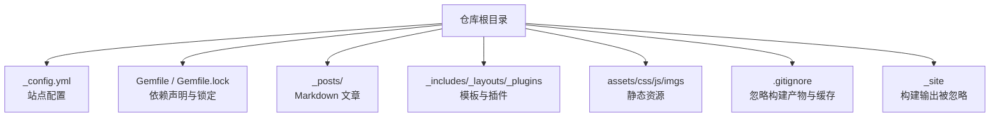
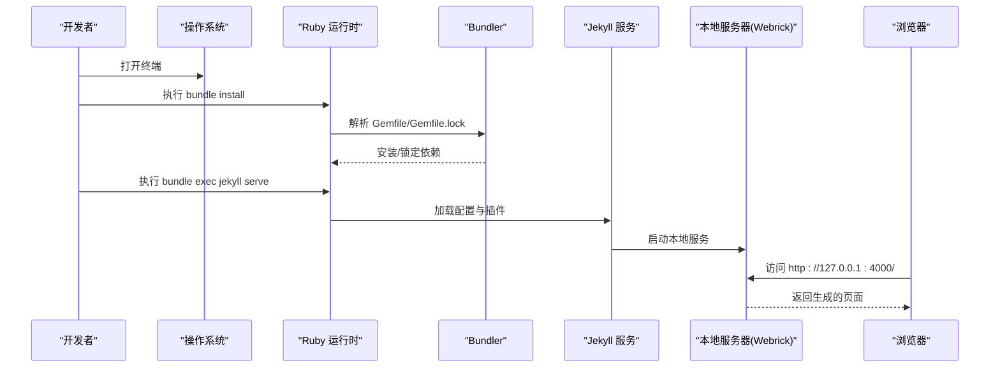
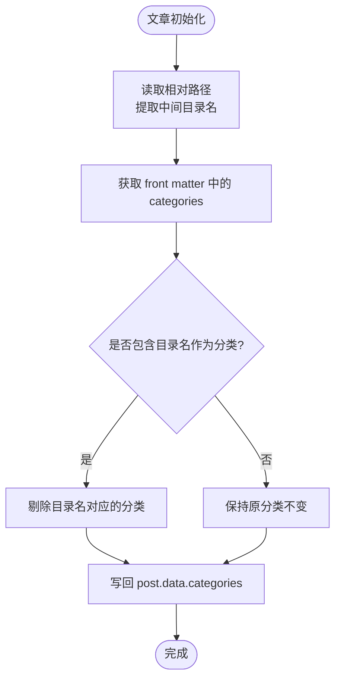
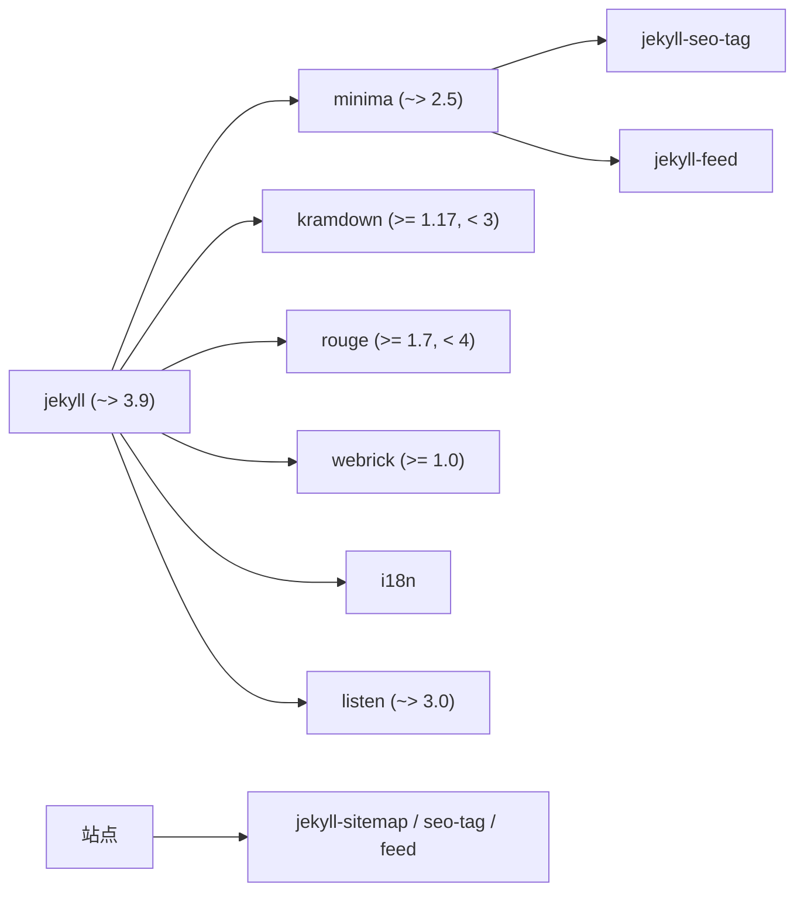

# 快速开始

<cite>
**本文引用的文件**   
- [Gemfile](file://Gemfile)
- [Gemfile.lock](file://Gemfile.lock)
- [_config.yml](file://_config.yml)
- [README.md](file://README.md)
- [.gitignore](file://.gitignore)
- [_plugins/ruby34_compat.rb](file://_plugins/ruby34_compat.rb)
- [_plugins/year_category_filter.rb](file://_plugins/year_category_filter.rb)
</cite>

## 目录
1. [简介](#简介)
2. [项目结构](#项目结构)
3. [核心组件](#核心组件)
4. [架构总览](#架构总览)
5. [详细组件分析](#详细组件分析)
6. [依赖分析](#依赖分析)
7. [性能考虑](#性能考虑)
8. [故障排查指南](#故障排查指南)
9. [结论](#结论)
10. [附录](#附录)

## 简介
本指南面向从零开始的读者，提供在 Windows 与 Ubuntu 上搭建并运行该 Jekyll 博客的完整步骤。内容涵盖 Ruby+Devkit 安装、开发工具链配置、gem 源设置、Jekyll 与 Bundler 安装、项目依赖初始化、本地预览启动与访问方式，以及使用 bundle exec jekyll 的重要性说明和常见问题解决方案。

## 项目结构
该项目为典型的 Jekyll 站点：
- 站点配置位于 _config.yml
- 主题与插件通过 Gemfile 管理
- 文章位于 _posts 下，按年/月/日命名
- 构建产物输出到 _site（被 .gitignore 忽略）
- 自定义插件位于 _plugins

图表来源
- [_config.yml:1-45](file://_config.yml#L1-L45)
- [Gemfile:1-17](file://Gemfile#L1-L17)
- [Gemfile.lock:1-132](file://Gemfile.lock#L1-L132)
- [.gitignore:120-136](file://.gitignore#L120-L136)

章节来源
- [README.md:1-157](file://README.md#L1-L157)
- [_config.yml:1-45](file://_config.yml#L1-L45)
- [Gemfile:1-17](file://Gemfile#L1-L17)
- [Gemfile.lock:1-132](file://Gemfile.lock#L1-L132)
- [.gitignore:120-136](file://.gitignore#L120-L136)

## 核心组件
- 站点配置：定义标题、作者、主题、链接、SEO、统计、URL 规则、Markdown 解析器等
- 主题与插件：Minima 主题 + Sitemap/SEO/Feed 插件
- 兼容性插件：修复 Ruby 3.4+ 兼容问题并提供 URL 清理过滤器
- 分类过滤插件：移除由目录结构自动注入的分类，仅保留 front matter 中显式定义的分类
- 依赖管理：通过 Gemfile 声明版本范围，Gemfile.lock 锁定具体版本，Bundler 负责环境隔离与执行

章节来源
- [_config.yml:1-45](file://_config.yml#L1-L45)
- [Gemfile:1-17](file://Gemfile#L1-L17)
- [_plugins/ruby34_compat.rb:1-19](file://_plugins/ruby34_compat.rb#L1-L19)
- [_plugins/year_category_filter.rb:1-13](file://_plugins/year_category_filter.rb#L1-L13)

## 架构总览
下图展示了从“本地开发”到“浏览器预览”的关键流程，以及各组件间的关系。

图表来源
- [Gemfile:1-17](file://Gemfile#L1-L17)
- [Gemfile.lock:1-132](file://Gemfile.lock#L1-L132)
- [_config.yml:1-45](file://_config.yml#L1-L45)

## 详细组件分析

### 环境与依赖管理
- 依赖声明：Jekyll 主包、Minima 主题、Liquid、Webrick、CSV、Base64、BigDecimal、Kramdown-GFM 等
- 插件组：jekyll-sitemap、jekyll-seo-tag、jekyll-feed
- 版本锁定：Gemfile.lock 固定了所有依赖的具体版本，确保团队与 CI 一致性
- 平台信息：当前锁定的平台为 x64-mingw-ucrt（Windows），Ubuntu 需重新生成 lock 或按需安装原生扩展

章节来源
- [Gemfile:1-17](file://Gemfile#L1-L17)
- [Gemfile.lock:1-132](file://Gemfile.lock#L1-L132)

### 站点配置要点
- 主题：minima，皮肤 auto，日期格式 %Y-%m-%d
- 社交与头像：GitHub、知乎用户名，头像与 favicon 路径
- 评论与分析：Disqus shortname、Google Analytics ID
- 构建设置：permalinks 规则、markdown 引擎 kramdown、语法高亮 rouge
- 插件启用：sitemap、seo-tag、feed

章节来源
- [_config.yml:1-45](file://_config.yml#L1-L45)

### 自定义插件
- Ruby 3.4 兼容补丁：为旧版 Liquid/Jekyll 提供 String#untait 兼容实现；注册 URL 清理过滤器用于搜索索引
- 分类过滤钩子：在文章初始化后，移除由 _posts 子目录自动注入的分类，仅保留 front matter 中的 categories

图表来源
- [_plugins/year_category_filter.rb:1-13](file://_plugins/year_category_filter.rb#L1-L13)

章节来源
- [_plugins/ruby34_compat.rb:1-19](file://_plugins/ruby34_compat.rb#L1-L19)
- [_plugins/year_category_filter.rb:1-13](file://_plugins/year_category_filter.rb#L1-L13)

## 依赖分析
- 直接依赖：jekyll、minima、liquid、webrick、csv、base64、bigdecimal、kramdown-parser-gfm
- 插件依赖：jekyll-sitemap、jekyll-seo-tag、jekyll-feed
- 关键间接依赖：kramdown、rouge、listen、em-websocket、i18n、pathutil、public_suffix 等
- 平台差异：lock 文件显示 Windows 平台，Linux 环境下建议重新生成以匹配系统库

图表来源
- [Gemfile:1-17](file://Gemfile#L1-L17)
- [Gemfile.lock:1-132](file://Gemfile.lock#L1-L132)

章节来源
- [Gemfile:1-17](file://Gemfile#L1-L17)
- [Gemfile.lock:1-132](file://Gemfile.lock#L1-L132)

## 性能考虑
- 增量构建：Jekyll 默认监听文件变化进行增量构建，适合本地开发
- 清理缓存：修改配置或大量增删文件后，建议清理 _site 与缓存目录再重建，避免缓存冲突导致样式错乱或重复 header
- 插件开销：Sitemap/SEO/Feed 插件会增加少量构建时间，但收益显著

[本节为通用指导，不直接分析具体文件]

## 故障排查指南
- 权限问题（Ubuntu）
  - 现象：安装 gem 需要 root 权限
  - 解决：将 gems 安装到用户目录，并将 bin 目录加入 PATH
  - 参考步骤见 README 中 Ubuntu 部分
- 路径与环境变量
  - Windows：安装时勾选将 Ruby 可执行文件添加到 PATH
  - Ubuntu：source ~/.bashrc 使环境变量生效
- 中文路径与编码
  - Windows 下中文路径可能导致预览异常，请遵循 README 中相关文档指引
- 构建缓存问题
  - 清理 _site 与 .jekyll-cache/.jekyll-metadata 后重启服务
- 版本不一致
  - 始终使用 bundle exec jekyll 命令，确保与 Gemfile/Gemfile.lock 一致
- 插件兼容性问题
  - 已内置 Ruby 3.4 兼容补丁，若仍报错，检查 Ruby 版本与依赖是否匹配

章节来源
- [README.md:19-86](file://README.md#L19-L86)
- [README.md:128-141](file://README.md#L128-L141)
- [Gemfile:1-17](file://Gemfile#L1-L17)
- [Gemfile.lock:1-132](file://Gemfile.lock#L1-L132)
- [_plugins/ruby34_compat.rb:1-19](file://_plugins/ruby34_compat.rb#L1-L19)

## 结论
通过本指南，你可以在 Windows 与 Ubuntu 上快速完成环境搭建、依赖安装与本地预览。配合自定义插件与完善的依赖锁定策略，项目具备良好的一致性与可维护性。遇到问题时，优先检查权限、路径、缓存与版本一致性。

[本节为总结性内容，不直接分析具体文件]

## 附录

### 从零开始：Windows 环境搭建与运行
- 安装 Ruby+Devkit
  - 下载并安装 Ruby+Devkit，安装时勾选“Add Ruby executables to PATH”
  - 安装完成后，在终端执行 ridk install，选择对应选项安装编译工具链
- 可选：更换 gem 源（国内推荐）
  - 添加国内镜像并移除官方源
- 安装 Jekyll 与 Bundler
  - 全局安装 jekyll 与 bundler
- 进入项目目录并安装依赖
  - 执行 bundle install
- 启动本地预览
  - 执行 bundle exec jekyll serve
  - 浏览器访问 http://127.0.0.1:4000/
- 重要提示
  - 始终使用 bundle exec jekyll 而非直接 jekyll，保证版本与 Gemfile 一致

章节来源
- [README.md:21-51](file://README.md#L21-L51)
- [Gemfile:1-17](file://Gemfile#L1-L17)
- [Gemfile.lock:1-132](file://Gemfile.lock#L1-L132)

### 从零开始：Ubuntu 环境搭建与运行
- 安装系统依赖
  - 更新包管理器并安装 ruby-full、build-essential、zlib1g-dev
- 配置 gem 安装路径（避免 root 权限）
  - 将 gems 安装到用户目录，并把 bin 目录加入 PATH
  - source ~/.bashrc 使配置生效
- 可选：更换 gem 源（国内推荐）
  - 添加国内镜像并移除官方源
- 安装 Jekyll 与 Bundler
  - 全局安装 jekyll 与 bundler
- 进入项目目录并安装依赖
  - 执行 bundle install
- 启动本地预览
  - 执行 bundle exec jekyll serve
  - 浏览器访问 http://127.0.0.1:4000/

章节来源
- [README.md:53-86](file://README.md#L53-L86)
- [Gemfile:1-17](file://Gemfile#L1-L17)
- [Gemfile.lock:1-132](file://Gemfile.lock#L1-L132)

### 本地预览与日常开发
- 写文章
  - 在 _posts 目录下创建 Markdown 文件，文件名格式：年-月-日-文章标题.md
  - 文件头部添加 front matter（layout、title、categories 等）
- 图片引用
  - 将图片放入 imgs 目录，文章中通过绝对路径引用
- 实时预览
  - 保持 jekyll serve 运行，保存文章后刷新浏览器即可看到变化
- 清理缓存
  - 遇到样式错乱或重复 header 等问题，停止服务后删除 _site，再重建并启动

章节来源
- [README.md:88-141](file://README.md#L88-L141)
- [_config.yml:1-45](file://_config.yml#L1-L45)
- [.gitignore:120-136](file://.gitignore#L120-L136)

### 为什么必须使用 bundle exec jekyll？
- 作用
  - 强制使用 Gemfile/Gemfile.lock 中锁定的依赖版本，避免全局安装的版本不一致导致构建失败或行为差异
- 场景
  - 团队协作、CI/CD、多项目共存时尤为必要
- 替代风险
  - 直接使用 jekyll 可能调用系统全局版本，出现插件缺失、API 变更、兼容性问题

章节来源
- [README.md:51-51](file://README.md#L51-L51)
- [Gemfile:1-17](file://Gemfile#L1-L17)
- [Gemfile.lock:1-132](file://Gemfile.lock#L1-L132)