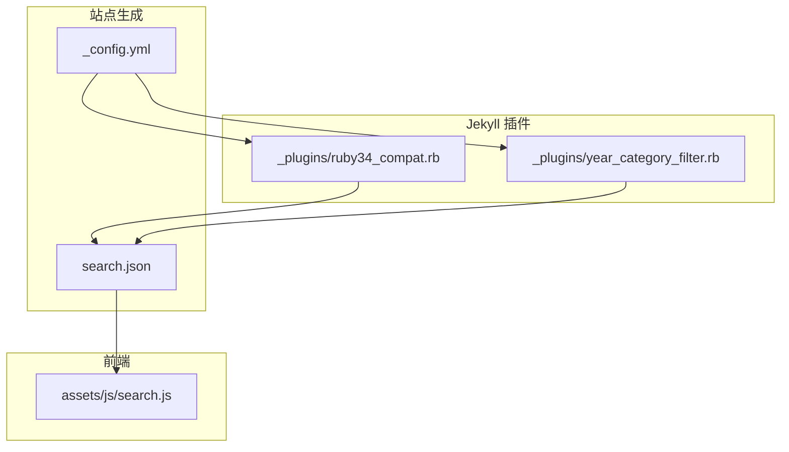
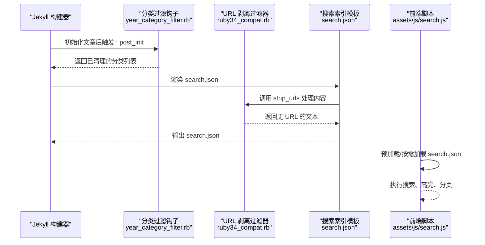
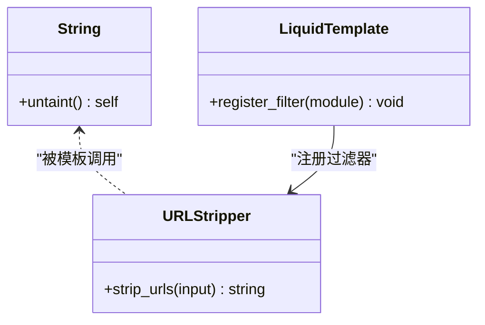
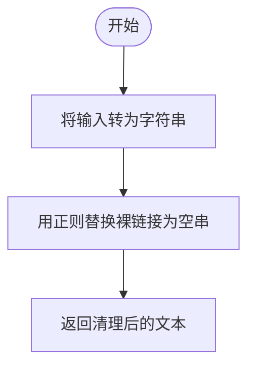
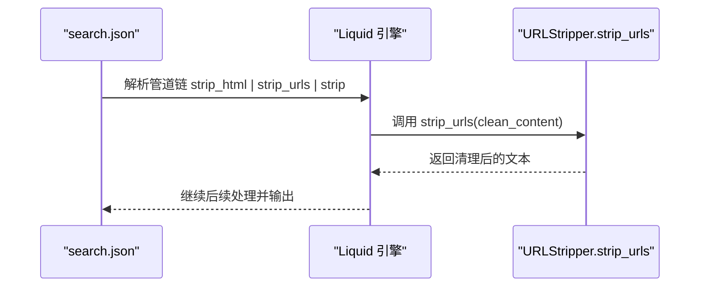
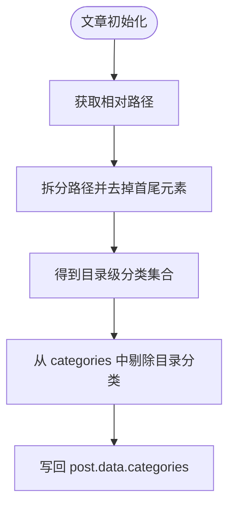
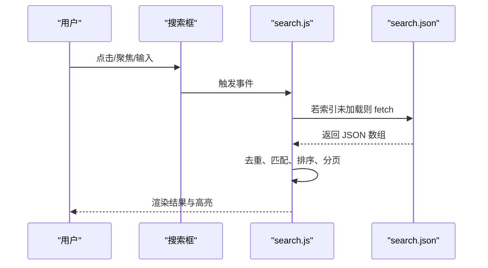
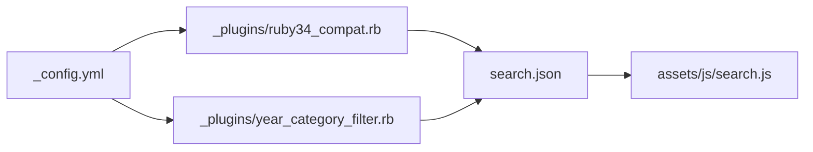

# 兼容性修复插件

<cite>
**本文引用的文件**   
- [_plugins/ruby34_compat.rb](file://_plugins/ruby34_compat.rb)
- [_plugins/year_category_filter.rb](file://_plugins/year_category_filter.rb)
- [_config.yml](file://_config.yml)
- [search.json](file://search.json)
- [assets/js/search.js](file://assets/js/search.js)
</cite>

## 目录
1. [简介](#简介)
2. [项目结构](#项目结构)
3. [核心组件](#核心组件)
4. [架构总览](#架构总览)
5. [详细组件分析](#详细组件分析)
6. [依赖关系分析](#依赖关系分析)
7. [性能考量](#性能考量)
8. [故障排查指南](#故障排查指南)
9. [结论](#结论)
10. [附录：复用与测试](#附录复用与测试)

## 简介
本文件围绕 Ruby 3.4+ 兼容性与搜索索引优化，对站点中的两个 Jekyll 插件进行深入解析：
- 字符串 untaint 方法移除的兼容补丁（Ruby 3.2 起移除 String#untaint）
- URL 过滤器的实现逻辑（正则匹配、URL 识别规则、在搜索索引构建中的应用）
- Liquid 过滤器注册机制的使用方式与调用路径
- 分类过滤钩子（去除由目录结构自动注入的分类）
- 前端搜索索引加载与展示流程
- 兼容性测试方法与验证步骤
- 在其他项目中复用这些模块的实践建议

## 项目结构
与本主题相关的核心文件位于 _plugins 目录与站点根目录下的 search.json，以及前端搜索脚本 assets/js/search.js。配置项集中在 _config.yml。

图表来源
- [_plugins/ruby34_compat.rb:1-19](file://_plugins/ruby34_compat.rb#L1-L19)
- [_plugins/year_category_filter.rb:1-13](file://_plugins/year_category_filter.rb#L1-L13)
- [_config.yml:40-45](file://_config.yml#L40-L45)
- [search.json:1-13](file://search.json#L1-L13)
- [assets/js/search.js:1-526](file://assets/js/search.js#L1-L526)

章节来源
- [_plugins/ruby34_compat.rb:1-19](file://_plugins/ruby34_compat.rb#L1-L19)
- [_plugins/year_category_filter.rb:1-13](file://_plugins/year_category_filter.rb#L1-L13)
- [_config.yml:40-45](file://_config.yml#L40-L45)
- [search.json:1-13](file://search.json#L1-L13)
- [assets/js/search.js:1-526](file://assets/js/search.js#L1-L526)

## 核心组件
- Ruby 3.4+ 兼容性补丁：为旧版 Liquid/Jekyll 提供缺失的 String#untait 方法，避免在 Ruby 3.2+ 环境中报错。
- URL 剥离过滤器：在生成搜索索引时，从内容中剔除裸链接与 Markdown 链接中的 URL，减少噪声并提升检索质量。
- 分类过滤钩子：移除由 _posts 子目录自动注入的分类，仅保留 front matter 显式声明的分类。
- 搜索索引模板：基于 Liquid 组合标题、URL、清洗后的内容与元数据，输出供前端使用的 JSON 索引。
- 前端搜索脚本：加载并缓存索引，执行关键词匹配、中文二元组模糊匹配、结果分页与高亮。

章节来源
- [_plugins/ruby34_compat.rb:1-19](file://_plugins/ruby34_compat.rb#L1-L19)
- [_plugins/year_category_filter.rb:1-13](file://_plugins/year_category_filter.rb#L1-L13)
- [search.json:1-13](file://search.json#L1-L13)
- [assets/js/search.js:1-526](file://assets/js/search.js#L1-L526)

## 架构总览
整体流程：Jekyll 构建阶段通过 Liquid 模板生成 search.json；其中调用了自定义过滤器 strip_urls；同时通过钩子清理分类；前端在页面加载时拉取 search.json，进行本地搜索与展示。

图表来源
- [_plugins/year_category_filter.rb:5-12](file://_plugins/year_category_filter.rb#L5-L12)
- [_plugins/ruby34_compat.rb:10-18](file://_plugins/ruby34_compat.rb#L10-L18)
- [search.json:4-12](file://search.json#L4-L12)
- [assets/js/search.js:184-187](file://assets/js/search.js#L184-L187)

## 详细组件分析

### 组件一：Ruby 3.4+ 兼容性补丁与 URL 过滤器
- 兼容性补丁
  - 行为：当运行环境不支持 String#untaint 时，向 String 类注入一个返回自身的 stub 方法，确保旧版 Liquid/Jekyll 代码不会因缺少该方法而崩溃。
  - 条件注册：仅在 respond_to?(:untaint) 为 false 时生效，避免覆盖已有实现。
- URL 过滤器
  - 功能：将输入转为字符串后，使用正则表达式替换所有 http/https 开头的裸链接片段为空串，从而在生成搜索索引时剔除 URL 噪声。
  - 注册：以 Liquid::Template.register_filter 的方式注册到 Liquid 引擎，使模板中可通过 |strip_urls 调用。
  - 使用位置：在 search.json 中对 clean_content 应用 strip_html | strip_urls | strip，再 jsonify 写入索引。

图表来源
- [_plugins/ruby34_compat.rb:3-7](file://_plugins/ruby34_compat.rb#L3-L7)
- [_plugins/ruby34_compat.rb:10-18](file://_plugins/ruby34_compat.rb#L10-L18)

章节来源
- [_plugins/ruby34_compat.rb:1-19](file://_plugins/ruby34_compat.rb#L1-L19)
- [search.json:7-8](file://search.json#L7-L8)

### 组件二：URL 过滤器的实现逻辑与正则规则
- 正则表达式要点
  - 匹配协议前缀：http 或 https
  - 匹配后续字符：非空白、非引号、非括号等边界字符，直到遇到分隔符为止
  - 作用范围：主要剔除“裸链接”；对于 Markdown 链接，由于模板先按 <pre> 分块并跳过代码块，且链接文本通常不在 URL 段内，因此 URL 剥离主要针对裸链接
- URL 识别规则
  - 仅识别以 http/https 开头的连续序列
  - 遇到空格、引号、尖括号、圆括号、方括号等即停止
- 搜索索引优化策略
  - 在 search.json 中，先用 strip_html 去除 HTML 标签，再用 strip_urls 剔除裸链接，最后 strip 去空白，得到干净的正文用于检索
  - 结合前端的双模式匹配（英文单词边界匹配、中文子串匹配）与中文二元组模糊匹配，提高召回率与相关性

图表来源
- [_plugins/ruby34_compat.rb:12-14](file://_plugins/ruby34_compat.rb#L12-L14)
- [search.json:7-8](file://search.json#L7-L8)

章节来源
- [_plugins/ruby34_compat.rb:12-14](file://_plugins/ruby34_compat.rb#L12-L14)
- [search.json:4-8](file://search.json#L4-L8)

### 组件三：Liquid 过滤器注册机制与调用方式
- 注册方式
  - 通过 Liquid::Template.register_filter 将包含方法的模块注册为全局过滤器
  - 模块名与方法名将作为过滤器名称暴露给模板
- 调用方式
  - 在 Liquid 模板中以管道语法调用，例如：{{ content | strip_urls }}
  - 在本项目中，search.json 对 clean_content 依次应用 strip_html、strip_urls、strip，最终 jsonify 写入索引
- 注意事项
  - 过滤器方法应保证幂等与健壮性，对 nil 或非字符串输入做 to_s 转换
  - 避免在过滤器中进行 I/O 操作，保持构建期性能

图表来源
- [_plugins/ruby34_compat.rb:18](file://_plugins/ruby34_compat.rb#L18)
- [search.json:7-8](file://search.json#L7-L8)

章节来源
- [_plugins/ruby34_compat.rb:18](file://_plugins/ruby34_compat.rb#L18)
- [search.json:7-8](file://search.json#L7-L8)

### 组件四：分类过滤钩子（去除目录自动注入的分类）
- 触发时机：Jekyll 文章初始化后 (:post_init)
- 处理逻辑：
  - 提取相对路径中 _posts 与文件名之间的目录层级作为潜在分类
  - 从 post.data.categories 中剔除这些目录名对应的分类
  - 仅保留 front matter 显式定义的 categories
- 效果：避免目录结构与业务分类耦合，便于统一管理与展示

图表来源
- [_plugins/year_category_filter.rb:5-12](file://_plugins/year_category_filter.rb#L5-L12)

章节来源
- [_plugins/year_category_filter.rb:1-13](file://_plugins/year_category_filter.rb#L1-L13)

### 组件五：前端搜索索引加载与展示流程
- 索引加载
  - 页面加载时预拉取 search.json，失败则静默忽略
  - 用户交互时若索引未就绪，则按需拉取
- 匹配策略
  - 英文：单词边界匹配
  - 中文：子串匹配
  - 含长中文词时启用二元组模糊评分，阈值高于设定值则纳入结果
- 结果展示
  - 标题与摘要高亮
  - 分页加载与滚动触底加载更多
  - 面板动画与遮罩关闭逻辑

图表来源
- [assets/js/search.js:184-187](file://assets/js/search.js#L184-L187)
- [assets/js/search.js:289-365](file://assets/js/search.js#L289-L365)
- [assets/js/search.js:487-514](file://assets/js/search.js#L487-L514)

章节来源
- [assets/js/search.js:1-526](file://assets/js/search.js#L1-L526)

## 依赖关系分析
- 构建期依赖
  - _plugins/ruby34_compat.rb 向 Liquid 注册过滤器，被 search.json 模板调用
  - _plugins/year_category_filter.rb 在文章初始化阶段修改 post.data.categories
  - _config.yml 启用相关插件（如 sitemap、feed、seo-tag），但本主题的核心插件无需显式列出即可自动加载
- 运行时依赖
  - 前端 assets/js/search.js 依赖 search.json 的存在与格式正确性

图表来源
- [_config.yml:40-45](file://_config.yml#L40-L45)
- [_plugins/ruby34_compat.rb:18](file://_plugins/ruby34_compat.rb#L18)
- [_plugins/year_category_filter.rb:5-12](file://_plugins/year_category_filter.rb#L5-L12)
- [search.json:1-13](file://search.json#L1-L13)
- [assets/js/search.js:1-526](file://assets/js/search.js#L1-L526)

章节来源
- [_config.yml:40-45](file://_config.yml#L40-L45)
- [_plugins/ruby34_compat.rb:18](file://_plugins/ruby34_compat.rb#L18)
- [_plugins/year_category_filter.rb:5-12](file://_plugins/year_category_filter.rb#L5-L12)
- [search.json:1-13](file://search.json#L1-L13)
- [assets/js/search.js:1-526](file://assets/js/search.js#L1-L526)

## 性能考量
- 构建期
  - 过滤器应避免复杂计算与 I/O，当前实现为纯字符串替换，开销较低
  - 分类过滤钩子在每篇文章初始化时执行一次，复杂度与分类数量线性相关，影响可忽略
- 前端
  - 索引预加载与去重可减少重复请求与内存占用
  - 中文二元组模糊匹配仅在检测到长中文词时启用，降低常规查询成本
  - 分页与滚动触底加载避免一次性渲染大量 DOM

[本节为通用指导，不直接分析具体文件]

## 故障排查指南
- 构建时报错缺少 String#untaint
  - 现象：在 Ruby 3.2+ 环境下构建失败
  - 原因：旧版 Liquid/Jekyll 调用了已移除的方法
  - 解决：确认 _plugins/ruby34_compat.rb 已存在并被加载，确保其条件注册逻辑生效
- 搜索结果中包含大量链接
  - 现象：search.json 的内容仍包含裸链接
  - 原因：strip_urls 未被调用或正则未命中
  - 排查：检查 search.json 是否使用了 strip_urls；确认过滤器已注册；验证输入是否为字符串
- 分类出现目录名
  - 现象：categories 中出现 _posts 子目录名
  - 原因：钩子未生效或 front matter 覆盖了处理结果
  - 排查：确认 year_category_filter.rb 已加载；检查相对路径与 categories 字段类型

章节来源
- [_plugins/ruby34_compat.rb:3-7](file://_plugins/ruby34_compat.rb#L3-L7)
- [_plugins/ruby34_compat.rb:12-14](file://_plugins/ruby34_compat.rb#L12-L14)
- [_plugins/year_category_filter.rb:5-12](file://_plugins/year_category_filter.rb#L5-L12)
- [search.json:7-8](file://search.json#L7-L8)

## 结论
本插件集通过最小改动实现了 Ruby 3.4+ 环境的兼容性与搜索索引质量的提升：
- 兼容补丁确保旧版 Liquid/Jekyll 在新 Ruby 版本下稳定运行
- URL 剥离过滤器有效降低搜索噪声，配合前端匹配策略提升检索体验
- 分类过滤钩子解耦目录结构与业务分类，便于维护
- 整体方案轻量、易复用，适合在同类 Jekyll 站点中推广

[本节为总结性内容，不直接分析具体文件]

## 附录：复用与测试

### 在其他项目中复用的步骤
- 复制插件文件
  - 将 _plugins/ruby34_compat.rb 与 _plugins/year_category_filter.rb 复制到目标项目的 _plugins 目录
- 确保 Liquid 模板调用过滤器
  - 在生成搜索索引的模板中，对内容应用 strip_html | strip_urls | strip，然后 jsonify
- 前端集成
  - 引入 assets/js/search.js，并确保页面存在搜索容器与输入框，且 data-search-url 指向生成的 search.json
- 验证构建产物
  - 构建后检查 search.json 是否存在且格式正确，内容不包含裸链接

章节来源
- [_plugins/ruby34_compat.rb:10-18](file://_plugins/ruby34_compat.rb#L10-L18)
- [search.json:7-8](file://search.json#L7-L8)
- [assets/js/search.js:1-526](file://assets/js/search.js#L1-L526)

### 兼容性测试方法与验证步骤
- 环境准备
  - 安装 Ruby 3.2 及以上版本
  - 安装 Jekyll 与所需插件
- 构建验证
  - 执行 jekyll build 或 jekyll serve，观察是否报 String#untaint 缺失错误
  - 若未报错，说明兼容补丁生效
- 过滤器验证
  - 打开生成的 search.json，检查 content 字段是否不再包含裸链接
  - 可在某篇文章中加入裸链接，重新构建后对比前后差异
- 分类验证
  - 在 front matter 中显式设置 categories，并在 _posts 下创建多级目录
  - 构建后检查文章的 categories 是否仅包含 front matter 定义的值
- 前端验证
  - 打开站点首页，打开搜索框，输入关键词，确认结果中高亮与摘要正常
  - 尝试长中文词，验证模糊匹配是否生效

章节来源
- [_plugins/ruby34_compat.rb:3-7](file://_plugins/ruby34_compat.rb#L3-L7)
- [_plugins/ruby34_compat.rb:12-14](file://_plugins/ruby34_compat.rb#L12-L14)
- [_plugins/year_category_filter.rb:5-12](file://_plugins/year_category_filter.rb#L5-L12)
- [search.json:7-8](file://search.json#L7-L8)
- [assets/js/search.js:289-365](file://assets/js/search.js#L289-L365)