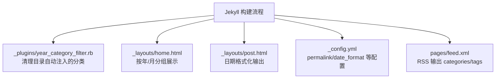
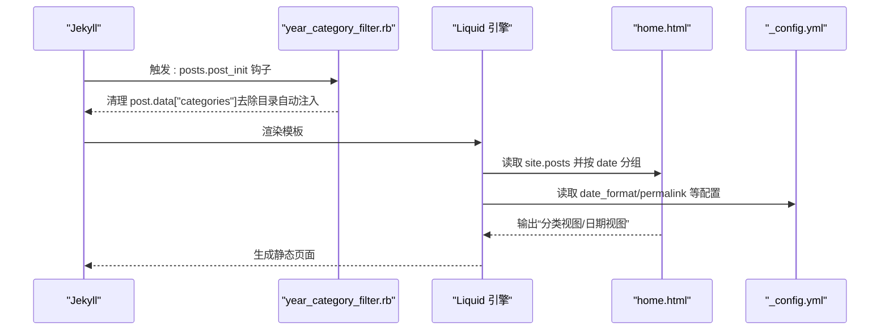
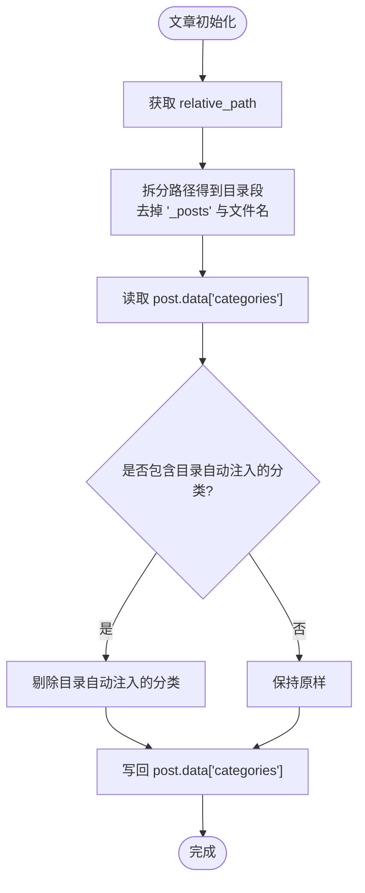
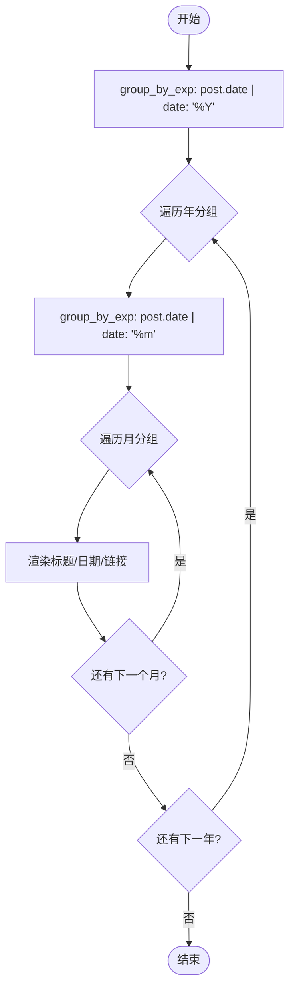
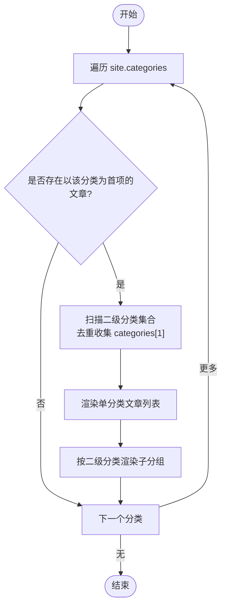
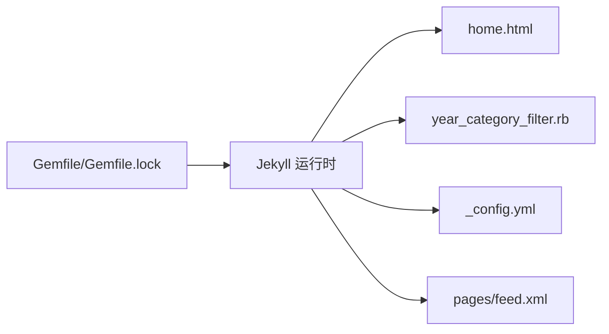

# 分类过滤插件

<cite>
**本文引用的文件**
- [year_category_filter.rb](file://_plugins/year_category_filter.rb)
- [home.html](file://_layouts/home.html)
- [post.html](file://_layouts/post.html)
- [_config.yml](file://_config.yml)
- [Gemfile](file://Gemfile)
- [Gemfile.lock](file://Gemfile.lock)
- [feed.xml](file://pages/feed.xml)
</cite>

## 目录
1. [简介](#简介)
2. [项目结构](#项目结构)
3. [核心组件](#核心组件)
4. [架构总览](#架构总览)
5. [详细组件分析](#详细组件分析)
6. [依赖关系分析](#依赖关系分析)
7. [性能考虑](#性能考虑)
8. [故障排查指南](#故障排查指南)
9. [结论](#结论)
10. [附录](#附录)

## 简介
本文件围绕“年份分类过滤”主题，系统性梳理该博客站点中：
- 文章按年份组织与展示的实现方式（基于 Jekyll 的日期解析与分组）
- 自定义 Ruby 插件对“自动注入的分类”进行清洗的策略
- Liquid 模板中的使用方法与参数配置
- 分类数据的查询接口与排序逻辑
- 性能优化策略、常见问题与扩展方案

需要特别说明的是：当前仓库并未提供名为“年份分类过滤”的专用 Liquid 过滤器；年份维度的分组与展示主要通过 Liquid 内置的 group_by_exp 与 date 过滤器实现。同时，存在一个用于清理“由目录结构自动注入的分类”的自定义插件，确保分类数据仅来自 front matter，从而提升分类维度的一致性与可控性。

## 项目结构
与本主题直接相关的目录与文件如下：
- _plugins/year_category_filter.rb：自定义插件，负责在文章初始化阶段清理由目录结构自动注入的分类
- _layouts/home.html：首页布局，包含“分类视图”和“日期视图”，其中日期视图按年、月分组展示文章
- _layouts/post.html：文章页面布局，涉及日期格式化输出
- _config.yml：站点全局配置，包括 permalink 模式与日期格式等
- Gemfile / Gemfile.lock：Ruby 与 Jekyll/Liquid 版本约束
- pages/feed.xml：RSS 输出，引用 post.categories 字段

图表来源
- [year_category_filter.rb:1-13](file://_plugins/year_category_filter.rb#L1-L13)
- [home.html:87-110](file://_layouts/home.html#L87-L110)
- [post.html:17-21](file://_layouts/post.html#L17-L21)
- [_config.yml:36-15](file://_config.yml#L36-L15)
- [feed.xml:21-26](file://pages/feed.xml#L21-L26)

章节来源
- [year_category_filter.rb:1-13](file://_plugins/year_category_filter.rb#L1-L13)
- [home.html:1-135](file://_layouts/home.html#L1-L135)
- [post.html:1-105](file://_layouts/post.html#L1-L105)
- [_config.yml:1-45](file://_config.yml#L1-L45)
- [Gemfile:1-16](file://Gemfile#L1-L16)
- [Gemfile.lock:114-114](file://Gemfile.lock#L114-L114)
- [feed.xml:1-30](file://pages/feed.xml#L1-L30)

## 核心组件
- 自定义插件：在文章初始化钩子中，移除由目录结构自动注入的分类，仅保留 front matter 显式声明的分类。这保证了后续分类聚合与展示的稳定性。
- 日期分组展示：通过 Liquid 的 group_by_exp 将 site.posts 按 post.date | date: '%Y' 分组，再按月二次分组，形成“年-月”层级归档视图。
- 分类视图：首页也支持按分类聚合，并支持二级分类（categories[1]）作为子分组。
- 配置项：_config.yml 中的 permalink 与 minima.date_format 影响 URL 结构与日期显示格式。

章节来源
- [year_category_filter.rb:5-12](file://_plugins/year_category_filter.rb#L5-L12)
- [home.html:87-110](file://_layouts/home.html#L87-L110)
- [home.html:19-85](file://_layouts/home.html#L19-L85)
- [_config.yml:36-15](file://_config.yml#L36-L15)

## 架构总览
下图展示了从 Jekyll 构建到最终页面渲染的关键路径，以及自定义插件的作用点。

图表来源
- [year_category_filter.rb:5-12](file://_plugins/year_category_filter.rb#L5-L12)
- [home.html:87-110](file://_layouts/home.html#L87-L110)
- [_config.yml:36-15](file://_config.yml#L36-L15)

## 详细组件分析

### 自定义插件：清理目录自动注入的分类
- 作用时机：在文章初始化阶段（post_init），此时 post.relative_path 已确定，post.data["categories"] 可能包含由目录结构自动注入的分类。
- 处理逻辑：
  - 提取相对路径中位于 “_posts” 与文件名之间的所有目录名，作为“目录自动注入的分类集合”。
  - 从 post.data["categories"] 中剔除这些目录名对应的分类，仅保留 front matter 显式定义的分类。
- 结果：后续模板或插件对 categories 的聚合与展示更稳定，避免目录命名污染分类语义。

图表来源
- [year_category_filter.rb:5-12](file://_plugins/year_category_filter.rb#L5-L12)

章节来源
- [year_category_filter.rb:1-13](file://_plugins/year_category_filter.rb#L1-L13)

### 日期分组与年份分类展示（Liquid 模板）
- 年份分组：使用 group_by_exp 对 site.posts 按 post.date | date: '%Y' 分组，得到按年的分组对象列表。
- 月份分组：在每个年分组内，再次按 post.date | date: '%m' 分组，形成“年-月”层级。
- 计数与展开：每个分组统计 items.size，并在首组默认展开（open）。
- 链接与标题：遍历 items，输出文章标题与相对链接。

图表来源
- [home.html:87-110](file://_layouts/home.html#L87-L110)

章节来源
- [home.html:87-110](file://_layouts/home.html#L87-L110)

### 分类视图与二级分类（categories[1]）
- 一级分类：遍历 site.categories，筛选出以某分类为第一元素的文章集合。
- 二级分类：若文章具有两个及以上分类，则使用第二分类作为子分组键，统计数量并渲染子折叠区。
- 单分类文章：直接归入一级分类下的列表。

图表来源
- [home.html:19-85](file://_layouts/home.html#L19-L85)

章节来源
- [home.html:19-85](file://_layouts/home.html#L19-L85)

### 日期格式化与输出
- 文章页时间元信息：根据 page.create_time/page.update_time/page.date 分别格式化输出，遵循 _config.yml 中 minima.date_format 或默认 "%Y-%m-%d"。
- 首页日期视图：使用 date: '%Y' 与 date: '%m' 进行分组，并以 "%m月" 与 "%m-%d" 形式展示。

章节来源
- [post.html:9-21](file://_layouts/post.html#L9-L21)
- [home.html:87-110](file://_layouts/home.html#L87-L110)
- [_config.yml:13-15](file://_config.yml#L13-L15)

### RSS 输出中的分类与标签
- feed.xml 会遍历 post.tags 与 post.categories，将其写入 <category> 节点，便于订阅器消费。

章节来源
- [feed.xml:21-26](file://pages/feed.xml#L21-L26)

## 依赖关系分析
- Jekyll 版本与插件生态：
  - Gemfile 指定 jekyll ~> 3.9，minima ~> 2.5，liquid >= 4.0.4。
  - Gemfile.lock 确认 liquid 版本为 4.0.4，满足 group_by_exp 与 date 过滤器的行为预期。
- 自定义插件与 Jekyll 生命周期：
  - 通过 Jekyll::Hooks.register :posts, :post_init 注册钩子，在文章加载后、渲染前执行。
- 模板与配置：
  - home.html 依赖 site.posts、site.categories 与 Liquid 过滤器。
  - _config.yml 的 permalink 与 minima.date_format 影响 URL 与日期显示。

图表来源
- [Gemfile:1-16](file://Gemfile#L1-L16)
- [Gemfile.lock:114-114](file://Gemfile.lock#L114-L114)
- [year_category_filter.rb:5-12](file://_plugins/year_category_filter.rb#L5-L12)
- [home.html:87-110](file://_layouts/home.html#L87-L110)
- [_config.yml:36-15](file://_config.yml#L36-L15)
- [feed.xml:21-26](file://pages/feed.xml#L21-L26)

章节来源
- [Gemfile:1-16](file://Gemfile#L1-L16)
- [Gemfile.lock:114-114](file://Gemfile.lock#L114-L114)
- [year_category_filter.rb:5-12](file://_plugins/year_category_filter.rb#L5-L12)
- [home.html:87-110](file://_layouts/home.html#L87-L110)
- [_config.yml:36-15](file://_config.yml#L36-L15)
- [feed.xml:21-26](file://pages/feed.xml#L21-L26)

## 性能考虑
- 分组复杂度：
  - group_by_exp 会对 site.posts 进行两次分组（年、月），时间复杂度近似 O(N log N)（取决于底层实现与排序开销），N 为文章总数。
- 减少重复计算：
  - 可将常用分组结果缓存到中间变量（如 posts_by_year、posts_by_month），避免多次遍历。
- 控制渲染范围：
  - 在分页或按需加载场景下，限制每次渲染的文章数量，降低模板渲染压力。
- 插件开销：
  - 自定义插件仅在 post_init 阶段运行一次，开销可忽略不计。

[本节为通用性能建议，不直接分析具体文件]

## 故障排查指南
- 分类未按预期出现：
  - 检查是否在 front matter 中正确声明 categories；由于插件会剔除目录自动注入的分类，仅保留 front matter 显式定义的分类。
  - 参考：[year_category_filter.rb:5-12](file://_plugins/year_category_filter.rb#L5-L12)
- 年份/月份分组异常：
  - 确认文章的 date/create_time/update_time 字段格式符合 Jekyll 解析要求；检查 _config.yml 中 minima.date_format 设置。
  - 参考：[post.html:9-21](file://_layouts/post.html#L9-L21)、[_config.yml:13-15](file://_config.yml#L13-L15)
- 首页日期视图未显示或顺序错误：
  - 检查 group_by_exp 表达式与 date 过滤器格式是否正确；确认 site.posts 非空。
  - 参考：[home.html:87-110](file://_layouts/home.html#L87-L110)
- RSS 缺少分类或标签：
  - 检查 feed.xml 中对 post.tags 与 post.categories 的遍历逻辑。
  - 参考：[feed.xml:21-26](file://pages/feed.xml#L21-L26)

章节来源
- [year_category_filter.rb:5-12](file://_plugins/year_category_filter.rb#L5-L12)
- [post.html:9-21](file://_layouts/post.html#L9-L21)
- [_config.yml:13-15](file://_config.yml#L13-L15)
- [home.html:87-110](file://_layouts/home.html#L87-L110)
- [feed.xml:21-26](file://pages/feed.xml#L21-L26)

## 结论
- 年份分类展示主要依赖 Liquid 的 group_by_exp 与 date 过滤器，无需额外自定义过滤器即可实现“年-月”层级归档。
- 自定义插件用于清理目录自动注入的分类，保证分类数据来源于 front matter，提升一致性与可控性。
- 通过合理配置 _config.yml 与模板中的分组逻辑，可实现稳定、易维护的年份分类与展示。
- 如需扩展分类维度或修改过滤规则，可在现有模板基础上增加新的 group_by_exp 表达式，或在插件中扩展清洗策略。

[本节为总结性内容，不直接分析具体文件]

## 附录

### Liquid 模板使用方法与参数
- 按年分组：
  - 使用 group_by_exp 对 site.posts 按 post.date | date: '%Y' 分组，得到 year_group.name 与 year_group.items。
  - 参考：[home.html:87-92](file://_layouts/home.html#L87-L92)
- 按月分组：
  - 在年分组内，使用 group_by_exp 对 post.date | date: '%m' 分组，得到 month_group.items。
  - 参考：[home.html:93-106](file://_layouts/home.html#L93-L106)
- 分类视图：
  - 遍历 site.categories，筛选以某分类为首项的文章集合；若存在二级分类，则以 categories[1] 作为子分组键。
  - 参考：[home.html:19-85](file://_layouts/home.html#L19-L85)
- 日期格式化：
  - 使用 date 过滤器与 _config.yml 中 minima.date_format 控制输出格式。
  - 参考：[post.html:17-21](file://_layouts/post.html#L17-L21)、[_config.yml:13-15](file://_config.yml#L13-L15)

章节来源
- [home.html:87-110](file://_layouts/home.html#L87-L110)
- [home.html:19-85](file://_layouts/home.html#L19-L85)
- [post.html:17-21](file://_layouts/post.html#L17-L21)
- [_config.yml:13-15](file://_config.yml#L13-L15)

### 分类数据查询接口
- 站点级接口：
  - site.posts：所有文章集合，可用于任意维度分组与过滤。
  - site.categories：按分类聚合的文章映射，key 为分类名，value 为文章数组。
- 文章级属性：
  - post.date：文章日期（YYYY-MM-DD），用于年份/月份分组。
  - post.categories：front matter 中声明的分类数组（经插件清洗后不含目录自动注入的分类）。
- RSS 输出：
  - pages/feed.xml 遍历 post.tags 与 post.categories，供订阅器消费。

章节来源
- [home.html:87-110](file://_layouts/home.html#L87-L110)
- [home.html:19-85](file://_layouts/home.html#L19-L85)
- [year_category_filter.rb:5-12](file://_plugins/year_category_filter.rb#L5-L12)
- [feed.xml:21-26](file://pages/feed.xml#L21-L26)

### 实际使用示例（步骤说明）
- 新增按年归档页面：
  - 在模板中使用 group_by_exp 对 site.posts 按 post.date | date: '%Y' 分组，遍历 year_group.items 渲染文章列表。
  - 参考：[home.html:87-110](file://_layouts/home.html#L87-L110)
- 调整日期显示格式：
  - 在 _config.yml 中修改 minima.date_format，或在模板中直接使用 date 过滤器指定格式。
  - 参考：[_config.yml:13-15](file://_config.yml#L13-L15)、[post.html:17-21](file://_layouts/post.html#L17-L21)
- 确保分类一致性：
  - 在 front matter 中明确声明 categories；避免依赖目录结构自动注入的分类。
  - 参考：[year_category_filter.rb:5-12](file://_plugins/year_category_filter.rb#L5-L12)

章节来源
- [home.html:87-110](file://_layouts/home.html#L87-L110)
- [_config.yml:13-15](file://_config.yml#L13-L15)
- [post.html:17-21](file://_layouts/post.html#L17-L21)
- [year_category_filter.rb:5-12](file://_plugins/year_category_filter.rb#L5-L12)

### 常见问题解决方案
- 问题：分类中包含目录名导致展示混乱
  - 解决：插件会在 post_init 阶段剔除目录自动注入的分类，确保仅保留 front matter 声明的分类。
  - 参考：[year_category_filter.rb:5-12](file://_plugins/year_category_filter.rb#L5-L12)
- 问题：年份/月份分组不正确
  - 解决：检查 date 字段格式与 _config.yml 中 date_format；必要时在模板中显式使用 date 过滤器。
  - 参考：[post.html:17-21](file://_layouts/post.html#L17-L21)、[_config.yml:13-15](file://_config.yml#L13-L15)
- 问题：RSS 缺少分类或标签
  - 解决：检查 feed.xml 中对 post.tags 与 post.categories 的遍历逻辑。
  - 参考：[feed.xml:21-26](file://pages/feed.xml#L21-L26)

章节来源
- [year_category_filter.rb:5-12](file://_plugins/year_category_filter.rb#L5-L12)
- [post.html:17-21](file://_layouts/post.html#L17-L21)
- [_config.yml:13-15](file://_config.yml#L13-L15)
- [feed.xml:21-26](file://pages/feed.xml#L21-L26)

### 扩展分类维度与修改过滤规则
- 扩展维度：
  - 在模板中新增 group_by_exp 表达式，例如按 post.date | date: '%Y-%m' 组合分组，或引入自定义字段（如 post.year_tag）进行分组。
  - 参考：[home.html:87-110](file://_layouts/home.html#L87-L110)
- 修改过滤规则：
  - 在 year_category_filter.rb 中扩展清洗策略，例如保留特定目录名作为分类，或合并多个目录段为单一分类键。
  - 参考：[year_category_filter.rb:5-12](file://_plugins/year_category_filter.rb#L5-L12)

章节来源
- [home.html:87-110](file://_layouts/home.html#L87-L110)
- [year_category_filter.rb:5-12](file://_plugins/year_category_filter.rb#L5-L12)