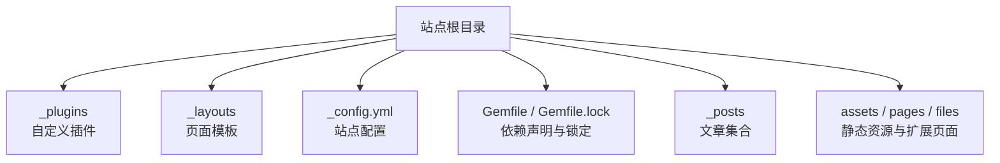
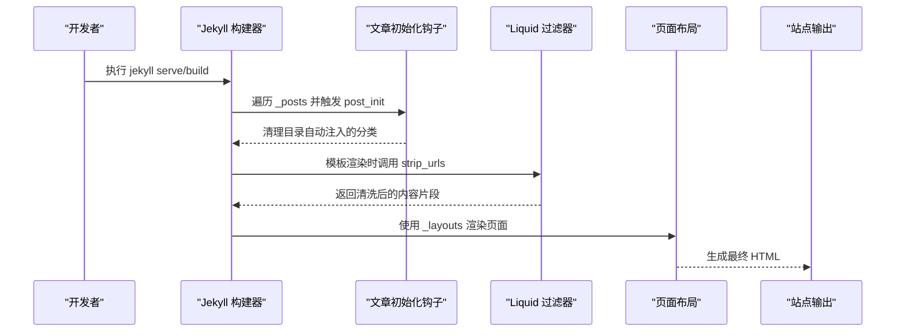
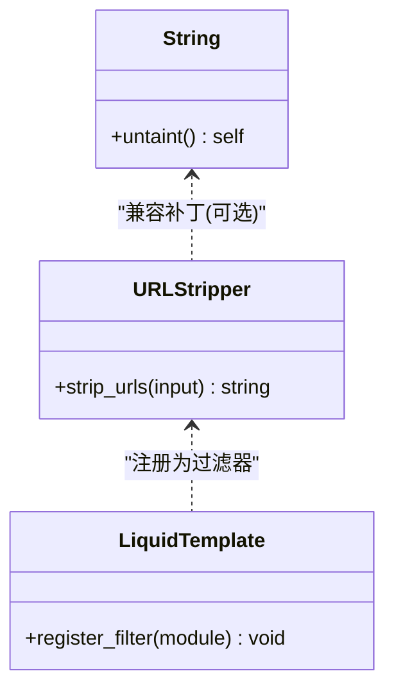
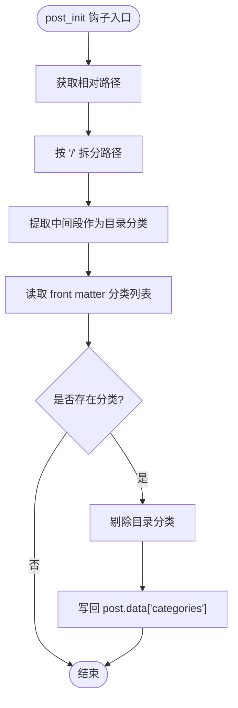
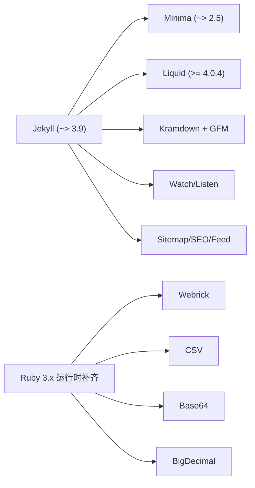

# 开发工作流程

<cite>
**本文引用的文件**   
- [_plugins/ruby34_compat.rb](file://_plugins/ruby34_compat.rb)
- [_plugins/year_category_filter.rb](file://_plugins/year_category_filter.rb)
- [_config.yml](file://_config.yml)
- [Gemfile](file://Gemfile)
- [Gemfile.lock](file://Gemfile.lock)
- [README.md](file://README.md)
- [_layouts/home.html](file://_layouts/home.html)
- [_layouts/post.html](file://_layouts/post.html)
</cite>

## 目录
1. [简介](#简介)
2. [项目结构](#项目结构)
3. [核心组件](#核心组件)
4. [架构总览](#架构总览)
5. [详细组件分析](#详细组件分析)
6. [依赖分析](#依赖分析)
7. [性能考虑](#性能考虑)
8. [故障排查指南](#故障排查指南)
9. [结论](#结论)
10. [附录](#附录)

## 简介
本指南面向 Jekyll 插件开发者，结合仓库中已有的本地插件与配置，系统化梳理从需求分析、设计规划到代码实现、测试与发布的完整工作流。重点覆盖：
- 本地环境搭建（Ruby 版本、Jekyll 依赖、调试工具）
- 标准化开发流程（需求定义、API 设计、实现、单测/集成测试、文档）
- 调试技巧与常见问题（日志、错误追踪、性能分析）
- 版本管理与发布（兼容性测试、向后兼容保证）

## 项目结构
仓库采用 Jekyll 标准目录组织，插件位于 _plugins 目录，主题布局在 _layouts，站点配置在 _config.yml，依赖管理通过 Gemfile/Gemfile.lock。

图表来源
- [Gemfile:1-17](file://Gemfile#L1-L17)
- [_config.yml:1-45](file://_config.yml#L1-L45)

章节来源
- [README.md:19-86](file://README.md#L19-L86)
- [Gemfile:1-17](file://Gemfile#L1-L17)
- [_config.yml:1-45](file://_config.yml#L1-L45)

## 核心组件
- 本地插件
  - Ruby 3.4+ 兼容补丁与 Liquid 过滤器注册
  - 文章初始化钩子：移除由目录自动注入的分类，仅保留 front matter 显式分类
- 站点配置
  - 主题、Markdown 解析器、高亮器、永久链接等
  - 启用第三方插件（sitemap、SEO、Feed）
- 依赖管理
  - 固定 Jekyll 与 Minima 版本范围
  - 针对 Ruby 3.x 的运行时依赖补齐（webrick、csv、base64、bigdecimal）
  - Liquid 版本约束以修复 untaint 兼容问题

章节来源
- [_plugins/ruby34_compat.rb:1-19](file://_plugins/ruby34_compat.rb#L1-L19)
- [_plugins/year_category_filter.rb:1-13](file://_plugins/year_category_filter.rb#L1-L13)
- [_config.yml:35-45](file://_config.yml#L35-L45)
- [Gemfile:1-17](file://Gemfile#L1-L17)
- [Gemfile.lock:76-121](file://Gemfile.lock#L76-L121)

## 架构总览
下图展示 Jekyll 构建过程中，本地插件如何参与数据预处理与模板渲染。

图表来源
- [_plugins/year_category_filter.rb:5-12](file://_plugins/year_category_filter.rb#L5-L12)
- [_plugins/ruby34_compat.rb:10-18](file://_plugins/ruby34_compat.rb#L10-L18)
- [_layouts/home.html:1-135](file://_layouts/home.html#L1-L135)
- [_layouts/post.html:1-105](file://_layouts/post.html#L1-L105)

## 详细组件分析

### 组件一：Ruby 3.4+ 兼容补丁与 URL 过滤
- 目标
  - 解决旧版 Liquid/Jekyll 在 Ruby 3.2+ 下缺失 String#untaint 的问题
  - 提供 Liquid 过滤器用于从文章内容中剥离 URL，优化搜索索引体积
- 关键行为
  - 条件性为 String 类添加 untait 方法（若不存在）
  - 定义 Jekyll::URLStripper 模块并提供 strip_urls 方法
  - 将过滤器注册到 Liquid 模板引擎
- 复杂度与影响
  - 字符串正则替换时间复杂度 O(n)，n 为输入长度；对大文档需关注性能
  - 过滤器仅在模板调用处生效，避免全局开销
- 可优化点
  - 预编译正则表达式对象以减少重复编译
  - 对空值或短文本快速返回，减少无谓处理

图表来源
- [_plugins/ruby34_compat.rb:1-19](file://_plugins/ruby34_compat.rb#L1-L19)

章节来源
- [_plugins/ruby34_compat.rb:1-19](file://_plugins/ruby34_compat.rb#L1-L19)

### 组件二：文章分类清理钩子
- 目标
  - 去除 Jekyll 基于 _posts 子目录自动注入的分类，仅保留 front matter 中的显式分类
- 关键行为
  - 注册 posts.post_init 钩子
  - 解析相对路径，提取目录层级作为“目录分类”
  - 从 post.data.categories 中剔除目录分类
- 复杂度与影响
  - 每篇文章一次路径分割与数组过滤，整体 O(m*k)，m 为文章数，k 为平均分类数量
  - 对首页分类视图与归档逻辑有直接影响
- 可优化点
  - 当 categories 为空或目录层级为空时短路返回
  - 缓存已处理的相对路径映射，避免重复计算

图表来源
- [_plugins/year_category_filter.rb:5-12](file://_plugins/year_category_filter.rb#L5-L12)

章节来源
- [_plugins/year_category_filter.rb:1-13](file://_plugins/year_category_filter.rb#L1-L13)

### 组件三：站点配置与主题集成
- 主题与皮肤
  - 使用 minima 主题，支持 auto/classic/dark 皮肤
  - 日期格式统一配置
- Markdown 与高亮
  - kramdown 解析器配合 gfm 扩展
  - rouge 语法高亮
- 插件启用
  - sitemap、seo-tag、feed 通过 plugins 字段启用
- 永久链接
  - 使用年/月/日/标题的 URL 结构，便于归档与 SEO

章节来源
- [_config.yml:1-45](file://_config.yml#L1-L45)

### 组件四：依赖管理与 Ruby 版本适配
- 版本约束
  - jekyll ~> 3.9，minima ~> 2.5，liquid >= 4.0.4
- Ruby 3.x 运行依赖
  - webrick、csv、base64、bigdecimal 显式声明，避免运行时缺失
- 平台与锁定
  - Gemfile.lock 锁定具体版本，确保多环境一致性与可复现构建

章节来源
- [Gemfile:1-17](file://Gemfile#L1-L17)
- [Gemfile.lock:76-121](file://Gemfile.lock#L76-L121)

## 依赖分析
- 直接依赖
  - Jekyll 生态：jekyll、minima、liquid、kramdown-parser-gfm
  - 运行时补齐：webrick、csv、base64、bigdecimal
  - 第三方插件：jekyll-sitemap、jekyll-seo-tag、jekyll-feed
- 间接依赖
  - 监听与热重载：listen、rb-fsevent、rb-inotify
  - 安全与序列化：safe_yaml、rexml
  - 样式与转换：sass、rouge
- 耦合关系
  - 本地插件与 Liquid/Jekyll 内部 API 强耦合（过滤器注册、Hooks 注册）
  - 布局模板与站点数据模型（site.posts、page.*）紧密耦合

图表来源
- [Gemfile:1-17](file://Gemfile#L1-L17)
- [Gemfile.lock:76-121](file://Gemfile.lock#L76-L121)

章节来源
- [Gemfile:1-17](file://Gemfile#L1-L17)
- [Gemfile.lock:76-121](file://Gemfile.lock#L76-L121)

## 性能考虑
- 过滤器性能
  - 对长文本进行正则替换可能成为热点，建议：
    - 预编译正则对象
    - 对空/短文本短路返回
    - 仅在需要时调用（如生成搜索索引）
- 钩子性能
  - 文章初始化阶段应避免 I/O 与重型计算
  - 对分类过滤做短路判断与缓存
- 构建与增量
  - 合理使用 watch 模式，避免全量重建
  - 变更 _config.yml 后重启服务，避免增量缓存冲突

[本节为通用指导，不直接分析具体文件]

## 故障排查指南
- 常见环境问题
  - Ruby 版本过新导致 untaint 缺失：通过 Liquid 版本约束与本地补丁缓解
  - 缺少 webrick/csv/base64/bigdecimal：在 Gemfile 中显式声明
  - Windows 下构建失败：安装 Ruby+Devkit 与工具链
- 构建与预览
  - 修改配置后未生效：重启 jekyll serve
  - 页面未更新或样式错乱：清理 _site 后重新构建
- 插件相关
  - 过滤器未生效：确认已在模板中正确调用，且过滤器已注册
  - 分类显示异常：检查 front matter 与目录结构是否混用分类

章节来源
- [README.md:128-141](file://README.md#L128-L141)
- [Gemfile:5-10](file://Gemfile#L5-L10)
- [_plugins/ruby34_compat.rb:1-7](file://_plugins/ruby34_compat.rb#L1-L7)

## 结论
本指南基于仓库现有实践，总结了 Jekyll 插件开发的端到端流程与环境要求。通过本地插件与配置的协同，实现了 Ruby 版本兼容、内容预处理与模板渲染增强。建议在后续迭代中引入更完善的测试与文档体系，进一步提升插件的可维护性与可移植性。

[本节为总结性内容，不直接分析具体文件]

## 附录

### 本地开发环境搭建要点
- Ruby 与工具链
  - Windows：安装 Ruby+Devkit，安装工具链，必要时换源
  - Ubuntu：安装 ruby-full、build-essential、zlib1g-dev，配置 gem 安装路径
- 依赖安装与启动
  - bundle install 安装依赖
  - bundle exec jekyll serve 启动本地服务
- 注意事项
  - 始终使用 bundle exec 保证版本一致性
  - 修改 _config.yml 后重启服务
  - 遇到缓存问题，删除 _site 后重建

章节来源
- [README.md:19-86](file://README.md#L19-L86)
- [README.md:113-141](file://README.md#L113-L141)

### 插件开发标准化流程
- 需求定义
  - 明确要解决的问题与边界（如：清理目录自动分类、提供内容清洗过滤器）
- API 设计
  - 过滤器：命名清晰、参数单一、返回值稳定
  - 钩子：选择合适生命周期（如 post_init），最小化副作用
- 代码实现
  - 遵循 Ruby 风格与 Jekyll 约定
  - 做好空值与边界情况处理
- 单元测试
  - 针对过滤器与钩子逻辑编写用例
  - 模拟 Jekyll 对象与数据模型
- 集成测试
  - 在真实站点环境中验证插件行为
  - 覆盖不同 Ruby 与 Jekyll 版本组合
- 文档编写
  - 说明插件用途、用法、配置项与示例
  - 记录已知限制与兼容性矩阵

[本节为通用流程指导，不直接分析具体文件]

### 调试技巧与常见问题
- 日志记录
  - 在钩子与过滤器中加入轻量日志，定位数据流转
- 错误追踪
  - 捕获并打印上下文信息（如相对路径、分类列表）
- 性能分析
  - 对热点函数计时，识别瓶颈
  - 避免在构建期进行网络请求或磁盘 I/O
- 常见问题
  - 过滤器未注册：检查 register_filter 调用时机
  - 钩子未触发：确认事件名与对象类型匹配
  - 分类显示异常：核对 front matter 与目录结构的一致性

章节来源
- [_plugins/year_category_filter.rb:5-12](file://_plugins/year_category_filter.rb#L5-L12)
- [_plugins/ruby34_compat.rb:10-18](file://_plugins/ruby34_compat.rb#L10-L18)

### 版本管理与发布流程
- 版本策略
  - 语义化版本控制（主/次/修订）
  - 变更日志记录破坏性变更与新增特性
- 兼容性测试
  - 多 Ruby 版本（含 3.x）与 Jekyll 版本矩阵
  - 第三方插件共存场景验证
- 向后兼容保证
  - 保持过滤器与钩子接口稳定
  - 废弃功能提供迁移指引与过渡期
- 发布清单
  - 更新 Gemspec/版本号
  - 锁定依赖（Gemfile.lock）
  - 更新文档与示例
  - 回归测试通过后打标签并发布

[本节为通用发布指导，不直接分析具体文件]