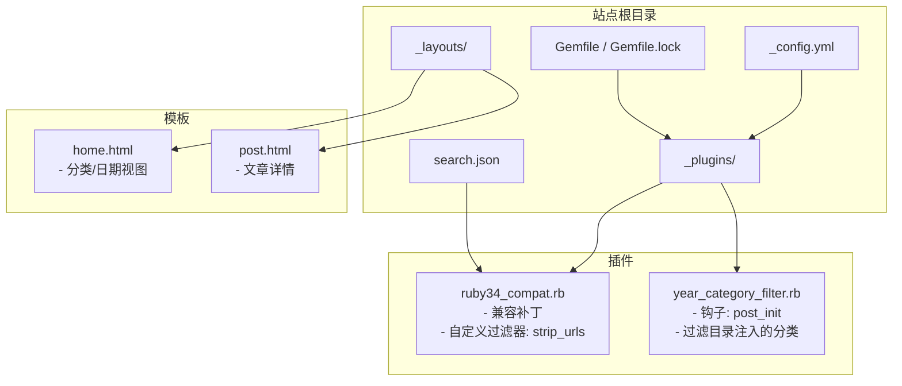
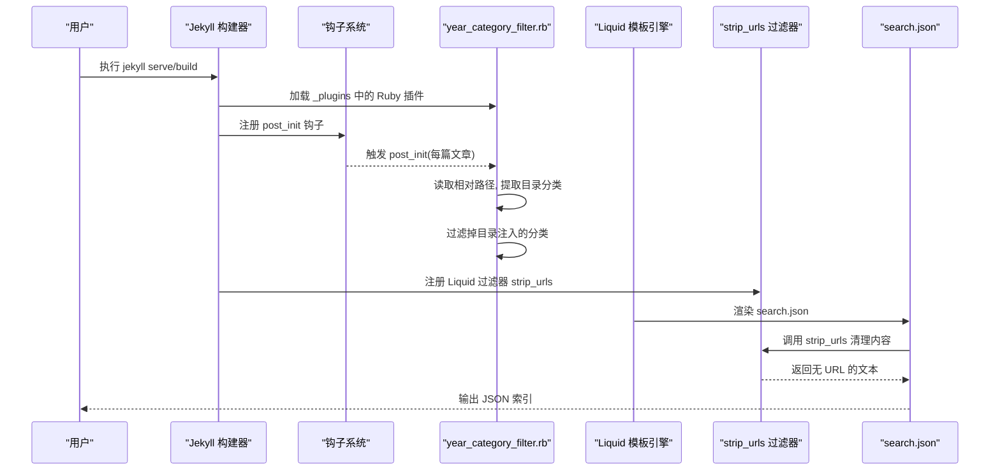
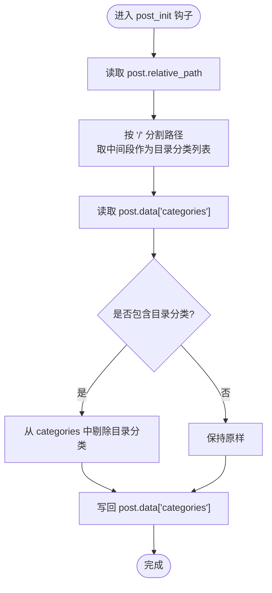
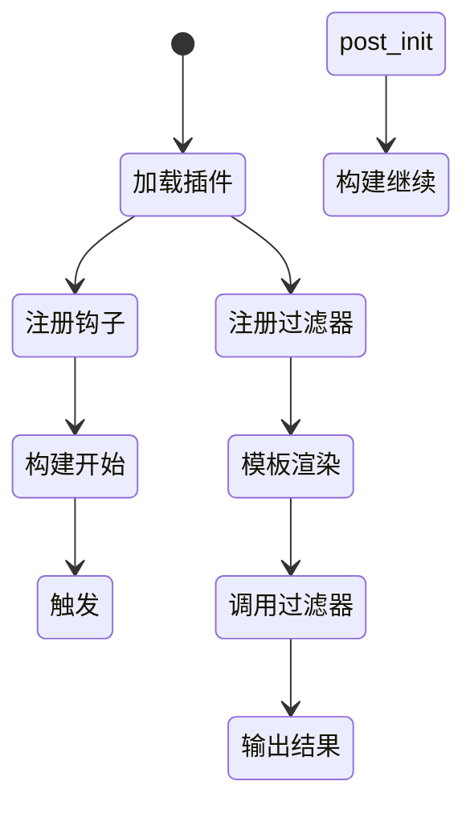
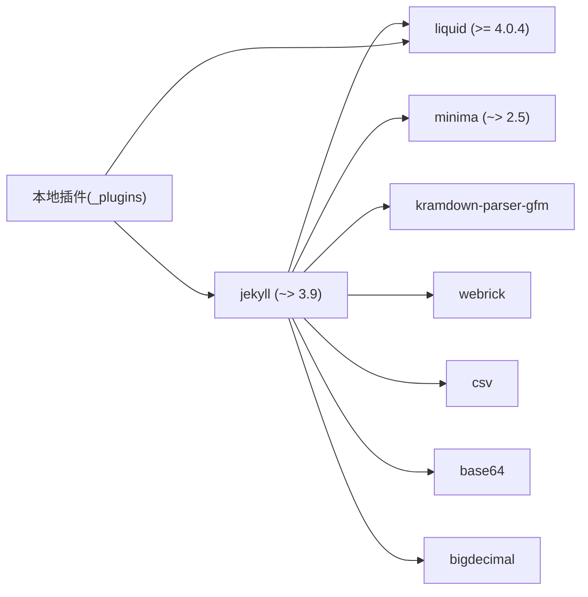

# 插件开发

<cite>
**本文引用的文件**   
- [ruby34_compat.rb](file://_plugins/ruby34_compat.rb)
- [year_category_filter.rb](file://_plugins/year_category_filter.rb)
- [_config.yml](file://_config.yml)
- [Gemfile](file://Gemfile)
- [Gemfile.lock](file://Gemfile.lock)
- [README.md](file://README.md)
- [search.json](file://search.json)
- [home.html](file://_layouts/home.html)
- [post.html](file://_layouts/post.html)
</cite>

## 目录
1. [简介](#简介)
2. [项目结构](#项目结构)
3. [核心组件](#核心组件)
4. [架构总览](#架构总览)
5. [详细组件分析](#详细组件分析)
6. [依赖分析](#依赖分析)
7. [性能考虑](#性能考虑)
8. [故障排查指南](#故障排查指南)
9. [结论](#结论)
10. [附录](#附录)

## 简介
本指南面向希望在 Jekyll 中开发 Ruby 插件的读者，结合本项目中的两个实际插件：Ruby 3.4+ 兼容性修复与 URL 清理过滤器、以及“年份分类过滤”钩子插件。文档将系统阐述 Jekyll 插件系统的架构与工作原理（包括钩子系统与过滤器注册机制）、现有插件的实现细节、生命周期与扩展点、在构建流程中插入自定义逻辑的方法，并提供从需求分析到实现、测试与部署的完整流程。同时涵盖 Liquid 模板语言的高级用法与自定义过滤器编写方法、调试技巧与错误处理策略，并给出可复用的最佳实践建议。

## 项目结构
本项目采用 Jekyll 标准目录组织方式，关键目录与文件如下：
- _plugins：存放本地 Ruby 插件，Jekyll 启动时自动加载
- _layouts：Liquid 布局模板，使用内置与自定义过滤器
- search.json：生成全文搜索索引，演示自定义过滤器的使用
- _config.yml：站点配置，包含主题、Markdown 解析器、高亮器等设置
- Gemfile/Gemfile.lock：依赖声明与锁定版本，确保 Ruby 3.4+ 兼容



图表来源
- [_config.yml:1-45](file://_config.yml#L1-L45)
- [Gemfile:1-17](file://Gemfile#L1-L17)
- [Gemfile.lock:1-132](file://Gemfile.lock#L1-L132)
- [ruby34_compat.rb:1-19](file://_plugins/ruby34_compat.rb#L1-L19)
- [year_category_filter.rb:1-13](file://_plugins/year_category_filter.rb#L1-L13)
- [home.html:1-135](file://_layouts/home.html#L1-L135)
- [post.html:1-105](file://_layouts/post.html#L1-L105)
- [search.json:1-12](file://search.json#L1-L12)

章节来源
- [README.md:1-157](file://README.md#L1-L157)
- [_config.yml:1-45](file://_config.yml#L1-L45)
- [Gemfile:1-17](file://Gemfile#L1-L17)
- [Gemfile.lock:1-132](file://Gemfile.lock#L1-L132)

## 核心组件
- 兼容性修复与自定义过滤器插件（ruby34_compat.rb）
  - 提供 Ruby 3.4+ 下 String#untaint 缺失时的兼容层
  - 定义并注册 Liquid 过滤器 strip_urls，用于清理内容中的 URL
- 钩子插件（year_category_filter.rb）
  - 通过 Jekyll::Hooks 在文章初始化阶段拦截，移除由目录结构自动注入的分类，仅保留 front matter 显式定义的分类

章节来源
- [ruby34_compat.rb:1-19](file://_plugins/ruby34_compat.rb#L1-L19)
- [year_category_filter.rb:1-13](file://_plugins/year_category_filter.rb#L1-L13)

## 架构总览
Jekyll 插件体系的核心在于：
- 钩子系统（Hooks）：在站点构建的生命周期中挂入回调，如 posts.post_init、pages.post_render 等
- 过滤器注册（Filters）：向 Liquid 模板引擎注册自定义过滤器，供模板调用
- 插件发现与加载：_plugins 目录下的 Ruby 文件在启动时被自动 require



图表来源
- [year_category_filter.rb:1-13](file://_plugins/year_category_filter.rb#L1-L13)
- [ruby34_compat.rb:1-19](file://_plugins/ruby34_compat.rb#L1-L19)
- [search.json:1-12](file://search.json#L1-L12)

## 详细组件分析

### 组件一：Ruby 3.4+ 兼容性与 URL 清理过滤器
该插件承担两项职责：
- 兼容层：为旧版 Liquid/Jekyll 在 Ruby 3.4+ 环境下提供 String#untaint 的兼容实现
- 自定义过滤器：定义并注册 strip_urls，用于在生成搜索索引时去除正文中的 URL，提升检索质量

```mermaid
classDiagram
class String {
+untaint() self
}
module Jekyll {
<<module>>
module URLStripper {
+strip_urls(input) string
}
}
class Liquid_Template {
+register_filter(module) void
}
String <.. Jekyll : "兼容补丁"
Jekyll ..> Liquid_Template : "注册过滤器"
```

图表来源
- [ruby34_compat.rb:1-19](file://_plugins/ruby34_compat.rb#L1-L19)

#### 功能要点
- 兼容补丁仅在目标环境缺少 untaint 时生效，避免覆盖已有实现
- 过滤器以模块形式定义，并通过 Liquid::Template.register_filter 注册，使模板可直接使用 | strip_urls

#### 使用示例（引用路径）
- 在 search.json 中使用自定义过滤器清理内容
  - 参考路径：[search.json:1-12](file://search.json#L1-L12)

章节来源
- [ruby34_compat.rb:1-19](file://_plugins/ruby34_compat.rb#L1-L19)
- [search.json:1-12](file://search.json#L1-L12)

### 组件二：年份分类过滤钩子插件
该插件通过 Jekyll::Hooks 在文章初始化阶段介入，修正由目录结构自动注入的分类，确保分类数据仅来自 front matter。



图表来源
- [year_category_filter.rb:1-13](file://_plugins/year_category_filter.rb#L1-L13)

#### 行为说明
- 针对 _posts 下的多级目录（如 2019/python/...），插件会识别这些目录名并视为“目录注入的分类”
- 若 front matter 已显式定义分类，则保留；否则最终 categories 为空数组
- 此行为对首页分类视图与 RSS feed 的分类输出均有影响

章节来源
- [year_category_filter.rb:1-13](file://_plugins/year_category_filter.rb#L1-L13)
- [home.html:1-135](file://_layouts/home.html#L1-L135)
- [feed.xml:1-30](file://pages/feed.xml#L1-L30)

### 概念性概览：Jekyll 插件生命周期与扩展点
- 插件加载：Jekyll 启动时扫描 _plugins 目录并加载所有 Ruby 文件
- 钩子注册：通过 Jekyll::Hooks.register 指定资源类型与事件（如 posts.post_init）
- 过滤器注册：通过 Liquid::Template.register_filter 将模块暴露给模板
- 常见扩展点：
  - 资源类：posts、pages、documents
  - 事件：post_init、post_render、page_init、page_render、site_post_read 等
  - 其他：生成器（Generator）、命令（Command）、转换器（Converter）



[本图为概念图，不直接映射具体源码文件，故不提供图表来源]

## 依赖分析
- 运行时依赖
  - jekyll ~> 3.9：核心静态站点生成器
  - liquid >= 4.0.4：模板引擎，修复 Ruby 3.4+ 兼容问题
  - webrick、csv、base64、bigdecimal：Ruby 3.x/3.4+ 所需的标准库或第三方包
  - minima ~> 2.5：主题
  - kramdown-parser-gfm：GitHub Flavored Markdown 支持
- 插件依赖
  - jekyll-sitemap、jekyll-seo-tag、jekyll-feed：通过 Gemfile group :jekyll_plugins 引入



图表来源
- [Gemfile:1-17](file://Gemfile#L1-L17)
- [Gemfile.lock:1-132](file://Gemfile.lock#L1-L132)

章节来源
- [Gemfile:1-17](file://Gemfile#L1-L17)
- [Gemfile.lock:1-132](file://Gemfile.lock#L1-L132)

## 性能考虑
- 钩子执行时机
  - post_init 发生在文章解析后、渲染前，适合轻量的数据清洗（如分类过滤）
  - 避免在钩子中进行 I/O 或复杂计算，以免拖慢增量构建
- 过滤器复杂度
  - strip_urls 使用正则表达式匹配 URL，建议在大数据量场景下注意性能
  - 可在模板中按需启用，避免对不需要清理的内容重复处理
- 缓存与重建
  - 修改 _config.yml 或大量文件后，建议清理 _site 并重新构建，避免增量构建缓存冲突

[本节为通用指导，不直接分析具体文件，故不提供章节来源]

## 故障排查指南
- 常见问题
  - 页面未更新或样式错乱：清理历史构建并重启服务
    - 参考路径：[README.md:128-141](file://README.md#L128-L141)
  - Ruby 3.4+ 报错（如缺少 untaint）：确认已安装兼容补丁与 liquid 版本满足要求
    - 参考路径：[ruby34_compat.rb:1-7](file://_plugins/ruby34_compat.rb#L1-L7)、[Gemfile:5](file://Gemfile#L5)
  - 分类显示异常：检查 year_category_filter.rb 是否正确移除了目录注入的分类
    - 参考路径：[year_category_filter.rb:5-12](file://_plugins/year_category_filter.rb#L5-L12)
- 调试技巧
  - 在钩子中打印日志（例如写入临时文件或控制台），定位数据变化
  - 在过滤器中加入边界条件检查（nil、空字符串、非数组等）
  - 使用 bundle exec jekyll serve 确保依赖一致
- 错误处理建议
  - 对输入进行防御性校验（to_s、|| [] 等）
  - 捕获异常并记录上下文信息，便于快速定位问题

章节来源
- [README.md:128-141](file://README.md#L128-L141)
- [ruby34_compat.rb:1-7](file://_plugins/ruby34_compat.rb#L1-L7)
- [Gemfile:5](file://Gemfile#L5)
- [year_category_filter.rb:5-12](file://_plugins/year_category_filter.rb#L5-L12)

## 结论
本项目展示了 Jekyll 插件开发的两种典型模式：通过钩子在构建期修改数据（分类过滤），以及通过过滤器在模板渲染期加工内容（URL 清理）。结合 Ruby 3.4+ 的兼容补丁，确保了在较新 Ruby 环境下的稳定运行。遵循本文提供的生命周期理解、依赖管理、调试与性能优化建议，可以高效地扩展 Jekyll 的功能以满足个性化需求。

[本节为总结性内容，不直接分析具体文件，故不提供章节来源]

## 附录

### 插件开发完整流程
- 需求分析
  - 明确要修改的数据或渲染逻辑（如分类过滤、内容清洗）
  - 确定合适的扩展点（钩子 vs 过滤器）
- 代码实现
  - 在 _plugins 目录下创建 Ruby 文件
  - 钩子：使用 Jekyll::Hooks.register 注册回调
  - 过滤器：定义模块并通过 Liquid::Template.register_filter 注册
- 测试验证
  - 本地运行 jekyll serve，观察输出是否符合预期
  - 针对边界情况（空值、特殊字符、多级别目录）进行测试
- 部署发布
  - 提交 _plugins 目录到仓库
  - 在 CI/CD 环境中使用 bundle install 与 bundle exec jekyll build 验证构建

[本节为流程性指导，不直接分析具体文件，故不提供章节来源]

### Liquid 高级用法与自定义过滤器
- 常用内置过滤器
  - 分组与排序：group_by_exp、sort、sort_natural
  - 文本处理：strip_html、strip、escape、jsonify
  - 日期格式化：date、date_to_rfc822、date_to_xmlschema
- 自定义过滤器编写步骤
  - 定义模块与方法（方法名为过滤器名）
  - 注册过滤器：Liquid::Template.register_filter(YourModule)
  - 在模板中以 | filter_name 方式使用
- 在本项目中的应用
  - 自定义过滤器 strip_urls 的使用位置
    - 参考路径：[search.json:1-12](file://search.json#L1-L12)
  - 内置过滤器在布局中的使用
    - 参考路径：[home.html:1-135](file://_layouts/home.html#L1-L135)、[post.html:1-105](file://_layouts/post.html#L1-L105)

章节来源
- [search.json:1-12](file://search.json#L1-L12)
- [home.html:1-135](file://_layouts/home.html#L1-L135)
- [post.html:1-105](file://_layouts/post.html#L1-L105)