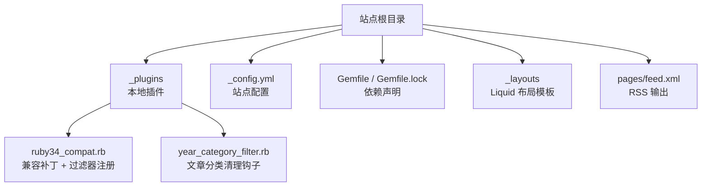
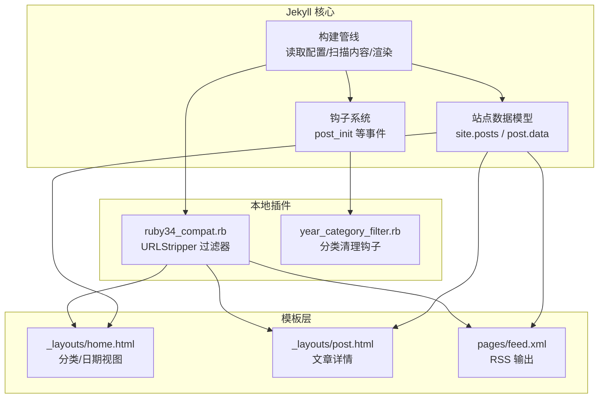
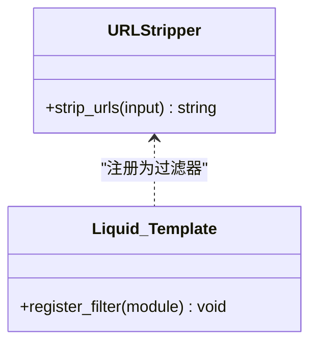
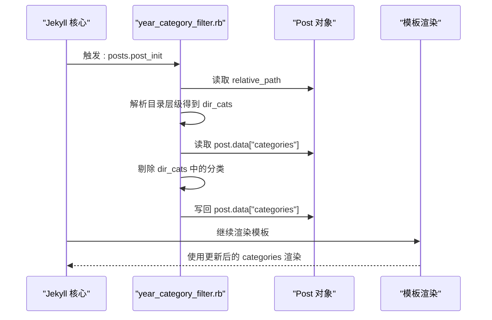
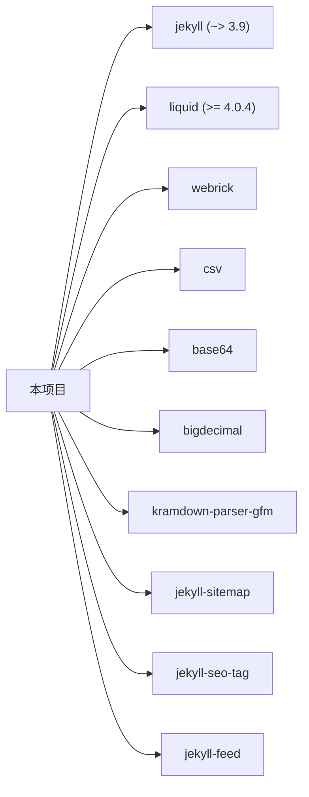
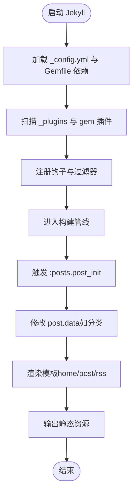

# 插件架构原理

<cite>
**本文引用的文件**   
- [_plugins/ruby34_compat.rb](file://_plugins/ruby34_compat.rb)
- [_plugins/year_category_filter.rb](file://_plugins/year_category_filter.rb)
- [_config.yml](file://_config.yml)
- [Gemfile](file://Gemfile)
- [Gemfile.lock](file://Gemfile.lock)
- [_layouts/home.html](file://_layouts/home.html)
- [_layouts/post.html](file://_layouts/post.html)
- [pages/feed.xml](file://pages/feed.xml)
</cite>

## 目录
1. [引言](#引言)
2. [项目结构](#项目结构)
3. [核心组件](#核心组件)
4. [架构总览](#架构总览)
5. [详细组件分析](#详细组件分析)
6. [依赖关系分析](#依赖关系分析)
7. [性能考量](#性能考量)
8. [故障排查指南](#故障排查指南)
9. [结论](#结论)
10. [附录](#附录)

## 引言
本文件围绕该 Jekyll 项目的插件体系，系统性梳理 Ruby 插件系统的设计模式与核心机制，重点覆盖：
- 钩子系统（Hooks）：在构建生命周期中注入自定义逻辑
- 过滤器注册（Filters）：扩展 Liquid 模板语言能力
- 生成器扩展（Generators）：自定义页面/数据输出（概念性说明）
- 插件生命周期管理：加载、初始化、执行阶段
- Liquid 模板扩展：自定义过滤器与标签的注册方式
- 与 Jekyll 核心的集成：事件监听、数据访问、输出控制
- 开发规范与最佳实践：命名约定、错误处理、性能优化

## 项目结构
本项目采用 Jekyll 标准目录组织，插件位于 _plugins 目录，配置位于 _config.yml，主题使用 minima。关键路径如下：
- 本地插件：_plugins/*.rb
- 站点配置：_config.yml
- 依赖声明：Gemfile / Gemfile.lock
- 布局模板：_layouts/*.html
- RSS 输出：pages/feed.xml

图表来源
- [_plugins/ruby34_compat.rb:1-18](file://_plugins/ruby34_compat.rb#L1-L18)
- [_plugins/year_category_filter.rb:1-12](file://_plugins/year_category_filter.rb#L1-L12)
- [_config.yml:1-45](file://_config.yml#L1-L45)
- [Gemfile:1-17](file://Gemfile#L1-L17)
- [Gemfile.lock:107-121](file://Gemfile.lock#L107-L121)
- [_layouts/home.html:1-135](file://_layouts/home.html#L1-L135)
- [_layouts/post.html:1-105](file://_layouts/post.html#L1-L105)
- [pages/feed.xml:1-30](file://pages/feed.xml#L1-L30)

章节来源
- [_config.yml:1-45](file://_config.yml#L1-L45)
- [Gemfile:1-17](file://Gemfile#L1-L17)
- [Gemfile.lock:107-121](file://Gemfile.lock#L107-L121)

## 核心组件
- 本地过滤器与兼容性补丁
  - 通过模块方法定义过滤器，并在启动时注册到 Liquid::Template
  - 提供字符串 URL 剥离能力，用于搜索索引等场景
- 文章钩子处理器
  - 在文章初始化后移除由目录结构自动注入的分类，仅保留 front matter 显式定义的分类
- 站点配置与插件启用
  - 通过 _config.yml 的 plugins 字段启用第三方插件
  - 通过 Gemfile 锁定 jekyll、liquid 等版本，确保运行环境一致

章节来源
- [_plugins/ruby34_compat.rb:1-18](file://_plugins/ruby34_compat.rb#L1-L18)
- [_plugins/year_category_filter.rb:1-12](file://_plugins/year_category_filter.rb#L1-L12)
- [_config.yml:40-45](file://_config.yml#L40-L45)
- [Gemfile:1-17](file://Gemfile#L1-L17)

## 架构总览
下图展示插件与 Jekyll 核心、Liquid 引擎以及站点数据的交互关系。

图表来源
- [_plugins/ruby34_compat.rb:1-18](file://_plugins/ruby34_compat.rb#L1-L18)
- [_plugins/year_category_filter.rb:1-12](file://_plugins/year_category_filter.rb#L1-L12)
- [_layouts/home.html:1-135](file://_layouts/home.html#L1-L135)
- [_layouts/post.html:1-105](file://_layouts/post.html#L1-L105)
- [pages/feed.xml:1-30](file://pages/feed.xml#L1-L30)

## 详细组件分析

### 组件一：URLStripper 过滤器（Liquid 过滤器扩展）
- 设计要点
  - 以模块形式定义方法，作为 Liquid 过滤器暴露
  - 在插件加载时调用 Liquid::Template.register_filter 完成注册
  - 提供 strip_urls 方法，用于从文本中剔除 URL，便于搜索索引或摘要生成
- 使用位置
  - 可在任意 Liquid 模板中以 | strip_urls 方式使用
  - 典型用途：首页列表、RSS 摘要、搜索索引等
- 复杂度与性能
  - 基于正则替换，时间复杂度近似 O(n)，n 为输入长度
  - 建议对大段内容使用前先进行必要裁剪或缓存结果

图表来源
- [_plugins/ruby34_compat.rb:9-18](file://_plugins/ruby34_compat.rb#L9-L18)

章节来源
- [_plugins/ruby34_compat.rb:1-18](file://_plugins/ruby34_compat.rb#L1-L18)

### 组件二：文章分类清理钩子（Jekyll Hooks）
- 设计要点
  - 使用 Jekyll::Hooks.register 注册 :posts 集合的 :post_init 事件
  - 在文章初始化后，解析相对路径提取目录级分类，并从 post.data["categories"] 中剔除
  - 保证最终分类仅来自 front matter，避免目录结构污染分类语义
- 数据流
  - 读取 post.relative_path -> 拆分目录名 -> 过滤 categories -> 写回 post.data["categories"]
- 影响范围
  - 影响所有基于 site.categories 和 post.categories 的模板渲染（如首页分类视图、RSS 分类项）

图表来源
- [_plugins/year_category_filter.rb:1-12](file://_plugins/year_category_filter.rb#L1-L12)
- [_layouts/home.html:19-84](file://_layouts/home.html#L19-L84)
- [pages/feed.xml:21-26](file://pages/feed.xml#L21-L26)

章节来源
- [_plugins/year_category_filter.rb:1-12](file://_plugins/year_category_filter.rb#L1-L12)
- [_layouts/home.html:19-84](file://_layouts/home.html#L19-L84)
- [pages/feed.xml:21-26](file://pages/feed.xml#L21-L26)

### 组件三：Ruby 3.4+ 兼容性补丁
- 设计要点
  - 针对 Ruby 3.2+ 移除了 String#untaint 的情况，提供空实现以保证旧版 Liquid/Jekyll 正常运行
  - 属于“向后兼容”策略，避免升级运行时导致第三方库崩溃
- 风险与建议
  - 仅在缺失方法时注入，避免破坏现有行为
  - 长期建议升级依赖至支持新 Ruby 的版本

章节来源
- [_plugins/ruby34_compat.rb:1-7](file://_plugins/ruby34_compat.rb#L1-L7)
- [Gemfile:5-5](file://Gemfile#L5-L5)
- [Gemfile.lock:114-114](file://Gemfile.lock#L114-L114)

### 组件四：模板层对插件能力的消费
- 首页分类/日期视图
  - 使用 site.categories 与 site.posts 进行分组与排序，体现分类清理钩子的效果
- 文章详情页
  - 使用 page.date、page.title 等元信息渲染
- RSS 输出
  - 遍历 site.posts，输出 title、description、category 等字段

章节来源
- [_layouts/home.html:19-110](file://_layouts/home.html#L19-L110)
- [_layouts/post.html:1-37](file://_layouts/post.html#L1-L37)
- [pages/feed.xml:1-30](file://pages/feed.xml#L1-L30)

## 依赖关系分析
- 运行时依赖
  - jekyll ~> 3.9
  - liquid >= 4.0.4（修复 Ruby 3.4+ untaint 兼容问题）
  - webrick、csv、base64、bigdecimal（Ruby 3.x 兼容）
  - kramdown-parser-gfm（Markdown 解析）
- 第三方插件
  - jekyll-sitemap、jekyll-seo-tag、jekyll-feed（在 _config.yml 的 plugins 中启用）

图表来源
- [Gemfile:1-17](file://Gemfile#L1-L17)
- [_config.yml:40-45](file://_config.yml#L40-L45)
- [Gemfile.lock:107-121](file://Gemfile.lock#L107-L121)

章节来源
- [Gemfile:1-17](file://Gemfile#L1-L17)
- [_config.yml:40-45](file://_config.yml#L40-L45)
- [Gemfile.lock:107-121](file://Gemfile.lock#L107-L121)

## 性能考量
- 过滤器性能
  - URL 剥离使用正则匹配，建议在大数据量前做预处理或缓存结果
- 钩子开销
  - post_init 钩子在每篇文章初始化时执行，应避免复杂计算；必要时可引入简单缓存
- 模板渲染
  - 首页按分类/日期分组会多次遍历 posts，建议减少不必要的重复计算
- 依赖版本
  - 锁定 jekyll 与 liquid 版本，避免运行时差异导致的额外兼容成本

[本节为通用指导，不直接分析具体文件]

## 故障排查指南
- 症状：Ruby 3.4+ 环境下报错缺少 String#untaint
  - 原因：旧版 Liquid/Jekyll 依赖已移除的方法
  - 解决：项目已在本地插件中提供兼容补丁，并确保 Gemfile 指定了兼容版本的 liquid
- 症状：首页分类显示包含目录层级名称
  - 原因：未启用分类清理钩子或钩子未生效
  - 排查：确认 year_category_filter.rb 被加载且 post_init 钩子注册成功
- 症状：RSS 分类项异常
  - 原因：post.categories 被目录结构污染
  - 排查：检查钩子是否剔除目录分类，并验证 feed.xml 使用的字段

章节来源
- [_plugins/ruby34_compat.rb:1-7](file://_plugins/ruby34_compat.rb#L1-L7)
- [_plugins/year_category_filter.rb:1-12](file://_plugins/year_category_filter.rb#L1-L12)
- [Gemfile:5-5](file://Gemfile#L5-L5)
- [Gemfile.lock:114-114](file://Gemfile.lock#L114-L114)
- [pages/feed.xml:21-26](file://pages/feed.xml#L21-L26)

## 结论
本项目展示了 Jekyll 插件体系的两种典型用法：
- 通过 Liquid 过滤器扩展模板能力（URL 剥离）
- 通过 Hooks 在构建生命周期中修改数据（分类清理）
配合 _config.yml 与 Gemfile 的版本与插件声明，形成稳定、可维护的扩展方案。对于更复杂的扩展需求，可进一步引入自定义生成器（Generators）以输出新的页面或数据源。

[本节为总结性内容，不直接分析具体文件]

## 附录

### 插件生命周期与管理流程（概念图）

[此图为概念流程，不对应具体源码文件]

### 开发规范与最佳实践
- 命名约定
  - 本地插件文件以功能命名，置于 _plugins 目录
  - 过滤器模块与方法名清晰表达意图（如 URLStripper.strip_urls）
- 错误处理
  - 钩子中对数据进行判空与类型校验，避免 nil 操作
  - 过滤器对输入进行 to_s 转换，增强鲁棒性
- 性能优化
  - 避免在钩子中进行 I/O 或网络请求
  - 对频繁调用的过滤器结果进行缓存（例如按输入哈希）
- 兼容性
  - 针对新版 Ruby 的 API 变更，优先通过本地补丁过渡，同时规划依赖升级
- 测试建议
  - 为过滤器编写单元测试，覆盖边界输入
  - 为钩子编写集成测试，验证 post.data 的最终状态

[本节为通用指导，不直接分析具体文件]