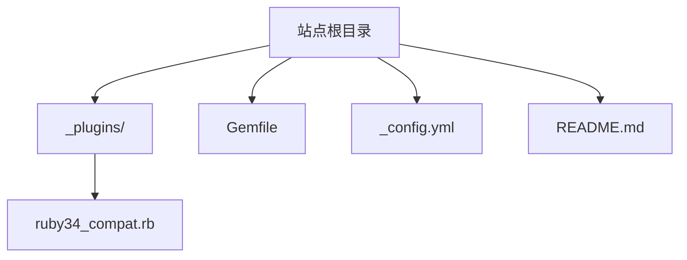
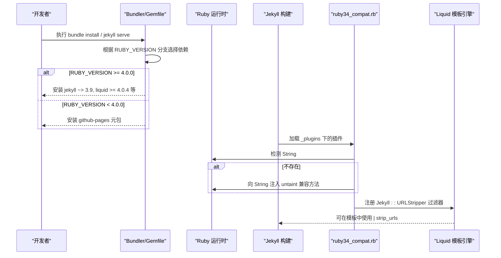
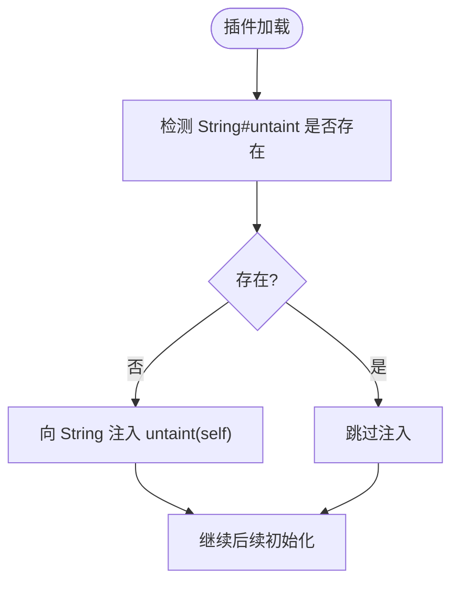
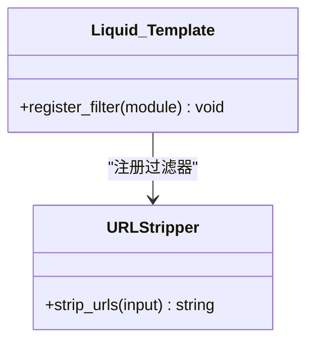
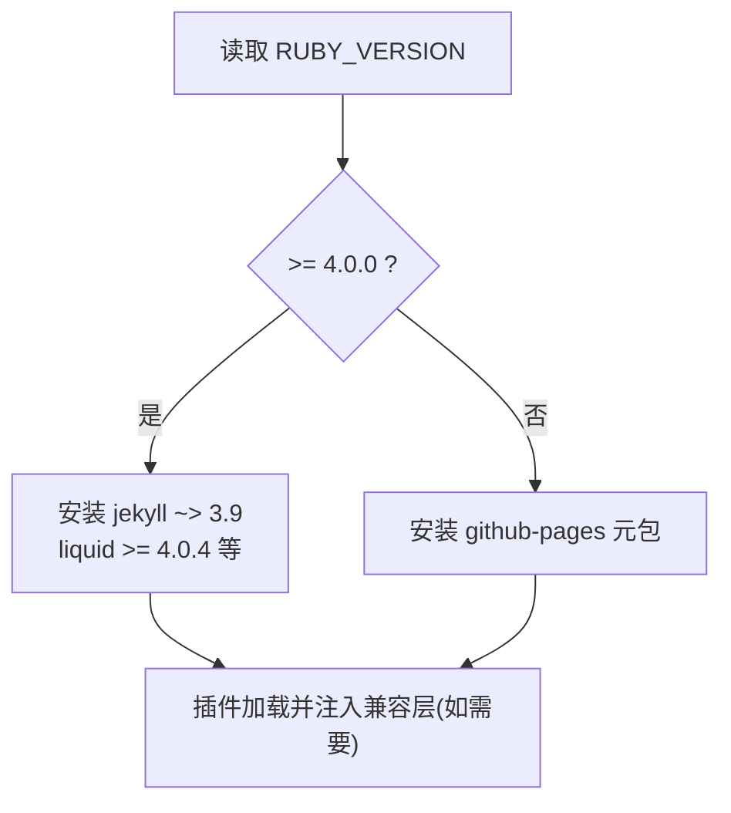
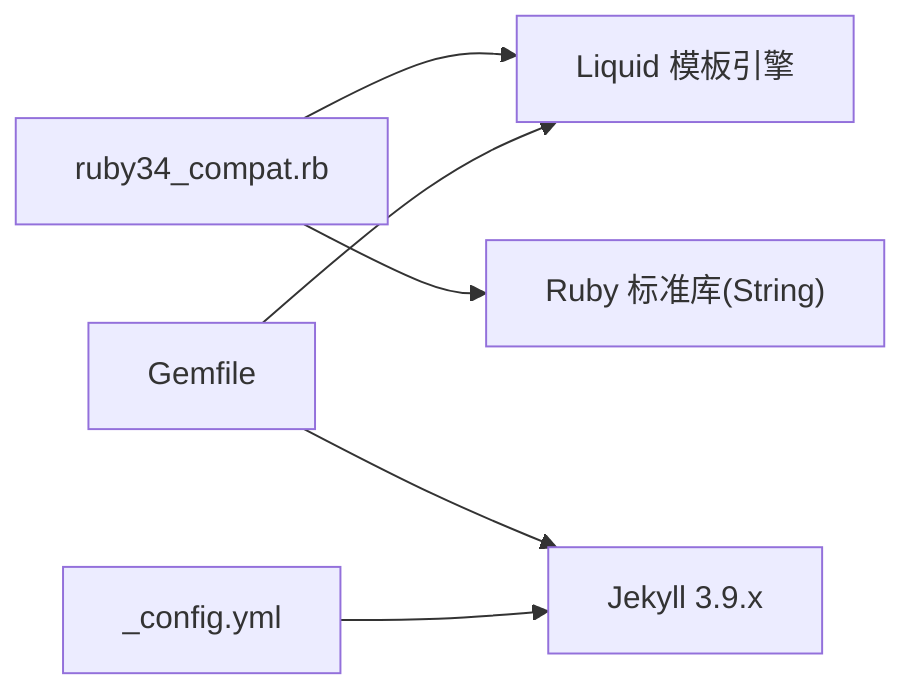

# Ruby 兼容性插件

<cite>
**本文引用的文件**
- [ruby34_compat.rb](file://_plugins/ruby34_compat.rb)
- [Gemfile](file://Gemfile)
- [_config.yml](file://_config.yml)
- [README.md](file://README.md)
</cite>

## 目录
1. [简介](#简介)
2. [项目结构](#项目结构)
3. [核心组件](#核心组件)
4. [架构总览](#架构总览)
5. [详细组件分析](#详细组件分析)
6. [依赖关系分析](#依赖关系分析)
7. [性能考量](#性能考量)
8. [故障排除指南](#故障排除指南)
9. [结论](#结论)
10. [附录](#附录)

## 简介
本文件聚焦于 _plugins/ruby34_compat.rb 插件，系统性说明其如何为 Ruby 3.4+ 环境提供兼容性支持，确保 Jekyll 在不同 Ruby 版本下稳定运行。文档涵盖：
- 插件检测与适配机制（Ruby 版本差异处理）
- 兼容性补丁的实现方式（String#untaint 兼容层）
- 对 Jekyll/Liquid 的适配与修复（过滤器注册）
- 版本兼容性矩阵与升级建议
- 常见问题与排障方法

## 项目结构
该插件位于 Jekyll 项目的自定义插件目录中，随站点构建自动加载。与 Gemfile 的版本策略配合，实现“在较新 Ruby 上降级使用受支持的 Jekyll/Liquid 版本并注入兼容层”的目标。

图表来源
- [ruby34_compat.rb:1-22](file://_plugins/ruby34_compat.rb#L1-L22)
- [Gemfile:1-25](file://Gemfile#L1-L25)
- [_config.yml:1-45](file://_config.yml#L1-L45)
- [README.md:26-62](file://README.md#L26-L62)

章节来源
- [README.md:26-62](file://README.md#L26-L62)

## 核心组件
- Ruby 运行时兼容性补丁
  - 目标：在 Ruby 3.2+ 移除了 String#untaint 的环境下，为旧版 Liquid/Jekyll 提供兼容方法，避免 NoMethodError。
  - 行为：当当前字符串对象未响应 untaint 时，动态向 String 类注入一个返回自身的 stub 方法。
- Liquid 过滤器扩展
  - 目标：为搜索索引等场景提供 strip_urls 过滤器，去除 Markdown 图片、链接以及裸 URL，提升索引质量。
  - 行为：定义 Jekyll::URLStripper 模块并在 Liquid 模板引擎中注册该过滤器。

章节来源
- [ruby34_compat.rb:1-22](file://_plugins/ruby34_compat.rb#L1-L22)

## 架构总览
从“版本检测—依赖选择—兼容层注入—功能扩展”的角度，整体流程如下：

图表来源
- [Gemfile:5-22](file://Gemfile#L5-L22)
- [ruby34_compat.rb:1-22](file://_plugins/ruby34_compat.rb#L1-L22)

## 详细组件分析

### 组件一：Ruby 版本差异处理与兼容补丁
- 检测机制
  - 通过判断空字符串是否响应 :untaint 来决定是否需要注入兼容方法。
  - 该判断发生在插件加载阶段，属于轻量级运行时探测。
- 兼容实现
  - 若检测到缺失，则向 String 类追加一个返回 self 的 untaint 方法，满足旧库调用需求。
  - 由于仅在不具备该方法时才注入，不会覆盖现有实现，保证向后兼容。
- 影响范围
  - 主要解决旧版 Liquid/Jekyll 在 Ruby 3.2+ 环境中因移除 String#untaint 导致的崩溃问题。
  - 与 Gemfile 中针对 Ruby 4.0+ 直接声明 liquid >= 4.0.4 的策略协同，形成“双保险”。

图表来源
- [ruby34_compat.rb:1-7](file://_plugins/ruby34_compat.rb#L1-L7)

章节来源
- [ruby34_compat.rb:1-7](file://_plugins/ruby34_compat.rb#L1-L7)

### 组件二：Liquid 过滤器 strip_urls
- 功能说明
  - 提供 Jekyll::URLStripper#strip_urls(input) 过滤器，用于清理内容中的图片、链接与裸 URL，便于生成干净的搜索索引。
- 处理顺序
  - 先移除 Markdown 图片语法；
  - 再替换 Markdown 链接为纯文本；
  - 最后删除裸 URL。
- 注册方式
  - 在插件末尾将 Jekyll::URLStripper 注册到 Liquid::Template，使模板可通过 | strip_urls 使用。
- 复杂度评估
  - 基于正则替换，时间复杂度近似 O(n)，n 为输入长度；多次 gsub 叠加，常数因子较大但通常可接受。
  - 对于超长内容，建议在数据源侧控制或分批处理。

图表来源
- [ruby34_compat.rb:9-22](file://_plugins/ruby34_compat.rb#L9-L22)

章节来源
- [ruby34_compat.rb:9-22](file://_plugins/ruby34_compat.rb#L9-L22)

### 组件三：与 Gemfile 的版本策略联动
- 版本分支逻辑
  - 当 RUBY_VERSION >= 4.0.0 时，直接引入 jekyll ~> 3.9、liquid >= 4.0.4 等依赖，绕过 github-pages 元包在新 Ruby 上的限制。
  - 否则使用 github-pages 元包以简化线上环境管理。
- 与插件的关系
  - 插件在 Ruby 3.2+ 环境下提供 String#untaint 兼容层；
  - 同时 Gemfile 在 Ruby 4.0+ 强制使用 liquid >= 4.0.4，进一步降低兼容风险。
  - 两者共同保障在 Ruby 3.4+ 及更高版本的稳定性。

图表来源
- [Gemfile:5-22](file://Gemfile#L5-L22)
- [ruby34_compat.rb:1-7](file://_plugins/ruby34_compat.rb#L1-L7)

章节来源
- [Gemfile:5-22](file://Gemfile#L5-L22)

## 依赖关系分析
- 内部依赖
  - 插件依赖 Liquid 模板引擎进行过滤器注册。
  - 插件对 Ruby 标准库 String 进行条件性扩展。
- 外部依赖
  - 通过 Gemfile 在 Ruby 4.0+ 指定 liquid >= 4.0.4，缓解旧版 Liquid 在新 Ruby 上的兼容问题。
  - 站点配置 _config.yml 启用若干官方插件，与本插件无直接耦合。

图表来源
- [ruby34_compat.rb:9-22](file://_plugins/ruby34_compat.rb#L9-L22)
- [Gemfile:5-22](file://Gemfile#L5-L22)
- [_config.yml:40-45](file://_config.yml#L40-L45)

章节来源
- [ruby34_compat.rb:9-22](file://_plugins/ruby34_compat.rb#L9-L22)
- [Gemfile:5-22](file://Gemfile#L5-L22)
- [_config.yml:40-45](file://_config.yml#L40-L45)

## 性能考量
- 兼容层注入
  - 仅在首次加载时进行一次 respond_to? 检查与方法注入，开销极低。
- 过滤器 strip_urls
  - 多次正则替换，适合中等规模文本；对超大内容建议预处理或分页。
- 构建期影响
  - 插件在构建期加载，不影响运行时页面渲染性能。

[本节为通用指导，不直接分析具体文件]

## 故障排除指南
- 现象：在 Ruby 3.4+ 构建时报错，提示 String#untaint 未定义
  - 原因：旧版 Liquid/Jekyll 调用了已移除的方法。
  - 排查：确认插件 ruby34_compat.rb 已被加载；检查 Gemfile 是否在 Ruby 4.0+ 安装了 liquid >= 4.0.4。
  - 解决：保持插件存在；必要时升级 liquid 至 4.0.4+。
- 现象：本地 Ruby 4.0+ 无法安装 github-pages 元包
  - 原因：元包依赖的某些子库与新 Ruby 不兼容。
  - 解决：按 Gemfile 分支逻辑，直接使用 jekyll ~> 3.9 与 liquid >= 4.0.4 等依赖。
- 现象：search.json 包含大量链接或图片占位符
  - 原因：未在模板中使用 strip_urls 过滤器。
  - 解决：在生成搜索索引的模板片段中，对正文字段应用 | strip_urls。
- 现象：升级 Ruby 后构建失败
  - 排查：查看报错堆栈是否涉及 String#untaint 或 Liquid 相关错误。
  - 解决：确保 Gemfile 分支正确；保留兼容插件；必要时清理缓存重新构建。

章节来源
- [ruby34_compat.rb:1-7](file://_plugins/ruby34_compat.rb#L1-L7)
- [Gemfile:5-22](file://Gemfile#L5-L22)

## 结论
该插件通过“运行时兼容层 + 过滤器扩展”的组合，有效弥合了 Ruby 3.4+ 与旧版 Jekyll/Liquid 之间的差异。结合 Gemfile 的版本分支策略，项目在本地高版本 Ruby 与线上 GitHub Pages（Ruby 3.3.4）之间实现了稳定的构建体验。推荐在升级 Ruby 版本时保留该插件，并确保 liquid 版本不低于 4.0.4。

[本节为总结性内容，不直接分析具体文件]

## 附录

### 版本兼容性矩阵
- Ruby 3.3.x
  - 线上环境（GitHub Pages）：使用 github-pages 元包，无需额外兼容层。
- Ruby 3.4.x
  - 本地开发：Gemfile 分支安装 jekyll ~> 3.9 与 liquid >= 4.0.4；插件注入 String#untaint 兼容层。
- Ruby 4.0.x
  - 本地开发：同 Ruby 3.4.x 策略；liquid >= 4.0.4 进一步降低兼容风险。

章节来源
- [Gemfile:3-22](file://Gemfile#L3-L22)
- [ruby34_compat.rb:1-7](file://_plugins/ruby34_compat.rb#L1-L7)

### 升级指南
- 升级 Ruby 至 3.4+ 或 4.0+
  - 保留 _plugins/ruby34_compat.rb。
  - 确认 Gemfile 分支逻辑生效，安装 jekyll ~> 3.9 与 liquid >= 4.0.4。
  - 清理构建缓存后重新构建。
- 升级 Liquid
  - 优先升级到 4.0.4+，减少兼容层依赖。
- 上线部署
  - GitHub Pages 仍使用 Ruby 3.3.4，无需变更。

章节来源
- [Gemfile:5-22](file://Gemfile#L5-L22)
- [ruby34_compat.rb:1-7](file://_plugins/ruby34_compat.rb#L1-L7)

### 过滤器使用示例路径
- 在模板中对正文字段使用 strip_urls 过滤器的参考位置：
  - 参见 README 中关于全文搜索与 search.json 生成的说明。

章节来源
- [README.md:26-62](file://README.md#L26-L62)