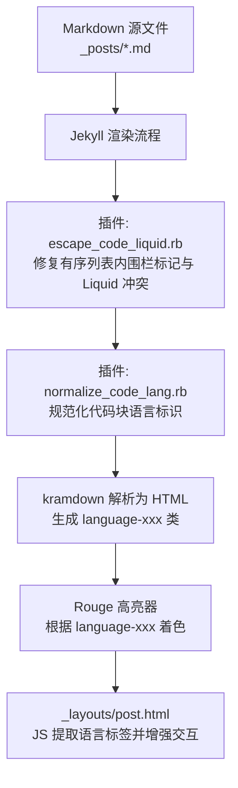
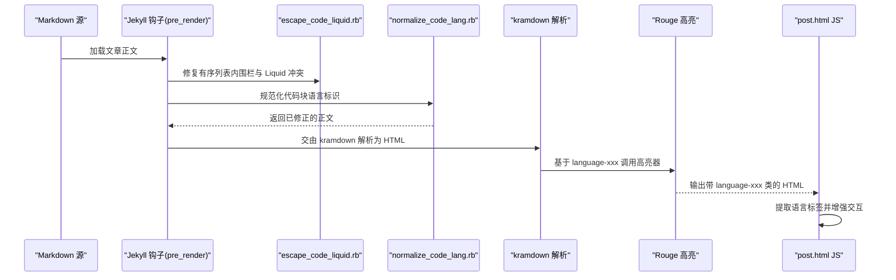
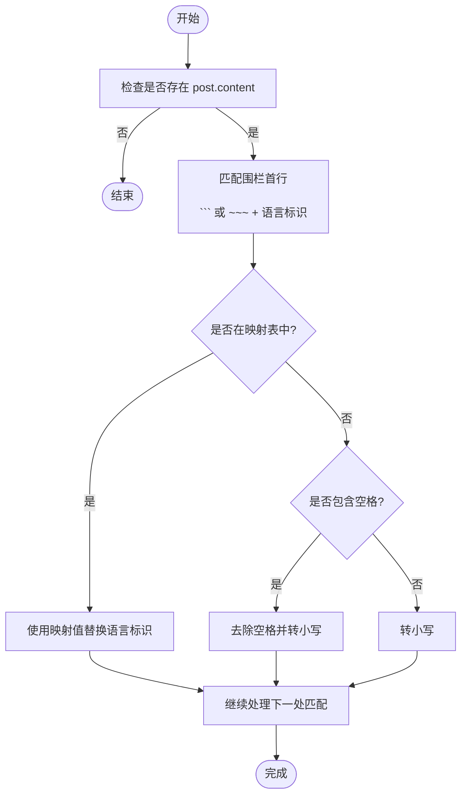
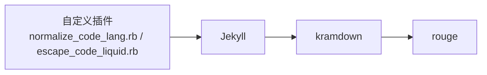

# 代码语言标准化插件

<cite>
**本文引用的文件**
- [normalize_code_lang.rb](file://_plugins/normalize_code_lang.rb)
- [escape_code_liquid.rb](file://_plugins/escape_code_liquid.rb)
- [post.html](file://_layouts/post.html)
- [Gemfile.lock](file://Gemfile.lock)
</cite>

## 目录
1. [简介](#简介)
2. [项目结构](#项目结构)
3. [核心组件](#核心组件)
4. [架构总览](#架构总览)
5. [详细组件分析](#详细组件分析)
6. [依赖分析](#依赖分析)
7. [性能考虑](#性能考虑)
8. [故障排查指南](#故障排查指南)
9. [结论](#结论)
10. [附录](#附录)

## 简介
本插件 normalize_code_lang.rb 用于在 Jekyll 渲染前，自动规范化 Markdown 围栏代码块的语言标识符，使其与 kramdown/Rouge 高亮系统兼容。主要解决以下问题：
- 含空格的标识符（如 Plain Text、Java Script）无法被正确识别
- 大小写不一致导致的高亮异常（如 Dockerfile、C++）
- 部分常见别名映射到 Rouge 标准语言名（如 C++ → cpp、Shell Script → bash）

通过统一语言标识，确保代码高亮、工具栏语言标签显示以及后续前端交互均能稳定工作。

## 项目结构
与本插件直接相关的文件与职责如下：
- _plugins/normalize_code_lang.rb：注册 Jekyll 钩子，预处理文章正文，规范化代码块语言标识
- _plugins/escape_code_liquid.rb：处理有序列表内 ``` 围栏标记与 Liquid 冲突，辅助保证代码块解析稳定性
- _layouts/post.html：页面模板中的 JavaScript 负责提取 language-xxx 类并展示语言标签、复制与换行控制
- Gemfile.lock：确认构建环境包含 kramdown 与 rouge 等依赖



图表来源
- [normalize_code_lang.rb:1-42](file://_plugins/normalize_code_lang.rb#L1-L42)
- [escape_code_liquid.rb:1-35](file://_plugins/escape_code_liquid.rb#L1-L35)
- [post.html:115-194](file://_layouts/post.html#L115-L194)
- [Gemfile.lock:67-88](file://Gemfile.lock#L67-L88)

章节来源
- [normalize_code_lang.rb:1-42](file://_plugins/normalize_code_lang.rb#L1-L42)
- [escape_code_liquid.rb:1-35](file://_plugins/escape_code_liquid.rb#L1-L35)
- [post.html:115-194](file://_layouts/post.html#L115-L194)
- [Gemfile.lock:67-88](file://Gemfile.lock#L67-L88)

## 核心组件
- 插件入口与生命周期
  - 使用 Jekyll::Hooks.register :posts, :pre_render 在文章预渲染阶段执行
  - 仅对存在 post.content 的文章进行处理，避免空内容带来的额外开销
- 语言映射表
  - 内置映射将常见别名转换为 Rouge 标准语言名，例如：
    - plain text/plain → text
    - java script → javascript
    - c sharp → csharp
    - c++ → cpp
    - objective c → objectivec
    - shell script → bash
- 正则匹配与替换策略
  - 匹配以 ``` 或 ~~~ 开头的围栏行，允许前导空白
  - 优先按映射表替换；若语言名含空格则去除空格并转小写；否则统一转小写
  - 无需修改时直接返回原匹配，避免不必要的字符串重建

章节来源
- [normalize_code_lang.rb:9-41](file://_plugins/normalize_code_lang.rb#L9-L41)

## 架构总览
从 Markdown 到最终页面的关键链路如下：
- 插件层：escape_code_liquid.rb 与 normalize_code_lang.rb 在 pre_render 阶段依次处理文章内容
- 解析层：kramdown 将 Markdown 转为 HTML，并为代码块添加 language-xxx 类
- 高亮层：Rouge 根据 language-xxx 进行语法着色
- 展示层：post.html 中的脚本读取 language-xxx 并注入语言标签与工具栏



图表来源
- [escape_code_liquid.rb:1-35](file://_plugins/escape_code_liquid.rb#L1-L35)
- [normalize_code_lang.rb:9-41](file://_plugins/normalize_code_lang.rb#L9-L41)
- [post.html:115-194](file://_layouts/post.html#L115-L194)

## 详细组件分析

### 插件：normalize_code_lang.rb
- 功能要点
  - 在 pre_render 钩子中扫描所有文章正文
  - 针对围栏代码块首行进行语言标识规范化
  - 支持 ``` 和 ~~~ 两种围栏标记
- 语言映射规则
  - 显式映射：plain text/plain → text，java script → javascript，c sharp → csharp，c++ → cpp，objective c → objectivec，shell script → bash
  - 通用规则：
    - 含空格的标识符：去除空格并转小写（如 “Plain Text” → “plaintext”，“Java Script” → “javascript”）
    - 其他情况：统一转小写（如 “Dockerfile” → “dockerfile”）
- 转换逻辑流程图



图表来源
- [normalize_code_lang.rb:22-40](file://_plugins/normalize_code_lang.rb#L22-L40)

章节来源
- [normalize_code_lang.rb:9-41](file://_plugins/normalize_code_lang.rb#L9-L41)

### 插件：escape_code_liquid.rb（协同作用）
- 功能要点
  - 将有序列表项内的 ``` 围栏标记转换为 ~~~，避免缩进导致的解析差异
  - 在代码块与行内代码中对 {{ }} 添加  保护，防止 Liquid 提前解析
- 与 normalize_code_lang.rb 的关系
  - 先由 escape_code_liquid.rb 修复围栏标记与 Liquid 冲突，再由 normalize_code_lang.rb 规范化语言标识，二者共同保障代码块解析与高亮的稳定性

章节来源
- [escape_code_liquid.rb:1-35](file://_plugins/escape_code_liquid.rb#L1-L35)

### 页面模板：post.html（语言标签与交互）
- 功能要点
  - 遍历 .post-content 下的 <pre> 元素
  - 向上查找带有 language-xxx 类的容器，或回退到 <code> 元素自身
  - 提取语言名并在工具栏显示；若无语言则默认显示 text
  - 提供复制与换行切换按钮
- 与插件的关系
  - 插件确保 language-xxx 类名规范且可被 Rouge 识别，从而保证工具栏语言标签准确显示

章节来源
- [post.html:115-194](file://_layouts/post.html#L115-L194)

## 依赖分析
- 运行时依赖
  - jekyll：静态站点生成框架
  - kramdown：Markdown 解析器，负责生成 language-xxx 类
  - rouge：语法高亮引擎，依据 language-xxx 进行着色
- 版本信息
  - 见 Gemfile.lock 中 rouge 与 kramdown-parser-gfm 等条目



图表来源
- [Gemfile.lock:67-88](file://Gemfile.lock#L67-L88)

章节来源
- [Gemfile.lock:67-88](file://Gemfile.lock#L67-L88)

## 性能考虑
- 仅在 pre_render 阶段对文章正文进行一次全局 gsub 替换，时间复杂度与文章长度线性相关
- 对于无内容的文章直接跳过处理，减少不必要开销
- 语言映射表为哈希查找，O(1) 平均复杂度
- 建议：
  - 保持映射表精简，避免过多分支判断
  - 对超长文章可考虑分块处理（当前实现已足够高效）

[本节为通用指导，不直接分析具体文件]

## 故障排查指南
- 现象：代码块未高亮或语言标签显示异常
  - 可能原因：语言标识含空格或大小写不规范
  - 解决方案：使用插件自动规范化；必要时在映射表中补充别名
- 现象：有序列表内代码块解析异常
  - 可能原因：kramdown 对缩进的 ``` 行为不同
  - 解决方案：使用 escape_code_liquid.rb 将有序列表内的 ``` 转换为 ~~~
- 现象：Liquid 语法在代码中被提前解析
  - 可能原因：{{ }} 在代码块中未被保护
  - 解决方案：使用 escape_code_liquid.rb 自动添加  保护
- 现象：语言标签未显示或显示为 text
  - 可能原因：外层容器缺少 language-xxx 类
  - 解决方案：检查插件是否正确运行；确认 kramdown 与 Rouge 正常工作

章节来源
- [escape_code_liquid.rb:1-35](file://_plugins/escape_code_liquid.rb#L1-L35)
- [normalize_code_lang.rb:9-41](file://_plugins/normalize_code_lang.rb#L9-L41)
- [post.html:115-194](file://_layouts/post.html#L115-L194)

## 结论
normalize_code_lang.rb 通过简洁而稳健的规则，解决了 Markdown 代码块语言标识不一致导致的渲染与高亮问题。配合 escape_code_liquid.rb 与 post.html 的前端增强，形成了从源码到页面的完整闭环，提升了写作体验与阅读一致性。

[本节为总结性内容，不直接分析具体文件]

## 附录

### 支持的编程语言与映射规则
- 内置映射（示例）
  - plain text/plain → text
  - java script → javascript
  - c sharp → csharp
  - c++ → cpp
  - objective c → objectivec
  - shell script → bash
- 通用规则
  - 含空格的标识符：去除空格并转小写
  - 其他情况：统一转小写
- 说明
  - 以上映射与规则来源于插件实现；如需扩展，可在映射表中新增条目

章节来源
- [normalize_code_lang.rb:12-20](file://_plugins/normalize_code_lang.rb#L12-L20)

### 配置方法
- 启用插件
  - 将 normalize_code_lang.rb 放置于 _plugins 目录，Jekyll 会自动加载
- 扩展语言映射
  - 在插件的映射表中增加新的别名到标准语言名的对应关系
- 注意事项
  - 修改后需重新构建站点以生效

章节来源
- [normalize_code_lang.rb:9-20](file://_plugins/normalize_code_lang.rb#L9-L20)

### 代码块格式最佳实践
- 使用标准围栏标记
  - 推荐 ``` 或 ~~~，避免在有序列表中使用 ```（可由插件自动转换）
- 语言标识书写建议
  - 尽量使用小写且不含空格的标准名称（如 javascript、cpp、bash）
  - 若使用别名，请确保其在映射表中存在
- 避免 Liquid 冲突
  - 在代码中使用 {{ }} 时，建议使用插件提供的自动保护机制

章节来源
- [escape_code_liquid.rb:1-35](file://_plugins/escape_code_liquid.rb#L1-L35)
- [normalize_code_lang.rb:22-40](file://_plugins/normalize_code_lang.rb#L22-L40)