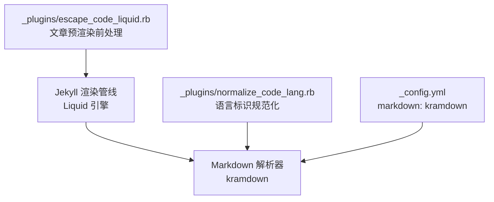
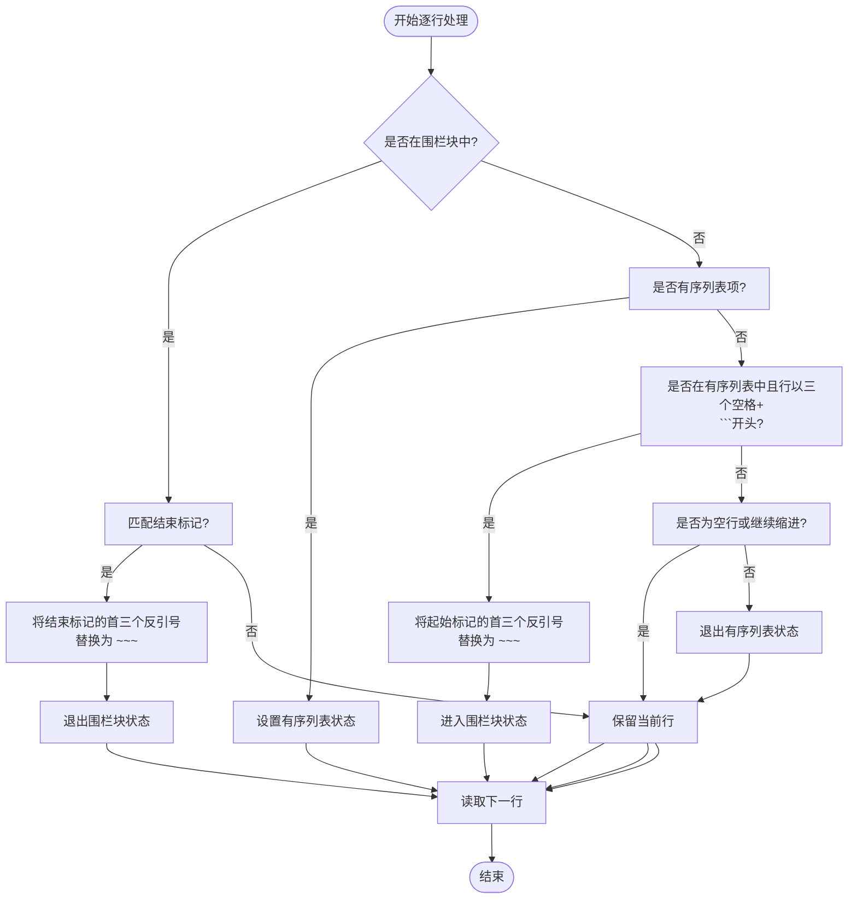
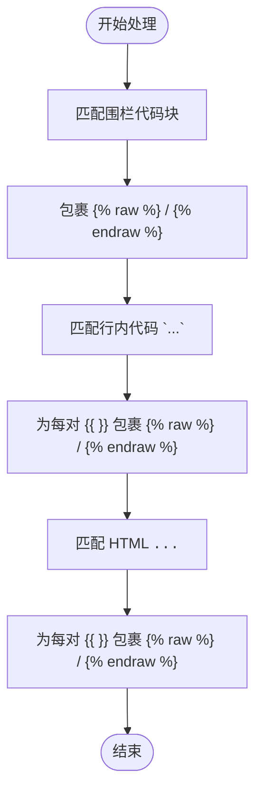
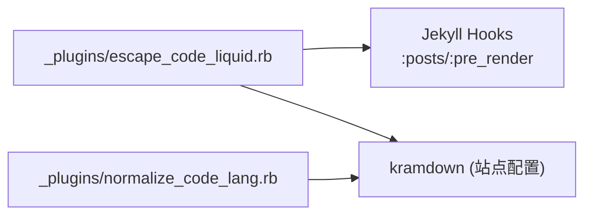

# 代码转义插件

<cite>
**本文引用的文件**
- [escape_code_liquid.rb](file://_plugins/escape_code_liquid.rb)
- [normalize_code_lang.rb](file://_plugins/normalize_code_lang.rb)
- [_config.yml](file://_config.yml)
</cite>

## 目录
1. [简介](#简介)
2. [项目结构](#项目结构)
3. [核心组件](#核心组件)
4. [架构总览](#架构总览)
5. [详细组件分析](#详细组件分析)
6. [依赖关系分析](#依赖关系分析)
7. [性能考虑](#性能考虑)
8. [故障排查指南](#故障排查指南)
9. [结论](#结论)
10. [附录：使用示例与最佳实践](#附录使用示例与最佳实践)

## 简介
本插件用于解决在 Jekyll + kramdown 环境下，Liquid 语法（如 {{ }}、）与 Markdown 代码块之间的冲突问题。其目标是在文章编写时允许直接在代码中使用 Liquid 表达式，而无需手动转义或包裹。插件在构建阶段对文章内容进行预处理，主要完成以下工作：
- 修复有序列表项内缩进的围栏代码块解析问题：将缩进的 ``` 转换为 ~~~，避免被 kramdown 误判为普通代码块。
- 自动为三类代码区域中的 {{ }} 添加  保护：
  - 围栏代码块（```...```）
  - 行内代码（`...`）
  - HTML <code> 标签内容
- 通过  的机制，使这些内容在 Liquid 渲染阶段被安全跳过，最终原样输出到 HTML。

该插件的执行时机为“文章预渲染前”，即 Jekyll 在正式执行 Liquid 模板引擎之前，先对文章内容做一次文本层面的修正，从而确保后续渲染流程稳定可靠。

## 项目结构
与本插件直接相关的文件位于 _plugins 目录，同时站点配置中启用了 kramdown 作为 Markdown 解析器，这与插件行为密切相关。



图表来源
- [escape_code_liquid.rb:12-61](file://_plugins/escape_code_liquid.rb#L12-L61)
- [normalize_code_lang.rb:9-41](file://_plugins/normalize_code_lang.rb#L9-L41)
- [_config.yml:37](file://_config.yml#L37)

章节来源
- [escape_code_liquid.rb:1-61](file://_plugins/escape_code_liquid.rb#L1-L61)
- [normalize_code_lang.rb:1-41](file://_plugins/normalize_code_lang.rb#L1-L41)
- [_config.yml:35-39](file://_config.yml#L35-L39)

## 核心组件
- 插件入口与钩子注册
  - 通过 Jekyll::Hooks.register 注册 :posts, :pre_render 钩子，在每篇文章进入渲染前执行。
- 有序列表内代码块修复
  - 逐行扫描，识别有序列表上下文，将缩进后的 ``` 围栏标记替换为 ~~~，以规避 kramdown 的缩进代码块规则。
- 代码区域 Liquid 转义
  - 围栏代码块：用  包裹整个代码块内容。
  - 行内代码：为每个 {{ ... }} 单独包裹 。
  - HTML <code> 标签：为每个 {{ ... }} 单独包裹 。

章节来源
- [escape_code_liquid.rb:12-61](file://_plugins/escape_code_liquid.rb#L12-L61)

## 架构总览
下图展示了插件在 Jekyll 构建流水线中的位置与作用范围。

```mermaid
sequenceDiagram
participant Author as "作者"
participant Hook as "Jekyll 钩子<br/> : posts/ : pre_render"
participant Plugin as "escape_code_liquid.rb"
participant Liquid as "Liquid 引擎"
participant Kramdown as "kramdown 解析器"
participant Output as "HTML 输出"
Author->>Hook : 提交包含代码的文章
Hook->>Plugin : 触发 pre_render 回调
Plugin->>Plugin : 有序列表内
``` → ~~~ 转换
    Plugin->>Plugin: 围栏代码块包裹 
    Plugin->>Plugin: 行内代码 {{ }} 包裹 
    Plugin->>Plugin: HTML <code> 中 {{ }} 包裹 
    Plugin-->>Hook: 返回已修正的内容
    Hook->>Liquid: 开始 Liquid 渲染
    Liquid-->>Kramdown: 生成 Markdown/HTML
    Kramdown-->>Output: 生成最终页面
```

图表来源
- [escape_code_liquid.rb:12-61](file://_plugins/escape_code_liquid.rb#L12-L61)

## 详细组件分析

### 有序列表项内代码块的自动转换机制
- 背景
  - kramdown 对缩进代码块有特定规则，当代码块出现在有序列表项内部且以缩进的 ``` 开头时，可能被当作普通代码块而非围栏代码块，导致渲染异常。
- 实现思路
  - 逐行解析文章内容，维护两个状态：
    - in_ol：是否处于有序列表上下文中（匹配形如 “数字.” 的行）。
    - in_fenced_block：是否处于一个由缩进 ``` 开始的围栏代码块中。
  - 当检测到有序列表项后，若其后出现以三个空格缩进并以 ``` 开头的行，则将其首三个反引号替换为三个波浪号 ~~~，并进入 fenced 模式；遇到匹配的结束标记时退出 fenced 模式。
  - 对于有序列表内的空行或继续缩进行，保持原样。
- 效果
  - 将原本会被 kramdown 误判的缩进 ``` 围栏代码块转为 ~~~，使其按预期渲染为代码块，避免破坏列表结构。



图表来源
- [escape_code_liquid.rb:17-43](file://_plugins/escape_code_liquid.rb#L17-L43)

章节来源
- [escape_code_liquid.rb:15-43](file://_plugins/escape_code_liquid.rb#L15-L43)

### 围栏代码块、行内代码与 HTML code 标签中的 {{ }} 自动转义
- 围栏代码块（```...```）
  - 使用多行正则匹配完整的围栏代码块，并在其前后插入  和 ，使得整段代码在 Liquid 阶段被整体跳过。
- 行内代码（`...`）
  - 匹配每对反引号包围的行内代码，再在其中查找所有 {{ ... }} 片段，逐个包裹 。
- HTML <code> 标签
  - 匹配 <code ...>...</code> 的多行内容，对其内部的 {{ ... }} 片段逐个包裹 。
- 原理说明
  -  在 Liquid 阶段被移除，不会进入后续的 Markdown/HTML 层，因此代码中的 {{ }} 不会被当作模板变量解析，而是原样输出。



图表来源
- [escape_code_liquid.rb:45-60](file://_plugins/escape_code_liquid.rb#L45-L60)

章节来源
- [escape_code_liquid.rb:45-60](file://_plugins/escape_code_liquid.rb#L45-L60)

###  标签插入逻辑与正则表达式匹配规则
- 插入逻辑
  - 围栏代码块：一次性包裹整块内容，避免内部多个 {{ }} 分别处理的复杂性。
  - 行内代码与 HTML <code>：针对每个 {{ ... }} 片段独立包裹，保证最小化影响范围。
- 正则表达式要点
  - 围栏代码块：使用多行模式匹配非贪婪的 ```...``` 区间。
  - 行内代码：匹配不含换行的单行反引号区间，避免跨行误匹配。
  - HTML <code>：使用多行模式匹配 <code ...>...</code> 区间。
  - {{ }} 片段：匹配 {{ 与 }} 之间的任意字符（非贪婪），确保仅包裹单个表达式。
- 注意事项
  - 嵌套与边界：行内代码与 <code> 标签内的 {{ }} 采用局部包裹策略，避免对相邻文本产生副作用。
  - 多行围栏：多行模式下点号可匹配换行符，确保完整捕获代码块。

章节来源
- [escape_code_liquid.rb:45-60](file://_plugins/escape_code_liquid.rb#L45-L60)

### 与其他插件的协同
- normalize_code_lang.rb
  - 负责规范化围栏代码块的语言标识符（如大小写、空格等），与 escape_code_liquid.rb 共同保障代码块正确渲染。
  - 由于有序列表内的 ``` 会被转换为 ~~~，normalize_code_lang.rb 也支持对 ~~~ 的处理，二者配合良好。

章节来源
- [normalize_code_lang.rb:1-41](file://_plugins/normalize_code_lang.rb#L1-L41)

## 依赖关系分析
- 外部依赖
  - Jekyll 钩子系统：通过 register :posts, :pre_render 接入构建流程。
  - kramdown：站点配置启用 kramdown 作为 Markdown 解析器，插件针对其缩进代码块规则进行适配。
- 内部依赖
  - 与 normalize_code_lang.rb 无直接耦合，但存在间接协同：前者修复有序列表内代码块标记，后者规范化语言标识符。



图表来源
- [escape_code_liquid.rb:12-13](file://_plugins/escape_code_liquid.rb#L12-L13)
- [_config.yml:37](file://_config.yml#L37)
- [normalize_code_lang.rb:9-41](file://_plugins/normalize_code_lang.rb#L9-L41)

章节来源
- [escape_code_liquid.rb:12-13](file://_plugins/escape_code_liquid.rb#L12-L13)
- [_config.yml:35-39](file://_config.yml#L35-L39)
- [normalize_code_lang.rb:9-41](file://_plugins/normalize_code_lang.rb#L9-L41)

## 性能考虑
- 时间复杂度
  - 有序列表修复：线性扫描 O(n)，n 为文章行数。
  - 正则替换：总体近似 O(n)，受匹配次数与替换开销影响。
- 空间复杂度
  - 主要消耗在拆分行数组与结果数组，额外空间 O(n)。
- 优化建议
  - 大文档场景下，尽量减少多次 gsub 调用，可将相关替换合并为一次遍历（当前实现清晰易维护，适合大多数博客规模）。
  - 谨慎使用多行正则，避免回溯过深；当前实现为非贪婪匹配，风险较低。

[本节为通用性能讨论，不直接分析具体文件]

## 故障排查指南
- 现象：有序列表内代码块未正确渲染
  - 检查是否使用了缩进的 ``` 作为围栏标记；插件会自动将其转换为 ~~~。
  - 确认 kramdown 配置未被覆盖或禁用。
- 现象：代码中的 {{ }} 仍被当作模板变量解析
  - 检查是否存在未闭合的反引号或未闭合的 <code> 标签，导致匹配失败。
  - 确认未在代码块外意外引入  导致作用域异常。
- 现象：语言高亮失效
  - 检查语言标识符是否符合规范；必要时借助 normalize_code_lang.rb 进行自动修正。

章节来源
- [escape_code_liquid.rb:15-60](file://_plugins/escape_code_liquid.rb#L15-L60)
- [normalize_code_lang.rb:1-41](file://_plugins/normalize_code_lang.rb#L1-L41)
- [_config.yml:37](file://_config.yml#L37)

## 结论
escape_code_liquid.rb 插件通过在 Jekyll 构建流水线的早期阶段对文章内容进行轻量级文本变换，有效解决了 Liquid 语法与代码块之间的冲突问题。其对有序列表内代码块的修复、对三类代码区域的自动转义，以及基于  的安全机制，显著提升了作者在文章中书写代码时的体验与稳定性。结合 normalize_code_lang.rb 的语言标识规范化，整体形成了一套完善的代码渲染解决方案。

[本节为总结性内容，不直接分析具体文件]

## 附录：使用示例与最佳实践
- 在有序列表中使用代码块
  - 推荐写法：在有序列表项内使用缩进的 ``` 或 ~~~ 均可，插件会将缩进的 ``` 自动转换为 ~~~，以避免 kramdown 解析歧义。
- 在围栏代码块中使用 {{ }}
  - 推荐写法：直接使用 {{ }}，插件会在构建时自动包裹 ，无需手动处理。
- 在行内代码中使用 {{ }}
  - 推荐写法：使用反引号包裹的代码片段中可直接包含 {{ }}，插件会为其单独包裹 。
- 在 HTML <code> 标签中使用 {{ }}
  - 推荐写法：在 <code>...</code> 中可直接包含 {{ }}，插件会为其单独包裹 。
- 语言标识规范化
  - 若语言标识符含空格或大小写不规范，可依赖 normalize_code_lang.rb 自动修正，确保高亮正常。

[本节提供一般性指导，不直接分析具体文件]