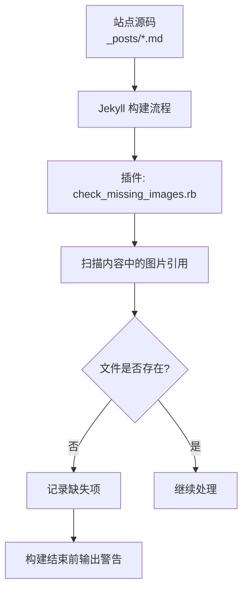
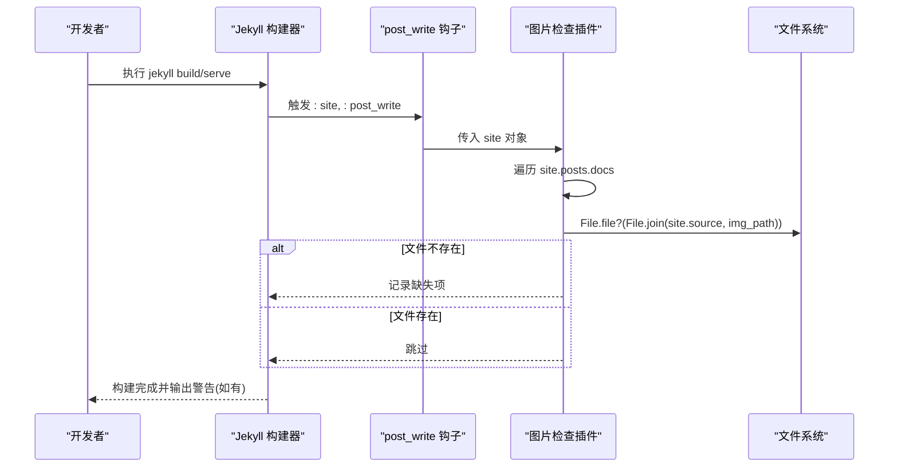
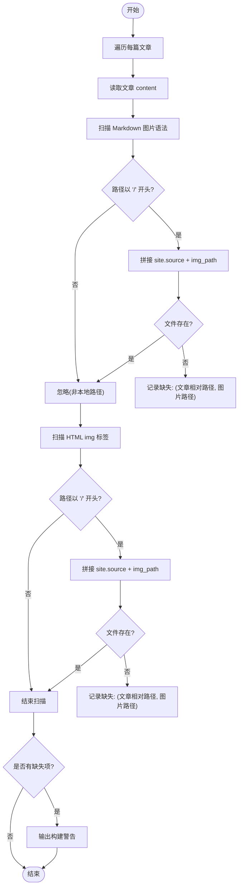
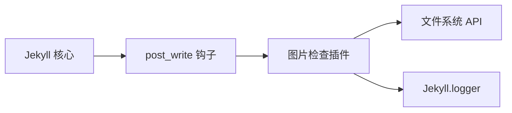

# 图片检查插件

<cite>
**本文引用的文件**
- [check_missing_images.rb](file://_plugins/check_missing_images.rb)
- [_config.yml](file://_config.yml)
- [README.md](file://README.md)
- [Gemfile](file://Gemfile)
</cite>

## 目录
1. [简介](#简介)
2. [项目结构](#项目结构)
3. [核心组件](#核心组件)
4. [架构总览](#架构总览)
5. [详细组件分析](#详细组件分析)
6. [依赖分析](#依赖分析)
7. [性能考虑](#性能考虑)
8. [故障排查指南](#故障排查指南)
9. [结论](#结论)
10. [附录](#附录)

## 简介
本插件在 Jekyll 构建流程的“站点写入后”阶段，对文章内容中的本地图片引用进行完整性校验。它支持两种常见语法：
- Markdown 图片语法：
- HTML img 标签：

当检测到路径以根号开头（即本地绝对路径）且目标文件不存在时，插件会在构建输出中打印警告信息，列出缺失的图片及其所在文章相对路径，便于快速定位与修复。

该插件无需额外配置即可启用，适合在本地开发与持续集成环境中使用，帮助团队在构建阶段尽早发现并修复图片链接问题。

## 项目结构
本项目为基于 GitHub Pages + Jekyll 的个人博客，采用 Minima 主题并进行深度定制。图片统一存放于 imgs 目录，文章中通过 /imgs/... 的绝对路径引用。插件位于 _plugins 目录，Jekyll 会自动加载。

图表来源
- [check_missing_images.rb:1-38](file://_plugins/check_missing_images.rb#L1-L38)

章节来源
- [README.md:26-62](file://README.md#L26-L62)
- [README.md:156-158](file://README.md#L156-L158)

## 核心组件
- 插件入口：注册 Jekyll 站点钩子，在 post_write 阶段执行检查逻辑。
- 内容扫描：遍历所有文章文档，提取 Markdown 图片与 HTML img 标签中的本地路径。
- 存在性验证：将相对路径拼接站点源目录，判断文件是否存在。
- 错误报告：汇总缺失项并在构建日志中输出警告。

章节来源
- [check_missing_images.rb:5-37](file://_plugins/check_missing_images.rb#L5-L37)

## 架构总览
下图展示了插件在 Jekyll 构建生命周期中的位置与数据流。

图表来源
- [check_missing_images.rb:5-37](file://_plugins/check_missing_images.rb#L5-L37)

## 详细组件分析

### 插件实现要点
- 钩子注册：在站点写入完成后执行，确保能访问到已解析的文章内容。
- 正则匹配：
  - Markdown 图片：匹配  形式，仅捕获以 / 开头的本地路径。
  - HTML img：匹配  形式，仅捕获以 / 开头的本地路径。
- 路径拼接：使用站点源目录与图片路径拼接，再进行文件存在性检查。
- 结果收集：将文章相对路径与缺失图片路径成对保存，最后统一输出。

图表来源
- [check_missing_images.rb:12-29](file://_plugins/check_missing_images.rb#L12-L29)
- [check_missing_images.rb:31-36](file://_plugins/check_missing_images.rb#L31-L36)

章节来源
- [check_missing_images.rb:1-38](file://_plugins/check_missing_images.rb#L1-L38)

### 支持的图片引用格式
- Markdown 图片语法：
- HTML img 标签：

注意：
- 仅对以 / 开头的本地路径进行检查，外链或相对路径不会被纳入检测范围。
- 路径需与站点源目录下的实际文件一致，大小写敏感（取决于操作系统）。

章节来源
- [README.md:156-158](file://README.md#L156-L158)

### 错误报告机制
- 当存在缺失图片时，插件会先输出一条汇总警告，包含缺失数量。
- 随后逐条输出具体文章相对路径与缺失图片路径，便于定位。
- 若未发现缺失项，则不输出任何相关警告。

章节来源
- [check_missing_images.rb:31-36](file://_plugins/check_missing_images.rb#L31-L36)

### 配置选项与自定义规则
当前插件未引入外部配置项，行为由代码内正则与路径策略决定。如需扩展，可考虑以下方向：
- 允许白名单路径前缀（如 /assets/imgs、/files）
- 忽略特定目录或文件后缀
- 支持更多图片语法变体（例如带 title 属性的 HTML img）
- 将缺失项写入文件或生成报告供 CI 消费

说明：以上为扩展建议，当前仓库未实现这些配置。

章节来源
- [check_missing_images.rb:1-38](file://_plugins/check_missing_images.rb#L1-L38)

### 构建流程集成方法
- 本地开发：运行 jekyll serve 或 jekyll build 时，插件自动生效，无需额外配置。
- 生产部署：GitHub Pages 默认使用 Jekyll 构建，插件同样会被加载。
- 其他平台：只要使用 Jekyll 构建，插件都会按相同逻辑执行。

章节来源
- [README.md:265-279](file://README.md#L265-L279)

### 持续集成配置示例
以下为通用思路，可根据不同平台调整命令与环境：
- 安装 Ruby 与依赖
- 执行 bundle install
- 执行 jekyll build
- 若构建成功但出现缺失图片警告，可在 CI 中将警告视为失败（可选）

参考命令（示意）：
- bundle install
- bundle exec jekyll build

章节来源
- [README.md:88-96](file://README.md#L88-L96)
- [README.md:124-132](file://README.md#L124-L132)

### 图片管理最佳实践
- 集中存放：将所有图片放入 imgs 目录，并按主题与年份组织子目录。
- 命名规范：使用英文或可被系统稳定识别的名称，避免特殊字符。
- 引用方式：统一使用以 / 开头的绝对路径，如 /imgs/主题/年份/文件名.png。
- 版本控制：图片文件应提交至 Git，确保构建环境一致性；本地调试时可临时放置 imgs 下即时预览。
- 清理冗余：定期清理未被引用的图片，减少构建产物体积。

章节来源
- [README.md:156-158](file://README.md#L156-L158)
- [README.md:276-279](file://README.md#L276-L279)

### 常见问题解决方案
- 构建提示缺失图片
  - 确认图片是否已放入 imgs 目录，且路径与引用一致。
  - 检查大小写与空格是否与引用完全匹配。
  - 若为外链或非本地路径，插件不会检查，需在浏览器端验证。
- 本地能显示但构建时报错
  - 可能是本地缓存导致，清理 _site 后重新构建。
- 大量文章需要批量修复
  - 根据构建输出的文章相对路径与图片路径逐一修正。
  - 可结合文本编辑器全局替换功能，谨慎核对后再应用。

章节来源
- [README.md:281-294](file://README.md#L281-L294)
- [check_missing_images.rb:31-36](file://_plugins/check_missing_images.rb#L31-L36)

## 依赖分析
- 运行时依赖：Jekyll 提供的站点对象与日志接口。
- 语言兼容：Ruby 3.4+ 环境下，Liquid 的 untaint 兼容性由其他插件提供，不影响本插件运行。
- 第三方插件：sitemap、seo-tag、feed 等与本插件无直接耦合。

图表来源
- [check_missing_images.rb:5-37](file://_plugins/check_missing_images.rb#L5-L37)

章节来源
- [Gemfile:1-25](file://Gemfile#L1-L25)
- [ruby34_compat.rb:1-22](file://_plugins/ruby34_compat.rb#L1-L22)

## 性能考虑
- 时间复杂度：O(N×M)，N 为文章数量，M 为每篇文章的平均图片引用数。
- I/O 开销：每次匹配到的本地路径进行一次文件存在性检查，整体开销较小。
- 优化建议：
  - 仅在需要时启用该插件（例如在 CI 中开启，本地开发关闭）。
  - 对超大站点可考虑增量检查或缓存检查结果。

[本节为通用指导，不涉及具体文件分析]

## 故障排查指南
- 构建输出中出现 Missing images 警告
  - 查看列出的文章相对路径与缺失图片路径，确认文件是否存在。
  - 若路径正确但仍报错，检查操作系统大小写敏感性与权限问题。
- 本地预览正常但构建失败
  - 清理 _site 目录后重新构建，排除缓存干扰。
- 无法定位缺失图片
  - 使用全文搜索工具查找对应图片路径，确认是否被误删或移动。

章节来源
- [check_missing_images.rb:31-36](file://_plugins/check_missing_images.rb#L31-L36)
- [README.md:281-294](file://README.md#L281-L294)

## 结论
该图片检查插件以最小侵入的方式在构建阶段保障图片完整性，有效降低线上出现坏链的风险。配合统一图片管理与规范的引用方式，可以显著提升博客的可维护性与用户体验。建议在本地与 CI 环境中均启用该插件，形成闭环的质量保障。

[本节为总结性内容，不涉及具体文件分析]

## 附录
- 相关环境与依赖
  - Jekyll 版本与主题：见 Gemfile 与 README 技术栈说明。
  - 插件加载：Jekyll 自动加载 _plugins 目录下的 Ruby 脚本。

章节来源
- [Gemfile:1-25](file://Gemfile#L1-L25)
- [README.md:322-331](file://README.md#L322-L331)