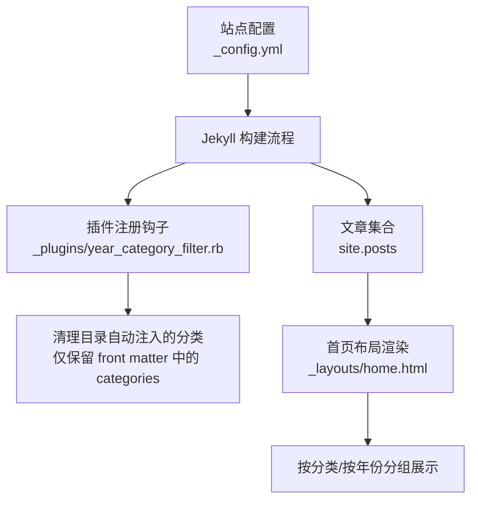
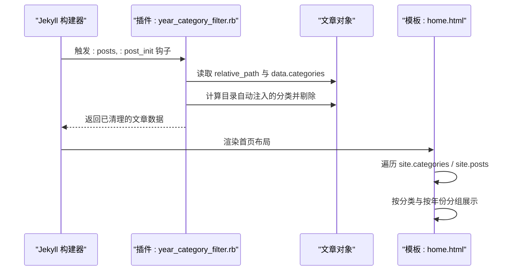
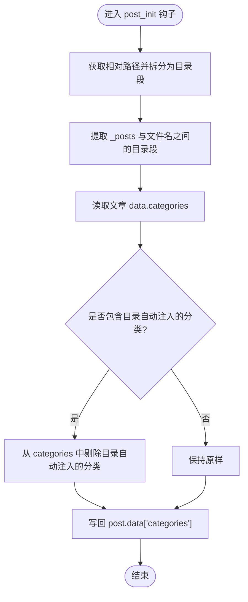
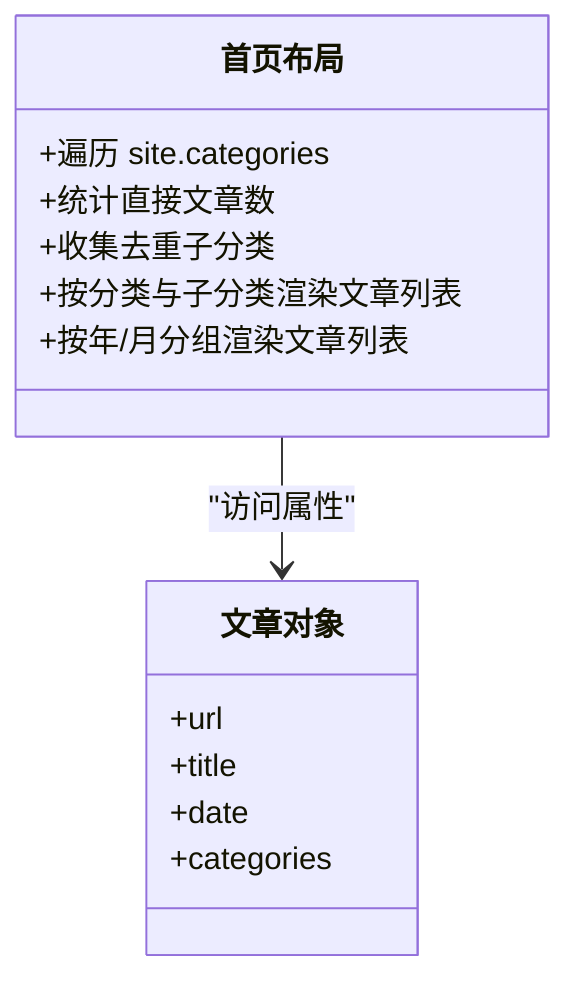
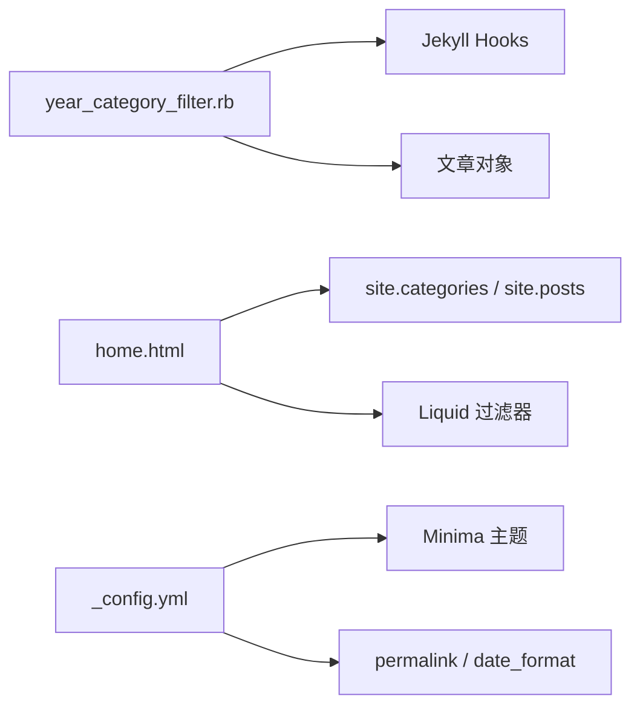

# 年份分类过滤插件

<cite>
**本文引用的文件**   
- [year_category_filter.rb](file://_plugins/year_category_filter.rb)
- [home.html](file://_layouts/home.html)
- [post.html](file://_layouts/post.html)
- [_config.yml](file://_config.yml)
</cite>

## 目录
1. [简介](#简介)
2. [项目结构](#项目结构)
3. [核心组件](#核心组件)
4. [架构总览](#架构总览)
5. [详细组件分析](#详细组件分析)
6. [依赖关系分析](#依赖关系分析)
7. [性能考量](#性能考量)
8. [故障排查指南](#故障排查指南)
9. [结论](#结论)
10. [附录：使用与配置示例](#附录使用与配置示例)

## 简介
本插件用于在 Jekyll 构建过程中，对文章自动注入的分类进行清理。Jekyll 默认会将 _posts 下的子目录名作为分类添加到每篇文章中；该插件在文章初始化后，移除所有来自目录结构的分类，仅保留 front matter 中显式定义的 categories。通过这一机制，作者可以完全控制文章的分类，避免目录结构与分类语义耦合，从而更灵活地组织内容。

注意：该插件并不负责“从文件名解析日期并生成年份分类”，而是确保只有 front matter 中的分类生效。若需要按年份展示或归档，可在模板中使用 Jekyll 内置的 site.posts 和 group_by_exp 等能力，结合文章 date 字段完成。

## 项目结构
与本插件直接相关的文件包括：
- 插件实现：_plugins/year_category_filter.rb
- 首页布局（演示如何使用分类与按年归档）：_layouts/home.html
- 文章布局：_layouts/post.html
- 站点配置（包含 permalink、主题等）：_config.yml

图表来源
- [year_category_filter.rb:1-13](file://_plugins/year_category_filter.rb#L1-L13)
- [home.html:19-127](file://_layouts/home.html#L19-L127)
- [_config.yml:36-45](file://_config.yml#L36-L45)

章节来源
- [year_category_filter.rb:1-13](file://_plugins/year_category_filter.rb#L1-L13)
- [home.html:19-127](file://_layouts/home.html#L19-L127)
- [_config.yml:36-45](file://_config.yml#L36-L45)

## 核心组件
- 插件钩子：在 posts 的 post_init 阶段执行，修改每篇文章的 data.categories。
- 分类清理逻辑：读取相对路径，提取 _posts 与文件名之间的目录段，将其视为“目录自动注入的分类”，并从文章 categories 中剔除这些项。
- 结果：最终文章只保留 front matter 中显式声明的 categories。

章节来源
- [year_category_filter.rb:5-12](file://_plugins/year_category_filter.rb#L5-L12)

## 架构总览
下图展示了 Jekyll 构建时，插件如何介入文章初始化流程，以及首页布局如何利用清理后的分类数据与日期信息进行展示。

图表来源
- [year_category_filter.rb:5-12](file://_plugins/year_category_filter.rb#L5-L12)
- [home.html:19-127](file://_layouts/home.html#L19-L127)

## 详细组件分析

### 插件实现：year_category_filter.rb
- 功能目标：移除由目录结构自动注入的分类，仅保留 front matter 中显式定义的 categories。
- 关键步骤：
  - 获取文章相对路径，拆分路径段，去除首尾的 "_posts" 与文件名，得到中间目录段列表。
  - 读取文章 data.categories，过滤掉出现在目录段列表中的分类。
  - 将过滤后的数组写回 post.data["categories"]。
- 行为边界：
  - 如果文章未定义 categories，则保持为空数组。
  - 如果目录段与 front matter 中的分类同名，将被剔除。
  - 不影响其他元数据（如 tags、date 等）。

图表来源
- [year_category_filter.rb:5-12](file://_plugins/year_category_filter.rb#L5-L12)

章节来源
- [year_category_filter.rb:1-13](file://_plugins/year_category_filter.rb#L1-L13)

### 模板侧使用：按分类与按年份展示
- 按分类展示：
  - 使用 site.categories 获取分类到文章的映射，排序后遍历每个分类及其文章列表。
  - 支持一级分类与二级分类的组合展示（例如主分类 + 子分类），并在列表中显示文章标题与链接。
- 按年份展示：
  - 使用 site.posts 与 group_by_exp 按 post.date | date: '%Y' 分组，再按月进一步分组，形成“年-月”层级结构。
  - 列表中包含发布日期与标题链接。

图表来源
- [home.html:19-127](file://_layouts/home.html#L19-L127)

章节来源
- [home.html:19-127](file://_layouts/home.html#L19-L127)

### 文章元数据与日期格式
- 文章布局中使用了 page.date 与自定义 create_time/update_time 字段，用于显示创建与更新时间。
- 站点配置中定义了日期格式与永久链接模式，影响 URL 与日期渲染。

章节来源
- [post.html:9-25](file://_layouts/post.html#L9-L25)
- [_config.yml:15-36](file://_config.yml#L15-L36)

## 依赖关系分析
- 插件依赖：
  - Jekyll 钩子系统：注册 :posts, :post_init 钩子。
  - 文章对象 API：relative_path、data["categories"]。
- 模板依赖：
  - Jekyll 全局变量：site.categories、site.posts。
  - Liquid 过滤器：sort、group_by_exp、date、escape、relative_url 等。
- 外部依赖：
  - 主题 Minima（通过 theme: minima 配置）。
  - 站点配置中的 permalink 与 date_format 影响 URL 与日期显示。

图表来源
- [year_category_filter.rb:5-12](file://_plugins/year_category_filter.rb#L5-L12)
- [home.html:19-127](file://_layouts/home.html#L19-L127)
- [_config.yml:10-36](file://_config.yml#L10-L36)

章节来源
- [year_category_filter.rb:5-12](file://_plugins/year_category_filter.rb#L5-L12)
- [home.html:19-127](file://_layouts/home.html#L19-L127)
- [_config.yml:10-36](file://_config.yml#L10-L36)

## 性能考量
- 插件仅在 post_init 阶段运行一次，复杂度与文章数量线性相关，开销较小。
- 模板侧按分类与按年份分组会遍历 site.posts，属于常规渲染成本。可通过减少不必要的循环与提前计算提升性能（例如缓存分组结果）。
- 建议：
  - 合理设置 categories，避免过多层级导致模板复杂度过高。
  - 在大型站点上，考虑按需加载视图（如首页默认只展示最近 N 篇）。

[本节为通用指导，不直接分析具体文件]

## 故障排查指南
- 现象：文章没有显示任何分类
  - 检查 front matter 是否正确定义 categories。
  - 确认插件未被禁用，且位于 _plugins 目录下。
- 现象：分类名称与目录名冲突被剔除
  - 这是预期行为：插件会剔除目录自动注入的分类。请确保 front matter 中显式定义所需分类。
- 现象：按年份归档未按预期显示
  - 检查文章 front matter 中的 date 字段是否存在且可解析。
  - 检查 _config.yml 中的 date_format 是否与期望一致。
- 现象：URL 与日期显示不符合预期
  - 检查 _config.yml 中的 permalink 与 date_format 配置。

章节来源
- [year_category_filter.rb:5-12](file://_plugins/year_category_filter.rb#L5-L12)
- [home.html:105-127](file://_layouts/home.html#L105-L127)
- [_config.yml:15-36](file://_config.yml#L15-L36)

## 结论
该插件通过移除目录自动注入的分类，使分类管理完全由 front matter 控制，提升了分类的灵活性与一致性。配合模板中的按分类与按年份展示逻辑，可实现清晰的内容导航与归档体验。建议在写作时明确定义 categories，并确保 date 字段正确，以获得最佳的归档与展示效果。

[本节为总结性内容，不直接分析具体文件]

## 附录：使用与配置示例

- 在 front matter 中定义分类
  - 示例路径参考：[JeKyll 在 Windows 下本地预览中文路径.md:1-7](file://_posts/2019/2019-12-12-JeKyll-在-Windows-下本地预览中文路径.md#L1-L7)
  - 示例路径参考：[SSH 保持长时间连接.md:1-7](file://_posts/2020/2020-01-22-SSH-保持长时间连接.md#L1-L7)

- 在首页布局中使用分类与按年归档
  - 分类视图与计数逻辑参考：[home.html:19-102](file://_layouts/home.html#L19-L102)
  - 按年/月视图逻辑参考：[home.html:105-127](file://_layouts/home.html#L105-L127)

- 站点配置要点
  - 主题与皮肤、日期格式：[_config.yml:10-15](file://_config.yml#L10-L15)
  - 永久链接与 Markdown 处理器：[_config.yml:36-38](file://_config.yml#L36-L38)
  - 插件启用列表（本插件无需在此处显式启用，位于 _plugins 即自动加载）：[_config.yml:41-45](file://_config.yml#L41-L45)

- 扩展点与自定义选项
  - 当前插件提供的是固定行为：剔除目录自动注入的分类。如需自定义剔除规则（例如忽略特定目录段、或合并某些分类），可在 post_init 钩子中扩展过滤逻辑。
  - 若希望基于文件名解析日期并生成年份分类，可在插件中增加额外逻辑，但需注意与现有“仅保留 front matter 分类”的设计保持一致，避免产生歧义。

章节来源
- [year_category_filter.rb:5-12](file://_plugins/year_category_filter.rb#L5-L12)
- [home.html:19-127](file://_layouts/home.html#L19-L127)
- [_config.yml:10-45](file://_config.yml#L10-L45)