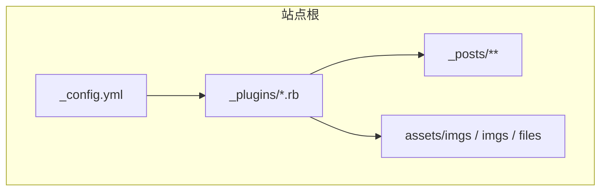
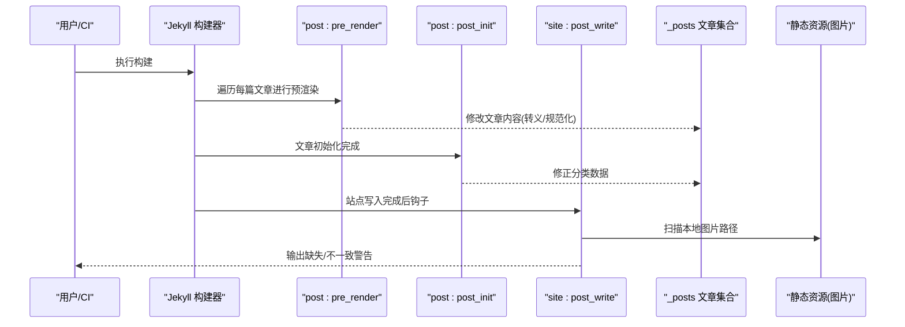
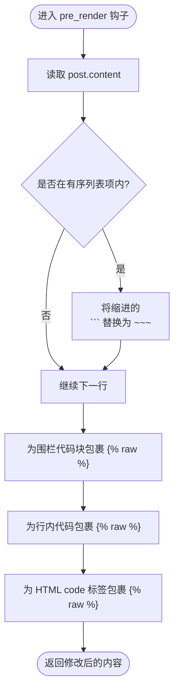
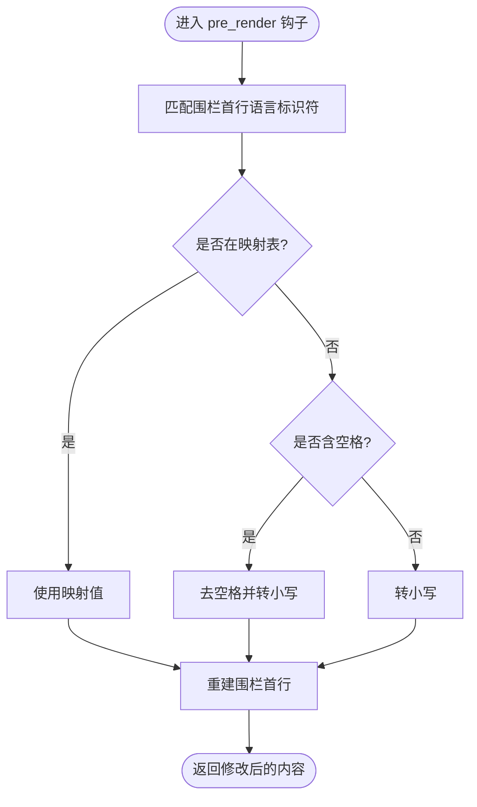
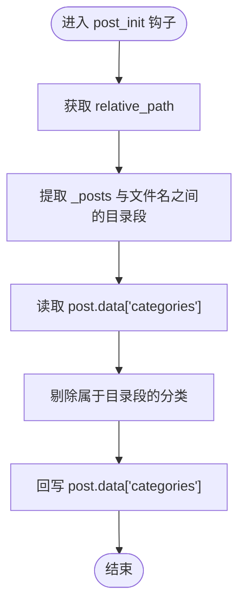
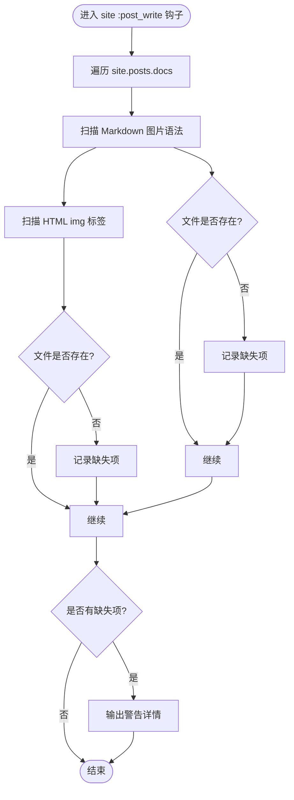
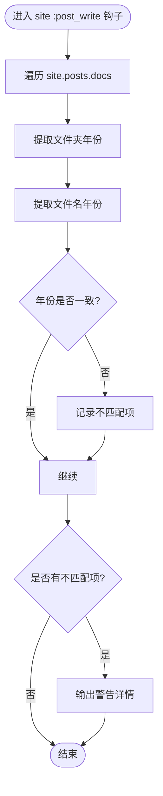
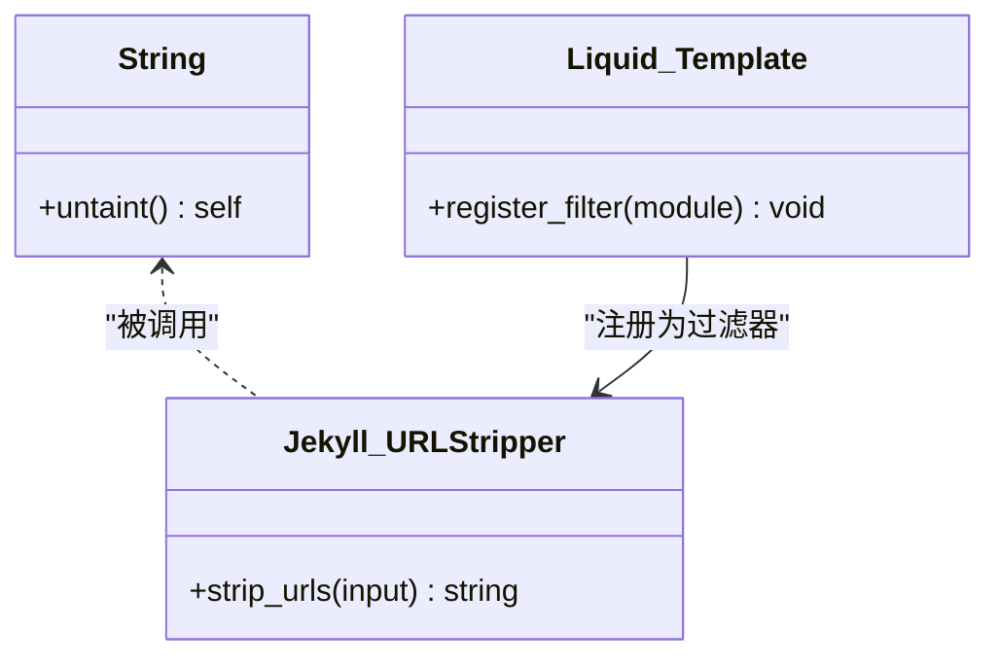
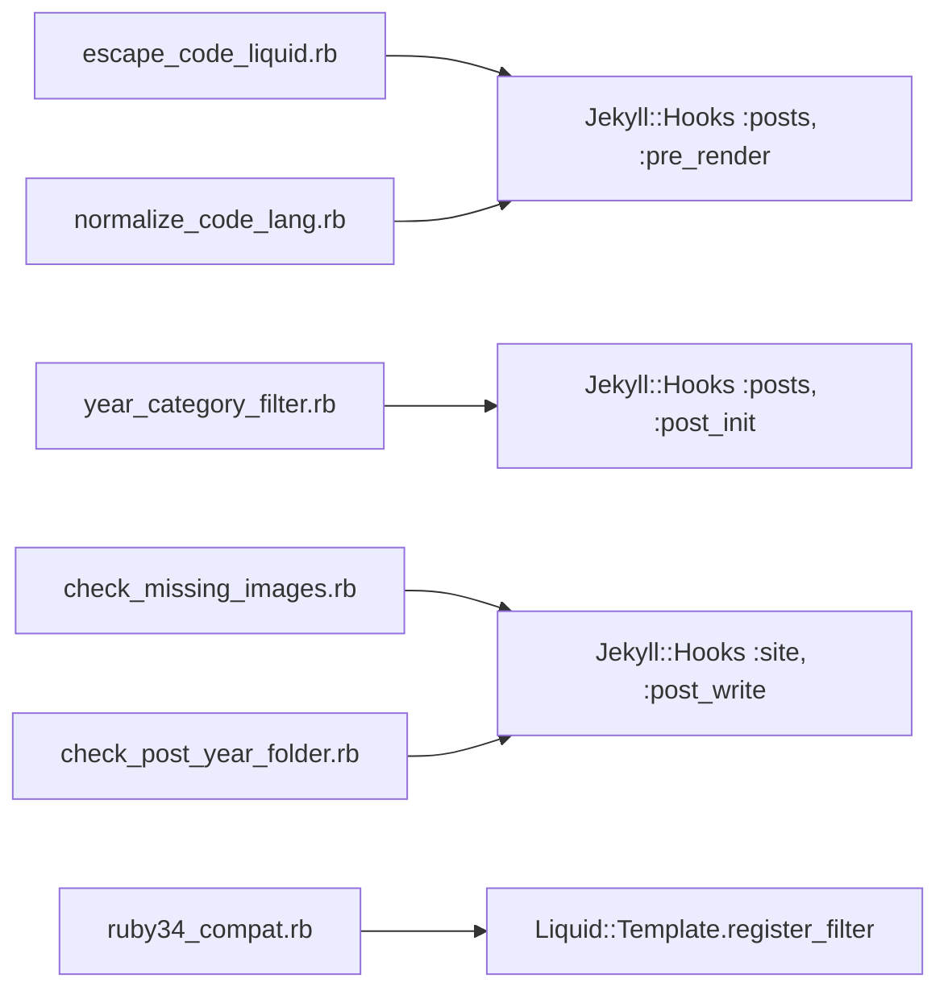

# 插件系统

<cite>
**本文引用的文件**
- [escape_code_liquid.rb](file://_plugins/escape_code_liquid.rb)
- [year_category_filter.rb](file://_plugins/year_category_filter.rb)
- [ruby34_compat.rb](file://_plugins/ruby34_compat.rb)
- [check_missing_images.rb](file://_plugins/check_missing_images.rb)
- [normalize_code_lang.rb](file://_plugins/normalize_code_lang.rb)
- [check_post_year_folder.rb](file://_plugins/check_post_year_folder.rb)
- [_config.yml](file://_config.yml)
</cite>

## 目录
1. [简介](#简介)
2. [项目结构](#项目结构)
3. [核心组件](#核心组件)
4. [架构总览](#架构总览)
5. [详细组件分析](#详细组件分析)
6. [依赖关系分析](#依赖关系分析)
7. [性能考量](#性能考量)
8. [故障排除指南](#故障排除指南)
9. [结论](#结论)
10. [附录](#附录)

## 简介
本仓库为基于 Jekyll 的博客站点，使用自定义 Ruby 插件增强构建流程与内容渲染体验。本文聚焦于 _plugins 目录下的自定义插件，系统性说明其功能、实现机制、Hook 生命周期、Liquid 过滤器扩展方式，以及插件间的协作关系与最佳实践。重点覆盖以下能力：
- 解决 Liquid 语法冲突（代码块中的 {{ }} 被误解析）
- 自动规范化代码语言标识符，提升高亮一致性
- 过滤由目录结构注入的分类，仅保留 front matter 显式声明
- 构建期检查图片完整性与文章年份文件夹一致性
- 兼容 Ruby 3.4+ 对旧版 Liquid/Jekyll 的缺失方法

## 项目结构
Jekyll 在启动时会加载 _plugins 目录下的所有 Ruby 文件作为插件。本项目的配置中未显式启用第三方插件列表，但本地或 CI 环境可能通过 Gemfile 或全局 gem 安装 jekyll-sitemap、jekyll-seo-tag、jekyll-feed 等官方插件；同时，自定义插件无需在配置中声明即可生效。



图表来源
- [_config.yml:35-45](file://_config.yml#L35-L45)

章节来源
- [_config.yml:35-45](file://_config.yml#L35-L45)

## 核心组件
本节概览各插件的职责与触发时机：
- escape_code_liquid.rb：在 posts 预渲染阶段处理有序列表内代码块标记与代码片段中的 Liquid 变量保护，避免 {{ }} 被提前解析。
- normalize_code_lang.rb：在 posts 预渲染阶段规范化围栏代码块的语言标识符，确保 kramdown/rouge 正确识别。
- year_category_filter.rb：在 posts 初始化后移除由目录结构注入的分类，仅保留 front matter 显式定义。
- check_missing_images.rb：在站点 post_write 阶段扫描文章中的本地图片引用并输出缺失警告。
- check_post_year_folder.rb：在站点 post_write 阶段校验文章所在年份文件夹与文件名日期是否一致。
- ruby34_compat.rb：为 Ruby 3.4+ 提供 String#untaint 兼容垫片，并注册一个用于搜索索引清理的 Liquid 过滤器。

章节来源
- [escape_code_liquid.rb:1-62](file://_plugins/escape_code_liquid.rb#L1-L62)
- [normalize_code_lang.rb:1-42](file://_plugins/normalize_code_lang.rb#L1-L42)
- [year_category_filter.rb:1-13](file://_plugins/year_category_filter.rb#L1-L13)
- [check_missing_images.rb:1-38](file://_plugins/check_missing_images.rb#L1-L38)
- [check_post_year_folder.rb:1-33](file://_plugins/check_post_year_folder.rb#L1-L33)
- [ruby34_compat.rb:1-22](file://_plugins/ruby34_compat.rb#L1-L22)

## 架构总览
下图展示了自定义插件在 Jekyll 构建生命周期中的位置与作用点，以及它们与站点资源的关系。



图表来源
- [escape_code_liquid.rb:12-61](file://_plugins/escape_code_liquid.rb#L12-L61)
- [normalize_code_lang.rb:9-41](file://_plugins/normalize_code_lang.rb#L9-L41)
- [year_category_filter.rb:5-12](file://_plugins/year_category_filter.rb#L5-L12)
- [check_missing_images.rb:5-37](file://_plugins/check_missing_images.rb#L5-L37)
- [check_post_year_folder.rb:4-32](file://_plugins/check_post_year_folder.rb#L4-L32)

## 详细组件分析

### 组件一：escape_code_liquid.rb（Liquid 冲突防护）
- 目标
  - 解决有序列表项内的 ``` 被当作普通代码块的问题，将其转换为 ~~~。
  - 在围栏代码块、行内反引号代码、HTML <code> 标签中对 {{ }} 添加  保护，防止 Liquid 提前解析。
- 关键逻辑
  - 逐行扫描，维护有序列表上下文与围栏块状态，将缩进的 ``` 替换为 ~~~。
  - 使用正则匹配并包裹 ...，确保后续 Markdown/HTML 层不受影响。
- 适用场景
  - 文章中大量包含代码示例且使用有序列表时，避免渲染异常。
- 注意事项
  - 该插件会改写文章内容，建议仅在需要时启用，避免不必要的字符串操作开销。



图表来源
- [escape_code_liquid.rb:12-61](file://_plugins/escape_code_liquid.rb#L12-L61)

章节来源
- [escape_code_liquid.rb:1-62](file://_plugins/escape_code_liquid.rb#L1-L62)

### 组件二：normalize_code_lang.rb（代码语言标准化）
- 目标
  - 统一围栏代码块的语言标识符，使其符合 kramdown/rouge 的期望。
- 关键逻辑
  - 内置映射表（如 "Plain Text" → "text"、"C++" → "cpp"）。
  - 对含空格的标识符去除空格并转小写；其余一律转小写。
  - 支持 ``` 和 ~~~ 两种围栏标记。
- 适用场景
  - 作者习惯使用自然语言描述语言名（如 "Java Script"、"C Sharp"），希望自动规范化。
- 注意事项
  - 若需新增语言别名，可在映射表中追加条目。



图表来源
- [normalize_code_lang.rb:9-41](file://_plugins/normalize_code_lang.rb#L9-L41)

章节来源
- [normalize_code_lang.rb:1-42](file://_plugins/normalize_code_lang.rb#L1-L42)

### 组件三：year_category_filter.rb（自动分类过滤）
- 目标
  - 移除由 _posts 子目录结构自动注入的分类，仅保留 front matter 中显式定义的 categories。
- 关键逻辑
  - 从相对路径提取中间目录段作为“目录分类”，与 post.data["categories"] 对比并剔除。
- 适用场景
  - 使用按年分目录组织文章，但不希望这些目录成为文章的分类。
- 注意事项
  - 若确实需要通过目录生成分类，请禁用此插件。



图表来源
- [year_category_filter.rb:5-12](file://_plugins/year_category_filter.rb#L5-L12)

章节来源
- [year_category_filter.rb:1-13](file://_plugins/year_category_filter.rb#L1-L13)

### 组件四：check_missing_images.rb（图片完整性检查）
- 目标
  - 在构建完成后扫描文章中的本地图片引用，若文件不存在则输出警告。
- 关键逻辑
  - 扫描 Markdown 图片语法与 HTML img 标签中的 src 属性，拼接 site.source 路径并检测文件存在性。
- 适用场景
  - 大型博客中频繁移动/删除图片后快速发现断链。
- 注意事项
  - 仅检查以 / 开头的本地路径；外部 URL 不会被检查。



图表来源
- [check_missing_images.rb:5-37](file://_plugins/check_missing_images.rb#L5-L37)

章节来源
- [check_missing_images.rb:1-38](file://_plugins/check_missing_images.rb#L1-L38)

### 组件五：check_post_year_folder.rb（年份文件夹一致性检查）
- 目标
  - 校验文章所在年份文件夹与文件名日期年份是否一致，不一致时输出警告。
- 关键逻辑
  - 从 relative_path 提取文件夹年份，从文件名提取日期年份，比较两者是否相同。
- 适用场景
  - 迁移文章或批量重命名后，快速发现路径与日期不一致的情况。



图表来源
- [check_post_year_folder.rb:4-32](file://_plugins/check_post_year_folder.rb#L4-L32)

章节来源
- [check_post_year_folder.rb:1-33](file://_plugins/check_post_year_folder.rb#L1-L33)

### 组件六：ruby34_compat.rb（Ruby 3.4+ 兼容性）
- 目标
  - 为 Ruby 3.4+ 提供 String#untaint 兼容垫片，避免旧版 Liquid/Jekyll 报错。
  - 注册一个 Liquid 过滤器，用于从内容中剥离 URL、Markdown 链接与图片，便于搜索索引。
- 关键逻辑
  - 条件性地定义 String#untaitn 方法，若原对象已具备该方法则不覆盖。
  - 定义模块方法并通过 Liquid::Template.register_filter 注册为过滤器。
- 适用场景
  - 在较新 Ruby 版本上运行老版本 Jekyll/Liquid 时的兼容保障。
- 注意事项
  - 该过滤器可用于模板中，例如在生成搜索索引前清理内容。



图表来源
- [ruby34_compat.rb:1-22](file://_plugins/ruby34_compat.rb#L1-L22)

章节来源
- [ruby34_compat.rb:1-22](file://_plugins/ruby34_compat.rb#L1-L22)

## 依赖关系分析
- 生命周期耦合
  - posts :pre_render：escape_code_liquid.rb、normalize_code_lang.rb
  - posts :post_init：year_category_filter.rb
  - site :post_write：check_missing_images.rb、check_post_year_folder.rb
- 外部依赖
  - Jekyll API：Jekyll::Hooks、Jekyll.logger、Liquid::Template
  - 文件系统：File.file?、File.join、File.basename
- 潜在循环依赖
  - 当前插件之间无直接相互引用，均为独立注册钩子或过滤器，耦合度低。



图表来源
- [escape_code_liquid.rb:12-61](file://_plugins/escape_code_liquid.rb#L12-L61)
- [normalize_code_lang.rb:9-41](file://_plugins/normalize_code_lang.rb#L9-L41)
- [year_category_filter.rb:5-12](file://_plugins/year_category_filter.rb#L5-L12)
- [check_missing_images.rb:5-37](file://_plugins/check_missing_images.rb#L5-L37)
- [check_post_year_folder.rb:4-32](file://_plugins/check_post_year_folder.rb#L4-L32)
- [ruby34_compat.rb:21-22](file://_plugins/ruby34_compat.rb#L21-L22)

章节来源
- [escape_code_liquid.rb:12-61](file://_plugins/escape_code_liquid.rb#L12-L61)
- [normalize_code_lang.rb:9-41](file://_plugins/normalize_code_lang.rb#L9-L41)
- [year_category_filter.rb:5-12](file://_plugins/year_category_filter.rb#L5-L12)
- [check_missing_images.rb:5-37](file://_plugins/check_missing_images.rb#L5-L37)
- [check_post_year_folder.rb:4-32](file://_plugins/check_post_year_folder.rb#L4-L32)
- [ruby34_compat.rb:21-22](file://_plugins/ruby34_compat.rb#L21-L22)

## 性能考量
- 正则与字符串替换
  - escape_code_liquid.rb 与 normalize_code_lang.rb 在 pre_render 阶段对全文进行多次 gsub/scan，建议在文章体量较大时关注构建耗时。
- I/O 检查
  - check_missing_images.rb 与 check_post_year_folder.rb 在 post_write 阶段进行文件存在性检查，属于轻量级 I/O，通常可接受。
- 优化建议
  - 按需启用：若不需要某项能力，可将对应插件注释或删除，减少运行时开销。
  - 合并策略：当多个插件都修改 post.content 时，注意顺序与副作用叠加的影响。

[本节为通用指导，不涉及具体文件分析]

## 故障排除指南
- 问题：代码块中的 {{ }} 仍被解析导致渲染错误
  - 排查：确认 escape_code_liquid.rb 是否加载；检查有序列表内是否使用了 ``` 而非 ~~~；查看最终生成的 HTML 是否包含 。
  - 参考：[escape_code_liquid.rb:12-61](file://_plugins/escape_code_liquid.rb#L12-L61)
- 问题：代码高亮语言不正确或缺失样式
  - 排查：确认 normalize_code_lang.rb 是否生效；检查语言标识符是否符合 kramdown/rouge 规范；必要时在映射表中补充别名。
  - 参考：[normalize_code_lang.rb:9-41](file://_plugins/normalize_code_lang.rb#L9-L41)
- 问题：文章分类不符合预期
  - 排查：确认 year_category_filter.rb 是否启用了；检查 front matter 中 categories 的定义；验证目录结构是否产生额外分类。
  - 参考：[year_category_filter.rb:5-12](file://_plugins/year_category_filter.rb#L5-L12)
- 问题：构建时报图片缺失
  - 排查：根据 check_missing_images.rb 输出的路径定位缺失文件；确认图片路径是否为绝对路径（以 / 开头）；检查 assets 或 imgs 目录布局。
  - 参考：[check_missing_images.rb:5-37](file://_plugins/check_missing_images.rb#L5-L37)
- 问题：文章年份与文件夹不一致
  - 排查：根据 check_post_year_folder.rb 的输出调整文件或目录名称，使二者一致。
  - 参考：[check_post_year_folder.rb:4-32](file://_plugins/check_post_year_folder.rb#L4-L32)
- 问题：Ruby 3.4+ 环境下出现 untaint 相关错误
  - 排查：确认 ruby34_compat.rb 是否加载；检查是否覆盖了已有方法。
  - 参考：[ruby34_compat.rb:1-7](file://_plugins/ruby34_compat.rb#L1-L7)

章节来源
- [escape_code_liquid.rb:12-61](file://_plugins/escape_code_liquid.rb#L12-L61)
- [normalize_code_lang.rb:9-41](file://_plugins/normalize_code_lang.rb#L9-L41)
- [year_category_filter.rb:5-12](file://_plugins/year_category_filter.rb#L5-L12)
- [check_missing_images.rb:5-37](file://_plugins/check_missing_images.rb#L5-L37)
- [check_post_year_folder.rb:4-32](file://_plugins/check_post_year_folder.rb#L4-L32)
- [ruby34_compat.rb:1-7](file://_plugins/ruby34_compat.rb#L1-L7)

## 结论
本项目通过一组轻量级自定义插件，显著提升了 Jekyll 构建与渲染的稳定性和可用性：
- 在内容层面，解决了 Liquid 与代码块的冲突，统一了代码语言标识符。
- 在元数据层面，过滤了目录结构带来的隐式分类，保持分类语义清晰。
- 在质量保障层面，提供了图片完整性与路径一致性的构建期检查。
- 在环境兼容层面，提供了 Ruby 3.4+ 的兼容垫片与搜索索引清理过滤器。

这些插件遵循 Jekyll 的 Hook 机制与 Liquid 过滤器扩展模式，职责单一、耦合度低，易于维护和扩展。

[本节为总结性内容，不涉及具体文件分析]

## 附录

### 插件开发模式与 Hook 机制
- 插件入口
  - 将 .rb 文件放入 _plugins 目录，Jekyll 会自动加载。
- 常用 Hook
  - posts :pre_render：在文章渲染前修改内容（如转义、规范化）。
  - posts :post_init：在文章初始化后修改元数据（如分类）。
  - site :post_write：在站点写入完成后进行扫描与报告。
- 参考
  - [escape_code_liquid.rb:12-61](file://_plugins/escape_code_liquid.rb#L12-L61)
  - [normalize_code_lang.rb:9-41](file://_plugins/normalize_code_lang.rb#L9-L41)
  - [year_category_filter.rb:5-12](file://_plugins/year_category_filter.rb#L5-L12)
  - [check_missing_images.rb:5-37](file://_plugins/check_missing_images.rb#L5-L37)
  - [check_post_year_folder.rb:4-32](file://_plugins/check_post_year_folder.rb#L4-L32)

### Liquid 过滤器扩展方法
- 注册方式
  - 定义模块方法，使用 Liquid::Template.register_filter 注册。
- 使用示例
  - 在模板中可通过 | 管道调用注册的过滤器，用于内容清洗或格式化。
- 参考
  - [ruby34_compat.rb:21-22](file://_plugins/ruby34_compat.rb#L21-L22)

### 插件间协作与扩展点
- 协作关系
  - escape_code_liquid.rb 与 normalize_code_lang.rb 均在 pre_render 阶段工作，前者保证语法安全，后者保证高亮正确。
  - year_category_filter.rb 在 post_init 阶段修正分类，避免与目录结构耦合。
  - check_missing_images.rb 与 check_post_year_folder.rb 在 post_write 阶段进行质量检查，互不影响。
- 扩展点
  - 新增语言别名：在 normalize_code_lang.rb 的映射表中追加。
  - 新增检查规则：在 post_write 钩子中增加新的扫描逻辑。
  - 新增过滤器：参照 ruby34_compat.rb 的模式注册。

章节来源
- [escape_code_liquid.rb:12-61](file://_plugins/escape_code_liquid.rb#L12-L61)
- [normalize_code_lang.rb:9-41](file://_plugins/normalize_code_lang.rb#L9-L41)
- [year_category_filter.rb:5-12](file://_plugins/year_category_filter.rb#L5-L12)
- [check_missing_images.rb:5-37](file://_plugins/check_missing_images.rb#L5-L37)
- [check_post_year_folder.rb:4-32](file://_plugins/check_post_year_folder.rb#L4-L32)
- [ruby34_compat.rb:21-22](file://_plugins/ruby34_compat.rb#L21-L22)