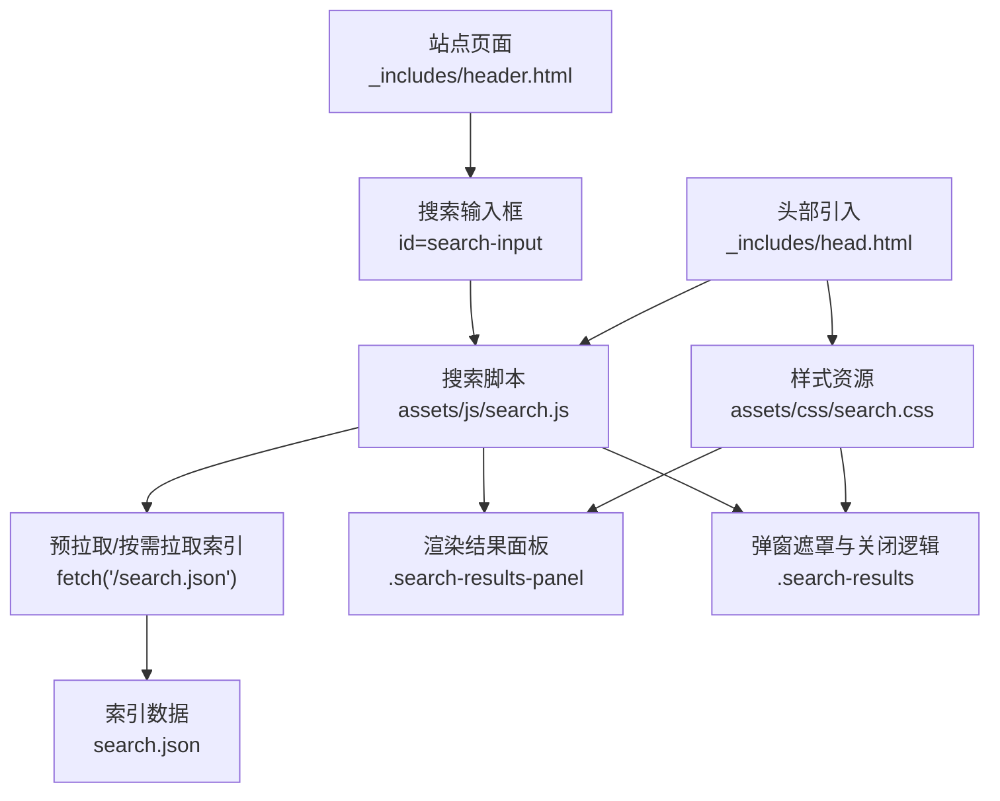
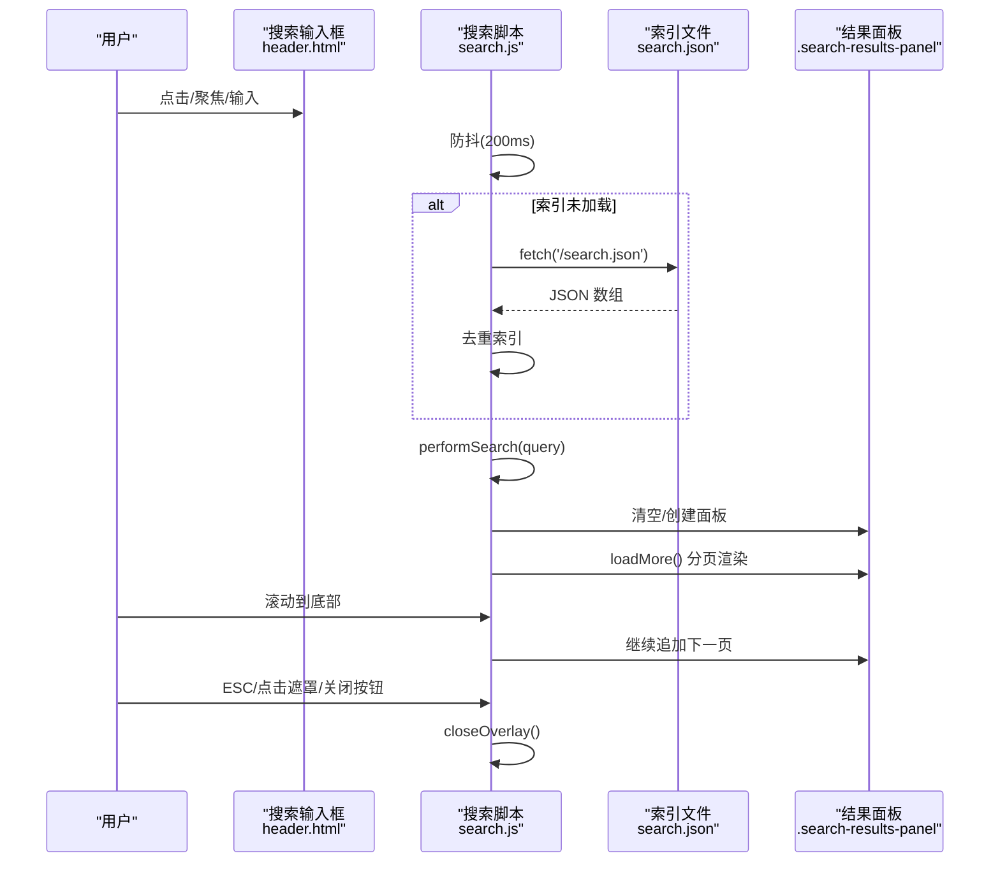
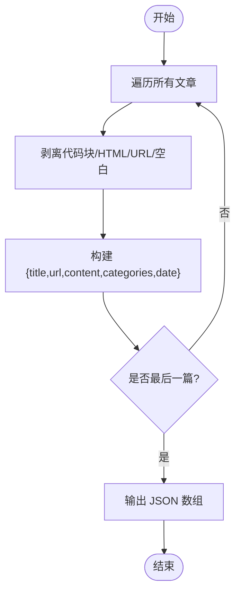
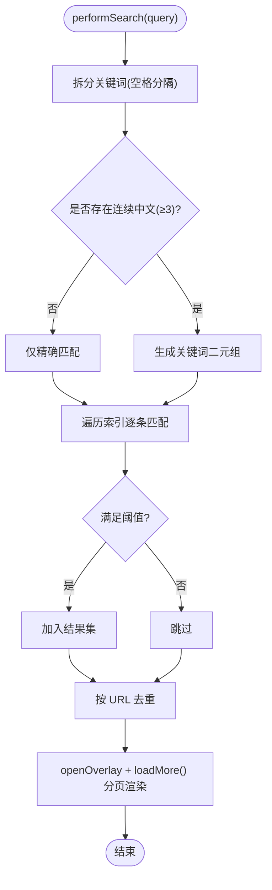
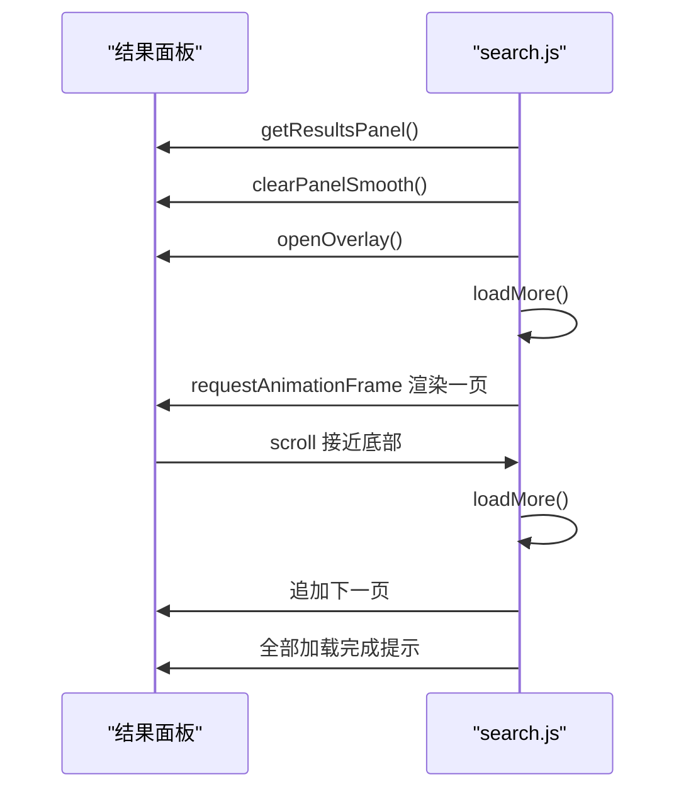
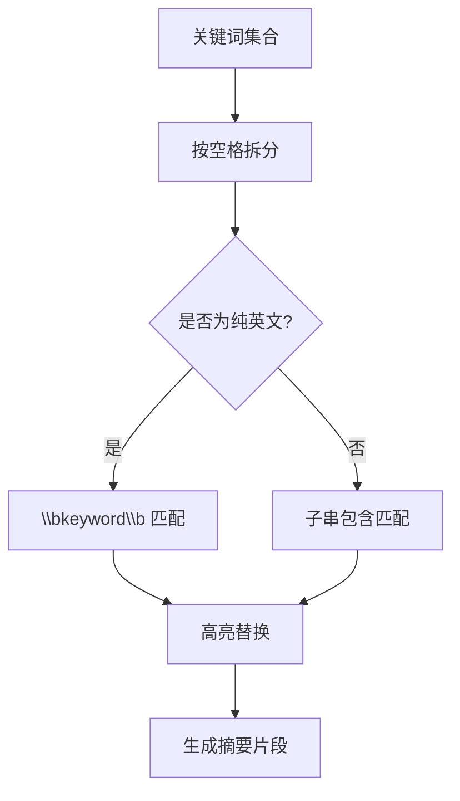
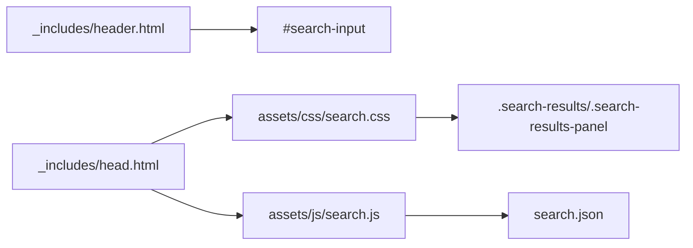

# 搜索功能

<cite>
**本文引用的文件**
- [search.json](file://search.json)
- [assets/js/search.js](file://assets/js/search.js)
- [assets/css/search.css](file://assets/css/search.css)
- [_includes/header.html](file://_includes/header.html)
- [_includes/head.html](file://_includes/head.html)
- [_config.yml](file://_config.yml)
</cite>

## 目录
1. [简介](#简介)
2. [项目结构](#项目结构)
3. [核心组件](#核心组件)
4. [架构总览](#架构总览)
5. [详细组件分析](#详细组件分析)
6. [依赖关系分析](#依赖关系分析)
7. [性能与优化](#性能与优化)
8. [配置与自定义](#配置与自定义)
9. [故障排除指南](#故障排除指南)
10. [结论](#结论)

## 简介
本技术文档围绕站点的前端全文搜索能力，系统性说明以下方面：
- 索引生成机制（Jekyll 模板生成 search.json）
- 客户端搜索逻辑（加载索引、匹配算法、中文模糊匹配、关键词高亮）
- 搜索结果分页加载与弹窗展示
- 搜索框集成方式与用户交互设计
- 配置项、扩展点与常见问题排查

该实现为纯前端方案，无需后端服务，适合静态站点（如 GitHub Pages）。

## 项目结构
搜索相关资源与集成位置如下：
- 索引文件：search.json（由 Jekyll 在构建时生成）
- 样式：assets/css/search.css（搜索框与弹窗 UI）
- 脚本：assets/js/search.js（搜索逻辑）
- 集成入口：_includes/header.html（注入搜索输入框）、_includes/head.html（引入 CSS/JS）
- 站点配置：_config.yml（控制 URL 规则等）

图表来源
- [_includes/header.html:5-8](file://_includes/header.html#L5-L8)
- [_includes/head.html:9-10](file://_includes/head.html#L9-L10)
- [_includes/head.html:25](file://_includes/head.html#L25)
- [assets/js/search.js:1-27](file://assets/js/search.js#L1-L27)
- [assets/css/search.css:402-471](file://assets/css/search.css#L402-L471)
- [assets/css/search.css:477-598](file://assets/css/search.css#L477-L598)

章节来源
- [_includes/header.html:1-11](file://_includes/header.html#L1-L11)
- [_includes/head.html:1-27](file://_includes/head.html#L1-L27)
- [assets/js/search.js:1-27](file://assets/js/search.js#L1-L27)
- [assets/css/search.css:402-471](file://assets/css/search.css#L402-L471)
- [assets/css/search.css:477-598](file://assets/css/search.css#L477-L598)

## 核心组件
- 索引生成器（Jekyll 模板）
  - 遍历所有文章，提取标题、URL、正文内容、分类、日期，并输出 JSON 数组。
  - 对代码块进行剥离处理，避免将代码片段纳入检索文本。
- 客户端搜索引擎（JavaScript）
  - 预加载或按需加载 search.json。
  - 支持英文单词边界匹配与中文子串匹配；对长中文词组启用二元组模糊评分。
  - 关键词高亮与摘要片段生成。
  - 全屏弹窗 + 滚动分页加载。
- 样式系统（CSS）
  - 提供搜索框、弹窗、结果条目、标签、高亮等完整视觉样式，含暗色模式适配。

章节来源
- [search.json:1-13](file://search.json#L1-L13)
- [assets/js/search.js:29-37](file://assets/js/search.js#L29-L37)
- [assets/js/search.js:225-252](file://assets/js/search.js#L225-L252)
- [assets/js/search.js:254-311](file://assets/js/search.js#L254-L311)
- [assets/js/search.js:313-323](file://assets/js/search.js#L313-L323)
- [assets/js/search.js:325-401](file://assets/js/search.js#L325-L401)
- [assets/js/search.js:414-484](file://assets/js/search.js#L414-L484)
- [assets/css/search.css:402-471](file://assets/css/search.css#L402-L471)
- [assets/css/search.css:477-598](file://assets/css/search.css#L477-L598)

## 架构总览
整体流程：页面加载后，脚本预拉取索引；用户在搜索框输入时触发搜索；根据匹配算法计算结果集；以分页形式渲染到弹窗面板中；支持 ESC/点击遮罩/关闭按钮退出。

图表来源
- [_includes/header.html:5-8](file://_includes/header.html#L5-L8)
- [assets/js/search.js:219-223](file://assets/js/search.js#L219-L223)
- [assets/js/search.js:114-145](file://assets/js/search.js#L114-L145)
- [assets/js/search.js:325-401](file://assets/js/search.js#L325-L401)
- [assets/js/search.js:414-484](file://assets/js/search.js#L414-L484)
- [assets/js/search.js:147-192](file://assets/js/search.js#L147-L192)

## 详细组件分析

### 索引生成机制（search.json）
- 遍历 site.posts，逐条构造对象：title、url、content、categories、date。
- content 通过 Liquid 模板剥离 <pre>...</pre> 代码块，再 strip_html、strip_urls、strip，减少噪声并提升检索质量。
- 最终输出 JSON 数组，供客户端一次性加载。

图表来源
- [search.json:4-12](file://search.json#L4-L12)

章节来源
- [search.json:1-13](file://search.json#L1-L13)

### 客户端搜索逻辑（search.js）
- 初始化与 DOM 绑定
  - 获取 #search-input，读取 data-search-url 指向 /search.json。
  - 监听 input/focus/click/mousedown 事件，统一打开全屏弹窗并执行搜索。
- 索引加载策略
  - 页面加载即预拉取一次索引，失败静默忽略。
  - 首次搜索若索引为空则按需拉取，成功后缓存至内存。
- 匹配算法
  - 英文：使用单词边界正则匹配。
  - 中文：子串包含匹配。
  - 模糊匹配：当出现连续中文（长度≥3）时，采用“二元组”分片，统计命中比例阈值（>0.4）决定是否收录。
- 高亮与摘要
  - 标题与摘要均按关键词高亮（em 包裹）。
  - 摘要优先覆盖命中区间，必要时以首个命中为中心截取固定长度片段。
- 分页与滚动加载
  - 每页 PAGE_SIZE=8 条，滚动接近底部自动加载更多。
  - 首屏无结果时显示“未找到匹配结果”，全部加载完成显示提示。
- 弹窗交互
  - 打开时锁定背景滚动、保存滚动位置，关闭时恢复。
  - 支持 ESC 关闭、点击遮罩关闭（有选中文本时不关闭），关闭按钮显隐控制。

图表来源
- [assets/js/search.js:325-401](file://assets/js/search.js#L325-L401)
- [assets/js/search.js:313-323](file://assets/js/search.js#L313-L323)
- [assets/js/search.js:225-252](file://assets/js/search.js#L225-L252)
- [assets/js/search.js:254-311](file://assets/js/search.js#L254-L311)

章节来源
- [assets/js/search.js:1-27](file://assets/js/search.js#L1-L27)
- [assets/js/search.js:114-145](file://assets/js/search.js#L114-L145)
- [assets/js/search.js:219-223](file://assets/js/search.js#L219-L223)
- [assets/js/search.js:225-252](file://assets/js/search.js#L225-L252)
- [assets/js/search.js:254-311](file://assets/js/search.js#L254-L311)
- [assets/js/search.js:313-323](file://assets/js/search.js#L313-L323)
- [assets/js/search.js:325-401](file://assets/js/search.js#L325-L401)
- [assets/js/search.js:414-484](file://assets/js/search.js#L414-L484)
- [assets/js/search.js:147-192](file://assets/js/search.js#L147-L192)

### 搜索结果分页与弹窗展示
- 面板管理
  - 懒创建 .search-results-panel，绑定滚动事件，接近底部触发 loadMore。
  - 清空面板时使用淡出动画，避免闪烁。
- 列表渲染
  - 使用 DocumentFragment 批量插入，减少重排。
  - 每条结果包含标题（高亮）、日期、分类标签、摘要（高亮）。
- 状态控制
  - isLoading 防止并发请求，allLoaded 标记是否已加载完全部。
  - 首屏无结果时直接显示空态提示。

图表来源
- [assets/js/search.js:41-59](file://assets/js/search.js#L41-L59)
- [assets/js/search.js:61-75](file://assets/js/search.js#L61-L75)
- [assets/js/search.js:147-192](file://assets/js/search.js#L147-L192)
- [assets/js/search.js:414-484](file://assets/js/search.js#L414-L484)

章节来源
- [assets/js/search.js:41-59](file://assets/js/search.js#L41-L59)
- [assets/js/search.js:61-75](file://assets/js/search.js#L61-L75)
- [assets/js/search.js:414-484](file://assets/js/search.js#L414-L484)

### 中文模糊匹配与高亮
- 二元组生成
  - 对连续中文词组滑动窗口切分为长度为 2 的子串，仅保留中文字符对。
- 评分策略
  - 统计关键词二元组总数与命中数，比值超过阈值（>0.4）即视为模糊匹配成功。
- 高亮策略
  - 将查询拆分为多个关键词，分别构造正则（英文加 \b 边界，中文直接子串），全局替换为 em 包裹的片段。
  - 摘要片段优先覆盖命中区间，并在两端补充省略号。

图表来源
- [assets/js/search.js:225-252](file://assets/js/search.js#L225-L252)
- [assets/js/search.js:254-311](file://assets/js/search.js#L254-L311)
- [assets/js/search.js:313-323](file://assets/js/search.js#L313-L323)

章节来源
- [assets/js/search.js:225-252](file://assets/js/search.js#L225-L252)
- [assets/js/search.js:254-311](file://assets/js/search.js#L254-L311)
- [assets/js/search.js:313-323](file://assets/js/search.js#L313-L323)

### 搜索框集成与用户交互
- 集成位置
  - _includes/header.html 注入 id=search-input 的输入框，data-search-url 指向 /search.json。
  - _includes/head.html 引入 search.css 与 search.js。
- 交互细节
  - 点击/聚焦输入框打开弹窗并同步值；输入变化防抖 200ms 触发搜索。
  - 弹窗内输入与主输入框双向同步，字符计数实时更新。
  - ESC 关闭、点击遮罩关闭（存在选中文本时不关闭）、关闭按钮关闭。
  - 打开弹窗时锁定背景滚动并记录滚动位置，关闭时恢复。

章节来源
- [_includes/header.html:5-8](file://_includes/header.html#L5-L8)
- [_includes/head.html:9-10](file://_includes/head.html#L9-L10)
- [_includes/head.html:25](file://_includes/head.html#L25)
- [assets/js/search.js:114-145](file://assets/js/search.js#L114-L145)
- [assets/js/search.js:147-192](file://assets/js/search.js#L147-L192)
- [assets/js/search.js:486-522](file://assets/js/search.js#L486-L522)

## 依赖关系分析
- 外部依赖
  - 无第三方库，纯原生 JS/CSS。
- 内部依赖
  - header.html 提供输入框与 data-search-url。
  - head.html 引入样式与脚本。
  - search.js 依赖 search.json 作为数据源。
  - search.css 提供 UI 样式。

图表来源
- [_includes/header.html:5-8](file://_includes/header.html#L5-L8)
- [_includes/head.html:9-10](file://_includes/head.html#L9-L10)
- [_includes/head.html:25](file://_includes/head.html#L25)
- [assets/js/search.js:1-27](file://assets/js/search.js#L1-L27)
- [assets/css/search.css:402-471](file://assets/css/search.css#L402-L471)
- [assets/css/search.css:477-598](file://assets/css/search.css#L477-L598)

章节来源
- [_includes/header.html:1-11](file://_includes/header.html#L1-L11)
- [_includes/head.html:1-27](file://_includes/head.html#L1-L27)
- [assets/js/search.js:1-27](file://assets/js/search.js#L1-L27)
- [assets/css/search.css:402-471](file://assets/css/search.css#L402-L471)
- [assets/css/search.css:477-598](file://assets/css/search.css#L477-L598)

## 性能与优化
- 索引体积控制
  - 剥离代码块与 HTML/URL，显著降低索引大小，提高解析与匹配速度。
- 预加载与缓存
  - 页面加载即预拉取索引，后续搜索直接使用内存缓存，避免重复网络请求。
- 防抖与节流
  - 输入事件 200ms 防抖，减少频繁搜索带来的 CPU 压力。
- 分页渲染
  - 默认每页 8 条，结合 requestAnimationFrame 批量插入，降低重排开销。
- 滚动加载
  - 仅在接近底部时追加下一页，避免一次性渲染大量节点。
- 正则优化
  - 英文使用单词边界匹配，中文使用子串匹配，避免复杂正则导致的回溯。
- 去重
  - 索引与结果均按 URL 去重，避免重复条目影响体验。

[本节为通用性能建议，不直接分析具体文件]

## 配置与自定义
- 基础配置
  - baseurl/url：影响 /search.json 的相对路径解析（通过 relative_url 过滤器）。
  - permalink：决定文章 URL 结构，从而影响索引中的 url 字段。
- 搜索行为可调参数（位于 search.js）
  - MAX_QUERY_LEN：最大查询长度（默认 100）。
  - PAGE_SIZE：每页结果数量（默认 8）。
  - 模糊匹配阈值：二元组命中比例阈值（默认 >0.4）。
  - 防抖延迟：input 事件延时（默认 200ms）。
- 扩展方法
  - 修改 search.json 模板可增加字段（如 tags、summary 等），并在 search.js 的 makeResult 中消费新字段。
  - 调整匹配权重：可在 performSearch 中增加多字段加权排序逻辑。
  - 自定义高亮样式：在 search.css 中调整 em 的高亮颜色与背景。

章节来源
- [_config.yml:1-45](file://_config.yml#L1-L45)
- [assets/js/search.js:9-21](file://assets/js/search.js#L9-L21)
- [assets/js/search.js:325-401](file://assets/js/search.js#L325-L401)
- [assets/js/search.js:403-412](file://assets/js/search.js#L403-L412)
- [assets/css/search.css:634-678](file://assets/css/search.css#L634-L678)

## 故障排除指南
- 无法加载搜索索引
  - 现象：弹窗显示“无法加载搜索索引”。
  - 排查：确认 /search.json 可访问；检查浏览器控制台 CORS/网络错误；确认 data-search-url 正确指向 /search.json。
- 无结果或结果异常
  - 现象：输入关键词无结果或结果不准确。
  - 排查：检查 search.json 内容是否包含目标文章；确认文章内容未被过度剥离；验证关键词是否过长导致模糊匹配未达阈值。
- 弹窗无法关闭
  - 现象：ESC/点击遮罩无效。
  - 排查：确认 .search-results.open 类名切换逻辑；检查是否有其他脚本拦截了键盘/鼠标事件。
- 移动端布局异常
  - 现象：小屏下搜索框隐藏或弹窗高度异常。
  - 排查：查看媒体查询断点；确保 .search-results-panel 在小屏下高度设置为 100vh。

章节来源
- [assets/js/search.js:127-141](file://assets/js/search.js#L127-L141)
- [assets/js/search.js:431-442](file://assets/js/search.js#L431-L442)
- [assets/js/search.js:147-192](file://assets/js/search.js#L147-L192)
- [assets/css/search.css:705-727](file://assets/css/search.css#L705-L727)

## 结论
该搜索功能以极简的前端方案实现了高效的站内全文检索：
- 通过 Jekyll 模板生成轻量索引，剥离噪声内容，保证检索质量与体积平衡。
- 客户端实现中英混合匹配与中文模糊评分，兼顾准确性与容错性。
- 弹窗+分页渲染提供良好的用户体验，同时具备完善的交互与无障碍支持。
- 易于扩展与定制，可按需增强排序、高亮、字段展示等能力。